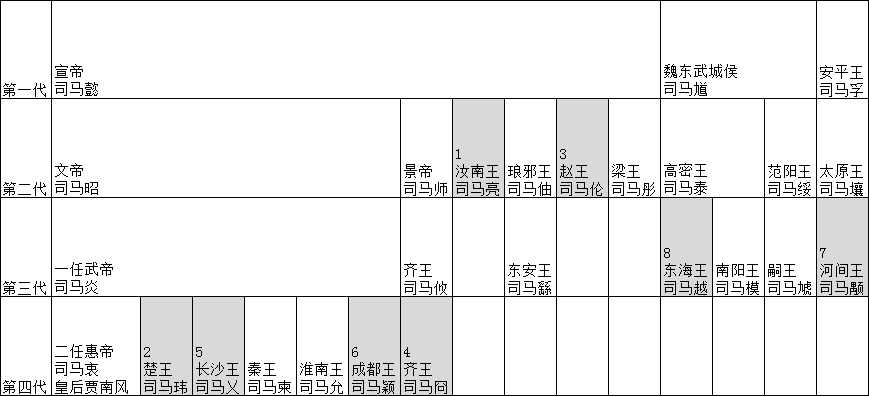
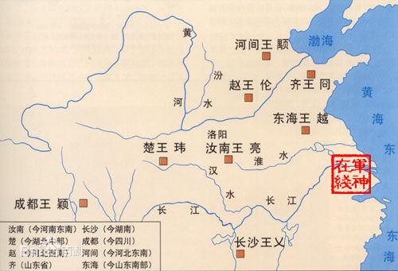

西晋皇亲国戚世系图
==================

> 注：实线为父母与子女关系（杨文宗与杨骏是兄弟关系），虚线为配偶关系，蓝色为八王，青色为皇帝及太子，红色为参于八王之乱的其他王，紫色为后妃及外戚

武帝司马炎布局
==============
- 外戚主持朝政；
    - 杨骏，杨珧，杨济；
    - 王佑领禁军
- 宗室手握兵权：
    - 司马亮许昌；
    - 司马柬长安；
    - 司马允寿春；
    - 司马玮襄阳；
    - 司马伦邺城

乱前权争
========

## 皇后贾南风与外戚杨骏之争
- 负 外戚杨骏、皇太后杨芷、杨珧、杨济
- 胜 皇后贾南风、汝南王司马亮、楚王司马玮

晋武帝死后，杨骏排挤汝南王司马亮单独辅助晋惠帝。皇后贾南风也欲夺权，让楚王司马玮带兵进京，杀了杨骏。

后党之争
========

## 党同楚王，击杀托孤
- 负： __*汝南王司马亮*__、元老大臣卫瓘
- 胜： 皇后贾南风、楚王司马玮

杨骏被杀后，朝政大权由司马亮与卫瓘共同执掌，但贾南风对未能独揽政权不满意，串通司马玮杀了司马亮及卫瓘。

## 兔死狗烹，牝鸡司晨
- 负： __*楚王司马玮*__、岐盛
- 胜： 皇后贾南风、张华、裴頠

司马玮杀了司马亮及卫瓘后，贾南风对司马玮也很忌惮，以司马玮伪造手诏的罪名处死他。然后独揽大权。

## 贾南风计除司马遹，司马伦夺权称帝
- 负： 皇后贾南风、张华、裴頠
- 胜： 赵王司马伦、孙秀

太子司马遹非贾南风亲生，且二人一向不和。结果贾南风设计诬赖太子谋反，杀害太子。赵王司马伦借杀太子的罪名，先废后杀贾南风。司马伦掌握大权，废司马衷称皇帝。

诸王异志
========

## 三王举义，齐王揽权
- 负： __*赵王司马伦*__、孙秀、淮南王司马允
- 胜： 齐王司马冏、河间王司马颙、成都王司马颖

赵王司马伦废皇后贾南风、其谋士孙秀专权，淮南王司马允心知司马伦有篡逆之心，所以称病不上朝，密养死士，欲诛杀司马伦，被伏胤所杀。

赵王司马伦称帝，人心不稳。在许昌的齐王司马冏，联合关中长安的河间王司马颙，邺城的成都王司马颖乘机起兵讨伐司马伦，司马伦兵败被杀

## 李含煽谋，长沙险胜
- 负： __*齐王司马冏*__
- 胜： 长沙王司马乂、河间王司马颙

翊军校尉李含携私（谋欲并去乂、冏，使权归于颙，含因得肆其宿志）由洛阳逃回长安，矫诏劝河间王司马颙除掉当朝的司马冏。302年（太安元年）底，司马颙经一番利害考量后答应，上表陈述司马冏的罪状。兴兵讨伐首都洛阳，声称当时驻军在洛阳的长沙王司马乂为内应，司马冏得知消息，派遣其将董艾攻袭乂，乂连同其党羽百多人，乘车飞奔皇宫，以奉天子的名义攻打冏。火烧司马冏府第，冏战败被杀，其子被囚禁于金墉城，冏党羽被灭。

## 诛除司马乂，司马颖揽权
- 负： __*长沙王司马乂*__
- 胜： 成都王司马颖、卢志、河间王司马颙、张方、东海王司马越

司马颙不甘司马乂独揽政权，与司马颖共同兴兵讨伐司马乂，司马乂获胜。朝廷任职的东海王司马越乘司马乂军疲惫，夜捕获司马乂，落在河间王的部下、杀人魔王张方的手中，被“炙而杀之”。司马颖独揽政权，废太子成为皇太弟，但其作风又令其他野心家有了借口。

司马颖在讨伐长沙王司马乂的时候，任用陆机（祖父陆逊为三国名将，曾任东吴丞相，父陆抗曾任东吴大司马，领兵与魏国羊祜对抗）为后将军，河北大都督，率领二十多万人。陆机与挟持了晋惠帝的司马乂战于鹿苑，大败。宦人孟玖等向司马颖进谗，陆机遂为司马颖所杀。弟陆云、陆耽也随后遇害。

## 荡阴兵败，胁持天子
- 负： 东海王司马越
- 胜： 成都王司马颖、卢志、河间王司马颙、张方

晋惠帝以东海王司马越为大都督，云集10多万士兵讨伐司马颖。司马越大败，晋惠帝被捕后送到邺城，司马越逃回东海。另外司马颙大将张方进驻洛阳。

引胡参战
=========

## 援引鲜卑，退据关中
- 负： 成都王司马颖、卢志
- 胜： 河间王司马颙、张方

司马越战败后，其亲弟司马腾结合异民族乌丸、羯朱等势力大败司马颖。司马颖放弃邺城与晋惠帝逃到洛阳，洛阳守将张方又把二人挟持到属于司马颙的长安。司马颙废司马颖的皇太弟地位，遣其回封地，独占大权。

## 东海迎驾，河间流亡
- 负： 河间王司马颙、张方
- 胜： 东海王司马越、范阳王司马虓

司马越再次集结大军，讨伐司马颙，司马颙应战，大败。司马越接晋惠帝回洛阳。

司马颙非常恐慌，于是命令张方的亲信将领郅辅夜里暗杀张方，然后派人把张方的头颅送到司马越军中，认为这可以平息祸乱。而后司马颙又后悔，怪罪郅辅杀张方，又杀了郅辅。

## 河北剧变，成都归天
- 负： __*成都王司马颖*__、卢志
- 胜： 东海王司马越、范阳王司马虓

司马颖兵败后被捕杀。司马颙的部下杀了留守关中的梁柳，扶持司马颙意图东山再起，结果战败，只保有长安一城。

## 傀儡怀帝，东海擅政
- 负： __*河间王司马颙*__
- 胜： 东海王司马越、南阳王司马模、梁臣

惠帝突然死亡，晋怀帝司马炽继位，下令司马颙回朝廷，司马颙被南阳王司马模所派遣的将领梁臣掐杀死在车内。他的三个儿子也被杀死。司马颙就此绝后。东海王司马越最终在八王之乱中得胜，掌握中央政权。

五胡乱华
========

- 元康六年（296年）八月，秦（今甘肃天水、秦安一带）、雍（今陕西关中及甘肃东部）的氐、羌推氐帅齐万年为“皇帝”；
- 永康二年（301年），散骑常侍张轨求为凉州刺史，“阴有保据河西之志”，而自316年晋愍帝降汉国、西晋亡后，当时的前凉势力统治者张寔保剧凉州河西之地，虽向晋王司马保、东晋称臣（正式册封要迟至东晋咸和八年），但其半独立的态势、实际割据凉州的野心立场不容否定；
- 太安二年（303年）正月，蛮人张昌据江夏（今湖北安陆）拥立丘沈（后改名刘尼）为天子，建国号“汉”；
- 永兴元年（304年），氐人李雄在成都称王，建国号为“成”，并于两年后称帝；
- 也是在这一年，匈奴刘渊在左国城（今山西离石东北）称汉王，国号为“汉”，并于308年称帝；永兴二年（305年），右将军陈敏据江东叛，自称楚王。
- 此外，后来建立“前赵”的匈奴人刘曜、建立“后赵”的羯人石勒、开“前燕”之基的鲜卑人慕容皝等，都经过这场战乱的锻炼，不断成长壮大起来。
- 五胡”指匈奴、鲜卑、羯、羌、氐五个胡人的游牧部落联盟。百余年间，北方各族及汉人在开启华北地区建立数十个强弱不等、大小各异的国家，开启了五胡十六国时期。