需求分析全局观
==============

- 系统中未被使用的功能占30%~45%，为什么？
- 如果软件工程中其它环境是保证“正确的做事”，则需求是“__确保做的事情是正确的__”

## 需求分类
### 多人应用
典型为"信息化系统"，更多角色，不同用户，更复杂的体现在它的业务

- 需求获取：需求沟通，访谈策略，提问技巧
- 需求分析：得到需求规格说明书SRS，是一个 __业务的分析__，而不是技术的分析（或系统的分析与设计）
- 需求管理：优先级的管理，期限管理，变更的管理，版本的管理与跟踪
- 需求规划：需结合企业高层战略，长生命周期，属于无中生有的过程
- 需求挖掘：更多时候提的挖掘一下，其实是需求分析不彻底，真正的挖掘主要指 __人性级__ 需求的挖掘

- 发起者（有没有发生）、出资人（投资回报）、所属者（推动者）
- 干系人：关注点、阻力点
- 行为需求：业务支持（流程、业务场景）、管理支持（管理场景[核心是把数据进行信息化{报表 BI DM/DW}，以助更好的管理与决策]、行为规则）、维护支持（维护场景[日志、初始化、数据迁移，可以标准化]）
- 数据需求：关系（构成、推演）、数据规则、（定期存款怎么玩、手机短信的组织[对人还是对号]）
- 非功能需求：质量场景、设计约束（反对定性，反对盲目定量）

### 单人应用
如手机上的APP，更多强调使用场景与用户体验

- 用户研究：用户群比较散，找到自己的客户
- 产品需求分析：体验设计（严格来说是不需求，但对产品又至关重要），用来配合满足 [右脑] 需求
- 产品规划：产品规划

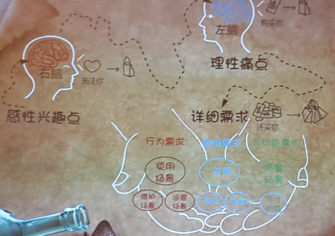

- 产品需要把握关键需求(痛点)，不要面面俱到
> 买实体书的痛点是什么？书架放不下，携带不方便，以为在火车上会看一本专业的书，但到时候想看的却是适合右脑的书[人过高的高估自己 心理]，kindle有了被接受的理由，而ipad之类的，应用太多，容易分散思维；大企业中根据根据人找电话不是痛点，根据 事/场景 找人才是痛点

- 使用场景分析
> 手机短信批量删除（所有不在联络人里面的短信删除，把超过一个月短信删除）

- 人性弱点分析
> QQ头像云，骄傲的需求大于贪食的需求；QQ棋牌10Q币可踢人；QQ秀扒得只剩裤叉

- 用户的视角
> 如何批量修改word中某种字体，查找替换（功能视角，程序员视角），更好的视角应是，字体替换（用户不会想到在修改样式时会查找替换）

- 【心理】工业设计[右脑/外观颜色质感]、易用性（是认知心理学 格式塔原理）、产品负需求

- 工作与娱乐
    1. 工作软件，复杂问题简单化，从一而终163邮箱还在用。360杀毒所以免费，只是简化找注册码过程（因为付费杀毒用户也一直在找注册码，而找注册码是一个痛点），同时，如果360杀毒不会漏掉其它杀毒软件能杀的，作为工作软件，用户的切换的可能性就小了。
    1. 娱乐软件，简单问题复杂化，喜新厌旧开心网偷菜，商业模式还没起来，用户就不玩了

- 产品周期：主动认同、早期认同、大众用户、盲从用户
> 小米手机对1999的定价，挤走山塞机，毕竟有品牌，目前小米电视是想干掉TCL、康佳

- 【技能】使用场景筛选：
    - __不同意图__：卡片机卡西欧自拍神器，参数很烂，价格很高，是不是自己不重要，重要的是漂亮，像自己就行。
    - __不同时间__：tcall机，早上显示天气，晚上显示注意事项，有人敲门判断是否是通辑犯，周末显示附近餐馆打折
    - __不同地点或环境__：户外，城市，海边（三防）
    - __不同周边__：三星note女的用得多，需双手操作（男士用不惯），有包

- 认同一个品牌，是对一个产品的全功能的体验中得到一种愉悦，还会下次购买(ios的稳定性的认可)

## 视角

### 什么是需求
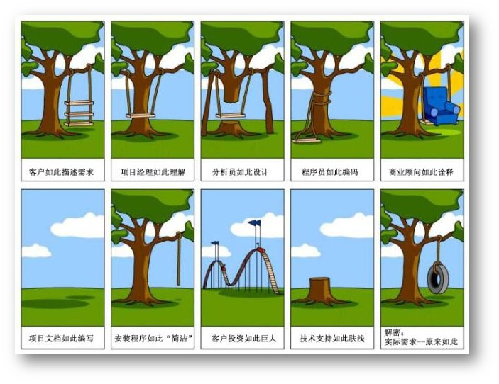

其中项目经理指代需求分析（2000年时美国的项目经理身兼需求与架构）

- 最右下方是用户的内心需求，第一张是用户的描述，居然出现了差异
    > 为什么用户的想法与说法不一样呢？一样才怪！参考[用户陈述需求时的三个障碍](#TOC1.2.2)

- 项目经理的理解出现差异
    > 挂这么多块板，断掉怎么办，得想一个架构，一边挂一个。需求人员过早技术思维，不易判断用户真正需求

- 分析得到匪夷所思的设计
    > 我们要采用spring，可扩展性高，更因为我们学了还没有用过

- 程序员说要绳子有了，要木板也有了，这不是用户想要的吗
    > 说表结构是什么样的，界面是什么样的，不就是带着一定业务规则的增删改查吗

### 用户描述需求三大障碍
#### 【心理】放大需求
> 【练习】买衣服时，开价500，心理预期300，如何还价？如果你还价到150，店主马上说成交，心理感受如何？如果你还价到150，店主不同意，双方多次交涉，280成交，你感觉如何？

- __信息不对称时，倾向放大自己的需求，万一对方做不到，至少能达到自己可接受的，留下有利于自己的缓冲区__
- __谈判时过程胜于结果，针对用户的变更请求答应太爽快，用户反而觉得亏大了，容易提出更高要求的需求。__ [如何管理用户心理预期]

#### 【思维】从来不讲“为什么”，直接讲“解决方案”
> 【案例】表妺买手机时，第一不要诺基亚，第二不要直板。最后买了诺基亚E61

- 买手机已指定到品牌与外观，这已经是解决方案域了，为什么不要诺基亚？因为是白菜机。为什么不是直板？许多同学都在用。真正的需求是一款与众不同的手机。

> 【案例】小的时候直接说饿，然后说我要吃饼干，现在说饭怎么没做好

> 【案例】"我们的系统还要全面提高服务质量！"，"应该在哪些方面呢？"方方面面！"（无效信息） 参考[表现原因决策](#TOC2.2.2.1.1.2)

- 【思维】__随着年龄增长，学历增长，职位增长，会不断对原有问题抽象，直到言而无物。__

- 【思维】__一切以解决方案陈述的需求都是不准确不完整的，以它为需求，容易出现较大偏差。__

- 【心理】直接去询问他人“为什么”，背后表示否定、置疑、拒绝的意思，容易生气，合理的方式是【技能】“__您希望通过这个解决什么样的问题？__”

- 对于第一第二个障碍，【技能】__多问why，还原业务场景__

> 另一示例，仓管审批需要原始审批申请可编辑（用户提出的不合逻辑的解决方案），原来是可编辑后可选择上物资料号，方便复制，再查询库房中存量，防止浪费（用户真正原因）

#### 【思维】零散
> 【案例】今天晚上吃什么？随便。

> 【案例】做为xxx，你希望系统做xxx，以便于达以xxx价值(基本上用户讲不清，用户故事的不适应复杂业务系统)

- 【技能】__分而治之，结构化提问__，问题拆得足够细，利于用户回答

- 不能问多元问题（晚上吃什么？包含主食吃什么，菜吃什么，要什么酒水，要不要甜品），容易没有角度，用户不容易回答，一定要问单一线索的问题（晚上吃什么主食）

> 【练习】问一位女士要什么样的衣服？（衣柜里有什么品牌？最多的款式是什么？角度错了！用户记不清的或这是男士的角度。你需要什么样的衣服？回答好看的性价比高的。全是无效信息！）参考[内容树提问](#TOC2.2.2.1.1.1)

### 用户需求三层次
需求分析要从want做到need(多问why)，而产品经理要从need做到win(趋利避害/人性分析)

#### WANT
用户的描述

#### NEED
用户的意图、价值，与系统无关（问到与系统无关时，基本上接近need，与系统有关都是want，是用户认为的解决方法）

#### WIN
趋利避害/人性分析
损失厌恶（丢了100再捡回，与捡了100再丢失，5元进场，升到10元，再到9元，会抛吗）

### 【方法论】需求三要素
- 【练习】有一个需求变更描述“在酒店管理系统入住界面上增加一个"酒店平面图"功能，实时的显示房态、房型、价格信息”。你首先想问什么问题？你还会从哪些角度进一步提问？

    - 项目管理角度

    > 给多少时间？给多少钱？（潜台词，如果足够钱多，3D都行），这些重要，但 __前提是一定要知道这件事对他的业务价值是什么__

    - 进行需求干预

    > 能不用平面图吗（在不知道别人要干什么时）？需要，这样能直观有效的完成我们的工作！干预失败！

    - 【思维】__how的部分，用户是没有感知的，无法回答的__

    > 你的房型是什么意思，房态是什么意思，我们用什么颜色还是文字来标识房态？越问越细，最后问到，这个平面图会关联什么功能？（越来越细，客户越来越没有反应，无法回答或瞎回答）

    - 程序员思维

    > 做出一个table表示房型的html页面，客户说你不能放大缩小平移，能叫平面图吗？需求人员再告诉程序员，要放大缩小和平移，程序员就把table放到一个iframe中，实现所要的功能。客户生气了，认为项目团队态度有问题。

    > 开发团队学习矢量图技术，完成了平面图，花掉五个人周。客户使用了一段时间，说，这功能一般，运气好时好用，运气不好时很难用。“为什么有时候好用，有时候难用呢？”，“你们知道我们要干什么吗？”客户反问

    > 以程序员思维来开发系统，相当于打游击的装修队，吊顶时，客户说高了，好，低一点，低了，好，高一点。

    - 能否提出下面的点

    > 需清楚：谁提出（需求本身背景）？谁用（who）？解决什么问题（why）？什么场景（context）？现在怎么处理的/没有这个功能有什么问题（现状）？术语定义（data）？什么界质（PC/手机）上使用（非功能需求）？验收标准？

- 【练习】假如你要做一个小板凳，你怎么描述你的需求（角色换位）

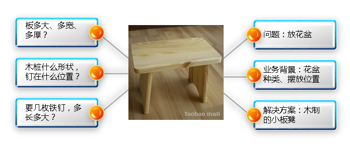

> 要一个木板，底下钉两个钉子。讲的需求不够细，还需要细化。所以继续问：你的木板多大、多宽、多厚（此问题是托问的，其他人被他带入沟）？最后问的全是左侧的问题

> 正确的方式是右侧的方式，但故意隐藏了两个问题：养宠物吗（可靠性需求）？你家孩子多大（安全性需求，而不是直接问你的安全性需求是什么）？[认知心理的应用，故意隐藏再说出来，容易记住]

- 【练习】访谈录音，回放，思考如何更好的提问与引导用户

以下三要素，适合于小型需求，与需求变更

#### 澄清问题why
用户看到的表象是什么，现状是什么，要不要精确的定义（如下面的“挨着”）

##### 表象原因法

参考[表现原因决策](#TOC2.2.2.1.1.2)

有两个客人要找相互挨着的房间，找不到。那你原来是怎么处理的呢（问现状）？查询加记忆和询问楼层服务员做到。什么叫“挨着”？对门算不算？斜对门算不算？隔一间算不算？两个房间距离小于3M为完全满足要求，5M为可以接受，10M为可以推荐。所以需要的平面图是用来做这个用的，但还需要操作人员每层平面图去查看，运气不好时，会查看多个平面图才有适合的

##### 限制与范围

提问基于 __内容树__，而不是构思问题列表（预先罗列好所有问题，有可能匹配不上）

#### 了解背景context

##### 业务场景
__场景是功能需求__

谁？ 什么时候？ 怎么做？

##### 业务术语
__术语决定数据需求__

“房态”是什么？【心理】如果怕别人认为你什么都不懂，【技能】"您对“房态”是怎么定义的/在你这块业务中，“房态”是怎么定义的"（不是我不懂，我是怕你的定义和我的不一样）

##### 业务环境
__环境决定非功能需求__

使用频率如何？多少层？每层多少房间？有没有分支机构？（扩展性需求）

不做谁生气（请写出职位）[需求的优先级]，多久生气一次？[频率]

#### 解决方案what
建议并确定解决方案，我们才是方案的专家，不要被客户带偏

##### 问题解决

最后给出方案，这个用查询就可以了，不需要平面图。不行，平面图更直观！

建议用户方案时，【技能】__站在用户立场__，而不是你的立场（查询就能解决，平面图开发麻烦，得不到用户同情）。“您就不要辛苦的自己看，让系统自动告诉你”，“当然好了”

【心理】__千万不要碰到客户的尊言__，必须按他说的做，否则没面子。说服他时，下属最好不在，先赞同他的方案，再单独沟通（比如用户要在显示入口加一个长时间的flash，可引导他去看一个视频网站的广告）。

##### 成本合适
平面图里要不要显示有没有大衣橱？要不要显示离楼梯远不远？要不要显示噪音大不大？用户说好啊

你一挖掘，用户都说OK（要的要，不要的也要），不挖掘又怕将来不能扩展。【技能】对策是，__只挖掘问题，不挖掘方案__。【心理】__用户对于没有成本的东西，是不会拒绝的__

挖掘问题的技能是：【技能】__同类场景横推__，在入住时，除了客人会提出需要挨着的房间，还会提出什么样的要求。哦，有客人会要求不要吵的房间，这时再考虑要不要给他解决方案，在架构与设计的时候可以加入这些考虑

## 流程

### 需求工作任务集
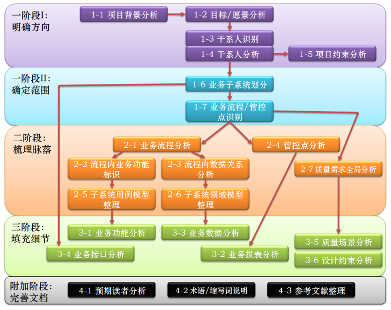

四条主线（价值线、功能线、数据线、质量线），一个细节

需求分析的23个任务集，一阶段在立项前，甚至合同签订前进行；二阶段主要是需求大规模调研，考虑功能、非功能、数据需求，不要陷入无细节；最后进入细节

## 产物

### 文档的价值
1. 空间维度是沟通
    1. 沟通是给他人看的，必须方便他人阅读
    1. 如果客户在我们的身边，只写要简单的要点；如果客户在我们的隔壁，我们会在要点的周边加上注释；如果客户在电话才能找到的地方，我们会选择更好详细的描述
    1. 沟通的距离越长，需要的细节越多
1. 时间维度是维护
    1. 太微观不可行，源代码就是设计 vs 规范整洁的电路板就是最好的设计
    1. 需要高层的设计意图

### 需求规格说明书
常的情况是，按开发的程序结构来整理的，而不是用户的视角来整理的

需求规格说明书，要思考我们为什么而写，不是符合某一标准，而是需要符合下游读者的预期，标识出具体用户阅读哪些章节，需要什么回馈

CMMI将需求分为用户需求与产品需求，I代表集成，用户需求有可能超越软件

本示例是合一的：[T-R001-软件需求规格说明书.doc](../data/T-R001-软件需求规格说明书.doc)

- 第一章 文档概述
    - 编写目的：指出具体用户代表，指出每个用户阅读重心，哪些需要反馈
    - 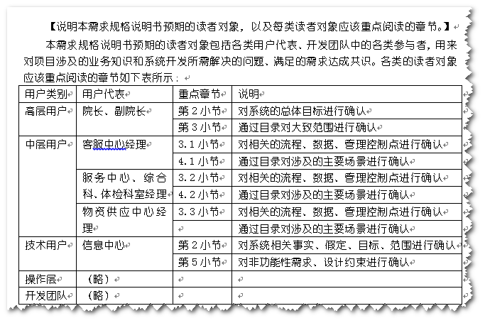
    - 项目背景：谁提出、关键预期、遗留系统、业务关键假设、技术假设
    - 定义：术语表（用户看不懂的缩写词与专业术语），一方面是给客户看的IT术语，另一方面是给开发看的业务语术，帮助阅读文档，以澄清歧义，非全罗列
    - 参考资料

- 第二章 任务概述
    - 读者：高管、架构师
    - 项目目标：分成多个小节，每个小节是一个问题，高管直接看目录即可获知关心的问题。所以标题就有讲究：__结果态(做完后的结果)、业务态(业务角度,不要细节)、价值态(体现出价值)__。
    - 项目目标中每个小节内为IOP的 __问题卡片__(讲故事)，编号部分用于需求跟踪，特殊问题可通过 __鱼骨图__ 等表达
    - 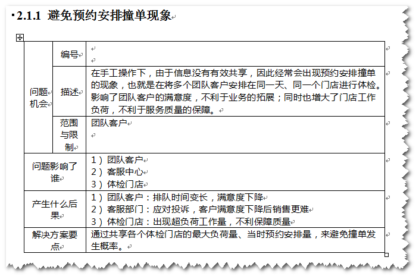
    - 干系人分析（相关度与影响度只内部看，不给用户），关键干系人少胜多
    - 干系人的核心关注点也需要__结果态、业务态、价值态__。具有验收的价值
    - 项目约束：进度、预算、资源等方面的约束

- 第三章 业务分析
    - 读者：中层管理、架构师、设计师
    - 子系统划分，构件图
    - 业务流程分析，流程分析活动图，业务数据领域类图，业务场景用例片断
    - 管控点分析，报表/数据挖掘需求

- 第四章 具体需求
    - 读者：基层操作员(end user)、设计师、程序员
    - 汇总用例模型（根据第三章用例片断汇总为每个角色的），每个角色的每个用例进行详细的用例描述、界面原型、界面流转，即本章节，再以角色作为子标题进行划分
    - 领域模型完善
    - 子接口需求

- 第五章 非功能需求与设计约束
    - 读者：架构师

### 需求价值树

目标是什么、干系人的需求

### 需求分解树
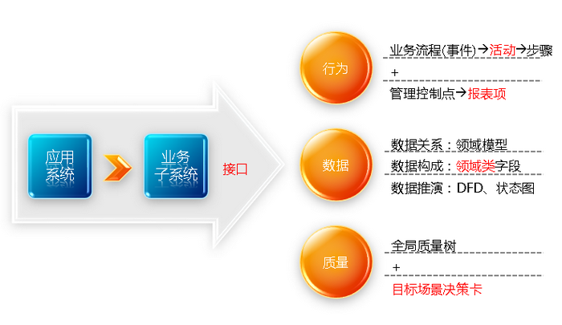

行为需求：【思维】挑战是打破功能思考(ps中高斯模糊) 进行用户场景思考(美图秀秀中美白)
    > 丑他一下，打开，最近十大丑境，把他置于其中

数据需求：关系与构成

质量需求：【思维】逆向思维

### 需求基本元素
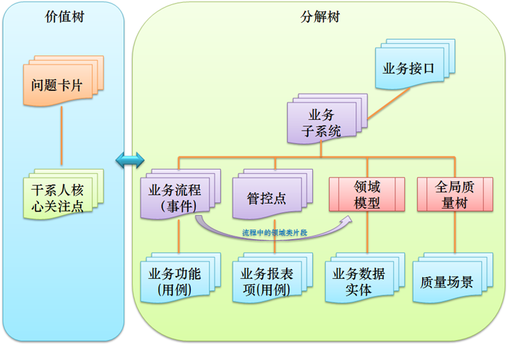

价值线：定义项目
================

## 分析背景
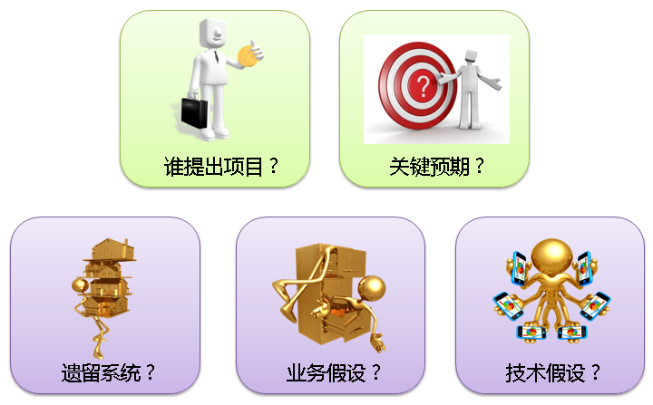

## 锁定目标
### 目标分析
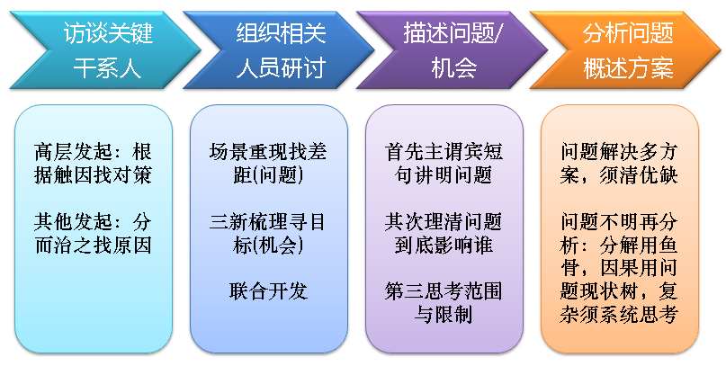

如上图，访谈干系人、与专家进行研讨、描述问题与机会、给出解决方案

- 【技能】需要对目标进行 __场景化分类__：不要说全面提高管理水平服务质量，干脆告诉我要解决什么投诉。更具体，更场景
- 【知识】需求公式："预期-现状=需求"
    > 父母辈对吃的预期小于现状，在家吃得好好的，干嘛要出去吃，但叫上他们的朋友就不一样（你看我儿子多孝敬我）精神层面的预期高于现状

- "预期==现状" 就没有需求，【技能】这时需要创造新的预期(预期管理)，否则就没积极性
- 【心理】当人类的趋利的可能性小于避害时，选择避害。
    > 原来的系统界面挺好，不要改（避害）。说我们界面一定比旧系统的好看，没用，看不见的东西可信任度低，趋利的心没出来。可以找出几个不方便的操作场景，做为突破，让新系统界面友好体现出来（做出来，被看到，加大趋利）

### 解决问题与创造机会
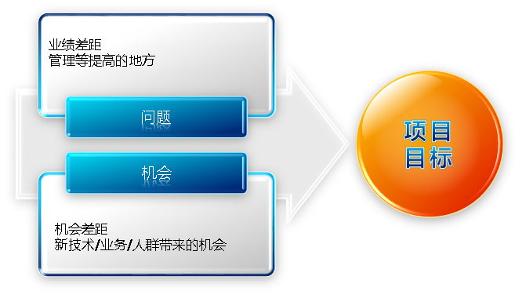

#### 【技能】解决问题
可通过通过访谈、调查收集、沟通得到

##### 想得清的问题
需要练习提问技巧：

###### 分而治之/内容树
当遇到用户想说，未必说得清楚的时候使用。

> 问一个女士需要什么样的衣服？“好看，漂亮，性价比高的。”（无效信息）

1. 通过发散思维，考虑女士选衣服时的关键点（颜色、款式、价格、质地、场合、品牌、搭配、撞杉、自我认知）
1. 将关键点进行分类，形成内容树，形成以下三类：（自我认知）、（场合、搭配、撞杉）、（颜色、款式、质地、品牌）
1. 根据内容树进行发问：
    - 自我认知：最后看什么电视，你最喜欢的明星是谁？
    - 场合、搭配、撞杉：你要衣服是上班、旅游、开part？搭什么包？
    - 颜色、款式、质地、品牌：最后理性判断 你认为什么样的衣服是贵呢？

具体怎么分，需要一定的训练与思考：分阶段、分主题、分职能、分场景、分业务

###### 表象原因决策法
顺了开心了就说，属于心理学范畴。一果可能多因 一因也可能多果。人的大脑的反映一般是观察一个表象，分析其中原因，做出相应决策。关键是还原表象，分享原因，共商决策。

> "我们的系统还要全面提高服务质量"

1. 进行思考：他说的是决策，为什么要提高呢，因为不满意，怎么知道不满意？
1. 进行发问（还原原因）："您是怎么评价服务质量？"。"我们可以走到客户身边，可以查看客户的投诉，甚至是家人的反馈"。"那你有没有走到客户身边或查看客户的投诉或有家人的反馈？"。"就昨天，我老婆办了个业务..."
1. 共商决策：“您希望我们怎么来帮助你呢？如果我们将这样做，是不是有帮助呢”。【心理】不要提系统已经有这个功能了，客户会说还需要根据情况再做修改

"要提高系统的扩展性"。进行思考：扩展的对立面一定是变化。进行发问：“未来你们的客户群、业务群、管理模式有哪些需要发生变化的？”

###### 碎片重组
由于特殊原因，打死了也不说。需要构思提问，通过【参考】情报学，将用户回答推导出来

你关心孩子早教吗？（非常关心 比较关心 一般关心 不关心）选B的最多（无效问卷）

从能不能记得还房贷时间，实际问的是收入

问你到最近早教的距离，实际问得是对早教机构的关心，是否有去过

你如果还记得这个游戏，你就老了，年龄被暴露

###### 场景铺垫
慢速，让人的思维回去（朱军，艺术人生）

7岁那年，你和你的爸爸来到一个山清水秀的农村，那里虽然景色优美，可是一穷二白，你呢，在一个非常破旧的房子里开始了你求学的第一年，在那一年你...

你每天都用什么app vs 每天早上每你的闹钟叫醒，懒洋洋的起来，这时候你会使用哪个app

给一个场景，问问题会方便些

###### 案例
[需求分析技能训练营案例手册.pdf](../data/需求分析技能训练营案例手册.pdf)

案例资料1-2 院长访谈记要，结合使用分而治之（表头）+ 表象原因决策法

##### 想不清的问题
想不清，还提方案，一般情况下是领导受刺激，主要有以下几个方面

###### 参观考查
对策是分享收获

> 你做个计划，我们明年投点钱，打造一个国内技术领先的信息管理平台。包括什么？当然是方方面面。您的预期是什么？不是说了吗，国内领先水平

> 领导，这次考查有什么心得呢

###### 对手动态
对策是做竞品分析

###### 市场宣传
对策是分享理解

> 老板说，要把我们的ERP改造成基于云计算的

> 问下老板，什么叫云计算，回答说是骗人的，写一报告，说系统是怎么的云，而不用改系统（老说自己不是云，面子上过不去）

#### 【思维】创造机会
机会不能通过上述的方式得到。福特问他人，你需要什么，需要一匹更快的马，他不会说要一辆汽车，因为他没见过，__用户没有感知__。机会需要研讨/创建。

##### 新业务
需要追标标

##### 新技术
赛同行，借他行

##### 新人群
人群分析（更有价值）。人口理论是人口统计学，各国环境情况，一个时代的人拥有不同的价值观。源于弗洛伊德（童年决定一切）

中国重大历史事件：1949、1966（文革）、1979（改革开发）、1990（改革开发深入期）

1. 1966年以前，保守、信权威、喜欢专家背书、相信电视购物
1. 1966~1979间（童年时政策朝令夕改），不信电视、不信互联网、过分责任心、只信自己、拼搏
1. 1979~1990间，处于计划生育时期，一般独生子女，相对温室中长大，听从父母，主见不坚决；相对70后的过分责任心，显得责任心欠缺，其实不然；是电子商务人群
1. 1990后，父母工作压力大，对孩子关心少，极强个人主见，不听父母，听同学；孤傲，一切讲性格，爽就行
1. 城市的85后像90后，农村的85后像79后
1. 79后，不喜欢带人进家里，去咖啡厅，不容易称朋友。90后第一面就是哥/姐/朋友。咖啡厅90后去的原因可能是贵，而不是做为交流场所，喜欢一起去K歌，回家开个party
1. 2003年电商暴发：79后+23(毕业)+1(稳定期)
1. 预测2015年点暴保险：79后+35(关注健康)+1，需要电子保险形式出现
1. 管理层的年龄变化，信息系统的需求也会变化，由务虚成为务实，从宏观管理到微观控制
1. 时刻保持好奇心，跟各年龄层次的人接触
1. 美国的互联网人群与中国不一样，不能直接复制

### 破解不清的目标

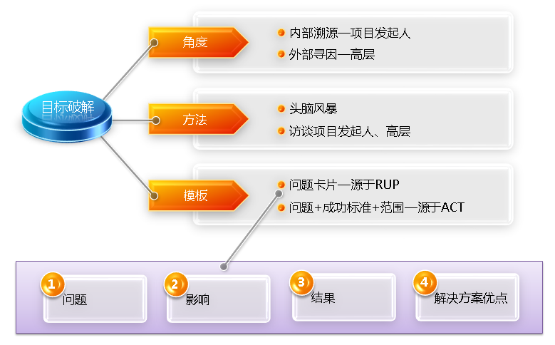

存在什么问题、带来了什么影响、不良后果、解决方案优点是什么

问题场景化：给客户讲故事（__关注成本与效益__），与它相关的另外两种方式：定性、定量，但定性太抽象，定量太具体，场景化最适合

【方法论】产物是“问题卡片”

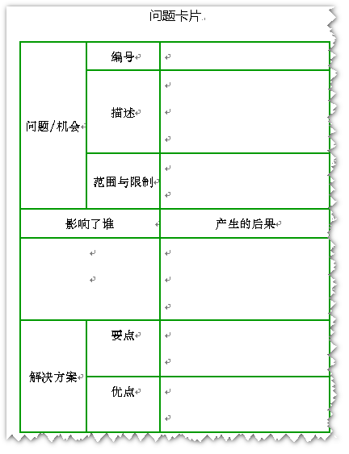

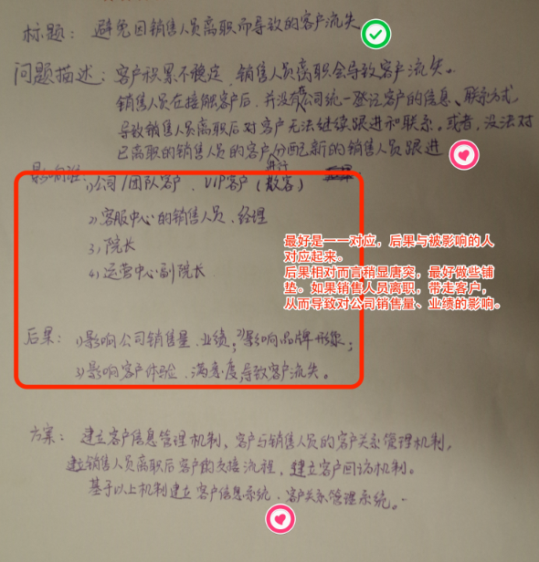

IBM一流的医生，三流的药品。中国很多团队，很好的药，没有医生，我们的药有人参冬虫夏草...

手机代理抓内鬼（效益降低），通过几张趋势报表说服老板购买

苹果不讲配置，只说把一千首歌放入口袋，讲生活方式

## 理清Stakeholder

### 项目 __博弈__ 中的筹码持有人

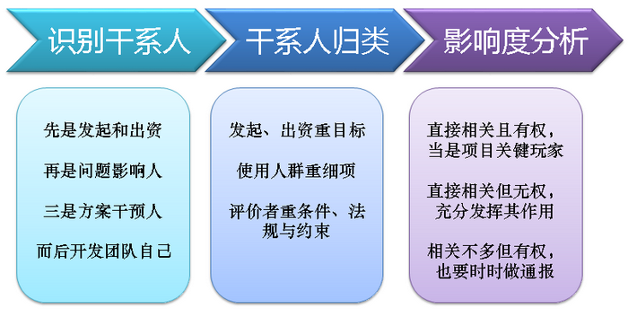

发起人（亲爸爸）、出资人（养父）、属主（干爹） + 使用者（找出权臣） + 评价者（财务、审计、法律、监管）+ 开发团队（如果采用新技术）

### 四种危险情况
除了三个爸爸，在使用者与评价者中，找出下列：

1. __侵权臣__：组织架构中识别权臣（不一定是职位、是影响力）
1. __犯众怒__：发生在基层，识别关注点（利）、阻力点（害）（真正原因可能并非系统原因，而是侵犯了他们利益，甚至是不能直接开口表达的利益）
1. __专家害__：两路专家各提意见，最后他们达成一致(相互面子过得去)，可开发惨了。各路专家不能齐聚。
> 专家说你好，没有用，说不好，就麻烦。"老专家，您真是我在这一行见到最棒的人，您的提议真好/有创意，但有个担忧。您这么多年宝贵经验放入系统，您的良苦用心，可他们有可能学不会，学不会他们会说，这个系统这么难用。我们做系统好多次了，被骂是常有的事，也习以为常，但连累您被骂，于心不忍。我建议先挑他们一定能用的而且发挥直接效果的，先让他们马上用好。当然您那么多年经验也不能浪费，先做成动画进行讲课。以后再依次做入系统中（达到平衡）"（【心理】所有反驳意见，先要肯定人家，但只能说一次，说第二次，他人检测“马屁”信号被激活）（先让专家避害后趋利）

1. __接口碍__（甲方接口人）："没想到，在甲方还有这么强的技术啊，我见过的甲方，没几个能力超过你的。不过有个担心，像我们这样的技术强强连手，技术上肯定没问题，要是业务上没有满足用户的要求，咱俩算是白干"。【心理】再列出详细的访谈计划：什么时候要访谈谁，需要反馈什么，表格我们设计，logo是他的，部门也是他的。"安排一下访谈，计划给您做好"

### 优先级和关注点
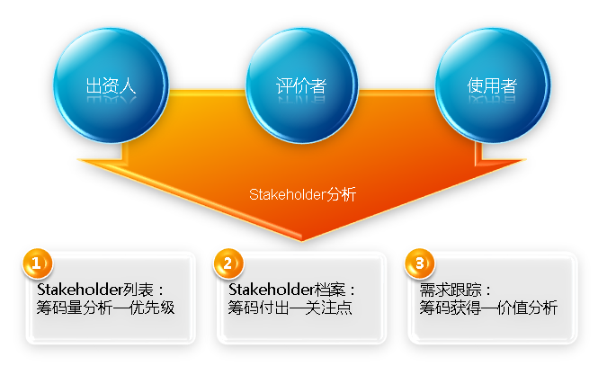

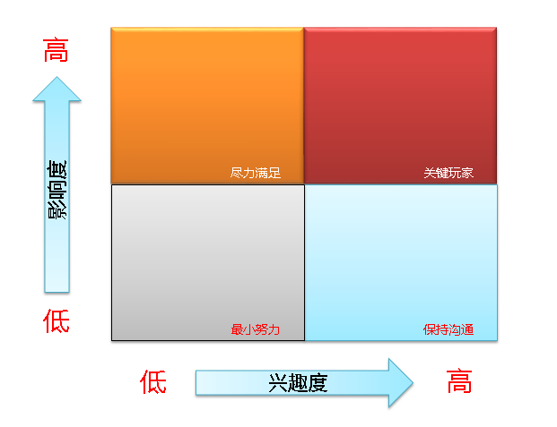

### 分析流程
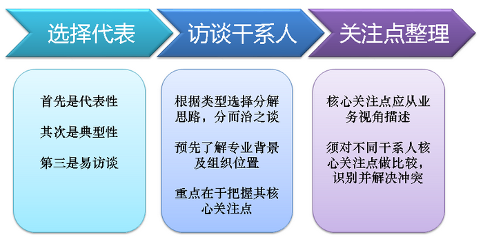

## 明确约束
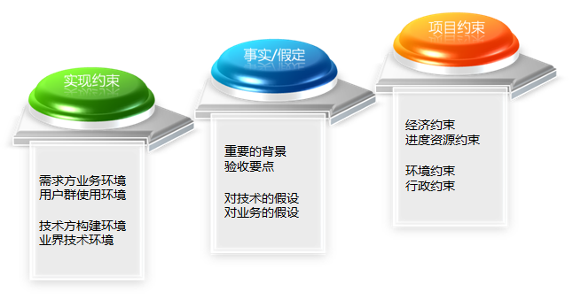

### 实现约束
需求方业务环境，用户群使用环境，技术方构建环境，业界技术环境。高管不会关心，列在SRS中的非功能需求与设计约束章节

### 事实与假设
遗留系统情况，验收标准，业务的假设（管理模式，业务模式），技术的假设，列在SRS中的项目背景章节

### 项目约束
预算的约束，进度的约束，资源的约束，法规的约束，行政的约束。高管关心，列在SRS任务概述章节中

所有的进度的约束，必须搞清deadline背后的原因是什么？典型几种情况以及当不能在deadline上线时如何局部交付：业务要上线（保证主业务）、法规、财务年度、某人任期、重大纪念日（做demo）

## 约束分析
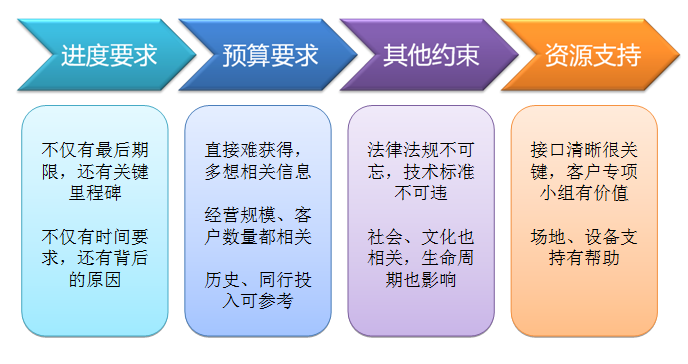

价值线：划定范围
================
传统划分：系统、子系统、模块、子模块、功能、功能点，需求不就是菜单结构吗。缺乏用户视图，完全是系统本位。典型例子是电话证券。

【思维】汽车驾驶位座椅需求，以驾驶者视角得出，自动调整以适合不同人驾驶，座椅加热，但以后排乘客视角，需要看娱乐时，在座椅上加上TV。所以同一模块会承载着多个的多个视角，当问用户，你这个模块有什么需求时，用户是不易回答的（模块逻辑，而不是使用场景）

推荐划分（以用户视角）：问题域，子问题域/业务子系统（业务场景、管理场景、维护场景）

## 业务子系统划分
### 子系统划分
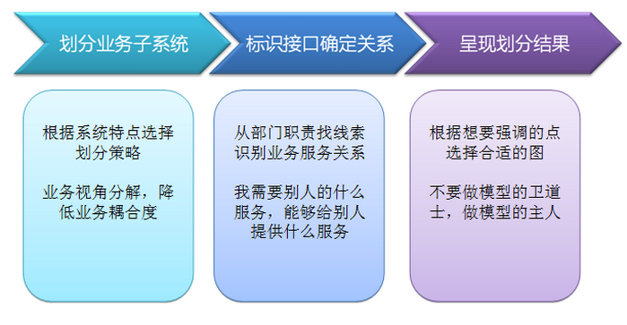

### 主题域划分原则
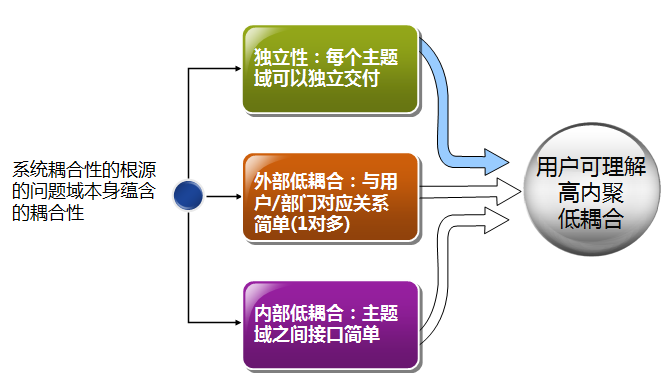

系统的耦合性有时在于业务的耦合性，如何业务解耦？

### 案例
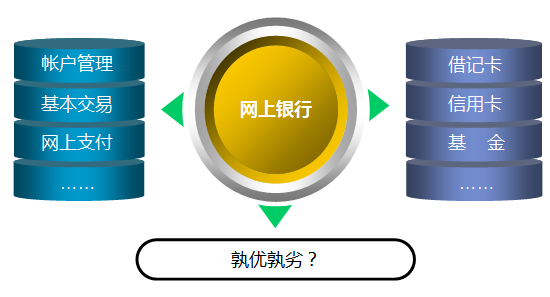

如果系统以左侧来构建，一个用户上去以后，会发现每个模块都有关系，又没关系

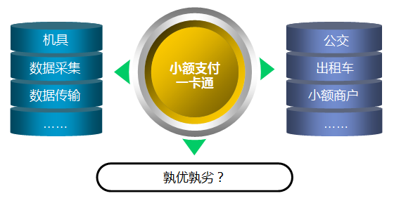

左侧的是功能视角，右侧的是用户视角，以用户视角做需求时，如果直接交付给程序员去开发，将是噩梦，中间需要架构师的存在，将右侧转换成左侧，以利程序开发

【方法论】__用例驱动、架构为中心、迭代增量开发__。用例能驱动需求、项目管理、测试，但没法驱动开发，开发以它为驱动将无法组织代码，所以应架构师将业务分解的结构转换成系统分解的结构，再由程序员以架构为中心进行开发。

### 划分策略
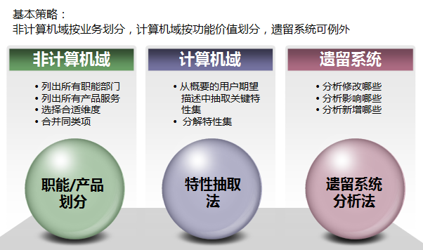

遗留系统中修改与影响的区分，修改会动源代码，而影响只需做接口或配置

针对信息系统，划分的思路：企业组织架构图（客服部、物资部、门店，本例中适合信息系统，得到系统范围与边界）、业务脉络图（体检：团体、个体，本例中适合网站建设）

哪里有分解，哪里就有接口

### 关于画图的意义
图永远只强调一个特征，而忽略其他特征，不要尝试在图上表现所有方面

1. 不是画构件图，是子系统划分
1. 不是画活动图，是做流程分析
1. 不是画用例图，是用户场景分析
1. 不是画类图，是讲数据规则

画图的场景：

1. 结构化设计（ __依旧适合针对数据处理的业务__ 如银证通）：数据流图强调数据处理，ER图
1. 人在系统中交互：活动图强调行为处理，类图强化了ER图
1. 人在系统中角色：用例图

### 呈现主题域划分结果
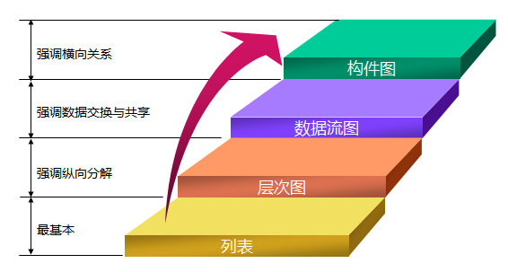

层次图，关注分解（父子关系），没有横向关系；数据流图DFD，有了数据横向关系；构件图，多了行为横向关系（调用关系）

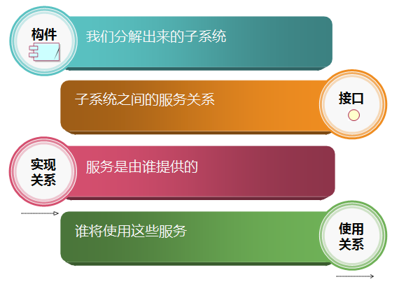

构建图表达的四个方面：有哪几个子系统，它们之间有什么关系，接口是谁来提供的，又是谁来实现的

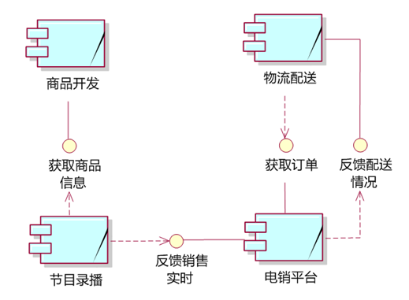

【技能】最好带上图例。在读图时，使用用户语言，考虑业务关系，而不是实现。

“在你的系统中会涉及四个问题域，商品开发、节目录播、物流配送、电销平台；由于节目录播要展现我们各种商品，所以它要向商品开发去要商品信息；节目录播时需要调节情绪，啊，这个东西又卖出去多少件了，我们还只剩下多少件了，所以电销平台需要向节目录播反馈销售实时；当电销平台卖出去商品时，由物流配送来获取相应订单，物流配送将送货情况再反馈给电销平台”

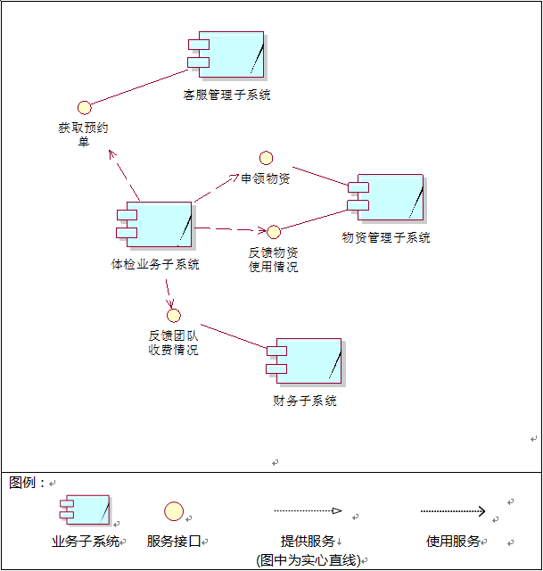

## 标识业务流程
### 流程规则与服务请求

见到两个傻子，一个人一直挖坑，另一个把挖好的坑填满，周而复始。第二天，看到另一个场景，有三个人，一个人一直挖坑，另一个在坑里放棵小树苗，最后一个把挖好的坑填满。这是种树的流程，第一天是因为放树苗的请假了，剩下两个 __干着本职工作__。

对于管理者而言，挑战是制定有效的流程的规则，是否可以被他人规避掉。机场只看容器标量，而不看具体容量，减少纠纷，提高通过率

下着暴雨，环卫工人依然浇水。规则制定如何场景判断，评估标准要可衡量。

服务的请求是流程的开始。如果要做出部门的流程，应该先标识出该部门的所有服务请求，端到端的服务请求，指从提出请求，直到请求被解决或拒绝的过程。

### 事件是梳理需求的关键
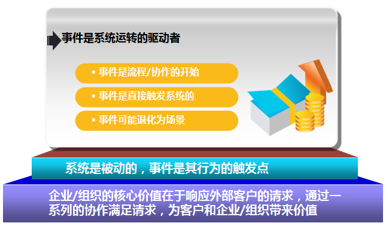

### 事件VS流程
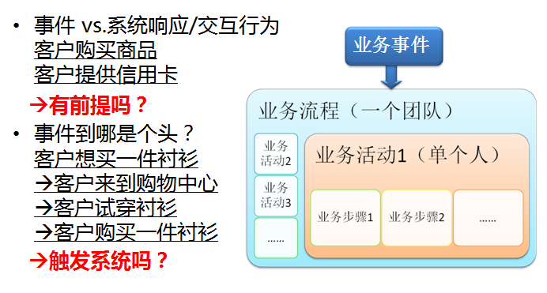

【参考】业务建模（BPR/BPD）：站在企业外更宏观的视角，能够优化与扩展系统边界。需要还原整个过程，有IT部分，也有非IT部分。建模时使用TOGAF、dsdm、EA、dodaf、ITL，而不是业务用例

需求建模：仅是站在系统外视角，考虑IT系统所需处理流程

### 标识流程
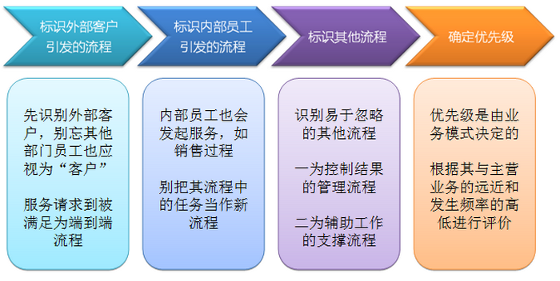

标识发起者：

1. 外部客户（客户，其他部门员工）
1. 内部员工
1. 特定状态（月末）

找到 顾客角度 汉庭门店所需要的服务（流程识别）：

1. 主体流程：入住到退房
1. 变体流程（没法画到主体流程中）：换房、续房
1. 分支流程：咨询、预订、办会员卡、代办业务、客房相关消费
1. 支撑流程：物资编码
1. 管理流程：酒店物资盘点、投诉

不能让客户划出的优先级，在主观（心理层面，我提出的需求怎么可能优先级不高呢）与客观（无法全局）上都无法达到公正。【技能】而要从 __全局角度，以业务模式__来分析它的优先级：

1. 它是不是 __主营业务__（入住到退房、换房、续房、客房相关消费、办会员卡）
1. 它发生的 __频率__ 高还是低（咨询、代办业务）

一个基金项目的迭代：
主要流程有：申购、赎回、查现值、定投、选分红方式、转基金、开户、销户、转入、转出。第一个迭代为主营业务：申购、赎回，但 __依赖__ 查现值、开户、转入、转出。即 __关键流程依赖的流程也被提升为同等级别__。但即使这样也不能完成时，考虑能交付的最小产物：申购，__依赖__ 查现值、开户、转入

除了排优先级，还能对项目进行估算，以流程报价，以及方便需求变更。

【技能】“他们到现在对你们流程还不清楚，他们对业务还没弄懂，我们虽然有这个产品，但我们向来习惯先理清你们有什么样的业务，然后有我们的产品去适配你，而他们那种做法肯定是拿自己产品来装你们的业务，装不下，你说怎么办，他们现在知道能装上吗，都到现在了，他们还没办法拿出流程，你觉得谁懂业务呢。而且领导您看，这些流程够不够完整您很清楚，他们那些模块够不够用，您怎么判断呢”

【技能】“领导，您的需求在哪个流程里？没有。没有就加一个流程哦”

还有种识别事件的方式：上下文关系图

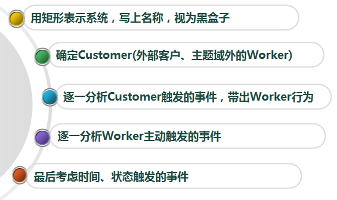

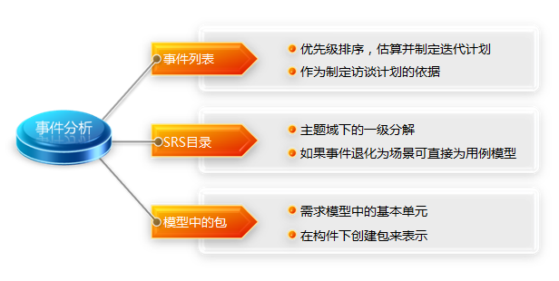

## 标识管控点
问报表有什么需求，其实很难回答，报表属于解决方案级的，需要还原why。

迟到报表的动机是 __评价员工的积极性__，“领导您怎么评价员工的积极性？什么样的员工叫积极呢，什么样的叫不积极呢？”，发现考勤系统可出的报表太多了：待薪事假请假排行榜、长假期间前后请假的概率、两张工卡在一秒内打卡的次数、一天之内出入的次数、一天之内不在办公室的时间

### 识别管控点
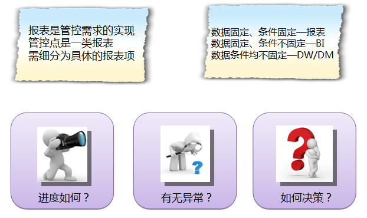

数据固定、条件固定称报表；数据固定、条件不固定称BI；数据条件均不固定称DW/DM；大数据与DM区别是大数据得到宏观的趋势，不可预知某人生病，但可预知某地区发病趋势

管理的层次：管自己、管他人、管理经理、管理部门（职能）、管理业务（多职能）、管理业务群（总监）

经营关注点：客户、产品、业务、渠道

管理关注点：事（进度、异常、趋势）、人（员工、供应商、外部协同）

【知识】所有报表、BI、DW/DM都来自经营与管理的需要

### 【练习】案例
管控点：
销量不是管控点，业绩才是管理意图，同时还包含成本、占有率、利润率；任务及时率，讲的是效率；投拆分类与解决不是，是客户满意率；事故率不是，质量才是

流程：
体检流程、咨询流程、改单流程、补打报告、VIP办理、投诉、变更体检人信息。交费、取报告等不算

功能线：行为脉络
================
## 流程分析
### 业务流程是分层的
画业务流程时容易犯的：

1. 画的是系统流程，而不是业务流程，许多术语是用户看不懂的，应画业务态
1. 画的是未来态，而不是现在态，所以用户也很难确认，应画现在态

流程是分级的：

1. 组织级流程，部门间的协作关系，高管视图
1. 部门级流程（需求一般要做到此层），岗位间的协作关系，不要在其中画个人级流程
1. 个人级流程，没有泳道，操作层视图
1. 子流程

当需要给不同层次的管理者看流程图时，上下不应超过两层

### 业务流程与业务功能
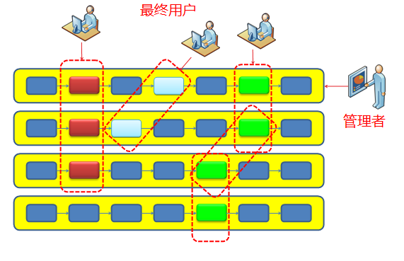

【知识】不要给中高层管理者看用例图，因为中高层关注的是横向的流程。而基层操作者并不关心流程，只关注自己要做什么，这时候可用用例图与用例描述，而如果这给管理者看到时，他的思维还是流程性的，看到用例片断时，会影响他的认知

### 业务流程八个要素
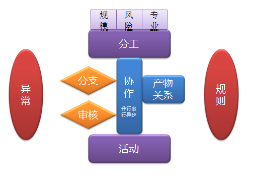

1. 分工：角色职责，原因是规模变大、控制风险、专业化
1. 活动：有机的分解，有价值的可汇报的基本单元
1. 协作：并行串行异步
1. 产物关系：数据流、职能边界
1. 分支
1. 审核：审核是特殊的分支。
    1. 严禁职位名称加上审核作为审核流（部门经理审核、总经理审核..），应描述 __审核的内容__（资金额度审批），因为职位的审批是可能变化的，导致审批流的变化，但审批内容却没有变化。
    1. 为什么要直接主管来批，其实是采购必要性审批；部门经理行使的是预算内审批；区域经验行驶的是超预算审批；为什么要仓库批，是因为买回来可能仓库已有，所以是采购必要性审批；为什么要IT中心批，因为可能参数不对，应为采购合理选型审批。
    1. 所有审批流都不是Yes或No的分支，审批的时候一定是一个 __行为__，它要的 __数据__ 一定是不一样的，它一定是在整个流程中要正确理解 __业务__，而不是程序的思维
    1. 老板是权力控，所有审批都要经过他，导致每天有半天时间在点详细，滚到最后，点审批再返回，后来加了一个批量审批，但效果不好，没有考虑到批量的量的 __使用场景__（小王审批过的，直接一把批量通过，小李审批过的，还要看一下，快到审批期限的优先批，钱到一万的需要批一下）
1. 异常
1. 规则

### 画流程图工具
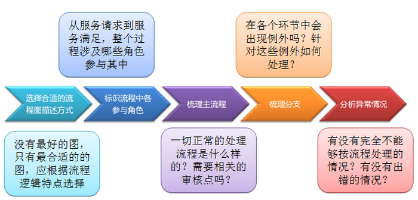

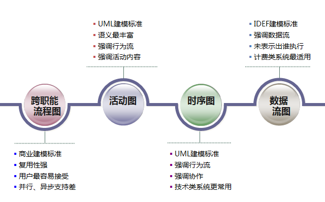

活动图更强调活动，而序列图强调调用与交互

### 画图注意点

1. 不要画细节，即 __不要个人级流程__；
1. 不要使用电脑工具，直接使用笔和纸；
1. 角色（部门/岗位/人员）的抽象层次要一致，不能混用；
1. 所有流程的起点从服务的请求者发出；
1. 站在管理者视角，即岗位间的职责，而不是客户的视角
1. 主从活动，只画员工的主活动，不画客户的从活动
1. 异步流程以信号机制（发出、接收）来表示
1. 确实需要文档时，文档放在流程的线上

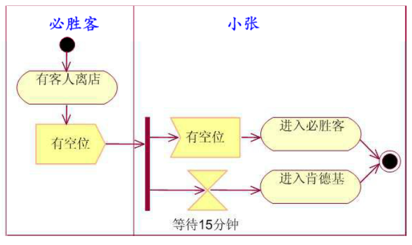

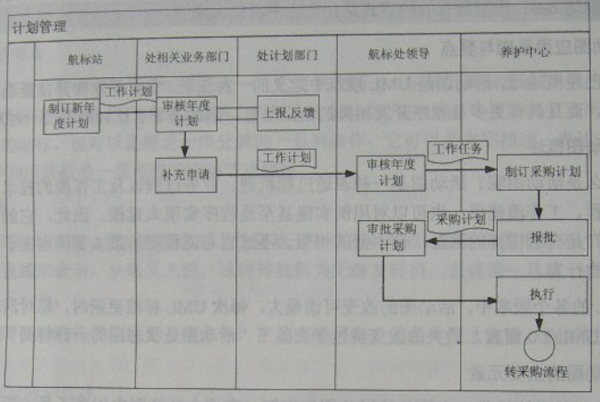

### 【技能】现场出图
如果回家再画，怎么去验证。

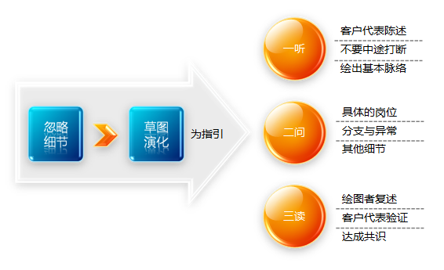

1. 一听的时候，某个流程描述时，全程时不能打断，即判断对方思维逻辑有没有结束
1. 二问的过程中，岗位、分支、数据/表单、规则、异常
1. 三读，让用户验证

### 流程合理性分析
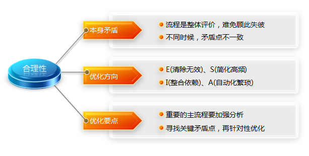

自动化繁琐，IT系统的主要解决场景，条形码，FRID

## 流程内业务功能标识

### 业务功能三载体
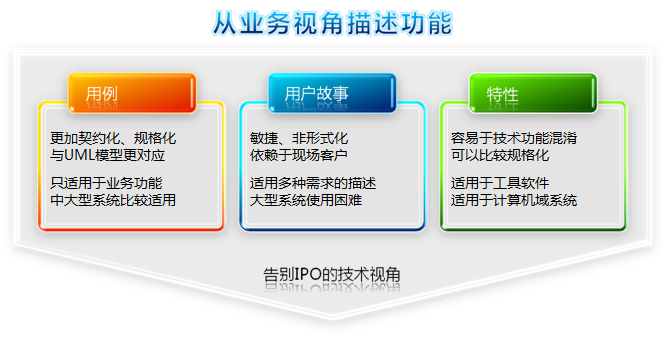

第三个是特征驱动开发(Coad Peter)，在获取需求时所使用

### 【方法论】用例的世界观
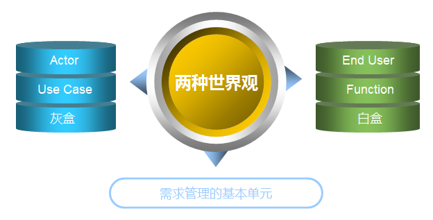

1. actor是代表着相对我们系统所扮演的 __角色__；
1. usecase是外部视角，强调价值与业务意图，function是内部视角，强调系统实现

### 用例精解
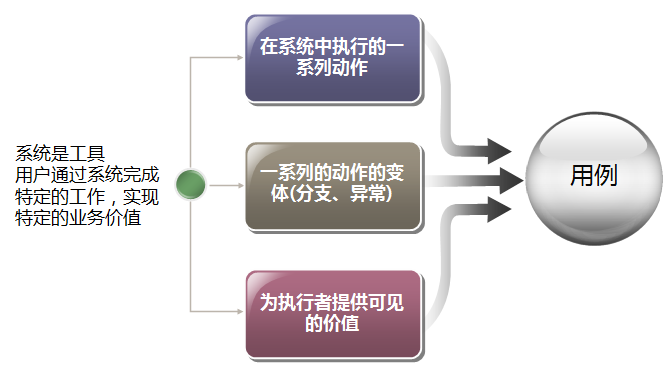

### 用例的误用(借尸还魂)
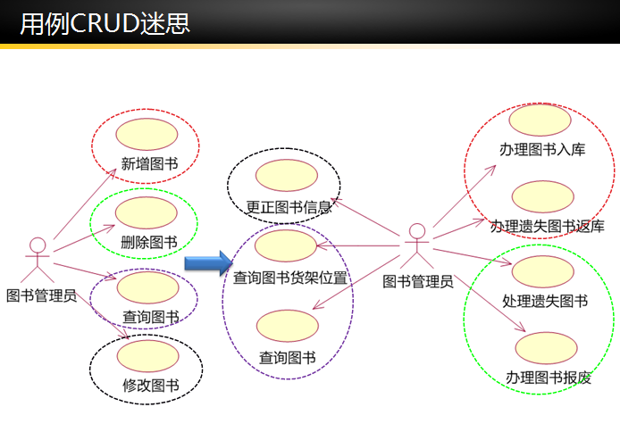

左侧的以用例来表达功能（CRUD），当技术名词作为业务动词时，将是假用例，同样一个修改，其实可能包含“更正图书信息”，“处理遗失图书”等多种场景。新增图书，什么情况下用户会新增图书呢，可能是“办理图书入库”，“办理遗失图书的返库”

右侧是能判断够不够用，而左侧是没法判断的

另一种放大错误的方式：CRUD不就是管理吗，“管理图书”，“管理供应商”...

更改信息卡信息，其实包含更改寄帐单地址，提升信用额度，它们的流程是不一样，要求的权限也是不一样的

### 用例粒度
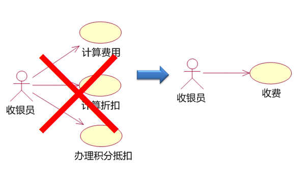

正因为粒度不能控制，所以用户故事能做补充，比较简单。

判断标准是，价值是否完整，是否是独立的业务单元，可结束，可汇报

### 流程内业务功能标识
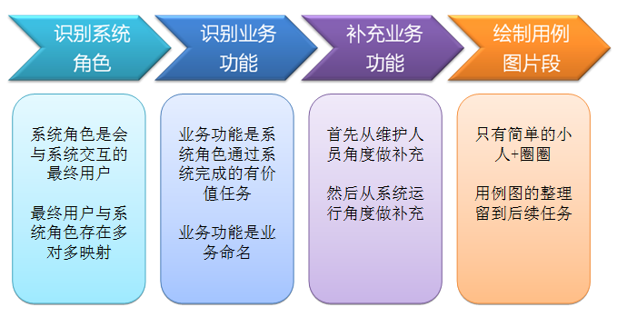

“处理客户来电”，并是用例，这是一个动作，__不是意图__。应分解为“电话咨询”，“电话投拆”，“电话转账”，“电话挂失”

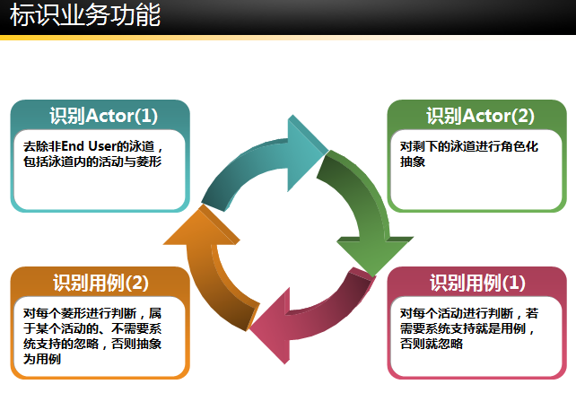

【技能】__用例图由活动图派生标识出来__，泳道的角色就是actor，不要系统中的角色排除，基层不需要再抽象，中层需要再抽象，对本泳道内活动，可抽象出用例

### 手机短信的用例图
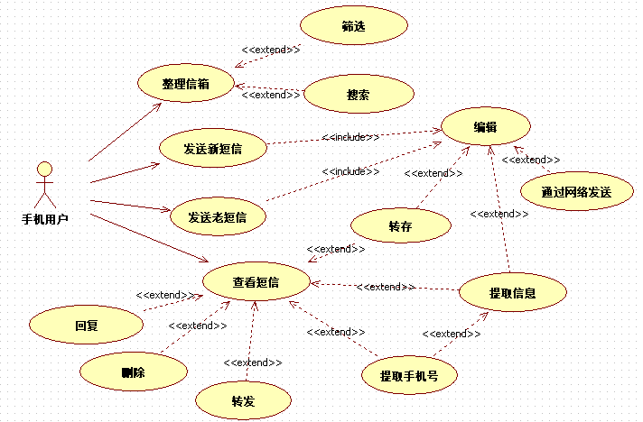

画出这个图，就可以得到一个生成树，每条路径就是一个测试用例

## 管控点分析
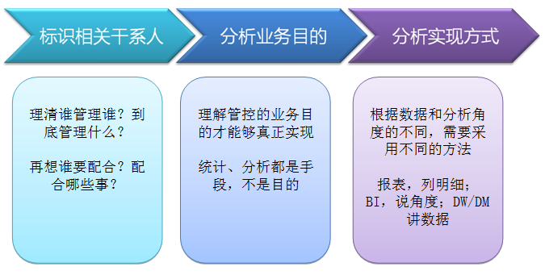

## 子系统和用例模型
### 用例图
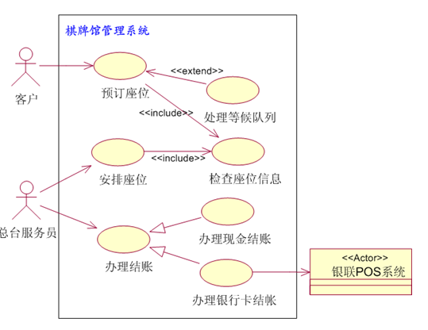

框框是边界，小人是actor，actor与用例的箭头，面向用例的，称为“作为总台服务员，他可以安排座位”，面向actor的，称为“通知或调用银联POS系统”

### 参与者三种关系
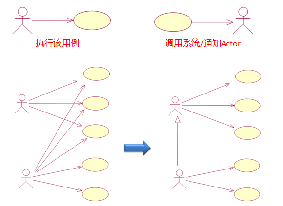

### 用例的三种关系
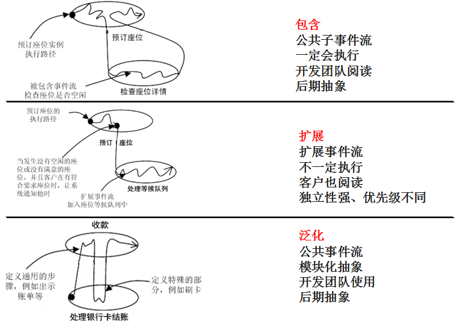

为什么会有include，它是 __公共__ 子用例。用户并不关心，不需要给用户看。extend则需要给用户看

### 用例困惑
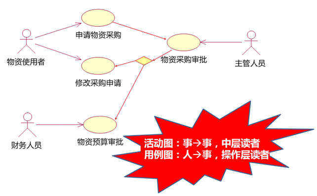

先有活动图，再有用例图，最后是用例描述（步骤）

### 子系统用例模型整理
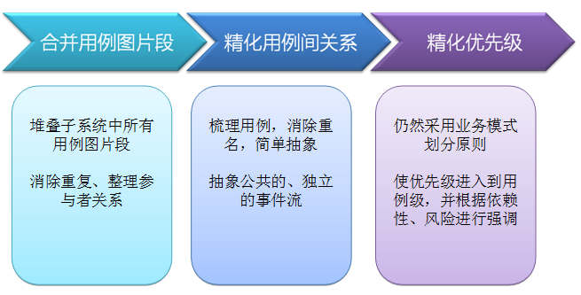

### User Story
与用例的的区别是大小不一样，写作方法不一样，相同点是用户视角。

1. 角色建模，通过头脑风暴或其它方法找到系统中所有用户角色

1. 为每一个角色指定一个及以上现场客户，可以是直接的用户代表，也可以是间接用户代替，以“作为某某某，希望系统XXX，以便于XXX”作为述事方式
> “作为求职者，希望这个网站帮我找到称心如意的工作，以方便我更好的做职业发展”

1. 粒度合适吗？找开发，两个人周干得完吗？不能，太大了（大故事也会保留，命名为EPIC(荷马史诗)，便于结构化逐层分解）。找现场客户，这个故事有点大，需要拆分一下
> “作为求职者，我希望通过网站更好的管理我的简历，以便以后有工作机会时，更快的发出简历，或者让招聘方更好的看到我的相关信息”，“作为求职者，我希望浏览招聘信息，以便我更好的从中做出选择”，

1. 分别问开发，每个故事两个人周干得完吗，干不完再拆，干得完则定义下来成为一个story。
> 【心理】为什么是两个人周，一个对于大于13的数字将逐渐失去感知。

1. 得到一张卡片，有故事描述，下面测试要求，背面是开发要求。

1. 一个故事太大，但用户又不能分解，将指定架构师去分解，而且不一定分解出来是用户能看懂的
> “我想对这个系统做远程灾备”

数据线：数据脉络
================
领域决定数据，家庭理财与公司理财对数据要求不一样。

1. 领域模型，站在用户的视角，还原现实数据间的关系
1. 数据的构成，类型、范围、约束
1. 数据的推演关系，状态图，长生命周期的数据

## 领域建模
领域建模的触发点：系统中数据项超过50个；全新的业务领域；团队中太多新人

## 流程内数据关系分析
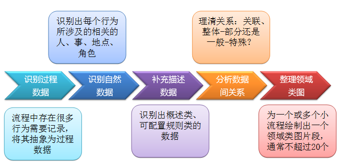

## 领域建模要点
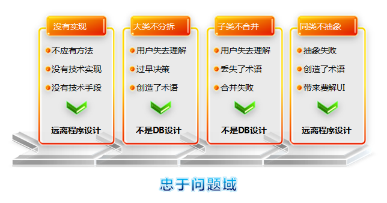

1. 不需要画方法，这是细节
1. 不要拆大表，不能创建新术语（快同步慢同步，听不懂）
1. 不要合并，不能丢失术语
1. 不能太抽象，否则用户没有感知（导入新报表格式，从模板中导入，模板这个词没有感知）
1. 忠于问题域

## 【方法论】四色建模
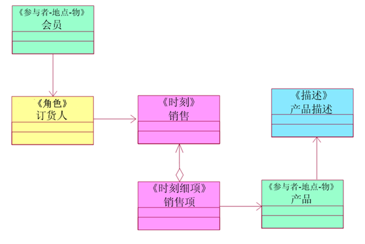

[www.infoq.com/cn/articles/xh-four-color-modeling](http://www.infoq.com/cn/articles/xh-four-color-modeling)

一次思考一个角度（六顶思考帽）

1. 红色，先从过程化数据（时刻数据）开始，系统开始时为空表
1. 绿色，参与者地点物（大自然中可感知的），与黄色（社会中角色[请假人/审批者]）
1. 蓝色，描述与可配置规则

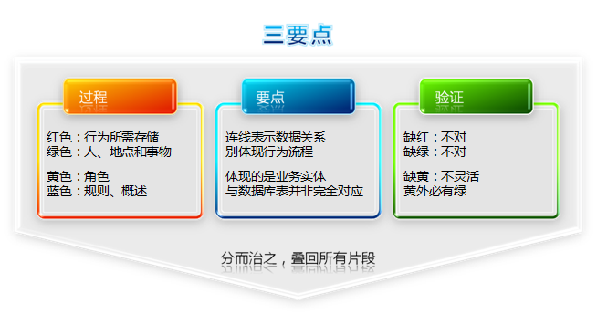

1. 缺红绿不对
1. 缺黄不灵活
1. 缺蓝可配置差

## 子系统领域模型整理
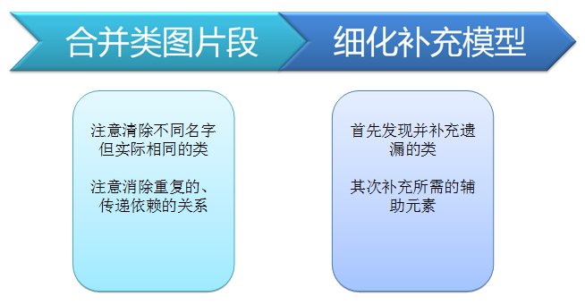

## 【技能】案例
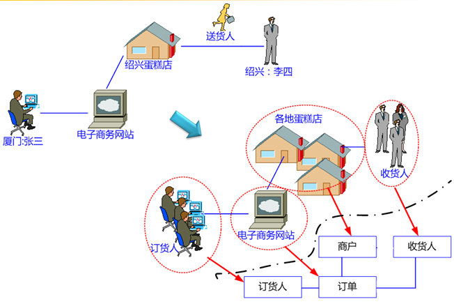

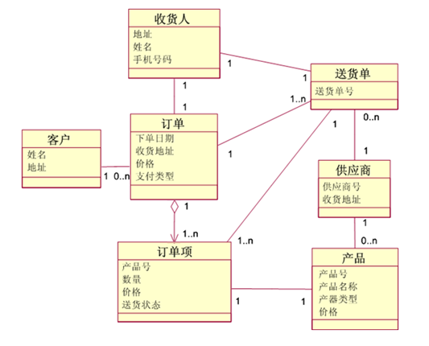

一个客户可以下多个订单，订单上有且只有一个收货人，订单是由订单项组成的，由于我们网站上有各种不同的供应商来供货，所以我们需要把订单分拆成多个送货单，每个送货单由相应的供应商来执行，每个供应商会给我们提供多种产品，每个订单项上有且只有一个产品

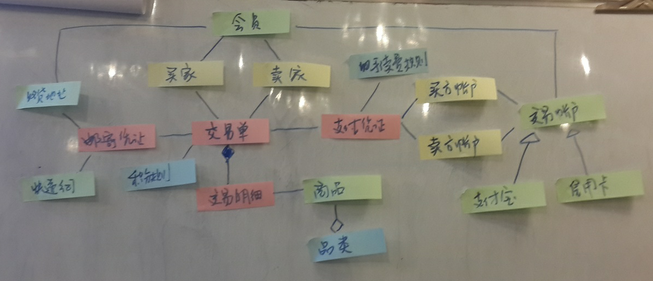

针对一个C2C的网站：

1. 用红色
    1. 要记录下来的 __过程数据__，从 __流程__ 来思考，需要成交，需要一个交易的记录“交易单”，有时需要交易多种商品“交易明细”，每一个交易明细记录一种商品，在用红色的同时，需要把它们的关系表现出来，这是一个组合关系。
    1. 交易完成，我们的网站需要帮他做支付功能，需要记录支付的过程“支付凭证”，它与“交易单”关联
    1. 网站还要监管，的确东西是发送出去了，需要一个“邮寄凭证/物流凭证”，也应该与“交易单”关联
    1. 确保所有过程中产生的数据都画完了，并且线要连完
1. 用绿色和黄色
    1. 从目前为止 __线条最集中__ 的类开始，它是我们的主题，即从“交易单”开始，问“交易单”上有 __人__ 吗？有？“买家”和“卖家”，他们是 __会相互转换__ 的吗？即今天“买家”会是明天“卖家”，有，所以是角色，到了角色不可结束，因为黄色不是真实的个体，还要思考“买家”和“卖家”这样的 __角色是由什么样的人扮演__ 的？由“会员”扮演，黄的外面必有绿色，一个绿必须对应两个以上的黄，要不然，角色的抽象是没有必要的
    1. “交易单”上有 __东西__ 吗？有，“商品”，但应该连向“交易明细”
    1. “交易单”本身有 __地点__ 吗？它是一个互联网网站，本身没有地点信息，
    1. “支付凭证”上有 __人__ 吗？有，但可以从“交易单”关联过来
    1. “支付凭证”有 __东西__ 吗？东西包括 __具体的商品__ 与 __抽象的服务__，“买方帐户”与“卖方帐户”，同样它们会 __相互切换__，所以是黄色，再关联到绿色的“交易帐户”，我们甚至可以把“会员”与“交易帐户”关联起来，我们可以支持多种交易帐户，用类别的关系来建立，如“支付宝”、“信用卡”。
    1. “支付凭证”有 __地点__ 吗？没有
    1. “邮寄凭证”上有 __人__ 吗？可以从“交易单”关联过来
    1. “邮寄凭证”上有 __东西__ 吗？可以从“交易单”关联过来
    1. “邮寄凭证”上有 __地点__ 吗？有，“收货地址”，跟“会员”关联，还有一个是“快递公司”
1. 最后启用蓝色
    1. 主要用途，一是 __概述__，为了更好的组织“商品”，需要“商品类别”，它是不真实存在的
    1. 二是 __规则__，一定是数据可配置的规则，比如“手续费规则”，在“支付”时知道需要多少手续费，根据“交易单”有“积分规则”。
1. 体检案例中，容易出错的地方：
    1. 诊断报告与体检结果相连，应与体检单相连
    1. 体检单未考虑与门店关联
    1. “团队”不是一类体检者，“团队成员”才是
    1. “积分规则”与“折扣规则”不应合并成“计算规则”
1. 体检案例中，"积分规则(蓝)"是与"帐单(红)"关联的，但实际情况是，积分规则可能与会员级别相关，也可能与套餐选择相关，甚至可能反而与帐单无关，即在建表时"积分规则表"不一定与"帐单表"关联，但积分的计算却发生在帐单生成时，即帐单生成的moment，会用到这些规则。
1. 另一种场景，商品的价格，如果理解成是对商品的描述项，即成为蓝色，但商品的价格却也是跟时间相关的，即价格的调整应为moment数据，则会绘成红色，如何判断？
1. 可根据业务单独性，为订单建立一个里程碑的事件追溯表，也可选择将配送凭证、支付凭证合并，即红色表是可合并的（ECCS的充值、消费、积分...统一到一个T表）

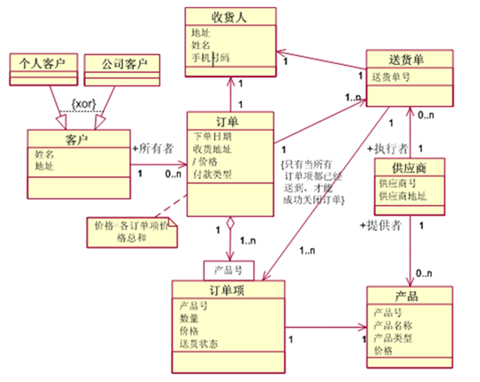

类图的其它元素：

1. 导航箭号，一个订单上有且只有一个收货人，但反过来读不好表述，所以加上箭头，表示强弱关系
1. 角色名称，供应商是送货单的"+执行者"，但图上的"+所有者"，"+提供者"是没有必要的
1. 价格前面的"/"，代表这个属性是计算出来的，可以用注释表示它的计算公式
1. 花括号"{}"，表示重要的业务规则
1. 条件限定符，产品号，订单是由订单项组成的，组成一个订单的所有订单项，它们的产品号是唯一的（买了一本《哈利波特》，再买一本，它们的产品号是一样的，应该合并在一起，做数量的变化）

质量线：非功能需求脉络
======================
从环境中推导：流程变得快（扩展性需求）、网络环境好不好（可靠性需求）、信息是不是隐密（安全性需求）、KTV下半夜打架（机子要三防）

## 质量属性的常见误区

1. 反对定性，“高可靠，高扩展”，写的人是直接复制，而看的人是直接翻过。
1. 反对盲目定量（什么是一英寸，不许举例子，不能用转换公式），【思维】所有的度量单位是不能下定义的，学习度量单位的途径，一举例法，二同类度量单位用转换法。如果没有历史数据的累积，定量工作是徒劳的。
1. “所有的查询请在七秒内响应”，反对没有场景的定量，应描述它的使用场景与频率

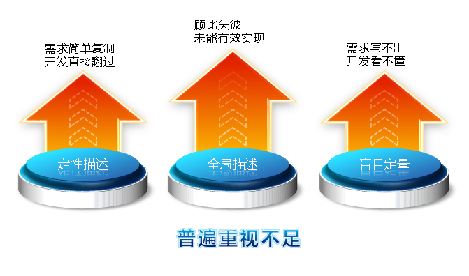

## 质量属性的核心策略
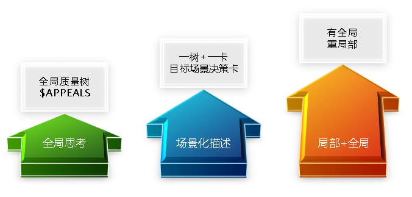

## 【思维】对立面分析法
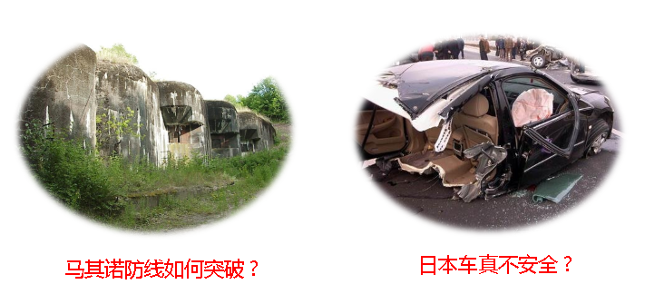

质量是讲场景，日本车的安全（溃力结构），碰撞后车子碎掉，在某些场景上也许是最好的选择，但如果在变道时或前后夹击或侧击时，驾驶位被挤压，容易致命；美国有许多撞的场景，所以搞出悍马

【思维】如果要造一辆安全的车，要考虑不安全的场景（逆向思维）

## 建立全局质量思维
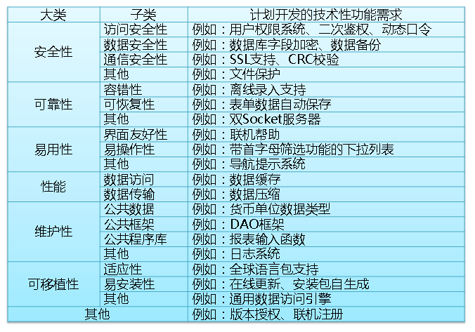

这个图是不完整的，大类是国标，子类是整理出来的。

1. 安全性，在于敌人的攻击；
1. 可靠性，缘于不稳定的网络/硬件；
1. 易用性，跟你长得不一样的客户；
1. 性能的敌人是有特殊性的需求，如火车票区间是否有票的复杂查询；
1. 维护性，变化和生命周期，生命周期越长，可维护性威胁越大
1. 可移植性，多平台，国际化的挑战
1. 扩展性，未来的变化点

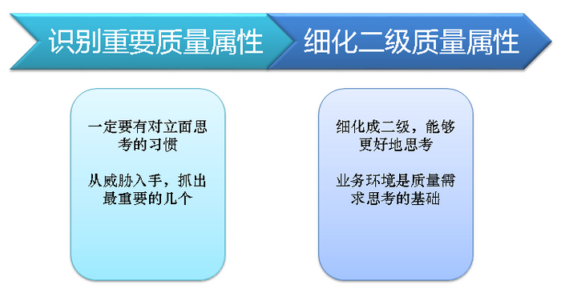

## 非功能的优先级

1. 生命攸关：心脏起博器，非功能需求远远大于功能需求
1. 重大经济损失/频繁的经济损失：ATM机，非功能需求与功能需求相当
1. 少量经济损失/频繁的不方便：功能需求大于非功能需求
1. 不方便：功能需求大于非功能需求

填充细节
================
## 业务功能需求细节

### 业务功能描述
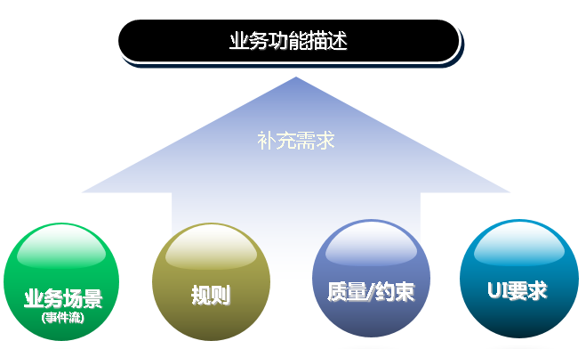

### 业务功能:事件流
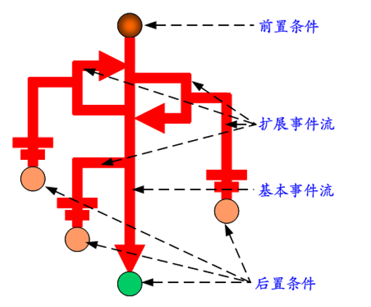

前置条件：用户已登录（没必要写，你怕空的。模板是帮助我们思考，没有就跳过）

经验显示，前后置条件不超30%

案例中，出具体检报告 的前置条件是 所有体检项结束

usecase比userstory更伟大之处在于，因为同时抽取了why（用例名称），how to（事件流/使用场景）

### 业务功能:事件流写作要点
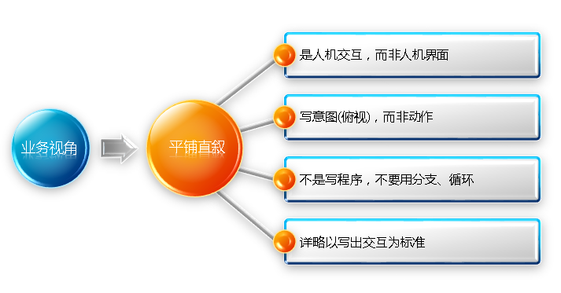

用例描述，具有场景和流程，如果一个事件流如此描述：点击XXX菜单，弹出XXX窗口，输入XXX，点击确定，无效的，程序员不看，用户更看不懂。

### usecase教外婆使用相机
function的描述方式："这里是开关，这里是快门，这里是回放"，"外婆老了，记不得了"。干的是《用户手册》第一页，而且用的是专业术语，会的不用看，不会的看了也白看。

usecase的描述方式："我来教你拍照，和看你拍的照片"(强调用户意图，用户价值)

1. "拍照这件事情特别简单（【思维】没给她看相机，看了会增加复杂度，右脑进入感性思维），第一步瞄准相机打开，第二步对准要拍的人或者东西，第三步把它拍下来"
1. "咦，这和看电视没有什么区别，先打开电视，调台，就可以看了。"
1. "这时拿出相机，告诉外婆，这个地方是开关，画了个半圆，上面有一竖"
1. "嗯，电视机也是这个符号"
1. "第二步对准要拍的人或者东西，那边有个方框，看到没，把它对准了，就叫拍照，好，对准了，手别动，最大那个按钮按下去就OK了"

对应的基本事件流就是：用户打开相机，相机点亮屏幕，用户对准要拍的人或者东西，相机用白色的框框把它框起来，用户拍下这张照片，相机回放2秒

【技能】事件流不是写界面，是写 __人机交互__，是写 __意图__，而不是动作（"第一步按这里，第二步按这里，第三步按这里"，需要记住的复杂的行为抽象过程，而不是用户意图）：输入XX，确认XX VS 在文本框内输入XX，点击确认按钮

扩展事件流：

1. "为什么晚上在街上拍的照片是黑的?"
1. "晚上天黑了，天黑了要干什么呢，要开灯啊，但是在街上怎么开灯"
1. "那我没办法"
1. "我教你一个办法，天黑的时候，相机有个灯，把相机的灯打开，相机的灯是个闪光灯"

逻辑太多（如果/那么）的事件流（【思维】用户不易理解，人最适合的是线性思维）

1. 第一步，打开相机，如果已打开，请跳过这一步，如果没有打开，请打开
1. 第二步，对准要拍的人或东西，如果现在是白天，请继续，如果现是晚上，请先把闪光灯打开

【技能】对于逻辑太多的事件流应先画基本事件流，再画扩展事件流，如果扩展事件流太多，请画没有泳道的活动图（一个人的活动，没有泳道）

### usecase自助游行程规划

1. 选择一个目的地
    - 跟谁去？现去什么样的景点？
    - 体力指数，亲子指数，娱乐指数，美食指数，消费指数，大山指数，大海指数，摄影指数，极限运动
    - 跟老人去，选择体力指数小，消费指数低的

1. 行程规划
> 看攻略是痛点。先以过程为中心得到基本事件流与扩展事件流，然后分析其中困难

    1. 确定要游玩兴趣点
    > 痛点：怕漏，怕不好玩

    1. 安排游玩顺序
    > 痛点：哪个远近，玩多久

        1. 时间不够
    1. 准备相关行李

将景点做成带有各种指数的产品，喜欢就加入地图，然后根据加入的景点，画出行程线，标出景点玩多长时间，路上花多长时间，最后标出总花费，总时间，时间不够可关闭景点，自动更新路线、花费和时间，确定时，提示你应该准备的东西。

【技能】以业务的过程背景、以问题和困难为突破、带出解决方案和建议

### 业务功能:规则描述
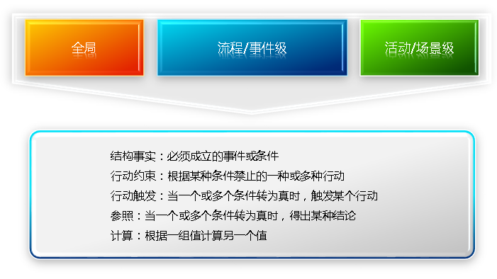

全局规则单列，流程级规则写在流程里，活动的规则写在usecase的事件里

### 业务功能:质量约束
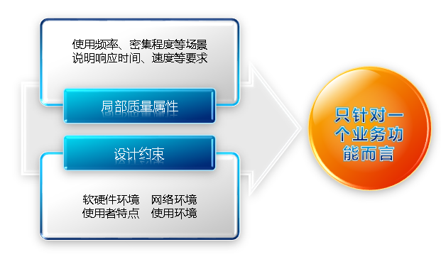

跟着用例一起写

### 业务功能:UI要求
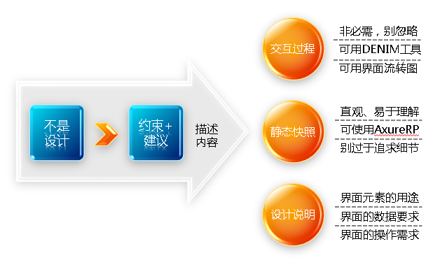

UI是需求，但不是搞设计，一是用户给出的约束，二是给开发的建议

用户体验设计UE（谈到设计就不是需求分析的主责任了）关注，易用性（共性易用性，个性易用性，特定场景行为分析，认知心理，符合人的心理预期[报表生成太快，用户以为没生成]）

界面流转图：DENIM，POP，快现；界面快照：AxureRP

所有UI放在需求规格说明书的附件，因为它是易改的

### 原型的误区
【思维】跟用户做原型，右脑进入外观观察，全是颜色，对齐之类，没让用户进入左脑的功能观察，当人见到不熟悉的东西时，默认进入右脑观察。

如何干预，usecase！__先跟用户说一遍用例描述__，如果有变化，再说明扩展事件流，带着他一条一条理清，__再使用原型__，这时候的反馈更多是功能性反馈。

### 用户手册的编写
应抽取使用场景，而不是界面元素：

1. 抽取人和角色
1. 关键usecase列表
1. 左半边为用例描述，右半边为UI截图（不用画圈）

例，路由器用户手册：电脑上网，平板及手机上网，控制小孩上网，共享电脑里视频

### 帮助信息提示
出错信息怎么处理：哪儿错，为什么，怎么办。提交表单页面，所有未出错的隐去，只剩下出错的，并告诉你怎么办。

1. 察：对于整个功能用户完全不知所措？是否存在具体步骤的执行困难？是否对某些信息或功能产生理解困难？
1. 断：用户的问题场景与功能场景如何对应？用户需要知道自己现在处于哪个操作过程、接下来要做什么？是否存在用户无法理解的词汇或功能？
1. 策：制作面向用户问题场景的用户说明书（而不是功能的罗列）、即时的用户操作指引、即时的信息与功能解释

## 业务报表需求细节
不要用用例去写业务报表，这是一个悲剧：第一步，用户输入XXX条件，第二步用户点击查询按钮，第三步系统返回一个XXX报表，第四步可以打印，可以看。每一个报表都如此

报表名称，谁来用，为什么要用，使用频率

特殊的数据排序需求（华南华东华西华北华中）

统计口径（门店日报，交过钱的算，还是开过单的算，还是体检完的算）容易产生分歧义

## 业务数据需求细节
### 整理过程
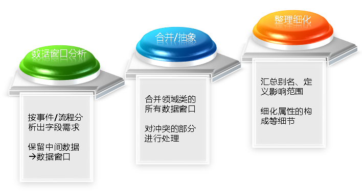

### 描述要点
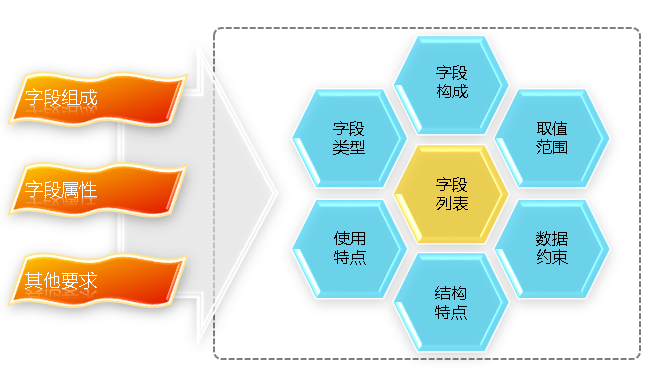

1. 字段构成：数据字典
1. 结构特点：主要/次要，稳定/不稳定，即时/历史
1. 使用特点：联机、报表、DSS

## 业务接口需求细节
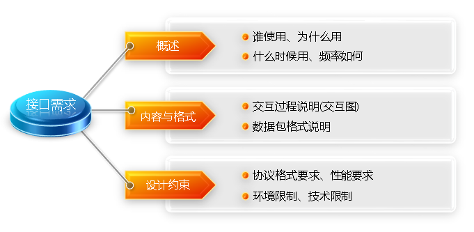

详见案例的需求规格说明书

## 质量场景/设计约束细节
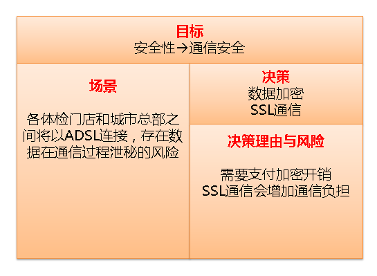

目标-场景-决策法

杂项
================
## 心理
1. 童年决定一切：不会说“我”到说“我”，有了自我认识。喜欢什么都“碰”到“不碰”，探索期结束
1. 人格心理学描述价值观形成，积极心理学听哈佛幸福课
1. 六顶思考帽，人的思维是线性的，一次只考虑一种角度

## 建模方法论
1. 业务建模（业务用例与用例完全不相关，业务用例不推荐用），推荐用TOGAF、dsdm、EA、dodaf、ITL
1. RUP裁剪
    1. ICONIX（没有流动图，只有交互图）：用例驱动的UML对象建模应用，实战OO，潘加宇
        - [Robustness Analysis](http://pst.web.cern.ch/PST/HandBookWorkBook/Handbook/SoftwareEngineering/UCDOM_summary.html 'robustness')：Ivar Jacobson，温昱
    1. GRASP：UML模式与应用
    1. 4+1视图：逻辑/过程/物理/开发+用例
1. FDD特征驱动开发：Coad Peter，Together，对象模型与策略，四色建模

## 企业相关

### 公司成长
1. 初创：生意，销售最牛，乱，快，无标准，不关心风险，老板跑业务
1. 成长：运营，规范，标准，风控，成本，效率，团队
1. 成熟：财务，融资，收购
1. 衰败

### 组织划分的类型
1. 职能划分：利于专业化，但不利于协作，责任推委
1. 项目划分：造成资源浪费
1. 矩阵型：双头领导
1. 星巴克经营体

### 五行竞争战略

1. 水：冬天、关系、客户
> 客户亲密：IBM、麦肯锡

1. 火：夏天、品牌、张扬
> 品牌战略：宝洁、耐客、脑白金、王老吉（加多宝）

1. 木：春天、创新
> 技术领先：Intel、高通

1. 金：秋天、收获、制度、规则
> 流程卓越（成本领先）：戴尔、丰田、联想

1. 土：能量本身
> 资源垄断：壳牌、中石油、淡水河谷

### 流程
1. 丰田价值流图
1. TQM
1. 精益制造（大野耐一，戴明）
1. BPD业务流程定义

### 产品线开发思路
酒店业态分析（核心商业模式分类）:

1. 商旅酒店（喜莱登，如家），需要连锁，需要会员制
1. 地缘酒店，不需要连锁，钟点房
1. 会议酒店（九华山庄），会议管理
1. 旅游型酒店，招待旅游团，关注导游
1. 度假型酒店

所有业态共同流程提练出来，如入住，称为核心层；然后把会员管理、钟点房管理放在行业里，行业的开发是针对业态特定流程的；最后是会对具体客户的定制开发。

## 有关敏捷
1. 最成功的敏捷项目Coad Peter的新加坡国立银行系统，失败的是Kent Beck、Martin Fowler、Ron Jeffries 克莱斯勒公司综合工资系统
1. 关于浮现式设计，有一个游戏模拟城市
1. 思考重写与重构区别

## 其它
1. 需求三阶段：低阶需求做技术，中阶需求做业务，高阶需求做人性
1. Snapchat是一款“阅后即焚”照片分享应用

## 附件

1. [需求分析技能训练营.pptx](../data/需求分析技能训练营.pptx 'ppt')
1. [需求分析技能训练营案例手册.pdf](../data/需求分析技能训练营案例手册.pdf)
1. [需求典型变因.xlsx](../data/需求典型变因.xlsx)
1. [需求优先级表.xlsx](../data/需求优先级表.xlsx)
1. [估算相关数据.xlsx](../data/估算相关数据.xlsx)
1. [问题卡片-批改.zip](../data/问题卡片-批改.zip)
1. [干系人列表-批改.zip](../data/干系人列表-批改.zip)
1. [流程识别-批改.zip](../data/流程识别-批改.zip)
1. [任务卡片(用例描述).doc](../data/任务卡片(用例描述).doc)
1. [用例描述-不良.doc](../data/用例描述-不良.doc)
1. [用例描述Ivar-简版.doc](../data/用例描述Ivar-简版.doc)
1. [用例描述Ivar-详版.doc](../data/用例描述Ivar-详版.doc)
1. [产物卡.docx](../data/产物卡.docx)
1. [T-R001-软件需求规格说明书.doc](../data/T-R001-软件需求规格说明书.doc)

