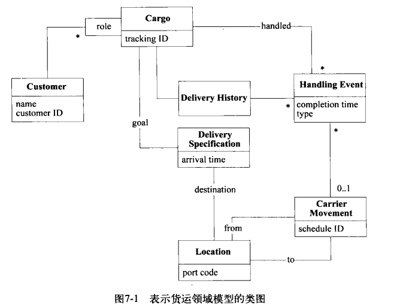
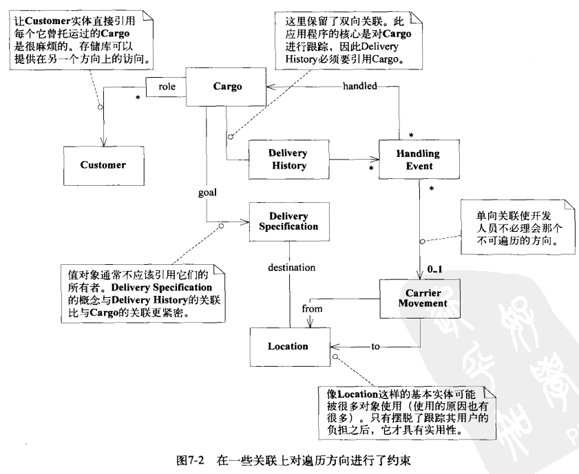
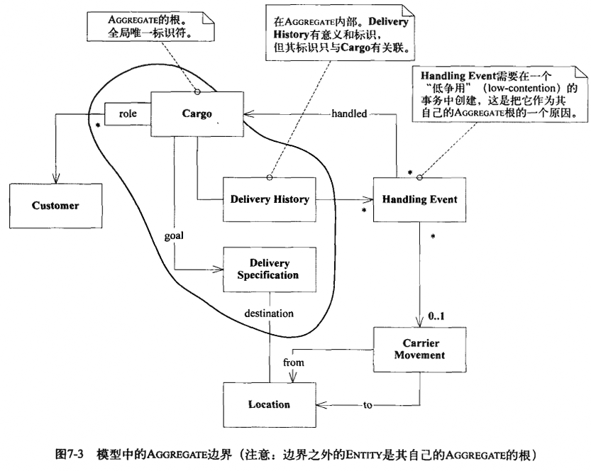
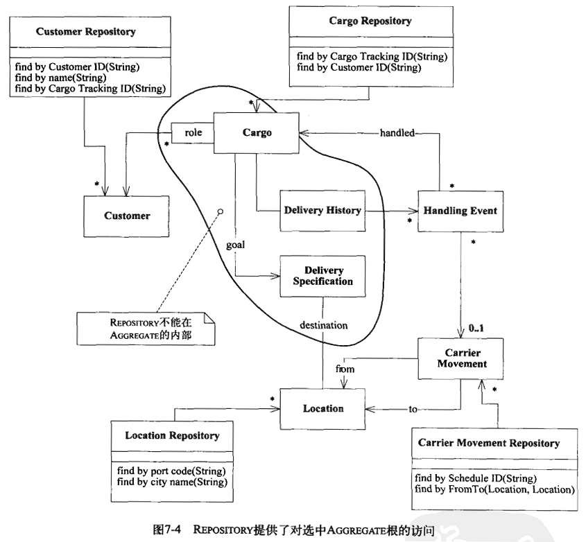
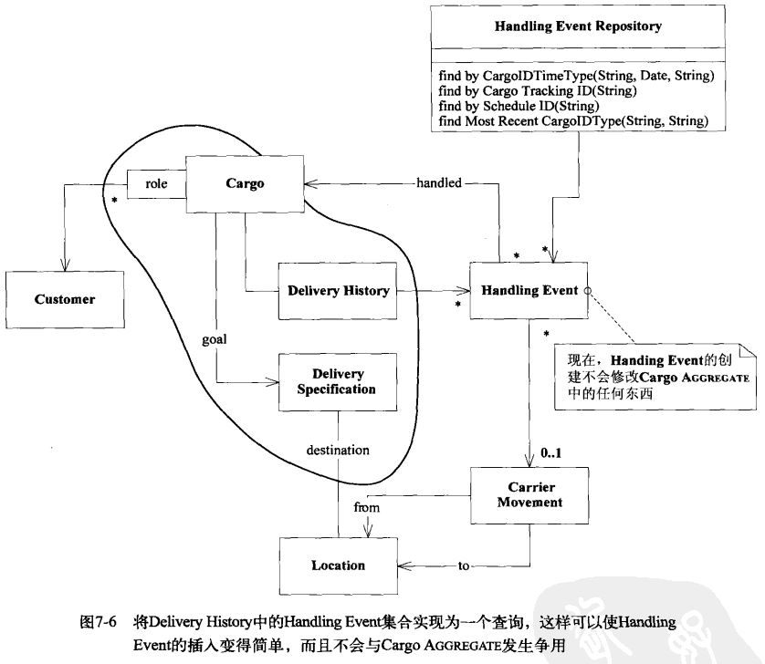
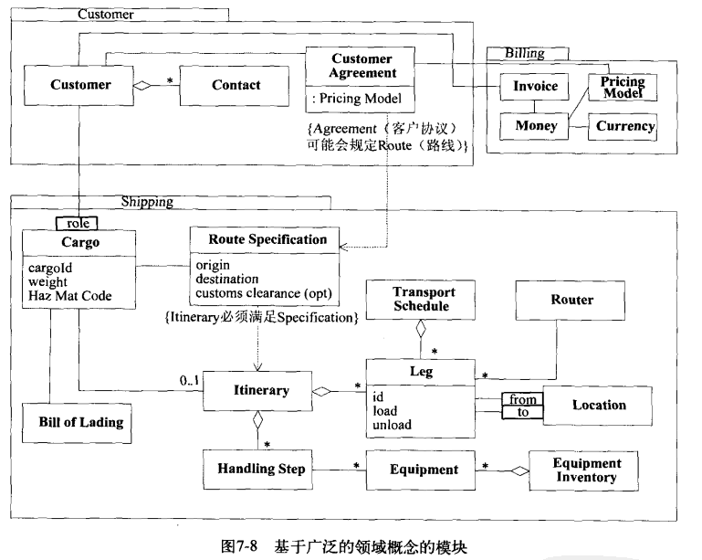
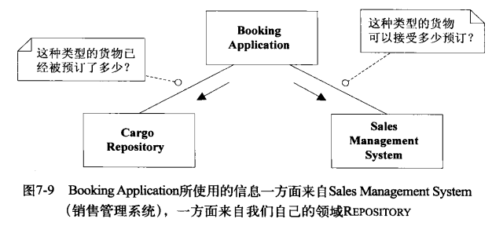
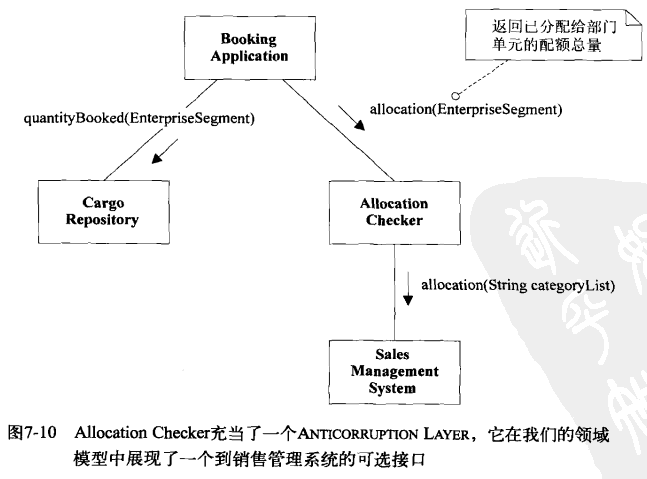
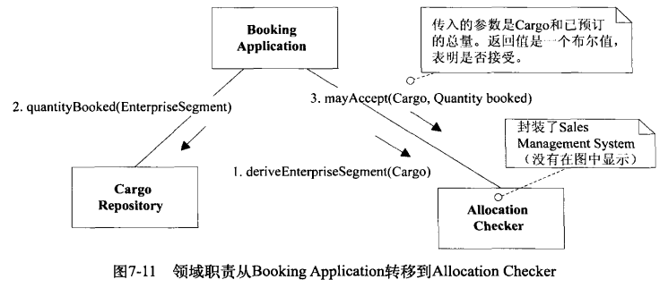

> 2014-05-30

<!--
`Cargo`
`CargoFactory`
`CargoRepository`

`Customer`
`CustomerRepository`

`Roles`

`HandingEvent`
`HandingEventRepository`

`DeliveryHistory`
`DeliverySpecification`

`Location`
`LocationRepository`

`Carrier`
`CarrierMovement`
`CarrierMovementRepository`

`AllocationChecker`

`EnterpriseSegment`

Tracking Query
Booking Application
Incident Logging Application
Activity Logging Application
Sales Management System
Model-Driven Design

Entity
Aggregate
Value Object
Service
Repository
Factory
Specification
Anticorruption Layer
 -->

让领域模型发挥作用
=================
为了创建真正能为用户活动创造价值的软件，开发团队必须运用一整套与这些活动有关的知识体系，所需的知识广度可能令人望而生畏，信息量和复杂度也可能超乎想象。模型正是用于 __信息超载__ 的工具，它是一种知识形式，对知识进行 __有选择的 *简化*__ 和 __有目的的 *结构化*__ ，有助人们理解信息的意义，并 __专注于问题__ 相关的信息。

如书中提到，有关某镜头的取舍，剪辑人员站在专业角度（准确完成自己工作），但其核心作用（是否具有滑稽效果）被忽略了，这时理解领域核心的领导者能将软件项目带回正确的轨道。

随着对领域和应用程序需求的理解逐步加深，往往会丢掉那些最初看起来很重要的表面元素，或者 __切换它们的角度__。如对航运业务的认识从“集装箱在各地点之间的运输”转变为“运货责任在各个实体之间的传递”，处理这些责任的传递的特征不再是一些附属于装货作业和次要特征，而是一个独立的模型来支持。

抽象，分不同维度，开发人员为了支持设计的抽象，或领域专家对业务的抽象。面向对象技术可以使开发人员组织程序代码而受益，但真正的突破是描述模型中的概念

分离领域
=========
在一个运输应用程序中，要想支持从城市列表中选择运送货物目的地这样的简单用户行为，程序代码必须包括：

- 在屏幕上绘制一个屏幕组件（widget）
- 查询数据库，调出所有可能的城市
- 解析并验证用户输入
- 将所选城市与货物关联
- 向数据库提并此次数据修改

但只有 __一小部分__ 代码与运输 __业务相关__，如果领域有关的代码分散在大量其他代码之间，那么查看和分析领域代码就相当困难，给测试也带来困难。

想要创造能够处理复杂任务的程序，需要把不同的 __关注点分开__ 考虑，使设计中每个部分都得到单独关注，在分离的同时，也需要维持系统内部复杂的交互关系。普遍采用 __分层__：

- __用户界面层（表示层）__：负责向用户显示信息和解释用户指令。用户可以是另一个计算机系统，不一定是使用用户界面的的
- __应用层（门面服务）__：定义软件要完成的任务，并且指挥表达领域概念的对象来解决问题。应用层要尽量简单，不包含业务规则或知识，而只为下一层中的领域对象协调任务，分配工作。它没有反映业务情况的状态，但却可以为用户或程序显示某个任务的进度（工作流？）。
- __领域层（模型层）__：负责表达业务概念，业务状态信息以及业务规则。尽管保存业务状态的技术细节由基础设施层实现，但反映业务情况的状态是由本层控制并使用的。领域层是业务软件的核心
- __基础设施层（工具+框架）__：为上层各层提供通用的技术能力：为应用层传递消息，为领域层提供持久化机制，为用户界面层绘制屏幕组件，还可通过架构框架来支持四层间的交互模式。

有些项目没有明显划分出用户界面层和应用层，而有些项目则有多个基础设施层，但将领域层分离出来才是实现 __Model-Driven Design__ 的关键

领域对象应该将重点放在如何表达领域模型上，而 __不需要__ 考虑自己的显示和存储问题，也 __无需管理__ 应用任务等内容。

软件中所表示的模型
=================
## 关联
一对多关联在实例变量中可以用一个集合来实现，但设计不一定要这样直接，可能没有集合，而使用一种访问方法（accessor method）来查询数据库，这两种设计反映同一个模型。

使关联更易于控制：

- 规定一个遍历方向
> 尽可能地对关系进行约束，双向关系只有将两个对象放在一起考虑才能理解它们，当应用不需要双向遍历时，可以指定一个遍历方向，以便减少相互依赖性，并简化设计

- 添加一个限定符，以便减少多重关联
> 尽管美国有很多位总统，但一个国家在一段时期内只能有一位总统，这个限定条件把多重关系简化为一对一关系

- 消除不必要的关联（非本质的关系）

## Entity(Reference Object)
很多对象不是通过它们的属性定义，而是通过一连串的连续事件和标识定义的。

一个人有一个标识，会陪伴他一生，这个人的物理属性会变，账务关系也会变，但标识却是永久的。

在对象的多个实现、存储形式和真实世界的参与者之间，概念性标识必须是匹配的，属性可以不匹配。

对象建模有可能把注意力引到对象的属性上，但 __实体概念是一种贯穿整个生命周期（甚至会经历多种形式）的抽象的连续性__。它们的类定义、职责、属性和关联必须围绕 __标识__ 来变化，而不会随着特殊属性来变化。可以跟踪它所经历的不同状态，甚至可以跨不同的实现跟踪它

### Entity建模
当对一个对象进行建模时，自然会考虑它的属性，而且考虑它的行为，但Entity最基本的  __职责是确保连续性__。保持实体的简练是实现这一责任的关键，只添加那些 __对概念至关重要的行为__ 和这些行为所必须的属性，此外，应该把行为和属性 __转移__ 到与核心实体关联的其他对象中，除了标识问题外，实体往往通过协调其它对象的操作来完成自己的职责。

## Value Object
很多对象没有概念上的标识，它们描述了一个事务的某种特征。只关心这些元素是什么，而不关心它们是谁。

画画时，关注的是画笔的颜色和笔尖的粗细，如果两只颜色和粗细相同的画笔，是不会介意使用哪一支。

Value Object可以是其他对象的集合，甚至可以引用Entity。它应该是 __不可变__ 的，不要为它分配任何标识。

经常作为参数在对象之间传递消息，常常是临时对象，在一次操作中被创建，然后丢弃。

### 设计Value Object
因为不关心使用的是哪个实例，不受这方面的约束，设计可以很自由，可以 __简化设计或优化设计：复制、共享或保持为不可变量__ （设计模式中Flyweight可应用于此，但无法用于Entity中）

共享VS复制，当以下情况时，优先使用共享：

- 当节省数据库空间或减少对象数据是一个关键要求时
- 当通信开销很低时
- 当共享的对象被严格限定为不可变时

但如果一个Value的实现是可变的，那么就不能共享它（只能复制），在可能的情况下，最好都设计为不可变的。

两个Value Object之间的双向关联完全没有意义。

## Service
有时，对象不是一个事物，在某些情况下，最清楚、最实用的设计会包含一些特殊的 __操作__（活动或动作），这些操作从概念上讲不属于任何对象，与其强制地归于某一类（Entity或者Value Object），还不如引入新的元素：Service。（尽管有可能违背了面向对象，贫血模型？）。当对软件必须实现某项 __无状态的活动__ 进行建模时，就可以将该活动作为一项Service

许多开发人员将"Manager"之类的名字结尾，看起来像模型对象，但除了一些操作之外没其它意义，也没有自己的状态，应该归于Service类别中

Entity和Value，它强调的与其他对象的关系，所谓Service定义了能够 __为客户做什么__，以一个活动命名，__动词__ 而不是名字，也应该有定义的职责

常见错误：

- 没有努力为这类行为找一个适当的对象，逐渐成为了 __过程化__ 的编程
- 勉强将一个操作放到不合适的对象中时，__模糊了原对象的角色与职责__
> 账户间转账功能属于一个领域层Service，因为它包含重要的业务规则（处理相应的借方账户和贷方账户），Service自己不会做太多事情，只要求两上Account对象完成大部分工作，但如果将“转账”操作强加Account对象上将很别扭。合理的做法是创建一个Funds Transfer对象来表示两个账户，外加一些与转账有关的规则和历史记录
- 代替了Entity的行为

好的Service特征：

- 与领域概念相关的操作不是Entity或Value的一个自然的部分
- 接口是根据领域模型的其他元素定义的
- 操作是无状态的（任何客户可以使用某个Service的任何实例，不必关心该实例的历史状态）

技术层（基础设施层）Service与领域层Service区别：

- 前者如发邮件，不包含业务意义；
- 后者则涉及业务逻辑，是在Entity和Value的基础上建立起来的，它们的行为类似于将领域的一些潜在功能组织起来以执行某种任务的脚本。而Entity和Value由于粒度过细而无法提供对领域层功能的便捷访问。
> 这里又要区别应用层Service与领域层Service，如银行应用程序可以把我们的交易进行转换并导出一个电子表格文件中，以便进行分析，这个导出应是一种应用层Service，“文件格式”在银行领域中是没以有意义的，也不涉及业务规则
- 将Service划分各层中示例
    - 资金转账应用服务：获取输入（如XML）；发送消息给领域层服务，要求其执行；__监听确认消息__；决定使用基础设施服务来发送通知
    - 资金转账领域服务：与必要的账户和总账对象进行交互，执行相应的借入和贷出操作；提供结果的确认（允许或拒绝转账等）
    - 基础设施层服务：按照应用程序的指示发送电子邮件、信件和其他信息。

## Module/Package
防止因框架、分层、打包等问题将领域对象的模型给拆散了，将持久化与UI分层是有必要的，但再拆分领域中对象到不同层是不可取的。

领域对象的生命周期
=================
## Aggregate
将关联减至最少的设计有助于简化对象之间的遍历，并在某种程度上限制关系的急剧增多。但大多数业务领域中的对象具有十分复杂的联系，以至于最终会形成一个很长、很深的对象引用路径，不得不在这个路径上追踪对象。这时候就需要该模式来指导建模

Aggregate就是一组相关对象的集合，作为数据修改的单元，每一个Aggregate都有一个根（root）和一个边界（boundary），边界定义了Aggregate的内部都有什么。根则是Aggregate中所包含的一个特定的Entity，在Aggregate中，根是唯一允许外部对象保持对它的引用的元素，而边界内部的对象之间则可以互相引用。除根外其他Entity都有本地标识，但只有在Aggregate内部才需要加以区别，因为外部对象除根Entity之外看不到其他对象。

固定规则（invariant）是指在数据变化时必须 __保持不变的一致性__ 规则，Aggregate内部的成员之间可能存在固定关系。Aggregate的所有规则 __并不是实时__ 都被更新为最新的状态，通过事件处理、批处理或其它更新机制，在一定时间内可以解决部分依赖性。但在每个事务完成时，必须要满足Aggregate内所有应用的固定规则的要求。

为了实现概念上的Aggregate，需要对所有事务应用一组规则：

- 根Entity具有全局标识，它最终负责检查固定规则
- 根Entity具有全局标识，边界内的E具有本地标识，这些标识只有在Aggregate内部才是唯一的
- Aggregate外部的对象不能引用除根Entity之外的任何内部对象，根Entity可以把对内部Entity的引用传递给它们，但这些对象只能临时使用这些引用，而不能保持引用（根可以把一个Value Object的 __副本__ 传递给另一个对象，而不必关心它发生什么变化，因为它只是一个Value，不再与Aggregate有任何关联）
- 只有Aggregate的根才能直接通过数据库查询获取，所有其他对象 __必须通过关联的遍历__ 才能找到
- Aggregate内部的对象可以保持对其他Aggregate根的引用
- 删除操作必须一次删除Aggregate边界之内的所有对象（GC很容易做到）
- 当提交对Aggregate边界内部的任何对象的修改时，整个Aggregate中所有 __固定规则__ 都必须被满足。

参考书中对PO的建模，通过减少对Part的依赖，保持了

## Factory
当创建一个对象或整个Aggregate时，如果创建工作很复杂，或者时暴露过多内部结构，可以使用Factory进行封装。

Factory有许多设计模式（Factory Method, Abstract Factory, Builder），任何好的工厂都需满足两上基本需求：

- 每个创建方法都是原子方法，而且满足被创建对象或Aggregate的所有固定规则，Factory应该以一致的状态来生成对象。在生成Entity时，意味着创建满足所有固定规则的整个Aggregate，但在创建完后可以向聚合添加一些可选元素。在创建不变的Value Object时，意味着所有属性必须被初始化为正确的最终状态。
- Factory应该被抽象为所需要的类型，而不是创建出具体的类。

### 选择Factory及其应用位置
一般情况下，Factory的作用是创建出的对象将细节隐藏起来，而且把Factory用在那些需要隐藏细节的地方，这些决定 __通常与Aggregate有关__

### 接口的设计
当设计Factory的方法签名时，必须遵守：

- 每个操作都必须是 __原子__ 的，我们必须在与Factory的一次交互中把创建对象 __所需的所有信息__ 传递给Factory，同时必须决定当某些固定规则没有被满足而导致创建失败时，将执行什么操作。
- 仔细考虑 __参数__，Factory将与其参数发生耦合，最安全的参数是来自较低层的设计层的参数，或选择与模型中密切相关的对象，而不增加新的依赖。使用 __抽象类型__ 的参数。

### 放置固定规则的逻辑
Factory负责确保它所创建的对象或Aggregate满足所有固定规则，但不代表应将规则称到该对象之外，Factory可以将 __固定规则检查工具delegate给产品__，而且这通常是最佳选择。Factory负责确保它所创建的对象或Aggregate满足所有固定规则，但不代表应将规则称到该对象之外，Factory可以将 __固定规则检查工具delegate给产品__，而且这通常是最佳选择。

### 重建已存储的对象
当从数据库中重建对象时，ORM技术就可以提供部分或全部所需服务；当从其他介质重建对象时，如果出现复杂情况，Factory是一个很好的选择。

## Repository
通过对象之间的 __关联__ 来找到对象，而不是基于数据库检索。当它处于生命周期的中间时，必须要有一个起点，以便从这个起点 __遍历__ 到一个Entity/Value。

数据库检索是全局可访问的，它使我们可以直接访问任何对象，但很可以滥用，是提供遍历还是领依靠检索，是一个设计决策，是检索的解耦与关联的内聚之间的权衡。
> Customer对象是否应该保持所有Order的集合？还是通过CustomerId在数据库中查找Order？
>
> 领域驱动设计的目标是通过关注领域模型，而不是技术来创建更好的软件，如果开发人员构造了一个SQL查询，并将它传递给基础设施层中某个查询服务，再根据得到的表行数据结果集提取所需信息，最后将这些信息传递给构造函数或工厂，当开发人员执行这一操作时，__早已不再把模型当重点__
>
> 更糟的是，由于直接使用数据库，开发人员会试图 __绕过模型的一些特色功能__（聚合、封装），直接操作他们所需的数据，导致越来越多的 __领域规则被嵌到查询__ 代码中。

Repository是一个简单的概念框架，将我们的注意力重新回到模型上，__它将同一类型的所有对象表示为一个概念集合（通常是模拟的），它行为类似于集合，只有具有更复杂的查询功能，在添加或删除相应类型的对象时，它的后台机制负责将对象添加到数据库中，或从数据库中删除对象__。

它的优点：

- 体现了对象访问的设计决策
- 为客户提供简单模型，可用来获取持久对象并管理它们的生命周期
- 使应用程序和领域设计与持久化技术解耦
- 很容易替换为"哑实现"（dummy implementation），以便测试

### Repository查询
基于Specification的查询特别适合作为一个框架来使用，客户可以 __使用规格（声明式）来描述__ 需要什么，而不关心如何获得结果。

但需要注意使用这些框架时，对性能的影响，考虑底层技术可能会限制我们的建模选择

### Repository与Factory
Factory负责处理对象生命周期的开始，而Repository帮助管理生命周期的中间和结束。由于Repository也是基于数据来创建对象，也许被误解为就是Factory，从技术角度而言是如此，但最好还是从模型角度来看待这一问题。

从领域驱动设计的角度，两者有不同的职责，Factory负责制造新对象，而Repository负责查找已有对象（还处在生命周期中间），它让客户感觉到那些对象好像驻留在内存中一样

这种职责上的区分还有助于Factory摆脱持久化职责，它的工作是用数据来实例化一个可能很复杂的对象，如果产品是一个新对象，那么客户将知道在创建完成之后应该把它添加到Repository中，由Repository的封装对象在数据库中的存储。

一个扩展的示例
==============
## 货物运输系统
最初需求：

- 跟踪客户货物的主要处理部署；
- 事先预约货物；
- 当货物到达其处理过程中的某个位置时，自动向客户寄送发票

可以做出如下描述：

- 一个Cargo涉及多个Customer，每个Customer承担不同的角色
- Cargo的运送目标已指定
- 由一系列满足Specification的Carrier Movement来完成运送目标



```ruby
class Cargo
  attr_accessible :tracking_ID
  has_many :customers, :through => :role
  has_one :deliver_history
  has_many :handlind_events
  has_many :delivery_specifications
end

class Customer
  attr_accessible :customer_ID, :name
end

class HandingEvent
  attr_accessible :cargo_ID, :completion_time, :type #装货 缺货 提货 清关...
end

class DeliveryHistory
  has_many :handling_events
end

class DeliverySpecification
  attr_accessible :arrval_time
  has_one :destination, :class_name => :Location
end

class Location
  attr_accessible :port_code
end

class CarrierMovement
  attr_accessible :schedule_ID
  has_one :from, :class_name => :Location
  has_one :to, :class_name => :Location
  has_many :handling_events
end

```

`HandingEvent`是对`Cargo`采取的不同操作，例如将它装上船，或清关，这个类可以被细化为一个由不同种类的事件（如装货、缺货、由收货人提货）构成的 __层次结构__

`DeliverySpecification`定义了运送目标，至少包括目的地和到达日期，但也可以更复杂，遵循 __*规格模式*__(后面章节有讲)。这个职责可以由`Cargo`对象来承担，但将`DeliverySpecification`抽象出来至少有以下好处：

- 如果没有`DeliverySpecification`，`Cargo`对象就需要负责提供用于指定运送目标的所有属性和关联的详细意义，使得`Cargo`对象变得混乱，导致它难以理解或修改
- 当将模型作为一个整体来解释时，这个抽象使我们能够轻松且安全地省略掉细节（静态模型的好处）。例如，`DeliverySpecification`中可能还封装了其他标准，但这种细节级别的图可以不必显示出来，告诉他人有一个运送规格，但其细节却并不是要考虑的重点（事实上，过会修改细节也很容易）
- 这个模型具有更强的表达能力，`DeliverySpecification`清楚地说明了`Cargo`运送的具体方式没有明确规定，但它必须完成`DeliverySpecification`中规定的目标。

`Customer`在运输中所承担的部分是按照`Role`来划分的，例如shipper,receiver,payer等，一个`Cargo`只能由一个`Customer`来承担某一给定角色，因此它们之间的关联是限定的多对一关系，而不是多对多，`Role`可以简单的实现为字符串，当需要其他行为的时候，也可以将它实现为类

`CarrierMovement`表示由某个`Carrier`（如一辆卡车或一艘船）执行的从一个`Location`到另一个`Location`的旅程。`Cargo`被装上`Carrier`后，通过`Carrier`的一个或多个`CarrierMovement`，就可以在不同地点之间转移

`DeliveryHistory`反映了`Cargo`实际上都发生了什么事情，它与`DeliverySpecification`正好相对，后者描述了目标，前者通过分析最后一装货和缺货以及对应的`CarrierMovement`的目的地来计算货物的当前位置。成功的运送将会是一个 __满足`DeliverySpecification`目标的`DeliveryHistory`对象__

## 隔离领域：应用程序的引入
为了防止领域的职责与系统的其他部分的职责混杂在一起，需要层次划分，识别出三个用户层的应用程序功能：

- Tracking Query跟踪查询，它可以访问某个`Cargo`过去和现在的处理情况
- Booking Application预订应用，它允许注册一个新的`Cargo`，并使用系统准备处理它
- Incident Logging Application事件日志应用，它记录对`Cargo`的每次 __处理__（提供通过Tracking Query找到的信息）

这些应用层类是 __协调者__，只负责提问，而不负责回答，__回答是领域层的工作__

## 将Entity和ValueObject区别开
依次考虑每个对象，看看这个对象是必须被跟踪的实体还仅表示一个基本值，首先来看比较明显的情况，然后考虑更含糊的情况

`Customer`对象表示一个人或一家公司，它是一个实体，它的ID也许在每个`Customer`第一次联系销售时被分配了一个ID号，已在公司中使用，沿用这个ID可与那些系统保持标识的连贯性。

`Cargo`，两个完全相同的货箱必须要区分开，因此是Enity，在实际情况中，所有运输公司都会为每件货物分配一个跟踪ID，自动生成的，用户可见的，在预订时还要发送给客户

`HandingEvent`和`CarrierMovement`，关心这些独立事件是因为通过它们可以跟踪正在发生的事情，它们反映了真实世界的事件，而这些事件一般是不能互换的，因此是Entity，每个`CarrierMovement`都将通过一个代码来识别，这个代码从运输调度表得到的。
> `HandingEvent`可通过`Cargo`_ID、完成时间和类型的组合作唯一识别

`Location`名称相同的两个地点并不是同一个位置，经纬度可以提供一个唯一键，但并不是一个非常可行的方案（使用复杂，目的地并不关心经纬度是多少），它更可能是某种地理模型的一部分，这个模型根据运输航线和其他特定于领域的关注点将地点关联起来，因此使用能自动生成的内部标识就足够了

`DeliveryHistory`，两个对象是不可互换的，它是Entity，但`DeliveryHistory`与`Cargo`是一对一关系，因此它实际上并没有自己的标识，从`Cargo`处借来，当对 __Aggregate进行建模__ 时这个问题变得更清楚

`DeliverySpecification`，尽管它表示了`Cargo`的目标，但这种 __抽象并不依赖__ 于`Cargo`，它实际上表示某些`DeliveryHistory`的假定状态。运送货物实际上就是让`Cargo`的`DeliveryHistory`最后满足该`Cargo`的`DeliverySpecification`。如果两个`Cargo`去往同一地点，则它们可以用同一个`DeliverySpecification`，但它们不共用一个`DeliveryHistory`，尽管运送历史都是从同一个状态（空）开始，因此`DeliverySpecification`是ValueObject。

`Role`表示了有关它所限定的关联的一些信息，但它 __没有历史或连续性__，因此这是一个ValueObject，可在不同`Cargo`/`Customer`关联中共享它

其它属性（时间戳或名称）都是ValueObject

## 设计运输系统中的关联
如果关联没有指定遍历方向，特别是双向关联在设计中容易产生问题。此外只有 __深刻理解领域后才能确定遍历方向__，因此理解遍历方向能够使模型更深入。

如果`Customer`对他所运送的每个`Cargo`都有一个直接的引用，那么对一些长期、频繁托运货物的客户将会非常不便。此外，`Customer`这一概念并非只与`Cargo`相关，它可能具有多种角色，以便与许多对象交互，因此最好不要将它限定为这种具体的职责，如果需要按照`Customer`来查找`Cargo`可通过数据库查询来完成，后面Repository将讨论这个问题

如果我们的应用要对一系列货船进行跟踪，那么从`CarrierMovement`遍历到`HandingEvent`将是很重要的。但我们的业务只需跟踪`Cargo`，因此只需从`HandingEvent`遍历到`CarrierMovement`就能满足我们的业务需求，这实现简化为一个简单的对象引用，双向关系已经被禁用。



```ruby
class Cargo
  attr_accessible :tracking_ID
  has_many :customers, :through => :role
  has_one :deliver_history
  #has_many :handlind_events
  has_many :delivery_specifications
end

class Customer
  attr_accessible :customer_ID, :name
end

class DeliveryHistory
  has_one :cargo #add
  has_many :handling_events
end

class DeliverySpecification
  attr_accessible :arrval_time
  has_one :destination, :class_name => :Location
end

class HandingEvent
  attr_accessible :completion_time, :type
  has_one :cargo #add
  has_many :carrier_movements #add
end

class Location
  attr_accessible :port_code
end

class CarrierMovement
  attr_accessible :schedule_ID
  has_one :from, :class_name => :Location
  has_one :to, :class_name => :Location
  #has_many :handling_events
end

```

这个模型中存在循环引用，`Cargo`知道它的`DeliveryHistory`，后者中保存了一系列的`HandingEvent`，而它又反过来引用`Cargo`，循环引用在设计中有时必要的，但它们维护起来很复杂，在实现时，应该避免把必须同步的信息保存在两上不同的地方。

## Aggregate边界
`Customer`,`Location`,`CarrierMovement`都有自己的标识，而且被许多`Cargo`共享，因此它们在各自的Aggregate中必须是根，这些聚合除了包含它们的属性之外，可能还包含其他比这里细节级别更低层的对象。



`Cargo`的Aggregate可以把一切只因`Cargo`存在的事物包含进来，包括`DeliveryHistory`,`HandingEvent`,`DeliverySpecification`:

- `DeliveryHistory`，因为没有会在不知道`Cargo`的情况下直接查询`DeliveryHistory`，它也不需要直接在全局访问，而且它的标识实际是由`Cargo`派生出的，很合适放在`Cargo`的边界之内
- `DeliverySpecification`是一个ValueObject，将它包含在`Cargo`边界中也不复杂
- `HandingEvent`就是另外一回事了，已有两种与其有关的数据库查询，一种是当不想使用集合时，用查找某个`DeliveryHistory`的`HandingEvent`作为一种可行的替代方法，这种查询是位于`Cargo` Aggregate内部的本地查询；另一种查询是查找装货和准备某次`CarrierMovement`时所进行的所有操作，即使与`Cargo`本身分开来考虑也是有意义的，因此`HandingEvent`应该有自己的Aggregate的根
> `HandingEvent`需要在一个“低争用(low-contention)”的事务中创建，这也是把它作为其自己的Aggregate根的一个原因

## 选择Repository
在我们的设计只有5个Entity（`Cargo`,`Customer`,`Location`,`CarrierMovemnet`,`HandingEvent`）是Aggregate的根，因此在选择存储库时只需考虑这5个实体，其它对象都不能有Repository


为了确定这5个实体中哪些确实需要Repository，必须回头看一下应用的要求：

- 要想通过Booking Application进行预订，用户需要选择一些承担不同角色（托运人、收货人等）的`Customer`，需要一个它的Repository。在指定货物的目的地时还需要一个`Location`，因此也要创建一个Repository
- 用户需要通过Activity Logging Application来查找装货的`CarrierMovement`，也需要一个Repository。用户还必须告诉系统哪个`Cargo`已经完成了装货，因此还需要一个它的Repository
- 我们没有创建`HandingEvent`的Repository，因为决定在第一次迭代中将它与`DeliveryHistory`的关联实现为一个集合，而且应用不需要查找在一次`CarrierMovement`中都装载了什么货物。
> 这两个原因都有可能会发生变化，如果确实改变了，可以增加一个Repository



```ruby
class CustomerRepository
  def find_by_customer_id(id); end
  def find_by_name(name); end
  def find_by_cargo_tracking_id(id); end
end

class CargoRepository
  def find_by_cargo_tracking_id(id); end
  def find_by_customer_id(id); end
end

class CarrierMovementRepository
  def find_by_schedule_id(id); end
  def find_by_from_to(location,location); end
end

class LocationRepository
  def find_by_post_code(code); end
  def find_by_city_name(name); end
end
```

## 场景走查
为了复核这些决策，需要经常场景走查，以确保能够有效地解决应用问题

### 应用特性举例:更改Cargo目的地
Customer会打电话说，原来把货物运到Hackensack，但实际上应该运往Hoboken，既然我们提供了运输服务，就一定要让系统能够进行这样的修改

`DeliverySpecification`是一个ValueObject，最简单的办法就是放弃它，再创建一个新的，然后使用`Cargo`上的setter方法把旧值替换成新值（不会涉及Log,费用？）

### 应用特性举例:重复业务
相同Customer的重复预订往往是类似的，因此想要将旧`Cargo`作为新`Cargo`的原型，应用程序应该允许用户在存储库中查找一个`Cargo`，然后基于 __Prototype模式__ 来创建一个新的`Cargo`

`Cargo`是一个Entity，而且是Aggregate的根，因此复制它时要非常小心，其边界内每个对象或属性的处理都需要仔细考虑：

- `DeliveryHistory`应该创建一个新的、空的，原有的历史并不适用，这是Aggregate内部实体常见情况
- `Roles`应该复制Map（或其它集合），它保存了对`Customer`的引用，因为它们在新的运输业务中的角色可能是相同的，但不要复制`Customer`本身
- `tracking_id`必须提供一个新的

我们复制了Cargo Aggregate边界内部的所有对象，并对副本进行了一些修改，但这并没有对边界之外的对象产生任何影响。

## 对象的创建
### Cargo的Factory和构造函数

`Cargo`与`DeliveryHistory`之间的双向关联意味着它们必须互相指向对方才算是完整的，因此它们必须一起被创建，而`Cargo`是Aggregate的根，可用`Cargo`构造函数或Factory来创建`DeliveryHistory`，后者的构造函数将把`Cargo`作为参数。

```java
public Cargo(String id){
    tracking_id = id;
    delivery_history = new DeliveryHistory(this);
    roles = new HashMap();
}

public Cargo copyPrototype();

public static Cargo newCargo(Cargo prototype);
```

### 添加一个HandingEvent
货物在真实世界中每次处理，都会有人使用Incident Logging Application输入一条`HandingEvent`记录。(过程数据)

由于它是Entity，所以必须把定义了其标识的所有属性传递给构造函数，它通过cargo_id、完成时间和事件类型的组合来唯一标识的，唯一剩下就是与`CarrierMovement`的关联，而有些类型的`HandingEvent`甚至没有这个属性

```java
public HandingEvent(Cargo c, String eventType, Date timeStamp){
    cargo = c;
    type = eventType;
    completeTime = timeStamp;
}
```

在Entity中，那些 __不起标识的属性通常可以过后再添加__，本例中，所有属性都是在初始事务中设置的，而且过会不再改变（纠正数据录入错误除外），因此为每个事件类型的`HandingEvent`添加一个简单的Factory Method是很方便的做法，还使得客户代码具有更强的表达能力，如loading event确实涉及一个`CarrierMovement`

```java
public static HandingEvent newLoading(
  Cargo c, CarrierMovement loadOnto, Date timeStamp){
    HandingEvent result = new HandingEvent(c, LOADING_EVENT, timeStamp);
    result.setCarrierMovement(loadOnto);
    return result;
}
```

模型中`HandingEvent`是一个抽象，它把各种专用的`HandingEvent`类封装起来，包括装货、缺货、密封、存放以及其它与Carrier无关的活动，它们可以被 __实现为多个子类__，或者通过复杂的初始化过程来实现，也可以将这两种方法结合起来使用。通过在基类中为每个类型添加Factory Method，将实例创建的工作抽象起来。

遗憾的是，事情并不是这么简单，`Cargo`->`DeliveryHistory`->`HistoryEvent`->`Cargo`这个引用循环使实例创建变得很复杂，`DeliveryHistory`保存了与其`Cargo`有关的`HistoryEvent`集合，而且新对象必须作为事务的一部分被添加到这个集合中。如果没有创建这个反向指针，那么对象间将发生不一致。

## 重构:Cargo Aggregate另一设计
建模和设计是一个不断向前的过程，需要经常重构，以便利用新的知识来改进模型和设计。在设计之初看上去不太重要的问题渐渐变得棘手，让我们借助事后的认识来解决其中的问题，以便为以后的设计做好铺垫。

由于在添加`HandingEvent`时需要更新`DeliveryHistory`，因此在这个事务中将会涉及Cargo Aggregate，如果同一期间其他用户正在修改`Cargo`，那么`HandingEvent`事务将会失败或被延迟。输入`HandingEvent`是一项需要迅速完成的简单操作活动，因此能够在 __不发生争用的情况下__ 输入是一项重要的应用需求，这促使我们考虑另一种不同的设计。

我们在`DeliveryHistory`中可以不使用`HandingEvent`的集合，而是 __用一个查询来代替它__，这样在添加`HandingEvent`时就不会在其自己的Aggregate之外引起任何完整性问题，这样修改之后这些事务就不再受到干扰。实际上如果使用关系型数据库，可以在下层使用一个查询来模拟集合。

为了使用查询，为`HandingEvent`增加一个Repository，它为查询与特定`Cargo`有关的Event提供支持，此外，它还可以提供优化的查询

这样一来，`DeliveryHistory`就不再有持久状态了，因此实际上也无需再保留它，需要时可以直接查询出来。

循环引用的创建和维护也简单了，`CargoFactory`将被简化，不再需要为新的`Cargo`实例创建一个空的`DeliveryHistory`

通过对Value、Entity、Aggregate进行建模，已大大减小了这些设计修改的影响，示例中，所有修改都封装在`Cargo`的Aggregate边界内。还需要增加一个`HandingEventRepository`，但并不需要重新设计`HandingEvent`本身。现在`HandingEvent`的创建不会修改`Cargo`边界中任何东西。



```ruby
class HandingEventRepository
  def find_by_cargo_id_time_type(id,time,type); end
  def find_by_cargo_tracking_id(id); end
  def find_by_schedule_id(id); end
  def find_most_recent_cargo_id_type(id,type); end
end
```

## 运输模型中的Module
对象根据其所遵循的模式来分组，结果那些概念上没有关系（低内聚）的对象被分到一起，而且所有Module之间关联错综复杂（高耦合），这种打包方式描述了开发人员对模型的认识，而不是描述真正的领域。


按照对象是持久对象还是临时对象，而不是根据对象的意义，也没有意义。

我们应该寻找紧密关联的概念，并弄清打算向项目中其他人员传递什么信息。



## 引入新特性:配额检查
当客户进行一个预订时，根据配额来检查是否应该接受预订，Booking Application必须通过查询这些信息才能确定接受或拒绝，它需要根据`CargoRepository`来确定这种类型货物已经被预订了多少，通过Sales Management System来查询这种类型货物可以接受多少预订。



### 连接两个系统
Sales Management System并不是根据这里所使用的模型编写的，如果Booking Application直接与它交互，那么我们的应用程序就必须兼容另一个系统的设计，将很难保持一个清晰的 Model-Driven Design。

我们将创建另一个类，让它充当我们的模型与Sales Management System的语言之间的翻译，根据领域模型重新对这些特性进行抽象，这个类将作为一个Anticorruption Layer。

这是连接Sales Management System的一个接口，首先会想叫它Sales Management Interface，但这样就失去用更有用语言来重新描述问题的机会，用名为`AllocationChecker`的类来实现这些Service，__反映了它系统中的职责__（依据使用方来定义，而非实现方来定义）。



### 进一步完善模型:划分业务
《分析模式》中Enterprise Segment（企业部门单元），是一组维度，它们定义了一种业务划分的方式，这些维度可能包括我们在运输业务中已经提到的所有划分，也包括时候维度。在我们的配额模型中使用这个概念，可以增强模型的表达力，并简化接口。模型中增加一个名为`EnterpriseSegment`类，它是一个Value Object，每个`Cargo`都必须获得一个`EnterpriseSegment`类

`AllocationChecker`将充当`EnterpriseSegment`与外部系统的类别名称之间的翻译，`CargoRepository`还必须提供一种基于`EnterpriseSegment`的查询（结果只是数字，而不用是实例的集合），但这种设计存在几个问题：

1. 给Booking Application分配民一个不该由它来执行的工作，“如果`EnterpriseSegment`的配额大于已预订的数据与新`Cargo`数量的和，则接受该`Cargo`”，这条业务规则 __应属于领域层的职责__，而不应该在应用层中执行。
2. 没有清楚的表明Booking Application是如何得出`EnterpriseSegment`的

这两个职责看起来都属于`AllocationChecker`



### 性能优化
货物的`EnterpriseSegment`，类似基于数据和行为与配额决策本身相比是静态的，可以缓存在服务器上，但需要考虑数据保持最新

## 小结
在使用了一个Anticorruption Layer、Service、EnterpriseSegment后，把Sales Management System的功能集成到我们的预订系统中了。

为什么不把获取`EnterpriseSegment`的职责分配给`Cargo`呢，在于根据业务策略的维度划分，我们可以任意定义`EnterpriseSegment`，出于不同的目的，可能需要对Entity进行不同的划分，如出于预订配额的目的，需要根据特定的`Cargo`进行划分，但出于税务目的时，可能会采取完全不同的`EnterpriseSegment`划分方式，甚至当新的销售策略而对Sales Management System进行重新配置时，配额的`EnterpriseSegment`划分也可能会发生变化。因此`Cargo`必须知道`AllocationChecker`，而这完全不在其概念范围之内。

正确的做法是让那些知道划分规则的对象来承担获取这个值的职责，而不把这个职责施加给包含具体数据（那些规则就作用于这些数据上）的对象（贫血模型？？）。这些规则可以被分离到一个独立的Strategy对象中，然后将这个对象传递给`Cargo`，以便它能够得出一个`EnterpriseSegment`。

通过重构加深理解
=================

## 重构的层次
- 研究如何机械的修改代码，以使其更具可读性或在非常细节的层次上有所改进，只是重构的初级层次
- 而如果开发人员能够看准时机，利用成熟的设计模式进行开发，通过 __重构得到模式__，将让重构的过程更上一层楼，不过这依然是从技术角度来评估设计的质量
- 有些重构能够极大的提高系统的可用性，__源于对领域的新认知__，能够通过代码清晰的表达出模型的含义
- 与所有的探索活动一样，建模本质是非结构化的，只有深入的学习思考，然后据此重构，才能得到更深层的理解。

## 深层模型
- 对象分析的传统方法是先在需求文档中 __确定名词和动词__，并将其作为系统的初始对象和方法，这种方式太过简单，初始模型通常都是基于对领域的 __浅显认知__ 而构建的，既不成熟也不深入

> 一个运输应用系统的开发，初始想法是构建一个包括货轮和集装箱的对象模型，货轮将货物从一个地点运送到另一个地点，集装箱则通过装载和卸载操作与货轮进行关联或脱离关联，这确实能够准确的描述出一部分实际运输活动，但事实上，它对运输业务的软件实现并没有太多帮助。
>
> 但经过专家的参与，最终模型关注的焦点是如何运送货物，依然保留了货轮，但是将其抽象为 船只航次 的形式，即 运输工具的某一调试好的航程，而货轮本身并不重要，如遇维修或计划变动可临时改用其他船只，只要保证原定航次按计划执行即可
>
> 运输集装箱则完全从模型中移除了，货物实际的位置变化已不重要，重要的是其法律责任的转移，而原来一些诸如 提货单 之类不被关注的对象却出现在模型中

- 深层模型能够穿过领域表象，清楚的表达出领域专家们的主要关注点以及最相关的知识

突破
=======


<!--


> DDD vs 四色建模
http://www.jdon.com/36343
http://www.jdon.com/tags/427
http://www.cnblogs.com/netfocus/archive/2011/01/17/1937779.html
http://www.cnblogs.com/netfocus/archive/2011/03/05/1971899.html
http://www.cnblogs.com/netfocus/archive/2011/07/10/2102099.html
http://www.cnblogs.com/netfocus/archive/2011/10/10/2204949.html
http://www.cnblogs.com/bluedoctor/p/3809163.html
http://www.cnblogs.com/xishuai/p/3800656.html
http://www.cnblogs.com/xishuai/p/3827216.html
 -->


