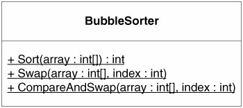
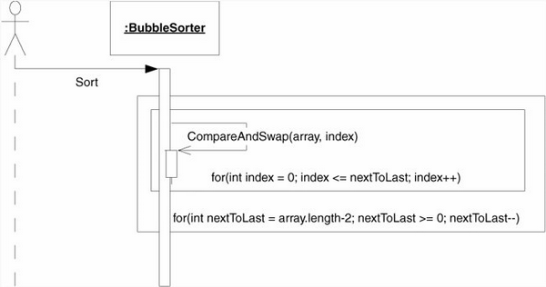
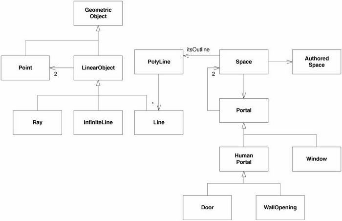

> 2009-09-06

为什么建模
==========
- 构建模型就是为了弄清楚某些东西是否可行
- 当模型比要构建的真实实体便宜得多时，我们就会使用模型来研究设计
- 当有一些确定的东西需要测试，并且使用UML要比使用代码测试起来代价更低一些时，就使用UML

## 有效使用UML
图的详细程度应该只是达成目标所必需的，请保持图示简单、干净，不应该当作声明所有方法、变量和关系的地方

### 与他人交流
如果你有一些想法需要和他人进行交流，UML是非常有用的

#### 设计想法(适合)

如上图示就非常清楚，可以看到`LoginPage`继承自`Page`，并使用了`UserDatabase`。很明显`UserDatabase`和`HttpResponse`都是`LoginPage`所需的。当一组开发人员站在一块白板前讨论类似图示的场景，__非常清晰__ 地表达出了代码结构看起来的样子。

#### 算法细节(不适合)

上图是描述冒泡排序算法的类图与序列图，这方面UML并 __不是非常合适__，图示并不比代码更易读，__绘制也难__ 得多

### 脉络图(适合)
在创建大型系统的结构脉络图(road map)方面，UML也很有用，可使得开发者快速能找到类之间的依赖关系，并提供了一份关于 __整个系统结构__ 的参考

上图很容易的看出`Space`对象含有`PolyLine`，而后者是由许多继承自`LinearObject`的`Line`组成，`LinearObject`包含两个`Point`。在代码中发现这个结构是一件令人厌烦的工作，而在脉络图中这个结构是显而易见的

### 项目结束文档(适合)

编写需要保存的设计文档的最好时机是在 __项目结束__ 的时候，并把它作为团队的最后一项工作，这种文档会精确的反映出设计的状态，对后继团队来说非常有用

