> 2009-09-06

UML概观
========
UML可以用来绘制关于问题领域、候选软件设计以及完成了的软件实现的图示，即 __概念级、规格说明和实现级__。本文关注后两个级别。

规格说明级和实现级的图示与源代码间有很强的关联，事实上，规格说明级图示的目的就是为了能够转换成源代码。同样，实现级图示是为了描绘已呢的源代码。这两上级别的图示必须 __遵循某些规则和语义__。

概念级的图示和源代码没有很强的关联，更多地是和人的语言相关，用于描绘存在于问题领域的概念和抽象的一种速记方法，因此可 __不必遵循__ 强的语义规则，其含义可以是模糊，而 __通过解释__ 来确定。而直接通过概念级图示去说明源代码是程序员和分析师之间产生误解的根源：__描述问题解决方案的规范说明 *不必* 与描述问题本身的概念图有什么相像之处__。

## 类图

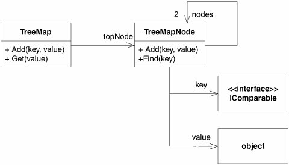

- 矩形表示类，箭头表示关系
- 本图中，所有关系都是关联(association)关系，关联是简单的数据关系，其中一个对象或者持有对另外一个对象的引用，或者调用了其方法
- 一般来说，和箭头相邻的数字表示该关系所包含的实例个数。如果数字比1大，意味着某种容器。
- 类图标中可以分成多个格间，最上面存放类的名字，其他描述属性与方法
- `<<interface>>`符号用来说明`IComparable`是一个接口
- 这里显示的大部分符号都是可选的
- 请注意 __关联关系是如何与实例变量对应__ 起来的，如从`TreeMap`到`TreeMapNode`的关联称为`topNode`，其对应于`TreeMap`中的`topNode`变量

<!-- ## 对象图
展示了在系统执行的某处特定时候的一组对象和关系，看作是一个 __内存的快照__

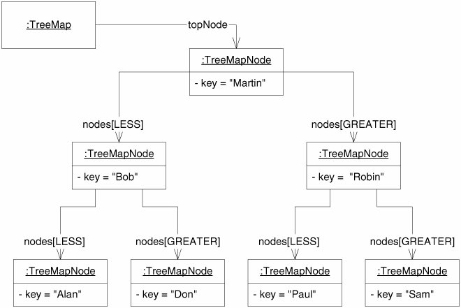

- 矩形表示对象，通过它们名字下面的下划线辨别出来，冒号后在是对象所属的类名字
- 每个对象的下层格间显示了该对象`key`变量的值
- 对象之间的关系称为 __链__，是通过关联导出的，针对`nodes`数组中的两个数组单元命名的
 -->

## 顺序图

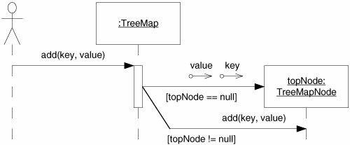

- 描绘了`TreeMap`的`Add`方法是如何实现的
- 人形线条图表示了一个未知调用者，调用了`TreeMap`对象的`Add`方法。如果`topNode`变量为`null`，`TreeMap`就创建一个新的`TreeMapNode`对象并把它赋给`topNode`，否则，`TreeMap`就向`topNode`发送`Add`消息
- 方括号中的布尔表达式称为 __监护条件__(guard)，它们指示出应该选择哪条路径。
- 终结点在`TreeMapNode`图标上的消息箭头表示 __对象构造__。
- 带有小圆圈的箭头称为 __数据标记__(data token)，本例中，描述了对象构造的参数
- `TreeMap`下面的窄矩形条称为 __激活__(activation)，表示`add`方法执行了多少时间

## 协作图

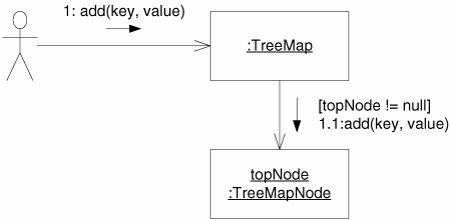

- 描绘了`TreeMap.Add`中`topNode`不会`null`的情况
- 协作图包含了顺序图中所包含的同样的信息
- 顺序图是为了清楚的表达出 __消息的顺序__，而协作图为了清楚地表达出 __对象之间的关系__
- 对象被称为链(link)的关系连接起来。只要一个对象可以向另外一个对象发送消息，就存在链关系，在链之上传递的正是消息本身，表示为一些小箭头。
- 消息上标记有消息名称、消息顺序号以及任何使用的监护条件
- 带点的顺序号表示 __调用的层次结构__。`TreeMap.Add`（消息1）调用了`TreeMapNode.Add`（消息1.1），因此，消息1.1 是 消息1 所调用的第一条消息

<!-- ## 状态图

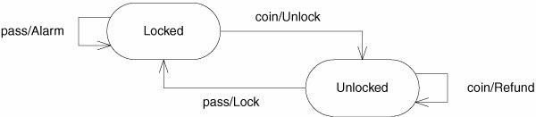

UML可以非常全面的表示有限状态机，上图是一个地铁旋转门的状态机，它有两个状态：`Locked`和`Unlocked`，可以向这个机器发送两个事件：`coin`事件表示用户向旋转门中投入一枚硬币，`pass`事件表示用户已经通过了旋转门。

- 图中箭头称为 __迁移__(transition)，其上标记有触发迁移的事件以及该迁移执行的动作，当一个迁移被触发时，会导致系统的状态发生改变
    - 如果在`Locked`状态收到`coin`事件，就迁移到`Unlocked`状态并调用`Unlock`函数
    - 如果在`Unlocked`状态收到`pass`事件，就迁移到`Locked`状态并调用`Lock`函数
    - 如果在`Unlocked`状态收到`coin`事件，就迁移到`Unlocked`状态并调用`Refund`函数
    - 如果在`Locked`状态收到`pass`事件，就迁移到`Locked`状态并调用`Alarm`函数
- 状态图是非常有用的，通过状态时，可以研究系统在 __未预料到__ 的情形下该如何动作，如：当用户没有正当理由的情况下投入一枚硬币后，接着又投入了另一枚硬币
 -->

为什么建模
==========
- 构建模型就是为了弄清楚某些东西是否可行
- 当模型比要构建的真实实体便宜得多时，我们就会使用模型来研究设计
- 当有一些确定的东西需要测试，并且使用UML要比使用代码测试起来代价更低一些时，就使用UML

## 有效使用UML
图的详细程度应该只是达成目标所必需的，请保持图示简单、干净，不应该当作声明所有方法、变量和关系的地方

### 与他人交流
如果你有一些想法需要和他人进行交流，UML是非常有用的

#### 设计想法(适合)

如上图示就非常清楚，可以看到`LoginPage`继承自`Page`，并使用了`UserDatabase`。很明显`UserDatabase`和`HttpResponse`都是`LoginPage`所需的。当一组开发人员站在一块白板前 __*讨论*__ 类似图示的场景，__非常清晰__ 地表达出了代码结构看起来的样子。

#### 算法细节(不适合)

上图是描述冒泡排序算法的类图与序列图，这方面UML并 __不是非常合适__，图示并不比代码更易读，__绘制也难__ 得多

### 脉络图(适合)
在创建大型系统的结构脉络图(road map)方面，UML也很有用，可使得开发者快速能找到类之间的依赖关系，并提供了一份关于 __*整个系统结构*__ 的参考

上图很容易的看出`Space`对象含有`PolyLine`，而后者是由许多继承自`LinearObject`的`Line`组成，`LinearObject`包含两个`Point`。在代码中发现这个结构是一件令人厌烦的工作，而在脉络图中这个结构是显而易见的

### 项目结束文档(适合)

编写需要保存的设计文档的最好时机是在 __项目结束__ 的时候，并把它作为团队的最后一项工作，这种文档会精确的反映出设计的状态，对后继团队来说非常有用。

UML图必须经过仔细考虑，__不需要数千页的顺序图__，要的是那些 __*描述系统关键要点*__ 的 __少量重要__ 的图示。

## 迭代式改进
要灵光一现时绘制UML吗？要先画类图然后再画顺序图吗？应该在涉及任何细节之前先搭建起系统的整体结构吗？

所有的回答是 __不__。人类能够做好的，都是采取 __*小步前进*__，然后对结果进行评估的方法 的事情。而采取大步跳跃，经常是做不好的。

### 行为优先(协作图)

> ps. 在分析层面，觉得还是四色建模之类的静态图来表达领域模型。在设计时可考虑这种做法，它能方便的找到类的 __*协作*__ 关系

从行动开始，UML会助于思考，首先绘制简单的顺序图或协作图。以手机控制软件为例：

- 想象软件检查着每一次按键，并向控制拨号的某个对象发送消息，因此我们会绘制出一个`Button`对象和一个`Dialer`对象，以及`Button`向`Dialer`发送多条`digit`消息（星号表示多条）

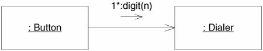

- 当`Dialer`收到一条`digit`消息时会做什么呢？得把这个数字显示在屏幕上，也许会向`Screen`对象发送`diaplayGigit`消息

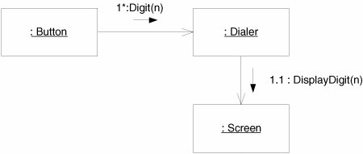

- 接下来，`Dialer`最好能让扬声器发出声音，因此，得让它向`Speaker`对象发送`tone`消息

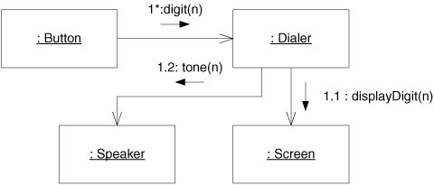

- 在某个时刻，用户会按下`Send`按钮，表示号码已经拨完。此时，让手机无线通信装置去连接手机网络并把所拨的电话号码传递出去

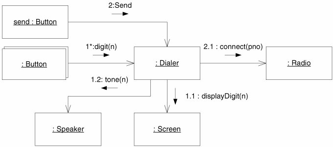

- 一旦连接建立起来，Radio就可以让`Screen`点亮"In-Use"指示灯，这条消息无疑得从一个不同的控制线程中发出（这一点是通过消息序号前面的字母来表示的）。最终的协作图如下

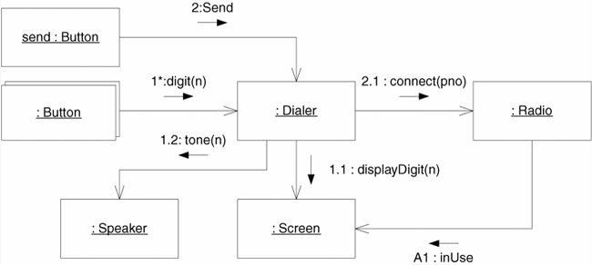

### 检查结构(类图)
上面展示了如何从零开始构建协作图。请注意如何创建对象的，我们无法提前知道将会出现这些对象；我们 __只知道我们得让某些事情发生，于是就创造对象来完成这些事情__

现在，在继承前进之前，得 __检查__ 一下这幅协作图对于代码结构来说意味着什么，因此我们创建了一幅类图来补充该协作图。类图包含了协作图中的每个对象的类，以及它们的 __依赖__ 关系

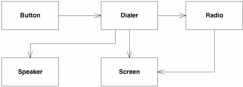

发现我们忽略了聚合和组合，这是故意的，会有充足的时间来考虑是否需要应用这些关系。

- 当前最重要的是 __*分析一下依赖关系*__，为何`Button`要依赖于`Dialer`呢？如果考虑这点，会发现这是非常丑陋的，这意味着如下代码：

<!--language: csharp-->

    public class Button {
        private Dialer itsDialer;
        public Button(Dialer dialer){
            itsDialer = dialer;
        }
        // ...
    }

- `Button`就是可以在 __不同上下文__ 中使用的类，比如可使用`Button`类来控制on/off开关、菜单按钮或话机上的其他控制按钮

- 可以通过`Button`和`Dialer`之间 __插入一个接口__ 来解决这个问题，每个`Button`都被赋予一个用于标识它的token，当检查到按钮按下时，`Button`类就调用`ButtonListener`接口听`buttonPressed`方法，并把标记传过去。这就解除了`Button`对于`Dialer`的依赖。这个改变 __并没有对上面的动态图造成任何影响，*对象完全一样，只是类发生了改变*__

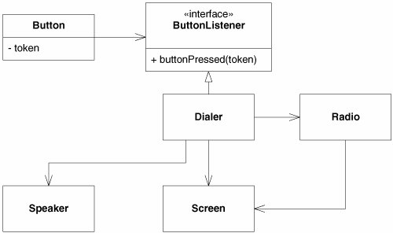

- 糟糕的是，现在我们让`Dialer`知道了一点`Button`的东西，`Dialer`为什么要从`ButtonListener`获取它的输入呢，它为何要有一个名为`buttonPressed`的方法呢？通过使用一些小 __适配器__，我们可以解决这个问题：

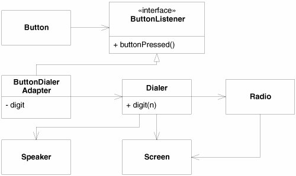

### 想象代码
使用图示时非常重要的一点就是能够想象出代码，我们把图示作为代码的速记，而不替代，如果画的图不能想象出它所表示的代码，那么就是构建空中楼阁。

<!--language: csharp-->

    public class ButtonDialerAdapter : ButtonListener {
        private int digit;
        private Dialer dialer;
        public ButtonDialerAdapter(int digit, Dialer dialer) {
            this.digit = digit;
            this.dialer = dialer;
        }

        public void ButtonPressed() {
            dialer.Digit(digit);
        }
    }

### 图的演化
在最后所做的改变使得动态模型变得无效，动态模型对适配器一无所知，需要更改一下。__以动态关系为开始，然后探索这些动态性所蕴涵的静态关系，再依据一些设计原则来更改静态关系，接着需要返回去改进动态图__

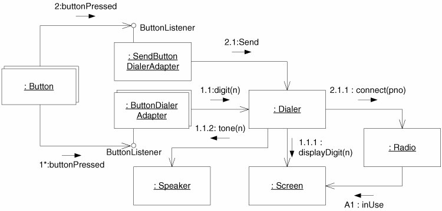

每一个步骤都是微小的，不要在动态图上投入超过5分钟的时间不去考虑其所蕴涵的静态结构，也中要在改进静态结构上超过5分钟而不去考虑其对动态行为造成的影响，应该使用非常短的周期来一起演化这两种图示。

## 何时绘制

### 何时要画
- 几个人都需要理解设计的某个特定部分的结构，因为他们都将同时工作于其上，当每个人都认为已经理解时，就停止
- 希望团队能够达成一致，但是有两个或者更多的人不同意某个特定元素的设计。把讨论限定在一个时间盒内，然后选择一种决策手段，时间盒终止或能够做出决策时就结束
- 尝试一个设计想法，并且图示有助进行思考时，当可以使用代码完成思考时就停止
- 要向他人或者自己解释代码某些部分的结构，当通过浏览代码可以更好地进行解释时就停止
- 快要到达项目的尾声，并且客户要求把图示做为向他人提供的一组文档中的一部分

### 何时不要画
- 工作流程的要求
- 认为这是好的设计者要做的事
- 为了编码前创建面面俱到的设计阶段文档
- 为了让其他人编码，真正架构师要参与到自己设计的编码中

### 文档呢
文档必须编写，对于什么不需要文档化和什么需要文档的选择一样重要。复杂的通信协议需要文档化，复杂的关系模型需要文档化，复杂的可重用的框架需要文档化，但不需要数百页的UML，应该简明扼要

文档包括了重要模块高层结构的UML图、关系模型ER图、一两页系统构建说明、测试指导、源码控制指导等。并放到wiki之类的协作式写作工具中，团队每个人都可以在屏幕上浏览，并在需要时进行搜索和更改

状态图
========
在描述有限状态机(FSM)方面，UML提供是丰富的符号，在GUI、通信协议以及任何基于事件系统中，FSM都可以使用

## 基础知识
下图展示了一个简单的状态迁移图(STD)，描绘了控制用户登录系统的FSM，

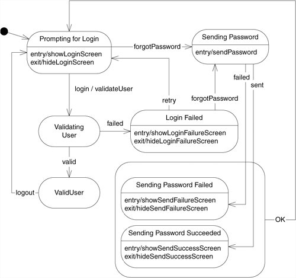

- 左上角的实心圆称为初始状态，PSM从这个伪状态开始，根据变迁规则，状态机一开始就迁移到`Prompting for Login`状态
- 在`Sending Password Failed`和`Sending Password Succeeded`状态外画了一个 __超状态__(superstate)，因为这两个状态都对`OK`事作做出反应，并都迁移到`Prompting for Login`状态，不想画两个完全一样的箭头，可使用这个手段

### 特定事件
状态图标的下层格间含有`event/action`对，`entry`和`exit`是标准事件，如果需要，可以提供自己的事件

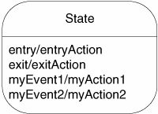

如下图，自反迁移不仅会触发myAction，还会触发`exit`和`entry`动作

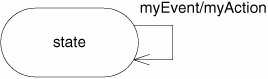

### 超状态
如登录的FSM那样，当许多状态以同样的方式响应某些不同的事件时，使用它

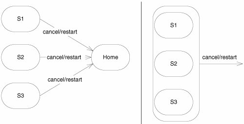

可以的画出子状态的迁移，__重写超状态的的迁移__，如下图（当然它们与继承关系不是等价的），

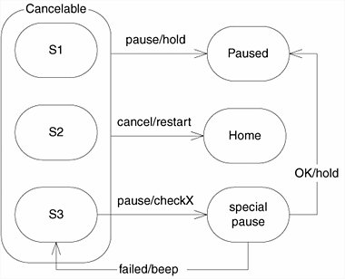

超状态有 __自己__ 的`entry`，`exit`及特定事件：

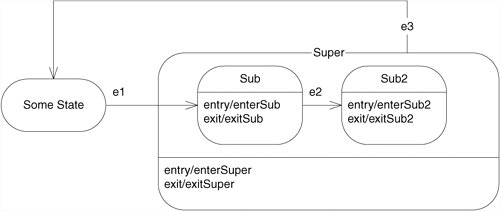

## 使用FSM图示
状态图用在理解那些 __已知__ 子系统的状态机方面非常有用，不过 __频繁变化__ 的系统，使用状态图时，随着时间的更改，图示的变化会成为一种负担。这时候可以考虑文本，它总是有地方来增加新的文本行，对于那些演化的系统，以 __文本方式创建状态迁移表STT__，而不是STD

如地铁旋转门的STD

通过状态图，可以研究系统在 __未预料到__ 的情形下该如何动作，如：当用户没有正当理由的情况下投入一枚硬币后，接着又投入了另一枚硬币

对应的STT为

<!--language: table-->

    |Current State |Event |New State  |Action |
    |--------------|------|-----------|-------|
    |Locked        |coin  |Unlocked   |Unlock |
    |Locked        |pass  |Locked     |Alarm  |
    |Unlocked      |coin  |Unlocked   |Refund |
    |Unlocked      |pass  |Locked     |Lock   |

基于此，可以使用状态模式来编写代码，甚至可以使用[SMC](http://www.objectmentor.com/resources/downloads.html)来生成相应代码，显然比维护图示容易得多

对象图
=======
当需要展示系统在某个特定时刻或者某个特定状态下的内部结构时，对象图很有用的，描绘了某些类和关系将要被使用的方式，有助于展示系统是如何随着各种输入而变化的。当系统的结构是 __动态构建__ 起来而不是静态的类结构决定时，但大多数情况下，都可以从相应的类图中直接推导出来，因此没有多少用途

## 主动对象
在 __多线程__ 系统中，对象图也非常有用，比如下面的代码，允许去编写`socket`服务器，而无需关心那些和`socket`相关的讨厌的线程和同步问题：

<!--language: csharp-->

    using System.Collections;
    using System.Net;
    using System.Net.Sockets;
    using System.Threading;

    namespace SocketServer {
      public interface SocketService {
        void Serve(Socket s);
      }

      public class SocketServer {
        private TcpListener serverSocket = null;
        private Thread serverThread = null;
        private bool running = false;
        private SocketService itsService = null;
        private ArrayList threads = new ArrayList();

        public SocketServer(int port, SocketService service) {
          itsService = service;
          IPAddress addr = IPAddress.Parse("127.0.0.1");
          serverSocket = new TcpListener(addr, port);
          serverSocket.Start();
          serverThread = new Thread(new ThreadStart(Server));
          serverThread.Start();
        }

        public void Close() {
          running = false;
          serverThread.Interrupt();
          serverSocket.Stop();
          serverThread.Join();
          WaitForServiceThreads();
        }

        private void Server() {
          running = true;
          while (running) {
            Socket s = serverSocket.AcceptSocket();
            StartServiceThread(s);
          }
        }

        private void StartServiceThread(Socket s) {
          Thread serviceThread =
            new Thread(new ServiceRunner(s, this).ThreadStart());
          lock (threads) {
            threads.Add(serviceThread);
          }
          serviceThread.Start();
        }

        private void WaitForServiceThreads() {
          while (threads.Count > 0) {
            Thread t;
            lock (threads) {
              t = (Thread) threads[0];
            }

            t.Join();
          }
        }

        internal class ServiceRunner {
          private Socket itsSocket;
          private SocketServer itsServer;

          public ServiceRunner(Socket s, SocketServer server) {
            itsSocket = s;
            itsServer = server;
          }

          public void Run() {
            itsServer.itsService.Serve(itsSocket);
            lock (itsServer.threads) {
              itsServer.threads.Remove(Thread.CurrentThread);
            }
            itsSocket.Close();
          }

          public ThreadStart ThreadStart() {
            return new ThreadStart(Run);
          }
        }
      }
    }

