> 2009-09-06

类级别设计原则
==================

## SRP 单一职责原则
- Single-Responsibility Principle，就一个类而言，应该仅有一个引起它变化的原因

> 这条原则曾在Tom DeMarco(结构化分析提出人)和Meilir Page-Jones的著作中描述，称之为 __内聚性__(cohesion)，SRP将内聚性和引起一个模块或类改变的作用力联系了起来

如果一个类承担的职责过多，等于把这些职责耦合在了一起。一个职责的变化可能会削弱或抑制这个类完成其他职责的能力。这种耦合会导致脆弱的设计，当变化发生时，设计会遭受到意想不到的破坏

### 示例
下图的设计，`Retangle`类具有两个方法，一个方法把矩形绘制在屏幕上，另一个方法计算矩形的面积

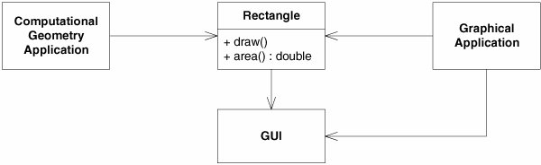

有两个不同的应用程序使用`Retangle`类，一个是有关计算几何学方面的，但从来不会在屏幕上绘制矩形；另一个是有关图形绘制方法的，也许会计算几何，但肯定会在屏幕上绘制。

> p.s. 其实暗含"不应该强迫客户依赖于它们不用的方法"

该设计就违反了SRP，盖因`Retangle`类具有两个职责。导致了一些严重问题：

1. 必须在计算几何应用程序中包含进GUI代码。如果是C++，就必须把GUI代码链接进来，而浪费编译时间、链接时间以及内存占用。如果是Java或C#，GUI的库必须部署到目标平台
1. 如果`GraphicalApplication`的改变原因导致了`Rectangle`的改变，这个改变会迫使我们重新构建、测试以及部署`ComputationalGeometryApplication`，如果忘记了这样做，后者可能会不可预测的方式失败

较好的设计是把这两个职责分离到两个完全不同的类中

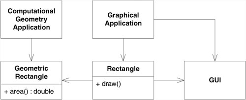

> p.s. 实为使用"合成+委托"进行解耦

### 什么是职责
在SRP中，我们把职责定义为 __变化的原因__，多于一个动机去改变一个类，那么这类就具有多于一个职责。有时，我们很难注意到这一点，我们习惯于以组的形式去考虑职责。下面是一个`Modem`接口

<!--language: csharp-->

    public interface Modem{
        void Dial(string pno);
        void Hangup();
        void Send(char c);
        char Recv();
    }

然而，该接口却显示出两个职责：连接管理(`Dial`,`Hangup`) 和 数据通信(`Send`,`Recv`)

但是，这两个职责应该被分开吗？__依赖于应用程序变化的方法__。如果应用程序的变化会影响连接函数的签名(signature)，那么这个设计就具有僵化性的臭味，因为调用`Send`,`Recv`方法的类必须要重新编译、部署，而这个过程的次数常常会超过我们希望的次数。更好的设计是如下：

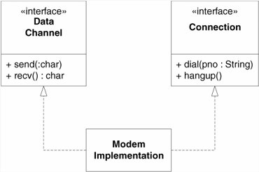

另一方面，如果应用程序的变化方式总是导致这两个职责同时变化，那么就 __不必分离它们__

### 持久化时耦合

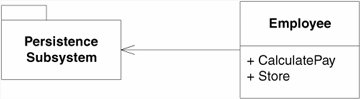

这是一种常见的违反SRP的情形，`Employee`类包含了业务规则和对持久化的控制。这两个职责大多数情况下不应该混合在一起。业务规则往往会频繁的变化，而持久化的方式却不会，并且变化的原因也是完全不同的。

## OCP 开放-封闭原则
- Open/Closed Principle，软件实体（类、模块、函数等）应该是可以扩展的，但是不可修改

> Ivar Jacobson(用例发明人，UML三友之一)说过，"任何系统在其生命周期中都会发生变化。如果我们期望开发出的系统不会在第1版本后就被抛弃，就必须牢牢地记住这一点"。但如何做不断推出新版本？Bertrand Meyer(Eiffel编程语言的创造者，DBC提出者)在1988年提出了该原则

如果程序中的一处改动就会产生连锁反应，导致一系列相关模块的发动，那么设计就具有僵化性。OCP建议我们应该对系统进行重构，这样以后对系统再进行那样的发动时，就会导致更多的修改，只需添加新的代码，而不必改动已经正常运行的代码。

### 描述
遵循OCP原则设计出来的模块具有两个主要特征：

1. "对于扩展是开放的"(Open for extension)，意味着模块的行为是可以扩展的。当应用的需求改变时，我们可以对模块进行扩展，使其具有满足那些改变的新行为。
1. "对于更改是封闭的"(Closed for modification)，对模块的行为进行扩展时，不必改动模块的源代码或二进制代码。模块的二进制可执行版本，无论是可链接的库、DLL或者.jar都无需改动

### 关键是抽象

在OOP语言中，可以创建出固定却能够描述一组任意个可能行为的抽象体，称为 __抽象基类__，而这一组任意个可能的行为则表现为可能的派生类。模块可以操作一个抽象体，由于模块依赖一个固定的抽象体，所以它对于更改是关闭的，同时通过这个抽象体派生，也可扩展此模块的行为。

__策略模式__ 与 __模板方法__ 是满足OCP的最常用的方法，应用它们可以把一个功能的 __通用部分和实现细节__ 部分清晰的分离开来。

- STRATEGY pattern

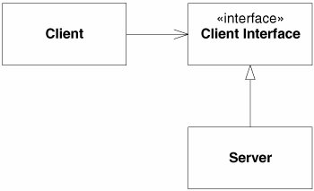

- TEMPLATE METHOD pattern

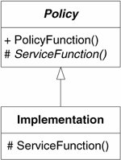

#### 预测变化和贴切的结构
如果我们预测了变化，那么就可以设计一个抽象来隔离它。即必须对于他设计的模块应该对哪种变化封闭做出选择，先猜出最有可能发生的变化种类，然后构造抽象来隔离那么变化。这就需要设计人员具备 __应用领域的经验__。但这不容易做到，甚至猜测错误，还不如发生变化后采取行动（重构得到架构）

> 除了设计层面的原则，在语言实践方面，可参考C#中的扩展方法，以及Ruby中的monkey patch

## LSP Liskov替换原则
- Liskov Substitution Principle，子类型必须能够替换掉它们的基类型

> Barbara Liskov(2008年图灵奖得主，2004年约翰·冯诺依曼奖得主)在1988年说到："这里需要如下替换性质：若对每个类型S的对象o1，存在一个类型T的对象o2，使得在所有针对T编写的程序P中，用o1替换o2后，程序P的行为功能不变，则S是T的子类型"

某些情况会使我们创建的类层次结构掉进不符合OCP的陷井中，这些正是LSP要解答的问题

### 运行时类型辨别
对于LSP违反常常会导致明显违反OCP的方式，使用运行时类型辨别(RTTI)，如向下转型得到对象的具体类型再进行操作

### 契约式设计
另一个经典例子，正方形是一种矩形，但行为并不一样，如果将正方形传递给需要矩形的地方，有可能产生错误，这就违反了LSP。

当然本例主要是对OO中`is-a`的未精确定义引起的，面向对象中的继承，并不对现实世界的一一对应，继承更关注的是行为契约，而不是类型的匹配。所以与其说是`is-a`或`is-a-kind-of`的关系，不如说 __`behaves-like-a`__ 或`is-substitutable-for`的关系

### 示例
有一个第三方的Set库，含有`BoundedSet`和`UnboundedSet`，为了不使自己的应用代码依赖于这些第三方的库，提炼出一个抽象`Set`，并做个适配层：

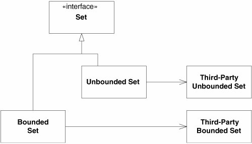

<!--language: cpp-->

    tempate <class T>
    class Set{
        public:
            virtual void Add(const T&) = 0;
            virtual void Delete(const T&) = 0;
            virtual void IsMember(const T&) = 0;
    };

接下来想在该层中加入`PersistenSet`，即把集合中的元素写入流，但提供该功能的第三方容器类不是一个模板类，相反它只接受虚基类`PersistentObject`的派生对象，所以改进设计如下：

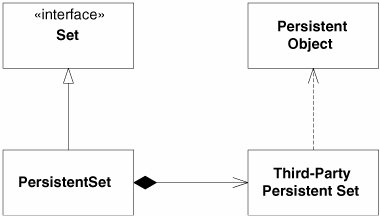

`PersistenSet`包含了一个第三方持久性集合的实例，它把所有方法都 __委托__ 给该实例。其实隐藏着一个别扭的设计，加入第三方持久性集合的元素必须从`PersistentObject`派生，所以`PersistenSet`中的元素也必须从`PersistentObject`派生，但`Set`接口没有这样的限制。

<!--language: cpp-->

    void PersistentSet::Add(const T& t){
        PersistentObject& p = dynamic_cast<PersistentObject&>(t);
        itsThirdPartyPersistentSet.Add(p);
    };

如果任何客户企图向`PersistenSet`中添加不是从`PersistentObject`派生的对象，将会发生运行时错误，但是抽象基类`Set`的所有现存客户都不会预计到调用`Add`时会抛出异常，所以对类层次做的改动，违反了LSP原则

> 用契约式设计语言来说，先验条件被 __强化__ 了

所以`PersistenSet`和`Set`之间并存在`is-a`关系，更合适的方式是如下，__提取公共部分的方法代替继承__：

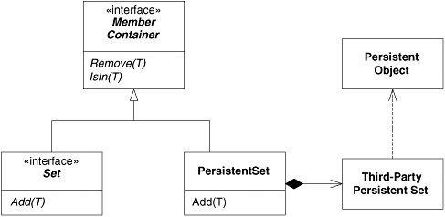

### 结论
OCP原则应用得有效，应用程度就会具有更强的可维护性、可重用性，但LSP是OCP成为可能的主要原则之定，正是子类型的可替换性才使得基类型表示的模块在无需修改的情况下可以扩展

> 光`is-a`不足以使用继承，还得看是否满足`behaves-like-a`，如果仅仅为了重用，考虑使用 __私有继承__(C++)或 __合成__

## ISP 接口隔离原则
- Interface Segregation Principle，不应该强迫客户依赖于它们不用的方法。接口属于客户，不属于它所在的类层次结构

这个原则用来处理"胖"接口所具有的缺点，如果类的接口不是内聚的，表示该类具有"胖"的接口

如果强迫客户程序依赖于那些它们不使用的方法，那么这些客户程序就面临由于这些未使用的方法改变所带来的变更。

### 接口污染
有`Door`负责开关门，`Timer`类如下，用于超时通知

<!--language: cpp-->

    class Timer{
        public:
            void Register(int timeout, TimerClient* client);
    };
    class TimerClient{
        public:
            virtual void TimeOut() = 0;
    };

现在需要一个`TimedDoor`，如果门开着时间过长，它就会发出警报声。下面是容易想到一种方案

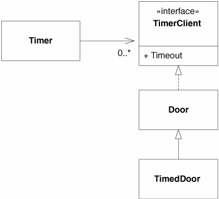

`Door`依赖了`TimerClient`，可并不是所有种类的`Door`都需要定时功能。一方面创建无须定时功能`Door`的派生类时，必须提供`TimeOut`方法的退化(degenerate)实现，这违反了LSP；另一方面，即使程序不使用`TimerClient`类的定义，也必须要引入它，进行编译与部署

### 分离客户就是分离接口
`Door`接口和`TimerClient`接口是完全不同的客户程序使用的，__既然客户程序是分离的，所以接口也应该保持分离__，因为客户程序对它们使用的接口施加有作用力

### 类接口与对象接口

#### 使用委托分离接口
一个解决方案是创建一个派生自`TimerClient`对象，并把该对象的请求委托给`TimedDoor`

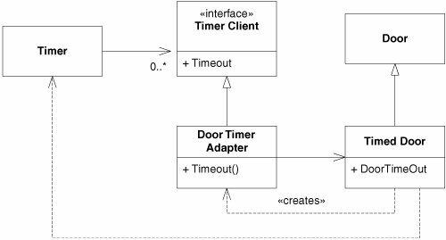

当`TimedDoor`想要向`Timer`对象注册一个超时请求时，它就创建一个`DoorTimerAdapter`并且把它注册给`Timer`，当后者发送`TimeOut`消息给`DoorTimerAdapter`时，它把消息委托给`TimedDoor`

#### 使用多重继承分离接口

当然C++中也可用模板来解决

## DIP 依赖倒置原则
- Dependency-Inversion Principle
    1. 高层模块不应该依赖于低层模块，二者都应该依赖于抽象
    1. 抽象不应该依赖于细节，细节应该依赖于抽象

### 层次化
如下图，__依赖关系是传递的__，低层模块的修改为直接影响到高层模块，并且不同上下文中，重用高层模块变得非常困难

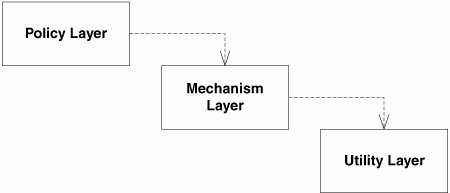

而下面是一个更合适的模型，每个较高层次都为它所需要的服务声明一个抽象接口中，较低的层次实现了这些抽象接口中。每个高层类都通过该抽象接口使用下一层。从而高层就不依赖于低层，低层反而依赖于高层中声明的抽象服务接口

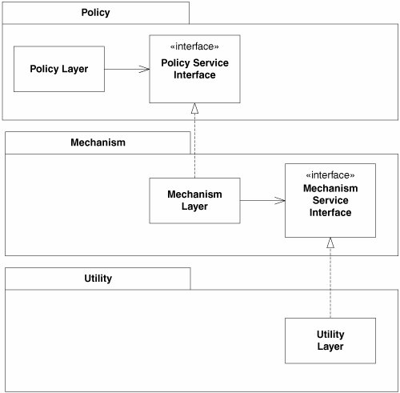

### 倒置接口所有权
这里的倒置不仅是依赖关系的倒置，也是接口所有权的倒置，当应用了DIP时，往往是客户拥有抽象接口中，而服务者则从抽象接口派生

也是Hollywood原则，"Don't call us, we'll call you"

> 个人感觉Hollywood原则更应该是控制反转，应用于框架中，实现基础模块调用应用模块

### 依赖于抽象
启发式规则建议不应该依赖于具体类，程序中所有依赖关系都应该终止于抽象类或者接口

- 任何变量都不应该持有一个指向具体类的引用
- 任何类都不应该从具体类派生
- 任何方法都不应该重写它的任何基类中的已经实现了的方法

当然，对于那些虽然具体但却稳定的类来说似乎不太合理。

### 示例

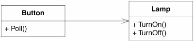

`Button`对象感知外部环境的变化，`Lamp`对象当接收`TurnOn`时显示某种灯光，当接收`TurnOff`消息时，它把灯熄灭。

<!--language: csharp-->

    public class Button {
        private Lamp lamp;
        public void Poll() {
            if (/*some condition*/)
                lamp.TurnOn();
        }
    }

这个方案违反了DIP，应用程序的高层策略没有和低层实现分离，更好的方式是如下：

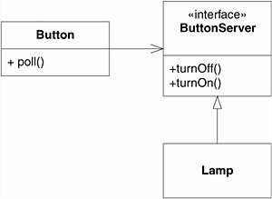

### 动态多态与静态多态
在完成依赖关系的倒置过程中，除了使用动态的多态，即抽象类或接口的对象，在运行时指定实现了它们的具体类的实例。

此外还有，C++中的模板编程（泛型），允许在编译期间实例化，没有动态绑定的运行开销，也没有接口实现的要求，只要求泛型对象具有指定方法即可，缺点是运行时不能更改。

包级别设计原则
==================

- 如何进行包的设计？对应用程序中的类进行划分，然后把这些划分后的类分配到包中。但类经常会和其他类之间存在依赖关系，这些依赖关系还经常会跨越包的边界。因此，包之间也会产生依赖关系。包之间的依赖关系展现了应用程序的高层组织结构，我们应对这些关系进行管理。
    1. 在向包中分配类时应该依据什么原则？
    1. 应该使用什么设计原则来管理包之间的关系？
    1. 包的设计应该先于类呢（自顶向下）？还是类的设计应该先于包（自底向上）？
    1. 如何实际表现出“包”？在C++中如何表现？在Java中如何表现？在某种开发环境中又如何表现？
    1. 包创建好后，我们应当将它们用于何种目的？

- 前3个原则关注包的 __内聚性__(粒度)，这些原则能够指导我们对类组包，这些原则基于以下事实：至少已经存在一些类，并且它们之间的相互关系也已经确定，这些原则是根据“自底向上”的观点进行划分
    - 我们习惯认为内聚性不过是指一个模块执行一项并且仅仅一项功能
    - 然而，关于包的内聚性，还要考虑可重用性与可开发性(developability)之间的相反作用力
    - 此外，这还是动态的，今天合适的划分到了明年也许不再合适，当项目重用从可开发性向可重用性转变时，包的组成会变动随时间而演化
- 后3个原则关注包的 __耦合性__(稳定性)，这些原则帮助我们确定包之间的相互关系，我们会再次碰到可开发性和逻辑设计之间的冲突力，来自技术和行政方面的作用力都会影响到包的组织结构，并且这种作用力还是易变的；
- 最后2个还描述了一组依赖性管理度量(Dependency Management metrics)方面的内容。

## REP 重用发布等价原则
- Reuse/Release Equivalence Principle，重用的粒度就是发布的粒度

### 行政问题

当你重用一个类库时，除了得到好的文档，可以工作的代码，规格清晰的接口，还有其他期望：

1. 希望作者自己能保证维护这些代码
1. 希望代码的作者在计划对代码的接口和功能进行任何改变时，提前通知你一下。代码的作者必须尊重你拒绝使用任何新版本的权力。而且作者必须保证对于你所使用的旧版本继续提供一段时间的支持。

这是行政问题，如果有其他人将要重用代码，就必须要进行行政和支持方面的工作，但这些 __行政__ 上的问题对于软件的 __包结构__ 具有深刻的影响。为了给重用者提供所需的保证，代码的作者必须把他们软件组织到一个可重用的包中，并且通过 __版本号__ 对那些包进行跟踪。

### 重用粒度与发布粒度

REP指出，一个包的 __重用粒度__(granule of reuse)可以和 __发布粒度__(granule of release)一样大。我们所重用的任何东西都必须同时被发布和跟踪。只有建立一个 __跟踪系统__，为潜在的使用者提供所需的变更通知、安全性以及支持后，重用才有可能。

REP带给我们关于如何把设计划分到包中的第一个提示，由于重用性必须是基于包的，所以可重用的包必须包含可重用的类，因此，至少，某些包应该由一组可重用的类组成。

关于包的内部结构方面，我们必须从潜在的重用者的角度去考虑包的内容，如果一个包中的软件是用来重用的，那么它就不能再包含不是为了重用目的而设计的软件。一个包中的软件要么都是可重用的，要么都不是可重用的。

## CRP 共同重用原则
- Common Reuse Principle，一个包中的所有类应该是共同重用的。如果重用了包中的一个类，那么就要重用包中的所有类

### 什么类放在一起
这个原则帮助我们决定哪些类应该放进同一个包中，它规定了 __趋向于共同重用的类__ 应该属于同一个包。

类很少会孤立的重用，可重用的类需要与作为该可重用抽象一部分的其他类协作。CRP规定了这些类应该属于同一个包，在这样一个包中，我们会看到类之间有很多的互相依赖。

一个例子是容器类以及与它关联的迭代器类，彼此紧密耦合在一起，必须共同重用，所以应该在一个包中

### 什么类不应该放一起

但是CRP告诉什么类应该共同放入一个包中，还告诉我们什么类不应该放在同一个包中。当一个包A仅仅使用了另外一个包B中的一个类，也是包之间的依赖，每当被使用的包B发布时，使用者A包必须重新验证和重新发布，即使是被使用包B更改的只是A包根本不关心的类，也必须这样做

此外，包也经常以共享库、DLL、JAR等物理表示的形式出现，如果被使用的包以JAR形式发布，那么使用这个包的代码就依赖于整个JAR，对JAR的任何修改，都会造成JAR的一个新版本发布，并且使用这个JAR的代码也要进行重新验证

因此CRP告诉我们更多的是：__什么类不应该放在一起__

## CCP 共同封闭原则
- Common Closure Principle，包中的所有类对于同一类性质的变化应该是共同封闭的。一个变化若对一个包产生影响，则对该包中的所有类产生影响，而对于其他的包不造成任何影响

### 单一职责
这是单一职责原则SRP对于包的重新规定，一个包不应该包含多个引起变化的原因。

大多数应用时，可维护性重要性是超过可重用性的，如果一个应用中的代码必须更改，我们宁愿更改都集中在一个包中，而不是分布在多个包中。

CCP鼓励可能由于同样原因而更改的所有类共同聚集在同一个地方，如果两个类之间有非常紧密的绑定关系，不管是物理上的还是概念上的，那么它们总是会一同进行变化，因而它们应该属于同一个包中，这样做会减少软件的发布、重新验证、重新发行的工作量

### 开放封闭原则
这个原则也和开放封闭原则OCP密切相关，CCP通过把一些确定的 __变化类型开放的类__ 共同组织到同一个包中，当需求中一个变化到来时，那个变化会限制在最小数量的包中

## ADP 无环依赖原则
- Acyclic Dependencies Principle，在包的依赖关系图中不允许存在环

如果开发环境中存在许多开发人员都在更改相同的源代码文件集合的情况，那么就会发生集成困难，甚至几周无法构建一个特定的项目版本，而每个人都忙于一遍遍地更改他们的代码，试图能够相容于其他人所做的更改。

解决办法是 __每日构建__ 与 __消除依赖环__

### 消除依赖环

通过把开发环境划分成可发布的包，这些包可以作为工作单元被一个开发人员或者一个开发团队签出(check out)，当开发人员使一个包可以工作时，就把它发布给其他开发人员使用。他们赋予该包一个 __版本号__ 并把它移到一个其他开发人员使用的目录中。接着，他们可以在 __自己的私有区域__ 中继续修改他们的包。__其他所有人都使用那个已经发布__ 的版本。

当制作了一个包的新版本时，其他开发团队可以决定是否马上采用这个新的版本。如果不，则他们完全可以 __继续使用老的版本__。一旦觉得自己准备就绪，就可以开始使用新的版本。

因此，所有的开发团队都不会受其他开发团队支配。对一个包作的更改不必立即反应到其他开发团队中。

集成是以 __小规模增量__ 的方式进行的，而不是所有开发人员必须集合到一起把他们做的每一件工作集成起来的情况

这是一个非常简单、合理的过程，但要使其能够工作，就必须要 __对包的依赖关系结构进行管理__。包的依赖关系结构中不能有环。如果依赖关系结构中存在环，则还会出现集成困难

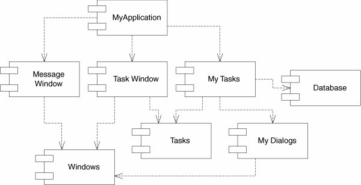

本图中，该应用程序功能并不重要，重要的是包的依赖关系结构。该结构是一个有向图(directed graph)。其中，包是结点(node)，依赖关系是有向边(directed edge)。

而且，无论从哪个包开始，都无法沿着依赖关系而绕回这个包，该结构中没有环，是一个有向无环图(DAG)

当负责`MyDialogs`的团队发布了该包的一个新版本时，会很容易找出（逆着依赖关系指向寻找）受影响的包，` MyTasks`,`MyApplication`会受到影响，这两个包的开发人员就要决定何时应该和`MyDialogs`的新版本集成。

当`MyDialogs`发布时，完全 __不会影响到系统中许多其他的包__，它们不知道`MyDialogs`，并且也不关心，这意味着发布`MyDialogs`的影响相对较小

反过来，工作于`MyDialogs`包的开发人员想要运行该包的测试时，只需把他们的`MyDialogs`版本和当前正在使用的`Windows`包的版本一起编译、链接即可。不会涉及到系统中任何其他的包，意味着只需 __较少的工件即可建立一个测试__，而且要考虑的变数也不多

发布整个系统时，是 __自底向上__ 进行的，首先是`Windows`包，然后是`MessageWindow`和`MyDialogs`，在它们之后是`Tasks`，然后是`TaskWindow`和`Database`，接着是`MyTasks`，最后是`MyApplication`，这个过程非常清楚并且易于处理，我们知道如何去构建系统，因为我们理解系统各个部分之间的依赖关系

### 包依赖关系图中环造成的影响

但如果是下图这样，就产生了一个依赖环

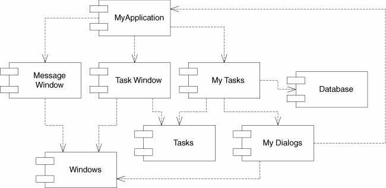

导致的一些直接后果，如`MyTasks`和`MyDialogs`包，为了发布，必须兼容系统中所有包，这就使得该包非常难以发布，依赖环的存在迫使所有包几乎同步发布，实际上已经变成了一个大包，彼此间发布行动要完全一致，因为他们必须要使用彼此间完全相同的版本

另一个问题，考虑要测试一下`MyDialogs`，必须要链接进系统中所有包，包括`Database`，意味着仅仅为了测试，就必须要做一完整的构建。而且编译时间会随模块的数目成几何级数增长

此外，如果依赖环存在，就很难确定包的构建顺序（也许就不存在正确的顺序），对像Java一样要从编译过的二进制文件中读取它们的声明的语言来说，会导致一些讨厌的问题

### 消除依赖环
- 使用依赖倒置原则DIP，针对上图，可以创建一个具有`MyDialogs`需要的接口的抽象基类，然后，把该抽象基类放进`MyDialogs`中，并使`MyApplication`中的类从其继承，这就倒置了`MyDialogs`和`MyApplication`间的依赖关系，从而解除了依赖环

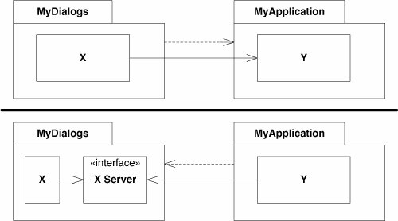

- 新创建一个`MyDialogs`和`MyApplication`都依赖的包，把`MyDialogs`和`MyApplication`都依赖的类移到这个新包中

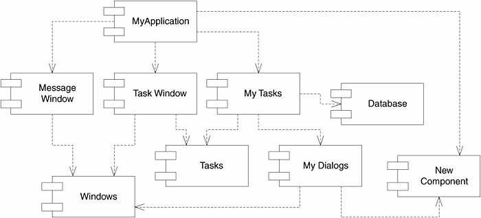

该方案意味着，在需求改变时，包的结构是不稳定的，事实上，随着应用程序的增长，包的依赖关系结构会抖动和增长，需要始终对依赖关系结构中的环的情况进行监控，如果出现了环，就必须使其解除，有时会创建新的包，致使依赖关系结构增长

### 自顶向下与自底向上
基于上面情况，我们得出：__不能在没有代码的情况下自顶向下的设计包的结构__，包的结构不是设计系统时首先考虑的事情之一，事实上包结构应该是随着系统的增长、变化而逐步 __演化__ 的

这好像是违反直觉的，我们认为像这样的大粒度的分解同样也是高层的功能分解，当我们看到一个像包依赖关系结构的大粒度的分组时，就会觉得包应该以某种方式描绘了系统的功能。

虽然，包之间确实互相提供服务和功能，但还有比这个更为重要的东西

包的依赖关系是应用程序 __可构建性__ 的映射图，这就是为什么无法在项目开始时完全设计出来它们的原因，同样也说明了它们不是严格的功能分解。随着实现的设计和初期累积越来越多，对依赖关系进行管理，此外，尽可能地 __保持更改的局部化__，需要关注SRP和CCP，并把可能 __一同变化__ 的类放在一起

随着应用程序的增长，开始关注创建 __可重用__ 的元素，开始使用CRP来指导包的组合，最后，当 __环出现__ 时，就会使用ADP，从而包的依赖关系图会抖动及增长，原因更多的 __因为依赖结构而非功能__

如果有设计任何类之前试图去设计包的依赖关系结构，可很能会失败，对于共同封闭还没有多少了解，也没觉察到任何可重用的元素，几乎会创建产生依赖环的包，所以，包的依赖关系是和系统的逻辑设计一起增长和演化的。

## SDP 稳定依赖原则
- Stable-Dependencies Principle，朝着稳定的方向进行依赖

设计不能完全静态的，要使设计可维护，某种程度的易变性是必要的，通过遵循CCP来达到这个目标，使用这个原则，可以创建对某些变化类型敏感的包，__这些包设计成可变的__，我们期望它们变化

对于任何包而言，如果期望它是可变的，就不应该让一个难以更改包依赖于它，否则，可变的包同样也会难以更改

通过SDP就是确保打算易于更改的模块不会被那些比它们难以更改的模块所依赖

### 稳定性
软件包难以更改的因素有许多：它的规模、复杂性、清晰程度等，要使一个包难以改变，一个肯定可行方法是让许多其他的软件包依赖于它，具有很多输入依赖的包是非常稳定的，因为要使所有依赖于它的包能够相容于对它所做的所有更改，往往需要非常大的工作量。

下面的X是 __稳定的__ 包，因为有3个包依赖它，它 __有3个合理理由不去更改它__，另外X不依赖于任何包，称无依赖的

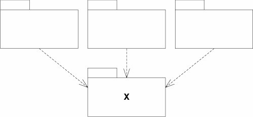

相反，下图Y是不承担负责的，但它依赖于3个包，__具有3个外部更改源__，所以它是 __不稳定的__，是依赖性的

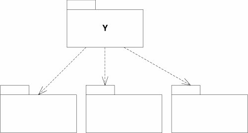

### 稳定性度量
- Ca 输入耦合度(afferent coupling)：处于该包的外部，并依赖于该包内的类的数目
- Ce 输出耦合度(efferent coupling)：处于该包的内部，并依赖于该包外的类的数目
- I 不稳定性：Ce/(Ca+Ce)，取值范围是[0,1]，0表示最大稳定性，1表示最大不稳定性

SDP规定一个包的I度量值应该大于它所依赖的包的I度量值，I度量值应该顺着依赖的方向减少

### 并非所有的包都应该稳定
如果一个系统中所有包都是最大程度稳定，那么该系统是不能改变的，这不是所希望的情形，事实上，我们希望所设计出来的包结构中，一些包是不稳定的，另外一些是稳定的。

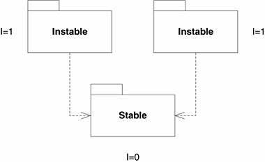

可改变的包位于顶部并依赖于底层的稳定包，把不稳定的包放在图的顶部是一个有用的约定，因为任何向上的箭头都意味着违反了SDP

下面违反了SDP，`Stable`的开发人员创建了一个对`Flexible`的依赖，结果后者就不再容易更改了，前者I度量值比后者I度量值小的多

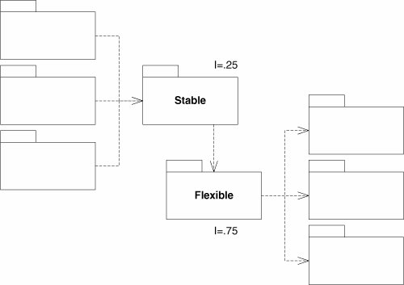

要修正这个问题，我们必须以某种方式解除`Stable`对`Flexible`的依赖，我们假设后者有一个类C被前者的类U使用

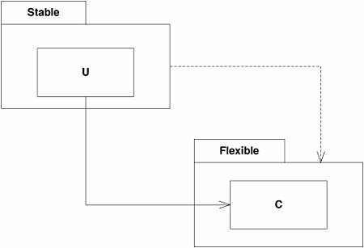

可以使用DIP来修正它，创建一个接口类，解除了`Stable`对`Flexible`的依赖，两者都依赖于`UInterface`，而它非常稳定(I=0)，`Flexible`仍保持它不稳定性(I=1)，现在所有依赖方向都是顺着I减少的方向

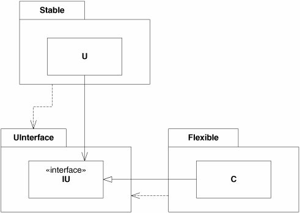

### 高层设计的位置
系统中某些部分不应该经常改变，代表着系统的高层架构和设计决策，希望这些架构是稳定的，因此，应该把封装系统高层设计的包放进稳定的包中(I=0)，不稳定的包(I=1)中应该只包含那些很可能会改变的代码

怎样让高层设计且具有稳定性(I=0)的包足够灵活，可以经受得住变化，在OCP可以找到答案：抽象

## SAP 稳定抽象原则
- Stable-Abstractions Principle，包的抽象程度应该和其稳定程序一致

该原则把包的稳定性和抽象性联系起来，它规定，__一个稳定的包应该也是抽象的__，这样它的稳定性就不会使其无法扩展，另外，一个不稳定的包应该是具体的，因为它的不稳定性使得其内部的具体代码易于更改

因此 __一个包是稳定的，那么它应该要包含一些抽象类__，这样就可以对它进行扩展。可扩展的稳定包是灵活的，并且不会过分限制设计。

SAP和SDP结合在一起形成了针对包的DIP原则，因为SDP规定依赖应该朝着稳定的方向进行，而SAP则规定了稳定性意味着 __抽象性__，因此，依赖应该朝着抽象的方向进行。

然而，DIP是一个处理类的原则，一个类要么抽象，要么不是，但SDP和SAP结合是处理包的，并且允许一个包是部分抽象、部分稳定和

### 抽象性度量
- Nc: 包中类的总数
- Na: 包中抽象类的数目，一个抽象类至少具有一个抽象（纯虚）方法的类，并且它不能被实例化
- A=Na/Nc: 抽象性，取值范围[0,1]，0意味着包中没有任何抽象类，1意味着包中只包含抽象类

### 主序列
定义稳定性I和抽象性A之间的关系，创建一个以A为纵轴，I为横轴的坐标图，那么最稳定、最抽象的包位于左上角(0,1)处，那些最不稳定、最具体的包位于右下角(1,0)

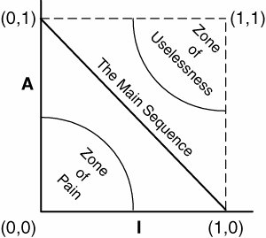

并非所有包都会落在这两个位置，包的抽象性和稳定性是有程度的，如一个抽象类派生自另一个抽象类的情况很常见，派生类是具有依赖性的抽象体，虽然它是最大限度抽象，但却不是最大程度稳定的，它的依赖性会降低它的稳定性

不能强制所有包都位于(0,1)或(1,0)，所以必须假定在图上定义包的合理位置点的轨迹，可以通过找出包不应该在位置（被排除的区域）来推断该轨迹的含义

- __痛苦地带(Zone of Pain)__：一个在(0,0)附近的包，是一个高度特定且具体的包，它是僵化的，无法对它进行扩展，因为它不是抽象的，并且由于它是稳定的，也难对它进行更改。
    - 有些情形中，包确实会落入该地带，数据库模式包就是一个例子，易变性是众所周知的，并且它还是非常具体、高度被依赖的。
    - 另一个例子是具体的工具库，事实上它可能是稳定的，如"string"包，即使它内部的所有类都是具体的，它也是稳定的，这种位于该区域不会造成损害

- __无用地带(Zone of Uselessness)__：一个在(1,1)附件的包，不是一个好位置，因为该位置的包具有最大抽象性却没有依赖者，这种包是没有用的。

让可变的包尽可能的远离这两个被排除的区域，那些距离这两个区域最远的轨迹点组成了连接(1,0)和(0,1)的线，称为 __主序列__(main sequence)

### 到主序列的距离

为此我们需要最后一个度量，如果希望包能够位于或者靠近主序列，可以创建一个度量来衡量包到这个理想位置的距离

- D 距离: 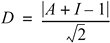，该度量的取值范围是[0, ~0.707]
- D' 规范化的距离; D'=|A+I-1|，取值范围是[0,1]，0表示包正好位于主序列上，1表示包到主序列的距离最远，使用起来比D方便些

使用这个度量，可以全面分析一个设计和主序列间的一致性，首先计算出每个包的D度量值，然后对所有D值不在0附近的包进行复查和调整。这种分析 __有助于设计确定哪些包更容易维护些，哪些包对变化更不敏感些__

- 空间分布：计算出设计中所有包D度量值的均值和方差，方差可以用建立"控制范围"，以识别那些显得“特别”的包，在这个分布图中，大多数包沿着主序列分布，但其中一些包的均值之间的距离超过一个标准差(Z=1)，__这些偏离的包值得留意一下__。

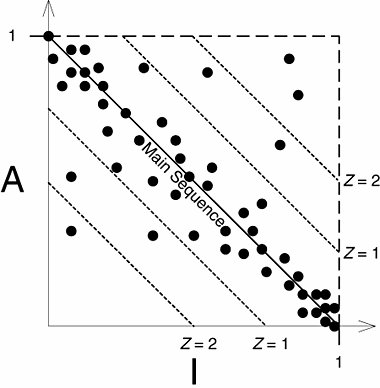

- 时间分布：绘制出每个包的D'度量值随时间的分布图，图中显示了一个控制门限D'=0.1，R2.1的发布已超出了这个控制限制，值得我们花费一些时间找出这个组件远离主序列的原因

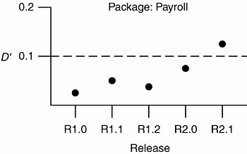

