> 2016-08-07

责任模式
========

`团体模式`（人和组织的超类型）和`组织层次模式` 组合在一起构成 `责任模式`，它可以处理团体之间的许多关系，包括组织结构、患者同意、服务协议、雇佣关系、专业机构注册等

当用责任模式时，描述可形成哪种类型的责任模式，以及这些责任模式的约束规则，可用`责任知识级`的类型实例来描述

责任模式定义了团体的职责，可通过`操作范围`模式来定义，当这些职责增多时，让它们隶属特定的`职位`模式（而不是隶属该职位的人）

## 团体
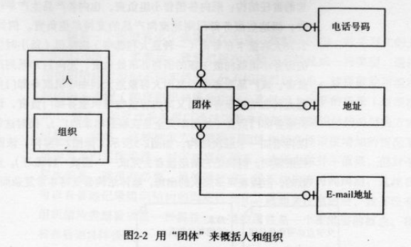

## 组织层次

如果公司的组织发生变化，去掉区域子公司，就必须改变模型，而下图只需改变规则（改变规则比改变模型容易得多）

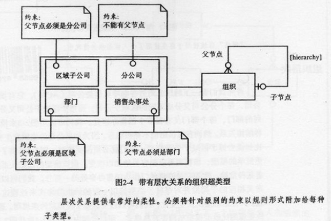

递归关系隐含某种危险，比如允许部门作为销售办事处的一部分，需要通过定义相应的子类型并对每种子类型施以一定的约束方式来处理这一问题

上图只支持单一的组织层次关系，如果是矩阵型的双重责任结构，简单情况下可使用，复杂时，考虑下述的`组织结构`

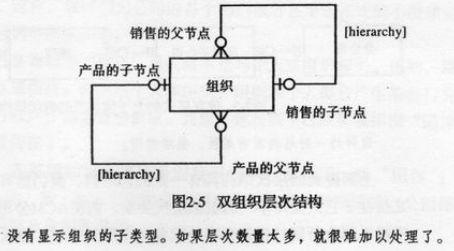

## 组织结构
如果一个模型有多个隶属层次，可用一种类型化的关系来表示，把 __层次化关联关系转化成一种类型__，通过使用组织结构类型的不同 *实例* 来区分不同的层次关系。用组织结构的两个实例（销售组织、服务组织）来处理上一节的场景，新产生的层次关系可通过简单的增加新的组织结构类型的方式来处理（不仅仅是矩阵型了）。另外，组织结构有时间周期，可有效记录组织结构的周期性变化

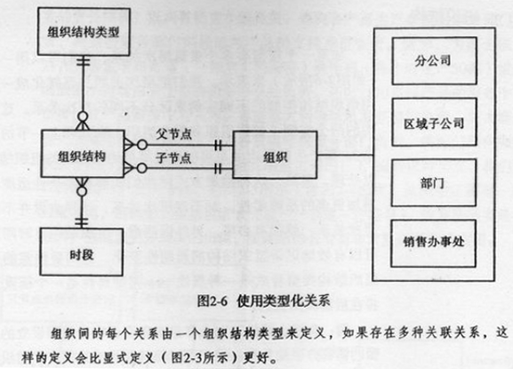

当组织结构类型数量增加，规则变得难以处理时，针对特定的组织结构的类型的所有规则被集中到一个地方，便于增加新的组织结构类型（如果很少改变组织结构类型，而经常增加新的组织子类型，则规则跟随组织子类型（图中右侧））

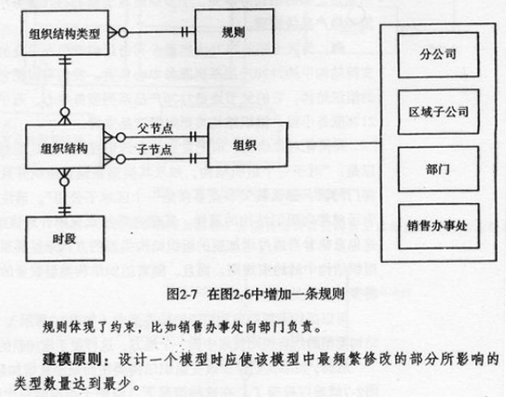

## 责任
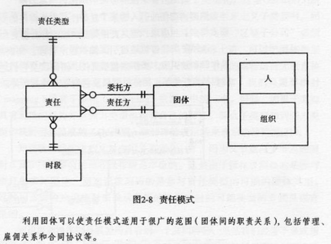

责任的子类型可以提供一些额外的信息，比如所包括的具体工作内容以及在合同期内的执行次数

## 责任知识级
责任的类型比组织结构的类型要多得多，定义责任类型的规则将变得更加复杂。这种复杂性可通过引入知识级来管理：

- 操作级：包括责任、团体以及它们之间的关联关系
- 知识级：包括责任类型、团体类型以及它们之间的关联关系

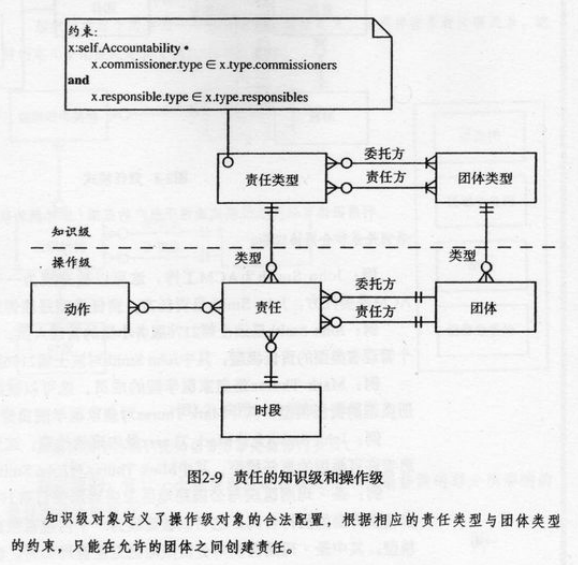

在操作级，模型记录该领域每天所发生的事件；在知识级，模型记录控制着结构的各种 __通用规则__（元模型？），知识级的实例支配着操作级实例的具体配置。如患者许可被定义成`责任类型`，其中委托方是患者，责任方是医生

操作级是参与责任的实际团体，知识级是参与责任类型的可能的团体类型，用多值的知识映射来表示单值的操作映射的可能类型的方式是很常见的

## 团体类型泛化
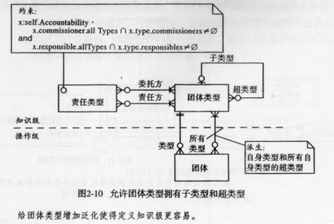

## 层次型责任

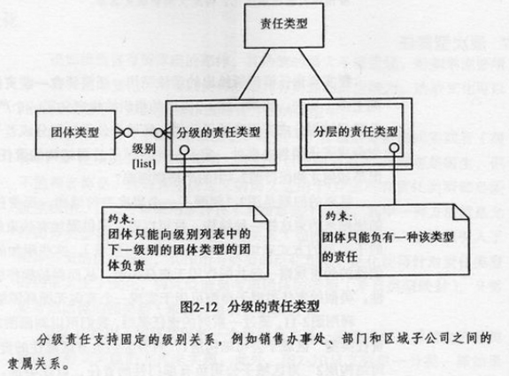

分层的责任类型捕获团体的责任关系并组成一个层次型的模型，而分级的责任类型用于捕获其中具有固定次序的团队责任关系

## 操作范围
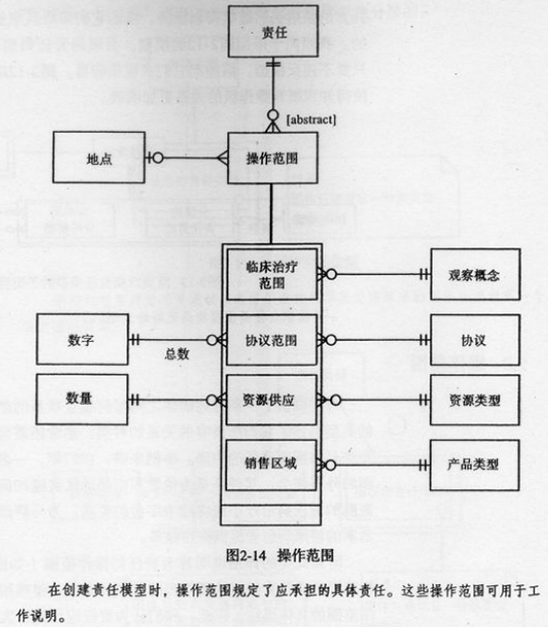

要用很抽象的方式来概括操作范围是非常困难的，在特别复杂的实例中，可能在知识级放置有操作范围类型

## 职位
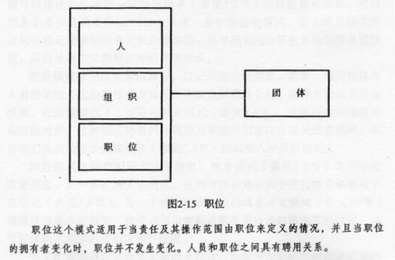

不应该在所有时候都使用职位，它引入了更多的间接关系，会增加操作级的复杂性，只有职位中体现了一些稳定的重要职责，而人员经常变换职位的情况下才使用职位概念

观察和测量模式
==============
## 转化率

转化率可以用在许多地方，但不是万能的，如摄氏温度与华氏温度需要更复杂的运算来实现

如果多个单位存在转换关系，使用多维单位转换阵列或梯形单位转换阵列

对于币值，转换率并不固定，可通过给转换率指定可用的时间范围来解决

## 复合单位
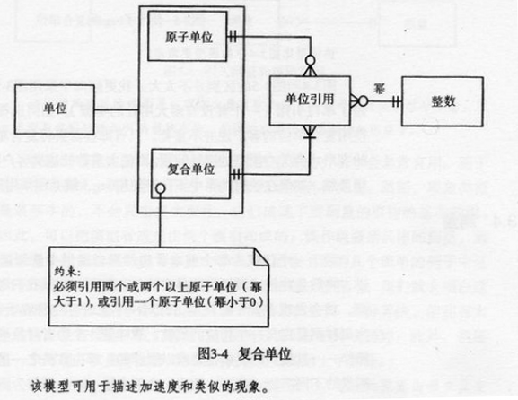

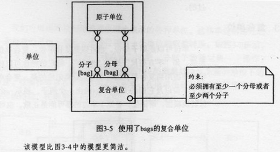

## 测量
将所有可以被测量的不同事物（身高、体重、血糖水平）作为测量对象，并引入一个`现象类型`的对象类型

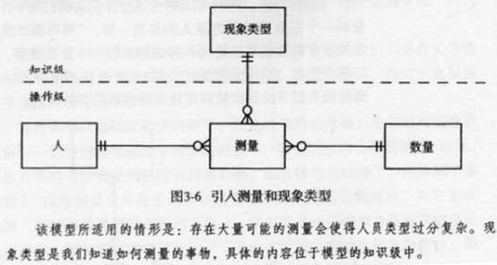

操作级中的对象会经常发生变化，它们的配置由很少发生变化的知识级来约束。

如果某个类型拥有多种相似的关联，可以为这些关联对象定义一个新的类型，并建立一个知识级类型来区分它们

## 观察
一些定性的描述，如血型、性别等，引出一个新的类型`分类观察`

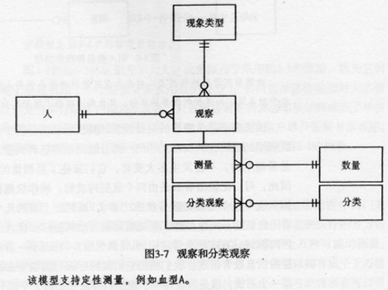

可以认为性别是`现象类型`的实例，而“男”和“女”是`分类`的实例，在刻画一个性别为男性的人，可以创建一个观察对象，分类是男性，现象类型是性别

将分类与现象类型之间形成单值映射是一种强制性的行为时，将分类信息转移到知识级中，并重命名为现象

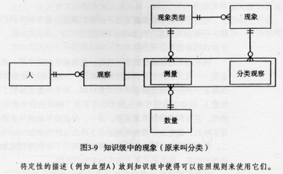

## 观察方案
观察方案能够确定一个测量的精确度与灵敏度，建模时也需要考虑（处于知识级）

## 双时间记录
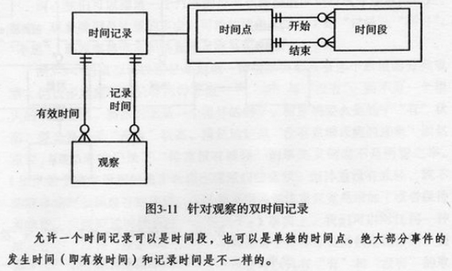

## 被否决的观察
应该是四色中 `事务->后续事务` 模式

针对公司财务的观察模式
====================
其实在讲一个星型的多维数据库的设计

## 企业片断
N个维度的组合体，称为企业片断。这里所观察的不再是患者，而是企业片断的销售情况

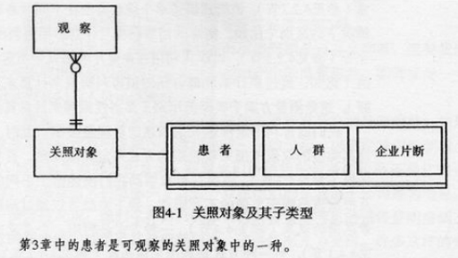

`星型模式`

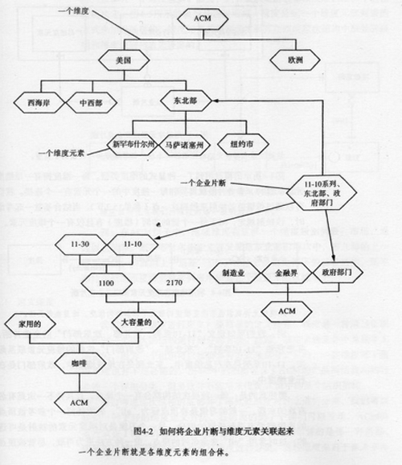

利用所定义的企业片断，就可以构造出不同类型之间的关系模型，可以将维度元素连接成为维度元素层次结构

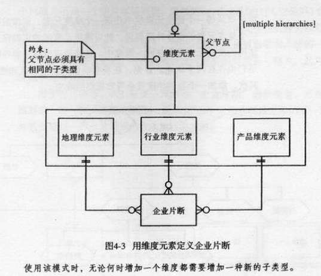

缺点是没有确切的定义维度和维度级别的概念，其次添加一个新的维度就会导致模型的改变

## 定义维度
维度来自焦点事件（需要业务分析人员业来定义），即星型模型中的`事实表`

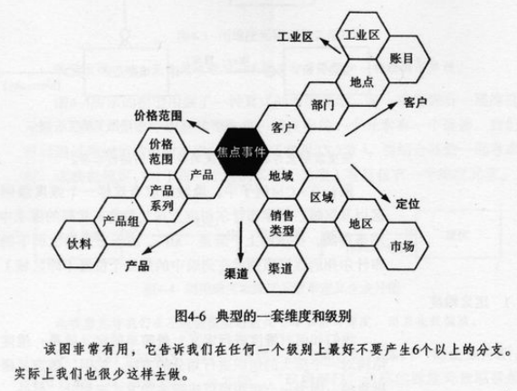

维度不需要可测量的最低级别，不值得也不可能分析到单个销售者的销售区域

## 维度的属性以级企业片断
除了通过业务结构定义的维度以外，另一个常用的维度是时间，而且也是有层次的（根据月份收入计算出年度收入）

企业片断生成操作是一个查找创建的过程，存在就返回，不存在就创建再返回

## 测量方案
这些测量不是手工记录的，通常是一个多个数据库加载而来，我们要记住是如何获得这些测量的，即用于创建测量的具体方案是什么。

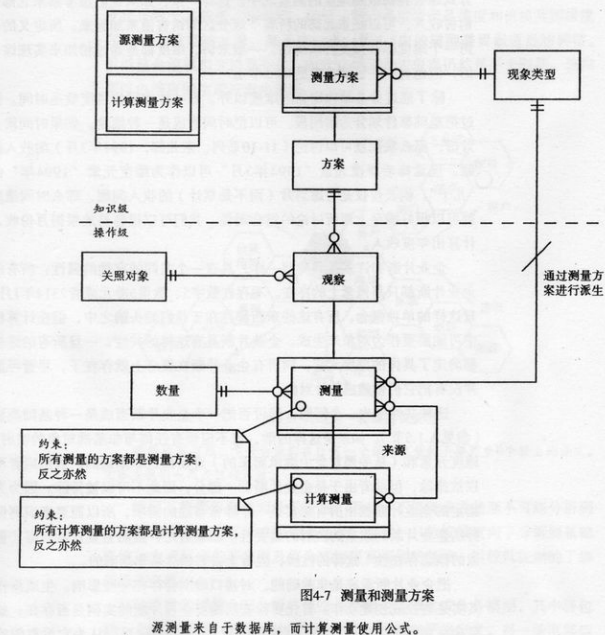

### 保证计算的有效性
计算测量方案包括所使用的计算公式，这是一个独立的实例方法，利用解释器，并将公式刻画成电子表格形式

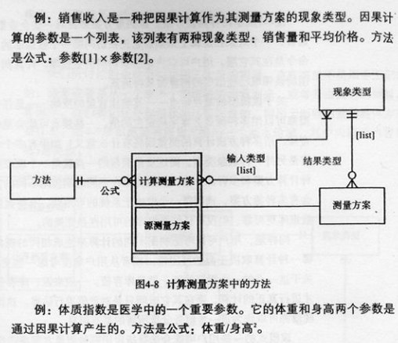

### 比较和因果测量方案
通常用户不在乎收入的具体数字，更想了解是实际的和计划的数字之间的差异或者是对今年收入与往年收入的比较

典型的比较是实际值和前段值或计划值之间的比较。

- 前段值可通过两种途径获得：适用时段起始点的参考值，或者是寻找一个具有前段时间维度的企业片断的测量。
- 计划测量要求我们区别看待实际值与计划值，推理观察必须记录下什么样的计划是推理的源，以例能区分年度计划、季度预测等

一种类型是以其它现象类型值为基础确定某种现象类型值：如通过将销量乘以平均价格来计算销售收入，这种称为因果计算

另一种，比较计算更具结构性，通常用两个输入测量，且这两个测量必须是相同的现象类型：想了解销售量偏差，那么输入就是`销售量现象类型`，而输出`销售量偏差现象类型`，公式为绝对偏差（x-y）或相对偏差(（x-y）/y)

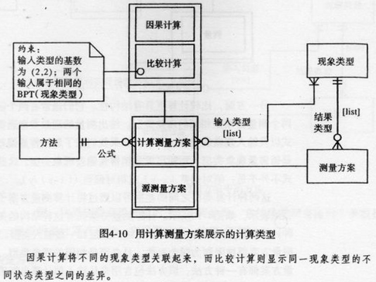

### 状态类型：定义计划的和实际的状态
当要求某测量方案创建一个测量时，需要告知该测量方案需要参考什么样的关照对象，同时还需要告知方案该测量是实际值还是计划值：如果是计划值，则要说明是何种计划；如果是实际值，则要说明是哪一天

将相关属性集中到一个单独的`状态类型`中，它有两个子类型，`实际的`可能会有一个时间偏移量（当前值则偏移量为零），`计划的`拥有相关的计划

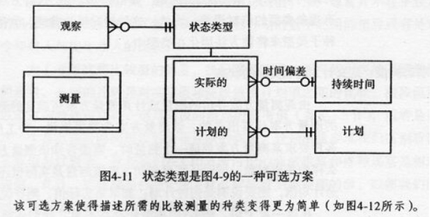

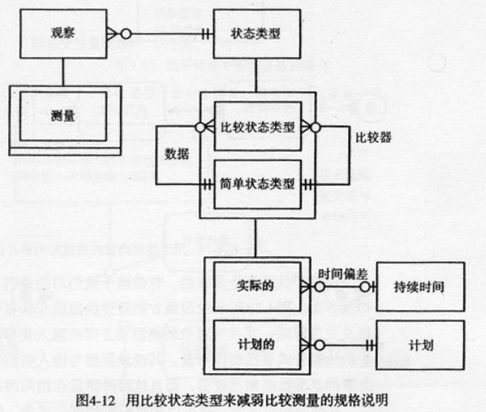

### 维度合并
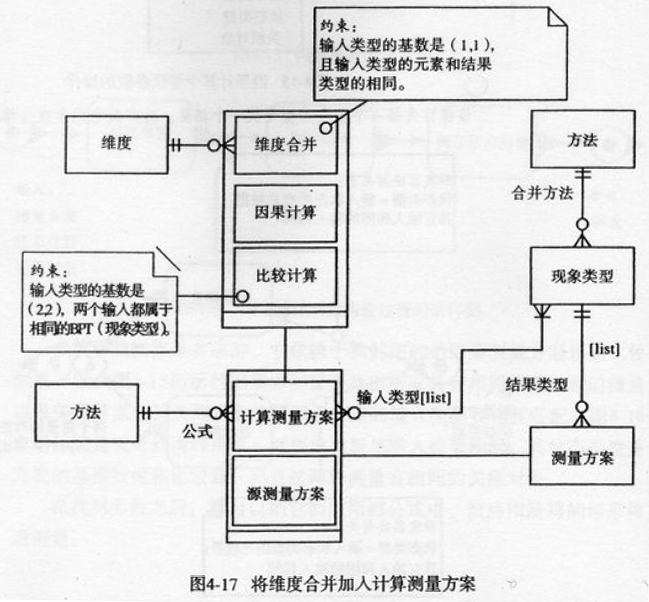

## 范围
为了搞清大量数字的具体含义，通常会对测量加以 __分组__，形成不同的类型。以下是一种解决方法，但不推荐

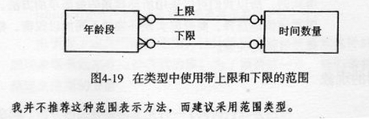

我们更多关心的是范围而不仅仅是上下限值，比如一个实际值是否在某个范围之内，或两个范围是否有交迭，或者两个范围是否相邻，或一系列范围是否构成一个连续的范围，更好的是将范围成为一种相对独立的对象

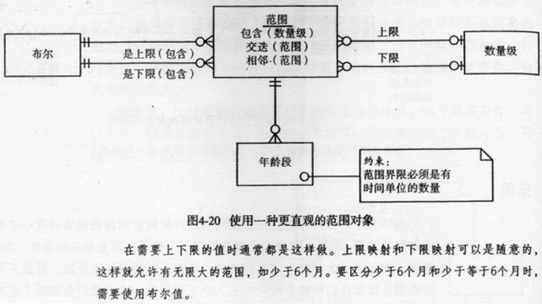

实现时，可采用子类型、约束、泛型等方式实现

## 带范围的现象
之前的模型，观察不是测量就是分类，不能两者都是，使用下面模型，就可以允许特定的观察既时测量又是分类观察

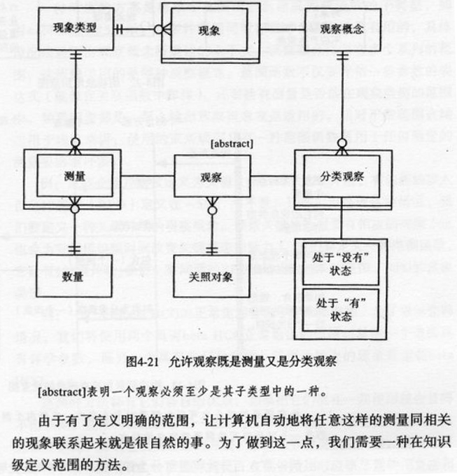

### 带范围属性的现象
最简单的方法是给现象增加一个范围，当我们创建一个测量时，就可以留心观察它是否落在该测量的现象类型的任何现象（实例）的范围内。考虑是否希望现象类型的范围不产生重叠，以及是否希望现象类型的范围是完整的，这两种情况都表明需要有一个约束

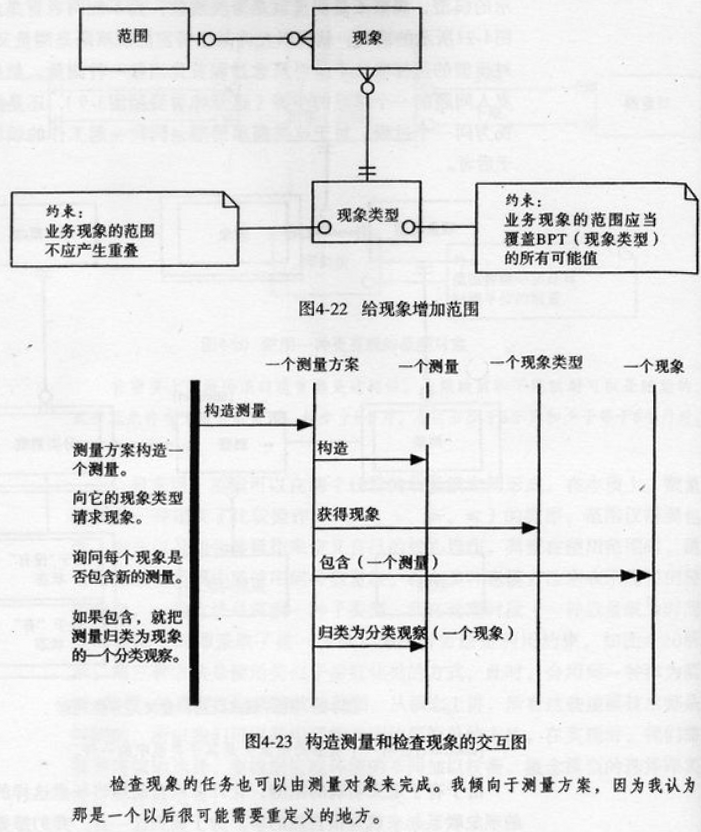

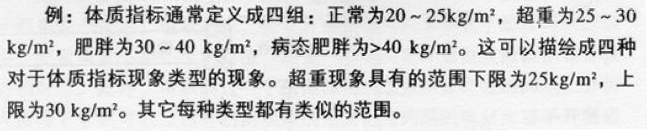

### 范围函数
一种可选的方案是将单个范围函数创建成关联函数的子类型，在多种范围同时存在时，该方法是有用的，具体情况依赖于由观察概念所描述的上下文。范围函数不仅要评估一些参数的表达式，还要检查测量是否落在现象类型的范围中

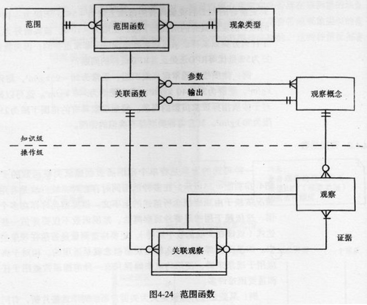

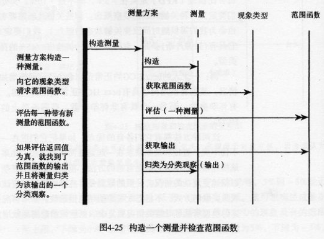

能够使用时应尽量使用直接和现象关联的方式，不得已才考虑使用范围函数

库存与账务
=============
## 账目
不仅记录某个事物的当前值，而且还强调要记录影响该值的每次变化的具体细节，一个银行账目就需要记录每一次的存款和取款；而库存记录要记住每一次的物品出入库情况

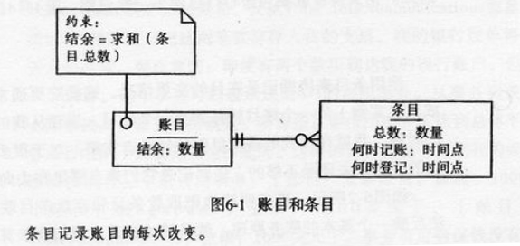

结余反映账目的当前值，是所有与账目相关的条目共同作用的结果（可缓存）

每个条目需要记录两个时间点：办理时间、条目登记到账目时间（在需要追溯收费时尤为重要）

## 事务
使用条目来协助记录账目的变更情况，许多物品仅仅记录它们的来来去去是不够的，还要记录它们来自哪里和去向哪里

一个事务具有两个条目，双条目法反映一个基本账务原理，钱（或其它要核算的东西）永远不能凭空生成或消失，仅仅是从一个地方移到另一个地方

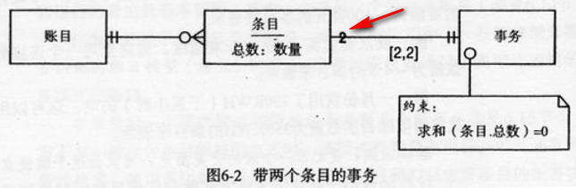

在复杂的账务结构中，我们的目的要使账目达到平衡，__在业务周期上的各点都要使结算值归零__。通过守恒原理建立模型，我们很容易发现系统中的不守恒之处

### 多腿事务
事实上，我们在一个事务中可以包含多个取走和存入动作

## 汇总账目
把租金和食物放到个人花销账目中，把差旅费和办公费放到业务花费账目中，由细目账目和汇总账目所构成的简单层次模型就可以支持这类结构

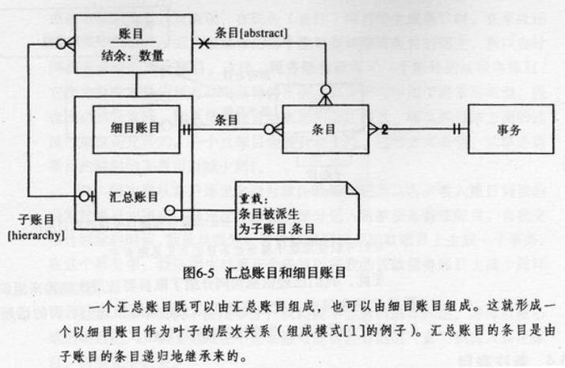

利用层次结构，可以把多个账目组合成汇总账目，同时规定：条目仅允许登记到细目账目中，而不能登记到汇总账目中。

## 备注账目
每当赚到钱时，把其中一部分归入税务账目，当真需要交税时，就会从经常性账户中支取款项，打入到税收的银行账户，同时从自己的税务账目中减去相同的数据。税务账目就像一个备忘录，提醒该交多少税，__它与正式账目并没有款项流动，所以称为备注账目__

## 记入规则
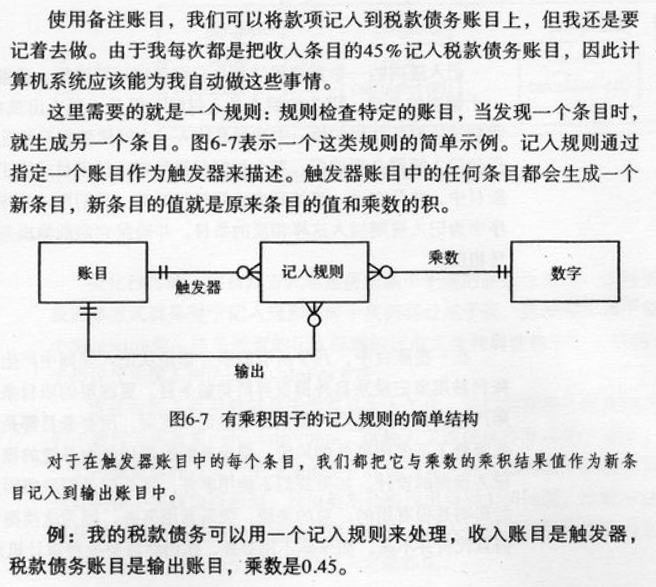

考虑递增的收入所得税，记入规则需要灵活性

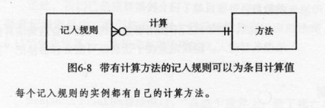

### 可逆性
记入规则一个重要属性就是它们必须是可逆的，通常我们不能删除一个错误的条目，清除它的唯一方法就是 __输入一个同样的但是相反的条目__，任何记入规则必须确保，两个相同但符号相反的条目放入了同一个触发器账目中，并且在进一步处理中恰好相互抵消

### 可以不使用事务
由于无论是外部条目还是记入规则，所有条目都是可预测的，因此降低了不使用事务的风险。避免疏漏的责任就由系统的操作使用转变为记入规则的设计。总的来说，还是乐意用事务，使得审计更为容易且代价并不高

## 个体实例方法
模型应该定义类的接口，在不改变接口的情况下，能更换实现方式

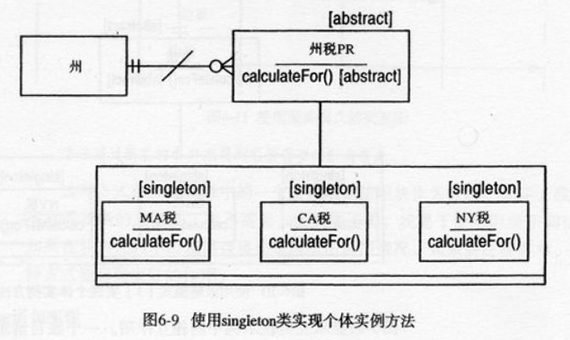

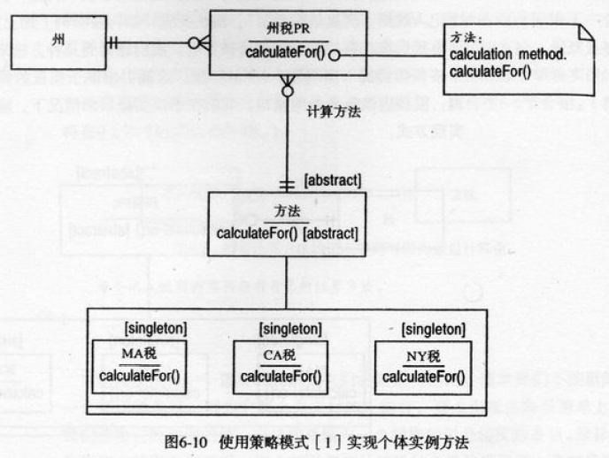

另外还可以使用泛型、解释器，或case的方式来实现

## 记入规则的执行
记入规则应该被设计为有多种触发方式（方便手工触发？）。尽可能把记入规则和其触发策略 __分开__，以减少这些机制的结合

### 急切触发
在这种方式中，触发账目中一旦生成合适的条目就立即触发记入规则。

- 将职责放入事务或条目的创建方法中，创建事务可以导致几个条目被记入账目

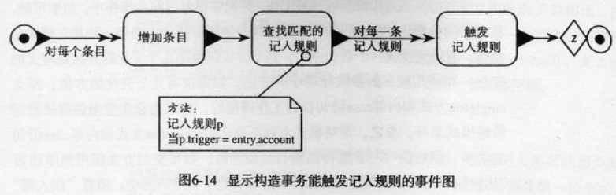

- 使记入规则成为触发器账目的观察者，但模型处于同一领域中，不想把记入规则放入独立的包中，也不需要使用观察者

### 基于账目的触发
把触发的职责从事务移到了账目，条目可以被添加到账目上，而不触发任何记入规则。账目触发其上次处理自身以来新加入的所有条目的记入规则（定时批量触发）

基本账目的触发需要账目跟踪未处理的条目，可通过维护一个独立的未处理条目集合来达到目的（或通过记录上次处理的时间）

### 基于记入规则的触发
利用外部代理明确告知记入规则开始执行，与基于账目的触发相似，但定时批量执行以记入规则为维度

### 向后链式触发
账目自己并不处理，而是让它们依赖的账目来处理。可以从账目检查自己的条目开始处理，然后使用记入规则来决定哪些账目是以自己为输出的记入规则的触发品，这些账目自我更新，这是一个迭代过程，请求到最后一个账目进行处理就可以完成整个账目图的更新

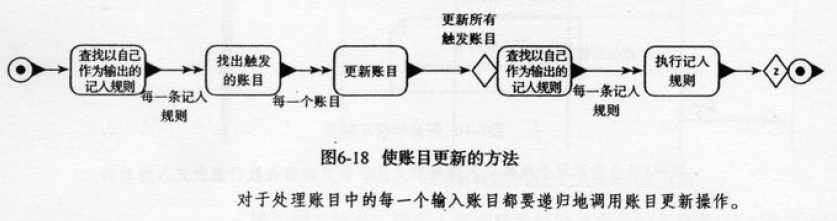

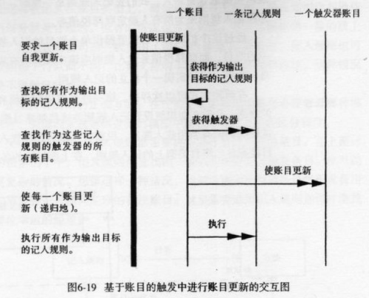

### 触发手段的比较
- 急切触发使我们可以尽早发现错误，有更多时间查出出错的原因，也要求我们在生成条目的时候要做全部计算
- 在何时进行计算上，基于账目的和向后链式的触发给我们更多的灵活性
- 向后链式触发比基于账目的触发更难于建立，但一旦建立就很容易使用，简单的账目结构中，使用基于账目的触发，而复杂的则使用向后链式触发

## 多个账目的记入规则
使用一个联邦税记入规则来为所有人确定联邦税债务，每个雇员都有唯一的账目，而联邦税债务记入规则应该实现为所有雇员服务

一种是使用知识级和操作级的概念，在知识级设置记入规则并连接到账目类型上，有费用收入账目、税前收入账目、净收入账目等。账目里的条目检查自己账目类型上的记入规则

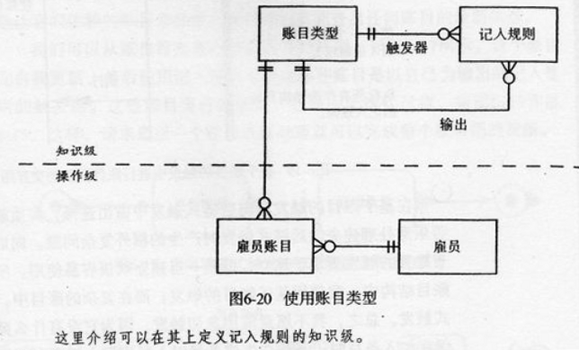

另一种是使用汇总账目，在条目加入汇总账目的子账目时，定义在汇总账目里的记入规则被触发，输出账目可以类似地被定义在汇总账目中，在合适的子账目中生成条目

如果所有的记入规则都被定义在账目类型上，而条目在账目上产生，那么知识级和操作级的划分就是合理的。

但记入规则也可以依照每个付款而不同，比如支持购车贷款的减少就需这样，这种情况还是不做区分的好

无论哪种方式，记入规则都需要决定怎样输出正确的条目

## 选择条目
过滤器封装了查询的对象（参考后面过滤器），包含多种用来设置查询条件的操作，

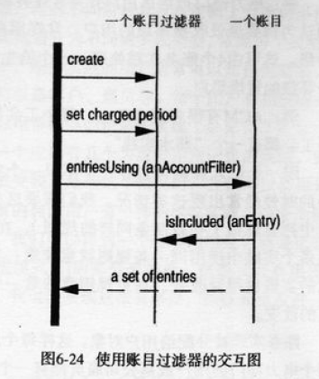

如果某个选择方式导致太多的重复以返回所有对象，还要附加太多行为的话，就使用它。否则直接创建相应查询方法即可

## 条目来源
有时，知道为什么一个条目以某个形态存在是很重要的，用户查询一个特定的条目，当前的模型能给我们很多关于这个条目生成的信息，通过查看其它条目的日期就可决定当时账目所处的状态，还能确定哪条记入规则计算了该条目

下面模型可以得到每个事务以便记住是由哪条记录产生的这个事务，还能记住哪些条目作为事务的输入（如果没用使用事务，那么关联就是条目到条目的）

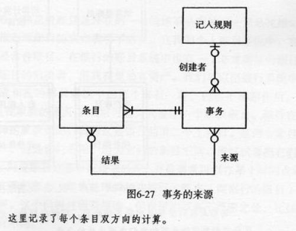

建模原则：为了确认计算是如何进行的，把计算的结果表示成对象，由它来记住是由哪个计算产生的结果以及计算所使用的输入值是什么

## 结算单和所得计算书
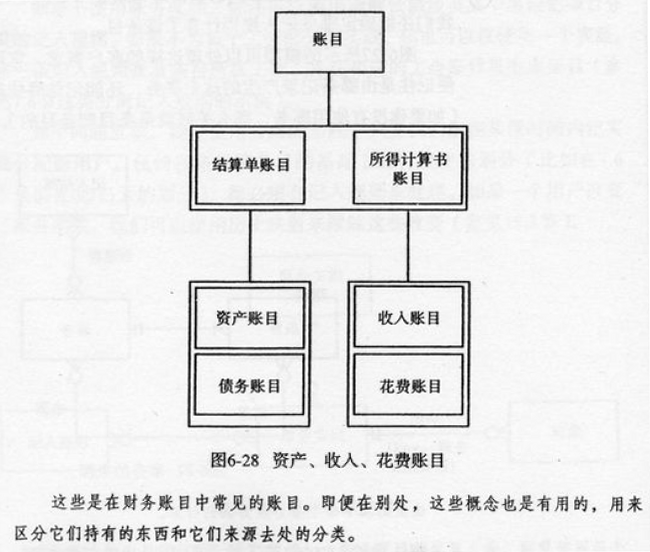

收入与花费的结算账目并不能反映目前有多少钱，仅反应收入的来源与花费。

收入和花费账目是外在的（钱不是我的），只是用来分类的账目

通常在这样的模式里，在收入账目里产生各个条目，条目被传递到几个资产账目，然后消失在花费账目里。系统保存的资金被存放在特定的资产账目里，但很多资产账目仅仅用于定期结算。债务账目几乎总是被用来在今后其个时间进行结算

## 对应账目
对应账目在某种程度要匹配，并且通常可以在某个时间点相互消解，比如我的账本和银行的账本进行匹配的时候，消解过程要精确，也可能留下为严密之外，比如日期可能稍有不同

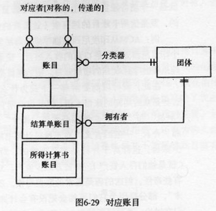

只有结算账目才有拥有者，所得计算账目没有资产，所以没有拥有者的问题。所有账目都有分类器来指示谁生成了和操作了账目。

对应关系具有 __对称性__ 和 __传递性__：如果账目x是账目y的对应者，那么反之亦然；如果账目z是账目x的一个对应者，则账目z也是y的一个对应者(四色中 事务与持续事务?)

## 专门化的账目模型
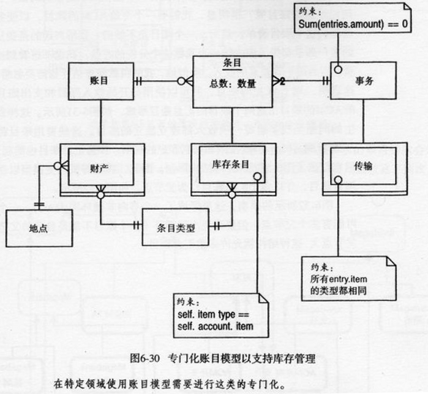

用这种方式跟踪订单（包括收入和支出）也很有作用，每个供应商有一个收入账目，如果供应商的位置重要的话，可能还不只一个。类似地，每个客户有一个支出账目。

允许传输的子类型，或是预定的或是实际的，当生成订单时，生成一个从供应商的 __预定财产__ 到交付目的地的 __预定财产__ 的传输，订单被提交后，就生成从 __预定财产__ 到 __实际财产__ 的传输。和金融中接收账目是一样的

## 登记条目到多个账目
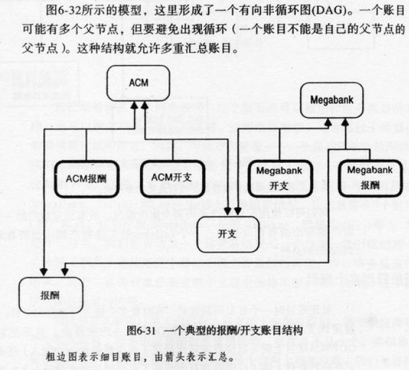

如果使用多重汇总账目，有可能会定义一个具有重叠细目账目的汇总账目

### 使用备注账目
使用备注账目的条目，访问ACM总部的500元飞机票，既要出现在ACM花费账目上，也要出现在飞机票的账目上，具体那个作备注账目，看实际情况

### 派生账目
另一个方式是使用派生账目，条目专门提供带有选择匹配条目的过滤器的派生账目

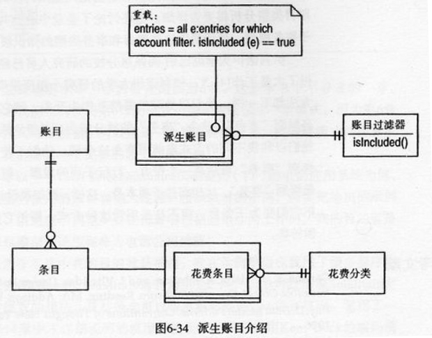

在账目结构不是很静态的时候，给派生账目加上属性很有效。派生账目只有报表功能，不能在其中进行登记，不能用于跟踪资产的消长

使用财务模型
===========
TT公司收费方案

## 结构模型
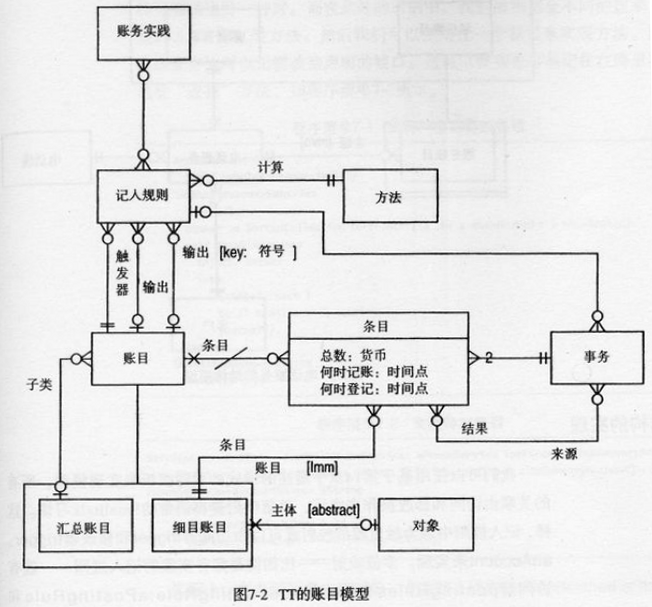

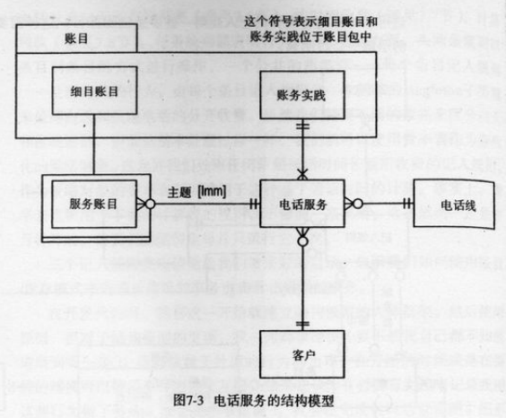

客户被允许有多条电话线，电话服务是指每个客户被分配一条电话钱，每个电话服务被绑定到描述如何付账的账务实践

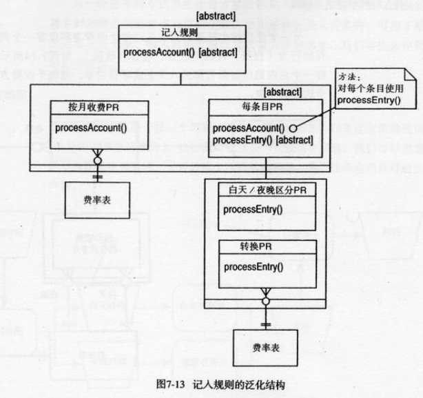

计划
===========
## 提议和执行的动作
任何计划的基础都是由人们所采取的基本动作组成

当制订和监控计划时，必须考虑一个动作可能会经历的许多状态，可以被调度、分配资源、分配人力、启动和结束，一个状态转移图可以记录这些状态以及转移是如何发生的，但是很难制定有关状态转移的规则

动作的两个重要状态是提议和执行，一个被提议的动作在某些计划中纯粹是一个建议，当计划开始时，它就执行了，不但状态变化了，而且要创建一个单独的处于执行状态的动作对象。通过保留原始的提议动作，我们可以观察计划和现实的差异

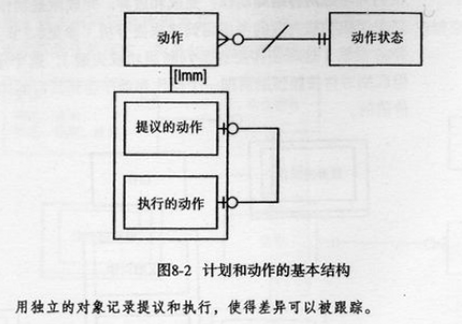

## 完成和放弃的动作
通常我们并不能很确定的判断动作是成功还是失败，尤其是在医疗保健方面，我们只考虑两种结局动作：完成和放弃，任何成功或失败考虑留到将来去分析

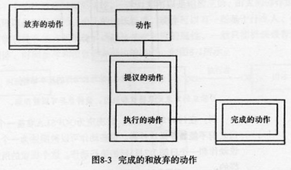

如果肾被安全的移植到患者体内，移植手术就是成功的，如果以后出现排异，并不能使移植过程成功变为无效（只有手术过程中发生是问题，才可能导致动作被放弃）

## 挂起
推迟动作，以后再继续完成这动作，当这种情况发生时，挂起就连接到某个动作

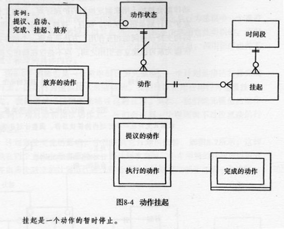

挂起的时间段也许没有截止。提议动作和执行动作都可以被挂起；挂起一个提议的动作和推迟一个动作的开始是等价的

记录能划分责任

## 计划
简单意义下，计划是按某种顺序连接的提议动作的聚合，一个序列一般表现为一种依赖，比如关键路径分析

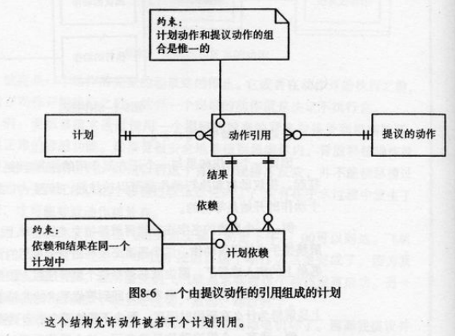

支持动作间的相互作用，允许一个动作被多个计划引用，并且依赖关系可以建立在引用之间，而不仅在动作之间

计划常受变化的影响，并且被其它计划所代替，这种关联在两上方向是多值的，当计划改变时，一个单独的计划可被分裂并由多个独立的计划所代替，或由若干个计划可被合并成一个计划

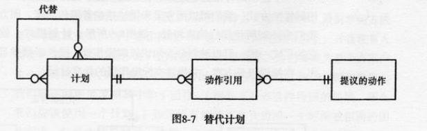

