> 2016-08-17

概览
========
- 需求：卖的视角、具体、产品当项目做，需求不能复用
- 设计：做的视角、抽象、项目当产品做，设计才能复用

- 从需求直接映射设计，会导致功能分解，得到重复代码
- 从设计出发来定义需求，会得到一堆假需求，变得无卖点

- 和涉众交流的形式应该采用视图（ppt、文档、原型），而不是模型
- 和涉众交流的内容应该聚焦涉众利益，而不是需求

- 只的团队的技能提高了，才能适应更多过程（增量、迭代、敏捷[敏捷更是过程，不是方法]）
    + 或者说，真正能做到面向过程（组织级、系统级、模块级层层分解，也是很厉害的）

## 建模过程
由无意识到有意识，将隐性知识转化成显式知识

- 组织要解决什么问题，需要 __业务建模__，思考组织内系统之间如何协作，使得组织可以对外提供有价值的服务
    + 原景
    + 选定组织
    + 业务用例图
        * 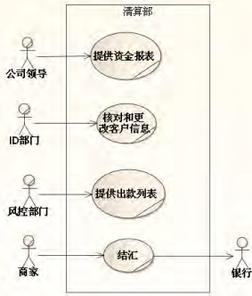
    + 现状业务序列图
        * 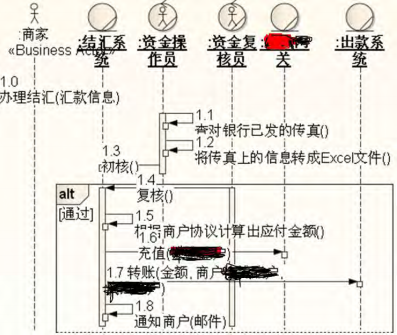
    + 改进业务序列图
- 为了解决组织的问题，待开发系统应提供什么功能和非功能(性能，安全，扩展)，需要 __需求__，思考系统边界，强迫从“卖”的角度思考涉众，严防“做”污染“卖”，需求制品-需求规约是“卖”和“做”的衔接点
    + 系统用例图
        * 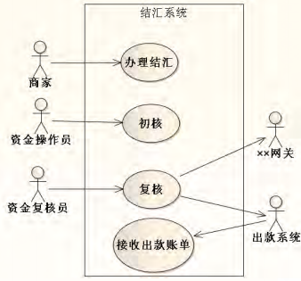
    + 系统用例规约
        * 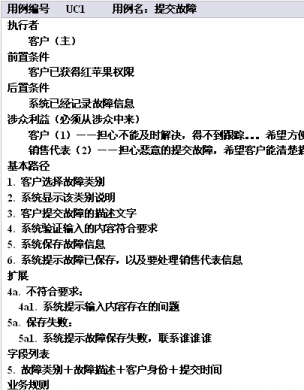
- 为了提供功能，系统内部应该有什么样的核心机制，需要 __分析__，思考系统内核心域
    + 分析类图
        * 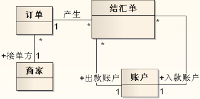
    + 分析序列图
        * 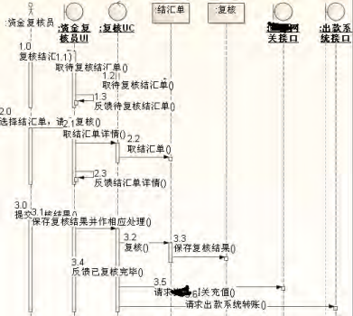
    + 分析状态机图
- 为了满足非功能(性能，安全，扩展)，系统的核心机制如何用选定的平台实现，需要 __设计__，思考内域之间
    + 建立数据层
    + 精化业务层
    + 精化表示层


愿景
=========
在 __目标组织负责人（老大）__ 看来，引进某 __系统__ 目的是什么？给该组织带来的 __改进指标__

- 程序员研究技术平台、架构，很可能只是做出 __可以工作的软件__，而不是追求 __可以卖的软件__

- 关键需求的排序，老大和愿景是排序的首要依据

## 不同情况下找老大
- 定制系统（项目）/一个人
    + 他就是老大
- 定制系统（项目）/正式组织
    + 确定组织范围，再定位老大
- 非定制系统（产品）/正式组织
    + 确定组织范围，再定位目标组织，再定位老大
- 非定制系统（产品）/人群
    + 定位目标人群，再定位老大

组织的具体化，由所有抽象，到少数具体的过程

- 医院 哪家医院最像所谓“医院”？
- 公司 哪家公司最像所谓“公司”？
- 车间 哪个车间最像所谓“车间”
- 食客 哪群食客最像所谓“食客”？

不要从功能直接推导，不要图方便，一定要找出典型的

爆炸法：对方不感兴趣立即引爆

老大的头脑—和对手拼杀的战场

## 愿景
是给组织带来改善的指标，不是做某事

- 可以是
    + 减少采集数据所花费的时间
    + 提高制作动画的速度
    + 缩短订单的处理周期
- 不可以是
    + 建立一个CRM系统
    + 提供在线订机票功能
    + 能够进行风险评估
- 系统上马之后，老大怎样才会高兴？
- 如果没有此系统，会付出什么代价？ 

### 愿景vs功能
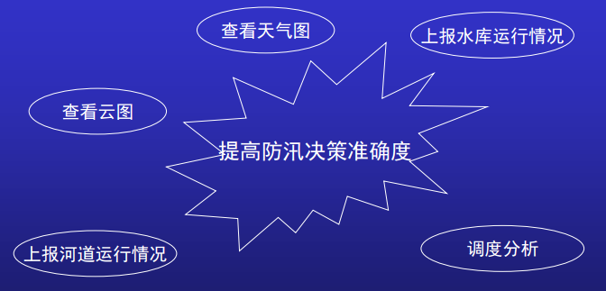

### 问题分解
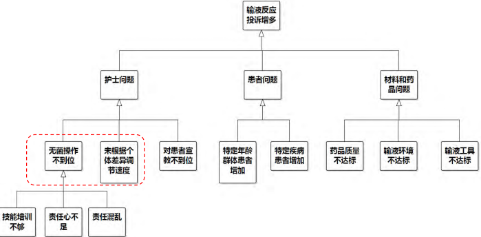

### 性能需求不是愿景
- 愿景目标 度量对象是组织 领域相关 缩短办证的平均周期
- 性能需求 度量对象是系统 领域无关 3秒内返回结果

## 涉众
- 剧本只有一份，观众却是多种
- 同一件事情，不同的利益视角
    + 卖房子
        * 委托人担心价钱过高，没有人买；担心价钱过低，自己吃亏。希望中介能根据掌握的信息卖出最优价格。
        * 经纪人希望能少花时间，多得佣金。（佣金增长/投入时间）达到最大值
- 系统需求就是涉众利益之间的最佳平衡点（台上演什么戏？由台下各种人角逐而定）
- 排序是否正确直接影响需求

## 起名
- 品类诞生初期：可用直接命名
    + IBM、 Microsoft、 UMLChina
    + 小灵通、全球通、支付宝、财付通、 *付*
- 品类成熟：隐喻式命名
    + 小米、锤子
    + 知乎、 果壳
    + 饿了么、滴滴


业务建模之业务用例图
=================
（待开发的）系统是组织的零件

常见错误：

- 没有把系统放在组织中来看
- 假的“需求变更”－－来路不正
- 得到的系统不符合组织需要

## 步骤1选定要改进的组织
愿景波及的需要改进的组织

- 可以是整个组织，也可以是组织的一部分
- 组织可以正式可以非正式（公司 车友 某部门 政府组织 球迷）

### 太大或太小

- 绝大多数工作流不相干－－太大
- 很多要改进的地方未涉及－－太小

当涉及多个组织时应寻找更大的组织

### 组织是名词
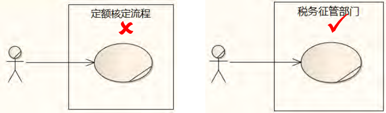

### 网站不是组织
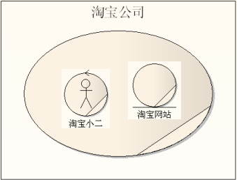

### 外部看是价值的集合(业务用例图)
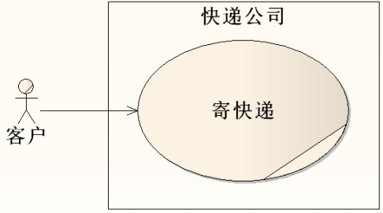

### 内部看是系统的集合(业务序列图)
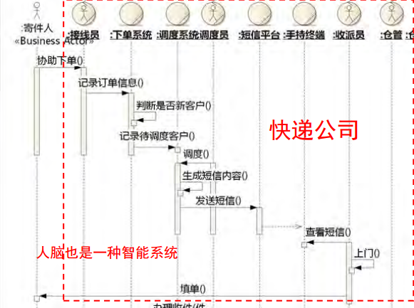

## 步骤2组织的业务用例图
### 业务执行者Business Actor
对准待研究组织的边界，在组织 __之外__ 和组织交互的 __人群或组织__(不能是系统、时间)

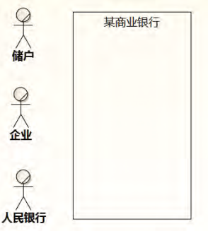

### 业务工人Business Worker


业务执行者（Business Actor）在组织外面，业务工人（Business Worker）在组织里面（人肉系统，组织可以替换的零件）

### 业务实体
业务实体取代其他工人或实体的责任

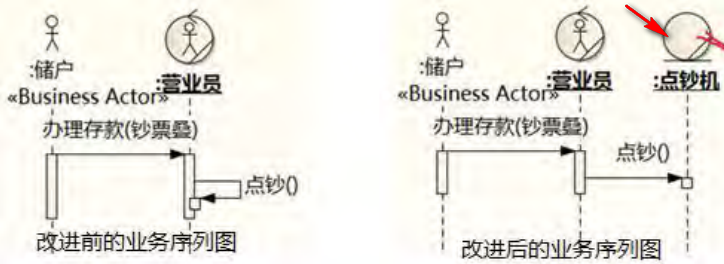

- 我想开发一个新系统来改善现有工作
- 转化为
- 我想开发一个新的业务实体取代现有业务工人或业务实体的一些责任
- 所以
- 待开发系统：组织的新业务实体

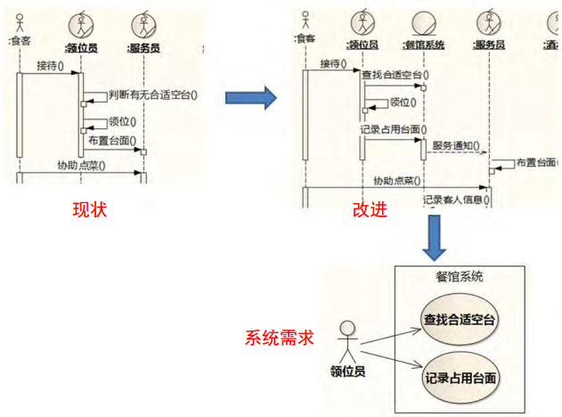

### 业务用例
组织为业务执行者提供哪些价值？

业务工人和业务实体不在业务用例图中出现，因为它们不是组织的价值，而是成本

- 识别业务用例两种方式：
    + 从业务执行者开始，思考业务执行者和组织打交道的目的（主要的，思考焦点是执行者对组织期望和组织对执行者的承诺，不要出现“患者到医院挂号”的用例）
    + 通过观察组织的内部活动，一直部为什么，向外推到组织外部的某个业务执行者（补漏的，但防止将内部活动作为业务用例）

- 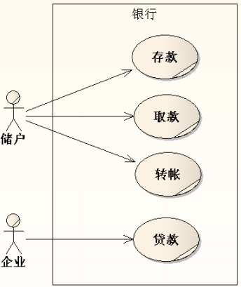
- 是相对稳定的，时光倒流300年也适用
- 代表从组织视角看问题的高度
- 业务流程是业务用例的实现
- 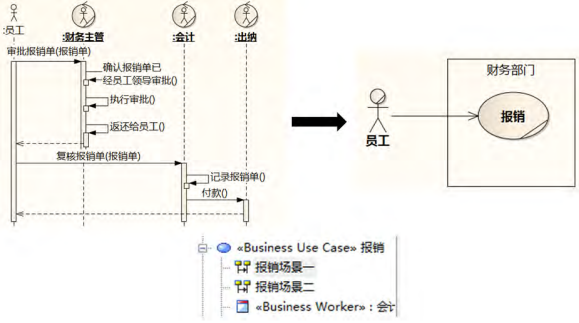
- 从价值出发重新构造业务流程
- 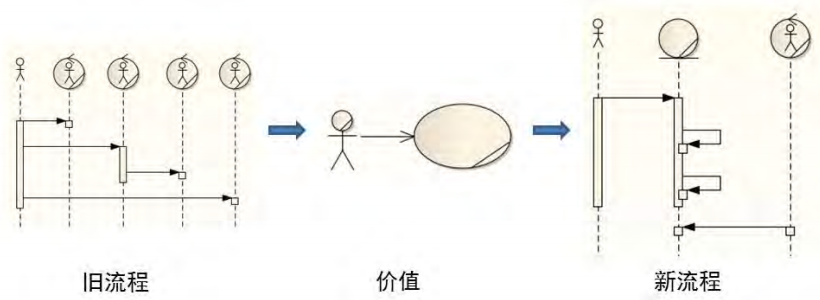

### 常见错误
- “管理型” 业务用例，和愿景混淆，指标还是动作？
    + 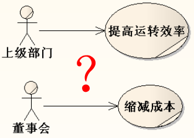
    + 应作为支撑性业务流程
- 错误：这个佣金系统的业务用例是。。。
- 应为：目前财务部为经纪提供的“发放佣金” 业务用例，实现流程有很多不足之处，所以向引进佣金系统来改进业务用例的实现。。。（“因系统”做，而不是 “对系统”做）

业务建模之业务序列图
===================
## 描述业务流程的手段
- 可选方式：文字、活动图、序列图
- 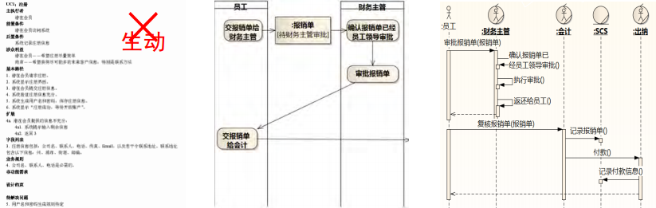
- 文字不够生动（但描述系统用例（需求）时，要使用文本）
- 活动图只关注人，没有系统存在，不方便对其进行改进
- 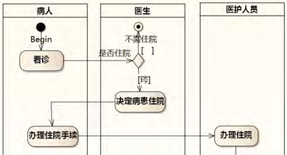
- 序列图把人当系统
- 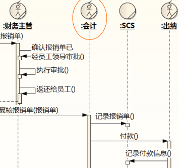
- 活动图往往只表现动作，分区抬头大多是人或部门，没有表达非人系统的责任
- 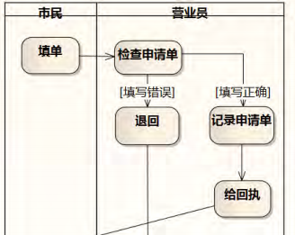
- 序列图强迫思考背后目的，也揭示了这个岗位对外责任（如受理申请）
- 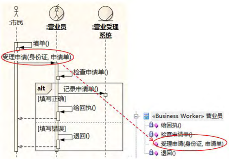

## 业务序列图要点
### 消息名字代表责任和目的，是责任流，不是数据流
- 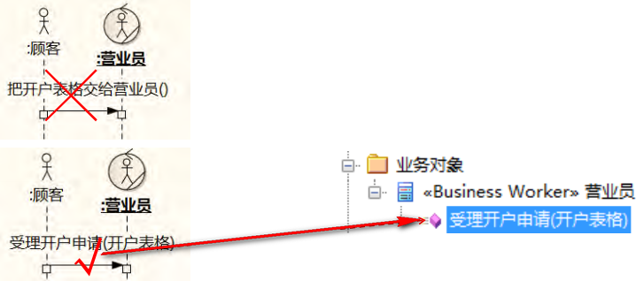
- 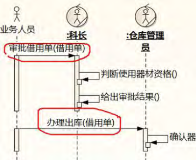

### 聚焦系统之间的协作
- 不要露出系统内部的组件
- 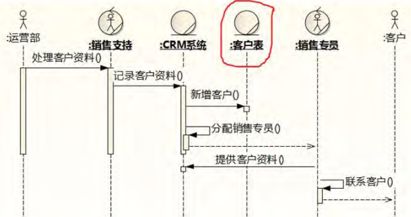

- 不要表达交互步骤
- 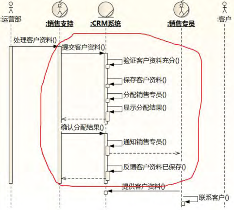

### 只画领域相关的系统
- 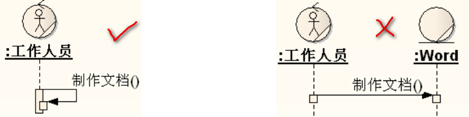

- 分清责任，如果是要改进采购的流程，不需要出现word，如果要改进的就是制作文档的流程，可以出现word
- 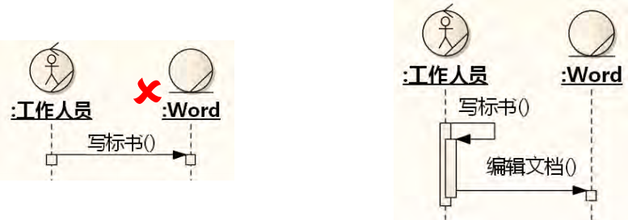

- 涉及到可能改进点的要画细一些
- 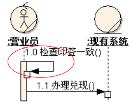

- 有的改进点可能在扩展路径中
- 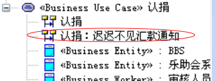


### __时间__ 看作特殊的业务实体
- 时间不等于定时器，时间处于系统外，而定时器是本系统和外系统的接口（全世界只有一个时间系统，但有无数个定时器
- 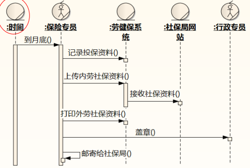


## 步骤3现状业务序列图
- 现状必须是具体的，不要抽象

### 误区
- 把现状误以为 “纯手工”
- 把现状误以为 “规范”
- 围着待开发系统拼凑业务流程，要从业务流程中找到待开发系统的位置，证明系统如果有这些功能，对实现业务用例是有帮助的
- 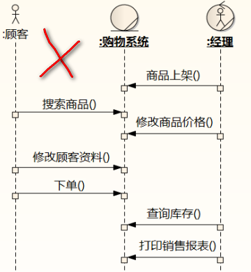

## 步骤4改进业务序列图
- 找出最值得改进的场景，先改进

### ESIA法
#### E（Eliminate）清除无效
主要指对企业现有流程内的非增值活动予以清除。非增值活动中，有一些是不得已而存在的，而另一些则是多余的，我们所清除应该是多余的非增值活动，如过量产出、活动间的等待、不必要的运输、反复的加工、过量库存、缺陷/失误、重复的活动、活动的重组、反复的检验及跨部门协调等。
因而在进行设计流程时，对流程的每个环节或说要素，可以思考“这个环节为何要存在？”、“这个流程所产出的结果是整个流程完成的必要条件吗？”、“它的存在直接或间接产生了怎样的结果？”、“清除它会解决怎样的问题点？”、“清除它可行吗？”。通过一系列的问题，来着手判断是否是非增值环节，是否是多余的，它的存在产生了怎样的不利影响，而清除是否可行。如何消除或最小化这些活动，同时又不给流程带来负面影响是重新设计流程的主要问题。

#### S（Simplify）简化高频
在尽可能清除了非必要的非增值环节后，对剩下的活动仍需进一步简化。一般来说可从表格、程序、沟通、物流等方面进行考虑。

#### I（Integrate）整合依赖
对分解的流程进行整合，以使流程顺畅、连贯、更好地满足顾客需求。

#### A（Automate）自动化繁琐
对于流程的自动化，不是简单以为自动化完成就可以了。事实上，许多流程，计算机的应用反而使得流程更加复杂和烦琐，因而是在对流程任务的清除、简化和整合基础上应用自动化。同时，任务的清除、简化和整合，许多也是要依靠自动化来解决。


### 物流变成信息流
尽可能物流变成信息流，在需要物的时候，才将信息变成物

- 
- 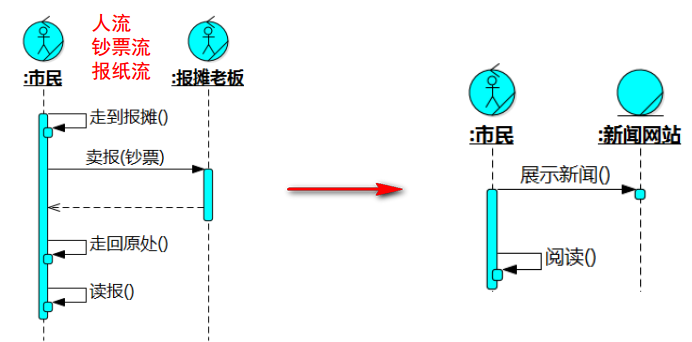

### 改善信息流转
- 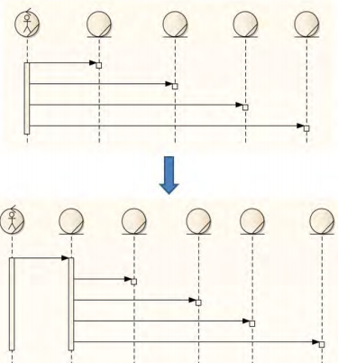
- 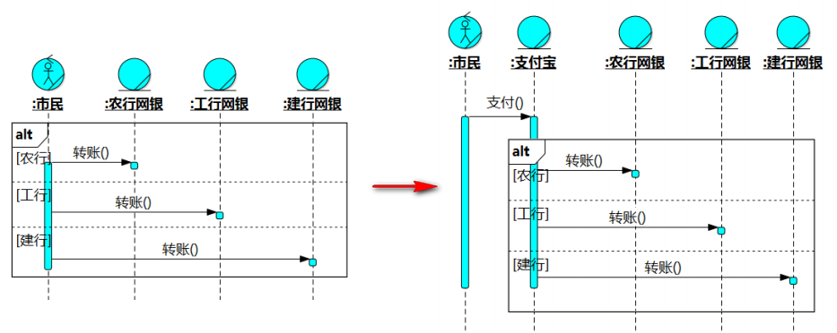

### 封装领域逻辑
- 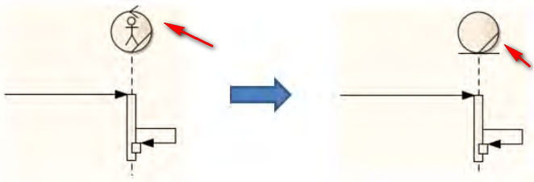
- 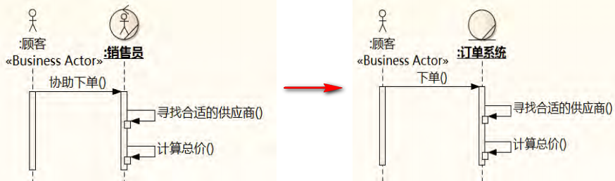
- 迅雷（改善信息流转+封装领域逻辑）
- 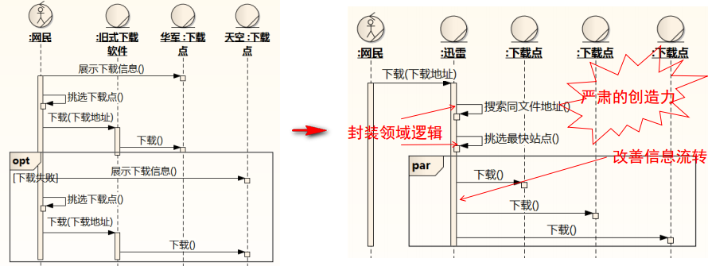
- QQ泡妞改进，业务逻辑由人脑转到系统中
- 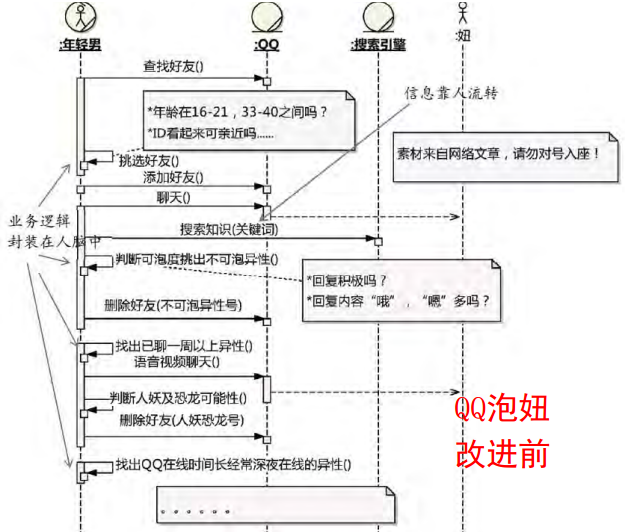
- 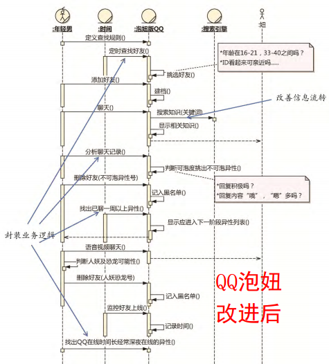
- 麻将机
- 

### 阿布思考法
1. 假设有足够的资源去解决问题，得到一个完美的方案；
2. 用手上现有的资源去山寨这个完美方案。


需求之系统用例图
=====================
## 系统执行者定义
在所研究系统外，与该系统发生功能性交互的其它系统

- 系统外，不是物理的边界，而是责任的边界
- 交互，必须与系统有交互（不和系统交互的不算是系统的执行者），与重要性无关，下图的执行者是售票员，不是旅客
    + 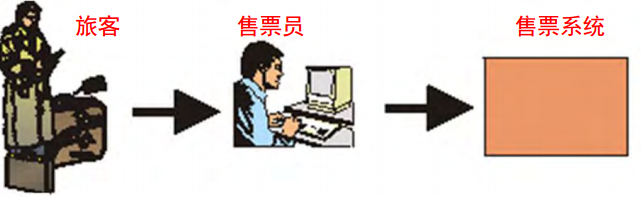
- 功能性交互，执行者和系统发生的交互是系统的 __功能需求__（使用的鼠标、操作系统不是执行者）
- 系统，从执行者是人，到执行者有一些是人的转变（非人执行者越来越多）

## 步骤1识别系统执行者
- __从业务序列图中，所有和系统交互的业务工人、业务实体，都是系统的执行者__
    + 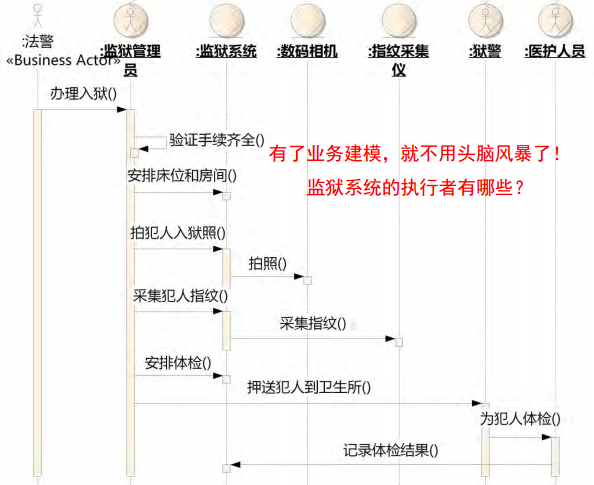
    + 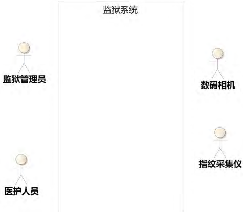
- 主执行者主动发起用例的交互，辅助执行者在交互过程被动参与进来
    + 不是主执行者发送数据，而辅助执行者接收数据


## 步骤2识别系统用例
- __业务序列图中，从外部指向所研究系统的消息，可以映射为系统用例__
    + 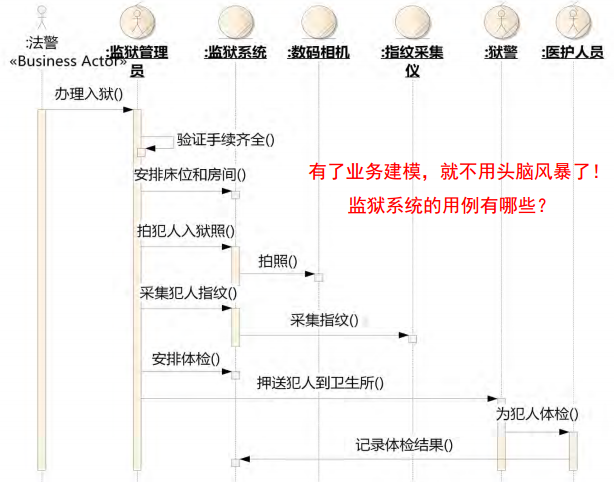
    + 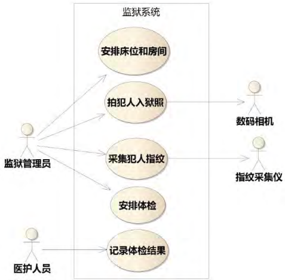

## 系统用例要点
### 不要把执行者和权限管理混淆
### 不要把执行者命名为“用户”
- 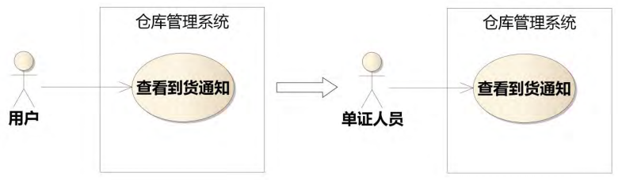

### 能够为执行者提供的、涉众可以接受的价值
- 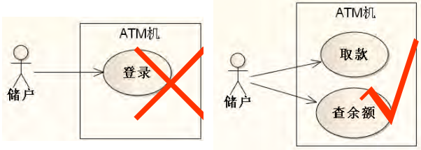

### 用例的粒度，不如考虑是否加强了和涉众的联系
- 最常犯“粒度”错误：把步骤当作用例
- 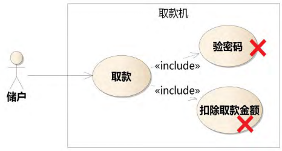

### CRUD问题
- 

### 需求只能从涉众视角获得－－卖
- 不能贪图方便选择一个自己熟悉的视角应付了解
- “登录”不能提供价值，所以不是正确的用例

### 关于管理XX用例
- 往往是给系统管理员管理基本数据用的，而且千篇一律，不必花太多心思

### 错误的复用，不是站在涉众利益考虑
- 
- 需求是不考虑复用的，如果在考虑复用，要警惕自己是不是转换到了设计视角了
- 
- 用例执行者的诉求
- 
- 不能多个主执行者
- 

### 错误的层次
- “高层用例”－－偷换了研究对象
- 
- “高层用例”－－非契约当成契约，错把老大对系统愿景当用例
- 

### 错误的子系统
- 把用例分到许多个包，但用例包是从外部系统对系统功能所做的分包，和子系统的概念是不一样的
- 人有吃喝拉撒功能，但却没有相应的子系统（只有神经、血液等子系统）
- 

### 模糊的价值
- 用例是需要提供价值的，以下请假用例没有承诺价值
- 
- 根据业务序列图理清责任
- 

- 下面是错误的，员工请假用例的同时，并不需要其他辅助执行者
- 

### 是系统做不什么，而不是执行者做什么
- 

### 大小无所谓，有价值就行
- 


需求之系统用例规约
===================
## 步骤3书写系统用例规约
用例图只是表达了用例的目标，背后封装了不同级别的相关需求

- 

### 前置、后置条件
- 前置、后置条件必须是系统能检测的
    + 
- 前置条件必须是用例开始前系统能检测到的（开始取款前，并不知道要取多少）
    + 
- 是约束，不是动作
- “登录”不能提供价值，所以不是正确的用例

### 涉众利益
- 前置条件是起点，后置条件是终点，中间部分该怎么描述，主要看涉众利益。
    + 

#### 如何寻找涉众
- 执行者自己
- 上游，资源的提供者
- 下游，后续流程处理者
- 信息的主人（如保单的 被保人、投保人、受益人等）

#### 给涉众排序
排在前排的，不一定是“用户”，却是重要涉众

### 基本路径
基本路径指能代表用例核心价值的路径

#### 按照交互四步曲书写
- 用户请求
- 系统验证[可选]
- 系统改变[可选]
- 系统反馈

#### 使用主动语句理清责任
- 会员保存订单 X
    * 会员提交订单信息
    * 系统保存订单
- 会员查询商品 X
    * 会员提交查询条件
    * 系统查询商品
    * 系统反馈查询结果

#### 主语只能是执行者或系统
- 不能是代理、客户端、?子系统
- 系统就是一个黑箱，描述它对外提供的功能和性能，如何构造不属于需求描述的范围


#### 使用核心域概念
+ 系统建立连接， 打开连接， 执行SQL语句， 从“ 零件” 表查询…  X
    * 系统按照查询条件搜索零件

#### 不要涉及界面组件
+ 界面细节可能不是需求，只是解决方案
    * 会员从下拉框中选择类别 X
    * 会员在相应文本框中输入查询条件 X
    * 会员点击“ 确定” 按钮 X
+ 需求的反向推断：问这样行吗，不如问 __*不这样行吗？*__，过滤出一大堆假的需求，然后再问 __为什么？__，找出背后真正的需求
+ 如果涉众必须要求界面怎样，界面就是需求（设计约束）
+ 交互细节背后有可能隐藏非功能需求，放到补充约束中（此处聚焦于输入输出处理）
    * 执行者填写用户名 X
    * 系统验证用户名未被使用 X
    * 执行者填写密码 X
    * 系统验证密码合法 X

#### 不要写系统不能负责的事情
- 系统无法检测、不能负责的事情，不用写
- 

- 
- 


### 扩展路径
不是所有的意外都是扩展，扩展 __必须是系统能感知而且要处理的__，如系统不能感知“储户心脏病发作”，最多能感知“长时间无操作”

- 执行者操作的可选项不等于扩展，把这些写在补充约束和业务规则部分
- 同样，界面上的链接也不等于扩展

#### 扩展经常发生的地方
- 执行者的选择（慎用，因为容易和交互设计混淆）
- 系统验证，失败情况下系统处理（但不要写“如果”，主路径写成功的，分支写不成功的）
- 关键步骤失败

### 补充约束


#### 字段列表
- `+` 数据序列
- `[]` 可选项
- `｛｝ *` 多个
- `{| | | }` 可能取值
- `A=B` 把B的结构赋给A

```plain
    注册信息=公司名+联系人+电话+{联系地址}*
    联系地址=州+城市+街道+邮编
    保存信息=注册信息+注册时间
    客房状态={空闲|已预定|占用|维修中}
```

注意点：

- 不同于数据模型－－只是一部分
    + 可以用E/R图或业务对象图作为辅助说明， 但不宜直接作为需求
- 不等于数据字典－－容易过早把时间花在细节上
    + 一开始好像做了很多事情， 其实却回避了困难的业务问题

#### 业务规则
- 推理
    + 如果过了计划中的交付日期， 货物还没有送到， 即为“ 未按时送货”
- 约束
    + 合同的总金额不能超出买方的信用额度

表达方式可以是文字说明或决策表，业务规则不是实现算法

比如“采用××识别算法”如果涉众不知道，就应改为“背景噪音强度为××的情况下， 识别率应在××以上”（除非涉众前排就是为了推广算法）

#### 非功能需求
- ISO 质量模型
    + 
- McCall 质量模型
    + 

##### 可用性
- 系统没有按程序员的意图工作 程序错误
- 系统无法执行一项任务 功能需求遗漏
- 系统能按照程序员意图工作，并且支持任务 但用户仍然不知道如何使用系统执行任务或者不喜欢使用系统执行任务 可用性问题

表达系统应易于使用是不行的，应尽可能的量化

- 人事专员第一次使用时30分钟内能学会添加新员工（ 任务时间）
- 前台5次击键能完成客人入住服务， 不需要使用鼠标（ 操作次数）
- 系统界面应如××附件所示的屏幕图像（ 小心！ ）

##### 可靠性
- 系统应能防范磁盘故障（安全）    这是需求
    + （对照） 系统应采用冗余磁盘阵列    这是方案
- 系统应保证收到的数据和发送的数据一致（完整）
- MTBF（ Mean Time Between Failures）
- MTTR（ Mean Time To Repair）（稳定）

##### 性能
- 系统应在0.5秒之内拍摄超速车的照片（ 速度）
- 系统应允许1000个用户同时使用（ 容量）
- 在标准工作负荷下， 系统的CPU占用率应少于50%（ 能力）

##### 可支持性
- 95%的紧急错误应能在30工作时内修复
- 在修复故障时，未修复的相关缺陷平均数应小于0.5
- 在两年内，以每功能点××的价格升级系统
- 升级新版本时，应保存所有系统设置和个人设置

#### 设计约束
- 常见设计约束
    + 界面样式
    + 报表
    + 平台
    + 语言
    + 外系统接口…..
- 什么是 __涉众能够理解和验证的__ ?
    + 系统应采用三层架构方式搭建  X
    + 系统应允许分布在各地的多个用户并发使用 √
- 界面不是设计约束
    + 录单界面应分为3个页面， 每个页面填写完毕， 点击“ 下一步” ，出现下一页面。  X
    + 系统应在××秒内显示录单界面（ 非功能需求）√
- 需求是问题，设计是解决方案，前者稳定，而后者随时间或技术变化会变得不能稳定


分析之分析类图
==============
## 三种分析类
- 

### 边界类
- 每个执行者映射一个边界类
- 责任：输入、输出、过滤
- 边界类不暗示任何实现方案，在总责任相等的前提下，它和实现的映射是多样的，可以是GUI也可以是CMD，可以是一个窗体，也可以是多个窗体。__如何组织这些责任，应该从 *执行者角度* 来考虑__，而不是从用例或实体类的角度来考虑
- 

### 控制类
- 每个用例映射一个控制类
- 责任：控制事件流，负责为实体类分配责任
- 控制类是可选的，如果在分配责任时发现控制类只起到传递的作用，没有起到分解和分配的作用，那么就可以把控制类去掉

### 实体类
- 领域模型+facade
- 责任：业务行为的主要承载体
- 主要工作量应花在识别实体类上，Robustness Diagram并不能帮助发现更多的实体类

## 关联
- 聚合(组合)意味着传递性，否则使用普通的关联即可
    + 
    + 
- 关联的名字胜过多重性
    + 
- 区分“多个关联”和“多重性”
    + 
- 关联两端抽象级别要合适
    + 
    + 
- 递归的不同形状
    + 
- 共享数据时关联优先，行为变异时泛化优先
    + 


分析之序列图
============
- 简单扩展点，可以合并到基本路径图
    + 
- 复杂扩展点，单独一张图，在基本路径图引用，Include、 Extend用例也适用
    + 
- 循环
    + 
- 并行
    + 
- 多态
    + 
- 箭头代表责任分配，而非数据流动
    + 
- 控制类只分配责任
    + 


- 知识的分区
    + 
    + 
    + 


分析之状态机图
==================
- 把对象从所有的序列图中单独拿出来考察
    + 
- 帮助定义恰当的责任
    + 
- 帮助缩窄接口
    + 
- 状态机图 vs. 活动图
    + 顶点和边的含义相反，不同的思考范型
    + 
- 状态机图
    + 
    + 
    + 当前S1:
        * e发生：执行b，到S1
        * g发生：执行c, d, a，到S1
        * f发生：执行c，到S2
    + 


四色建模
=============
- 
- 

## 事物
+ 状态丰富
    * 
    * 
+ 以标识区分
    * 何为车票：购买了某车次的发车在两次停站之间的座位使用权
    * 
+ 尽可能通过状态机封装逻辑
    * 
    * 
+ 重要业务事件发生于其上

## 描述
+ 稳定，对象个数少
+ 无状态
+ 封装事物某方面的规则
    * 
+ 应用“事物－描述”简化物品
    * 
    * 

## 角色
- 泛化的替代品
- 解耦时刻时段和事物
- 

## 时刻时段
- 最活跃
- 往往带有时间属性
- 操作简单
- 状态简单

## 建模
- 建模从时刻时段开始
    * 
    * 
- 从描述开始
    * 
- 车票例子改进
    * 
- 交互模式
    * 


