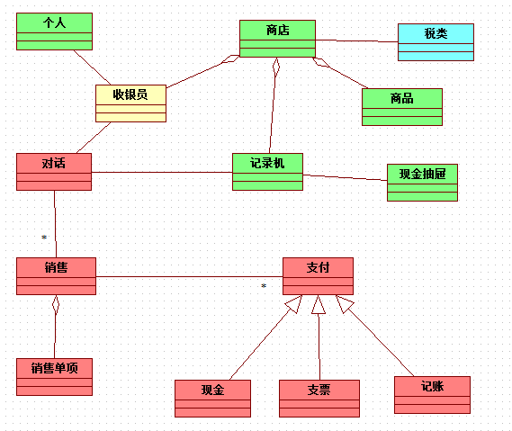

> 2009-06-30

<!-- 
- `#2 系统目标 策略`，确定目标和特性
- `#6 四种特性 策略`，确定目标和特性
- `#13 选择执行者 策略`，选择对象（模式扮演者）
- `#14 选择参与者 策略`，选择对象（模式扮演者）
- `#15 选择地点 策略`，选择对象（模式扮演者）
- `#16 选择实际物体 策略`，选择对象（模式扮演者）
- `#17 选择事务 策略`，选择对象（模式扮演者）
- `#19 选择项目和特定项目 策略`，选择对象（模式扮演者）
- `#22 选择容器对象 策略`，选择对象（模式扮演者）
- `#25 以对象－模型组件为指导 策略`，选择对象（模型组件）
- `#34 选择对象的种类 策略`，选择对象（对象种类）
- `#34 选择对象的种类 策略`，选择对象（对象种类）
- `#38 使用领域词汇 策略`，选择对象（名称）
- `#42 系统职责 策略`，选择对象（思考和质询）
- `#47 了解的方法 策略`，选择对象（思考和质询）
- `#52 确定执行者和参与者的属性 策略`，确定职责/我知道什么（模式扮演者）
- `#68 部分适用的属性 策略`，确定职责/我知道什么（思考和质询）
- `#72 确定我知道的对象 策略`，确定职责/我知道谁（基本原则）
- `#73 显示我知道谁 策略`，确定职责/我知道谁（基本原则）
- `#74 建立执行者和参与者的对象连接 策略`，确定职责/我知道谁（模式扮演者）
- `#89 基本服务 策略`，确定职责/我做什么（基本原则）
- `#94 确定执行者和参与者 策略`，确定职责/我做什么（模式扮演者）


- `#2 执行者－参与者 模式`，事务模式
- `#3 参与者－事务 模式`，事务模式
- `#4 地点－事务 模式`，事务模式
- `#6 事务－事务单项 模式`，事务模式
- `#7 事务－后续事务 模式`，事务模式
- `#14 容器－内容物 模式`，事务模式

 -->


康妮的便利店(POS应用系统)
========================
## 确定系统的目标和特性
### 确定系统的目标
- `#2 系统目标 策略`，确定目标和特性
    - 用25个字或少于25个字描述总目标：为什么建立这个系统？为什么现在建立？
    - 一直把这个总目标和关键的成功因素摆在自己面前
    - “用于支持、帮助、促进...”

问一些有关确定目标的问题，如哪些特性能够帮助你把工作做得更好？让用户提供愿望列表，并引导说出为什么需要这些功能，如：

- 提高结账速度
- 减少标错价格的数量
- 减少最初和改变价格时给商品贴价签需要的劳动

然后用很少的字来描述系统的目标，如“帮助每位收银员在结账时提高工作效率，为每一笔销售做好记录并且支持店铺更有效率地运作”

### 确定系统的特性
- `#6 四种特性 策略`，确定目标和特性
    - 务必加入包含以下内容的特性：
    - 将重要信息写入日志
    - 管理交易过程
    - 分析经营结果
    - 与其他系统交互

#### 确定记录重要信息日志的特性
向领域专家询问有关系统必须每日记录的信息，如，你希望知道经营活动中的哪些信息，需要确定具体需求，如：

- 根据通用产品代码（UPC）维持价格
- 保持税金类别（类别、税率、有效日期）
- 保留经授权的收银员
- 继续供应店中销售的哪些商品
- 记录店内每笔销售的结果

#### 确定经营生意的特性(管理交易)(Red)
得到这些需要的信息后，怎样用这些信息来经营生意，让它们具有商业价值呢？

- 根据UPC给每种商品标明价格
- 进行小计，计算销售税额并进行小计
- 接收现金、支票或记账的付款方式

#### 确定分析经营成果的特性
交易发生后，哪种经营成果分析能帮助更有效的进行经营

- 计算每种商品已出售多少
- 计算以现金、支票或信用卡形式成交的销售中我们已收到多少钱
- 评估每位收银员的表现
- 评估每个店的运营情况

#### 确定与其他系统交互的特性
如支票和信用卡认证系统，新的POS系统应当能够与其进行交互，并明确交互的目标：目的是为了从一个或多个信息（或支票）认证系统获得授权

#### 有关系统目标和特性
既然已确定了目标和特性，是否 __确定了范围了呢__ ？只能是初步的范围明确了，将随着一些需求深入，还有些变化

## 选择对象
- `#25 以对象－模型组件为指导 策略`，选择对象（模型组件）
    - 把对象－模型组件为指导，组织安排搜索对象的工作：
    - PD 问题域 与业务相关的类
    - HI 与人交互 窗口和报表
    - DM 数据管理 数据库
    - SI 与系统交互 其他系统
    - NT 暂不考虑 本系统范围之外

每个类只属于这些模型组件中的一种，对于每个组件，都可以

- 选择对象
- 确定职责
- 利用脚本描绘动态情景

## 选择问题域对象
现在考虑PD对象
### 选择执行者和参与者(Yellow)
__执行者__ 是个人、机构或其他某些东西，它们 __随着时间的推进__ 以一种或多种方式 __参与__ 到系统中，__参与者__ 则以一种特定的方式参与，__扮演角色__ 或完成一项特定任务

- `#13 选择执行者 策略`，选择对象（模式扮演者）
    - 寻找执行者：在待建系统中充当参与者的个人和机构
    - 例：个人、机构（代理处、公司、企业、财团）

本系统中，执行者是：个人

- `#14 选择参与者 策略`，选择对象（模式扮演者）
    - 分析每个参与者是如何以待建系统或许感兴趣的方式参与其中的
    - 原因：每个参与者在整个过程中以一种或多种方式参与，对于同一个参与者只是参与的方式不同。一天之种戴着“各不相同的帽子”
    - 例：代理人、申请人、买主、出纳员

使用POS系统时，人参与的方式有哪些呢？收银员、收银主管、顾客

如果对象在该系统职责环境中是适合的，则包含这个对象，否则放到暂不考虑

#### 收银员与收银主管
收银员对象是必不可少的，收银主管呢，一种选择是作为另一种类型来模拟，事实上可作为收银员的特化类

- `#68 部分适用的属性 策略`，确定职责/我知道什么（思考和质询）
    - 有些属性是否只适用于类中的某些对象？
    - 是否有一种属性，只适用于某些类型的对象？
    - 是否有一种属性，它的值可能是“不适用”？
    - 如果是，则把这种特殊属性提取出来归入一个特化类中

- `#121 部分有效的服务 策略`，确定职责/我知道什么（思考和质询）
    - 是否有一种服务只适用于类中的某些特定对象？
    - 是否有一种服务只适用于某些特定类型的对象？
    - 是否有一种服务先测试属于哪种类型，然后才完成相应活动？
    - 如果是，则把这种特殊服务提取出来归入一个特化类中

#### 顾客
只有在有办法确定顾客都是谁或者至少一部分顾客都是谁时，增加“顾客”对象才有意义

- `#47 了解的方法 策略`，选择对象（思考和质询）
    - 需要有一种知道每个对象及其属性值的方法
    - 如果没有办法了解一个对象，那么要么找到一种方法了解它，要么放进暂入考虑
    - 例如，顾客，必须有一种能够了解顾客对象的方法，否则归入暂不考虑

如果每个顾客都是走进商店，匿名参与商店的交易，然后离开，就没必要在对象模型中保留顾客对象，因为系统不需要了解顾客的任何情况，也不需要针对该顾客采取任何行动

关于类的名称

- `#38 使用领域词汇 策略`，选择对象（名称）
    - 使用该领域的词汇
    - 鼓励领域专家删除那些不属于他们领域的名称
    - 不要教领域专家应该怎样讲话
    - 除非领域专家觉得必要，否则不要改变这些词汇

### 选择地点
- `#15 选择地点 策略`，选择对象（模式扮演者）
    - 寻找存放物品的地点、能容纳其他对象的地点
    - 例：机场、装配线、银行、诊所、货栈、车库

哪些是重要的地点？我们要寻找的是以下地点：存放物品的地点、保存或容纳其他对象的地点。

在便利店里，有：商店、货架，这两个类都在该问题的研究领域中

- `#42 系统职责 策略`，选择对象（思考和质询）
    - 你的系统有责任了解这个对象或对它采取某些行动吗？
    - 如果不是，放到暂不考虑

- `#22 选择容器对象 策略`，选择对象（模式扮演者）
    - 使用基于域的容器，容器可以容纳其他对象
    - 例：机场、飞机、过道、银行、车库

商店是一个容器，容纳许多东西：收银员、记录机以及要出售的商品，商店对象是储存那些计算的合适地点

货架也很重要，当系统必须评定每个货架的性能的时候，货架应该知道货架上存放的物品以及物品的摆放布局，但这些任务 __超出了当前系统的目标和特性的范围__，所以暂时把货架也放入暂不考虑

下一步，考虑商店的种类

- `#34 选择对象的种类 策略`，选择对象（对象种类）
    - 应用泛化－特化结构找出其他的类
        + 把每个类看成一个泛化类，为其特化类，即与系统目标相适应的那些类命名
        + 研究每个特化类，为其泛化类，即与系统目标相适应的那些类命名
    - 利用泛化－特化结构实现一个应用系统内部基于域的重用：利用配置管理实现涉及多个应用系统、甚至多个问题域的重用
    - 用泛化－特化结构表示一个应用系统内部基于的相同部分和不同部分
    - 例：设备，设备种类；参与者，参与者种类；事务，事务种类

商店是一种外销形式，可以把商店专营为各种类型的商店，如超级市场、杂货店、便利店。但现在只讨论便利店形式

### 选择事物
#### 实际物体(Green)
- `#16 选择实际物体 策略`，选择对象（模式扮演者）
    - 寻找问题域中用到的实际物体
    - 在整个商店中到处走走，从周围的实际物体中选择对象
    - 例：账目、收银箱、收银抽屉、商品、计划、进度表、预订事件

商店中有哪些实际物体呢？商品、记录机、现金抽屉

#### 事物的种类
针对每一种类别，考虑以下内容：

- 如果不关心它们之间的区别，那么不需要再增加类型
- 如果只关心类别的值，就增加一个属性
- 如果增加一项类别意味着有多个附带属性，那么，增加一个特化类
- 如果增加一项类别意味着有多个不同的服务，那么增加一个特化类

本例中，我们并不关心商品间的区别，仅加入商品对象就可以了

#### 描述性事物(Blue)
- `#19 选择项目和特定项目 策略`，选择对象（模式扮演者）
    - 寻找项目，即描述性对象。它具有适用于若干个特定项目的值以及适用于所有这些特定项目的活动
    - 例：飞机－特定飞机，贷款说明－特定贷款，工作说明－特定工作，录像说明－录像带，价格类别项目－特定项目，税类项目－特定项目

还需要哪些种类的分类描述或数值描述表格呢？这个系统中需要的是税款表格，必须记录税款类别及每一类别的税率，增加一个税类对象，这样就可以记录所有税款类别、税率及有效期。在对象模型中，增加 __实际物体__ 和 __描述性事物__

#### 关于事物性质的事务(Red)
在对象模型的构建中，事务指对所有重要事件的记录或日志，一个事务对象了解一个重要事件、知道该事件中的参与者并完成与该事件有关计算

- `#17 选择事务 策略`，选择对象（模式扮演者）
    - 寻找事务，即被记住的事件，在整个过程中系统必须记住的事件。事务可以是某一时刻发生的（如一次销售），也可以是一个时间段内发生的（如一次租赁）
    - 寻找历史记录或日志中的条目，这个条目是必须保存的。是为了回答问题或进行评估
    - 例：协议、任务、授权、合同、贷款、查询、注册、订阅、计时收费、突发事件
    - 注：几乎所有的事务都由许多事务单项组成
    - 注：这些事务是从哪里来的？
        + 窗口（记录日志的事件是以某个时刻点上与人的交互为依据）
        + 另一个对象，这个对象监控一个重要事件，然后把这样一个已以发生的事件记录到日志中
        + 另一个系统，你的系统可以与这个系统就它所记录的日志事件进行交互
        
本例中，每天发生的重要事务、必须记录的重要事件是：销售、支付、对话（登录到注销）

##### 销售
事务之一就是销售，实际上销售既包括卖出的商品，也包括退回的商品，大多数事务都有称为 __事务单项__ 的组成部分，销售是若干销售单项的集合

##### 销售种类
- `#34 选择对象的种类 策略`，选择对象（对象种类）
    - 应用泛化－特化结构找出其他的类
        + 把每个类看成一个泛化类，为其特化类，即与系统目标相适应的那些类命名
        + 研究每个特化类，为其泛化类，即与系统目标相适应的那些类命名
    - 利用泛化－特化结构实现一个应用系统内部基于域的重用：利用配置管理实现涉及多个应用系统、甚至多个问题域的重用
    - 用泛化－特化结构表示一个应用系统内部基于的相同部分和不同部分
    - 例：设备，设备种类；参与者，参与者种类；事务，事务种类

销售的种类：销售、退货，目前唯一是区别是正值还是负值，无需增加两个类

##### 支付
现金、支票和记账都是支付的种类，有可能根据支付的（一种或多种）种类掌握不同的信息并完成不同的事情

##### 对话
根据系统特性，必须评价收银员的表现，所以需要知道该收银员所有的相应对话

##### 在对象模型中添加事务
本例中，需要增加的事务是：销售、销售单项；支付、支票、现金、记账；对话

## 应用模式：选择和组织问题域对象
### 参与者－事务
- `#3 参与者－事务 模式`，事务模式
    - 典型的对象交互：
        + howMany->clacForMe; rankTransactions->rateMe; 
    - 例：参与者：代理商、申请人；事务：协议、任务、授权
    - 组合：执行者－参与者；参与者－事务；地点－事务；特定项目－事务；事务－事务单项；事务－后续事务

```ruby
class 参与者
  has_many :事务s
  def howMany; end
  def rankTransactions; end
end

class 事务
  belongs_to :参考者
  def clacForMe; end
  def rateMe; end
end
```

- `#73 显示我知道谁 策略`，确定职责/我知道谁（基本原则）
    - 利用对象连接、用图形说明“我知道谁”
    - 带有约束条件时，约束条件位于受到约束的每个对象旁
    - 利用属性、文字说明“我知道谁”
        + 每当对象连接跨越多个模型组件或者连接起来不方便时
        + 用单复数形式反映该对象可能知道的对象的个数

### 地点－事务
商店是发生销售的地方，是地点－事务的一个实例

- `#4 地点－事务 模式`，事务模式
    - 典型的对象交互：
        + howMany->clacForMe; rankTransactions->rateMe; 
    - 例：地点：机场、装配线、陈列架；事务：协议、任务、授权
    - 组合：参与者－事务；地点－事务；特定项目－事务；事务－事务单项；事务－后续事务；另外地点作为容器：容器－内容物；容器－容器单项

```ruby
class 地点
  has_many :事务s
  def howMany; end
  def rankTransactions; end
end

class 事务
  belongs_to :地点
  def clacForMe; end
  def rateMe; end
end
```

### 事务－后续事务
- `#7 事务－后续事务 模式`，事务模式
    - 典型的对象交互：
        + calcOverSubsequenTransactions->clacForMe; rankSubsequenTransactions->rateMe; 
    - 例：事务：协议、任务、授权；后续事物：应用－问题、中间结果－最终结果、订购－发货、购买－支付、预订－销售
    - 组合：参与者－事务；地点－事务；特定项目－事务；事务－事务单项；
    - 注：按时间顺序（通常按发生的顺序）排列事务；如果后续事及其单项对象与事务及其单项对象一一对应，那么把它们 __合并__ 起来

```ruby
class 事务
  has_many :后续事务s
  def calcOverSubsequenTransactions; end
  def rankSubsequenTransactions; end
end

class 后续事务
  belongs_to :事务
  def clacForMe; end
  def rateMe; end
end
```

对话是一个事务，它的后续事务是什么？对话之后发生了什么，必须记住的事件是什么，哪些重要时刻点？

一次对话对应N次销售，每次销售有N种支付

### 容器－内容物
- `#14 容器－内容物 模式`，事务模式
    - 典型的对象交互：
        + calcOverContents->clacForMe; rankContents->rateMe; 
    - 例：容器：机场、飞机、文件夹；容器－内容物：飞机－货物、飞机－乘客、建筑物－房间、目录册－目录项、仓库－装货台
    - 组合：容器－内容物；容器－容器单项；小组－成员；组合件－零件。另“容器”或“内容物”是参与者、地点或特定项目时，它们将与执行者或事务相联系

```ruby
class 容器
  has_many :内容物s
  def calcOverContents; end
  def rankContents; end
end

class 内容物
  belongs_to :容器
  def clacForMe; end
  def rateMe; end
end
```

#### 商店作为内容物
先把商店作为内容物来考虑，然后再作容器考虑，商店是连锁店的一部分，如果想多个商店进行计算时，会有意思，但这次不加考虑

#### 商店作为容器
里面有记录机、商品和收银员。商店是一个基于领域的容器，商店对象知道其记录机、商品和收银员

#### 事务－事务单项
销售是一个事务，几乎所有事务对象都有相应的事务单项

- `#6 事务－事务单项 模式`，事务模式
    - 典型的对象交互：
        + calcOverLineItems->clacForMe; rankLineItems->rateMe; 
    - 例：事务：协议、任务、授权；事物－事务单项：存款－存款单项、订单－订单单项、支付－支付单项、发货－发货单项
    - 组合：参与者－事务；地点－事务；特定项目－事务；事务－后续事务；事务单项－后续事务单项、项目－单项、特定项目－单项

```ruby
class 事务
  has_many :事务单项s
  def calcOverLineItems; end
  def rankLineItems; end
end

class 事务单项
  belongs_to :事务
  def clacForMe; end
  def rateMe; end
end
```

本例中，销售对象知道一个或多个销售单项对象

### 执行者－参与者
- `#2 执行者－参与者 模式`，事务模式
    - 典型的对象交互：
        + calcOverParticipants->clacForMe; rankParticipants->rateMe; 
    - 例：执行者：个人、机构；参与者：经销商、公务员、申请人、业主
    - 组合：参与者－事务；

```ruby
class 执行者
  has_many :参与者s
  def calcOverParticipants; end
  def rankParticipants; end
end

class 参与者
  belongs_to :执行者
  def clacForMe; end
  def rateMe; end
end
```

这里执行者是个人、参与者是收银员，个人可能知道不止一个收银员对象，假如记录收银员对象的受雇时间，在一段时间内，就有可能知道多个收银员对象，如果不记录受雇时间，将是一对一的结束

### 进度小结
目前进展到



## 确定问题域对象的职责
对象模型中所有对象都有具体的职责：

1. 对象知道有关它自己的事
2. 对象知道其他对象
3. 对象还执行一些事情：自己完成或与其他对象合作完成

确定职责，反映出系统必须知道和完成的事情，使用以下策略：

1. 我知道什么
2. 我知道谁
3. 我做什么

### 执行者和参与者的职责
#### 执行者：个人
##### 确定职责：我知道什么
- `#52 确定执行者和参与者的属性 策略`，确定职责/我知道什么（模式扮演者）
    - 对于执行者，考虑：姓名、地址、电话
    - 对于参与者，应包括：编号、日期和时间（可能是结束日期）、密码、授权级别

##### 确定职责：我知道谁
- `#72 确定我知道的对象 策略`，确定职责/我知道谁（基本原则）
    - 这是软件发挥作用的一个方面：我是一个实际物体的抽象，我知道与这个实际物体有关的其他那些对象
    - 选择相连接的对象以满足下面两个目标
        + 在一个或多个脚本中直接知道 把消息发送给谁
        + 回答关于与它直接有关的对象的查询

下面是一些具体的帮助

- `#74 建立执行者和参与者的对象连接 策略`，确定职责/我知道谁（模式扮演者）
    - 对于执行者，应包括与其参与者的对象连接
    - 对于参与者，应包括与其执行者以及参与者的事务之间的对象连接

##### 确定职责：我做什么
- `#89 基本服务 策略`，确定职责/我做什么（基本原则）
    - 所有对象都要完成基本服务，除了可能会使用基本服务的特定脚本视图之外，对象模型中不显示这些基本服务
    - 基本服务是：获得、设置；添加（连接的对象）、清除（连接的对象）；创建（类所做的某些事情）和初始化、删除
    - 注：属性是私有的，通过getter/setter服务访问属性值
    - 数据管理对象的基本DM服务是搜索、装载和保存

基本服务不需要在类图中画出来，能有效精简模型

那么个人和参与者又怎样呢？

- `#94 确定执行者和参与者 策略`，确定职责/我做什么（模式扮演者）
    - 对于执行者和参与者，应包括：为我计算、我的比率
    - 对于集合性质的执行者，应包括：数量多少、程度如何、把参与者排序、针对所有参与者的计算（以及强制在该集合上应用交易规则的服务）
    - 对于集合性质的参与者，应包括：数量多少、程度如何、把事务排序、针对所有事务的计算（以及强制在该集合上应用交易规则的服务）

通常由参与者对象完成 “我做什么”行为

#### 参与者：收银员
26


