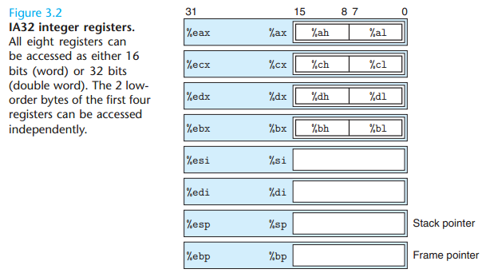
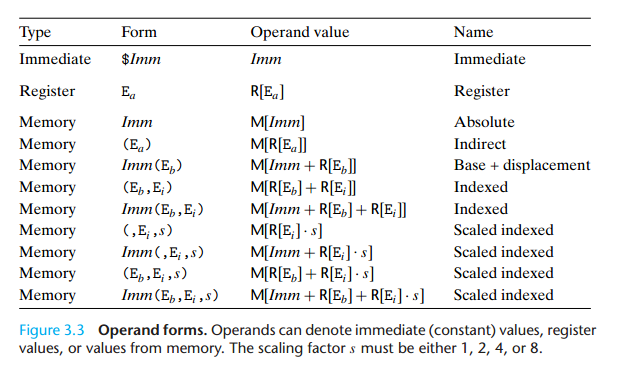
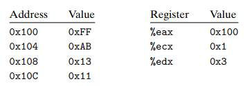
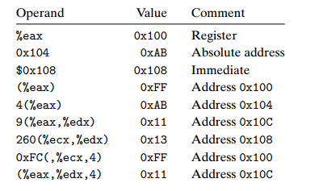
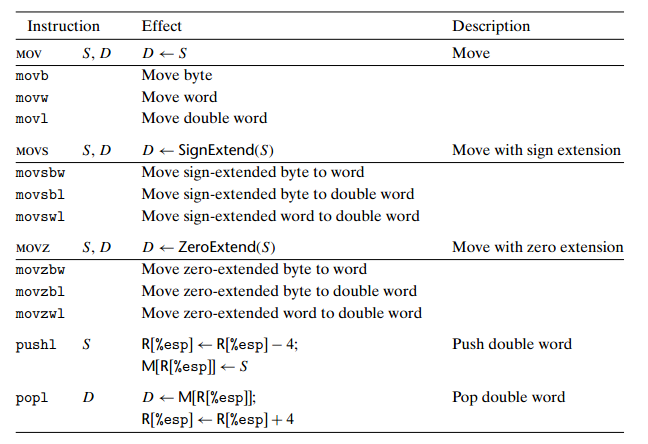
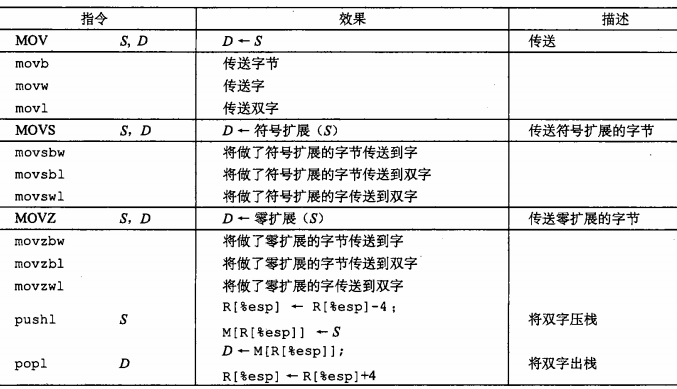
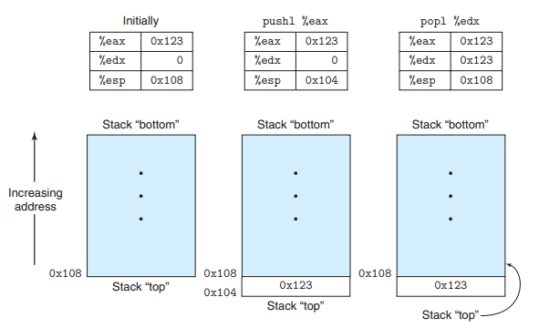
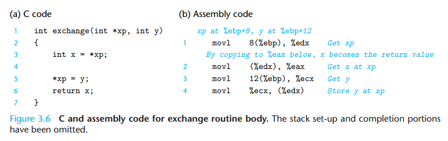
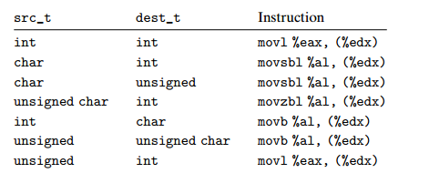

> 2014-12-31

<!-- 信息的表示与处理
=============== -->


程序的机器级表示
===============
## 程序编码

### 代码示例
```c
int accum = 0;
int sum(int x, int y){
    int t = x + y;
    accum += t;
    return t;
}
```

使用`gcc -O1 -S code.c`得到的`code.s`

```
sum:
    pushl   %ebp
    movl    %esp, %ebp
    movl    12(%ebp), %eax
    addl    8(%ebp), %eax
    addl    %eax, accum
    popl    %ebp
    ret
```

使用`gcc -O1 -c code.c`得到的`code.o`，再执行`objdump -d code.o`进行反汇编

```
code.o:     file format elf32-i386

Disassembly of section .text:

00000000 <sum>:
   0:   55                      push   %ebp
   1:   89 e5                   mov    %esp,%ebp
   3:   8b 45 0c                mov    0xc(%ebp),%eax
   6:   03 45 08                add    0x8(%ebp),%eax
   9:   01 05 00 00 00 00       add    %eax,0x0
   f:   5d                      pop    %ebp
  10:   c3                      ret

```

反汇编使用的指令与GCC生成的汇编有些差别，它省略了指令结尾的`l`，这些后缀是大小指示符，在大多数情况下可以忽略，另外，`addl    %eax, accum`对应此处的`add    %eax,0x0`，即`accum`的地址是`0x0`，这需要等链接完成后，才能得到真实地址


### 格式的注解
```c
int simple(int *xp, int y){
    int t = *xp + y;
    *xp = t;
    return t;
}
```

对应的`simple.s`

```
  .file "simple.c"
  .text
.globl simple
  .type simple, @function
simple:
  pushl   %ebp              #save frame pointer
  movl    %esp, %ebp        #create new frame pointer
  movl    8(%ebp), %edx     #retrieve xp
  movl    12(%ebp), %eax    #retrieve y
  addl    (%edx), %eax      #add *xp to get t
  movl    %eax, (%edx)      #store t at xp
  popl    %ebp              #restore frame pointer
  ret
  .size simple, .-simple
  .ident  "GCC: (GNU) 4.1.2 20080704 (Red Hat 4.1.2-54)"
  .section  .note.GNU-stack,"",@progbits
```

所有以`.`开头的行都是指导汇编器和链接器的命令，通常可以忽略这些行。

也可产生相应的Intel格式`gcc -O1 -S -masm=intel simple.c`


```
simple:
  push  ebp
  mov ebp, esp
  mov edx, DWORD PTR [ebp+8]
  mov eax, DWORD PTR [ebp+12]
  add eax, DWORD PTR [edx]
  mov DWORD PTR [edx], eax
  pop ebp
  ret
```

- Intel代码省略了指示大小的后缀，看到的指令`mov`，而不是`movl`
- Intel代码省略了寄存器前面的`%`符号
- Intel代码用不同方式来描述存储器中位置，是`DWORD PTR [ebp+8]`，而不是`8(%ebp)`
- 在带有多个操作数的指令情况下，__列出操作数的顺序相反__

## 数据格式

- 字节  8bit
- 字    16bit
- 双字  32bit
- 四字  64bit

```table
C声明           | Intel数据类型 | 汇编代码后缀 | 大小（字节）
----------------|--------------|-------------|-----------
char            |字节           | b           |   1
short           |字             | w           |   2
int             |双字           | l           |   4
long int        |双字           | 1           |   4
long long int   |—              | —           |   4
char *          |双字            | l           |   4
float           |单精度          | s           |   4
double          |双精度          | l           |   8
long double     |扩展精度        | t           |  10/12
```

大多数GCC生成的汇编代码指令都有一个字符后缀，表明操作数的大小，如数据传送指令有三个变种：`movb`传送字节，`movw`传送字，`movl`传送双字，也使用后缀`l`表示4字节整数和8字节双精度浮点数，这不会产生歧义，因为浮点数使用完全不同的指令的寄存器

## 访问信息
一个IA32中央处理单元包含一组8个存储32位值的寄存器，它们以`%e`开头



字节操作指令可以独立的读或写前4个寄存器的2个低位字节，如`%ax`则表示16位，其中还可以细分`%ah`表示高8位，`%al`表示低8位

### 操作数指示符

源数据值可以以常数形式给出，或从寄存器或存储器中读出，结果可以存放在寄存器或存储器中

- 立即数(immediate)，也就是常数值，在ATT格式中，是`$`后用一标准C表示的整数，如`$-577`或`$0x1F`，任何能放进32位的字里的数值都可以用做立即数，不过汇编在可能时使用一个或两个字节的编码
- 寄存器(register)，表示某个寄存器的内容，对 __双字__ 操作来说，可以是8个32位寄存器（如`%eax`）中的一个，对 __字__ 操作来说，可以是8个16位寄存器（如`%ax`）中的一个，或者对 __字节__ 操作来说，可以是8个单字节寄存器元（如`%al`）素中的一个。E<sub>a</sub>来表示任意寄存器a，用引用R[E<sub>a</sub>]来表示它的值，将寄存器看成一个数组R，用寄存器标识作为索引
- 存储器(memory)引用，它会根据计算出来的地址，访问某个存储器位置，将存储器看成一个很大的字节数组，用符号M<sub>b</sub>[Addr]表示对存储器中从地址Addr开始的b个字节值的引用，为了方便通常省去下方的b



上图表示多种不同的寻址模式，允许不同形式的存储器引用，Imm(E<sub>b</sub>,E<sub>i</sub>,s)表示：一个立即数偏移Imm，一个基址寄存器E<sub>b</sub>，一个变址寄存器E<sub>i</sub>和一个比例因子s，这里s必须是1、2、4、8。然后有效地址被计算为Imm+R[E<sub>b</sub>]+R[E<sub>i</sub>]*s

练习





- 9(%eax,%edx) => M[9 + R[%eax] + R[%edx]] => M[9 + 0x100 + 0x3] => M[0x10C] => 0x11
- 0xFC(,%ecx,4) => M[0xFC + R[%ecx] * 4] => M[0xFC + 0x1 * 4] => M[0xFC + 0x4] => M[0x100] => 0xFF
- (%eax,%edx,4) => M[R[%eax] + R[%edx] * 4] => M[0x100 + 0x3 * 4] => M[0x10C] => 0x11

### 数据传送指令
指令类，指令执行一样的操作，只不过操作数的大小不同，如`MOV`类由三条指令组成：`movb`、`movw`、`movl`，不同的只是它们分别是在大小为1,2,4个字节的数据上进行操作





`MOV`类中，IA32有一条限制，__传送指令的两个操作数不能都指向存储器位置__，下面是mov指令的五种可能组合，记住，每一个是源操作数，第二个是目的操作数

```
movl $0x4050,%eax         #Immediate--Register, 4 bytes
movw %bp,%sp              #Register--Register, 2 bytes
movb (%edi,%ecx),%ah      #Memory--Register, 1 byte
movb $-17,(%esp)          #Immediate--Memory, 1 byte
movl %eax,-12(%ebp)       #Register--Memory, 4 bytes
```

`MOVS`和`MOVZ`指令类将一个较小的源数据复制到一个较大的数据位置，高位用符号位扩展(`MOVS`)或零扩展(`MOVZ`)进行填充，用符号位扩展，目的位置的所有高位用源值的最高位数值进行填充，用零扩展时，则所有高位用零填充。这两个类中每个都有三条指令，包括了所有源大小为1和2个字节，目的大小为2和4个的情况

```
#Assume initially that %dh = CD, %eax = 98765432
movb %dh,%al      #%eax = 987654CD  不改变其他三个字节
movsbl %dh,%eax   #%eax = FFFFFFCD  高三位全为符号扩展，CD符号位为1，高位全部为1
movzbl %dh,%eax   #%eax = 000000CD  高三位全为0
```

`pushl`和`popl`将数据压入程序栈或出栈(__栈本身在存储器中__)，__栈向下增长__，栈顶元素是栈中最低的，压栈是减少栈指针(寄存器`%esp`)的值(`R[%esp]`)，并将数据存放到 __存储器__(`M[R[%esp]]`)中



```
pushl %eax
#等价于
subl $4,%esp        #Decrement stack pointer
movl %eax,(%esp)    #Store %eax on stack
```

```
popl %edx
#等价于
movl (%esp),%edx    #Read %edx from stack
addl $4,%esp        #Increment stack pointer
```

因为栈和程序代码以及其他形式的程序数据都是放在同样的存储器中，所以程序可以用标准的存储器寻址方法访问栈内任意位置，如，栈顶元素是双字，`movl 4(%esp),%edx`会将第二个双字从栈中复制到寄存器`%edx`

根据操作数，确定指令后缀

```
movl %eax, (%esp)
movw (%eax), %dx
movb $0xFF, %bl
movb (%esp,%edx,4), %dh
pushl $0xFF
movw %dx, (%eax)
popl %edi
```

IA32中即使操作数是一个字节或者单字的，__存储器的引用也总是用双字长寄存器__ (如`movw %dx, (%eax)`中的`(%eax)`)给出

以下是常见的一些错误指令

```
movb $0xF, (%bl)    　＃Cannot use %bl as address register
movl %ax, (%esp)    　＃Mismatch between instruction suffix and register ID, use movw
movw (%eax),4(%esp) 　＃Cannot have both source and destination be memory references
movb %ah,%sh        　＃No register named %sh
movl %eax,$0x123    　＃Cannot have immediate as destination
movl %eax,%dx       　＃Destination operand incorrect size
movb %si, 8(%ebp)   　＃Mismatch between instruction suffix and register ID, use movw
```

### 数据传送示例



- `movl 8(%ebp), %edx`，将`xp`的值，放入`%edx`，即`R[%edx] = xp`
- `movl (%edx), %eax`，将`M[R[%edx]]`，即`*xp`指向的值，放入`%eax`，即`R[%eax]=*xp`，`R[%eax]`将变成返回值
- `movl 12(%ebp), %ecx`，将`y`的值，放入`%ecx`，即`R[%ecx] = y`
- `movl %ecx, (%edx)`，将`R[%ecx]`，放入`M[R[%edx]]`，完成`*xp = y`

C语言中所谓的"指针"其实就是地址，间接引用指针是将该指针放在一个寄存器中，然后在存储器引用中使用这个寄存器，其次，像x这样的局部变量通常是保存在寄存器中，而不是存储器中，寄存器访问比存储器访问要快得多

```c
src_t v;
dest_t *p;
*p = (dest_t) v;
```

设`v`存储在寄存器`%eax`适当命名的部分中，也就是`%eax`,`%ax`,`%al`，而指针`p`存储在寄存器`%edx`中，当执行 __既涉及大小变化又涉及符号改变的强制类型转换__ 时，操作应该先改变符号




```
```
```
```


<!--
zh 141 236

en 176/211 344

 -->


