> 2012-12-18

Ruby平台
=============

## 字符串
第三章已解释了字符串的连接`+`、追加`<<`、重复`*`和索引`[]`操作符，本节介绍String类的有名字的方法

<!-- language: !ruby -->

    s = "hello"
    p s.concat(" world")    # Synonym for <<. Mutating append to s. Returns new s.
    p s.insert(5, " there") # Same as s[5,0] = " there". Alters s. Returns new s.
    p s.slice(0,5)          # Same as s[0,5]. Returns a substring.
    p s.slice!(5,6)         # Deletion. Same as s[5,6]="". Returns deleted substring.
    p s
    p s.eql?("hello world") # True. Same as ==.

    p s.length         # => 11: counts characters in 1.9, bytes in 1.8
    p s.size           # => 11: size is a synonym
    p s.bytesize       # => 11: length in bytes; Ruby 1.9 only
    p s.empty?         # => false
    p "".empty?        # => true

String方法用于查找的替换文本，须结合后面的正则表达式

<!-- language: !ruby -->

    s = "hello"
    # Finding the position of a substring or pattern match
    p s.index('l')         # => 2: index of first l in string
    p s.index(?l)          # => 2: works with character codes as well
    p s.index(/l+/)        # => 2: works with regular expressions, too
    p s.index('l',3)       # => 3: index of first l in string at or after position 3
    p s.index('Ruby')      # => nil: search string not found
    p s.rindex('l')        # => 3: index of rightmost l in string
    p s.rindex('l',2)      # => 2: index of rightmost l in string at or before 2

    # Checking for prefixes and suffixes: Ruby 1.9 and later
    p s.start_with? "hell" # => true. Note start_with not starts_with
    p s.end_with? "bells"  # => false

    # Testing for presence of substring
    p s.include?("ll")     # => true: "hello" includes "ll"
    p s.include?(?H)       # => false: "hello" does not include character H

    # Pattern matching with regular expressions
    p s =~ /[aeiou]{2}/    # => nil: no double vowels in "hello"
    p s.match(/[aeiou]/) {|m| m.to_s} # => "e": return first vowel

    # Splitting a string into substrings based on a delimiter string or pattern
    p "this is it".split     # => ["this", "is", "it"]: split on spaces by default
    p "hello".split('l')     # => ["he", "", "o"]
    p "1, 2,3".split(/,\s*/) # => ["1","2","3"]: comma and optional space delimiter

    # Split a string into two parts plus a delimiter. Ruby 1.9 only.
    # These methods always return arrays of 3 strings:
    p "banana".partition("an")  # => ["b", "an", "ana"]
    p "banana".rpartition("an") # => ["ban", "an", "a"]: start from right
    p "a123b".partition(/\d+/)  # => ["a", "123", "b"]: works with Regexps, too

    # Search and replace the first (sub, sub!) or all (gsub, gsub!)
    # occurrences of the specified string or pattern.
    # More about sub and gsub when we cover regular expressions later.
    p s.sub("l", "L")            # => "heLlo": Just replace first occurrence
    p s.gsub("l", "L")           # => "heLLo": Replace all occurrences
    p s.sub!(/(.)(.)/, '\2\1')   # => "ehllo": Match and swap first 2 letters
    p s.sub!(/(.)(.)/, "\\2\\1") # => "hello": Double backslashes for double quotes
    # sub and gsub can also compute a replacement string with a block
    # Match the first letter of each word and capitalize it
    p "hello world".gsub(/\b./) {|match| match.upcase } # => "Hello World"
    # In Ruby 1.9, you can specify a hash to map matches to replacements
    p s.gsub(/[aeiou]/,"a"=>0, "e"=>1, "i"=>2)   # => "h1ll"

定义了一组用于处理大小写的方法（但没有测试一个字符大小写和种类的方法）

<!-- language: !ruby -->

    # Case modification methods
    s = "world"   # These methods work with ASCII characters only
    p s.upcase      # => "WORLD"
    p s.upcase!     # => "WORLD"; alter s in place
    p s.downcase    # => "world"
    p s.capitalize  # => "World": first letter upper, rest lower
    p s.capitalize! # => "World": alter s in place
    p s.swapcase    # => "wORLD": alter case of each letter

    # Case insensitive comparison. (ASCII text only)
    # casecmp works like <=> and returns -1 for less, 0 for equal, +1 for greater
    p "world".casecmp("WORLD")  # => 0
    p "a".casecmp("B")          # => -1 (<=> returns 1 in this case)

定义了一组增加和删除空白字符的方法

<!-- language: !ruby -->

    s = "hello\r\n"      # A string with a line terminator
    p s.chomp!             # => "hello": remove one line terminator from end
    p s.chomp              # => "hello": no line terminator so no change
    p s.chomp!             # => nil: return of nil indicates no change made
    p s.chomp("o")         # => "hell": remove "o" from end
    $/ = ";"             # Set global record separator $/ to semicolon
    p "hello;".chomp       # => "hello": now chomp removes semicolons and end

    # chop removes trailing character or line terminator (\n, \r, or \r\n)
    s = "hello\n"
    p s.chop!              # => "hello": line terminator removed. s modified.
    p s.chop               # => "hell": last character removed. s not modified.
    p "".chop              # => "": no characters to remove
    p "".chop!             # => nil: nothing changed

    # Strip all whitespace (including \t, \r, \n) from left, right, or both
    # strip!, lstrip! and rstrip! modify the string in place.
    s = "\t hello \n"   # Whitespace at beginning and end
    p s.strip             # => "hello"
    p s.lstrip            # => "hello \n"
    p s.rstrip            # => "\t hello"

    # Left-justify, right-justify, or center a string in a field n-characters wide.
    # There are no mutator versions of these methods. See also printf method.
    s = "x"
    p s.ljust(3)          # => "x  "
    p s.rjust(3)          # => "  x"
    p s.center(3)         # => " x "
    p s.center(5, '-')    # => "--x--": padding other than space are allowed
    p s.center(7, '-=')   # => "-=-x-=-": multicharacter padding allowed

字符串在Ruby1.9中删除了each方法，也不再包含Enumerable模块，但定义了一个each_char迭代器，用于字符方式的枚举

<!-- language: !ruby -->

    s = "A\nB"                       # Three ASCII characters on two lines
    s.each_byte {|b| print b, " " }  # Prints "65 10 66 "
    s.each_line {|l| print l.chomp}  # Prints "AB"

    # Sequentially iterate characters as 1-character strings
    # Works in Ruby 1.9, or in 1.8 with the jcode library:
    s.each_char { |c| print c, " " } # Prints "A \n B "

    # Enumerate each character as a 1-character string
    # This does not work for multibyte strings in 1.8
    # It works (inefficiently) for multibyte strings in 1.9:
    0.upto(s.length-1) {|n| print s[n,1], " "}

    # In Ruby 1.9, bytes, lines, and chars are aliases
    p s.bytes.to_a             # => [65,10,66]: alias for each_byte
    p s.lines.to_a             # => ["A\n","B"]: alias for each_line
    p s.chars.to_a             # => ["A", "\n", "B"] alias for each_char

String定义了一组用于字符串解析数字的方法，以及用于把字符串转换为符号的方法

<!-- language: !ruby -->

    p "10".to_i          # => 10: convert string to integer
    p "10".to_i(2)       # => 2: argument is radix: between base-2 and base-36
    p "10x".to_i         # => 10: nonnumeric suffix is ignored. Same for oct, hex
    p " 10".to_i         # => 10: leading whitespace ignored
    p "ten".to_i         # => 0: does not raise exception on bad input
    p "10".oct           # => 8: parse string as base-8 integer
    p "10".hex           # => 16: parse string as hexadecimal integer
    p "0xff".hex         # => 255: hex numbers may begin with 0x prefix
    p " 1.1 dozen".to_f  # => 1.1: parse leading floating-point number
    p "6.02e23".to_f     # => 6.02e+23: exponential notation supported
    p "one".to_sym       # => :one -- string to symbol conversion
    p "two".intern       # => :two -- intern is a synonym for to_sym

看看其它方法

<!-- language: !ruby -->

    # Increment a string:
    p "a".succ                      # => "b": the successor of "a". Also, succ!
    p "aaz".next                    # => "aba": next is a synonym. Also, next!
    "a".upto("e") {|c| print c }  # Prints "abcde". upto iterator based on succ.

    # Reverse a string:
    p "hello".reverse     # => "olleh". Also reverse!

    # Debugging
    p "hello\n".dump      # => "\"hello\\n\"": Escape special characters
    p "hello\n".inspect   # Works much like dump

    # Translation from one set of characters to another
    p "hello".tr("aeiou", "AEIOU")  # => "hEllO": capitalize vowels. Also tr!
    p "hello".tr("aeiou", " ")      # => "h ll ": convert vowels to spaces
    p "bead".tr_s("aeiou", " ")     # => "b d": convert and remove duplicates

    # Checksums
    p "hello".sum          # => 532: weak 16-bit checksum
    p "hello".sum(8)       # => 20: 8 bit checksum instead of 16 bit
    p "hello".crypt("ab")  # => "abl0JrMf6tlhw": one way cryptographic checksum
                         # Pass two alphanumeric characters as "salt"
                         # The result may be platform-dependent

    # Counting letters, deleting letters, and removing duplicates
    p "hello".count('aeiou')  # => 2: count lowercase vowels
    p "hello".delete('aeiou') # => "hll": delete lowercase vowels. Also delete!
    p "hello".squeeze('a-z')  # => "helo": remove runs of letters. Also squeeze!

    # When there is more than one argument, take the intersection.
    # Arguments that begin with ^ are negated.
    p "hello".count('a-z', '^aeiou')   # => 3: count lowercase consonants
    p "hello".delete('a-z', '^aeiou')  # => "eo: delete lowercase consonants

### 格式化文本
除了支持插值，Ruby还支持格式操作符`%`，Kernel模块定义了全局`printf`和`sprintf`方法，同C语言的方法相似

<!-- language: !ruby -->

    n, animal = 2, "mice"

    # Alternatives to the interpolation above
    printf('%d blind %s', n+1, animal)  # Prints '3 blind mice', returns nil
    sprintf('%d blind %s', n+1, animal) # => '3 blind mice'
    p '%d blind %s' % [n+1, animal]  # Use array on right if more than one argument

    # Formatting numbers
    p '%d' % 10         # => '10': %d for decimal integers
    p '%x' % 10         # => 'a': hexadecimal integers
    p '%X' % 10         # => 'A': uppercase hexadecimal integers
    p '%o' % 10         # => '12': octal integers

    p '%f' % 1234.567   # => '1234.567000': full-length floating-point numbers
    p '%e' % 1234.567   # => '1.234567e+03': force exponential notation
    p '%E' % 1234.567   # => '1.234567e+03': exponential with uppercase E
    p '%g' % 1234.567   # => '1234.57': six significant digits
    p '%g' % 1.23456E12 # => '1.23456e+12': Use %f or %e depending on magnitude

    # Field width
    p '%5s' % '<<<'     # '  <<<': right-justify in field five characters wide
    p '%-5s' % '>>>'    # '>>>  ': left-justify in field five characters wide
    p '%5d' % 123       # '  123': field is five characters wide
    p '%05d' % 123      # '00123': pad with zeros in field five characters wide

    # Precision
    p '%.2f' % 123.456  # '123.46': two digits after decimal place
    p '%.2e' % 123.456  # '1.23e+02': two digits after decimal = three significant digits
    p '%.6e' % 123.456  # '1.234560e+02': note added zero
    p '%.4g' % 123.456  # '123.5': four significant digits

    # Field and precision combined
    p '%6.4g' % 123.456 # ' 123.5': four significant digits in field six chars wide
    p '%3s' % 'ruby'    # 'ruby': string argument exceeds field width
    p '%3.3s' % 'ruby'  # 'rub': precision forces truncation of string

    # Multiple arguments to be formatted
    args = ['Syntax Error', 'test.rb', 20]  # An array of arguments
    p "%s: in '%s' line %d" % args    # => "Syntax Error: in 'test.rb' line 20"

    # Same args, interpolated in different order!  Good for internationalization.
    p "%2$s:%3$d: %1$s" % args        # => "test.rb:20: Syntax Error"

### 打包和解包二进制字符串
字符串不仅可存放文本数据，也可以存放二进制数据，使用Array.pack方法可以把数组中的元素编码为一个二进制数组，而String.unpack可解码一个二进制字符串，提取其中的数值并把这些数值作为一个数组返回

<!-- language: !ruby -->

    a = [1,2,3,4,5,6,7,8,9,10]  # An array of 10 integers
    b = a.pack('i10')           # Pack 10 4-byte integers (i) into binary string b
    p b
    c = b.unpack('i*')          # Decode all (*) the 4-byte integers from b
    p c == a                    # => true

    m = 'hello world'           # A message to encode
    data = [m.size, m]          # Length first, then the bytes
    template = 'Sa*'            # Unsigned short, any number of ASCII chars
    b = data.pack(template)     # => "\v\000hello world"
    p b, b.unpack(template)     # => [11, "hello world"]

### 字符串和编码
参考RubyProgramming之中的3.2.6

## 正则表达式

### Regexp字面量

正则表达式修饰符

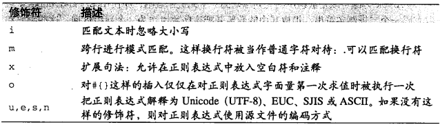

Ruby正则表达式可用`%r`跟一个分隔符来定义，当正则表达式中有许多斜杠符时，如果不想转义，这会很有用处

<!-- language: ruby -->

    %r|/|         # Matches a single slash character, no escape required
    %r[</(.*)>]i  # Flag characters are allowed with this syntax, too

正则表达式中`()[]{}.?+*|^$`等字符有特殊含义，如果要匹配它们时，需要反斜杠进行转义

<!-- language: ruby -->

    /\(\)/     # Matches open and close parentheses
    /\\/       # Matches a single backslash

除了可以包含`\n`,`\t`，还可以包含`\u`这样的转认符

<!-- language: ruby -->

    money = /[$\u20AC\u{a3}\u{a5}]/ # match dollar,euro,pound, or yen sign

另一点与双引号字符串字面量相似，可使用`#{}`内插表达式

<!-- language: ruby -->

    prefix = ","
    /#{prefix}\t/   # Matches a comma followed by an ASCII TAB character

插入行为是在正则表达式解析之前完成的，意味着，__特殊字符会成为正则表达式的一部分__。通常，插入表达式在 __每次对正则表达式字面量求值前被执行一次__，不过，如果使用了`o`修饰符，仅在第一次解析时被执行

<!-- language: !ruby -->

    p [1,2].map{|x| /#{x}/}   # => [/1/, /2/]
    p [1,2].map{|x| /#{x}/o}  # => [/1/, /1/]

### Regexp的工厂方法
可使用Regexp.new(同义词时Regexp.compile)来创建一个正则表达式

<!-- language: ruby -->

    Regexp.new("Ruby?")                          # /Ruby?/
    Regexp.new("ruby?", Regexp::IGNORECASE)      # /ruby?/i
    Regexp.compile(".", Regexp::MULTILINE, "u")  # /./mu

可使用`Regexp.escape`对字符串的特殊字符进行转义

<!-- language: !ruby -->

    pattern = "[a-z]+"                # One or more letters
    suffix = Regexp.escape("()")      # Treat these characters literally
    r = Regexp.new(pattern + suffix)  # /[a-z]+\(\)/
    p r

`Regexp.union`可以创建一个“联合”了任意多字符串或Regexp对象的模式，与new和compile方法不同，传入它的字符串可自动转义

<!-- language: !ruby -->

    # Match any one of five language names.
    p Regexp.union("Ruby", "Perl", "Python", /Java(Script)?/)
    # Match empty parens, brackets, or braces. Escaping is automatic:
    p Regexp.union("()", "[]", "{}")   # => /\(\)|\[\]|\{\}/

### 正则表达式句法
<!-- language: ruby -->

    # Literal characters
    /ruby/             # Match "ruby". Most characters simply match themselves.
    /¥/                # Matches Yen sign. Multibyte characters are suported
                       # in Ruby 1.9 and Ruby 1.8.

    # Character classes
    /[Rr]uby/          # Match "Ruby" or "ruby"
    /rub[ye]/          # Match "ruby" or "rube"
    /[aeiou]/          # Match any one lowercase vowel
    /[0-9]/            # Match any digit; same as /[0123456789]/
    /[a-z]/            # Match any lowercase ASCII letter
    /[A-Z]/            # Match any uppercase ASCII letter
    /[a-zA-Z0-9]/      # Match any of the above
    /[^aeiou]/         # Match anything other than a lowercase vowel
    /[^0-9]            # Match anything other than a digit

    # Special character classes
    /./                # Match any character except newline
    /./m               # In multiline mode . matches newline, too
    /\d/               # Match a digit /[0-9]/
    /\D/               # Match a nondigit: /[^0-9]/
    /\s/               # Match a whitespace character: /[ \t\r\n\f]/
    /\S/               # Match nonwhitespace: /[^ \t\r\n\f]/
    /\w/               # Match a single word character: /[A-Za-z0-9_]/
    /\W/               # Match a nonword character: /[^A-Za-z0-9_]/

    # Repetition
    /ruby?/            # Match "rub" or "ruby": the y is optional
    /ruby*/            # Match "rub" plus 0 or more ys
    /ruby+/            # Match "rub" plus 1 or more ys
    /\d{3}/            # Match exactly 3 digits
    /\d{3,}/           # Match 3 or more digits
    /\d{3,5}/          # Match 3, 4, or 5 digits

    # Nongreedy repetition: match the smallest number of repetitions
    /<.*>/             # Greedy repetition: matches "<ruby>perl>"
    /<.*?>/            # Nongreedy: matches "<ruby>" in "<ruby>perl>"
                       # Also nongreedy: ??, +?, and {n,m}?

    # Grouping with parentheses
    /\D\d+/            # No group: + repeats \d
    /(\D\d)+/          # Grouped: + repeats \D\d pair
    /([Rr]uby(, )?)+/  # Match "Ruby", "Ruby, ruby, ruby", etc.

    # Backreferences: matching a previously matched group again
    /([Rr])uby&\1ails/ # Match ruby&rails or Ruby&Rails
    /(['"])[^\1]*\1/   # Single or double-quoted string
                       #   \1 matches whatever the 1st group matched
                       #   \2 matches whatever the 2nd group matched, etc.

    # Named groups and backreferences in Ruby 1.9: match a 4-letter palindrome
    /(?<first>\w)(?<second>\w)\k<second>\k<first>/
    /(?'first'\w)(?'second'\w)\k'second'\k'first'/ # Alternate syntax

    # Alternatives
    /ruby|rube/        # Match "ruby" or "rube"
    /rub(y|le))/       # Match "ruby" or "ruble"
    /ruby(!+|\?)/      # "ruby" followed by one or more ! or one ?

    # Anchors: specifying match position
    /^Ruby/            # Match "Ruby" at the start of a string or internal line
    /Ruby$/            # Match "Ruby" at the end of a string or line
    /\ARuby/           # Match "Ruby" at the start of a string
    /Ruby\Z/           # Match "Ruby" at the end of a string
    /\bRuby\b/         # Match "Ruby" at a word boundary
    /\brub\B/          # \B is nonword boundary:
                       #   match "rub" in "rube" and "ruby" but not alone
    /Ruby(?=!)/        # Match "Ruby", if followed by an exclamation point
    /Ruby(?!!)/        # Match "Ruby", if not followed by an exclamation point

    # Special syntax with parentheses
    /R(?#comment)/     # Matches "R". All the rest is a comment
    /R(?i)uby/         # Case-insensitive while matching "uby"
    /R(?i:uby)/        # Same thing
    /rub(?:y|le))/     # Group only without creating \1 backreference

    # The x option allows comments and ignores whitespace
    /  # This is not a Ruby comment. It is a literal part
       # of the regular expression, but is ignored.
       R      # Match a single letter R
       (uby)+ # Followed by one or more "uby"s
       \      # Use backslash for a nonignored space
    /x                 # Closing delimiter. Don't forget the x option!

正则表达式句法

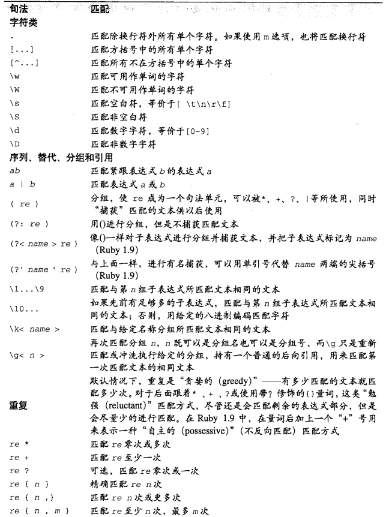

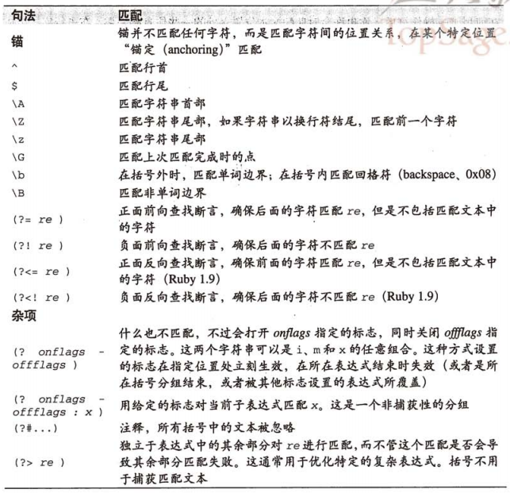

### 用正则表达式进行模式匹配
`=~`是Ruby基本的模式匹配操作符，一个操作符必须是一个正则表达式，另一个则必须是一个字符串（左右位置无所谓），发现匹配则返回所在位置，否则返回nil

<!-- language: !ruby -->

    pattern = /Ruby?/i        # Match "Rub" or "Ruby", case-insensitive
    p pattern =~ "backrub"    # Returns 4.
    p "rub ruby" =~ pattern   # 0
    p pattern =~ "r"          # nil

在进行完一个成功匹配后（返回非nil），全局变量`$~`指向一个MatchData对象，其中包含所有该匹配的信息

<!-- language: !ruby -->

    "hello" =~ /e\w{2}/    # 1: Match an e followed by 2 word characters
    p $~.string            # "hello": the complete string
    p $~.to_s              # "ell": the portion that matched
    p $~.pre_match         # "h": the portion before the match
    p $~.post_match        # "o": the portion after the match

`$~`是一个特殊的 __线程局部和方法局部变量__，它在两个并发运行的线程中的值是不同的，并且，使用了`=~`操作符的方法不会修改调用者方法中的`$~`变量值，它等同于`Regexp.last_match`

Regexp对象定义了`===`操作符来测试匹配性(matching)，如果匹配返回true

<!-- language: !ruby -->

    p /he\w{2}o/ === "hello"

它正则表达式使用了圆括号的子表达式时，`MatchData`对象显得更加强大

<!-- language: !ruby -->

    # This is a pattern with three subpatterns
    pattern = /(Ruby|Perl)(\s+)(rocks|sucks)!/
    text = "Ruby\trocks!"     # Text that matches the pattern
    p pattern =~ text         # => 0: pattern matches at the first character
    data = Regexp.last_match  # => Get match details
    p data.size               # => 4: MatchData objects behave like arrays
    p data[0]                 # => "Ruby\trocks!": the complete matched text
    p data[1]                 # => "Ruby": text matching first subpattern
    p data[2]                 # => "\t": text matching second subpattern
    p data[3]                 # => "rocks": text matching third subpattern
    p data[1,2]               # => ["Ruby", "\t"]
    p data[1..3]              # => ["Ruby", "\t", "rocks"]
    p data.values_at(1,3)     # => ["Ruby", "rocks"]: only selected indexes
    p data.captures           # => ["Ruby", "\t", "rocks"]: only subpatterns
    p Regexp.last_match(3)    # => "rocks": same as Regexp.last_match[3]

    # Start and end positions of matches
    p data.begin(0)           # => 0: start index of entire match
    p data.begin(2)           # => 4: start index of second subpattern
    p data.end(2)             # => 5: end index of second subpattern
    p data.offset(3)          # => [5,10]: start and end of third subpattern

在Ruby1.9中，可以使用命名的分组：

<!-- language: !ruby -->

    pattern = /(?<lang>Ruby|Perl) (?<ver>\d(\.\d)+) (?<review>rocks|sucks)!/
    if (pattern =~ "Ruby 1.9.1 rocks!")
      p $~[:lang]            # => "Ruby"
      p $~[:ver]             # => "1.9.1"
      p $~["review"]         # => "rocks"
      p $~.offset(:ver)      # => [5,10] start and end offsets of version number
    end

    # Names of capturing groups and a map of group names to group numbers
    p pattern.names          # => ["lang", "ver", "review"]
    p pattern.named_captures # => {"lang"=>[1],"ver"=>[2],"review"=>[3]}

如果一个正则表达式字面量包含有名捕获并且出现在`=~`操作符的 __左侧__(字面量，不能是变量)，那么捕获分组名将成为 __局部变量__，匹配的文本被放入这些变量中，如果匹配失败，这些变量将被赋值为nil

<!-- language: !ruby -->

    if /(?<lang>\w+) (?<ver>\d+\.(\d+)+) (?<review>\w+)/ =~ "Ruby 1.9 rules!"
      p lang     # => "Ruby"
      p ver      # => "1.9"
      p review   # => "rules"
    end

除了`=~`操作符，`Regexp`和`String`类还定义了`match`方法，它的功能和匹配操作符类似，不过不是返回匹配的，而返回`MatchData`对象（如果没匹配返回`nil`）

<!-- language: ruby -->

    if data = pattern.match(text)  # Or: data = text.match(pattern)
      handle_match(data)
    end

也可使用代码块的方式，`MatchData`对象将传给代码块，它返回代码块的返回值

<!-- language: ruby -->

    pattern.match(text) {|data| handle_match(data) }

`match`方法接受第二个整形参数，用于指定搜索的起始位置

#### 用于匹配数据的全局变量

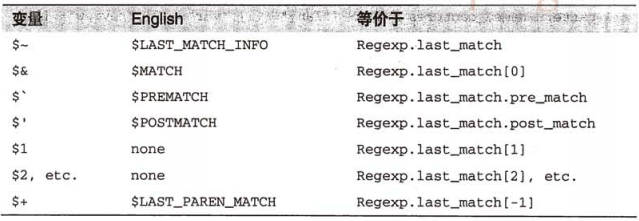

如果把某个MatchData对象赋给`$~`，其他的变量也会改变，其它变量是只读的。这些变量是线程局部并且方法局部的，__无须担心多线程时相互干扰__

#### 用字符串进行模式匹配

可使用一个 __正则表达式进行字符串索引__，它将返回所匹配的那部分文本；如果正则表达式后面还有一个整数参数，它会返回MatchData对象所对应的元素：

<!-- language: !ruby -->

    p "ruby123"[/\d+/]              # "123"
    p "ruby123"[/([a-z]+)(\d+)/,1]  # "ruby"
    p "ruby123"[/([a-z]+)(\d+)/,2]  # "123"

`slice`方法是索引操作符`[]`的同义词方法，`slice!`是它的变体，会改变字符串

<!-- language: !ruby -->

    r = "ruby123"
    p r.slice!(/\d+/), r  # Returns "123", changes r to "ruby"

`split`方法使用正则作为分隔符

<!-- language: !ruby -->

    p "one, two, three".split(/\s*,\s*/) # ["one","two","three"]: space is optional around comma

`index`使用正则来搜索匹配值

<!-- language: !ruby -->

    text = "hello world"
    pattern = /l/
    first = text.index(pattern)       # 2: first match starts at char 2
    n = Regexp.last_match.end(0)      # 3: end position of first match
    second = text.index(pattern, n)   # 3: search again from there
    last = text.rindex(pattern)       # 9: rindex searches backward from end
    p first, n, second, last

#### 搜索并替换
使用`sub`和`gsub`以及变体`sub!`和`gsub!`，后者会修改调用者字符串，如果发生了替换，它们将返回修改的字符串，否则返回`nil`，方便用于`if`的`while`语句中

<!-- language: !ruby -->

    text = "rails is not grails"
    text.gsub!(/\brails\b/, "Rails") # Capitalize the word "Rails" throughout
    p text

如果被替换字符串包含 __反斜杠并且后面是数字__，这个数字将作为`$~`对象的索引，从`MatchData`对象中抽取的文本会取代反斜杠和数字所在位置的文本，`\0`代表所有匹配文本，`\1`匹配第一个子串用于文本替换...

<!-- language: !ruby -->

    text = "this is ruby, Ruby is a programming language"
    p text.gsub(/\bruby\b/i, '<b>\0</b>')

如果用双引号加插值的方式

<!-- language: !ruby -->

    text = "this is ruby, Ruby is a programming language"
    p text.gsub(/\bruby\b/i, "<b>#{$&}</b>")

但不能正确显示，因为插入将在字符串字面量中被执行，而这时它还没有被传递给`gsub`方法，因为这个动作发生在模式匹配发生之前，`$&`这样的变量还没有绑定，要么是前次匹配的值。

Ruby1.9可以用`\k`这样的有名反向引用句法来引用有名捕获分组

<!-- language: !ruby -->

    # Strip pairs of quotes from a string
    re = /(?<quote>['"])(?<body>[^'"]*)\k<quote>/
    puts "These are 'quotes'".gsub(re, '\k<body>')

替换字符串也可引用不在捕获分组中的文本，可以用`\&`,`\'`,`\+`等替换`$&`,`$'`,`$+`等

除了使用静态替换字符串，还可使用代码块

<!-- language: !ruby -->

    # Use consistent capitalization for the names of programming languages
    text = "RUBY Java perl PyThOn"         # Text to modify
    lang = /ruby|java|perl|python/i        # Pattern to match
    text.gsub!(lang) {|l| l.capitalize }   # Fix capitalization
    p text

    text = "'this' is a \"test\""
    pattern = /(['"])([^\1]*)\1/   # Single- or double-quoted string
    text.gsub!(pattern) do
      if ($1 == '"')   # If it was a double-quoted string
        "'#$2'"        # replace with single-quoted
      else             # Otherwise, if single-quoted
        "\"#$2\""      # replace with double-quoted
      end
    end
    p text

#### 正则表达式编码
[参考](#TOC1.2.1)，如果试图匹配的模式与文本编码不兼容，会抛出异常，如果`Regexp`对象的编码不是`ASCII`，`fixed_encoding?`返回`true`，如果返回`false`，可以安全地使用这个模式来匹配为`ASCII`或`ASCII`超集的文本。

## 数字和数学运算
### 数字相关的方法
`Numeric`和其子类定义了很多方法用于判定一个类或数值是否是一个数字，这些方法有些只能用于浮点数，有些只能用于整数

<!-- language: !ruby -->

    # General Predicates
    p 0.zero?        # => true (is this number zero?)
    p 1.0.zero?      # => false
    p 0.0.nonzero?   # => nil (works like false)
    p 1.nonzero?     # => 1 (works like true)
    p 1.integer?     # => true
    p 1.0.integer?   # => false
    #p 1.scalar?      # => true: not a complex number. Ruby 1.9.
    #p 1.0.scalar?    # => true: not a complex number. Ruby 1.9.
    #p Complex(1,2).scalar? # => false: a complex number. require 'complex' in 1.8

    # Integer predicates (Ruby 1.9 and 1.8.7)
    p 0.even?        # => true
    p 0.odd?         # => false

    # Float predicates
    ZERO, INF, NAN = 0.0, 1.0/0.0, 0.0/0.0  # Constants for testing
    p ZERO.finite?   # => true: is this number finite?
    p INF.finite?    # => false
    p NAN.finite?    # => false
    p ZERO.infinite? # => nil: is this number infinite? Positive or negative?
    p INF.infinite?  # => 1
    p -INF.infinite? # => -1
    p NAN.infinite?  # => nil
    p ZERO.nan?      # => false: is this number not-a-number?
    p INF.nan?       # => false
    p NAN.nan?       # => true

`Float`类定义了一些方法用于取整

<!-- language: !ruby -->

    # Rounding methods
    p 1.1.ceil     # =>  2: ceiling: smallest integer >= its argument
    p -1.1.ceil    # => -1: ceiling: smallest integer >= its argument
    p 1.9.floor    # =>  1: floor: largest integer <= its argument
    p -1.9.floor   # => -2: floor: largest integer <= its argument
    p 1.1.round    # =>  1: round to nearest integer
    p 0.5.round    # =>  1: round toward infinity when halfway between integers
    p -0.5.round   # => -1: or round toward negative infinity
    p 1.1.truncate # =>  1: chop off fractional part: round toward zero
    p -1.1.to_i    # => -1: synonym for truncate

    # For any Numeric value n, in Ruby 1.9
    n = -2.0
    p [n.abs, n<=>0]                # Absolute value and sign
    p [n.abs, n.angle]              # Magnitude and angle (or use n.polar)
    p [n.numerator, n.denominator]  # Numerator and denominator
    p [n.real, n.imag]              # Real and imaginary parts

    # Floating point constants: may be implementation dependent
    p [Float::MAX, Float::MIN]      # => [1.79769313486232e+308,2.2250738585072e-308]
    p Float::EPSILON # => 2.22044604925031e-16: difference between adjacent floats

### Math模块
Math模块定义了常量`PI`和`E`、一些三角函数和对数函数的方法及一些杂类方法

<!-- language: !ruby -->

    # Constants
    p Math::PI               # => 3.14159265358979
    p Math::E                # => 2.71828182845905

    # Roots
    p Math.sqrt(25.0)        # => 5.0: square root
    p Math.cbrt(27.0)        # => 3.0: cube root; Ruby 1.9 and later
    p 27.0**(1.0/3.0)        # => 3.0: cube root computed with ** operator

    # Logarithms
    p Math.log10(100.0)      # => 2.0: base-10 logarithm
    p Math.log(Math::E**3)   # => 3.0: natural (base-e) logarithm
    p Math.log2(8)           # => 3.0: base-2 logarithm. Ruby 1.9 and later.
    p Math.log(16, 4)        # => 2.0: 2nd arg to log() is the base. Ruby 1.9.
    p Math.exp(2)            # => 7.38905609893065: same as Math::E**2

    # Trigonometry
    include Math           # Save typing: we can now omit Math prefix.
    p sin(PI/2)              # => 1.0: sine. Argument is in radians, not degrees.
    p cos(0)                 # => 1.0: cosine.
    p tan(PI/4)              # => 1.0: tangent.
    p asin(1.0)/PI           # => 0.5: arcsine. See also acos and atan.
    p sinh(0)                # => 0.0: hyperbolic sine. Also cosh, tanh.
    p asinh(1.0)             # => 0.0: inverse sinh. Also acosh, atanh.

    # Convert cartesian point (x,y) to polar coordinates (theta, r)
    x,y = 1,2
    p theta = atan2(y,x)     # Angle between X axis and line (0,0)-(x,y)
    p r = hypot(x,y)         # Hypotenuse: sqrt(x**2 + y**2)

    # Miscellaneous Functions
    f,e = frexp(1024.0)    # => [0.5, 11]: decompose x into [f,e], x = f*2**e
    p f,e
    p x = ldexp(f, e)        # => 1024: compute x = f*2**e
    p erf(0.0)               # => 0.0: error function
    p erfc(0.0)              # => 1.0: 1-erf(x): complementary error function
    p gamma(5)               # => 24.0: floating-point factorial function
    p lgamma(100)            # => [359.134205369575, 1]: logarithmic gamma

### 数字运算
标准库中的`BigDecimal`类可以用于替代`Float`，当进行金融运算时，避免二进制浮点运算所带来的舍入误差。

<!-- language: !ruby -->

    require "bigdecimal"      # Load standard library
    dime = BigDecimal("0.1")  # Pass a string to constructor, not a Float
    p 4*dime-3*dime == dime   # true with BigDecimal, but false if we use Float

    # Compute monthly interest payments on a mortgage with BigDecimal.
    # Use "Banker's Rounding" mode, and limit computations to 20 digits
    BigDecimal.mode(BigDecimal::ROUND_MODE, BigDecimal::ROUND_HALF_EVEN)
    BigDecimal.limit(20)
    principal = BigDecimal("200000")  # Always pass strings to constructor
    apr = BigDecimal("6.5")           # Annual percentage rate interest
    years = 30                        # Term of mortgage in years
    payments = years*12               # 12 monthly payments in a year
    interest = apr/100/12             # Convert APR to monthly fraction
    x = (interest+1)**payments        # Note exponentiation with BigDecimal

    p monthly = (principal * interest * x)/(x-1)  # Compute monthly payment
    p monthly = monthly.round(2)        # Round to two decimal places
    p monthly = monthly.to_s("f")       # Convert to human-readable string

源代码位于`ext/bigdecimal/bigdecimal_en.html`

### 复数
<!-- language: !ruby -->

    require "complex"           # Ruby 1.8 and for complex Math methods in 1.9
    c = Complex(0.5,-0.2)       # => .5-.2i.
    Complex.polar(1,Math::PI/2) # => Complex(0.0,1.0): create with polar coords
    i = 1.im                    # => Complex(0,1): multiply by i
    (2.re - 3.5.im).to_s        # => "2-3.5i": re method in Ruby 1.9 only
    r,i = c.real, c.imag        # => [0.5,-0.2]: Real part, imaginary part
    m,a = c.polar               # => [magnitude, angle]: Same as [c.abs,c.angle]
    d = c.conj                  # => .5+.2i: change sign of imaginary part
    z = "0+0i".to_c             # String-to-Complex conversion function
    10.times { z = z*z + c }    # Arithmetic operators work on Complex numbers
    1.im**2                     # => Complex(-1,0): i*i == -1
    x = Math.sin(z)             # 'complex' module redefines Math functions
    require 'cmath'             # Ruby 1.9: Define CMath module for complex math
    CMath.sqrt(-1)==Complex::I  # => true

### 实数
标准库中`Rational`类表示一个实数（两个整数之商），它定义了实数的算术运算操作符。最好让它与`mathn`库一起工作，这个库重定义了整数除法，用于创建实数。

<!-- language: !ruby -->

    require "rational"           # Only necessary in Ruby 1.8
    penny = Rational(1, 100)     # A penny is 1/100th
    p nickel = "5/100".to_r      # String-to-Rational conversion: Ruby 1.9 only
    dime = 10.quo 100            # => Rational(1,10)
    change = 2*dime + 3*penny    # => Rational(23,100)
    p change.numerator           # => 23: top of the fraction
    p change.denominator         # => 100: bottom of the fraction
    p change.to_f                # => 0.23: convert to Float
    p (nickel * dime).to_s       # => "1/200": to_s returns fractions

### 向量和矩阵
`matrix`库定义了`Matrix`和`Vector`类，分别代表数字矩阵和向量，以及对它们进行算术运算的操作符。

<!-- language: !ruby -->

    require "matrix"

    # Represent the point (1,1) as the vector [1,1]
    unit = Vector[1,1]

    # The identity transformation matrix
    p identity = Matrix.identity(2)  # 2x2 matrix
    p identity*unit == unit          # true: no transformation

    # This matrix scales a point by sx,sy
    sx,sy = 2.0, 3.0;
    scale = Matrix[[sx,0], [0, sy]]
    p scale*unit             # => [2.0, 3.0]: scaled point

    # This matrix rotates counterclockwise around the origin
    theta = Math::PI/2       # 90 degrees
    rotate = Matrix[[Math.cos(theta), -Math.sin(theta)],
                    [Math.sin(theta),  Math.cos(theta)]]
    p rotate*unit            # [-1.0, 1.0]: 90 degree rotation

    # Two transformations in one
    p scale * (rotate*unit)  # [-2.0, 3.0]

### 随机数
<!-- language: !ruby -->

    p rand       # => 0.964395196505186
    p rand       # => 0.390523655919935
    p rand(100)  # => 81
    p rand(100)  # => 32

如果需要一个可重复的伪随机数序列（也许为了测试），可用一个定值作为种子

<!-- language: !ruby -->

    srand(0)                  # Known seed
    p [rand(100),rand(100)]   # => [44,47]: pseudorandom sequence
    srand(0)                  # Reset the seed to repeat the sequence
    p [rand(100),rand(100)]   # => [44,47]

## 日期和时间
`Time`类用于表示日期和时间，某些系统上，它不能表示1970之前或2038后的日期。在`date`库中的`Date`和`DateTime`类则没有这种限制

### 创建Time对象
<!-- language: !ruby -->

    # Creating Time objects
    p Time.now        # Returns a time object that represents the current time
    p Time.new        # A synonym for Time.now
    p Time.local(2007, 7, 8)          # July 8, 2007
    p Time.local(2007, 7, 8, 9, 10)   # July 8, 2007, 09:10am, local time
    p Time.utc(2007, 7, 8, 9, 10)     # July 8, 2007, 09:10 UTC
    p Time.gm(2007, 7, 8, 9, 10, 11)  # July 8, 2007, 09:10:11 GMT (same as UTC)

### Time对象的属性
<!-- language: !ruby -->

    # One microsecond before the new millennium began in London
    # We'll use this Time object in many examples below.
    t = Time.utc(2000, 12, 31, 23, 59, 59, 999999)

    # Components of a Time
    p t.year    # => 2000
    p t.month   # => 12: December
    p t.day     # => 31
    p t.wday    # => 0: day of week: 0 is Sunday
    p t.yday    # => 366: day of year: 2000 was a leap year
    p t.hour    # => 23: 24-hour clock
    p t.min     # => 59
    p t.sec     # => 59
    p t.usec    # => 999999: microseconds, not milliseconds
    p t.zone    # => "UTC": timezone name

    # Get all components in an array that holds
    # [sec,min,hour,day,month,year,wday,yday,isdst,zone]
    # Note that we lose microseconds
    p values = t.to_a    # => [59, 59, 23, 31, 12, 2000, 0, 366, false, "UTC"]

    # Arrays of this form can be passed to Time.local and Time.utc
    values[5] += 1       # Increment the year
    p Time.utc(*values)  # => Mon Dec 31 23:59:59 UTC 2001

    # Timezones and daylight savings time
    p t.zone       # => "UTC": return the timezone
    p t.utc?       # => true: t is in UTC time zone
    p t.utc_offset # => 0: UTC is 0 seconds offset from UTC
    p t.localtime  # Convert to local timezone. Mutates the Time object!
    p t.zone       # => "PST" (or whatever your timezone is)
    p t.utc?       # => false
    p t.utc_offset # => -28800: 8 hours before UTC
    p t.gmtime     # Convert back to UTC. Another mutator.
    p t.getlocal   # Return a new Time object in local zone
    p t.getutc     # Return a new Time object in UTC
    p t.isdst      # => false: UTC does not have DST. Note no ?.
    p t.getlocal.isdst # => false: no daylight savings time in winter.

    # Weekday predicates: Ruby 1.9
    p t.sunday?    # => true
    p t.monday?    # => false
    p t.tuesday?   # etc.

### 格式化Time对象
<!-- language: !ruby -->

    t = Time.utc(2000, 12, 31, 23, 59, 59, 999999)

    # Formatting Times and Dates
    p t.to_s       # => "Sun Dec 31 23:59:59 UTC 2000": Ruby 1.8
    p t.to_s       # => "2000-12-31 23:59:59 UTC": Ruby 1.9 uses ISO-8601
    p t.ctime      # => "Sun Dec 31 23:59:59 2000": another basic format

    # strftime interpolates date and time components into a template string
    # Locale-independent formatting
    p t.strftime("%Y-%m-%d %H:%M:%S") # => "2000-12-31 23:59:59": ISO-8601 format
    p t.strftime("%H:%M")             # => "23:59": 24-hour time
    p t.strftime("%I:%M %p")          # => "11:59 PM": 12-hour clock

    # Locale-dependent formats
    p t.strftime("%A, %B %d")         # => "Sunday, December 31"
    p t.strftime("%a, %b %d %y")      # => "Sun, Dec 31 00": 2-digit year
    p t.strftime("%x")                # => "12/31/00": locale-dependent format
    p t.strftime("%X")                # => "23:59:59"
    p t.strftime("%c")                # same as ctime

### 解析日期类型
<!-- language: !ruby -->

    # Parsing Times and Dates
    require 'date/format'    # A versatile date/time parsing library
    require 'time'

    datestring = "2001-01-01"
    p d = Date.parse(datestring)   #<Date: 2001-01-01 ((2451911j,0s,0n),+0s,2299161j)>
    p s = d.ctime                  # => "Mon Jan  1 00:00:00 2001"
    p Date.parse(datestring)==d    # => true

    s = "2001-01-01 00:00:00-0500" # midnight in New York
    p v = Date._parse(s)           # => {:zone=>"-0500", :hour=>0, :min=>0, :sec=>0, :year=>2001, :mon=>1, :mday=>1, :offset=>-18000}

### 日期的算术运算与比较
<!-- language: !ruby -->

    # Time arithmetic
    now = Time.now            # Current time
    p past = now - 10         # 10 seconds ago. Time - number => Time
    p future = now + 10       # 10 seconds from now Time + number => Time
    p future - now            # => 10  Time - Time => number of seconds

    # Time comparisons
    p past <=> future         # => -1
    p past < future           # => true
    p now >= future           # => false
    p now == now              # => true

    # Helper methods for working with time units other than seconds
    class Numeric
      # Convert time intervals to seconds
      def milliseconds; self/ 1000.0; end
      def seconds; self; end
      def minutes; self*60; end
      def hours; self*60*60; end
      def days; self*60*60*24; end
      def weeks; self*60*60*24*7; end

      # Convert seconds to other intervals
      def to_milliseconds; self*1000; end
      def to_seconds; self; end
      def to_minutes; self/ 60.0; end
      def to_hours; self/ (60*60.0); end
      def to_days; self/ (60*60*24.0); end
      def to_weeks; self/ (60*60*24*7.0); end
    end

    p expires = now + 10.days     # 10 days from now
    p expires - now               # => 864000.0 seconds
    p (expires - now).to_hours    # => 240.0 hours

    # Time represented internally as seconds since the (platform-dependent) epoch
    p t = Time.now.to_i    # => 1184036194 seconds since epoch
    p Time.at(t)           # => seconds since epoch to Time object
    p t = Time.now.to_f    # => 1184036322.90872: includes 908720 microseconds
    p Time.at(0)           # => Wed Dec 31 16:00:00 -0800 1969: epoch in local time

## 集合
`Array`和`Hash`是Ruby最重要的集合类，标准库中还引入了`Set`类，这些类都混入了`Enumerable`模块。

### Enumerable对象
一般情况下，一个Enumerable方法返回一个集合，这个集合是一个Array对象，不过，__Hash类覆盖了select和reject方法，返回一个Hash对象而非一个数组__

<!-- language: !ruby -->

    h1 = {a: 1, b: 2, c: 3}
    p Hash[*h1.find_all{|k,v| v>1}.flatten]
    p Hash[h1.find_all{|k,v| v>1}]
    p h1.select{|k,v|v>1}

#### 对集合进行迭代和转换

##### each,each_with_index
<!-- language: !ruby -->

    (5..7).each {|x| print x }                 # Prints "567"
    print "\n"
    (5..7).each_with_index {|x,i| print x,i }  # Prints "506172"

Ruby1.9定义了`cycle`迭代器，它重复迭代集合中的每个元素，无限循环一直到给定的代码用`break`,`return`,或抛出异常来明确中止这个迭代。第一次迭代时，`cycle`把所有元素存储在一个数组中，以后的迭代将在数组中进行，意味着即使在第一遍迭代后就改变了集合，也不会影响`cycle`行为。

##### ecah_slice,each_cons
`ecah_slice`,`each_cons`会迭代集合的子数组

<!-- language: !ruby -->

    (1..10).each_slice(4) {|x| print x } # Prints "[1,2,3,4][5,6,7,8][9,10]"

`each_cons`以"滑动窗口"方式进行迭代

<!-- language: !ruby -->

    (1..5).each_cons(3) {|x| print x }   # Prints "[1,2,3][2,3,4][3,4,5]"

##### collect/map
`collect`,`map`同义词，把集合中每个元素映射到一个数组上

<!-- language: !ruby -->

    data = [1,2,3,4]                          # An enumerable collection
    p roots = data.collect {|x| Math.sqrt(x)} # Collect roots of our data
    words = %w[hello world]                   # Another collection
    p upper = words.map {|x| x.upcase }       # Map to uppercase

##### zip
`zip`方法对一个集合用其他零个或多个集合进行插值，并把每组元素（从各个集合取出一个元素）迭代给关联代码块，如果没有代码块，Ruby1.8返回一个数组的数组，Ruby1.9返回一个枚举器对象

<!-- language: !ruby -->

    (1..3).zip([4,5,6]) {|x| print x.inspect } # Prints "[1,4][2,5][3,6]"
    (1..3).zip([4,5,6],[7,8]) {|x| print x}    # Prints "14725836"
    (1..3).zip('a'..'c') {|x,y| print x,y }    # Prints "1a2b3c"
    p (1..3).zip('a'..'z')                     # Prints [[1,"a"],[2,"b"],[3,"c"]]
    p (1..3).zip('a'..'b')                     # Prints [[1,"a"],[2,"b"],[3,nil]]

##### to_a/entries
`to_a`,`entries`同义词，把可枚举的集合转换为一个数组，如果加入`require 'set'`，所有`Enumerable`对象可获得一个`to_set`的转换方法

<!-- language: !ruby -->

    p (1..3).to_a       # => [1,2,3]
    p (1..3).entries    # => [1,2,3]
    require 'set'
    p (1..3).to_set     # => #<Set: {1, 2, 3}>

#### 枚举器和外部迭代器
枚举器是用`Enumerable::Enumerator`类来实现的，通过`to_enum`或它的别名方法`enum_for`来创建一个`Enumerator`对象

<!-- language: !ruby -->

    p [1..10].to_enum              # Uses Range.each
    p "test".enum_for(:each_byte)  # Uses String.each_byte
    p "test".each_byte             # Uses String.each_byte

##### each
`Enumerator`对象是带有`each`方法的`Enumerable`对象，枚举器还可以作为外部迭代器被使用

<!-- language: !ruby -->

    p "Ruby".each_char.max     # => "y"; Enumerable method of Enumerator
    iter = "Ruby".each_char    # Create an Enumerator
    loop { print iter.next }   # Prints "Ruby"; use it as external iterator
    iter.rewind                # Force it to restart now
    print iter.next            # Prints "R" again

##### with_index
对于任意枚举器，可通过`.with_index`获得一个新的枚举器

<!-- language: !ruby -->

    # Print "0:R\n1:u\n2:b\n3:y\n"
    "Ruby".each_char.with_index.each {|c,i| puts "#{i}:#{c}" }

##### to_splat
枚举器定义了一个`to_splat`方法，意味着可以用`*`做枚举器前缀，来并行赋值

<!-- language: !ruby -->

    a,b,c,d = * "Ruby".each_char
    p a,b,c,d

#### 集合排序
##### sort
<!-- language: !ruby -->

    w = ['apple','Beet','carrot'] # A set of words to sort
    p w.sort                         # ['Beet','apple','carrot']: alphabetical
    p w.sort {|a,b| b<=>a }          # ['carrot','apple','Beet']: reverse
    p w.sort {|a,b| a.casecmp(b) }   # ['apple','Beet','carrot']: ignore case
    p w.sort {|a,b| b.size<=>a.size} # ['carrot','apple','Beet']: reverse length

##### sort_by
`sort_by`关联的代码块在每个元素上只执行一次，为每个元素产生一个数值型的“排序键”，然后集合根据这些排序键进行升序排序，所以效率更高

<!-- language: !ruby -->

    # Case-insensitive sort
    words = ['carrot', 'Beet', 'apple']

    # use block
    p words.sort_by {|x| x.downcase}  # => ['apple', 'Beet', 'carrot']

    # use instance method
    p words.sort_by &:downcase        # => ['apple', 'Beet', 'carrot']

    # use global method
    def down(x); x.downcase ; end
    p words.sort_by &method(:down)    # => ['apple', 'Beet', 'carrot']

#### 搜索集合
##### include?/member?
`include?`/`member?`用于查找(使用`==`)等于给定参数的元素

<!-- language: !ruby -->

    primes = [2, 3, 5, 7]
    p primes.include? 2        # => true
    p primes.member? 1         # => false

##### find/detect
`find`/`detect`返回第一个匹配的元素

<!-- language: !ruby -->

    # Find the first subarray that includes the number 1
    data = [[1,2], [0,1], [7,8]]
    p data.find {|x| x.include? 1}     # => [1,2]
    p data.detect {|x| x.include? 3}   # => nil: no such element

##### find_index
`find_index`返回第一个匹配元素的下标

<!-- language: !ruby -->

    data = [[1,2], [0,1], [7,8]]
    p data.find_index [0,1]              # => 1: the second element matches
    p data.find_index {|x| x.include? 1} # => 0: the first element matches
    p data.find_index {|x| x.include? 3} # => nil: no such element

#### 选择子集合
##### select/find_all
`select`/`find_all`，返回所有匹配元素的数组

<!-- language: !ruby -->

    p (1..8).select {|x| x%2==0}    # => [2,4,6,8]: select even elements
    p (1..8).find_all {|x| x%2==1}  # => [1,3,5,7]: find all odd elements

##### reject
`reject`方法与它相反

<!-- language: !ruby -->

    primes = [2,3,5,7]
    p primes.reject {|x| x%2==0}  # => [3,5,7]: reject the even ones

##### partition
如果想同时得到`select`与`reject`结果，可使用`partition`方法，返回两个数组做元素的数组，第一个子数组是`select`的结果，第二个是`reject`的结果

<!-- language: !ruby -->

    p (1..8).partition {|x| x%2==0}  # => [[2, 4, 6, 8], [1, 3, 5, 7]]

##### group_by
`group_by`把代码块结果作为哈希表的主键使用，所有返回值等于主键的元素构成一个数组，作为该主键的值

<!-- language: !ruby -->

    # Group programming languages by their first letter
    langs = %w[ java perl python ruby ]
    groups = langs.group_by {|lang| lang[0] }
    p groups # => {"j"=>["java"], "p"=>["perl", "python"], "r"=>["ruby"]}

##### grep
`grep`返回一个所有匹配给定参数的元素的数组，决定匹配与否的方法是参数的条件相等比较符（`===`），如果参数是正则表达式，会像`collect`一样处理匹配的元素

<!-- language: !ruby -->

    langs = %w[ java perl python ruby ]
    p langs.grep(/^p/)                    # => [perl, python]: start with 'p'
    p langs.grep(/^p/) {|x| x.capitalize} # => [Perl, Python]: fix caps
    data = [1, 17, 3.0, 4]
    p ints = data.grep(Integer)           # => [1, 17, 4]: only integers
    p small = ints.grep(0..9)             # [1,4]: only in range

##### first,take,drop
`first`返回第一个元素，如果给定整形参数n，返回一个包含前n个元素的数组，`take`和`first`相似，但需要一个整形参数，`drop`与`take`相反，返回除了前n元素外所有元素

<!-- language: !ruby -->

    p (1..5).first(2)      # => [1,2]
    p (1..5).take(3)       # => [1,2,3]
    p (1..5).drop(3)       # => [4,5]

##### take_while,drop_while
<!-- language: !ruby -->

    p [1,2,3,nil,4].take_while {|x| x }  # => [1,2,3]: take until nil
    p [nil, 1, 2].drop_while {|x| !x }   # => [1,2]: drop leading nils

#### 集合概要信息
##### max,min
<!-- language: !ruby -->

    p [10, 100, 1].min    # => 1
    p ['a','c','b'].max   # => 'c'
    [10, 'a', []].min   # => ArgumentError: elements not comparable

`min`和`max`接受一个代码块来比较两个元素，还可以使用更简单的`min_by`和`max_by`:

<!-- language: !ruby -->

    langs = %w[java perl python ruby]      # Which has the longest name?
    p langs.max {|a,b| a.size <=> b.size } # => "python": block compares 2
    p langs.max_by {|word| word.length }   # => "python": Ruby 1.9 only

还定义了`minmax`和`minmax_by`同时计算最小和最大值

<!-- language: !ruby -->

    p (1..100).minmax                   # => [1,100] min, max as numbers
    p (1..100).minmax_by {|n| n.to_s }  # => [1,99]  min, max as strings

##### any?,all?
<!-- language: !ruby -->

    c = -2..2
    p c.all? {|x| x>0}    # => false: not all values are > 0
    p c.any? {|x| x>0}    # => true: some values are > 0
    p c.none? {|x| x>2}   # => true: no values are > 2
    p c.one? {|x| x>0}    # => false: more than one value is > 0
    p c.one? {|x| x>2}    # => false: no values are > 2
    p c.one? {|x| x==2}   # => true: one value == 2
    p [1, 2, 3].all?      # => true: no values are nil or false
    p [nil, false].any?   # => false: no true values
    p [].none?            # => true: no non-false, non-nil values

##### count
<!-- language: !ruby -->

    a = [1,1,2,3,5,8]
    p a.count(1)                # => 2: two elements equal 1
    p a.count {|x| x % 2 == 1}  # => 4: four elements are odd

##### inject/reduce
<!-- language: !ruby -->

    # How many negative numbers?
    p (-2..10).inject(0) {|num, x| x<0 ? num+1 : num }  # => 2

    # Sum of word lengths
    p %w[pea queue are].inject(0) {|total, word| total + word.length }  # => 11

如果不带参数，集合的头两个元素被传递给代码块，如果集合只有一个元素，直接返回该元素

<!-- language: !ruby -->

    p sum = (1..5).inject {|total,x| total + x}  # => 15
    p prod = (1..5).inject {|total,x| total * x} # => 120
    p max = [1,3,2].inject {|m,x| m>x ? m : x}   # => 3
    p [1].inject {|total,x| total + x}           # => 1: block never called

可以使用一个符号表示一个方法（或操作符）传给`inject`/`reduce`

<!-- language: !ruby -->

    p sum = (1..5).reduce(:+)                    # => 15
    p prod = (1..5).reduce(:*)                   # => 120
    p letters = ('a'..'e').reduce("-", :concat)  # => "-abcde"

### 数组
#### 创建数组
<!-- language: !ruby -->

    [1,2,3]               # Basic array literal
    []                    # An empty array
    []                    # Arrays are mutable: this empty array is different
    p %w[a b c]           # => ['a', 'b', 'c']: array of words
    p Array[1,2,3]        # => [1,2,3]: just like an array literal

    # Creating arrays with the new() method
    p empty = Array.new             # []: returns a new empty array
    p nils = Array.new(3)           # [nil, nil, nil]: three nil elements
    p copy = Array.new(nils)        # Make a new copy of an existing array
    p zeros = Array.new(4, 0)       # [0, 0, 0, 0]: four 0 elements
    p count = Array.new(3){|i| i+1} # [1,2,3]: three elements computed by block

    # Be careful with repeated objects
    a=Array.new(3,'a')  # => ['a','a','a']: three references to the same string
    a[0].upcase!        # Capitalize the first element of the array
    p a                 # => ['A','A','A']: they are all the same string!
    a=Array.new(3){'b'} # => ['b','b','b']: three distinct string objects
    a[0].upcase!;       # Capitalize the first one
    p a                 # => ['B','b','b']: the others are still lowercase

#### 数组大小和其中的元素
<!-- language: !ruby -->

    # Array length
    p [1,2,3].length     # => 3
    p [].size            # => 0: synonym for length
    p [].empty?          # => true
    p [nil].empty?       # => false
    # [1,2,nil].nitems   # => 2: number of non-nil elements (Ruby 1.8 only)
    p [1,2,nil].count(nil)    # => 1: # of nils (Enumerable method in Ruby 1.9)
    p [1,2,3].count {|x| x>2} # => 1: # of elts matching block (Ruby 1.9)

    # Indexing single elements
    a = %w[a b c d]      # => ['a', 'b', 'c', 'd']
    p a[0]               # => 'a': first element
    p a[-1]              # => 'd': last element
    p a[a.size-1]        # => 'd': last element
    p a[-a.size]         # => 'a': first element
    p a[5]               # => nil: no such element
    p a[-5]              # => nil: no such element
    p a.at(2)            # => 'c': just like [] for single integer argument
    p a.fetch(1)         # => 'b': also like [] and at
    p a.fetch(-1)        # => 'd': works with negative args
    # a.fetch(5)         # => IndexError!: does not allow out-of-bounds
    # a.fetch(-5)        # => IndexError!: does not allow out-of-bounds
    p a.fetch(5, 0)      # => 0: return 2nd arg when out-of-bounds
    p a.fetch(5){|x|x*x} # => 25: compute value when out-of-bounds
    p a.first            # => 'a': the first element
    p a.last             # => 'd': the last element
    p a.sample           # Ruby 1.9: return one element at random
    p a.sample(2)        # Ruby 1.9: return array of n random elements

    # Indexing subarrays
    p a[0,2]             # => ['a','b']: two elements, starting at 0
    p a[0..2]            # => ['a','b','c']: elements with index in range
    p a[0...2]           # => ['a','b']: three dots instead of two
    p a[1,1]             # => ['b']: single element, as an array
    p a[-2,2]            # => ['c','d']: last two elements
    p a[4,2]             # => []: empty array right at the end
    p a[5,1]             # => nil: nothing beyond that
    p a.slice(0..1)      # => ['a','b']: slice is synonym for []
    p a.first(3)         # => ['a','b','c']: first three elements
    p a.last(1)          # => ['d']: last element as an array

    # Extracting arbitrary values
    p a.values_at(0,2)         # => ['a','c']
    p a.values_at(4, 3, 2, 1)  # => [nil, 'd','c','b']
    p a.values_at(0, 2..3, -1) # => ['a','c','d','d']
    p a.values_at(0..2,1..3)   # => ['a','b','c','b','c','d']

#### 改变数组元素
##### 改变元素
<!-- language: !ruby -->

    a = [1,2,3]        # Start with this array
    # Changing the value of elements
    a[0] = 0           # Alter an existing element: a is [0,2,3]
    a[-1] = 4          # Alter the last element: a is [0,2,4]
    a[1] = nil         # Set the 2nd element to nil: a is [0,nil,4]

##### 增加元素
<!-- language: !ruby -->

    a = [1,2,3]        # Start over with this array
    a[3] = 4           # Add a fourth element to it: a is [1,2,3,4]
    a[5] = 6           # We can skip elements: a is [1,2,3,4,nil,6]
    a << 7             # => [1,2,3,4,nil,6,7]
    a << 8 << 9        # => [1,2,3,4,nil,6,7,8,9] operator is chainable
    a = [1,2,3]        # Start over with short array
    a + a              # => [1,2,3,1,2,3]: + concatenates into new array
    a.concat([4,5])    # => [1,2,3,4,5]: alter a in place: note no !

##### 插入元素
<!-- language: !ruby -->

    a = ['a', 'b', 'c']
    a.insert(1, 1, 2)  # a now holds ['a',1,2,'b','c']. Like a[1,0] = [1,2]

##### 删除元素
<!-- language: !ruby -->

    # Removing (and returning) individual elements by index
    a = [1,2,3,4,5,6]
    a.delete_at(4)     # => 5: a is now [1,2,3,4,6]
    a.delete_at(-1)    # => 6: a is now [1,2,3,4]
    a.delete_at(4)     # => nil: a is unchanged

    # Removing elements by value
    a.delete(4)        # => 4: a is [1,2,3]
    a[1] = 1           # a is now [1,1,3]
    a.delete(1)        # => 1: a is now [3]: both 1s removed
    a = [1,2,3]
    a.delete_if {|x| x%2==1} # Remove odd values: a is now [2]
    a.reject! {|x| x%2==0}   # Like delete_if: a is now []

    # Removing elements and subarrays with slice!
    a = [1,2,3,4,5,6,7,8]
    a.slice!(0)        # => 1: remove element 0: a is [2,3,4,5,6,7,8]
    a.slice!(-1,1)     # => [8]: remove subarray at end: a is [2,3,4,5,6,7]
    a.slice!(2..3)     # => [4,5]: works with ranges: a is [2,3,6,7]
    a.slice!(4,2)      # => []: empty array just past end: a unchanged
    a.slice!(5,2)      # => nil: a now holds [2,3,6,7,nil]!

##### 替换元素
<!-- language: !ruby -->

    # Replacing subarrays with []=
    # To delete, assign an empty array
    # To insert, assign to a zero-width slice
    a = ('a'..'e').to_a    # => ['a','b','c','d','e']
    a[0,2] = ['A','B']     # a now holds ['A', 'B', 'c', 'd', 'e']
    a[2...5]=['C','D','E'] # a now holds ['A', 'B', 'C', 'D', 'E']
    a[0,0] = [1,2,3]       # Insert elements at the beginning of a
    a[0..2] = []           # Delete those elements
    a[-1,1] = ['Z']        # Replace last element with another
    a[-1,1] = 'Z'          # For single elements, the array is optional
    a[1,4] = nil           # Ruby 1.9: a now holds ['A',nil]
                           # Ruby 1.8: a now holds ['A']: nil works like []

##### 其它方法
<!-- language: !ruby -->

    # Other methods
    a = [4,5]
    a.replace([1,2,3])     # a now holds [1,2,3]: a copy of its argument
    a.fill(0)              # a now holds [0,0,0]
    a.fill(nil,1,3)        # a now holds [0,nil,nil,nil]
    a.fill('a',2..4)       # a now holds [0,nil,'a','a','a']
    a[3].upcase!           # a now holds [0,nil,'A','A','A']
    a.fill(2..4) { 'b' }   # a now holds [0,nil,'b','b','b']
    a[3].upcase!           # a now holds [0,nil,'b','B','b']
    a.compact              # => [0,'b','B','b']: copy with nils removed
    a.compact!             # Remove nils in place: a now holds [0,'b','B','b']
    a.clear                # a now holds []

#### 对数组进行迭代,搜索和排序
<!-- language: !ruby -->

    a = ['a','b','c']
    a.each {| elt| print elt }         # The basic each iterator prints "abc"
    a.reverse_each {|e| print e}       # Array-specific: prints "cba"
    #a.cycle {|e| print e }            # Ruby 1.9, 1.8.7: print "abcabc..." forever
    a.each_index {|i| print i}         # Array-specific: prints "012"
    a.each_with_index{|e,i| print e,i} # Enumerable: prints "a0b1c2"
    a.map {|x| x.upcase}               # Enumerable: returns ['A','B','C']
    a.map! {|x| x.upcase}              # Array-specific: alters a in place
    a.collect! {|x| x.downcase!}       # collect! is synonym for map!

    # Searching methods
    a = %w[h e l l o]
    a.include?('e')                    # => true
    a.include?('w')                    # => false
    a.index('l')                       # => 2: index of first match
    a.index('L')                       # => nil: no match found
    a.rindex('l')                      # => 3: search backwards
    a.index {|c| c =~ /[aeiou]/}       # => 1: index of 1st vowel. 1.9 and 1.8.7
    a.rindex {|c| c =~ /[aeiou]/}      # => 4: index of last vowel. 1.9 and 1.8.7

    # Sorting
    a.sort     # => %w[e h l l o]: copy a and sort the copy
    a.sort!    # Sort in place: a now holds ['e','h','l','l','o']
    a = [1,2,3,4,5]               # A new array to sort into evens and odds
    a.sort! {|a,b| a%2 <=> b%2}   # Compare elements modulo 2

    # Shuffling arrays: the opposite of sorting; Ruby 1.9 and 1.8.7
    a = [1,2,3]     # Start ordered
    puts a.shuffle  # Shuffle randomly. E.g.: [3,1,2]. Also shuffle!

#### 数组比较
当仅当两个数组具有同样数量的元素，且这些元素具有同样的值，并以相同的顺序出现时，才认为这两个数组是相等的，元素相等性通过`==`来检测。

Array类没有包含Comparable模块，不过它定义了`<=>`操作符，用来定义数组的顺序。这个顺序可以与字符串的顺序做类比

<!-- language: !ruby -->

    p [1,2] <=> [4,5]      # => -1 because 1 < 4
    p [1,2] <=> [0,0,0]    # => +1 because 1 > 0
    p [1,2] <=> [1,2,3]    # => -1 because first array is shorter
    p [1,2] <=> [1,2]      # => 0: they are equal
    p [1,2] <=> []         # => +1 [] always less than a nonempty array

#### 用作栈和队列的数组
<!-- language: !ruby -->

    a = []
    a.push(1)     # => [1]: a is now [1]
    a.push(2,3)   # => [1,2,3]: a is now [1,2,3]
    a.pop         # => 3: a is now [1,2]
    a.pop         # => 2: a is now [1]
    a.pop         # => 1: a is now []
    a.pop         # => nil: a is still []

    a = []
    a.push(1)     # => [1]: a is [1]
    a.push(2)     # => [1,2]: a is [1,2]
    a.shift       # => 1: a is [2]
    a.push(3)     # => [2,3]: a is [2,3]
    a.shift       # => 2: a is [3]
    a.shift       # => 3: a is []
    a.shift       # => nil: a is []

#### 用作集合的数组
使用`&`,`|`,`-`操作符来执行交集、并集、差集操作

<!-- language: !ruby -->

    p [1,3,5] & [1,2,3]           # => [1,3]: set intersection
    p [1,1,3,5] & [1,2,3]         # => [1,3]: duplicates removed
    p [1,3,5] | [2,4,6]           # => [1,3,5,2,4,6]: set union
    p [1,3,5,5] | [2,4,6,6]       # => [1,3,5,2,4,6]: duplicates removed
    p [1,2,3] - [2,3]             # => [1]: set difference
    p [1,1,2,2,3,3] - [2, 3]      # => [1,1]: not all duplicates removed
    small = (0..10).to_a          # A set of small numbers
    even = (0..50).map {|x| x*2}  # A set of even numbers
    smalleven = small & even      # Set intersection
    p smalleven.include?(8)       # => true: test for set membership
    p [1, 1, nil, nil].uniq       # => [1, nil]: remove dups. Also uniq!

计算排列、组合、笛卡尔积

<!-- language: !ruby -->

    a = [1,2,3]

    # Iterate all possible 2-element subarrays (order matters)
    a.permutation(2) {|x| print x }  # Prints "[1,2][1,3][2,1][2,3][3,1][3,2]"

    # Iterate all possible 2-element subsets (order does not matter)
    a.combination(2) {|x| print x }  # Prints "[1, 2][1, 3][2, 3]"

    # Return the Cartesian product of the two sets
    p a.product(['a','b'])       # => [[1,"a"],[1,"b"],[2,"a"],[2,"b"],[3,"a"],[3,"b"]]
    p [1,2].product([3,4],[5,6]) # => [[1,3,5],[1,3,6],[1,4,5],[1,4,6], etc... ]

#### 关联数组方法
使用`assoc`和`rassoc`，可以把数组作为关联数组或哈希表来使用，它的格式是hash.to_a后的形式

<!-- language: !ruby -->

    h = { :a => 1, :b => 2}   # Start with a hash
    a = h.to_a                # => [[:b,2], [:a,1]]: associative array
    p a.assoc(:a)               # => [:a,1]: subarray for key :a
    p a.assoc(:b).last          # => 2: value for key :b
    p a.rassoc(1)               # => [:a,1]: subarray for value 1
    p a.rassoc(2).first         # => :b: key for value 2
    p a.assoc(:c)               # => nil
    p a.transpose               # => [[:a, :b], [1, 2]]: swap rows and cols

#### 数组杂项方法
<!-- language: !ruby -->

    # Conversion to strings
    [1,2,3].join              # => "123": convert elements to string and join
    [1,2,3].join(", ")        # => "1, 2, 3": optional delimiter
    [1,2,3].to_s              # => "[1, 2, 3]" in Ruby 1.9
    [1,2,3].to_s              # => "123" in Ruby 1.8
    [1,2,3].inspect           # => "[1, 2, 3]": better for debugging in 1.8

    # Binary conversion with pack. See also String.unpack.
    [1,2,3,4].pack("CCCC")    # => "\001\002\003\004"
    [1,2].pack('s2')          # => "\001\000\002\000"
    [1234].pack("i")          # => "\322\004\000\000"

    # Other methods
    [0,1]*3                   # => [0,1,0,1,0,1]: * operator repeats
    [1, [2, [3]]].flatten     # => [1,2,3]: recursively flatten; also flatten!
    [1, [2, [3]]].flatten(1)  # => [1,2,[3]]: specify # of levels; Ruby 1.9
    [1,2,3].reverse           # => [3,2,1]: also reverse!
    a=[1,2,3].zip([:a,:b,:c]) # => [[1,:a],[2,:b],[3,:c]]: Enumerable method
    a.transpose               # => [[1,2,3],[:a,:b,:c]]: swap rows/cols

### 哈希表
#### 创建哈希表对象
<!-- language: !ruby -->

    { :one => 1, :two => 2 }  # Basic hash literal syntax
    { :one, 1, :two, 2 }      # Same, with deprecated Ruby 1.8 syntax
    { one: 1, two: 2 }        # Same, Ruby 1.9 syntax. Keys are symbols.
    {}                        # A new, empty, Hash object
    Hash.new                  # => {}: creates empty hash
    Hash[:one, 1, :two, 2]    # => {one:1, two:2}

哈希表字面量作方法调用的最后一个参数时，可以省略两端的花括号

<!-- language: !ruby -->

    puts :a=>1, :b=>2   # Curly braces omitted in invocation
    puts a:1, b:2       # Ruby 1.9 syntax works too

#### 哈希表索引和成员判别
哈希也通过值来查找关联的键，不过如果多个主键有同一个值，会返回任意一个主键

<!-- language: !ruby -->

    h = { :one => 1, :two => 2 }
    h[:one]       # => 1: find value associated with a key
    h[:three]     # => nil: the key does not exist in the hash
    h.assoc :one  # => [:one, 1]: find key/value pair. Ruby 1.9.
    h.index 1     # => :one: search for key associated with a value
    h.index 4     # => nil: no mapping to this value exists
    h.rassoc 2    # => [:two, 2]: key/value pair matching value. Ruby 1.9.

`Hash`的成员判定

<!-- language: !ruby -->

    h = { :a => 1, :b => 2 }

    # Checking for the presence of keys in a hash: fast
    h.key?(:a)       # true: :a is a key in h
    h.has_key?(:b)   # true: has_key? is a synonym for key?
    h.include?(:c)   # false: include? is another synonym

    h.member?(:d)    # false: member? is yet another synonym
    # Checking for the presence of values: slow
    h.value?(1)      # true: 1 is a value in h
    h.has_value?(3)  # false: has_value? is a synonym for value?

`fetch`方法处理默认值

<!-- language: !ruby -->

    h = { :a => 1, :b => 2 }
    p h.fetch(:a)      # => 1: works like [] for existing keys
    p h.fetch(:c)      # Raises IndexError for nonexistent key
    p h.fetch(:c, 33)  # => 33: uses specified value if key is not found
    p h.fetch(:c) {|k| k.to_s } # => "c": calls block if key not found

一次提取多个值用`values_at`

<!-- language: !ruby -->

    h = { :a => 1, :b => 2, :c => 3 }
    p h.values_at(:c)         # => [3]: values returned in an array
    p h.values_at(:a, :b)     # => [1, 2]: pass any # of args
    p h.values_at(:d, :d, :a) # => [nil, nil, 1]

重写了`Enumerable`中的`select`与`reject`方法，返回哈希对象，而不是嵌套数组

<!-- language: !ruby -->

    h = { :a => 1, :b => 2, :c => 3 }
    p h.select {|k,v| v % 2 == 0 }
    p h.reject {|k,v| v % 2 == 0 }

#### 在哈希表对象中存储健和值
##### []=/store
可以使用`[]=`操作符（或同义词`store`）把一个值与哈希对象中的键关联起来

<!-- language: !ruby -->

    h = {}        # Start with an empty hash
    h[:a] = 1     # Map :a=>1.  h is now {:a=>1}
    h.store(:b,2) # More verbose: h is now {:a=>1, :b=>2}

##### replace
如果要用另一个哈希对象替换成新的，使用`replace`，（这样达到引用不变）

<!-- language: !ruby -->

    h = {3=>:c}
    # Replace all of the pairs in h with those from another hash
    h.replace({1=>:a, 2=>:b}) # h is now equal to the argument hash

##### merge,merge!,update
把两个哈希对象合并成一个，合并时可加代码块（传入参数分别是key,oldval,newva;），用以指定如何并合

<!-- language: !ruby -->

    h,j = {:a=>1,:b=>2},{:a=>3,:c=>3}
    # Merge hashes h and j into new hash k.
    # If h and j share keys, use values from j
    p k = h.merge(j)
    p ({:a=>1,:b=>2}.merge(:a=>3,:c=>3))  # => {:a=>3,:b=>2,:c=>3}
    p h.merge!(j)   # Modifies h in place.

    # If there is a block, use it to decide which value to use
    h,j = {:a=>1,:b=>2},{:a=>3,:c=>3}
    p h.merge!(j) {|key,h,j| h }       # Use value from h

    h,j = {:a=>1,:b=>2},{:a=>3,:b=>3}
    p h.merge(j) {|key,h,j| (h+j)/ 2 } # Use average of two values

    # update is a synonym for merge!
    h = {a:1,b:2}     # Using Ruby 1.9 syntax and omitting braces
    p h.update(b:4,c:9) {|key,old,new| old }  # h is now {a:1, b:2, c:9}
    p h.update(b:4,c:9) # h is now {a:1, b:4, c:9}

#### 删除哈希表条目
不能简单的把对应值设为`nil`来删除一个主键，而应该使用`delete`

<!-- language: !ruby -->

    h = {:a=>1, :b=>2}
    h[:a] = nil      # h now holds {:a=> nil, :b=>2 }
    p h.include? :a    # => true
    p h.delete :b      # => 2: returns deleted value: h now holds {:a=>nil}
    p h.include? :b    # => false
    p h.delete :b      # => nil: key not found
    # Invoke block if key not found
    h.delete(:b) {|k| raise IndexError, k.to_s } # IndexError!

可用`delete_if`和`reject!`一次删除哈希对象的多个键/值对

<!-- language: !ruby -->

    h = {:a=>1, :b=>2, :c=>3, :d=>"four"}
    p h.reject! {|k,v| v.is_a? String }  # => {:a=>1, :b=>2, :c=>3 }
    p h.delete_if {|k,v| k.to_s < 'b' }  # => {:b=>2, :c=>3 }
    p h.reject! {|k,v| k.to_s < 'b' }    # => nil: no change
    p h.delete_if {|k,v| k.to_s < 'b' }  # => {:b=>2, :c=>3 }: unchanged hash
    p h.reject {|k,v| true }             # => {}: h is unchanged

可使用`clear`方法删除哈希表中全部键值对，尽管没有以感叹号结尾，但它确定会修改接收者对象本身

<!-- language: !ruby -->

    h = {:a=>1, :b=>2, :c=>3, :d=>"four"}
    h.clear    # h is now {}
    p h

#### 从哈希表中获得数组
<!-- language: !ruby -->

    h = { :a=>1, :b=>2, :c=>3 }
    # Size of hash: number of key/value pairs
    p h.length     # => 3
    p h.size       # => 3: size is a synonym for length
    p h.empty?     # => false
    p ({}.empty?)  # => true

    p h.keys       # => [:b, :c, :a]: array of keys
    p h.values     # => [2,3,1]: array of values
    p h.to_a       # => [[:b,2],[:c,3],[:a,1]]: array of pairs
    p h.flatten    # => [:b, 2, :c, 3, :a, 1]: flattened array. Ruby 1.9
    p h.sort       # => [[:a,1],[:b,2],[:c,3]]: sorted array of pairs
    p h.sort {|a,b| a[1]<=>b[1] } # Sort pairs by value instead of key

#### 哈希表迭代器
Ruby1.8中哈希对象迭代顺序是不确定的，而Ruby1.9中按插入顺序进行迭代

<!-- language: !ruby -->

    h = { :a=>1, :b=>2, :c=>3 }

    # The each() iterator iterates [key,value] pairs
    h.each {|pair| print pair }    # Prints "[:a, 1][:b, 2][:c, 3]"

    # It also works with two block arguments
    h.each do |key, value|
      print "#{key}:#{value} "     # Prints "a:1 b:2 c:3"
    end

    # Iterate over keys or values or both
    h.each_key {|k| print k }      # Prints "abc"
    h.each_value {|v| print v }    # Prints "123"
    h.each_pair {|k,v| print k,v } # Prints "a1b2c3". Like each

尽管`shift`不是迭代器，还是可以用来迭代一个哈希对象的全部键值对，它删除并返回哈希对象的一个元素

<!-- language: !ruby -->

    h = { :a=>1, :b=>2, :c=>3 }
    while not h.empty? do
        p h.shift
    end

#### 默认值
一般情况下，如果某个键没有关联值，查询的时候会返回`nil`

<!-- language: !ruby -->

    empty = {}
    p empty["one"]   # nil

不过，可通过为哈希对象设定一个默认值对这种行为进行修改

<!-- language: !ruby -->

    empty = Hash.new(-1)     # Specify a default value when creating hash
    p empty["one"]           # => -1
    empty.default = -2       # Change the default value to something else
    p empty["two"]           # => -2
    p empty.default          # => -2: return the default value

也可以提供一个代码块来为没有关联值的主键计算值

<!-- language: !ruby -->

    # If the key is not defined, return the successor of the key.
    plus1 = Hash.new {|hash, key| key.succ }
    p plus1[1]            # 2
    p plus1["one"]        # "onf": see String.succ
    plus1.default_proc    # Returns the Proc that computes defaults
    p plus1.default(10)   # => 11: default returned for key 10

当代码块中主键再次被查询时，无需再进行计算，被缓存了

<!-- language: !ruby -->

    # This lazily initialized hash maps integers to their factorials
    fact = Hash.new {|h,k| h[k] = if k > 1 then k*h[k-1] else 1 end }
    p fact      # {}: it starts off empty
    p fact[4]   # 24: 4! is 24
    p fact      # {1=>1, 2=>2, 3=>6, 4=>24}: the hash now has entries

为哈希对象设置`default`会覆盖使用代码块的`Hash.new`构造方法

如果对设置哈希的默认值不感兴趣，不要使用`[]`，可使用[fetch](#TOC1.5.3.2)

<!-- language: !ruby -->

    fact = Hash.new {|h,k| h[k] = if k > 1 then k*h[k-1] else 1 end }
    fact.fetch(5)  # IndexError: key not foun

#### 哈希码,主键相等性,可变主键
如果一个对象想作为哈希对象的主键，必须定义一个`hash`方法，该方法返回一个整形的hashcode。那些没有覆盖`eql?`方法的类可以直接使用`Object`继承而来的`hash`方法，然而，如果定义了自己的`eql?`方法，必须再相应定义一个`hash`方法。

一般情况下，哈希对象使用`eql?`来判定主键的相等性，但Ruby1.9中，可以对哈希对象调用`compare_by_identity`方法，强制它使用`equal?`方法判定主键的相等性，在此之后，`hash`方法将使用`object_id`作为哈希码，一旦如此，则无法使用一个哈希对象返回到普通的相等性测试方法。使用`compare_by_identity?`判定一个哈希对象是使用相等性还是标识符进行比较。

如果使用了可变主键，并修改了其中一个对象，必须调用`rehash`，以确保能正常工作

<!-- language: !ruby -->

    key = {:a=>1}      # This hash will be a key in another hash!
    h = { key => 2 }   # This hash has a mutable key
    p h[key]           # => 2: get value associated with key
    key.clear          # Mutate the key
    p h[key]           # => nil: no value found for mutated key
    h.rehash           # Fix up the hash after mutation
    p h[key]           # => 2: now the value is found again

#### 哈希对象的杂项方法
`invert`将哈希对象的键和值进行转换

<!-- language: !ruby -->

    h = {:a=>1, :b=>2}
    p h.invert        # => {1=>:a, 2=>:b}: swap keys and values

`to_s`返回哈希表的字面量形式

<!-- language: !ruby -->

    p ({:a=>1,:b=>2}.to_s)    # => "a1b2" in Ruby 1.8; "{:a=>1, :b=>2}" in 1.9
    p ({:a=>1,:b=>2}.inspect) # => "{:a=>1, :b=>2}" for both versions

### Set
Set是一组无重复值的集合，与数组不同，集合中的元素没有顺序，sorted set是给元素加入了顺序的集合（不过不能像数组一样进行随机访问）。set特性之一是可以快速完成成员检测、插入和删除的操作

> `SortedSet`继承自`Set`，而且自己没有定义任何新方法，只是保证集合的元素可以用有序的方式被迭代，它不支持用代码块方法式定制集合元素的比较方式，而要求每个集合元素必须支持用默认的`<=>`操作符进行比较。

#### 创建set
set库为`Enumerable`模块加入了一个`to_set`方法，这样可以从任何可枚举的对象来创建集合

<!-- language: !ruby -->

    require 'set'
    p (1..5).to_set              # => #<Set: {5, 1, 2, 3, 4}>
    p [1,2,3].to_set             # => #<Set: {1, 2, 3}>

或者使用`Set.new`

<!-- language: !ruby -->

    require 'set'
    Set.new(1..5)              # => #<Set: {5, 1, 2, 3, 4}>
    Set.new([1,2,3])           # => #<Set: {1, 2, 3}>
    Set.new([1,2,3]) {|x| x+1} # => #<Set: {2, 3, 4}>

或使用`Set`类的`[]`操作符

<!-- language: !ruby -->

    require 'set'
    Set["cow", "pig", "hen"]   # => #<Set: {"cow", "pig", "hen"}>

#### set的测试、比较和联合
<!-- language: !ruby -->

    require 'set'
    s = Set.new(1..3)   # => #<Set: {1, 2, 3}>
    p s.include? 1        # => true
    p s.member? 0         # => false: member? is a synonym

也可以测试一个集合是否是其它集合的子集。

<!-- language: !ruby -->

    require 'set'
    s = Set[2, 3, 5]
    t = Set[2, 3, 5, 7]
    p s.subset? t            # => true
    p t.subset? s            # => false
    p s.proper_subset? t     # => true
    p t.superset? s          # => true
    p t.proper_superset? s   # => true
    p s.subset? s            # => true
    p s.proper_subset? s     # => false

可通过联合两个已有集合来创建新的集合，联合的方式有多种，set定义了`&`,`|`,`-`,`^`来表示它们

<!-- language: !ruby -->

    require 'set'
    # Here are two simple sets
    primes = Set[2, 3, 5, 7]
    odds = Set[1, 3, 5, 7, 9]

    # The intersection is the set of values that appear in both
    p primes & odds             # => #<Set: {5, 7, 3}>
    p primes.intersection(odds) # this is an explicitly named alias

    # The union is the set of values that appear in either
    p primes | odds             # => #<Set: {5, 1, 7, 2, 3, 9}>
    p primes.union(odds)        # an explicitly named alias

    # a-b: is the elements of a except for those also in b
    p primes-odds               # => #<Set: {2}>
    p odds-primes               # => #<Set: {1, 9}>
    p primes.difference(odds)   # A named method alias

    # a^b is the set of values that appear in one set but not both: (a|b)-(a&b)
    p primes ^ odds             # => #<Set: {1, 2, 9}>

#### 增加和删除set元素
`<<`操作符用于向集合增加一个元素

<!-- language: !ruby -->

    require 'set'
    s = Set[]              # start with an empty set
    s << 1                 # => #<Set: {1}>
    s.add 2                # => #<Set: {1, 2}>: add is a synonym for <<
    s << 3 << 4 << 5       # => #<Set: {5, 1, 2, 3, 4}>: can be chained
    s.add 3                # => #<Set: {5, 1, 2, 3, 4}>: value unchanged
    s.add? 6               # => #<Set: {5, 6, 1, 2, 3, 4}>
    s.add? 3               # => nil: the set was not changed

如果想对集合增加多个元素，可用`merge`方法，它接受任何可枚举的对象作为参数，可看成是`union`方法的可变版本

<!-- language: !ruby -->

    require 'set'
    s = (1..3).to_set   # => #<Set: {1, 2, 3}>
    s.merge(2..5)       # => #<Set: {5, 1, 2, 3, 4}>

要删除集合中的元素，可用`delete`或`delete?`方法，它们与`add`或`add?`方法相对应，只是没有等价的操作符

<!-- language: !ruby -->

    require 'set'
    s = (1..3).to_set   # => #<Set: {1, 2, 3}>
    s.delete 1          # => #<Set: {2, 3}>
    s.delete 1          # => #<Set: {2, 3}>: unchanged
    s.delete? 1         # => nil: returns nil when no change
    s.delete? 2         # => #<Set: {3}>: otherwise returns set

一次想删除多个集合元素，可用`subtract`方法，它接受任意可枚举的对象作为参数，看作是`difference`方法的可变版本

<!-- language: !ruby -->

    require 'set'
    s = (1..3).to_set   # => #<Set: {1, 2, 3}>
    s.subtract(2..10)   # => #<Set: {1}>

如果要选择性的从集合中删除元素，可用`delete_if`或`reject!`方法

<!-- language: !ruby -->

    require 'set'
    primes = Set[2, 3, 5, 7]       # set of prime numbers
    primes.delete_if {|x| x%2==1}  # => #<Set: {2}>: remove odds
    primes.delete_if {|x| x%2==1}  # => #<Set: {2}>: unchanged
    primes.reject! {|x| x%2==1}    # => nil: unchanged

    # Do an in-place intersection like this:
    s = (1..5).to_set
    t = (4..8).to_set
    s.reject! {|x| not t.include? x}  # => #<Set: {5, 4}>

`clear`和`replace`

<!-- language: !ruby -->

    require 'set'
    s = Set.new(1..3)   # Initial set
    p s.replace(3..4)   # Replace all elements.  Argument is any enumerable
    p s.clear           # => #<Set: {}>
    p s.empty?          # => true

#### set迭代器
<!-- language: !ruby -->

    require 'set'
    s = Set[1, 2, 3, 4, 5] # => #<Set: {5, 1, 2, 3, 4}>
    s.each {|x| print x }  # prints "51234": arbitrary order before Ruby 1.9
    p s.map! {|x| x*x }      # => #<Set: {16, 1, 25, 9, 4}>
    p s.collect! {|x| x/2 }  # => #<Set: {0, 12, 2, 8, 4}>

#### set杂项方法
`classify`方法接受一个代码块，集合的每个元素被依次传给这个代码块，返回一个哈希表，主键是代码块的返回值，值是对应元素的子集

<!-- language: !ruby -->

    require 'set'
    # Classify set elements as even or odd
    s = (0..3).to_set       # => #<Set: {0, 1, 2, 3}>
    p s.classify {|x| x%2}  # => {0=>#<Set: {0, 2}>, 1=>#<Set: {1, 3}>}

`divide`与类似，但不返回哈希表，而是子集的集合

<!-- language: !ruby -->

    require 'set'
    s = (0..3).to_set     # => #<Set: {0, 1, 2, 3}>
    p s.divide {|x| x%2}  # => #<Set: {#<Set: {0, 2}>, #<Set: {1, 3}>}>

`divide`代码块接受两个参数时，行为完全不同。

<!-- language: !ruby -->

    require 'set'
    s = %w[ant ape cow hen hog].to_set # A set of words
    t = s.divide {|x,y| x[0] == y[0]}  # Divide into subsets by first letter
    p t
    # => #<Set:{#<Set:{"hog", "hen"}>, #<Set:{"cow"}>, #<Set:{"ape", "ant"}>}>

    t.flatten!                         # Flatten the subsets
    p t == s                           # => true

## 文件和目录
File类定义了许多 __类__ 方法，获取给定文件的长度、检测文件的存在及把文件从目录名中剥离出来。Dir类也定义了一些类方法，用于处理文件系统的目录

> Ruby1.9中只要一个对象定义了返回字符串的`to_path`方法，就可以用来表示文件和目录

### 文件和目录名
Ruby使用Unix风格的`/`(File::SEPARATOR)作为目录分隔符，在windows上，也可使用`\`(File::ALT_SEPARATOR)

File类定义了一些操作文件名的方法

<!-- language: !ruby -->

    full = '/home/matz/bin/ruby.exe'
    p file=File.basename(full)     # => 'ruby.exe': just the local filename
    p File.basename(full, '.exe')  # => 'ruby': with extension stripped
    p dir=File.dirname(full)       # => '/home/matz/bin': no / at end
    p File.dirname(file)           # => '.': current directory
    p File.split(full)             # => ['/home/matz/bin', 'ruby.exe']
    p File.extname(full)           # => '.exe'
    p File.extname(file)           # => '.exe'
    p File.extname(dir)            # => ''
    p File.join('home','matz')     # => 'home/matz': relative
    p File.join('','home','matz')  # => '/home/matz': absolute

`File.expand_path`用于把相对路径转换为绝对路径，如果提供了第二个可选参数，它会作为目录叠加到第一个参数前，结果仍然是一个绝对路径

<!-- language: !ruby -->

    p Dir.chdir("/usr/bin")      # Current working directory is "/usr/bin"
    p File.expand_path("ruby")       # => "/usr/bin/ruby"
    p File.expand_path("~/ruby")     # => "/home/david/ruby"
    p File.expand_path("~matz/ruby") # => "/home/matz/ruby"
    p File.expand_path("ruby", "/usr/local/bin") # => "/usr/local/bin/ruby"
    p File.expand_path("ruby", "../local/bin")   # => "/usr/local/bin/ruby"
    p File.expand_path("ruby", "~/bin")          # => "/home/david/bin/ruby"

`File.indentical?`用于判定两个文件名是否指向同一文件（当一个用绝对路径，一个用相对路径，或一个文件名能是另一个文件的符号链接或快捷方式时），只有当两个文件指向同一个文件，且那个文件确实存在时，返回真，且不会像`File.expand_path`那样展开用户主目录符`~`

<!-- language: !ruby -->

    p File.identical?("ruby", "ruby")          # => true if the file exists
    p File.identical?("ruby", "/usr/bin/ruby") # => true if CWD is /usr/bin
    p File.identical?("ruby", "../bin/ruby")   # => true if CWD is /usr/bin
    p File.identical?("ruby", "ruby1.9")       # => true if there is a link

`File.fnmatch`检查一个文件名是否匹配给定的模式，像shell中使用的文件匹配模式。"?"匹配单个字符，"*"匹配任意多的字符，"**"会匹配任意层次的目录，`[]`表示任意一个其中的字符。第三个参数设置为`File::FNM_PATHNAME`，这样可以阻止"*"号匹配"/"目录，如果想查找以"."开头的隐藏文件或目录，应该加上`File::FNM_DOTMATCH`。`File.fnmatch?`是它的同义词方法

<!-- language: !ruby -->

    File.fnmatch("*.rb", "hello.rb")     # => true
    File.fnmatch("*.[ch]", "ruby.c")     # => true
    File.fnmatch("*.[ch]", "ruby.h")     # => true
    File.fnmatch("?.txt", "ab.txt")      # => false
    flags = File::FNM_PATHNAME | File::FNM_DOTMATCH
    File.fnmatch("lib/*.rb", "lib/a.rb", flags)      # => true
    File.fnmatch("lib/*.rb", "lib/a/b.rb", flags)    # => false
    File.fnmatch("lib/**/*.rb", "lib/a.rb", flags)   # => true
    File.fnmatch("lib/**/*.rb", "lib/a/b.rb", flags) # => true

### 列举目录
`Dir.entries`或`Dir.foreach`迭代器

<!-- language: !ruby -->

    # Get the names of all files in the config/ directory
    p filenames = Dir.entries(".")            # Get names as an array
    Dir.foreach(".") {|filename| p filename } # Iterate names

这些方法不会以某种特定方式对返回的文件名进行排序，在返回的文件名中，会包含"."和".."。如果想返回匹配某种模式的文件列表，可用`Dir.[]`操作符

<!-- language: !ruby -->

    Dir['*.data']       # Files with the "data" extension
    Dir['ruby.*']       # Any filename beginning with "ruby."
    Dir['?']            # Any single-character filename
    Dir['*.[ch]']       # Any file that ends with .c or .h
    Dir['*.{java,rb}']  # Any file that ends with .java or .rb
    Dir['*/*.rb']       # Any Ruby program in any direct sub-directory
    Dir['**/*.rb']      # Any Ruby program in any descendant directory

还有更强大的`Dir.glob`方法，它可传入一个代码块，匹配的文件名一个个传给相应代码块来处理，第二个参数是可选的，如果传入`File::FNM_DOTMATCH`常量，那么结果将包含隐藏文件

<!-- language: !ruby -->

    Dir.glob('*.rb') {|f| p f }      # Iterate all Ruby files
    Dir.glob('*')                    # Does not include names beginning with '.'
    Dir.glob('*',File::FNM_DOTMATCH) # Include . files, just like Dir.entries

用`Dir.getwd`,`Dir.chdir`对当前工作目录进行读写

<!-- language: !ruby -->

    puts Dir.getwd          # Print current working directory
    Dir.chdir("..")         # Change CWD to the parent directory
    Dir.chdir("../sibling") # Change again to a sibling directory
    Dir.chdir("/home")      # Change to an absolute directory
    Dir.chdir               # Change to user's home directory
    home = Dir.pwd          # pwd is an alias for getwd

如果`chdir`方法传入一个代码块，在代码块结束后，当前目录将恢复其原始值。尽管只是短时间内对当前目录进行修改，也是全局性的，对其它线程造成影响

### 测试文件
`File`类定义了一系列方法来获得指定文件或目录的元数据，其中不少方法会返回与操作系统相关的底层信息

下面这些简单方法用于返回文件的基本信息，大多数方法返回布尔值

<!-- language: !ruby -->

    f = "/usr/bin/ruby"      # A filename for the examples below

    # File existence and types.
    p File.exist?(f)           # Does the named file exist? Also: File.exists?
    p File.file?(f)            # Is it an existing file?
    p File.directory?(f)       # Or is it an existing directory?
    p File.symlink?(f)         # Either way, is it a symbolic link?

    # File size methods. Use File.truncate to set file size.
    p File.size(f)             # File size in bytes.
    p File.size?(f)            # Size in bytes or nil if empty file.
    p File.zero?(f)            # True if file is empty.

    # File permissions. Use File.chmod to set permissions (system dependent).
    p File.readable?(f)        # Can we read the file?
    p File.writable?(f)        # Can we write the file? No "e" in "writable"
    p File.executable?(f)      # Can we execute the file?
    p File.world_readable?(f)  # Can everybody read it? Ruby 1.9.
    p File.world_writable?(f)  # Can everybody write it? Ruby 1.9.

    # File times/dates. Use File.utime to set the times.
    p File.mtime(f)            # => Last modification time as a Time object
    p File.atime(f)            # => Last access time as a Time object

另一种用于确定文件类型（文件、目录、符号链接等）的方法是`ftype`，返回字符串描述的文件类型

<!-- language: !ruby -->

    p File.ftype("/usr/bin/ruby")    # => "link"
    p File.ftype("/usr/bin/ruby1.9") # => "file"
    p File.ftype("/usr/lib/ruby")    # => "directory"
    p File.ftype("/usr/bin/ruby3.0") # SystemCallError: No such file or directory

如果关注一个文件的多种信息，使用`stat`或`lstat`方法（对于符号链接，前者返回所链接文件的信息，后者返回链接本身的信息），返回一个`File::Stat`对象，这个对象中的实例方法名与`File`的类方法名相同（不过不带参数）

<!-- language: !ruby -->

    p s = File.stat("/usr/bin/ruby")
    p s.file?             # => true
    p s.directory?        # => false
    p s.ftype             # => "file"
    p s.readable?         # => true
    p s.writable?         # => false
    p s.executable?       # => true
    p s.size              # => 5492
    p s.atime             # => Mon Jul 23 13:20:37 -0700 2007

还有一个通用文件测试方法`Kernel.test`，与shell中test保持兼容，它大多数功能已被`File`中的类方法所替代

<!-- language: !ruby -->

    # Testing single files
    test ?e, "/usr/bin/ruby"   # File.exist?("/usr/bin/ruby")
    test ?f, "/usr/bin/ruby"   # File.file?("/usr/bin/ruby")
    test ?d, "/usr/bin/ruby"   # File.directory?("/usr/bin/ruby")
    test ?r, "/usr/bin/ruby"   # File.readable?("/usr/bin/ruby")
    test ?w, "/usr/bin/ruby"   # File.writeable?("/usr/bin/ruby")
    test ?M, "/usr/bin/ruby"   # File.mtime("/usr/bin/ruby")
    test ?s, "/usr/bin/ruby"   # File.size?("/usr/bin/ruby")

    # Comparing two files f and g
    test ?-, f, g              # File.identical(f,g)
    test ?<, f, g              # File(f).mtime < File(g).mtime
    test ?>, f, g              # File(f).mtime > File(g).mtime
    test ?=, f, g              # File(f).mtime == File(g).mtime

### 创建,删除,重命名文件及目录
`File`类没有为创建文件定义特殊的方法，要创建一个文件，可简单的用"写"的方式打开一个文件，写入零个或多个字节，关闭即可

<!-- language: !ruby -->

    # Create (or overwrite) a file named "test"
    File.open("test", "w") {}
    # Create (but do not clobber) a file named "test"
    File.open("test", "a") {}

复制文件使用`File.copy_stream`，改变文件名使用`File.rename`，创建一个符号链接使用`File.symlink`，支持硬连接的系统上可用`File.link`，删除一个文件或链接使用`File.delete`,`File.unlink`，在支持截断的系统中`File.truncate`可用给定字节截取一个文件，`File.utime`可以设置和读取文件的修改时间，用平台相关的`File.chomd`可修改文件的访问权限

<!-- language: !ruby -->

    File.copy_stream("test", "test.backup")
    File.rename("test", "test.old")     # Current name, then new name
    File.symlink("test.old", "oldtest") # Link target, link name
    File.link("test.old", "test2")   # Link target, link name
    File.delete("test2")   # May also be called with multiple args
    File.unlink("oldtest") # to delete multiple named files

    f = "log.messages"          # Filename
    atime = mtime = Time.now    # New access and modify times
    File.truncate(f, 0)         # Erase all existing content
    File.utime(atime, mtime, f) # Change times
    File.chmod(0600, f)         # Unix permissions -rw-------; note octal arg

用`Dir.mkdir`方法创建一个新目录，用`Dir.rmdir`(或同义词`Dir.delete`或`Dir.unlink`)可以删除一个目录，在删除前该目录必须为空

<!-- language: !ruby -->

    Dir.mkdir("temp")                 # Create a directory
    File.open("temp/f", "w") {}       # Create a file in it
    File.open("temp/g", "w") {}       # Create another one
    File.delete(*Dir["temp/*"])       # Delete all files in the directory
    Dir.rmdir("temp")                 # Delete the directory

## 输出输出
一个IO对象就是一个流，它是一个可读的信息源，内容或以是字节、字符、字节或字符的可写池。`File`是`IO`的子类，`IO`对象也表示“标准输入”和“标准输出”流，用于从控制台读入或向控制台写入信息。套接字对象也是IO对象。

### 打开流
在进入输出输出操作之前，首先必须创建一个IO对象，IO类定义了`new`,`open`,`popen`,`pipe`这些工厂方法，不过它们都是与操作系统相关的方法

#### 打开文件
<!-- language: !ruby -->

    f = File.open("data.txt", "r")   # Open file data.txt for reading
    out = File.open("out.txt", "w")  # Open file out.txt for writing

`File.open`第二个参数指定“文件方式”的字符串，它必须是下表中的值，在其后加上"b"可以阻止在Windows平台下对换行符的自动转换。对于文本文件，可为文件方式字符串加上字符编码模式，对于二进制文件，则应该加上":binary"

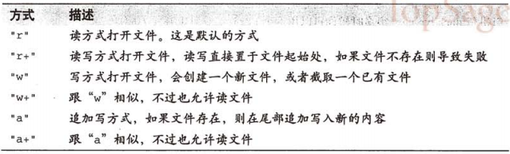

`File.open`可以带一个代码块，用于处理相应的`File`对象，代码块结束后，该对象自动关闭，代码块的返回值成为`File.open`的返回值

<!-- language: !ruby -->

    File.open("log.txt", "a") do |log|      # Open for appending
      log.puts("INFO: Logging a message")   # Output to the file
    end                                     # Automatically closed

#### Kernel.open方法
`Kernel.open`更灵活，如果文件名以`|`打头，它就被视作为一个系统命令，返回的流被读写命令的进程使用。当然它是与平台相关的：

<!-- language: !ruby -->

    # How long has the server been up?
    p uptime = open("|uptime") {|f| f.gets }

如果加载了open-uri，则open还能读取http和ftp的URL，就像打开文件一样

<!-- language: !ruby -->

    require "open-uri"                         # Required library
    f = open("http://www.baidu.com/")  # Webpage as a file
    puts webpage = f.read                      # Read it as one big string
    f.close                                    # Don't forget to close!

如果`open`的参数的对象实现了`to_open`方法，那么该方法将被调用，而且返回一个打开的`IO`对象

#### StringIO类
另一种获得`IO`对象的方法是使用`stringio`库，对字符串进行读写

<!-- language: !ruby -->

    require "stringio"
    input = StringIO.open("now is the time")  # Read from this string
    buffer = ""
    output = StringIO.open(buffer, "w")       # Write into buffer
    output.write("some word")
    p buffer

`StringIO`类并非`IO`的子类，不过它定义的很多方法都与`IO`中定义的相同，由于可以进行duck typing，很多时候可用一个`StringIO`对象替代`IO`对象

#### 预定义流
Ruby预定义了许多流，无须创建或打开就可以直接使用。全局常量`STDIN`,`STDOUT`,`STDERR`分别代表标准输入流、标准输出流和标准错误流。默认情况下，这些流会连接控制台或某种终端窗口中。全局变量`$stdin`,`$stdout`,`$stderr`最初被设为相应流常量的值，像`puts`,`print`默认向`$stdout`输出信息，如果修改这些全局变量的值，这些方法的行为将被改变，不过，真正的"标准输出"仍然可通过`STDOUT`来获得

另一个预定义流是`ARGF`或称为`$<`，用于命令行参数读入。

`DATA`流用于读取Ruby脚本后面出现的文本。

### 流和编码方式
每个流可以有两个关联的编码方式，分别是外部编码和内部编码，分别可以通过`IO`对象的`external_encoding`和`internal_encoding`方法获得。__外部编码__ 指存储在文件中的文本的编码方式，__内部编码__ 指在Ruby中用于表示文本的编码方式。如果外部编码也需要内部编码，那么就无须指定内部编码，从流中读入的字符串会具有与之相关联的外部编码（就像用`String`的`force_encoding`方法那样）；不过，如果想在内部使用不同的编码方式，可以指定一个内部编码方式，这样，在读入文本时，Ruby将从外部编码方式转换为内部编码方式，而在输出文本时，则从内部编码方式转换为外部编码方式。

<!-- language: !ruby -->

    f=open('test.txt','w:gbk:utf-8')
    p f.external_encoding,f.internal_encoding
    f.close

    f=open('test.txt','w:utf-8:gbk')
    p f.external_encoding,f.internal_encoding
    f.close

    f=open('test.txt','w:utf-8')
    p f.external_encoding,f.internal_encoding
    f.close

    f=open('test.txt','w:gbk')
    p f.external_encoding,f.internal_encoding
    f.close

可以用`set_encoding`方法对任何`IO`对象（包括管道和套接字）设定编码，如果给定两个参数，则表明一个是外部编码，另一个是内部编码，也可以用一个字符串来指定两个编码方式，用冒号分隔。一般情况下，一个参数表示外部编码

<!-- language: !ruby -->

    f=open('test.txt','w')
    f.set_encoding("iso-8859-1", "utf-8") # Latin-1, transcoded to UTF-8
    p f.external_encoding,f.internal_encoding
    f.close

    f=open('test.txt','w')
    f.set_encoding("iso-8859-1:utf-8")    # Same as above
    p f.external_encoding,f.internal_encoding
    f.close

    f=open('test.txt','w')
    f.set_encoding("utf-8")               # UTF-8 text
    p f.external_encoding,f.internal_encoding
    f.close

`set_encoding`可以对任何类型`IO`对象使用，但对于文件来说，还是前面的例子更常用

<!-- language: !ruby -->

    in = File.open("data.txt", "r:utf-8");           # Read UTF-8 text
    out = File.open("log", "a:utf-8");               # Write UTF-8 text
    in = File.open("data.txt", "r:iso8859-1:utf-8"); # Latin-1 transcoded to UTF-8

一般不需要对输出流（out）指定两种编码方式，这时，`String`对象指定的内部编码方式被用于写入流

__如果完全不指定任何编码方式，在读入文件时，Ruby将使用默认的外部编码，在写文件或读写管道或套接字时，则默认使用无编码方式（比如ASCII-8BIT/BINARY编码）__

默认外部编码继承自用户的地区设定，经常是多字节编码，因此如果想 __从文件读取二进制的数据，则必须显式指明你需要未编码的字节__，否则会得到默认外部编码方式的字符。要做到这点，可用"r:binary"方式打开文件，也可在打开文件后`set_encoding(Encoding::BINARY)`

<!-- language: !ruby -->

    File.open("data", "r:binary")  # Open a file for reading binary data

在windows平台下，应该用"rb:binary"方式打开二进制文件，或者对流调用`binmode`方法，防止windows对换行符进行转换。

并非每个读取流的方法都使用编码，一些低级的读方法会指定读取字节的个数，这些方法在本质上使用未编码的字节，不过那些不指定读取长度的方法仍然使用编码方式

### 读取流
除非显式指定为只写方式，文件和`StringIO`对象将以读方式打开

#### 读取文本行
<!-- language: ruby -->

    lines = ARGF.readlines         # Read all input, return an array of lines
    line = DATA.readline           # Read one line from stream
    print l while l = DATA.gets    # Read until gets returns nil, at EOF
    DATA.each {|line| print line } # Iterate lines from stream until EOF
    DATA.each_line                 # An alias for each
    DATA.lines                     # An enumerator for each_line: Ruby 1.9

对于这些读取流的方法，`readline`和`gets`方法只在处理`EOF`的方式上有所区别。在流处于`EOF`状态时（可用`eof?`来检测），`gets`方法返回`nil`，而`readline`则抛出`EOFError`异常。如果不知道流有多少行，用`gets`，如果知道那里应该还有一行则用`readline`。

`readline`和`gets`隐式地把全局变量`$_`赋值为返回的文本行，许多全局方法如`print`在没有显式参数的情况下，使用`$_`作为参数，以下等同

<!-- language: !ruby -->

    DATA.each {|line| print line }
    print while DATA.gets

    __END__
    this is data line1
    this is data line2

这些方法一般用于文本流（而非二进制流），返回的文本行是包含换行符的，可使用`String.chomp!`去掉换行符。全局变量`$/`用于存放换行符。如果修改了这个变量，所有读取文本行方法的行为都将被修改。

也可以在这些方法，如`each(sep=$/)`中指定分隔符，如用`nil`则文本行读取整个流内容，将它们作为一行返回。如果用空字符串`""`作为分隔符，会一次读取一段，以空行作分隔。

这些方法可以接受一个可选整数作为第一个参数，或把整数放在分隔符作为第二个参数，表明读取流的最大字节数

文本行读取方法还可追踪它们读入的行号，可用lineno获得或设置最近所读取行号。

<!-- language: ruby -->

    DATA.lineno = 0     # Start from line 0, even though data is at end of file
    DATA.readline       # Read one line of data
    DATA.lineno         # => 1
    $.                  # => 1: magic global variable, implicitly set

#### 读取整个文件
<!-- language: ruby -->

    data = IO.read("data")                    # Read and return the entire file
    data = IO.read("data", mode:"rb")         # Open with mode string "rb"
    data = IO.read("data", encoding:"binary") # Read unencoded bytes
    data = IO.read("data", 4, 2)              # Read 4 bytes starting at byte 2
    data = IO.read("data", nil, 6)            # Read from byte 6 to end-of-file

    # Read lines into an array
    words = IO.readlines("/usr/share/dict/words")

    # Read lines one at a time and initialize a hash
    words = {}
    IO.foreach("/usr/share/dict/words") {|w| words[w] = true}

尽管这些方法被定义在`IO`类中，它们操作的却是文件，而且它们也经常以`File`类方法的方式进行调用。

#### 读取字节和字符
`getc`和`readchar`方法返回长度为1的字符串，当从多字节编码的流读入数据时，有可能返回多个字节。如希望一次读取一个字节，可使用`getbyte`和`readbyte`，`get*`在EOF时返回nil，而`read*`则抛出一个`EOFError`异常

那些一次从流中读取一个字符的程序（比如解析器）有时需要把一个字符推回到流的缓冲区中，让它在下一次读取时返回，可通过`ungetc`实现

<!-- language: ruby -->

    f = File.open("data", "r:binary") # Open data file for binary reads
    c = f.getc                        # Read the first byte as an integer
    f.ungetc(c)                       # Push that byte back
    c = f.readchar                    # Read it back again

另外一种从流中读取字节的方式是使用`each_byte`迭代器

<!-- language: ruby -->

    f.each_byte {|b| ... }      # Iterate through remaining bytes
    f.bytes                     # An enumerator for each_byte: Ruby 1.9
    f.each_char {|c} ...}       # Iterate characters: Ruby 1.9
    f.chars                     # An enumerator for each_char: Ruby 1.9

如果想一次读取多个字节，可以有五种方式供选择

- readbytes(n)
> 精确读取n个字节，并以字符串方式返回，如果需要，在读取完n个字节前，它会阻塞进程，如果在读取n个字节前就出现EOF，会抛出`EOFError`

- readpartial(n,buffer=nil)
> 用于从流中读取1到n个字节，并返回一个新的二进制字符串，或者，如果第二个参数是`String`对象，则把得到的字符串放到这个对象中（原有内容被覆盖）。如果有一个或多个字节可供读取，该方法立即返回这些字节（最大不超过n个）。只在没有字节可读时该方法才会阻塞，如果在调用时出现EOF，会抛出`EOFError`

- read(n=nil,buffer=nil)
> 读取n个字节（如遇EOF，可能比n个少），在n个字节被读入前，有可能阻塞。返回一个新的二进制字符串，有关`buffer`参数同`readpartial`方法。当流处于EOF状态且指定了n，返回nil，如果流处在EOF且省略n（或设为nil），则返回一个空字符串。如果省略n（或设为nil），该方法读取该流所有未读取的内容，并以一个编码的字符串返回，而不是返回一个未编码的字节字符串

- read_nonblock(n,buffer=nil)
> 读取当前可供读取的字节（最多n个），以字符串方式返回，buffer同前，该方法 __不阻塞__，如果没有数据可供读取（比如，当流为套接字或STDIN时），该方法会抛出一个`SystemCallError`异常，如果在调用时处于EOF，抛出`EOFError`

- sysread(n)
> 这个方法与readbytes相似，它是一个低级方法，不使用缓冲区，不要把该方法与任何其他读取行或读取字节方法混用，它们是不兼容的

<!-- language: !ruby -->

    f = File.open("data.bin", "rb:binary")  # No newline conversion, no encoding
    magic = f.readbytes(4)       # First four bytes identify filetype
    exit unless magic == "INTS"  # Magic number spells "INTS" (ASCII)
    bytes = f.read               # Read the rest of the file
                                 # Encoding is binary, so this is a byte string
    data = bytes.unpack("i*")    # Convert bytes to an array of integers

### 写入流
<!-- language: !ruby -->

    o = STDOUT
    # Single-character output
    o.putc(65)         # Write single byte 65 (capital A)
    o.putc("B")        # Write single byte 66 (capital B)
    o.putc("CD")       # Write just the first byte of the string

`IO`类定义了一些其他方法用于写入任意字符串，这些方法在参数数目是否加入换行符方面有所区别，如果指定了编码方式，输出文本将以流的外部编码方式进行编码

<!-- language: !ruby -->

    o = STDOUT
    # String output
    o << x             # Output x.to_s
    o << x << y        # May be chained: output x.to_s + y.to_s
    o.print            # Output $_ + $\
    o.print s          # Output s.to_s + $\
    o.print s,t        # Output s.to_s + t.to_s + $\
    o.printf fmt,*args # Outputs fmt%[args]
    o.puts             # Output newline
    o.puts x           # Output x.to_s.chomp plus newline
    o.puts x,y         # Output x.to_s.chomp, newline, y.to_s.chomp, newline
    o.puts [x,y]       # Same as above
    o.write s          # Output s.to_s, returns s.to_s.length
    o.syswrite s       # Low-level version of write

跟字符串和数组一样，输出流是可追加的，可用`<<`操作符来写入值

### 随机访问方法
有些流（套接字，STDIN）是有序的，一旦进行了读取操作，就无法回头，另一些流（文件，字符串）则允许随机访问，如果在不支持随机访问的流上使用这些方法，得到`SystemCallException`

<!-- language: !ruby -->

    f = File.open("test.txt")
    f.pos        # => 0: return the current position in bytes
    f.pos = 10   # skip to position 10
    f.tell       # => 10: a synonym for pos
    f.rewind     # go back to position 0, reset lineno to 0, also
    f.seek(10, IO::SEEK_SET)  # Skip to absolute position 10
    f.seek(10, IO::SEEK_CUR)  # Skip 10 bytes from current position
    f.seek(-10, IO::SEEK_END) # Skip to 10 bytes from end
    f.seek(0, IO::SEEK_END)   # Skip to very end of file
    f.eof?                    # => true: we're at the end

如果在程序中使用了`sysread`或`syswrite`，则不能使用`seek`，而用`sysseek`，它每次会返回文件的当前位置

<!-- language: !ruby -->

    pos = f.sysseek(0, IO::SEEK_CUR)  # Get current position
    f.sysseek(0, IO::SEEK_SET)        # Rewind stream
    f.sysseek(pos, IO::SEEK_SET)      # Return to original position

### 关闭,清除和测试流
在完成流的读写操作符，必须调用`close`对之时行关闭，这将清空所有输入输出缓冲区，并释放所有占用的操作系统资源。但关联的代码块，会保证流被关闭，即使发生异常

<!-- language: !ruby -->

    File.open("test.txt") do |f|
      # Use stream f here
      # Value of this block becomes return value of the open method
    end # f is automatically closed for us here

    begin
      f = File.open("test.txt")
      # use stream f here
    ensure
      f.close if f
    end

套接字实现使用了`IO`对象，它在内部分别使用进行读写的流，可用`close_read`和`close_write`方法对它们进行关闭，可对一个打开的文件同时进行读写操作，却不能对这些`IO`对象使用`close_read`和`close_write`

出于效率考虑，除`syswrite`，都有缓冲输出，不过有时需要明确清空输出缓冲区，强制立即时行输出

<!-- language: !ruby -->

    out = STDOUT
    out.print 'wait>' # Display a prompt
    out.flush         # Manually flush output buffer to OS
    sleep(1)          # Prompt appears before we go to sleep

    out.sync = true   # Automatically flush buffer after every write
    out.sync = false  # Don't automatically flush
    p out.sync        # Return current sync mode
    p out.fsync       # Flush output buffer and ask OS to flush its buffers
                      # Returns nil if unsupported on current platform

`IO`定义了若干判定方法来检测一个流的状态

<!-- language: !ruby -->

    f.eof?       # true if stream is at EOF
    f.closed?    # true if stream has been closed
    f.tty?       # true if stream is interactive

`tty?`方法，如果流连接的交互设备是终端窗口或键盘，这个方法（可不带问号的别名方法`isatty`）返回`true`，如果流是非交互模式的（文件、管道、套接字）则返回`false`，`tty?`可用于当`STDIN`被重定向到文件时，不再显示提示用户输入的消息。

## 网络
在最底层，网络功能是通过套接字实现的，它是一种IO对象，一旦打开了一个套接字，可以从另外一台计算机中读取数据，也可向它写入数据，就像是对一个文件进行读写一样。

### 一个非常简单的客户端
实现一个Internet Client的应用，必须要用`TCPSocket`类，可通过`TCPSocket.open`或`TCPSocket.new`来实现，第一个参数是连接的主机名，第二个参数是端口号

<!-- language: !ruby -->

    require 'socket'                # Sockets are in standard library
    host, port = ARGV               # Host and port from command line
    s = TCPSocket.open(host, port)  # Open a socket to host and port
    while line = s.gets             # Read lines from the socket
      puts line.chop                # And print with platform line terminator
    end
    s.close                         # Close the socket when done

或使用代码块的方式

<!-- language: !ruby -->

    require 'socket'
    host, port = ARGV
    TCPSocket.open(host, port) do |s| # Use block form of open
      while line = s.gets
        puts line.chop
      end
    end                               # Socket automatically closed

上面的代码只可用于老式的Unix的"daytime"之类的服务，客户端无须发出请求，只是简单的连接服务器，服务器就会返回响应数据。

### 一个非常简单的服务器
使用`TCPServer`类，本质上，一个`TCPServer`对象是产生`TCPSocket`对象的的工厂对象。用给定的端口号调用`TCPServer.open`方法可以创建一个`TCPServer`对象，接着，在返回的`TCPServer`对象上调用`accept`方法，这个方法会等待客户端连接该指定的端口，在连接之后，它返回一个`TCPSocket`对象，表示与所连接客户端的连接。

<!-- language: !ruby -->

    require 'socket'               # Get sockets from stdlib
    server = TCPServer.open(2000)  # Socket to listen on port 2000
    loop {                         # Infinite loop: servers run forever
      client = server.accept       # Wait for a client to connect
      client.puts(Time.now.ctime)  # Send the time to the client
      client.close                 # Disconnect from the client
    }

### 数据报
使用UDP，可以向别的计算机发送单个数据包，可以省去建立永久连接的开销。`send`方法的第二个参数指定发送的标志，即使不须要设置任何标志，这个参数也是必须的。`recvfrom`方法的参数指定我们要接受数据的最大个数。

<!-- language: !ruby -->

    require 'socket'                     # Standard library
    host, port, request = ARGV           # Get args from command line

    ds = UDPSocket.new                   # Create datagram socket
    ds.connect(host, port)               # Connect to the port on the host
    ds.send(request, 0)                  # Send the request text
    response,address = ds.recvfrom(1024) # Wait for a response (1kb max)
    puts response                        # Print the response

服务器代码与客户端一样，也使用`UDPSocket`类，对于基于数据报的服务器，没有一个特殊的`UDPServer`类，它不使用`connect`来连接一个套接字，而是用`bind`方法表明监听的端口，然后，服务器会与客户端一样调用`send`和`recvfrom`方法，不过与客户端的次序相反

<!-- language: !ruby -->

    require 'socket'                     # Standard library
    port = ARGV[0]                       # The port to listen on

    ds = UDPSocket.new                   # Create new socket
    ds.bind(nil, port)                   # Make it listen on the port
    loop do                              # Loop forever
      request,address=ds.recvfrom(1024)  # Wait to receive something
      response = request.upcase          # Convert request text to uppercase
      clientaddr = address[3]            # What ip address sent the request?
      clientname = address[2]            # What is the host name?
      clientport = address[1]            # What port was it sent from
      ds.send(response, 0,               # Send the response back...
              clientaddr, clientport)    # ...where it came from
      # Log the client connection
      puts "Connection from: #{clientname} #{clientaddr} #{clientport}"
    end

### 一个更复杂的客户端
与telnet相似，连接指定的主机和端口，接着循环读入控制台的文本行，把它发送给服务器，然后接收并打印服务器的响应。

<!-- language: !ruby -->

    require 'socket'     # Sockets from standard library

    host, port = ARGV    # Network host and port on command line
    begin                # Begin for exception handling
      # Give the user some feedback while connecting.
      STDOUT.print "Connecting..."      # Say what we're doing
      STDOUT.flush                      # Make it visible right away
      s = TCPSocket.open(host, port)    # Connect
      STDOUT.puts "done"                # And say we did it

      # Now display information about the connection.
      local, peer = s.addr, s.peeraddr
      STDOUT.print "Connected to #{peer[2]}:#{peer[1]}"
      STDOUT.puts " using local port #{local[1]}"

      # Wait just a bit, to see if the server sends any initial message.
      begin
        sleep(0.5)                      # Wait half a second
        msg = s.read_nonblock(4096)     # Read whatever is ready
        STDOUT.puts msg.chop            # And display it
      rescue SystemCallError
        # If nothing was ready to read, just ignore the exception.
      end

      # Now begin a loop of client/server interaction.
      loop do
        STDOUT.print '> '   # Display prompt for local input
        STDOUT.flush        # Make sure the prompt is visible
        local = STDIN.gets  # Read line from the console
        break if !local     # Quit if no input from console

        s.puts(local)       # Send the line to the server
        s.flush             # Force it out

        # Read the server's response and print out.
        # The server may send more than one line, so use readpartial
        # to read whatever it sends (as long as it all arrives in one chunk).
        response = s.readpartial(4096) # Read server's response
        puts(response.chop)            # Display response to user
      end
    rescue           # If anything goes wrong
      puts $!        # Display the exception to the user
    ensure           # And no matter what happens
      s.close if s   # Don't forget to close the socket
    end

### 一个多路服务器
需要同时与多个客户端交互，一种实现方式是使用线程，每个客户端使用一个单独线程，另一种实现则是使用`Kernel.select`方法。

如果一个服务器连接了多个客户端，则不能对某个客户端调用像`gets`那样的阻塞方法。如果它阻塞于等待某个客户端的输入，则不能接收其他客户端的输入，也不能接受新客户端的连接请求。`select`方法则可以解决这个问题，它可以在一组`IO`对象上阻塞，当其中任意一个对象上有活动时就会返回。`select`方法的返回值是一个`IO`对象数组的数组。这个数组的第一个元素是读入数据（或接受请求的连接）的流（本例中是套接字）数组。

`select`方法既可以监控`TCPServer`对象，也可监控`TCPObject`对象。

<!-- language: !ruby -->

    # This server reads a line of input from a client, reverses
    # the line and sends it back. If the client sends the string "quit"
    # it disconnects. It uses Kernel.select to handle multiple sessions.
    require 'socket'

    server = TCPServer.open(2000) # Listen on port 2000
    sockets = [server]            # An array of sockets we'll monitor
    log = STDOUT                  # Send log messages to standard out
    while true                    # Servers loop forever
      ready = select(sockets)     # Wait for a socket to be ready
      readable = ready[0]         # These sockets are readable

      readable.each do |socket|         # Loop through readable sockets
        if socket == server             # If the server socket is ready
          client = server.accept        # Accept a new client
          sockets << client             # Add it to the set of sockets
          # Tell the client what and where it has connected.
          client.puts "Reversal service v0.01 running on #{Socket.gethostname}"
          # And log the fact that the client connected
          log.puts "Accepted connection from #{client.peeraddr[2]}"
        else                            # Otherwise, a client is ready
          input = socket.gets           # Read input from the client

          # If no input, the client has disconnected
          if !input
            log.puts "Client on #{socket.peeraddr[2]} disconnected."
            sockets.delete(socket)      # Stop monitoring this socket
            socket.close                # Close it
            next                        # And go on to the next
          end

          input.chop!                   # Trim client's input
          if (input == "quit")          # If the client asks to quit
            socket.puts("Bye!");        # Say goodbye
            log.puts "Closing connection to #{socket.peeraddr[2]}"
            sockets.delete(socket)      # Stop monitoring the socket
            socket.close                # Terminate the session
          else                          # Otherwise, client is not quitting
            socket.puts(input.reverse)  # So reverse input and send it back
          end
        end
      end
    end

### 抓取Web页面

<!-- language: !ruby -->

    require 'socket'           # We need sockets

    host = 'www.example.com'   # The web server
    port = 80                  # Default HTTP port
    path = "/index.html"       # The file we want

    # This is the HTTP request we send to fetch a file
    request = "GET #{path} HTTP/1.0\r\n\r\n"
    socket = TCPSocket.open(host,port)  # Connect to server
    socket.print(request)               # Send request
    response = socket.read              # Read complete response

    # Split response at first blank line into headers and body
    headers,body = response.split("\r\n\r\n", 2)
    print body                          # And display it

可使用`Net::HTTP`这样的库来处理HTTP协议，下面是另一种实现方式（书上例子有误，本例了修复后的）

<!-- language: !ruby -->

    require 'net/http'         # The library we need

    host = 'www.example.com'   # The web server
    path = '/index.html'       # The file we want
    http = Net::HTTP.new(host) # Create a connection
    response = http.get(path)  # Request the file
    if response.code == "200"  # Check the status code
                               # NOTE: code is not a number!
      print response.body      # Print body if we got it
    else                       # Otherwise
      puts "#{response.code} #{response.message}" # Display error message
    end

类似的库也存在于FTP,SMTP,POP,IMAP协议上。

## 线程和并发

<!-- language: ruby -->

    # Thread #1 is running here
    Thread.new {
      # Thread #2 runs this code
    }
    # Thread #1 runs this code

另外，通过Ruby解释器运行外部进程或创建当前进程的新拷贝，Ruby程序还可以在操作系统层次上获得并发性。不过这样是依赖于操作系统的，查看`Kernel.system`,`Kernel.exec`,`Kernel.fork`,`IO.popen`方法和`Process`模块。

### 线程生命周期
新线程可通过`Thread.new`方法创建，也可以使用同义词`Thread.start/Therad.fork`。在创建线程后无须启动它，将在CPU资源可用时自动启动。调用`Thread.new`会得到一个`Thread`对象，它有许多方法，用于查询和操作运行的线程。

线程将运行`Thread.new`关联代码块中的代码，在运行完后停止，代码块中最后一条语句值成为线程的值，它可以通过`Thread`对象的`value`方法获得。如果一个线程已经运行完成，那么这个值被立刻传给thread的`value`方法，否则，`value`方法被阻塞，直到线程完成。

类方法`Thread.current`返回当前线程对象，`Thread.main`返回主线程，这是Ruby程序启动时初始线程。

#### 主线程
Ruby解析器在主线程完成时会停止运行，即使在主线程创建的线程仍在运行时也是如此，因此，必须保证主线程在其他线程仍在运行时不会结束，可对线程调用`value`方法来等待它结束，如果不关心结程的值，也使用`join`方法。

<!-- language: ruby -->

    # Wait for all threads (other than the current thread and
    # main thread) to stop running.
    # Assumes that no new threads are started while waiting.
    def join_all
      main = Thread.main        # The main thread
      current = Thread.current  # The current thread
      all = Thread.list         # All threads still running
      # Now call join on each thread
      all.each {|t| t.join unless t == current or t == main }
    end

#### 线程和未处理的异常
如果在主线程中抛出异常并没被处理，Ruby解析器将打印一条信息并退出，如果其他线程有未处理异常，那么只有这个线程被停止，默认情况下，解释器不会打印消息或退出。

如果线程t因为一个未处理异常而中止，而另外一个线程s调用了`t.join`或`t.value`方法，那么t中产生的异常将在线程s中被抛出。

如果希望所有线程的未处理异常都使用解释器退出，可使用`Thread.abort_on_exception = true`，如果希望某个特定线程t未处理异常使用得解释器退出，使用`t.abort_on_exception = true`

### 线程和变量
线程的关键特性之一在于它们可以共享变量，但多个线程访问同一个变量时，必须小心处理

<!-- language: ruby -->

    x = 0
    t1 = Thread.new do
      # This thread can query and set the variable x
    end

    t2 = Thread.new do
      # This thread and also query and set x
      # And it can query and set t1 and t2 as well.
    end

#### 线程私有变量
希望线程对一个变量有自己的拷贝，这样对变量的修改不会影响线程的行为，下面代码试图创建三个线程，分别打印1,2,3

<!-- language: !ruby -->

    n = 1
    while n <= 3
      Thread.new { puts n }
      n += 1
    end
    require 'time'
    sleep(1)

在某些实现下，会如愿，但其他一些环境或实现下（如果这些创建的线程不是被立刻执行），代码完全有可能打印出4,4,4。每个线程读取变量n的一个共享拷贝，而这个变量的值在循环执行的过程中被修改。

为了解决这个问题，把n的当前值传给`Thread.new`方法，并且把该值赋给一个代码块参数，代码块参数是代码块私有的，不会被其他线程共享

<!-- language: !ruby -->

    n = 1
    while n <= 3
      # Get a private copy of the current value of n in x
      Thread.new(n) {|x| puts x }
      n += 1
    end
    require 'time'
    sleep(1)

另一个解决方法是使用迭代器取代while循环：

<!-- language: !ruby -->

    1.upto(3) {|n| Thread.new { puts n }}
    require 'time'
    sleep(1)

#### 线程局部变量
一些特殊的Ruby全局变量是 __线程局部__ 的，在不同的线程中它们可能有不同的值，比如`$SAFE`和`$~`，如果两个线程同时时行正则表达式匹配，它们看到的`$~`值是不同的，并且一个线程上执行的匹配不会影响到另一个线程的匹配操作

`Thread`类提供了类似哈希表的行为，定义了`[]`,`[]=`这两个实例方法，它可以把符号关联到任意值上。这些符号所关联的值的行为跟 __局部变量__ 相似，它们不像代码块局部变量那样是私有的，任何变量都可以查询其他线程的相应的值，不过它们也不是共享变量，每个线程都有自己的拷贝。

<!-- language: ruby -->

    Thread.current[:progress] = bytes_received
    total = 0
    download_threads.each {|t| total += t[:progress] if t.key?(:progress)}

### 线程调度
线程共享CPU的过程被称为线程调度，调度可能由Ruby解释器实现，也可能被底层操作系统所处理。

#### 线程优先级
高优先级的线程比低优先级的线程优先调度，一个线程只有在没有更高优先级的线程等待时才可能被CPU执行。

`priority`设置和查询线程的优先级，在线程开始运行前无法设置优先级，不过，可以在第一个动作执行前调高或降低优先级。

新创建线程的优先级与创建它的线程相同，主线程以优先级0启动。

线程优先级也是Ruby实现及底层操作系统相关，比如Linux下，无特权线程不能调高或降低自身优先级，因此Linux下Ruby1.9实现（它使用本地线程），会忽略线程优先级的设置请求。

#### 抢占式与非抢占式调度
当多个同优先级线程必须共享CPU时，线程调度器决定每个线程什么时候执行及执行多久。一些调度器是抢占式的，意味着每个同级别的线程都可以被执行固定的时间；另一种调度器是非抢占式的，一旦一个线程开始运行，除非它睡眠、IO阻塞或有更高优先级的线程醒来，否则它会一直运行下去。

如果一个计算绑定（compute-bound）的线程需要运行很长时间（比如从不出现IO阻塞），那么在一个非阻塞的调度器上，它会让其他线程饥饿，要避免这一问题，耗时的线程就定期调用`Thread.pass`，让别的线程有机会获得CPU

### 线程状态
一个Ruby线程可能有五种状态，两个最值得关注的状态是关于活跃线程的：一个活跃线程可能是 __可运行的(runnable)__，也可能是处于 __休眠的(sleeping)__。一个可运行的线程要么正运行，要么已经准备好下次CPU资源可用时运行；一个休眠线程要么是因为等待IO操作而休眠，要么被自身中止(`Thread.stop`)，线程一般在可运行状态和休眠状态中来回转换。

当一个线程不再活跃时，它可能有两种状态，可能是正常结束(terminated normally)，也可能是异常中止(terminated abnormally with an exception)

最后，还有一个过渡状态，一个被杀死的线程(`Thread.kill`)，在还没有被终止前称 __正在中止(aborting)__

#### 查询线程状态
`Thread`类定义了若干实例方法用于检测线程的状态，当线程处于可运行状态或休眠时，`alive?`返回true，当一个线程处于不可运行状态时，`stop?`返回true，最后`status`方法返回线程的状态。

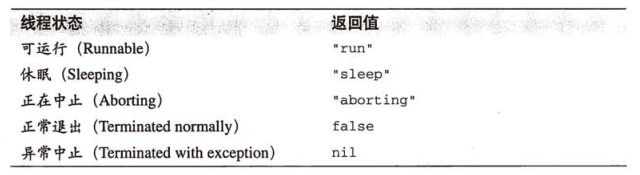

#### 状态转换:暂停,唤醒和杀死
在创建时，线程处于可运行状态，可能被立刻执行，线程可以调用`Thread.stop`方法暂停执行，这将使线程进入休眠状态，这是一个类方法，只对当前线程生效。它有对应的实例方法，因此不能强制其他线程暂停。

调用带参的`Kernel.sleep`方法，线程暂时进入休眠状态，在给定秒数（大约）后重新进入可运行状态，调用阻塞IO方法也会使线程进入休眠状态，直到IO操作完成。

用`Thread.stop`或`Kernel.sleep`方法暂停的线程可以被实例方法`wakeup`和`run`重新激活（即使休眠时间还没到期），这两上方法都能让线程从休眠状态变成可运行状态，`run`方法还会对调度器产生请求，让当前线程放弃对CPU的占用，这样唤醒的线程就可能被立刻执行。`wakeup`方法只是唤醒指定线程，而不会让当前线程放弃CPU。

在线程所在代码块正常结束或异常中止时，线程从可运行状态切换到一种结束状态，另外一种正常结束线程的方式是调用`Thread.exit`方法，在这种方式下，注意在线程结束前所有`ensure`语句将被执行。

线程也可能被另一个线程强行中止，通过被中止线程上调用实例方法`kill`来实现。`terminate`和`exit`是`kill`的同义词方法。这些方法杀死线程置为正常退出状态，被杀死线程在真正结束运行前运行所有`ensure`语句，而`kill!`（及`terminate!`和`exit!`）在杀死线程前不允许执行任何`ensure`语句。

当`raise`时，如果本线程不能处理这个异常，它将进入异常中止状态，`ensure`会被执行。

除非知道一个线程不是正在修改系统的共享状态，否则杀死一个线程是非常危险的，用带`!`的方法来中止线程则更加危险，可能会遗留未关闭的文件、套接字或其他资源。如果一个线程必须退出，最好周期性检查标志变量状态，当安全时再退出。

### 列举线程和线程组
`Thread.list`返回所有活跃线程（运行或休眠）的`Thread`对象数组，当一个线程结束时，它从这个数组中被删除。

如果希望一组线程加入某种次序，可以创建一个`ThreadGroup`对象，并向其中加入线程

<!-- language: ruby -->

    group = ThreadGroup.new
    3.times {|n| group.add(Thread.new { do_task(n) }}

新创建的线程最初被放在父线程所在的线程组中，可用实例方法`group`来查询一个线程所在的`ThreadGroup`。用`ThreadGroup`的`list`方法可以获得一个线程组中线程数组，当然是没有中止的线程。

`ThreadGroup`比一般线程数组更有用的地方在于它的`enclose`方法，一旦一个线程组被enclose，则不能删除也不能新增，但组中线程可能会创建新的线程，作为线程组的成员。如果想在低于`$SAFE`变量所定义的安全级别中运行Ruby代码，并且想跟踪该代码创建的所有线程，一个封闭的`ThreadGroup`会很有用。

### 线程示例
#### 并发读文件
<!-- language: !ruby -->

    # Read files concurrently. Use with the "open-uri" module to fetch URLs.
    # Pass an array of filenames. Returns a hash mapping filenames to content.
    def conread(filenames)
      h = {}                            # Empty hash of results

      # Create one thread for each file
      filenames.each do |filename|      # For each named file
        h[filename] = Thread.new do     # Create a thread, map to filename
          open(filename) {|f| f.read }  # Open and read the file
        end                             # Thread value is file contents
      end

      # Iterate through the hash, waiting for each thread to complete.
      # Replace the thread in the hash with its value (the file contents)
      h.each_pair do |filename, thread|
        begin
          h[filename] = thread.value    # Map filename to file contents
        rescue
          h[filename] = $!              # Or to the exception raised
        end
      end
    end

#### 一个多线程服务器
<!-- language: !ruby -->

    require 'socket'
    # This method expects a socket connected to a client.
    # It reads lines from the client, reverses them and sends them back.
    # Multiple threads may run this method at the same time.
    def handle_client(c)
      while true
        input = c.gets.chop     # Read a line of input from the client
        break if !input         # Exit if no more input
        break if input=="quit"  # or if the client asks to.
        c.puts(input.reverse)   # Otherwise, respond to client.
        c.flush                 # Force our output out
      end
      c.close                   # Close the client socket
    end

    server = TCPServer.open(2000) # Listen on port 2000

    while true                    # Servers loop forever
      client = server.accept      # Wait for a client to connect
      Thread.start(client) do |c| # Start a new thread
        handle_client(c)          # And handle the client on that thread
      end
    end

#### 并发迭代器
`conmap`用于并发的map

<!-- language: !ruby -->

    module Enumerable           # Open the Enumerable module
      def conmap(&block)        # Define a new method that expects a block
        threads = []            # Start with an empty array of threads
        self.each do |item|     # For each enumerable item
          # Invoke the block in a new thread, and remember the thread
          threads << Thread.new { block.call(item) }
        end
        # Now map the array of threads to their values
        threads.map {|t| t.value } # And return the array of values
      end
    end

类似的并发`each`

<!-- language: !ruby -->

    module Enumerable
      def concurrently
        map {|item| Thread.new { yield item }}.each {|t| t.join }
      end
    end
    h = {}
    h.each_pair.concurrently {|*pair| process(pair)}

### 线程互斥和死锁
每个希望访问共享数据的线程必须先对数据进行加锁，锁用`Mutex`（是互斥mutual exclusion缩写）对象表示，要对一个`Mutex`对象加锁，可调用它的`lock`方法，在读取可修改完共享变量时，再调用它的`unlock`方法，如果对一个已加锁的`Mutex`对象调用`lock`方法，在调用者成功获取一个锁之前，该方法会一直阻塞。

通常我们并不显式的调用`lock/unlock`，而使用关联代码块`synchronize`方法

<!-- language: !ruby -->

    require 'thread'  # For Mutex class in Ruby 1.8
    # A BankAccount has a name, a checking amount, and a savings amount.
    class BankAccount
      def init(name, checking, savings)
        @name,@checking,@savings = name,checking,savings
        @lock = Mutex.new         # For thread safety
      end

      # Lock account and transfer money from savings to checking
      def transfer_from_savings(x)
        @lock.synchronize {
          @savings -= x
          @checking += x
        }
      end

      # Lock account and report current balances
      def report
        @lock.synchronize {
          "#@name\nChecking: #@checking\nSavings: #@savings"
        }
      end
    end

#### 死锁
在使用`Mutex`对象进行线程互斥操作时必须小心避免死锁，线程彼此等待其他线程持有的资源时，就会发生死锁。

<!-- language: !ruby -->

    # Classic deadlock: two threads and two locks
    require 'thread'

    m,n = Mutex.new, Mutex.new

    t = Thread.new {
      m.lock
      puts "Thread t locked Mutex m"
      sleep 1
      puts "Thread t waiting to lock Mutex n"
      n.lock
    }

    s = Thread.new {
      n.lock
      puts "Thread s locked Mutex n"
      sleep 1
      puts "Thread s waiting to lock Mutex m"
      m.lock
    }

    t.join
    s.join

避免这种死锁的方法之一是一直按照相同顺序对资源进行加锁操作，如果第二个线程在加锁n之前锁住m，死锁就不会产生了。

即使在不使用`Mutex`对象时，也可能发生死锁，如果某个线程对调用了`Thread.stop`的线程调用`join`方法，除非有第三个线程可以唤醒这个中止的线程，否则，这两个线程会同时死锁。

<!-- language: !ruby -->

    t = Thread.new {
      puts "Thread t run"
      sleep 1
      Thread.stop
    }
    t.join

某些Ruby实现可以检测这样简单的死锁，并抛出错误退出，不过这不受保证。

### Queue和SizedQueue类
标准的线程库定义了专为并发编程设计的`Queue`和`SizedQueue`数据结构，它们实现了线程安全的先进先出队列，可以用于编写 __生产者/消费者__ 模型的程序。

`Queue`适合于并发编程的关键特性在于当队列处于空状态时，`deq`方法会阻塞，直到生产者线程为队列增加一个对象值。`SizedQueue`有最大长度限制，如果队列达到最大长度，那么`enq`方法会阻塞，直到消费者线程从队列中删除一个对象值。可通过`max=`方法来修改它的最大长度。

定义一个并发`inject`。它为可枚举集合的每个元素创建一个线程，并把这个线程应用于一个映射的`Proc`对象。最后一个线程作为消费者，它从队列中删除对象，在它们可用时传给injection的`Proc`对象。

关于map与reduce，尽可能在reduce中抽出可以map的去并发，最后剩下部分下reduce。而reduce时使用生产消费模式

如计算数组中数值的平方和：

<!-- language: !ruby -->

    require 'thread'

    module Enumerable
      # Concurrent inject: expects an initial value and two Procs
      def conject(initial, mapper, injector)
        # Use a Queue to pass values from mapping threads to injector thread
        q = Queue.new
        count = 0                 # How many items?
        each do |item|            # For each item
          Thread.new do           # Create a new thread
            q.enq(mapper[item])   # Map and enqueue mapped value
          end
          count += 1              # Count items
        end
        t = Thread.new do         # Create injector thread
          x = initial             # Start with specified initial value
          while(count > 0)        # Loop once for each item
            x = injector[x,q.deq] # Dequeue value and inject
            count -= 1            # Count down
          end
          x                       # Thread value is injected value
        end
        t.value   # Wait for injector thread and return its value
      end
    end

    a = [-2,-1,0,1,2]
    mapper = lambda {|x| x*x }             # Compute squares
    injector = lambda {|total,x| total+x } # Compute sum
    p a.conject(0, mapper, injector)       # => 10

### 条件变量和队列

使用`ConditionVariable`，以最清晰的方式让一个线程保持等待，直到其他线程通知它可以再次执行为止。`ConditionVariable.new`创建一个对象，用`wait`方法让一个线程等待这个条件，用`signal`方法可以唤醒一个等待线程，用`broadcast`可唤醒所有等待线程。使用它是有一个小技巧：为了让一切正常工作，等待线程必须给`wait`方法传递一个上锁的`Mutex`对象，在这个线程等待过程中，这个`Mutex`对象会暂时解锁，而在线程唤醒生重新上锁。

下面工具类`Exchanger`，假设有线程t1,t2及一个Exchanger对象e。t1调用e.exchange(1)，这个方法在t2调用e.exchange(2)方法之前一直阻塞。第二个线程不会阻塞，它简单返回1（由t1传入），现在，由于第二个线程调用了exchange方法，t1重新被唤醒，并且对exchange方法返回2。

<!-- language: !ruby -->

    require 'thread'

    class Exchanger
      def initialize
        # These variables will hold the two values to be exchanged.
        @first_value = @second_value = nil
        # This Mutex protects access to the exchange method.
        @lock = Mutex.new
        # This Mutex allows us to determine whether we're the first or
        # second thread to call exchange.
        @first = Mutex.new
        # This ConditionVariable allows the first thread to wait for
        # the arrival of the second thread.
        @second = ConditionVariable.new
      end

      # Exchange this value for the value passed by the other thread.
      def exchange(value)
        @lock.synchronize do      # Only one thread can call this method at a time
          if @first.try_lock      # We are the first thread
            @first_value = value  # Store the first thread's argument
            # Now wait until the second thread arrives.
            # This temporarily unlocks the Mutex while we wait, so
            # that the second thread can call this method, too
            @second.wait(@lock)   # Wait for second thread
            @first.unlock         # Get ready for the next exchange
            @second_value         # Return the second thread's value
          else                    # Otherwise, we're the second thread
            @second_value = value # Store the second value
            @second.signal        # Tell the first thread we're here
            @first_value          # Return the first thread's value
          end
        end
      end
    end

Ruby环境
=============
## 执行Ruby解释器
基于C的标准Ruby实现可以通过如下命令行执行：

<!-- language: shell -->

    ruby [options] [--] program [arguments]

options可以是零个或多个命令行参数，它们影响解释器的操作。

program是要运行的Ruby程序文件名，如果文件名是以连字符开头，应使用`--`打头，这样Ruby解释器才不会把它当成一个命令行参数。

arguments可以是任意数量的标识，成为`ARGV`数组的元素。

可以把选项`-W`,`-w`,`-v`,`-d`,`-I`,`-r`,`-K`中任意选项加入RUBYOPT环境变量中，这样每次运行Ruby解释器都会自动应用这些选项。

### 常用选项

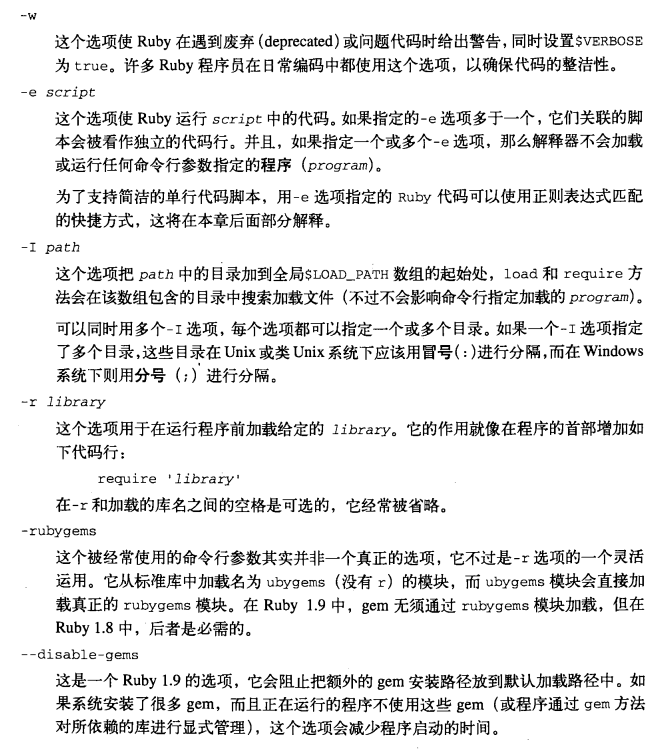

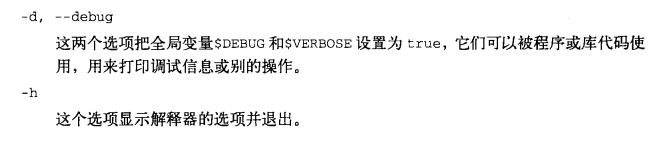

### 警告和信息选项

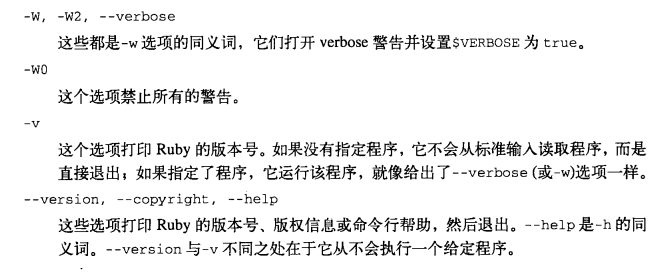

### 编码选项
指定Ruby进程的外部编码方式，也可以为那些没有使用注释指定编码的文件指定一个默认的源代码编码方式。如果没有指定任何选项，默认的外部编码方式会从地区(locale)设置继承而来，而默认的源程序编码则为ASCII，[参考](#TOP1.7.2)

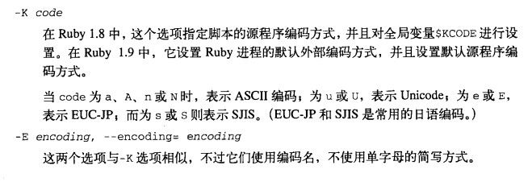

### 文本处理选项
下面的选项会改变Ruby默认的文本处理操作，或者对执行`-e`选项指定的单行脚本有所帮助：

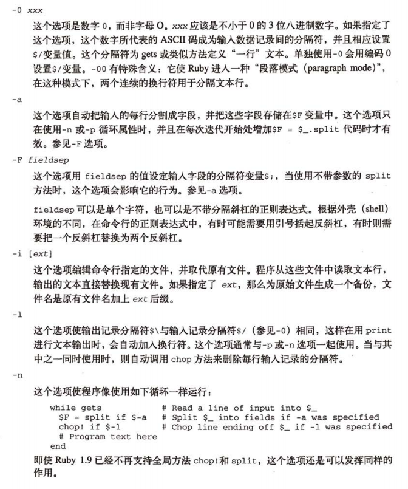

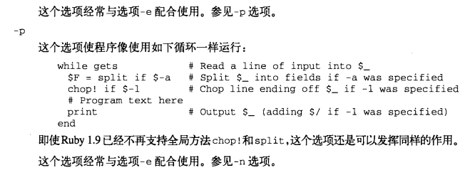

### 杂项选项
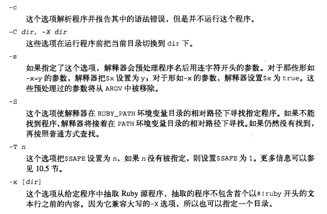

## 顶层环境
当Ruby解释器启动时，它定义一些类、模块、常量、全局变量和全局方法，它们都可以被程序使用。

### 预定义的模块和类

当Ruby1.8解释器启动时，将定义下面的模块：

<!-- language: plain -->

    Comparable    FileTest     Marshal       Precision
    Enumerable    GC           Math          Process
    Errno         Kernel       ObjectSpace   Signal

同时定义下面的类：

<!-- language: plain -->

    Array         File          Method       String
    Bignum        Fixnum        Module       Struct
    Binding       Float         NilClass     Symbol
    Class         Hash          Numeric      Thread
    Continuation  IO            Object       ThreadGroup
    Data          Integer       Proc         Time
    Dir           MatchData     Range        TrueClass
    FalseClass    MatchingData  Regexp       UnboundMethod

以及定义下面的异常类：

<!-- language: plain -->

    ArgumentError      NameError             SignalException
    EOFError           NoMemoryError         StandardError
    Exception          NoMethodError         SyntaxError
    FloatDomainError   NotImplementedError   SystemCallError
    IOError            RangeError            SystemExit
    IndexError         RegexpError           SystemStackError
    Interrupt          RuntimeError          ThreadError
    LoadError          ScriptError           TypeError
    LocalJumpError     SecurityError         ZeroDivisionError

Ruby1.9还会定义下面的模块、类和异常：

<!-- language: plain -->

    BasicObject   FiberError   Mutex         VM
    Fiber         KeyError     StopIteration

通过下面代码在环境中检测预定的模块、类和异常：

<!-- language: !ruby -->

    # Print all modules (excluding classes)
    puts Module.constants.sort.select {|x| eval(x.to_s).instance_of? Module}

    # Print all classes (excluding exceptions)
    puts Module.constants.sort.select {|x|
      c = eval(x.to_s)
      c.is_a? Class and not c.ancestors.include? Exception
    }

    # Print all exceptions
    puts Module.constants.sort.select {|x|
      c = eval(x.to_s)
      c.instance_of? Class and c.ancestors.include? Exception
    }

### 顶级常量
当Ruby解释器启动时，将定义下面的顶层常量，如果一个模块定义了同名的常量，可通过在常量名前面加`::`前缀来访问这些顶级常量。可通过如下方式列出环境中顶级常量：

<!-- language: !ruby -->

    puts Module.constants.sort.reject{|x| eval(x.to_s).is_a? Module}

或命令行方式：

<!-- language: shell -->

    ruby -e 'puts Module.constants.sort.reject{|x| eval(x.to_s).is_a? Module}'

- `ARGF`
> 一个IO对象，它把ARGV中指定的所有文件虚拟连接起来成为一个文件。如果为空，那么表示标准输入，与`%<`同义词

- `ARGV`
> 一个数组，包含所有命令行指定的参数，与`$*`同义词

- `DATA`
> 如果程序文件中包含内容为`__END__`的行（该行只有它），这个常量表示该行后所有文本流。如果程序文件中没有这样的行，那么这个常量未定义。

- `ENV`
> 行为像一个哈希对象，通过它访问解释器中可用的环境变量。

- `FALSE`
> `false`同义词，已废弃

- `NIL`
> `nil`同义词，已废弃

- `RUBY_PATCHLEVEL`
> 用于指示解释器补丁号(patchlevel)的字符串

- `RUBY_PLATFORM`
> 用于指示解释器运行平台的字符串

- `RUBY_RELEASE_DATE`
> 用于指示解释器发布日期的字符串

- `RUBY_VERSION`
> 用于指示解释器支持的Ruby语言版本号的字符串

- `STDERR`
> 标准错误流，是`$stderr`变量的默认值

- `STDIN`
> 标准输入流，是`$stdin`变量的默认值

- `STDOUT`
> 标准输出流，是`$stdout`变量的默认值

- `TOPLEVEL_BINDING`
> 一个`Binding`对象，用于表示顶级范围的绑定

- `TRUE`
> `true`同义词，已废弃

### 全局变量
全局变量，有不少变量有些特殊，如使用标点符号作为变量名，English.rb模块为这些标点符号定义了英语别名，通过`require 'English'`加入。一些变量是只读的，一些是线程局部的，还有一些是方法局部的（包括`$_`,`$~`和继承而来的模式匹配变量）。

<!-- language: shell -->

    ruby -rEnglish -e 'puts global_variables.sort'

#### 全局设置

- `$*`
> `ARGV`常量的只读同义词，在English模块中的同义词是`$ARGV`

- `$$`
> 当前Ruby进程的进程ID，它是只读的，在English模块中的同义词是`$PID`和`$PROCESS_ID`

- `$?`
> 最后一个结束程序的退出状态，只读且线程局部的，在English模块中的同义词是`$CHILD_STATUS`

- `$DEBUG, $-d`
> 如果在命令行中设置了`-d` or `--debug`这两个变量值为true。

- `$KCODE, $-K`
> Ruby1.8中，这个变量是当前文本编码的名称，通过选项`-k`设置，Ruby1.9中变量不再有效，使用它会产生一个警告。

- `$LOADED_FEATURES, $"`
> 一个字符串数组，表示已经加载的文件名，只读的。

- `$LOAD_PATH, $:, $-I`
> 包含一组目录名的字符串数组，在使用`load`和`require`方法加载文件时，会在这些目录下进行查找。变量是只读的，不过可以修改它引用数组的值，如可以在路径前或尾部增加新的目录。

- `$PROGRAM_NAME, $0`
> 表示当前执行的Ruby程序文件名，如果程序是从标准输入设备读入的，它的值则为`-`；如果命令行指定了`-e`选项，则它的值是`e`，注意这个变量与`$FILENAME`是有区别的。

- `$SAFE`
> 当前执行程序的安全级别。这个变量可以在命令行通过`-T`选项设定，它是线程局部的。

- `$VERBOSE, $-v, $-w`
> 如果命令行设置了`-v`,`-w`,`--verbose`那么它们的值为`true`，如果设置了`-W0`则值为`nil`；否则值为`false`。如果设置该变量值为`nil`，则忽略所有警告。

#### 异常处理全局变量
在异常被抛出时，下面两个全局变量在`rescue`子句中很有用：

- `$!`
> 最后抛出的异常对象，也可通过`rescue`子句声明中的`=>`句法获得，这个变量是线程局部的，在English模块中的同义词是`$ERROR_INFO`

- `$@`
> 最后一个异常对象的调用堆栈，等价于`$!.backtrace`，也是线程局部的，在English模块中的同义词是`$ERROR_POSITION`

#### 流和文本处理的全局变量
下面是可以影响`Kernel`模块中文本处理方法默认行为的IO流和变量。

- `$_`
> `Kernel`模块方法`gets`和`readline`所读取的最后一个字符串，线程且方法局部的，不少`Kernel`模块的方法都对`$_`进行隐式调用，在English模块中的同义词是`$LAST_READ_LINE`

- `$<`
> `ARGF`流的一个只读同义词，如果在命令行中指定了多个文件，它就像这些文件连接起来的一个虚拟IO对象；如果没有指定文件，它代表标准输入IO对象。`Kernel`模块的文件读取方法（比如`gets`）从这个流中进行读取。需要注意的是这个流并不总与`$stdin`相同，在English模块中的同义词是`$DEFAULT_INPUT`

- `$stdin`
> 标准输入流，初始值是常量`STDIN`，但更多使用`ARGF` or `$<`进行读取

- `$stdout, $>`
> 标准输出流，是`Kernel`模块中各种打印方法的目标流:`puts`, `print`, `printf`等，在English模块中的同义词是`$DEFAULT_OUTPUT`

- `$stderr`
> 标准输出流，它的初始值是常量`STDERR`

- `$FILENAME`
> ARGF当前所读取的文件名，等价于`ARGF.filename`，它是只读的。

- `$.`
> 从当前输入文件中最后读取的行号，等价于`ARGF.lineno`，在English模块中的同义词是`$INPUT_LINE_NUMBER`

- `$/, $-0`
> 输入记录分隔符（默认是换行符），`gets`和`readline`方法默认使用这个值来确定行边界，可以通过解释器选项`-0`来设置这个值。 在English模块中的同义词是`$RS`和`$INPUT_RECORD_SEPARATOR`

- `$\`
> 输出记录分隔符（默认值是`nil`），可以通过解释器选项`-l`进行设置。如果设置了非nil值，在每次调用`print`(不过其他输出方法不会如此，比如`puts`)后，会打印这个分隔符。在English模块中的同义词是`$ORS`和`$OUTPUT_RECORD_SEPARATOR`

- `$,`
> `print`方法打印输出时各个参数间的分隔符，也是`Array.join`方法的默认分隔符（默认值是`nil`），在English模块中的同义词是`$OFS`和`$OUTPUT_FIELD_SEPARATOR`

- `$;, $-F`
> `split`方法使用的默认字段分隔符（默认值是`nil`），可通过解释器选项`-F`进行设置，在English模块中的同义词是`$FS`和`$FIELD_SEPARATOR`

- `$F`
> 当解释器使用`-a`选项并搭配`-n`或`-p`选项进行启动时，解释器将定义这个变量。它持有当前输入行的各个字段，与对当前行使用`split`方法的返回值一样。

#### 模式匹配的全局变量

- `$~`
> 最后一次模式匹配操作所生成的`MatchData`对象，它是线程局部且方法局部的。下面提到的其他模式匹配全局变量都是从它发展而来的。如果把它设置为一个新的`MatchData`对象，会同时影响其他变量的值，在English模块中的同义词是`$MATCH_INFO`。

- `$&`
> 最近匹配文件，等价于`$~[0]`，只读的，线程且方法局部的，在English模块中的同义词是`$MATCH`

- <code>$`</code>
> 最新匹配文本之前的字符串，等价于`$~.pre_match`，只读的，线程且方法局部的，在English模块中的同义词是`$PREMATCH`

- `$'`
> 最新匹配文本之后的字符串，等价于`$~.post_match`，只读的，线程且方法局部的，在English模块中的同义词是`$POSTMATCH`

- `$+`
> 代表最后一次模式匹配中最后一个成功匹配分组的字符串，只读的，线程且方法局部的，在English模块中的同义词是`$LAST_PAREN_MATCH`

#### 命令行选项全局变量
对应于解释器命令行选项的状态或值，定认了一组全局变量，其中变量`$-0, $-F, $-I, $-K, $-d, $-v, $-w`都有介绍，下面是未介绍的：

- `$-a`
> 如果指定解释器选项`-a`，其值为`true`，否则为`false`，它是只读的。

- `$-i`
> 如果未指定解释器选项`-i，其值为`nil`，否则`-i`所指定的备份文件后缀名。

- `$-l`
> 如果指定解释器选项`-l`，其值为`true`，它是只读的。

- `$-p`
> 如果指定解释器选项`-p`，其值为`true`，否则为`false`，它是只读的。

- `$-W`
> Ruby1.9中，指当前的verbose级别。如果使用`-W0`选项，其值为`0`；如果使用`-w`,`-v`,`--verbose`选项中的任意一个，其值为`2`；否则为`1`。它是只读的。

### 预定义的全局函数
`Object`对象包含的`Kernel`模块中，定义了一组私有实例方法，可以用作全局函数。因为它们都是私有方法，所以必须像函数一样被调用，不能显式指定接收者对象。`Kernel`定义的函数分为若干类：

#### 关键字函数
下面函数行为就像语言的关键字一样：

<!-- language: plain -->

    block_given?    iterator?       loop            require
    callcc          lambda          proc            throw
    catch           load            raise

#### 文本输入输出和操作函数

<!-- language: plain -->

    format          print           puts            sprintf
    gets            printf          readline
    p               putc            readlines

#### OS方法
它们是依赖于所在平台的，<code>`</code>是一个具有特殊名字的backtick方法，它返回任意OS外壳命令的输出文本：

<!-- language: plain -->

    `       fork    select     system     trap
    exec    open    syscall    test

#### 警告,失败和退出
<!-- language: plain -->

    abort   at_exit   exit    exit!   fail    warn

#### 反射函数
<!-- language: plain -->

    binding                         set_trace_func
    caller                          singleton_method_added
    eval                            singleton_method_removed
    global_variables                singleton_method_undefined
    local_variables                 trace_var
    method_missing                  untrace_var
    remove_instance_variable

#### 转换函数
<!-- language: plain -->

    Array   Float   Integer String

#### 杂项Kernel函数
<!-- language: plain -->

    autoload                rand                    srand
    autoload?               sleep

### 用户定义的全局函数
当在类定义或模块定义中使用`def`来定义一个方法时，如果 __不指定__ 方法的接收者对象，这个方法会成为`self`的 __公开实例__ 变量，这里的`self`就是正在定义的类或模块。如果在顶级范围中（在任何类和模块外）使用`def`语句，则有两个区别：顶级方法是`Object`类的实例方法（`self`并非`Object`，而是`main`）；其次，顶级方法总是私有的。通过这种方式，Ruby在一个严格的面向对象框架中仿真了面向过程的样式。

## 实用性信息抽取和报表
### 输入函数
全局函数`gets,readline,readlines`与IO中的同名方法相似，不过它们隐式对`$<`流（也可通过常量ARGF进行访问）进行操作，这些全局函数隐式设置`$_`变量。

`$<`的行为类似于一个IO对象，不过它并非一个真正的IO对象。（它的class返回Object,to_s返回ARGF）这个流的实际行为相当复杂。

- 如果`ARGV`为空，则`$<`与`STDIN`等价，作为标准输入流；
- 如果`ARGV`非空，Ruby会假定它是一组文件名，`$<`就像这些文件的连接体一样，当每一次对`$<`进行读取请求时，Ruby调用`ARGV.shift`方法移除`ARGV`中第一个文件名，然后打开这个文件进行读取，当到达这个文件的尾部时，Ruby重复这个过程，从`ARGV`中移出下一个文件名并打开这个文件，当没有文件时，`$<`报告EOF

### 废弃的文本抽取函数
Ruby1.8及以前版本中，全局函数`chomp, chomp!, chop, chop!, gsub, gsub!,
scan, split, sub, sub!`与`String`中同名方法效果相似，不过它们隐式对`$_`进行操作。这些全局函数在Ruby1.9中删除。

### 报表函数
`puts`会在输出文本尾部没有换行符时增加一个换行符，而`print`不会自动增加一个换行符，但如果设置了输出记录分隔符全局变量`$\`，`print`会自动增加换行符。

全局函数`p`在IO类中没有相似方法，它是为调试所创建的。它调用每个参数的`inspect`方法，并把结果传送给`puts`方法。

使用`pp`替代`p`方法，它对打印大型数组和哈希表很有帮助。

`printf`格式化输出，`sprintf`格式化输出到字符串，它们与`String`类的`%`操作符相似。

### 运行单行脚本的快捷方式
可使用`-e`选项来运行单行Ruby脚本，经常与`-n`,`-p`选项联合使用。如果`-e`指定了单行脚本，而这个脚本中有条件表达式(`if, unluess, while, until`)包含一个正则表达式字面量，那么这个正则表达式隐式与`$_`进行匹配。比如，如果想打印一个文件中所有以字母A开头的行，可以使用如下代码：

<!-- language: shell -->

    ruby -n -e 'print if /^A/' datafile
    ruby -n -e 'print if $_ =~ /^A/' datafile

通过此方式，可以代替许多shell的操作。

## 调用操作系统的功能
Ruby有不少全局函数用于和操作系统交互，可运行程序、创建新进程、处理信息等，有些函数不能在windows平台或非unix平台上实现。

### 调用操作系统命令
<code>Kernel.`</code>方法接受一个代表操作系统外壳命令的字符串参数，它启动一个子外壳并把给定的参数传递给后者，方法的返回值是输出到子外壳标准输出中的文本，通过反引号括起的字符串字面量调用，或者通过%x分隔的字符串字面量调用：

<!-- language: !ruby -->

    os = `uname`             # String literal and method invocation in one
    os = %x{uname}           # Another quoting syntax
    os = Kernel.`("uname")   # Invoke the method explicitly

这个方法并不直接调用给定的可执行命令，而是创建一个外壳来执行命令，这意味着像文件名通配符这样的外壳特性也是可用的：

<!-- language: !ruby -->

    files = `echo *.xml`

启动一个进程并读取输出的另外一种方法是使用`Kernel.open`函数，是`File.open`的一个变体，通常用于打开文件（如果使用`require 'open-uri'`，也可以用于打开HTTP/FTP的URL链接）。不过如果文件名的首字母是管道字符"|"，它打开一个管道对给定的外壳命令进行读取或写入：

<!-- language: !ruby -->

    pipe = open("|echo *.xml")
    files = pipe.readline
    pipe.close

如果想在外壳中执行一个命令但不关心它的输出，可使用`Kernel.system`方法。如果传递多个参数，第一个参数是程序员，其余的参数则成为它的命令行参数，这些参数不会在外壳中被展开。

用于执行任意可执行文件的底层方式是使用`exec`函数，这个函数永远不会返回，它只是用给定的可执行文件取代当前的Ruby过程。通常与`fork`函数配合使用。

### 进程和创建子进程
Ruby中另外一种实现并发性的方式是使用多个Ruby进程，可通过`fork,Process.fork`函数来实现：

<!-- language: !ruby -->

    fork {
      puts "Hello from the child process: #$$"
    }
    puts "Hello from the parent process: #$$"

如果不使用代码块，`fork`行为会有所不同，在父进程中，对`fork`函数的调用会返回一个整数值，它代表新创建的子进程的ID，而在子进程中，同样对`fork`的调用则返回`nil`，这样，上面的代码可用如下实现：

<!-- language: !ruby -->

    pid = fork
    if (pid)
      puts "Hello from parent process: #$$"
      puts "Created child process #{pid}"
    else
      puts "Hello from child process: #$$"
    end

进程和线程的区别在于进程不共享内容，当调用`fork`时，新创建的Ruby进程会精确复制父进程。但是任何对进程状态的修改（通过修改或创建对象实现）都在自身的地址空间中完成，子进程不能修改父进程的数据结构，反之亦然。

如果想让父子进程通信，可使用`open`函数，并用`|-`作为它的第一个参数，这个函数为新创建的Ruby进程打开一个管道，在父进程和子进程中都会把控制权交给`open`所关联的代码块，在子进程中，代码块所接受的参数为`nil`；而在父进程中，代码块接收一个`IO`对象，对这个对象进行读取可以得到子进程所写的数据；而对这个对象写入的数据可以通过子进程的标准输入读出：

<!-- language: !ruby -->

    open("|-", "r+") do |child|
      if child
        # This is the parent process
        child.puts("Hello child")       # Send to child
        response = child.gets           # Read from child
        puts "Child said: #{response}"
      else
        # This is the child process
        from_parent = gets              # Read from parent
        STDERR.puts "Parent said: #{from_parent}"
        puts("Hi Mom!")                 # Send to parent
      end
    end

`Kernel.exec`函数在与`fork`或`open`配合使用时有特别的用途。前面我们看到可以使用<code>`</code>

和`system`向操作系统发送任意的命令，不过这两个方法都是同步方式的，在命令完成前不会返回。如果想在一个单独的进程执行系统命令，首先要使用`fork`来创建子进程，然后调用在子进程中的`exec`来运行命令。它的参数与`system`相同

<!-- language: !ruby -->

    open("|-", "r") do |child|
      if child
        # This is the parent process
        files = child.readlines   # Read the output of our child
        child.close
      else
        # This is the child process
        exec("/bin/ls", "-l")     # Run another executable
      end
    end

### 捕获信号
绝大多数操作系统支持对当前运行的进程发送异步信号，当用户键入Ctrl-C来中止一个程序时，所发生的事情就是异步信号的一个例子。大多数外壳程序在接收到Ctrl-C后，将发送一个名为"SIGINT"用于中断运行的信号，该信号默认的处理方式是中止程序，Ruby允许程序捕获信号并定义自己的信号处理程序。通过`Kernel.trap,Signal.trap`实现的。如果不想让用户使用Ctrl-C退出程序，可编写如下代码：

<!-- language: !ruby -->

    trap "SIGINT" {
      puts "Ignoring SIGINT"
    }

如果只是想简单忽略一个信号，可用字符串"IGNORE"作为第二个参数，如果"DEFAULT"则表示恢复默认处理方式。

在一个长时间运行的程序（比如服务器），有时需要定义一个信号处理方法完成诸如重新读取配置文件、输出信息到日志文件或进入调试模式的功能，在类Unix的操作系统上，我们通常使用SIGUSR1和SIGUSR2信号来达到这样的目的。

### 结束程序
`exit`函数是最直接的，它抛出一个`SystemExit`异常，如果该异常没被捕获，则退出程序，不过退出前，`END`块及在`Kernel.at_exit`注册的方法被执行。

`abort`函数向标准输出流打印指定的错误信息，然后调用`exit(1)`。

`fail`是`raise`同义词方法。

`warn`函数向标准错误流打印一个警告消息，不会抛出异常或退出程序。

## 安全
安全体系由两个部分构成，第一个部分是从非受信或 __污染数据__ 中识别安全数据的机制；第二个部分是一种 __受限运行__ 的技术，允许锁定Ruby环境，并防止Ruby解释器在污染的数据中执行有潜在危险的操作。这可以防止类似SQL注入，或无须担心执行非受信代码会删除文件。

### 可污染的数据
在源程序中的字面量是不可污染的，而从外部环境中继承来的对象是可污染的，这包括从命令行读入的字符串(`ARGV`)或环境变量(`ENV`)，以及从文件、套接字或其他流读入的数据。环境变量PATH是一个特例：它只有在包含一个或多个处处可写的目录时才是可污染的。重要的是，污染性是可传染的，从可污染对象继承来的对象也中可污染的。

`Object`的方法`taint`,`tainted?`,`untaint`，分别表示把一个不可污染的对象标记成可污染的，还可以检测一个对象的可污染性，以及一个可污染的标记成不可污染的。

### 受限执行和安全级别
Ruby可以在开启安全检测的情况下执行程序，全局变量`$SAFE`用于确定安全检查的级别。默认的安全级别一般是0，但是运行setuid,setgid的Ruby程序安全级别默认为1（unix术语，表示一个程序运行于高于调用者的权限上）。用命令行选项`-T`来显式指定安全级别，也可通过对`$SAFE`赋值来设置安全级别，不过我们只能增加它的值，永远不可能降低

<!-- language: ruby -->

    $SAFE=1                # upgrade the safe level
    $SAFE=4                # upgrade the safe level even higher
    $SAFE=0                # SecurityError!  you can't do it

`$SAFE`是线程局部的，通过这一特性，线程可以变成执行非可信代码的沙箱：

<!-- language: ruby -->

    Thread.start {     # Create a "sandbox" thread
      $SAFE = 4        # Restrict execution in this thread only
      ...              # Untrusted code can be run here
    }

Ruby安全模型不像Java安全模型那样久经考验。

#### 安全级别0
默认的，不对可污染数据进行检查。

#### 安全级别1
使用可污染数据的潜在危险操作是被禁止的，不能对可污染的字符串进行求值；如果一个库名是可污染的，不能对它进行require；如果一个文件名是可污染的，不能打开该文件；如果主机名是可污染的，不能通过网络连接它。

允许任意输入的程序，尤其联网的服务器程序，应该使用这个安全级别，有助于发现那些通过不安全方式使用可污染数据的错误。

如果编写一个执行潜在危险操作的库，比如与一个数据库服务器交互的库，那么须检查`$SAFE`的值，如果它的值为1或更高，库不应该对可污染的对象进行操作，如SQL查询的字符串是可污染的，不应该把它发送给数据库服务器。

对程序执行的限制如下：

- 在启动时会忽略环境变量`RUBYLIB`和`RUBYOPT`
- 在`$LOAD_PATH`中不包括当前目录(.)。
- 禁止使用命令行参数`-e, -i, -I, -r, -s, -S, -X`
- `Dir, IO, File, FileTest`中有可污染参数的实例方法和类方法被禁用
- 不能用可污染的参数调用`test, eval, require, load, trap`

#### 安全级别2
系统既限制级别1上的那些对可污染数据的操作，还对文件和进程的操作进行了限制，不管它们是不是可污染的。

很少有理由把程序的安全级别设置为2，不过系统管理员可以用这个安全级别限制程序不能创建或删除目录、改变文件权限、执行应用程序、从处处可写的目录中加载Ruby代码等。

在这级别，被系统限制的方法有：

<!-- language: plain -->

    Dir.chdir               File.truncate           Process.egid=
    Dir.chroot              File.umask              Process.fork
    Dir.mkdir               IO.fctrl                Process.kill
    Dir.rmdir               IO.ioctl                Process.setpgid
    File.chmod              Kernel.exit!            Process.setpriority
    File.chown              Kernel.fork             Process.setsid
    File.flock              Kernel.syscall
    File.lstat              Kernel.trap

#### 安全级别3
包含所有安全级别2的限制，所有的对象（包括源程序中的字面量，但不包括全局环境中预定义的对象），创建时都是可污染的，同时，`untaint`方法是禁用的。

通常不使用。

#### 安全级别4
继承自安全级别3，并阻止对任何不可污染对象的修改（包括对不可污染对象执行`taint`操作）。在这一级别运行的程序不能修改任何全局环境，也不能修改任何在前面低安全级别上创建的不可污染对象。

实际上创建了一个沙箱，那些不可信的代码可以运行，但不会造成任何危害。

在安全级别1，2，3上，都禁止对可污染的字符串执行`eval`语句，不过在安全级别4上，它又被允许了，因为此级别足够严格，对字符串的求值不会带来任何危害：

<!-- language: !ruby -->

    def safe_eval(str)
      Thread.start {            # Start sandbox thread
        $SAFE = 4               # Upgrade safe level
        eval(str)               # Eval in the sandbox
      }.value                   # Retrieve result
    end

不能使用`require`语句，只能用包装的方式使用`load`，即第二个参数为`true`，使Ruby把加载的文件放入一个由匿名模块构成的沙箱中，这样它定义的类、模块和常量不会影响全局命名空间。意味着程序可以加载外部模块定义的类和模块，但不能使用它们（那么加载有何意义？）

还可以更进一步限制第4级别的安全沙箱，把沙箱线程(在设置$SAFE变量前)放入一个`ThreadGroup`中，然后在这个线程组内部进行调用。

下面的操作是被禁止的：

- `require`,无包装的`load`,`autoload`和`include`
- 修改`Object`类
- 修改不可污染的类或模块
- 元编程方法
- 操作非当前线程
- 访问线程局部数据
- 中止进程
- 文件输入/输出
- 修改当前环境变量
- 用`srand`设置随机数生成器的种子
