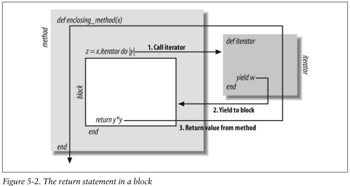
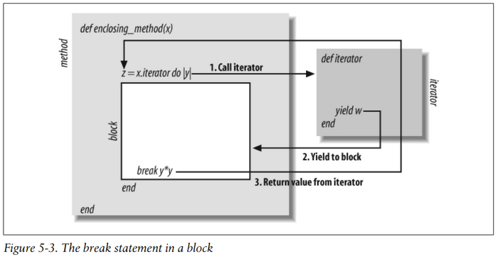
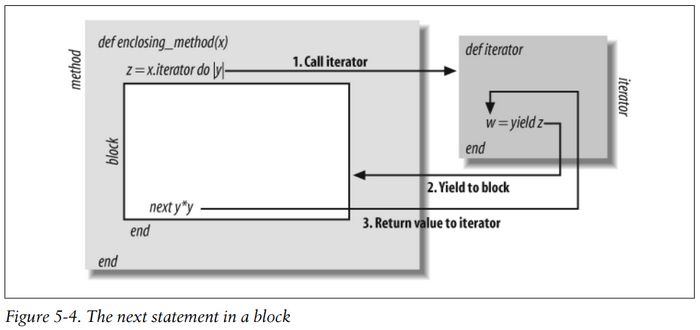
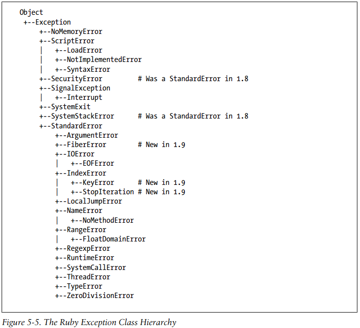

> 2012-12-18

导言
=====

## 漫游Ruby

### Ruby是面向对象的
Ruby是完全面向对象的，每个值都是对象，即使简单的数值字面量，以及true、false和nil也如此

<!-- language: !ruby -->

    p 1.class     # Fixnum
    p 0.0.class   # Float
    p true.class  # TrueClass
    p false.class # FalseClass
    p nil.class   # NilClass

Ruby中函数和方法调用后面的圆括号是可选的，并且一般都被省略掉，尤其在调用那些不带参数的方法时更是如此。这些调用更像是对对象的命名字字段或变量名的引用，但实际上对象之外根本没办法直接访问对象内部状态，而是通过 __访问器(accessor)__进行的。正是因为括号可以省略（以及其它特性），使所它适合做DSL语言

### 代码块和迭代器
Ruby中经常这么干

<!-- language: !ruby -->

    3.times {print "Ruby! "} # "Ruby! Ruby! Ruby! "
    1.upto(9) {|x| print x}  # "123456789"

`times`和`upto`是由整数对象实现的方法，它们是一种被称为 __迭代器(iterator)__ 的特殊方法，其行为类似于循环。包含在花括号的代码被称为 __代码块(block)__，它们与方法调用相关联并且充当了循环体的角色。

除了整数以外，还有其他一些对象也具有迭代器方法。数组(以及类似的"可枚举的"对象)定义了一个名为`each`的迭代器，它为数组里的每一个元素调用一次相关联的代码块，每次代码块的调用都以数组里的一个元素作为参数

<!-- language: !ruby -->

    a = [3, 2, 1]
    a[3] = a[2] - 1
    a.each do |elt|
      print elt + 1
    end

其它各种有用的迭代器都是在each的基础之上的定义的

<!-- language: !ruby -->

    a = [1,2,3,4]
    p a.map{|x| x*x}
    p a.select {|x| x%2==0}
    p(a.inject do |sum,x|
      sum + x
    end)

与数组类似，hash是Ruby里的基础数据结构

<!-- language: !ruby -->

    h = {
      :one => 1,
      :two => 2
    }
    h[:three] = 3
    h.each do |k,v|
      print "#{k}:#{v}; "
    end

Ruby的hash可以使用任何对象作为键，但是 __符号(symbol)__ 对象最为常用，它是不可变的、功能受限的字符串。

将一个代码块和一个方法调用相关联的能力是Ruby的一个基本且非常强大的特性，除了用在类似循环构造里，对那些仅用调用代码块的一次方法来说，这一特性同样有帮助

<!-- language: !ruby -->

    File.open("data", 'w') { |f| f.write("line1\nline2") }
    File.open("data", 'r') do |f|
      f.each_line {|line| puts line}
    end

    t = Thread.new do
      p File.read("data")
    end

    sleep(1)

### 表达式和操作符
Ruby的语法是 __面向表达式__ 的，诸如if之类的控制结构在其他语言里被称为语句，但在Ruby里，它们其实是表达式，它们是 __有值的__，我们可以这样编写代码

<!-- language: ruby -->

    mininum = if x < y then x else y end

虽然Ruby中所有“语句”实际上都是表达式，但它们并不会都返回有意义的值，比如，虽然while循环和方法定义都是表达式，但它们在正常情况下都返回nil

常用操作符

<!-- language: !ruby -->

    p 2 ** 8                    # 2 to the power 8
    p "Ruby! " * 3              # string repetiton
    p "%d %s" % [3,"rubies"]    # python-style, printf formatting

许多Ruby操作符都是作为方法来实现的，而且类可以按照它们的需要来定义（或重定义）

### 方法
`def`关键字来定义方法，方法的返回值是方法体中最后一个被执行的表达式值

<!-- language: ruby -->

    def square(x)
      x*x
    end

如果将上述方法定义在类或模块之外，它就是一个全局函数，而不是一个方法（但从技术来讲，一个这样的方法会成为Object类的私有方法），还可以专门为某个对象定义方法，只要以对象名为方法名的前缀即可，这样的方法称为 __单键(singleton)方法__，而且它们也是Ruby定义 __类方法__ 的方式

<!-- language: ruby -->

    def Math.square(x)
      x*x
    end

Math模块是Ruby核心库的一部分，上述代码给它添加了一个新方法。这是Ruby的关键特性之一，类和模块都是 __开放的__，而且可以在 __运行时修改和扩展__。

可以为方法参数指定默认值，而且方法可以接受任意数量的参数

### 赋值
Ruby中的`=`操作符是 __不可重写的__，负责将一个值赋给一个变量，赋值操作符可以和其他操作符进行组合，还支持并行赋值

<!-- language: ruby -->

    x += 1
    y -= 1
    x,y = 1,2
    a,b = b,a
    x,y,z = [1,2,3]

Ruby允许方法返回多个值（返回一个数组），对并行赋值非常有用

<!-- language: !ruby -->

    def polar(x,y)
      theta = Math.atan2(y,x)
      r = Math.hypot(x,y)
      [r, theta]
    end

    distance,angle = polar(2,2)

    puts "distance: #{distance}, angle: #{angle}"

以`等号(=)`结尾的方法比较特殊，因为Ruby允许以赋值操作的语法来调用它们。假如一个对象o拥有一个叫做`x=`的方法，那么下面两行代码所做的事情是一样的：

<!-- language: ruby -->

    o.x=(1) # Normal method invocation syntax
    o.x = 1 # Method invocation through assignment

### 作为后缀的标点符号
- 如前所述，可以在 __赋值__ 表达式中调用以`=`结尾的方法
- 以问号`?`结尾，用于标示谓词，即 __返回Boolean值__ 的方法，比如Array和Hash都定义了一个`empty?`方法，它会测试该数据结构是否包含元素
- 以感叹号`!`结尾，表明使用该方法时需要多加小心。Array类就定义`sort`和`sort!`方法，__不带__ 感叹号方法返回调用该方法的对象的一个 __修改过的*拷贝*__，而 __带__ 感叹号的方法则是一个 __可变方法__，该方法 __会修改*原*对象__

### Regexp和Range
<!-- language: ruby -->

    /[Rr]uby/  # Matches "Ruby" or "ruby"
    /\d{5}/    # Matches 5 consecutive digits
    1..3       # All x where 1 <= x <= 3
    1...3      # All x where 1 <= x < 3

Regexp和Range对象为相等性测试定义了标准的`==`操作符，此外，还定义了`===`操作符来测试匹配性(matching)和从属关系(membership)。

<!-- language: !ruby -->

    p /[Rr]uby/ === "ruby"
    p (1..3) === 2

另，Ruby的case语句是以`===`来将它的表达式和每个可能的条件分支进行比较

<!-- language: !ruby -->

    # Case expression tests ranges with ===
    def generation(birthyear)
      case birthyear
        when 1946..1963 then "Baby Boomer"
        when 1964..1976 then "Generation X"
        when 1978..2000 then "Generation Y"
        else nil
      end
    end

    p generation 1947
    p generation 1967
    p generation 1987
    p generation 2001

### 类和模块
一个类就是一些相关方法的集合，一个对象的状态被保存的它的实例变量中，即些些以@开头的变量，其值是特定于该对象的。

<!-- language: !ruby -->

    class Sequence
      include Enumerable

      def initialize(from, to, by)
        @from, @to, @by = from, to, by
      end

      def each
        x = @from
        while x <= @to
          yield x
          x += @by
        end
      end

      def length
        return 0 if @from > @to
        Integer((@to - @from) / @by) + 1
      end

      alias size length

      def
        return nil if index < 0
        v = @from + index * @by
        if v <= @to
          v
        else
          nil
        end
      end

      def *(factor)
        Sequence.new(@from * factor, @to * factor, @by * factor)
      end

      def +(offset)
        Sequence.new(@from + offset, @to + offset, @by)
      end

    end

    s = Sequence.new(1, 10 , 2)  # From 1 to 10 by 2's
    s.each {|x| print x}         # Prints "13579"
    puts
    p s[s.size - 1]              # Prints 9
    t = (s + 1) * 2              # From 4 to 22 by 4's
    t.each {|x| print x}

Sequence类的关键特性就是其each迭代器，如果我们仅对迭代器方法感兴趣，就没必要定义整个类

<!-- language: !ruby -->

    module Sequences
      def self.fromtoby(from, to, by)
        x = from
        while x <= to
          yield x
          x += by
        end
      end
    end

    Sequences.fromtoby(1, 10, 2){|x| print x}

由于Ruby的类都是 __开放的__，即使那些内建的核心类也是如此，意味着任何程序都可以为它们添加方法，所以我们可以为Range类定义一个新的迭代器：

<!-- language: !ruby -->

    class Range
      def by(step)
        x = self.begin
        while if exclude_end? then x < self.end else x <= self.end end
          yield x
          x += step
        end
      end
    end

    (0..10).by(2) {|x| print x}
    puts
    (0...10).by(2) {|x| print x}

by方法使用起来很方便，但却是多余的，Range类已定义了一个step迭代器，实现同样的目的。

### Ruby的意外之处
 __字符串是可变__ 的，`[]=`操作符允许改变一个字符串中的字符，或者插入、删除及替换子字符串，`<<`操作符允许在一个字符串后面追加一些东西

条件表达式中 __nil被当成false__ 来处理，__其它值都和true一样__ 处理，__包括0与空字符串__

<!-- language: !ruby -->

    puts 'zero' if 0
    puts 'empty string' if ""

## 体验Ruby

### p与puts区别
<!-- language: ruby -->

    puts obj == puts obj.to_s
    p obj == puts obj.inspect

p通过对象的`inspect`方法将对象转换成字符串，有时候比`to_s`方法返回对程序员更友好，试比较如下

<!-- language: !ruby -->

    puts [1,2,3]
    p [1,2,3]

### 使用ri查看Ruby文档
命令行调用ri，后接一个Ruby类、模块或方法的名字，ri就会显示对应的文档，也可以只指定一个方法名而不加类名或模块名，这样会显示一个包含了所有叫这个名字的方法的列表。通常情况下，用句点来将类或模块名与方法名进行分隔，但如果一个类定义了同名的类方法和实例方法时，要用::引用类方法，#引用实例方法

<!-- language: plain -->

    ri Array
    ri Array.sort
    ri Hash#each
    ri Math::sqrt

To access the local RDoc for your gems, type gem server and point your browser to http://localhost:8808.

If the RDocs for your gems aren't installed, `gem rdoc --all` will install the documentation for all of your gems.

### 使用gem进行Ruby包管理
<!-- language: plain -->

    gem install rails
    gem list
    gem enviroment
    gem update rails
    gem update
    gem update --system   # Update RubyGems itself
    gem uninstall rails

作为中国地区，我们可能需要修改gem source
<!-- language: plain -->

    gem source --list
    gem source -a http://ruby.taobao.org/
    gem source -r http://rubygems.org/
    gem source

In case you are using bundler, you need to add something like this to your Gemfile:

<!-- language: plain -->

    gem 'redcarpet', :git => 'git://github.com/tanoku/redcarpet.git'

And in case there is .gemspec file, it should be able to fetch and install the gem when running `bundle install`.

Ruby程序的结构和运行
====================

## 词法结构
### 注释
<!-- language: !ruby -->

    # this entire line is a comment
    x = "# this is a string"
    y = /# this is a regular expression/
    p x
    p y

#### 嵌入式文档
<!-- language: !ruby -->

    =begin Someone needs to fix the broken code below!
      any code here is commented out
      puts "one"
    =end

    # =begin only it is itself commented out!
       puts "two"  #code that gose here is no longer commentd out
    # =end

### 空白符
大多数空白符仅被用于代码格式化成易于阅读和理解的形式，而被Ruby解释忽略掉了，然而并非所有的空白符都被忽略

#### 作为语句终结符的换行符
Ruby中，你也可以用分号来终结语句，但并不是必须的，只有试图在一行代码里放置多条语句时，才须使用分号分隔它们，除此之外，依照惯例分号都被省略掉

<!-- language: !ruby -->

    print 1; print 2;

在没有显式分号情况下，解释器依靠自己来找出语句何处结尾，__如果__ 一行代码是一个句法完整的语句，__那么__ 将该行结尾的换行符看成此语句终结符，__否则__ 将解析下一行，直到得到一个完整语句

<!-- language: !ruby -->

    x, y = 1, 2
    total1 = x +  # incomplete expression, parsing contuines
      y

    total2 = x    # this is a complete expression
      + y         # a useless but complete expression

    puts total1
    puts total2

可用一个`\`来对换行符进行转义，避免Ruby自动终结该语句

<!-- language: !ruby -->

    x, y = 1, 2
    total2 = x \
      + y

    puts total2

return、break和yield语句后接一个可选的表达式，该表达式将提供返回值，如果关键字和表达式之间插入一个换行符，那么这些语句将在关键字之后立即结束，后续表达式不会作为这些语句的一个部分来求值

以下情况可以 __放心插入换行符__：

- 在一个操作符之后插入换行符，`puts x + y`的`+`之后
- 在方法调用的句点之后插入换行符，`Foo.new.say_hello`中任意一个句点之后
- 在数组或哈希表字面量里，用于分隔各元素的逗号之后，`[1,2,3]`或`{x=>1,y=>2}`中任意一个逗号之后

在Ruby1.9中，如果一行代码的第一个非空白字符是一个句点，表示是上一行的延续，方便构造“流式API(fluent APIs)”式的链式代码

<!-- language: !ruby -->

    animals = Array.new
      .push("dog")      # dose not work in Ruby 1.8
      .push("cow")
      .push("cat")
      .sort

    p animals

#### 空格符与方法调用
Ruby语法允许在特定环境下方法调用相关的圆括号可以被省略，这 __使得Ruby的方法使用起来就好像它们是语句一样__，但有时空格会带来危害性：

<!-- language: !ruby -->

    def f(val)
      puts val
      val
    end

    f(3+2)+1
    f (3+2)+1

前者是将`3+2`作为f参数，而后者(认为括号被省略了)将`(3+2)+1`作为参数。可以在执行代码时使用`-w`参数开启警告，以便碰到具有二义性代码时发出警告

对这种空白依赖的解决办法是:

- 永远不要在方法名和其后的左圆括号之间留白
- 如果一个方法的第一个参数以圆括号开头，那么在此方法调用中，一直使用圆括号，`f((3+2)+1)`

## 文件结构
<!-- language: ruby -->

    #!/usr/bin/env ruby -w   # shebang comment
    # -*- coding: utf-8 -*-  # coding comment
    require 'date'           # load library
                             # program code goes here

    __END__                  # mark end of code
                             # program data gose here
                             # Calling DATA.read will read everything
                             # after the __END__ keyword into a string.

## 程序的编码
Ruby解释器必须要知道源文件所采用的编码方式，这样它才可以将这些文件的字节解释成字符，即可以在Ruby源文件里标示编码方式，也可以在调用Ruby解释器时指定编码方式

数据类型和对象
===============

## 数字
<!-- language: plain -->

                       Numeric
                          |
            ______________|________________________
           |       |        |          |           |
       Integer   Float   Complex   BigDecimal   Rational
           |            (std lib)  (std lib)    (std lib)
        ___|___
       |       |
    Fixnum   Bignum

如果一个整数值能容纳在31个二进制位里，那么它是Fixnum类的实例，否则就是Bignum类的实例，如果一个操作数是Fixnum对象，其结果超出了Fixnum范围，结果将透明的转换成一个Bignum对象，相反也成立

所有数值对象都是 __不可变__ 的，Ruby实现通常将它们作为 __立即值__ 来处理，而不是引用

### 整数字面量
可以在整数字面量里插入下划线（既不在开头也不在结尾），此特性有时被称为千分符

<!-- language: !ruby -->

    p 1_000_000

其它进制

<!-- language: !ruby -->

    p 0377         # octal
    p 0b1111_1111  # binary
    p 0xFF         # hexadecimal

### 浮点数字面量
<!-- language: !ruby -->

    p 0.0
    p 6.02e23
    p 1_000.01
    # p .1         # error，must be written as 0.1

### 算术操作
除法操作符，如果两个操作数都是整数，那么操作符进行的是截断型的整数除法，如果任意一个操作数是Float，那么执行的将是浮点除法

除数为0的整数除法将导致一个`ZeroDivisionError`被抛出，除数为0的浮点数除法 __不会__ 导致错误，只会返回一个名为`Infinity`的值

取模操作符也可用于Float

<!-- language: !ruby -->

    p 15%4
    p 1.5%0.4

当有一个操作数（并非两个）是负数时，Ruby的整数除法和取模操作将不同于C、C++及Java语言的做法，但和Python及Tcl操作一样：

- `-7/3`的商，可以用浮点表示-2.33，在圆整时，Ruby采取 __向负无穷大__ 圆整，结果为-3，但类C语言做法 __向0__圆整。
- 所以得到一个重要推论，-a/b==a/-b，但可能不等于-(a/b)
- Ruby中取模结果的符号始终和 __第二个操作数__ 保持一致，但Ruby定义了`ramainder`方法，其结果和符号同类C的取模操作

Ruby Code:

<!-- language: !ruby -->

    p -7 / 3            # -3
    p -7 % 3            # 2
    p -7.remainder(3)   # -1, like C

Python Code:

<!-- language: !python -->

    print -7 / 3        # -3
    print -7 % 3        # 2

Java Code:

<!-- language: !java -->

    import java.io.*;
    public class Program {
        public static void main(String[] args) {
            try {
                System.out.println(-7 / 3);  // -2
                System.out.println(-7 % 3);  // -1
            } catch (Exception e) {
                e.printStackTrace();
            }
        }
    }

Ruby从Fortran借鉴了**操作符来表示指数操作，指数不必是整数

<!-- language: ruby -->

    x**4          # This is the same thing as x*x*x*x
    x**-1         # The same thing as 1/x
    x**(1/3.0)    # The cube root of x. Use Math.cbrt in Ruby 1.9
    x**(1/4)      # Oops! Integer division means this is x**0, which is always 1
    x**(1.0/4.0)  # This is the fourth-root of x

当一个表达式含多个指数操作时，按照 __从右到左__ 的顺序被执行，`4**3**2`的值与`4**9`相同，而不同于`64**2`

Fixnum和Bignum值支持标准的位操作符`~,&,|,^,>>,<<`，此外可以像索引数组那样对 __整数__ 值的单个 __位__ 进行索引，索引0返回最低有效位：

<!-- language: !ruby -->

    def even(num)
      num[0] == 0  # A number is even if the least-significant bit is 0
    end

    p even 1
    p even 2

### 浮点数的二进制表示和圆整错误
Float对象精度很高，可以很好的近似表示0.1，但无法完全精确：

<!-- language: !ruby -->

    p 0.4 - 0.3 == 0.1  # false

这个问题在采用IEEE-754浮点数的语言(Ruby,C,Java,Javascript)都存在。对此一个解决方案就是采用十进制表示实数，而不是二进制，使用BigDecimal

## 文本
### 字符串字面量

#### 单引号引用的字面量
- 单引号时只有`\`对`'`的转义

<!-- language: !ruby -->

    p 'this is a simple ruby string literal'
    p 'won\'t you read O\'Reilly\'s books?'
    p 'a\b'=='a\\b'

- 单引号的字符串 __本身可以跨越多行__

<!-- language: !ruby -->

    p 'this is a long string literal
    that includes a newline'

- `\`不对换行转义

<!-- language: !ruby -->

    p 'this is a long string literal \
    that includes a backslash and a newline'

- 长字符串分布到多行但不想引用入换行符

<!-- language: !ruby -->

    p 'these three literals are '\
    'concatenated into one by the interpreter. '\
    'The resulting string contains no newlines.'

#### 由双引号引用的字面量
双引号时`\n,\t`等将有意义，并可以使用内插，Ruby1.9中，`\u`这个转义序列能够将任意的Unicode字符嵌入。

<!-- language: !ruby -->

    p "\t\"This quite begins with a tab and ends with a newline\"\n"
    p "360 degrees=#{2*Math::PI} radians"

当插入到字符串字面量中的表达式是一个 __全局、实例或类变量__ 的引用时，花括号可以省略

<!-- language: !ruby -->

    $salutation = 'hello'
    p "#$salutation world"

Ruby支持printf和sprintf，用于将格式化之后值插入字符串中

<!-- language: !ruby -->

    # sprintf("pi is about %.4f", Math::PI)
    p "%s is about %.4f" % ["pi", Math::PI]

由双引号引用字符串可以跨越多行，可使用`\`对换行进行转义（不换行），即 __与单引号时不一致__

<!-- language: !ruby -->

    p "this string literal
    has two lines \
    but is written on three"

同单引号一样

<!-- language: !ruby -->

    p "these three literals are "\
    "concatenated into one by the interpreter. "\
    "The resulting string contains no newlines."

#### Unicode转义序列
在Ruby1.9中，通过`\u`转义序列，由双引号引用的字符串可以包含任意的Unicode字符，`\u`之生加上4个十六进制数字，要求源编码方式是UTF-8

<!-- language: !ruby -->

    p "\u00D7"
    p "\u20ac"

第二种形式，`\u{0~10FFFF}`

<!-- language: !ruby -->

    p "\u{a5}"      # "\u00a5"
    p "\u{3c0}"     # "\u03c0"
    p "\u{10ffff}"  # largest unicode codepoint

`\u{}`这种形式的转义方式允许多个码点同时嵌入一个转义中

<!-- language: !ruby -->

    p "\u{20ac a3 a5}"
    p "\u{20ac 20 a3 20 a5}"

#### 字符串字面量的分界符
以`%q`开头的字符串遵循`单`引号引用字符串的规则，而以`%Q`(或`%`)开头的字符串字面量将遵循`双`引号引用字符串的规则，紧跟在q或Q之后的第一个字符是该字符串的分界符至到相匹配的另一个分界符之间的为字符串，除分界符`()`、`[]`、`{}`、`<>`相匹配，其它分界字符结束与起始相同

<!-- language: !ruby -->

    p %q(Don't worry about escaping ' characters!)
    p %Q|"how are you?", he said|
    p %Q!Just use _different_ delimiter\!!

如果字符串里有分界符，只要能成对出现，就不需要转义

<!-- language: !ruby -->

    p %<<book><title>Ruby in a Nutshell</title></book>>
    p %((1+(2*3)) = #{(1+(2*3))})
    p %(A mismatched paren \(must be escaped)

#### Here document
Here document以`<<`或`<<-`开头，后紧跟一个用于指定结尾分界符的标识符或字符串，从下一行开始直至分界符单独出现在一行为止，其间的文本都作为该字符串的内容

<!-- language: !ruby -->

    document = <<HERE   # This is how we begin a here document
    this is a string literal.
    it has two lines and abruptly ends...
    HERE

    p document

结尾分界符必须单独出现在一行，后面甚至不能接注释

如果采用一个没被引号括起来的标识符作为分界符，字符串将表现得像`双`引号引用一样，否则将同`单`引号一样

<!-- language: !ruby -->

    p <<HERE
    this is pi : #{Math::PI}.
    HERE

    p <<'HERE'
    this is pi : #{Math::PI}.
    HERE

#### 反引号所引用的命令的执行
<!-- language: !ruby -->

    Kernel.`(`ruby -v`)
    Kernel.`(%x[ruby -v])

#### 字符串字面量可变性

<!-- language: !ruby -->

    10.times{puts "test".object_id}

### 字符字面量
通过在字符前加一个`?`的方式表示单个字符构成的字面量，不需要使用任何形式的引号

<!-- language: !ruby -->

    p ?A
    p ?"
    p ??

在Ruby1.8中，字符字面量被求值为该字符所对应的整数编码，而1.9中，就是长度为1的字符串，也就是说?A=='A'

可结合\u及相关转及来使用

<!-- language: !ruby -->

    p ?\u20AC
    p ?\t
    p ?\C-x
    p ?\111

### 字符串操作
- `+`不会将右侧操作数变成字符串，必须`.to_s`，或者使用内插
- `<<`将第二个参数添加到第一个参数后面，会修改左则对象，而不是返回一个新对象，它同样不做类型转换，如果是整数，则认为是对应字符编码转换成对应字符来处理

<!-- language: !ruby -->

    alphabet = "A"
    alphabet << ?B
    alphabet << 67
    p alphabet

- `*`期望右侧操作数是整数，返回一个字符串，依照右侧数来重复左侧的文本，但任何内插操作都会在重复前被 __执行一次__

<!-- language: !ruby -->

    a = 0
    p "#{a=a+1} " * 3   # "1 1 1 ", not "1 2 3 "

### 访问字符和子字符串
<!-- language: !ruby -->

    s = 'hello'
    p s[0]
    p s[s.length-1]
    p s[-1]
    p s[s.length]     # nil, not raise error

    s[0] = ?H
    s[-1] = 'O'
    s[s.length] = '!'
    p s

    s[0] = "HE"       # insert, not replace
    s[-1] = ""        # delete
    p s

获取子字符串，类似js中`subStr`方式，参数为`index`,`length`

<!-- language: !ruby -->

    s = 'hello'
    p s[0,2]
    p s[-1,1]

    s[-2,1] = "O!"    # replace
    p s

获取子字符串，类似python中切片方式，使用`Range`对象索引一个字符串

<!-- language: !ruby -->

    s = 'hello'
    p s[2..4]
    p s[2...4]
    p s[-3..-1]

    s[2..3] = "LLO"   # replace
    p s

索引字符串，当目标字符串里含有和索引字符串相匹配的子字符串，那么第一个匹配的子字符串将会被返回，否则返回nil，__如果赋值时，则相当于`replace`__ 第一个相匹配的

<!-- language: !ruby -->

    s = 'hello'
    p s["ll"]
    p s.index("ll")

    while(s["l"])     # global replace
      s["l"]="L"
    end
    p s

    sentence = "My name is Robert"
    sentence["Robert"] = "Roger"
    p sentence

使用正则来索引字符串

<!-- language: !ruby -->

    s = 'abcde'
    s[/[aeiou]/] = '*'
    p s

    s = 'abcde'
    while(s[/[aeiou]/])    # global replace
      s[/[aeiou]/] = '*'
    end
    p s

### 对字符串进行迭代
Ruby1.8，String类定义了each方法，包含了Enumerable模块的方法，但1.9里，这些都取消了，重新定义了三个迭代器，`each_byte`,`each_char`,`each_line`，使用`each_char`比使用`[]`操作符和`字符索引`更加高效

<!-- language: !ruby -->

    s = "$1000"
    s.each_char{|x|print "#{x} "}
    puts
    s.each_byte{|x|print "#{x} "}
    puts
    0.upto(s.size-1){|i|print "#{s[i]} "}
    puts
    s.size.times {|i|print "#{s[i]} "}

### 字符串编码和多字节字符
#### Ruby1.9多字节字符
`length`和`size`都是返回一个字符串字符数，而`bytesize`则返回字节数

<!-- language: !ruby -->

    # -*- coding: utf-8 -*-
    s = "2×2=4"

    p s.bytesize                                   # => 6
    s.bytesize.times {|i| print s.getbyte(i), " "} # Prints "50 195 151 50 61 52"
    puts

    p s.length                                     # => 5
    s.length.times { |i| print s[i], " "}          # Prints "2 × 2 = 4"
    puts

    s.setbyte(5, s.getbyte(5)+1);                  # s is now "2×2=5"
    p s

String类定义了一个`encoding`方法

<!-- language: !ruby -->

    # -*- coding: utf-8 -*-
    s = "2×2=4"
    p s.encoding       # UTF-8

    t = "2+2=4"
    p t.encoding       # ASCII

`Encoding.compatible?`来测试两个字符串（或一个字符串和一个正则表达式）的编码是否兼容，如果兼容，返回两种编码的超集，否则返回nil

`force_encoding`显式的设置一个字符串的编码方式，如果一个由字节构成的字符串（或许从一个IO流中读取来的），希望ruby如何将它们解释为字符时使用。`force_encoding`并没有生成拷贝，该方法没有进行任何字符转换（字符串底层字节没有变化），只是Ruby对它的解释发生了变化。

`force_encoding`不做任何验证工作，可使用`valid_encoding?`方法来验证

<!-- language: !ruby -->

    # -*- coding: utf-8 -*-
    s = "\xc3\x97"
    p s.force_encoding('utf-8')
    p s.valid_encoding?

    s = "\xa4"
    p s.force_encoding('utf-8')
    p s.valid_encoding?

字符串的`encode`及`encode!`方法与`force_encoding`方法不同，它返回一个字符串，代表其调用者 __一样的 *字符* 序列__，但 __编码方式却不同，改变了构成该字符串的底层 *字节*__

<!-- language: !ruby -->

    # -*- coding: utf-8 -*-
    euro1 = "\u20AC"                     # Start with the Unicode Euro character
    puts euro1                           # Prints "€"
    p euro1.encoding                     # => <Encoding:UTF-8>
    p euro1.bytesize                     # => 3
    euro2 = euro1.encode("iso-8859-15")  # Transcode to Latin-15
    puts euro2.inspect                   # Prints "\xA4"
    p euro2.encoding                     # => <Encoding:iso-8859-15>
    p euro2.bytesize                     # => 1
    euro3 = euro2.encode("utf-8")        # Transcode back to UTF-8
    p euro1 == euro3                     # => true

并不需要经常使用`encode`方法，最常见的改变字符串编码的情形，是将它们写入文件或通过网络连接进行发送的时候

在一个由一些未经编码的字节组成的字符串上调用encode方法，需传递两个参数，第一个是期望的编码，另一个是当前编码

<!-- language: !ruby -->

    # Interpret a byte as an iso-8859-15 codepoint, and transcode to UTF-8
    byte = "\xA4"
    char = byte.encode("utf-8", "iso-8859-15")
    p char

    char = byte.dup.force_encoding("iso-8859-15").encode("utf-8")
    p char

即以下两行代码效果相同

<!-- language: ruby -->

    text = bytes.encode(to, from)
    text = bytes.dup.force_encoding(from).encode(to)

如果encode方法遇到一个无法进行编码转换的字符，会抛出异常

#### Encoding类
<!-- language: !ruby -->

    p Encoding::ASCII_8BIT
    p Encoding::BINARY
    p Encoding::UTF_8
    p Encoding.find("gbk")

    p Encoding.default_external
    Encoding.default_external = Encoding::UTF_8    # set environment
    p Encoding.default_external

    p Encoding.locale_charmap
    p Encoding.find(Encoding.locale_charmap)
    p Encoding.list

#### 其它有关编码
中文gbk字节16进制表示

<!-- language: !ruby -->

    # -*- coding: utf-8 -*-
    s = "中文"
    p s
    s.encode("gbk").each_byte{|b|print "\\x#{b.to_s(16)}"}

[Array#pack](http://www.ruby-doc.org/core-2.0.0/Array.html#method-i-pack)、[String#unpack](http://www.ruby-doc.org/core-2.0.0/String.html#method-i-unpack)，[参考](http://www.kuqin.com/rubycndocument/man/pack_template_string.html)

<!-- language: !ruby -->

    p [65,66,67,68,69].pack('c*')

## 数组
试图读取一个超出数组末尾或数组开头的元素，Ruby会返回nil而不会抛出异常

数组的类型是可变的，大小也是可以动态改变的，如果向一个超出数组末尾的元素进行赋值，数组将会动态增长，而且用nil来填充那些多出来的位置，但向超出数组开头的元素进行赋值(下标<负arr.size)是错误的

<!-- language: !ruby -->

    arr = [65,66,67,68,69]
    arr[8] = 70
    p arr.size,arr

    begin
      arr[-10] = 71
    rescue IndexError => ex
      p ex
    end

Ruby支持一种表达数组字面量的特殊语法，这种字面量里的元素是一些 __不包含__ 空格的短字符串

<!-- language: !ruby -->

    words = %w[this is a test]
    open = %w| ( [ { < |
    white = %W( \s \t \r \n)    # %W support escape character

    p words,open,white

如果`%q`和`%Q`会引入一个`String`字面量一样，`%w`和`%W`会引入一个数组字面量，`小写`的遵循`单引号`引用字符串的规则，`大写`的遵循`双引号`引用字符串的规则

还可以通过`Array.new`构造函数来创建数组

<!-- language: !ruby -->

    empty = Array.new
    nils = Array.new(3)
    zeros = Array.new(4,0)
    copy = Array.new(nils)
    count = Array.new(3){|i|i+1}

    p empty,nils,zeros,copy,count

与字符串类似，可采用两种方式来索引数组，第一种是利用两个整数，类似`subStr`方式，参数为`index`,`length`，第二种是Range对象

<!-- language: !ruby -->

    arr = ('a'..'e').to_a
    p arr[0,0]
    p arr[1,1]
    p arr[-2,2]
    p arr[0..2]
    p arr[-2..-1]
    p arr[0...-1]

### Array类的操作符
- `+`连接两个数组

<!-- language: !ruby -->

    arr = [1,2,3] + [4,5]
    p arr

- `-`减掉另一个数组

<!-- language: !ruby -->

    arr = [1,2,3,4] - [4,5]
    p arr

- `<<`添加元素

<!-- language: !ruby -->

    arr = []
    arr << 1
    arr << 2 << 3
    arr << [4,5,6]
    p arr

- `*`重复元素

<!-- language: !ruby -->

    arr = [0,1] * 8
    p arr

- 布尔操作`|`和`&`分别做并集和交集运算

<!-- language: !ruby -->

    a = [1,1,2,2,3,3,4]
    b = [5,5,4,4,3,3,2]
    p a|b, b|a
    p a&b, b&a

注意这些操作符不具传递性，比如`a|b`不同于`b|a`，Ruby并没有规定并交集的算法，不保证返回数组中元素顺序

## 哈希Hash
<!-- language: !ruby -->

    nums1= {"one" => 1, "two" => 2, "three" => 3}
    nums2= {:one => 1, :two => 2, :three => 3}
    p nums1,nums2

一般来说，作为哈希的键，`Symbol对象`比字符串更高效

允许在键值列表最后跟上一个逗号

<!-- language: !ruby -->

    nums= {:one => 1, :two => 2, :three => 3,}
    p nums

Ruby1.9支持类Python方式的写法

<!-- language: !ruby -->

    nums= {one: 1, two: 2, three: 3}
    p nums

注意，在键与分号之间不允许有任何空格，键将以`Symbol对象`存在

### 哈希码、相等性及可变键
Ruby里的哈希采用一个 __哈希表__ 的数据结构来实现的，作为 __哈希键__ 的对象必须有一个`hash方法`，该方法为该键返回一个`Fixnum`的 __哈希码__。如果两个键相等，那么它们必须具有相同的哈希码。不相等的键也可能会拥有同样的哈希码，但仅当一个哈希表只有极少的重复哈希码时，其效率才是最高的

Hash类采用`eql?方法`比较键之间相等性，如果重写了它，__必须__ 同时重写`hash方法`，__否则__ 类实例无法作为哈希键

如果定义了一个类，没有重写`eql?`，那么将对它们的对象同一性(`object_id`)进行比较

可变对象不适合做哈希键，字符串可以做，是因为Ruby做了特殊处理(生成私有拷贝或调用freeze方法)，如果必须使用可变的哈希键，在每次更改键后，调用Hash类的`rehash方法`

## 范围Range
如果使用两个点，范围就是包含性(inclusive)，结束值是该范围的一部分，使用三个点，结束值不是该范围的一部分

可以利用include?方法测试一个值是否被包含在一个范围内

<!-- language: !ruby -->

    p (1..10).include? 5    # true

如果一个范围的端点对象所属的类定义`succ方法`，那么该范围的成员将组成一个离散的集合，而且能够使用`each`、`step`及`Enumerable`类的方法对这些成员进行迭代

<!-- language: !ruby -->

    r = 'a'..'c'
    r.each{|c| print "[#{c}]"}
    puts
    r.step(2){|c| print "[#{c}]"}
    puts
    p r.to_a

上述代码可以工作的原因在于，`String`类定义了`succ方法`

### 测试一个Range的成员关系
范围成员关系有两种定义，__第一种是连续范围__，如果值`x`满足`begin <= x <= end`(begin..end)或`begin <= x < end`(begin...end)，那么x是该范围成员。由于所有范围的端点值都必须实现`<=>`操作符，所以这种成员关系适用于任何Range对象，而且 __不__ 需要端点实现`succ方法`，称为 __连续的成员关系测试__

__第二种即离散的成员关系__，依赖于`succ方法`，它将一个`begin..end`这样的Range对象看做一个集合，包含`begin,begin.succ.begin.succ.succ`等，是一种 __集合成员关系__，仅当一个值是某次`succ方法`调用的返回值时，这个值才被包含在该范围内。离散成员关系测试开销远大于连续成员关系测试开销

Ruby1.8支持两个方法，`include?`和`member?`，它们是同义词，而且都使用 __连续的成员关系测试__

<!-- language: !ruby -->

    r = 0...100
    p r.member? 50
    p r.include? 100
    p r.include? 99.9

Ruby1.9发生了变化，一个新的`cover?`方法被引用，与Ruby1.8中`include?/member?`相同，总使用 __连续的成员关系测试__，但Ruby1.9里`include?/member?`，如果范围端点是 __数字__，则使用 __连续的成员关系测试__，如果范围端点是 __非数值对象__，则使用 __离散的成员关系测试__

<!-- language: !ruby -->

    triples = "AAA".."ZZZ"
    p triples.include? "ABC"       # true; fast in 1.8 and slow in 1.9
    p triples.include? "ABCD"      # true in 1.8, false in 1.9
    p triples.cover? "ABCD"        # true and fast in 1.9
    p triples.to_a.include? "ABCD" # false and slow in 1.8 and 1.9

## 符号Symbol
<!-- language: !ruby -->

    p :symbol
    p :"symbol"
    p :'another long symbol'

    s = "string"
    sym = :"#{s}"
    p sym

和`%q/%Q`一样，Symbol也有一个`%s`字面量语法，没有`%S`

<!-- language: !ruby -->

    p %s(symbol)

在反射代码里，符号常用于引用方法名

<!-- language: !ruby -->

    arr = [1,2,3]
    p arr.respond_to? :each

    name = :size
    if arr.respond_to? name
      p arr.send(name)
    end

可以使用`intern`或`to_sym`将一个String转换成一个Symbol，而且可以使用`to_s`或`id2name`将一个Symbol转换成一个String

<!-- language: !ruby -->

    str = "string"
    p str.intern, str.to_sym

    sym = :sym
    p sym.to_s, sym.id2name

符号是不可变的，也是不可被垃圾回收的

## True,False和Nil
true是TrueClass类的一个单键实例，其它两者也是各自类和单键实例，__Ruby中没有Boolean类__

如果想检查一个对象是否为nil

<!-- language: !ruby -->

    o = nil
    p o == nil
    p o.nil?

当需要一个布尔值时，nil和false之外所有值都为true，包括0和空字符串

## 对象
Ruby不同于其它语言，所有值都是对象，没有基本类型和对象类型区别，所有对象都继承了Object类

### 对象引用
当我们使用对象时，其实在使用对象引用，而非对象本身。当把一个对象传给一个方法时，其实传递的是对象的引用，既不是对象本身，也不是一个指向该对象的引用的引用，换言之，__方法实参是通过值而不是引用来传递的，只不过被传递的值正好是对象的引用__

#### 立即值
然而在引用的实现中，Fixnum和Symbol对象实际上是"立即值"而非引用。立即值与引用值的唯一差别在于，不能为立即值定义单键方法

### 对象生命周期
`new`是`class类`的一个方法，它首先为新对象分配内存，然后通过调用该对象的`initialize方法`初始化这个新建的"空"对象的状态，传递给`new方法`的参数直接被传递给`initialize方法`

### 对象标识
每一个对象都有一个对象标识，它是一个Fixnum，可通过`object_id方法`获得，该方法返回值在该对象的生命周期中是独一无二且不变的。`__id__`是`object_id`同义词，所以即使`object_id`被重写了，依然可以得到一个对象ID

### 对象的类和对象的类型

<!-- language: !ruby -->

    o = "test"
    p o.class
    p o.class.superclass
    p o.class.superclass.superclass

检查一个对象所属类，`instance_of?`检查类型，`is_a?/kind_of?`还检查继承关系

<!-- language: !ruby -->

    o = "test"
    p o.class == String
    p o.instance_of? String

    x = 1
    p x.instance_of? Fixnum
    p x.instance_of? Numeric  # false, instance_of? dosen't check inheritance
    p x.is_a? Fixnum
    p x.is_a? Numeric
    p x.is_a? Comparable
    p x.is_a? Object

__Class类__ 定义了`===`操作符，可以替换`is_a?`，但可读性差些

<!-- language: !ruby -->

    x = 1
    p Numeric === x

### 对象相等性
#### equal?方法
是Object定义的，用于测试两个值是否引用了同一个对象

<!-- language: !ruby -->

    a = "Ruby"       # One reference to one String object
    b = c = "Ruby"   # Two references to another String object
    p a.equal?(b)    # false: a and b are different objects
    p b.equal?(c)    # true: b and c refer to the same object

__按照惯例，子类永远 *不要* 重写`equal?方法`__

另一个检查两个对象是否是同一个对象的方法是比较它们的`object_id`

#### ==操作符
它是`equal?`方法的同义词，__大多数类都重定义__ 了这个操作符，使不同实例之间也可以进行相等性测试

<!-- language: !ruby -->

    a = "Ruby"    # One String object
    b = "Ruby"    # A different String object with the same content
    p a.equal?(b) # false: a and b do not refer to the same object
    p a == b      # true: but these two distinct objects have equal values

大多数标准类都定义了`==`操作符，目的在于实现一个合理的相等性定义，Array和Hash都定义了`==`

> ps: 在Java中`==`用于测试同一性，而`equals`测试相等性，刚好与Ruby相反

Numeric类在它们的`==`操作符里将进行简单的类型转换

<!-- language: !ruby -->

    p 1 == 1.0

`!=`用于测试不等性，未重写时，Ruby简单地使用`==`操作符并且反转其结果

#### eql?方法
它是equal?的同义词，那些重定义了`eql?方法`的类通常将其作为一个严格版的==操作符，即 __不允许类型转换__

<!-- language: !ruby -->

    p 1 == 1.0    # true
    p 1.eql?(1.0) # false

Hash类采用eql?检查两个键是否相等。__典型情况下，如果定义了`==`，那么可以简单的编写一个`hash方法`并且定义`eql?方法`，使其使用`==`__

#### ===操作符
称为"条件相等性"，用于测试一个`case`语句的目标值是否和某个`when`从句相匹配

Object类定义了一个默认的`===`操作符，它会调用`==`操作符，但一些关键类重新定义了`===`

<!-- language: !ruby -->

    p (1..10) === 5     # Range
    p /\d+/  === '123'  # Regexp
    p String === "s"    # Class
    p :s === "s"        # Symbol

所以，导致在写`case`语句时，__可以将`Range`,`Regexp`,`Class`,<del>`Symbol`</del>对象作为when的条件__

<!-- language: !ruby -->

    def checkRegex(s)
      case s
        when /\d+/ then "number"
        when /\S+/ then "string"
        else nil
      end
    end

    p checkRegex "123"
    p checkRegex "str"

    def checkClass(ins)
      case ins
        when Numeric then "Numeric"
        when String then "String"
        else nil
      end
    end

    p checkClass(123)
    p checkClass("str")

#### =~操作符
String和Regexp定义了该操作符，用于进行模式匹配，`=~` 模式匹配操作符，一个操作数必须是正则，另一个必须是字符串，左右无所谓，发出匹配则 __返回所在位置__，否则返回nil

<!-- language: !ruby -->

    p /\d/ =~ "this is 1'st .."
    p "this is 1'st .." =~ /\d/

### 对象的顺序
类通过`<=>`操作符来定义其顺序性，左侧操作数小于右侧操作数时，返回-1

<!-- language: !ruby -->

    p 1 <=> 5
    p 5 <=> 5
    p 9 <=> 5

典型情况下，那些定义了`<=>`操作符的类还会将`Comparable模块`作为一个`mixin包含`进来，__依据`<=>`操作符__，`Comparable`定义了以下一些操作`<`,`<=`,`==`,`>=`,`>`，`Comparable`未定义`!=`操作符，Ruby会自动将该操作符定义成`==`操作符的反义。`Comparable`还定义了`between?`

<!-- language: !ruby -->

    p 1.between?(0,10)

如果`<=>`返回nil，那么所有基于它的操作符都将返回false

<!-- language: !ruby -->

    p nan = 0.0/0.0;     # zero divided by zero is not-a-number
    p nan < 0            # false: it is not less than zero
    p nan > 0            # false: it is not greater than zero
    p nan == 0           # false: it is not equal to zero
    p nan == nan         # false: it is not even equal to itself!
    p nan != nan         # true: negation of the ==
    p nan.equal?(nan)    # true: same object_id
    p nan.eql?(nan)      # false: use ==

虽然`Comparable`会为你自动定义一个`==`操作符，但有些类还会定义自己的`==`操作符，通常发生于它们能比`<==>`相等性测试更高效的时

### 对象的转换
#### 显式转换
`to_s`, `to_i`, `to_f`, and `to_a` to convert to `String`, `Integer`, `Float`, and `Array`

#### 隐式转换
`to_str`, `to_ary`, `to_int`, and `to_hash`，在Ruby1.9里，内建的String,Array,Hash,Regexp,IO都定义一个`try_convert`的类方法，如果这些方法的实参定义了上述一个合适的隐式转换方法，那么将对其进行转换，否则返回nil

<!-- language: !ruby -->

    class A
      def to_ary
        return [1,2,3]
      end
    end

    arr=A.new
    p Array.try_convert(arr)

    p [1,2,3]==arr   # true in ruby1.8,false in ruby1.9

#### 转换函数
Kernel模块定义了四个转换方法，作为全局转换函数，`Array`, `Float`, `Integer`, and `String`

`Array`函数试图通过`to_ary`方法来将其实参转换成一个数组，如果未定义或该方法返回`nil`，则试着试用`to_a`方法，如果未定义或返回`nil`，则简单的返回一个新数组，并将其实参作为该数组的一个元素

`Integer`函数也是首先试图采用`to_int`，然后再使用`to_i`。浮点将被截断。

<!-- language: !ruby -->

    class A
      def to_int
        return 10
      end
    end

    p Integer(A.new)

    p Integer("037")
    p Integer("0xff")
    p Integer("0b1111")

    begin
      Integer("100test")
    rescue Exception=> ex
      puts ex.message
    end

#### 算术操作符的类型强制转换
数值类型定义了一个名为`coerce`的转换方法，意图将其实参转换成与其调用者相同的类型，或者将这两个对象都转换成更一般的兼容类型，它返回一个数组，它包含了两个类型相同的数值，第一个为实参转换而来，第二个为调用对象。可以让数值类型与其操作符作用于其它自定义对象，该自定义对象需实现`coerce`方法。[参考](#TOC7.1.6)

<!-- language: !ruby -->

    p 1.1.coerce(1)
    require "rational"
    r = Rational(1,3)
    p r.coerce(2)

`Fixnum`的`+操作符`并不知道如何操作`Rational`数字，可使用该方法，达到一致后再在数组对象上调用`+操作符`

### 拷贝对象
Object类定义了`clone`和`dup`，返回一个调用它们的对象的 __浅拷贝__。如果拷贝对象定义了一个`initialize_copy`方法，那么`clone`和`dup`会简单的分配一个新的空实例，然后在其上调用该方法，通过此可以达到 __自定义的拷贝__

类还可以直接重写`clone`和`dup`

`clone`和`dup`的主要 __区别__：

- `clone`会拷贝一个对象被冻结(forzen)或受污染(tainted)状态，而`dup`仅拷贝受污染状态，在一个被冻结的对象上调用`dup`，将返回一个 __未被冻结__ 的副本
- `clone`会拷贝对象的所有单键方法，而`dup`不会

### 编组对象
通过Marshal.dump来保存一个对象的状态，如果将一个IO流对象作为第二个实参传递，它就把被保存对象的状态（而且递归的包括它所引用的所有对象）写入这个流中，否则简单的将编组后的状态作为一个二进制字符串返回。

通过Marshal.load来恢复编组后的对象

可通过该方式得到对象的 __深拷贝__

### 冻结对象
调用对象的freeze方法其冻结起来，变得不可改变，即它所有内部状态不能被改变，而且对其`可变方法`(会改变内部状态的方法)的调用也会失败

<!-- language: !ruby -->

    s= 'ice'
    s.freeze
    p s.frozen?

    begin
      s.upcase!
    rescue Exception=> ex
      puts ex.message
    end

如果一个 __类__ 被冻结，那么将无法再向该类添加任何方法

一旦被冻结，就 __没有办法“解冻”该对象__ 了，`clone`它时，副本也是被冻结的，`dup`时，返回一个未冻结的副本

### 污染对象
源于不可信的用户输入，通过调用其taint方法标记为受污染的(tainted)，一旦一个对象成了受污染的，那么任何源自它的对象都将成为受污染的

<!-- language: !ruby -->

    s = "untrusted"     # Objects are normally untainted
    s.taint             # Mark this untrusted object as tainted
    p s.tainted?        # true: it is tainted
    p s.upcase.tainted? # true: derived objects are tainted
    p s[3,4].tainted?   # true: substrings are tainted

用户的输入，比如命令行参数、环境变量及用gets读入的字符串，自动地成为受污染的。

`clone`或`dup`受污染对象，得到副本也是受污染的，一个受污染的对象可通过`untaint`方法成为未受污染的

对象污染机制与`全局变量$SAFE`配合时，如果该变量设为大于0的值，则Ruby内建方法无法使用受污染的数据

表达式和操作符
===============
许多编程都会区分低层的表达式和高层的语句，比如条件和循环，在这些语言里，语句用于控制一个程序的流程，但是它们没有值，它是被执行，而不是被求值。__Ruby中，表达式和语句并没有清晰的界限，Ruby中所有东西，包括类和方法定义在内，都可以作为一个表达式来求值，并返回一个值。__

## 方法调用
Ruby拥有一个非常纯粹的面向对象编程模型：Ruby对象将它所有的内部实例变量封装起来，只对外暴露一些方法，像`message.length`，你可能认为它是一个变量引用表达式，其值是对象`message`的`length`变量的值，__然尔`length`是 *方法* __，只是不需要实参，调用它时省略了圆括号，所以看起来像一个变量引用。这是有意为之，这样的方法称为 __属性访问器方法__，可以给`message`对象定义一个`length=`的方法，为一个属性可变方法，会在处理一个赋值操作的时候调用它，以下调用的是同一个方法

<!-- language: ruby -->

    message.length=(3)    # Traditional method invocation
    message.length = 3    # Method invocation masquerading as assignment

考虑下面的代码，假定变量a持有一个数组

<!-- language: ruby -->

    a[0]

可能认为这是一个特殊的变量引用表达式，而这次变量是一个数组元素，__但是，这也是一个 *方法* 调用__，Ruby将对数组的访问转换成下面这种形式：

<!-- language: ruby -->

    a.

对数组的访问变成了一个对数组的`[]方法`的调用，并且将数组索引作为实参。这咱数组访问语法并不仅限于数组，任何对象都可以定义一个`[]方法`。当使用方括号来"索引"该对象时，任何位于方括号中的值都会作为实参传递给`[]方法`，如果`[]方法`被实现为期望三个实参，那么你就需要在调用该方法时，在方括号中放置三个由逗号分隔的表达式

对数组的赋值操作也是通过方法调用来完成的，如果一个对象o定义了一个名为`[]=方法`，那么表达式o[x]=y`将变成`o.[]=(x,y)`，而且表达式`o[x,y]=z`将变成`o.[]=(x,y,z)`。

像`x+y`这样的表达式被转换成`x.+(y)`，`+`就是方法名，Ruby中许多操作符都是方法，意味着可以在自己的类中重定义这些操作符

## 赋值
并行赋值

<!-- language: ruby -->

    x,y,z=1,2,3

单个表达式出现多个赋值操作，从右到左的顺序依次求值，意味着可以通过串联多个赋值操作的形式将同一个值赋给多个变量

<!-- language: ruby -->

    x=y=0

首先y被赋值为0，然后x被赋值为第一个赋值操作的值

许多表达式没有副作用，不会影响系统状态，它们是 __幂等的__，这意味着表达式可以多次求值，且每次返回相同结果。其它方法则不是幂等的，主要依赖于这些方法是否对非局部变量进行了赋值操作。

### 对变量赋值

变量没有显式的声明，并且与方法名之间存在二义性，ruby将一个标识符当作局部变量来处理，只要对它之前见到了对这个变量的赋值操作即可，即使这个赋值操作并没有被执行，如下面代码中的`x = 0 if false`

<!-- language: !ruby -->

    class Ambiguous
      def x; 1; end # A method named "x". Always returns 1
      def test
        puts x      # No variable has been seen; refers to method above: prints 1

        # The line below is never evaluated, because of the "if false" clause. But
        # the parser sees it and treats x as a variable for the rest of the method.
        x = 0 if false

        puts x.class  # x is a variable, but has never been assigned to: prints nil

        x = 2     # This assignment does get evaluated
        puts x    # So now this line prints 2
      end
    end

    Ambiguous.new.test

### 对常量赋值
- 对一个已经存在的常量进行赋值会导致Ruby发出一个警告，然而Ruby仍然会执行这个赋值，这意味着常量并不是真正恒久不变的
- 在方法体内部是不允许对常量赋值的。Ruby认为方法应该可以被多次调用。

与变量不同，只有在Ruby真正执行了对常量的赋值表达式之后，常量才会存在。像下面代码是不会产生一个常量的：

<!-- language: ruby -->

    N = 100 if false

意味着常量绝对不会处于未初始化的状态。

### 对属性和数组元素的赋值
Ruby中对属性和数组元素的赋值其实是对方法调用的简写

### 缩写形式的赋值
缩写形式的赋值是一种将赋值和其他操作结合在一起的赋值操作

<!-- language: ruby -->

    x += 1

`+=`并 __不是__ 一个真正的Ruby操作符，只是下述表达式的缩写

<!-- language: ruby -->

    x = x + 1

缩写形式的赋值不能和并行赋值相结合，它仅在只有一个左值和一个右值的情况下才是有效的。如果左值是一个常量，那就不应该使用它。

当左值是一个属性时，下面两个表达式是等价的

<!-- language: ruby -->

    o.m += 1
    o.m=(o.m()+1)

当左值是一个数组元素时， 下面两个表达式是等价的

<!-- language: ruby -->

    o[x] += 1
    o.[]=(x, o. + 1)

如果一个类定义了一个名为`+`的方法，那么`+=`的意义也会随之改变

`||=`习惯用法，用于设置默认值，如果用户设置了`results`则使用它，否则将空数组赋给它

<!-- language: ruby -->

    results ||= []

可以被展开为

<!-- language: ruby -->

    results = results || []

意味着如果`results`为`nil`或`false`时，将空数组赋给`results`。事实上缩写形式与展开形式还稍有不同，缩写形式中，左值不是`nil`或`false`，不会有任何赋值操作发生（而展开形式中，会`results`赋给`results`）

### 并行赋值
它可能具有多个左值，也可能具有多个右值，或者同时具有多个左值和右值。左值和右值都可以以 __`*`__ 为前缀，虽然它不是一个真正的操作符，但有时我们也称其为 __展开操作符(splat operator)__

#### 左值和右值数量相等

<!-- language: !ruby -->

    x,y,z = 1,2,3  # x=1; y=2; z=3
    p x,y,z

#### 一个左值，多个右值
当只有一个左值但有多个右值时，ruby会创建一个数组来容纳所有右值，并将这个数给给右值

<!-- language: !ruby -->

    x = 1,2,3
    p x

    *y = 1,2,3
    p y

可以在左值前放一个`*`，这不会改变这个赋值操作的意义，也不会改变返回值。

如果不希望多个右值被组合进一个数组，那么就在左值后接一个逗号，即使在逗号之后没有左值了，这样做也会使Ruby表现得好像有多个左值一样

<!-- language: !ruby -->

    x, = 1,2,3   # x = 1; other values are discarded
    p x

#### 多个左值，一个数组右值
当有多个左值，但只有一个右值时，Ruby试图右值扩展成一个值列表，然后再进行赋值。__如果右值是一个数组，每个数组元素成为一个右值，如果右值不是数组，但它实现了`to_ary方法`，那么Ruby就调用此方法并且扩展其返回的数组__

<!-- language: !ruby -->

    x,y,z = [1,2,3]   # same as x,y,z=1,2,3
    p x,y,z

    class A
      def to_ary
        return [1,2,3]
      end
    end
    a,b,c=A.new
    p a,b,c

    d, = [1,2,3]   # d = 1; other values are discarded
    p d

如果展开后数组元素与左值个数不相等，按下节描述

#### 左值和右值的数量不同

<!-- language: !ruby -->

    x, y, z = 1, 2  # x=1; y=2; z=nil
    p x,y,z

    a, b = 1, 2, 3 # a=1; b=2; 3 is not assigned anywhere
    p a,b

#### 展开操作符
如果一个右值以`*`开头，那么意味着它是一个数组（或类似数组的对象），而且它的每个元素都应该是一个右值

<!-- language: !ruby -->

    x, y, z = 1, *[2, 3]  # same as x,y,z=1,2,3
    p x,y,z

Ruby1.8里，在一个赋值操作中，`*`只能出现在最后一个右值的前面，Ruby1.9里，一个并行赋值的右值列表里可以出现任意多个`*`，而且它们可以出现在列表的任何位置，但试图在嵌套数组前放置两个`*`是非法的

<!-- language: !ruby -->

    x, y = **[[1,2]]  # SyntaxError

可[参考](#TOC4.2.5.6)，使用如下表达式

<!-- language: !ruby -->

    ((x, y)) = [[1,2]]
    p x,y

Ruby1.9里，__数组、范围、枚举器__ 右值可以被展开，也可以定义自己的可展开类型，Ruby1.8中定义`to_ary`，<del>Ruby1.9中定义`to_splat`(It didn't work as expected)</del>

<!-- language: !ruby -->

    x, y = *(1..3)
    p x,y

    a, b = *("hello".each_char)
    p a,b

__当左值前放置一个`*`时，意味着所有多出来的右值都会放入一个数组并且赋值给该左值，左值总是数组，可以包含0~n个元素__

<!-- language: !ruby -->

    x,*y = 1, 2, 3  # x=1; y=[2,3]
    p x,y

    x,*y = 1, 2     # x=1; y=[2]
    p x,y

    x,*y = 1        # x=1; y=[]
    p x,y

    # Ruby 1.9 only
    *x,y = 1, 2, 3  # x=[1,2]; y=3
    p x,y

    *x,y = 1, 2     # x=[1]; y=2
    p x,y

    *x,y = 1        # x=[]; y=1
    p x,y

在一个并行赋值表达两侧可以同时出现展开

<!-- language: !ruby -->

    x, y, *z = 1, *[2,3,4]  # x=1; y=2; z=[3,4].
    p x,y,z

#### 并行赋值中的圆括号
可以在并行赋值的左侧使用圆括号来进行“子赋值”，将两个或多个左值放在一对圆括号里构成一个组，那么它将被作为一个左值来处理。一旦确定了和它对应的右值，它就递归的应用并行赋值的规则，那些右值被赋给那些位于圆括号中的左值

<!-- language: ruby -->

    x,(y,z) = a,b

    # same as

    x = a
    y,z = b

第二个赋值本身就是一个并行赋值，b必须是一个诸如数组的可展开对象

<!-- language: !ruby -->

    x,y,z = 1,[2,3]             # No parens: x=1;y=[2,3];z=nil
    p x,y,z

    x,(y,z) = 1,[2,3]           # Parens: x=1;y=2;z=3
    p x,y,z

    a,b,c,d = [1,[2,[3,4]]]     # No parens: a=1;b=[2,[3,4]];c=d=nil
    p a,b,c,d

    a,(b,(c,d)) = [1,[2,[3,4]]] # Parens: a=1;b=2;c=3;d=4
    p a,b,c,d

#### 并行赋值的值
并行赋值表达式的返回值是所有右值构成的数组（在右值中所有的展开操作符展开之后）

<!-- language: !ruby -->

    def f
      x,y,z = 1,*[2,3]
    end

    p f

## 操作符
### 操作符表
- 操作符的 __元数(N)__ 指它的操作数的个数(`+`和`-`都具有一元和二元两种形式)；
- __优先级__指定了一个操作符和它的操作数绑定得有多“紧密”，而且会影响到一个表达式的求值顺序（可以用圆括号来改变求值顺序）；
- 当一个表达式中出现多个同样优先级的操作符，它们之间的求值顺序将由操作符的 __结合性(A)__ 来决定，`L`表明对应的表达式从左到右进行求值，`R`意味着从右到左，`N`表示不具有结合性，不能在一个表达式里多次使用，除非有圆括号来指定求值顺序
- 许多操作符都作为方法来实现，使类可以 __重定义(M)__ 它们，标记`Y`表示操作符被实现为方法，可以重定义，而标记为`N`则不能重定义

按优先级（从高到低）排列的操作符，以及其元数(N)、结合性(A)及可定义性(M)列表

<!-- language: table -->

    |Operator(s)             |N  |A  |M  |Operation                                          |
    |------------------------|---|---|---|---------------------------------------------------|
    |`! ~ +`                 |1  |R  |Y  |Boolean NOT, bitwise complement, unary plus        |
    |`**`                    |2  |R  |Y  |Exponentiation                                     |
    |`-`                     |1  |R  |Y  |Unary minus (define with -@)                       |
    |`* / %`                 |2  |L  |Y  |Multiplication, division, modulo (remainder)       |
    |`+ -`                   |2  |L  |Y  |Addition (or concatenation), subtraction           |
    |`<< >>`                 |2  |L  |Y  |Bitwise shift-left (or append), bitwise shift-right|
    |`&`                     |2  |L  |Y  |Bitwise AND                                        |
    |`｜ ^`                  |2  |L  |Y  |Bitwise OR, bitwise XOR                            |
    |`< <= >= >`             |2  |L  |Y  |Ordering                                           |
    |`== === != =~ !~ <=>`   |2  |N  |Y  |Equality, pattern matching, comparison             |
    |`&&`                    |2  |L  |N  |Boolean AND                                        |
    |`｜｜`                  |2  |L  |N  |Boolean OR                                         |
    |`.. ...`                |2  |N  |N  |Range creation and Boolean flip-flops              |
    |`?:`                    |3  |R  |N  |Conditional                                        |
    |`rescue`                |2  |L  |N  |Exception-handling modifier                        |
    |`= **= *= /= %= += -= <<= >>= &&= &= ｜｜= ｜= ^=`  |2  |R  |N  |Assignment             |
    |`defined?`              |1  |N  |N  |Test variable definition and type                  |
    |`not`                   |1  |R  |N  |Boolean NOT (low precedence)                       |
    |`and or`                |2  |L  |N  |Boolean AND, Boolean OR (low precedence)           |
    |`if unless while until` |2  |N  |N  |Conditional and loop modifiers                     |

### 一元+和-
一元减操作符将 __改变其数值实参的符号__，也可以在数组操作数前加上一元加操作符（只有值的符号不会有变化），一元操作符的方法名是`-@`和`+@`，可以被重定义

### 布尔操作符
`||`习惯用法是返回一系列候选值中第一个非`nil`值

<!-- language: ruby -->

    # If the argument x is nil
    # then get its value from a hash of user preferences
    # or from a constant default value.
    x = x || preferences[:x] || Defaults::X

`and`,`or`,`not`操作符分别是`&&`,`||`,`!`的低优先级版本，使用它们的理由之一是因为代码易于阅读

<!-- language: ruby -->

    if x > 0 and y > 0 and not defined? d then d = Math.sqrt(x*x + y*y) end

另一个理由是它们的优先级比赋值操作符更低，像下面表达式，不断地对变量赋值，直到遇到一个假值

<!-- language: ruby -->

    if a = f(x) and b = f(y) and c = f(z) then d = g(a,b,c) end

如果使用`&&`而不是`and`，就无法编写

需要注意的是 __`and`和`or`优先级相同__，`not`稍高一点，而`&&`与`||`具有不同优先级，所以下面表达式结果不同

<!-- language: ruby -->

    x || y && nil        # && is performed first   => x
    x or y and nil       # evaluated left-to-right => nil

### 范围和Flip-Flops
`1..10`，ruby将创建一个Range字面量对象，但如果开始和结束端点的表达式比整数字面量更复杂时，比如`x..2*x`，那么再称为字面量就不准确了，称其为范围创建表达式，__所以`..`和`...`不仅是range字面量语法，还是操作符__。
该操作符不是基于方法的，所以无法重定义，`x..y`等同于`Range.new(x,y)`，`x...y`等同于`Range.new(x,y,true)`

#### flip-flop布尔表达式
当`..`和`...`操作会被用在一个条件式（比如if语句），或者一个循环（比如while循环）中时，它们不会创建Range对象，相反地它们将创建一种特殊的布尔表达式，名为`flip-flop`，__和比较及相等性表达式一样，一个flip-flop的表达式的值也为`true`或`false`__。

但一个flip-flop表达式的特殊之处在于，它的值依赖于此前的求值结果，意味着一个flip-flop表达式具有其 __关联的状态__，它必须保存此前求值的信息。由于它具有状态，所以可能会认为一个flip-flop是一个某种类型的对象，但事实上flip-flop并不是对象，而是Ruby表达式，解释器在处理完一个flip-flop表达式之后，将它在内部存储一个解析后的表现形式，其中就保存了该表达式的状态（__只是作为一个布尔值__）

<!-- language: !ruby -->

    (1..10).each{|x| print x if x==3..x==5}

上述代码第一个`..`创建一个Range对象，第二个则创建一个flip-flop表达式，除非其左侧表达式为true，否则一个flip-flop表达式就是false，而且 __在左侧表达式为true之前，它的值都会是false，一旦该表达式为true，那么它就会"flips"到一个持久的true状态，而且后续的求值也返回true，直到其右侧表达式为true为止，如果其右侧表达式为true，那么就会"flops"回到一个持久的false状态，对其后续的求值也返回false，直到左侧表达式再次成为true为止__

Flip-flops can be written with either `..` or `...`

<!-- language: !ruby -->

    # Prints "3". Flips and flops back when x==3
    (1..10).each {|x| print x if x==3..x>=3 }
    # Prints "34". Flips when x == 3 and flops when x==4
    (1..10).each {|x| print x if x==3...x>=3 } # Prints "34"

Flip-flops的初衷是在一个开始模式和结束模式之间匹配一个文本文件的行，而且这仍然是使用它们的有效方式

<!-- language: ruby -->

    ARGF.each do |line|   # For each line of standard in or of named files
      print line if line=~/TODO/..line=~/^$/ # Print lines when flip-flop is true
    end

### 条件操作符?:
唯一一个三元操作符，像压缩版的`if/then/else`语句，只是仅允许表达式（非语句）

`?:`操作符的优先级相当低，通常情况下都不必在操作数周围放上圆括号，如果第一个操作数使用了defind?操作符，或第二和第三个操作数进行了赋值操作，那么需要将它们用圆括号括起来

<!-- language: ruby -->

    x==3?y:z      # This is legal
    3==x?y:z      # Syntax error: x? is interpreted as a method name
    (3==x)?y:z    # Okay: parentheses fix the problem
    3==x ?y:z     # Spaces also resolve the problem

`?:`操作符的问号必须和第一个实参处于同一行

`?:`操作符是右结合的，如果在一个表达式里使用了两次`?:`操作符，那么最右边的那个操作符会被当成一组

<!-- language: ruby -->

    a ? b : c ? d : e    # This expression...
    a ? b : (c ? d : e)  # is evaluated like this..
    (a ? b : c) ? d : e  # NOT like this

### 赋值操作符
它是右结合性的，它的优先级非常低，几乎所有跟在赋值操作符后面的东西，都在赋值操作发生之前被求值，`and,or,not`除外

### defined?操作符
当位于`defined?`操作符右侧的表达式使用了一个未定义的变量或方法时（包括那些定义成方法的操作符），只返回`nil`，而不抛出异常。类似的，如果作为其操作数的表达式在一个不合适的上下文中，如当没有代码块可供yield(`defined? yield`，也可用`Kernel::block_given?`)，或没有超类方法可供调用时(`defined? super`)时，也返回`nil`。

下面是很典型的用法

<!-- language: ruby -->

    # Compute f(x), but only if f and x are both defined
    y = f(x) if defined? f(x)

`defined?`操作符优先级非常低，如果希望测试两个变量是否被定义了，请使用`and`而不是`&&`

<!-- language: ruby -->

    defined? a and defined? b    # This works
    defined? a && defined? b     # Evaluated as: defined?((a && defined? b))

语句和控制结构
==============
## 条件式
### 作为修饰符的if

<!-- language: ruby -->

    if expression then code end
    # same as
    code if expression

此时，`if`被称为语句（或表达式）修饰符，这种语法 __更加强调那些将要执行的代码，而不是对应的条件式__，当条件式本身不太重要，或者它几乎总为真是，采用这样的语法，能使代码更具可读性

<!-- language: ruby -->

    puts message if message # Output message, if it is defined

`if`修饰符的优先级非常低，不如赋值操作赋，下面代码是不一样的

<!-- language: ruby -->

    y = x.invert if x.respond_to? :invert
    y = (x.invert if x.respond_to? :invert)

一个if从句修饰的表达式本身还可以被再次修饰，但会使代码不易阅读，将两个条件式合并成一个表达式会更有意义

<!-- language: ruby -->

    # Output message if message exists and the output method is defined
    puts message if message if defined? puts

    # Same as
    puts message if message and defined? puts

### unless
与`if`相反，相当于`if not`

### case
`when`从句里的值如何与case表达式的值相比较，这个比较是使用`===`操作符，会在`when`从句里的值上调用`===`操作符，并且以`case`表达式的值为实参

下面代码等价，除了x被多次求值

<!-- language: ruby -->

    name = case x
           when 1
              "one"
           when 2 then "two"
           when 3; "three"
           else "many"
           end

    name = case
           when 1 === x then "one"
           when 2 === x then "two"
           when 3 === x then "three"
           else "many"
           end

`===`可被重写，Class判断是否实例，Range判断是否在范围内，Regexp判断模式匹配，<del>Symbol判断符号或字符串相等性</del>，[参考](#TOC3.8.5.4)

一个`when`从句可以关联多个表达式，它们之间由逗号分隔，而且依次调用它们的===操作符，也就是说可能会出现多个不同的值可以引发同一段代码的执行情况

<!-- language: !ruby -->

    def hasValue?(x)         # Define a method named hasValue?
      case x                 # Multiway conditional based on value of x
      when nil, [], "", 0    # if nil===x || []===x || ""===x || 0===x then
        false                #   method return value is false
      else                   # Otherwise
        true                 #   method return value is true
      end
    end

    p hasValue?(0)
    p hasValue?([])
    p hasValue?(nil)
    p hasValue?("some")

#### 与类C语法中switch比较
- Ruby的`case`语句 __不允许"穿越"行为__，一旦找到一个值为`true`的`when`从名，就不再考虑其他的`when`从句，所以不需要`break`；
- __类C语言__ 中，`case`标签关联的表达式必须是 __编译时常量__，而不能是任意的运行时表达式，但Ruby中没有这样限制

## 循环
### while和until

<!-- language: !ruby -->

    x = 10               # Initialize a loop counter variable
    while x >= 0 do      # Loop while x is greater than or equal to 0
      puts x             #   Print out the value of x
      x = x - 1          #   Subtract 1 from x
    end                  # The loop ends here
    # Count back up to 10 using an until loop
    x = 0                # Start at 0 (instead of -1)
    until x > 10 do      # Loop until x is greater than 10
      puts x
      x = x + 1
    end                  # Loop ends here

### 作为修饰符的while和until

<!-- language: !ruby -->

    x = 0                          # Initialize loop variable
    puts x = x + 1 while x < 10    # Output and increment in a single expression

    a = [1,2,3]                    # Initialize an array
    puts a.pop until a.empty?      # Pop elements from array until empty

当作为修饰符时，它们必须和那些被它们所修饰的循环体处于同行中

### for/in循环
for或for/in循环可对一个可枚举对象（比如一个数组）的元素进行迭代

<!-- language: ruby -->

    for var in collection do
      body
    end

示例

<!-- language: !ruby -->

    # Print the elements in an array
    array = [1,2,3,4,5]
    for element in array
      puts element
    end
    # Print the keys and values in a hash
    hash = {:a=>1, :b=>2, :c=>3}
    for key,value in hash
      puts "#{key} => #{value}"
    end

for循环变量并不是该循环的局部变量，在对应的循环退出后，它们仍然具有定义，类似地，在循环体中定义的新变量也能在循环结束后继承存在，__即for不形成自己的作用域__。

<!-- language: !ruby -->

    array = [1,2,3,4,5]
    for element in array
      someval = "someval"
    end
    puts element,someval

想要形成一个新的变量作用域，可使用each

<!-- language: !ruby -->

    hash = {:a=>1, :b=>2, :c=>3}
    hash.each do |key,value|
      puts "#{key} => #{value}"
    end
    p defined? key

## 迭代器和可枚举对象
ruby中的迭代器(iterator)，指`times`,`each`,`map`,`upto`等方法，它们可以和紧跟其后的代码进行交互，`yield`语句是这些迭代器背后复杂的控制结构。

C#/python中`yield`使用主要就是为了迭代，__只能__ 供`foreach`(C#)/`for`(python)/`generator`(python)来使用

但ruby中`yield`除了能形成迭代器，__还可以用来作为类似C#/python中的`delegate/callback`的机制，即“期待一个关联代码块的方法”。而C#/python中`yield`无此功能__

<!-- language: !ruby -->

    chars = "hello world".tap {|x| puts "original object: #{x.inspect}"}
      .each_char         .tap {|x| puts "each_char returns: #{x.inspect}"}
      .to_a              .tap {|x| puts "to_a returns: #{x.inspect}"}
      .map {|c| c.succ } .tap {|x| puts "map returns: #{x.inspect}" }
      .sort              .tap {|x| puts "sort returns: #{x.inspect}"}

上述代码中，`each_char`,`map`属于迭代器，而`tap`则属于`callback`，但内部都使用`yield`来实现的。(tap是Object类定义的，What’s tap? It’s a helper for call chaining. It passes its object into the given block and, after the block finishes, returns the object)

### 数值迭代器

<!-- language: !ruby -->

    4.upto(6) {|x| print x}   # => prints "456"
    6.downto(4) {|x| print x}   # => prints "654"
    3.times {|x| print x }    # => prints "012"
    0.step(Math::PI, 0.1) {|x| puts Math.sin(x) }

### 可枚举对象(enumerable)
__for循环只能作用于那些具有`each`方法的对象__，当然`each`本身也可以结合代码块来使用，大多数定义了`each`方法的类都包含`Enumerable`模块，它定义了许多更特殊的迭代器 如`each_with_index`,`collect/map`,`select/filter`,`reject`,`inject/reduce`等

IO类也定义了一个each迭代器

<!-- language: ruby -->

    File.open(filename) do |f|       # Open named file, pass as f
      f.each {|line| print line }    # Print each line in f
    end                              # End block and close file

    File.open(filename) do |f|
      f.each_with_index do |line,number|
        print "#{number}: #{line}"
      end
    end

### 编写自定义的迭代器

<!-- language: !ruby -->

    # This method expects a block. It generates n values of the form
    # m*i + c, for i from 0..n-1, and yields them, one at a time,
    # to the associated block.
    def sequence(n, m, c)
      i = 0
      while(i < n)      # Loop n times
        yield m*i + c   # Invoke the block, and pass a value to it
        i += 1          # Increment i each time
      end
    end
    # Here is an invocation of that method, with a block.
    # It prints the values 1, 6, and 11
    sequence(3, 5, 1) {|y| puts y }

传递两个实参给相关联的代码块

<!-- language: !ruby -->

    # Generate n points evenly spaced around the circumference of a
    # circle of radius r centered at (0,0). Yield the x and y coordinates
    # of each point to the associated block.
    def circle(r,n)
      n.times do |i|    # Notice that this method is implemented with a block
        angle = Math::PI * 2 * i / n
        yield r*Math.cos(angle), r*Math.sin(angle)
      end
    end
    # This invocation of the iterator prints:
    # (1.00, 0.00) (0.00, 1.00) (-1.00, 0.00) (-0.00, -1.00)
    circle(1,4) {|x,y| printf "(%.2f, %.2f) ", x, y }

`yield`可以使用`*`将一个数组展开形成一些单个参数，还允许一个没有花括号括起来的哈希字面量作为参数

有时候希望写这样一个方法，当有相关联的代码块时就`yield`，否则将采取一些默认行为，而不是抛出错误，可使用`block_given?`或它的同义词`iterator?`或`defined? yield`，判断是否在调用该方法时带有一个代码块

<!-- language: !ruby -->

    # Return an array with n elements of the form m*i+c
    # If a block is given, also yield each element to the block
    def sequence(n, m, c)
      i, s = 0, []                  # Initialize variables
      while(i < n)                  # Loop n times
        y = m*i + c                 # Compute value
        yield y if block_given?     # Yield, if block
        s << y                      # Store the value
        i += 1
      end
      s                             # Return the array of values
    end

    p sequence(3, 5, 1)

### 枚举器
枚举器是一个`Enumerable`对象，其目的在于枚举其他对象，是类`Enumerable::Enumerator`的实例，虽然可以直接new它，但更多是使用`Object`类的`to_enum/enum_for`方法

使用数组时，防止数组被修改，可使用`to_enum`传给其它方法，优于深层拷贝

<!-- language: ruby -->

    # Call this method with an Enumerator instead of a mutable array.
    # This is a useful defensive strategy to avoid bugs.
    process(data.to_enum)  # Instead of just process(data)

`enum_for`方法的第一个实参应该是一个符号(symbol)，它标识了一个迭代器方法（来自原先的对象），`enum_for`方法返回一个枚举器，它的`each`方法调用那个迭代器方法，同时把`enum_for`方法的其余实参传递给那个迭代器方法

<!-- language: !ruby -->

    (1..10).enum_for(:step,2).map{|i| print i}

    s = "hello"
    p s.enum_for(:each_char).map {|c| c.succ }  # => ["i", "f", "m", "m", "p"]

Ruby1.9中通常不需要这样显式使用`to_enum`或`enum_for`方法，因为当以 __不带代码块__ 方式调用内建的迭代器方法时（包括数值迭代器times,upto,downto,step,each及Enumerable相关的方法），它们会自动返回一个 __枚举器__，因此为了给一个方法传递一个数组枚举器而非数组本身时，只需简单调用`each`方法即可

<!-- language: ruby -->

    process(data.each)  # Instead of just process(data)

如

<!-- language: !ruby -->

    p "hello".chars.map {|c| c.succ }  # => ["i", "f", "m", "m", "p"]
    p "hello".each_char.map {|c| c.succ }  # => ["i", "f", "m", "m", "p"]

数值迭代器也可以

<!-- language: !ruby -->

    enumerator = 3.times                # An enumerator object
    p enumerator                        # #<Enumerator: 3:times>
    enumerator.each {|x| print x }      # Prints "012"

    # downto returns an enumerator with a select method
    p 10.downto(1).select {|x| x%2==0}  # => [10,8,6,4,2]

    # each_byte iterator returns an enumerator with a to_a method
    p "hello".each_byte.to_a            # => [104, 101, 108, 108, 111]

__迭代器__ 是 __方法__，而 __枚举器__ 是 __对象__，是`Enumerable::Enumerator`的实例，在某对象上调用迭代器时，不传入相应代码块，会得到一个枚举器，__作为中间结果保存__，供下一步使用。由于`Enumerable::Enumerator`实现了`each`，所以枚举器，还兼有`Enumerable`模块的所有方法（而其中许多方法就是 __迭代器__）

比如上例中`10.downto(1)`直接加代码块，只能依次处理单个值，但形成枚举器后，选择余地就多了

当以不带代码块方式调用自己的迭代器方法时，可通过返回`self.to_enum`方式来实现上述行为。

<!-- language: !ruby -->

    def twice
      if block_given?
        yield
        yield
      else
        self.to_enum(:twice)
      end
    end

    twice{p 'some'}                   # with block
    twice.each_with_index{|_,i| p i}  # enumerator

### 外部迭代器
枚举器另外一个重要用途是外部迭代，可通过反复调用`next`方法来遍历一个集合元素

<!-- language: !ruby -->

    iterator = 9.downto(1)             # An enumerator as external iterator
    begin                              # So we can use rescue below
      print iterator.next while true   # Call the next method repeatedly
    rescue StopIteration               # When there are no more values
      puts "...blastoff!"              # An expected, nonexceptional condition
    end

关于内部和外部迭代器，一个基本问题是决定　__到底由哪一方来控制迭代__，是迭代器还是使用迭代器的客户代码？如果是前者则为 __内部迭代器__，后者为 __外部迭代器__。外部迭代器更灵活，可以很容易的比较　__两个/多个集合__ 的相等性（并行迭代），可以方便的 __提前结束迭代__，内部迭代器更容易使用，因为已经定义好迭代逻辑，只需传入代码块

为了简化使用外部迭代器的循环操作，`Kernel.loop`方法包含了一个隐式的`rescue`从句，而且在`StopIteration`抛出时干净利落地退出循环

<!-- language: !ruby -->

    iterator = 9.downto(1)
    loop do                 # Loop until StopIteration is raised
      print iterator.next   # Print next item
    end
    puts "...blastoff!"

使用`rewind`方法可以使许多外部迭代器重新开始迭代，但并不是对所有迭代器都有效，如基于一个像File这样从文件中顺序读入行的对象，那么调用`rewind`方法并不能使迭代从头开始

<!-- language: !ruby -->

    iter = "Ruby".each_char    # Create an Enumerator
    print iter.next            # Prints "R": iterator restarts automatically
    iter.rewind                # Force it to restart now
    print iter.next            # Prints "R" again

外部迭代器可以解决并行迭代的问题

<!-- language: !ruby -->

    # Call the each method of each collection in turn.
    # This is not a parallel iteration and does not require enumerators.
    def sequence(*enumerables, &block)      #代码块的形参
      enumerables.each do |enumerable|
        enumerable.each(&block)             #代码块的传递
      end
    end
    # Iterate the specified collections, interleaving their elements.
    # This can't be done efficiently without external iterators.
    # Note the use of the uncommon else clause in begin/rescue.
    def interleave(*enumerables)             #它的代码块不需要定义，内部有yield来调用
      # Convert enumerable collections to an array of enumerators.
      enumerators = enumerables.map {|e| e.to_enum }
      # Loop until we don't have any more enumerators.
      until enumerators.empty?
        begin
          e = enumerators.shift   # Take the first enumerator
          yield e.next            # Get its next and pass to the block
        rescue StopIteration      # If no more elements, do nothing
        else                      # If no exception occurred
          enumerators << e        # Put the enumerator back
        end
      end
    end
    # Iterate the specified collections, yielding tuples of values,
    # one value from each of the collections. See also Enumerable.zip.
    def bundle(*enumerables)
      enumerators = enumerables.map {|e| e.to_enum }
      loop { yield enumerators.map {|e| e.next} }     # 一次yield一个数组
    end
    # Examples of how these iterator methods work
    a,b,c = [1,2,3], 4..6, 'a'..'e'
    sequence(a,b,c) {|x| print x}   # prints "123456abcde"
    interleave(a,b,c) {|x| print x} # prints "14a25b36cde"
    bundle(a,b,c) {|x| print x}     # '[1, 4, "a"][2, 5, "b"][3, 6, "c"]'

`bundle`类似于`zip`方法

### 迭代和并发修改
如果调用了一个数组的`each`方法，而后续代码块里又调用了同一个数组的`shift`方法，迭代可能会出乎意料

<!-- language: !ruby -->

    a = [1,2,3,4,5]
    a.each {|x| puts "#{x},#{a.shift}" }  # prints "1,1\n3,2\n5,3"

如果一个线程在另一个线程正在迭代某个集合的时候修改了该集合，也会出现意料之外，需要在迭代之前创建一份防御性集合拷贝

<!-- language: ruby -->

    module Enumerable
      def each_in_snapshot &block
        snapshot = self.dup    # Make a private copy of the Enumerable object
        snapshot.each &block   # And iterate on the copy
      end
    end

## 代码块
### 代码块的语法
代码块不会单独存在，它们只有出现在一个方法调用之后才是合法的，可以将一个代码块放在任何方法后面，如果该方法不是迭代器，也没用yield来调用其后的代码块，那么该代码块就会被安静地忽略掉。

<!-- language: ruby -->

    1.upto(3) {|x| puts x }    # Parens and curly braces work
    1.upto 3 do |x| puts x end # No parens, block delimited with do/end
    1.upto 3 {|x| puts x }     # Syntax Error: trying to pass a block to 3!

### 代码块的值
一个代码块的“返回值”就是它里面最后执行的那个表达式的值

<!-- language: ruby -->

    # The block takes two words and "returns" their relative order
    words.sort! {|x,y| y.length <=> x.length}

__*不* 应该使用`return`关键字来从一个代码块中返回，这会导致包含该代码块的那个方法返回（除非这是你所期望的），请使用`next`__

<!-- language: !ruby -->

    def f1
      (1..10).map{|i|
        return 'odd' unless i%2 ==0
        return 'even' if i%2 ==0
      }
      # can not reach here
    end
    p f1

    def f2
      (1..10).map{|i|
        next 'odd' unless i%2 ==0
        next 'even' if i%2 ==0
      }
    end
    p f2

但使用next的情况并不多见，上述代码可重写成不带next的形式

<!-- language: !ruby -->

    def f2
      (1..10).map{|i|
        unless i%2 ==0
          "odd"
        else
          "even"
        end
      }
    end
    p f2

### 代码块和变量作用域
一个代码块内定义的变量仅存于该代码块内，但一个方法内定义的局部变量在该方法的所有代码块中都可见

Ruby1.9声明块级局部变量，即使外围作用域已存在同名变量存在了，也能保证局部变量的块级局部性

<!-- language: !ruby -->

    x = y = 0            # local variables
    1.upto(4) do |x;y|   # x and y are local to block
                         # x and y "shadow" the outer variables
      y = x + 1          # Use y as a scratch variable
      puts y*y           # Prints 4, 9, 16, 25
    end
    p [x,y]              # => [0,0]: block does not alter these

在这段代码里，`x`是一个代码块形参，`y`是一个块级局部变量，代码块可以具有多个参数及多个块级局部变量

<!-- language: ruby -->

    hash.each {|key,value; i,j,k| ... }

### 向一个代码块传递实参
代码块形参非常类似于方法形参，然而它们并不是严格的相等，与方法调用规则相比，将`yield`关键字后面实参值传递给代码形参的规则 __更类似于变量赋值的规则__，当一个迭代器执行`yield k,v`来调用一个声明了`|key,value|`形参的代码块时，赋值过程等价于下面

<!-- language: ruby -->

    key,value = k,v

迭代器`Hash.each`将一个键值对以一个包含两个元素的数组形式传递给代码块，尽管如此，下代码也常见：

<!-- language: ruby -->

    Hash.each{|k,v| ... }

之所以能运行，是因为并行赋值的原因，被传递的两个元素数组会像下面赋值给变量

<!-- language: ruby -->

    k,v = [key,value]

但代码形参赋值和并行赋值也不是完全一样

<!-- language: !ruby -->

    def two; yield 1,2; end  # An iterator that yields two values
    two {|x| p x }     # Ruby 1.8: warns and prints [1,2],　Ruby 1.9: prints 1, no warning
    two {|*x| p x }    # Either version: prints [1,2]; no warning
    two {|x,| p x }    # Either version: prints 1; no warning

Ruby1.9中，第一个实参被赋给代码块形参，__第二个被安静的忽略掉__，如果希望实参能 __自动组成数组，需要在形参前面加`*`作为前缀__，我们还可以 __显式的丢弃第二个实参，只需要一个代码块形参列表后加一个逗号__ 即可。Ruby1.8只有最后一个代码块形参才能具有一个`*`前缀，但Ruby1.9取消了这个限制

<!-- language: !ruby -->

    def five; yield 1,2,3,4,5; end     # Yield 5 values
    five do |head, *body, tail|        # Extra values go into body array
      print head, body, tail           # Prints "1[2,3,4]5"
    end

和方法调用一样，yield语句也允许 __不带__ 花括号的哈希作为其最后一个实参值

<!-- language: !ruby -->

    def hashiter; yield "some", :a=>1, :b=>2; end  # Note no curly braces
    hashiter {|_, hash| puts hash[:a] }            # Prints 1

最后一个代码块形参可以具有一个&前缀，表明它将接受与该代码调用相关的任何代码块，

<!-- language: !ruby -->

    # This Proc expects a block
    printer = lambda {|&b| puts b.call } # Print value returned by b
    printer.call { "hi" }                # Pass a block to the block!

代码块形参<del>不允许有默认值</del>（经测试，下面代码可运行）

<!-- language: !ruby -->

    [1,2,3].each{|x,y=10| print x*y}   # SyntaxError

但使用Proc对象时，可以存在默认值，可重写成

<!-- language: !ruby -->

    [1,2,3].each &->(x,y=10){print x*y}   # Prints "102030"

## 改变控制流
- __`return`__，使一个方法退出并且向其调用者返回一个值
- __`break`__，使一个循环（或迭代器）退出
- __`next`__，使一个循环（或迭代）跳过当前迭代的剩余部分，进入下一个迭代
- __`redo`__，从头开始一个循环或迭代器的当前迭代
- __`retry`__，重新开始一个迭代器，重新对整个表达式进行求值，还能用于异常处理
- __`throw/catch`__，一种多用途的控制结构，一种多级或多标签的`break`，并不是首要的异常处理机制（该机制是`raise`和`rescue`）

### return
一般情况下，不需要将最后一行写成`return x`,只需简单的写成`x`,但如果希望从一个方法中 __提前返回__，或希望 __返回多个值__，那么return就有用武之地了

另一个就是代码块中的return，__无论它位于嵌套得多深的代码块中，它总会使得 *外围方法* 返回__

有时候这种特性是我们所需要的

<!-- language: ruby -->

    # Return the index of the first occurrence of target within array or nil
    # Note that this code just duplicates the Array.index method
    def find(array, target)
      array.each_with_index do |element,index|
        return index if (element == target)  # return from find
      end
      nil  # If we didn't find the element, return nil
    end

### break
当用在代码块中时，`break`将控制权传递出代码块，而且传递到那个调用代码块的迭代器之外，到达该迭代器调用后的第一个表达式

<!-- language: ruby -->

    f.each do |line|             # Iterate over the lines in file f
      break if line == "quit\n"  # If this break statement is executed...
      puts eval(line)
    end
    puts "Good bye"              # ...then control is transferred here

和`return`不一样，它 __不会__ 使词法上的外围方法返回。并且它只能出现在一个词法上的外围循环或代码块里，在任何其他上下文里使用`break`会导致`LocalJumpError`(如在`case`中不能使用)

#### 带一个值的break
如果`break`后面没有表达式，那么循环表达式的值或迭代器方法的返回值就是`nil`，如果`break`后面有一个表达式，那么该表达式的值就成为循环表达式或迭代器返回的值

### next
`next`语句使一个循环或迭代器结束当前迭代并开始下一轮迭代，相当于类C语言中的`continue`

<!-- language: ruby -->

    while(line = gets.chop)     # A loop starts here
      next if line[0,1] == "#"  # If this line is a comment, go on to the next
      puts eval(line)
      # Control goes here when the next statement is executed
    end

`next`只能出现在循环或代码块里，在任何其他上下文里使用`break`会导致`LocalJumpError`

试比较`next`、`break`、`return`区别：`next`语句使一个代码块返回到调用它的迭代器方法那里，`break`语句使代码返回到调用它的迭代器，同时使迭代器返回到外围方法，`return`语句使代码块返回到调用它的迭代器，同时使迭代器返回到外围方法，而且返回外围方法到它的调用者。

#### next和代码块的值
`next`之后有一个表达式，表达式的值成为`yield`的值

### redo
`redo`语句重新开始一个循环或迭代器的当前迭代，这一点和`next`不同，如果了解类C语言，对你来说，__`redo`是一种新的控制结构__

<!-- language: !ruby -->

    i = 0
    while(i < 3)   # Prints "0123" instead of "012"
      # Control returns here when redo is executed
      print i
      i += 1
      redo if i == 3
    end

`redo`应用场景并不多，一种用法是在提示用户输入的时候，从输入错误中恢复出来：

<!-- language: ruby -->

    puts "Please enter the first word you think of"
    words = %w(apple banana cherry)   # shorthand for ["apple", "banana", "cherry"]
    response = words.collect do |word|
      # Control returns here when redo is executed
      print word + "> "               # Prompt the user
      response = gets.chop            # Get a response
      if response.size == 0           # If user entered nothing
        word.upcase!                  # Emphasize the prompt with uppercase
        redo                          # And skip to the top of the block
      end
      response                        # Return the response
    end

### retry
通常被用在一个`rescue`从句里，用来重新执行一段抛出了异常的代码；<del>在一个代码块中，`retry`语句并不仅仅`redo`当前的代码块调用，它会使代码块及其迭代器方法退出，然后重新对迭代器表达式求值，重新开始迭代</del>(好像不支持)

<!-- language: !ruby -->

    n = 10
    n.times do |x|   # Iterate n times from 0 to n–1
      print x        # Print iteration number
      if x == 9      # If we've reached 9
        n -= 1       # Decrement n (we won't reach 9 the next time!)
        retry        # Restart the iteration
      end
    end

### throw和catch
`throw`和`catch`是`Kernel模块`的方法(__不是关键字__)，定义了一种可以被理解成 __多级`break`的控制结构(不是异常机制)__，`throw`不但可以跳出当前的循环或代码块，而且可以向外跳出任意级数，使与`catch`一同定义的那个代码块退出，`catch`不需要和`throw`处于同个方法中，它既可以位于调用方法中，也可位于调用栈中某个更深的地方

像Java或JavaScript允许给循环打上标签，在循环内部，不管多深嵌套循环,使用 __"带标签的`break`"__ 的控制结构就能使命名标签循环的退出，

Ruby中的`catch`方法定义了一个带标签的代码块，而`throw`方法则可以使该代码块退出，但是`throw`和`catch`要比一个带标签的`break`广泛得多，它们可以和任意语句一起使用，而不仅限于循环，另外，一个`throw`可以沿着调用栈向上传播，使一个位于调用方法中的代码块退出。

<!-- language: ruby -->

    for matrix in data do      # Process a deeply nested data structure.
      catch :missing_data do   # Label this statement so we can break out.
        for row in matrix do
          for value in row do
            # Break out of two loops at once.
            throw :missing_data unless value
            # Otherwise, do some actual data processing here.
          end
        end
      end
      # We end up here after the nested loops finish processing each matrix.
      # We also get here if :missing_data is thrown.
    end

## 异常和异常处理
### 异常类和异常对象
异常对象是`Exception`类或它的某个子类的对象，Exception类有许多子类，这些子类通常并不定义新的方法或行为，但是使用它们，可以按类型来对异常进行分类

子类中大多数都继承自一个称为`StandardError`的类，它们是一些“普通的”异常，典型的Ruby程序会尝试着处理它们。其它异常则代表了那些更低层的、更严重的，或者可恢复性更小的情况，一般以Ruby程序都不会试图去处理它们。

#### 异常对象的方法
`Exception`类定义了两个返回异常的细节信息的方法，`message`方法返回一个字符串，提供了适合阅读的信息，另一个是`backtrace`，返回一个字符串数组，代表异常抛出点的调用栈，每个元素的格式如下

<!-- language: plain -->

    filename : linenumber in methodname

`Kernel`的`caller`方法也会以此格式返回当前的调用栈。如果创建了自己的异常对象，可通过`set_backtrace`方法来设置其栈轨迹

#### 创建异常对象
典型的都是由`raise`方法创建，但也可通过`new`方法，这两个方法都接受一个可选的字符串实参，成为异常对象的`message`方法的值

#### 定义新的异常类

<!-- language: ruby -->

    class MyError < StandardError; end

### 使用raise抛出异常
`Kernel`模块的`raise`方法能抛出异常，`fail`是`raise`的同义词。几种调用raise的方法：

- 如果调用`raise`时没实参，将创建一个新的`RuntimeError`对象（没有`message`）并将其抛出
- 如果在一个`rescue`从句里不带实参的调用`raise`，那么它简单的将正在处理的对象重新抛出
- 如果以一个`Exception`对象作为实参来调用`raise`，那么它抛出该异常，但并不是一种常见的使用`raise`的方法
- 如果调用`raise`时 __传入字符串，将创建一个新的`RuntimeError`对象，指定的字符串将作为它的`message`并且将其抛出__。这一种常见的`raise`使用方法
- 如果传递给`raise`的第一个实参是一个具有`exception`方法的对象，那么`raise`调用该方法，并将其返回的异常对象抛出。因为`Exception`类定义了一个exception方法，所以可以将 __*任何异常的类对象*__ 作为`raise`方法的 __第一个参数__，还接受一个字符串作为其可选的 __第二个参__，如果指定了，将成为异常对象的`message`，还接受可选的 __第三个参数__，指定一个字符串数组，成为异常对象的`backtrace`(可使用`caller`给其赋值)

示例

<!-- language: ruby -->

    def factorial(n)                 # Define a factorial method with argument n
      raise "bad argument" if n < 1  # Raise an exception for bad n
      return 1 if n == 1             # factorial(1) is 1
      n * factorial(n-1)             # Compute other factorials recursively
    end

等同于

<!-- language: ruby -->

    raise RuntimeError, "bad argument" if n < 1
    raise RuntimeError.new("bad argument") if n < 1
    raise RuntimeError.exception("bad argument") if n < 1

在这个例子中，也许一个类型为`ArgumentError`可能更合适一些

<!-- language: ruby -->

    raise ArgumentError, "Expected argument >= 1. Got #{n}" if n < 1

### 使用rescue来处理异常
__`raise`是`Kernel`模块的一个方法，相反的，`rescue`从句则是关键字__

<!-- language: ruby -->

    begin
      # Any number of Ruby statements go here.
      # Usually, they are executed without exceptions and
      # execution continues after the end statement.
    rescue
      # This is the rescue clause; exception-handling code goes here.
      # If an exception is raised by the code above, or propagates up
      # from one of the methods called above, then execution jumps here.
    end

#### 命名异常对象
在一个`rescue`从句里，全局变量`$!`引用了当前正在处理的`Exception`对象，如果`require 'English'`后，还可以使用全局变量`$ERROR_INFO`来代替。但更常用的是在`rescue`从句里产异常对象指定一个变量名，如下例中`ex`

<!-- language: ruby -->

    begin                                # Handle exceptions in this block
      x = factorial(-1)                  # Note illegal argument
    rescue => ex                         # Store exception in variable ex
      puts "#{ex.class}: #{ex.message}"  # Handle exception by printing message
    end                                  # End the begin/rescue block

但`ex`的在`rescue`结束后仍然可见，而`$!`已经不再引用异常变量了

#### 按类型处理异常

<!-- language: ruby -->

    rescue ArgumentError => ex            #能处理一个ArgumentError
    rescue ArgumentError, TypeError => ex #能处理ArgumentError或TypeError
    rescue Exception                      #处理所有异常

#### rescue从句中的retry
当在一个`rescue`从句中使用`retry`语句时，它会重新运行该`rescue`从句所依附的那段代码(和它匹配的`begin`处开始)，当一个异常是由一个短暂的故障所引起的，比如一个超负荷的服务器，那么再试一次的方式来处理该异常是有意义的，但其它反映了编程错误(`TypeError`,`ZeroDivisionError`)或非短暂的故障(`EOFError`,`NoMemoryError`)，`retry`就不合适

<!-- language: ruby -->

    require 'open-uri'
    tries = 0       # How many times have we tried to read the URL
    begin           # This is where a retry begins
      tries += 1    # Try to print out the contents of a URL
      open('http://www.example.com/') {|f| puts f.readlines }
    rescue OpenURI::HTTPError => e  # If we get an HTTP error
      puts e.message                # Print the error message
      if (tries < 4)                # If we haven't tried 4 times yet...
        sleep(2**tries)             # Wait for 2, 4, or 8 seconds
        retry                       # And then try again!
      end
    end

### else从句
- 如果`begin`语句中的代码执行完毕而且没有任何异常，那么`else`从句中的代码就会被执行
- `else`从句中产生异常不归本`rescue`从句处理，面是向上抛
- 在没有任何`rescue`从句的情况下使用`else`从句是没有意义的
- `begin`从句过程中除了发生异常，出现`break`,`return`,`next`,以及类似语句，都可能阻止`else`的执行

### ensure从句
相当于C#或python中的`finally`，必须出现有所有`rescue`从句和`else`从句之后，还可以在没有任何`rescue`从句或`else`从句的情况下单独使用，无论`begin`从句中发生什么情况，`ensure`从句代码都会被执行：

- 如果代码正常执行完毕，那么控制流转移到`else`从句（如果存在话），然后转移支`ensure`从句
- 如果代码要执行一个`return`语句，那么在返回之前，控制流会跳过`else`从句，直接转移到`ensure`从句
- 如果`begin`从句的代码发生了异常，那么控制流转移到合适的`rescue`从句，然后会转移到`ensure`从句
- 如果没有`rescue`从句，或者没有能够处理该异常的`rescue`从句，那么控制流直接转移到`ensure`从句，在异常传播到外围代码块或沿着调用栈向上传递之前，先执行`ensure`从句

`ensure`从句目的在于确保完成那些收尾工作，比如关闭文件、断开数据库连接、提交或取消事务等

一个`ensure`从句可以取消一个异常的传播过程，只要它发起一些能够导致控制流转移的动作即可，如一个`ensure`从句抛出一个异常，那么新异常传播过程将取代原有的，如包含一个`return`语句，那么异常传播将被停止，而且包含它的方法将被返回，诸如`break`和`next`也具有类似效果

一个`ensure`从句还使方法返回值更复杂，下面将返回2

<!-- language: !ruby -->

    def f
      begin
        return 1     # Skip to the ensure clause before returning to caller
      ensure
        return 2     # Replace the return value with this new value
      end
    end
    p f

除非显式的使用`return`，否则`ensure`从句不会改变一个方法的返回值，下面返回1

<!-- language: !ruby -->

    def f
      begin return 1 ensure 2 end
    end
    p f

### Method/Class/Module中rescue
事实上`rescue`,`else`,`ensure`还可以作为def,class,module语句的从句

<!-- language: ruby -->

    def method_name(x)
      # The body of the method goes here.
      # Usually, the method body runs to completion without exceptions
      # and returns to its caller normally.
    rescue
      # Exception-handling code goes here.
      # If an exception is raised within the body of the method, or if
      # one of the methods it calls raises an exception, then control
      # jumps to this block.
    else
      # If no exceptions occur in the body of the method
      # then the code in this clause is executed.
    ensure
      # The code in this clause is executed no matter what happens in the
      # body of the method. It is run if the method runs to completion, if
      # it throws an exception, or if it executes a return statement.
    end

### 作为语句修饰符的rescue
`rescue`用作一个语句修饰符，可以在任何语句后面接上`rescue`关键字和另一个语句，如果第一个语句发生了异常，那么就会执行第二个语句

<!-- language: ruby -->

    # Compute factorial of x, or use 0 if the method raises an exception
    y = factorial(x) rescue 0

相当于

<!-- language: ruby -->

    y = begin
          factorial(x)
        rescue
          0
        end

语句修饰符时，`rescue`必须被单独使用，不能带有异常类名和变量名，它 __只能处理任何`StandardError`异常__，但不能处理其他类型异常

它的优先级高于赋值语句，不同于if和while，意味着它只会应用到一个赋值操作的右侧，像上例一样，而不会应用到整个赋值操作

## BEGIN和END
注意是大写，是ruby的关键字，分别用于声明一些在Ruby程序的开始和结束时要执行的代码

<!-- language: ruby -->

    BEGIN {
      # Global initialization code goes here
    }
    END {
      # Global shutdown code goes here
    }

`Kernel`方法`at_exit`为`END`语句提供了一个替代性选择，它可以注册一个代码块，该代码块刚好在Ruby解释器退出之前被执行，和`END`语句一样，与 __第一个__ `at_exit`调用相关的代码块将被 __最后执行__，如果`at_exit`方法在一个循环中被调用多次，那么相关的代码块也被执行多次，这与`EDN`效果不一样（它只执行一次）

## 线程、纤程和连续体
### 用于并发的线程
Thread对象的value方法可以获得代码块的返回值，但如果在线程结束前调用，那么调用者将被阻塞，直到该返回一个值为止

<!-- language: ruby -->

    # This method expects an array of filenames.
    # It returns an array of strings holding the content of the named files.
    # The method creates one thread for each named file.
    def readfiles(filenames)
      # Create an array of threads from the array of filenames.
      # Each thread starts reading a file.
      threads = filenames.map do |f|
        Thread.new { File.read(f) }
      end
      # Now create an array of file contents by calling the value
      # method of each thread. This method blocks, if necessary,
      # until the thread exits with a value.
      threads.map {|t| t.value }
    end

### 用于协同例程的纤程
Ruby1.9引入了一种名为 __纤程的控制结构__，并且用类`Fiber`的对象来表示它，为 __协同例程(coroutine)__ 或 __半协同例程(semicoroutine)__，协同例程最常见的用法是实现 __生成器(generator)（*惰性可无穷*）__。生成器是一种对象，它们可以先计算出一部分结果，然后将该结果返回给调用者并保存计算的状态，使将来调用者可恢复计算并获取下一个结果。在Ruby中，`Fiber`类用于实现从内部迭代器(比如`each`方法)到枚举器或外部迭代器的自动转换

<!-- language: !ruby -->

    f = Fiber.new {              # Line  1: Create a new fiber
      puts "Fiber says Hello"    # Line  2:
      Fiber.yield                # Line  3: goto line 9
      puts "Fiber says Goodbye"  # Line  4:
    }                            # Line  5: goto line 11
                                 # Line  6:
    puts "Caller says Hello"     # Line  7:
    f.resume                     # Line  8: goto line 2
    puts "Caller says Goodbye"   # Line  9:
    f.resume                     # Line 10: goto line 4
                                 # Line 11:

由于创建一个纤程里并不会立即执行纤程体，直到第七行时，它才产生一些输出，`resume`和`Fiber.yield`会来回地传递程序控制权，使来自纤程和调用者的输出彼此交织在一起。

`Fiber.yield`行为与`yield`语句是不同的，`Fiber.yield`将控制权从当前的纤程传回其调用者，而`yield`语句则将控制权从一个迭代器传递给与其相关的代码块。

#### 纤程的实参和返回值

<!-- language: !ruby -->

    f = Fiber.new do |message|
      puts "Caller said: #{message}"
      message2 = Fiber.yield("Hello")    # "Hello" returned by first resume
      puts "Caller said: #{message2}"
      "Fine"                             # "Fine" returned by second resume
    end
    response = f.resume("Hello")         # "Hello" passed to block
    puts "Fiber said: #{response}"
    response2 = f.resume("How are you?") # "How are you?" returned by Fiber.yield
    puts "Fiber said: #{response2}"

在调用者代码中，将 __传递给纤程__ 的消息始终作为`resume`方法的 __实参__，而 __来自纤程的反馈__ 则是`resume`方法的 __返回值__；而在纤程中，第一条消息来自代码块形参，代码块的返回值是最后一条反馈，其它情况下，消息来自`Fiber.yield`的返回值，把反馈作为`Fibler.yield`实参

#### 使用纤程实现生成器
下面展示更加典型用法，Fibonacci生成器（惰性可无穷），在每次调用其resume方法时返回下一个数

<!-- language: !ruby -->

    # Return a Fiber to compute Fibonacci numbers
    def fibonacci_generator(x0,y0)   # Base the sequence on x0,y0
      Fiber.new do
        x,y = x0, y0                 # Initialize x and y
        loop do                      # This fiber runs forever
          Fiber.yield y              # Yield the next number in the sequence
          x,y = y,x+y                # Update x and y
        end
      end
    end
    g = fibonacci_generator(0,1)     # Create a generator
    10.times { print g.resume, " " } # And use it

由于`Fiber`是一个不常用的控制结构，可以封装一下，实现和枚举器一样的`next`和`rewind`的API，

<!-- language: !ruby -->

    class FibonacciGenerator
      def initialize
        @x,@y = 0,1
        @fiber = Fiber.new do
          loop do
            @x,@y = @y, @x+@y
            Fiber.yield @x
          end
        end
      end

      def next           # Return the next Fibonacci number
        @fiber.resume
      end

      def rewind         # Restart the sequence
        @x,@y = 0,1
      end
    end

    g = FibonacciGenerator.new      # Create a generator
    10.times { print g.next, " " }  # Print first 10 numbers
    g.rewind; puts                  # Start over, on a new line
    10.times { print g.next, " " }  # Print the first 10 again

还可通过包含`Enumerable`模块及定义下面的`each`方法，让它成为可枚举对象，__*能支持`for`循环*__

<!-- language: !ruby -->

    class FibonacciGenerator
      include Enumerable
      def initialize
        @x,@y = 0,1
        @fiber = Fiber.new do
          loop do
            @x,@y = @y, @x+@y
            Fiber.yield @x
          end
        end
      end

      def next           # Return the next Fibonacci number
        @fiber.resume
      end

      def rewind         # Restart the sequence
        @x,@y = 0,1
      end

      def each
         loop { yield self.next }
      end
    end

    g = FibonacciGenerator.new
    for i in g
      break if i>50
      p i
    end

相反，如果我们有一个`Enumerable`对象，也可以编写成生成器（枚举器风格的）

<!-- language: !ruby -->

    class Generator
      def initialize(enumerable)
        @enumerable = enumerable  # Remember the enumerable object
        create_fiber              # Create a fiber to enumerate it
      end
      def next                    # Return the next element
        @fiber.resume             # by resuming the fiber
      end
      def rewind                  # Start the enumeration over
        create_fiber              # by creating a new fiber
      end
      private
      def create_fiber            # Create the fiber that does the enumeration
        @fiber = Fiber.new do     # Create a new fiber
          @enumerable.each do |x| # Use the each method
            Fiber.yield(x)        # But pause during enumeration to return values
          end
          raise StopIteration     # Raise this when we're out of values
        end
      end
    end
    g = Generator.new(1..10)  # Create a generator from an Enumerable like this
    loop { print g.next }     # And use it like an enumerator like this
    g.rewind                  # Start over like this
    g = (1..10).to_enum       # The to_enum method does the same thing
    loop { print g.next }

#### 高级的纤程特性
标准库`fiber`模块提供了额外的、更强大的纤程特性，但在JRuby上不支持，并且误用时容易让Ruby虚拟机崩溃

`Fiber`类核心特性实现了半协同例程，并不是真正的协同例程，因为调用者和纤程之间存在着本质上的不对称性：调用者使用`resume`而纤程使用`yield`，但如果使用`fiber`库，那么`Fiber`类就具有了一个`transfer`方法，该方法使任何纤程都能把控制权传递给其他的纤程。

<!-- language: !ruby -->

    require 'fiber'
    f = g = nil
    f = Fiber.new {|x|        # 1:
      puts "f1: #{x}"         # 2: print "f1: 1"
      x = g.transfer(x+1)     # 3: pass 2 to line 8
      puts "f2: #{x}"         # 4: print "f2: 3"
      x = g.transfer(x+1)     # 5: return 4 to line 10
      puts "f3: #{x}"         # 6: print "f3: 5"
      x + 1                   # 7: return 6 to line 13
    }
    g = Fiber.new {|x|        # 8:
      puts "g1: #{x}"         # 9: print "g1: 2"
      x = f.transfer(x+1)     #10: return 3 to line 3
      puts "g2: #{x}"         #11: print "g2: 4"
      x = f.transfer(x+1)     #12: return 5 to line 5
    }
    puts f.transfer(1)        #13: pass 1 to line 1

可以将纤程理解为一个执行线程内的独立执行路径，然而与线程不同的是，没有在纤程之间传递控制权调度器，纤程必须通过`transfer`方法显式的调度它们自己。

除了`transfer`方法，`fiber`库还定义了实例方法`alive?`检测一个纤程是否还在运行，类方法`current`，用于返回当前掌握控制权的Fiber对象。

### 连续体
Ruby1.9中`require 'continuation'`，如果Ruby1.8的代码依赖了它们，可以采用Ruby1.9的纤程来替换它们

`Kernel`模块的`callcc`方法会执行与其相关的代码块，并且将一个新建的`Continuation`对象作为唯一的实参传递给代码块，`Continuation`对象有一个`call`方法，它使`callcc`调用返回到它的调用者，传递给call的值将成为`callcc`调用的返回值。从这个角度来看，`callcc`类似于`catch`，而`Continuation`对象的`call`方法则类似于`throw`。但连续体还是非常独特的，可以将`Continuation`对象保存到一个位于`callcc`代码块之外的变量中，可以反复调用该对象的`call`方法，使程序的控制流跳转到`callcc`调用后的第一条语句处

下面展示类似BASIC中的`goto`语句

<!-- language: !ruby -->

    require 'continuation'

    # Global hash for mapping line numbers (or symbols) to continuations
    $lines = {}
    # Create a continuation and map it to the specified line number
    def line(symbol)
      callcc  {|c| $lines[symbol] = c }
    end
    # Look up the continuation associated with the number, and jump there
    def goto(symbol)
      $lines[symbol].call
    end

    # Now we can pretend we're programming in BASIC

    i = 0
    line 10              # Declare this spot to be line 10
    puts i += 1
    goto 10 if i < 5     # Jump back to line 10 if the condition is met

    line 20              # Declare this spot to be line 20
    puts i -= 1
    goto 20 if i > 0

方法、Proc、Lambda和闭包
========================
方法是Ruby句法的基础部件之一，但它不是Ruby程序可以操作的值(不像python或javascript直接将方法赋给一个变量)，不过，可以用一个 __`Method`__ 对象表示一个特定的方法，然后通过`Method`对象间接调用该方法(有点C#中通过`delegate`来表示一个方法引用)

代码块也不是Ruby可以操作的对象，不过可以通过 __`Proc`__ 对象代表一个代码块，有两种方式的`Proc`对象，一种称为*__`proc`__*，另一种称为*__`lambda`__*

## 定义简单方法
### 定义单键方法
使用`def`语句为一个特定的对象定义方法，只须在`def`关键字后加上一个求值结果为对象的表达式，因为 __只在单个对象上可用__，所以就称为 __单键方法__。

<!-- language: !ruby -->

    o = "message"    # A string is an object
    def o.printme    # Define a singleton method for this object
      puts self
    end
    o.printme        # Invoke the singleton

像`Math.sin`和`File.delete`这样的类方法实际上就是单键方法（单键方法定义在类这个对象上）。但`Fixnum`和`Symbol`的值是立即值，非真正的对象引用，所以`Fixnum`和`Symbol`对象无法定义单键方法，为了保持一致性，其它的`Numeric`对象也不能定义单键方法(所以放入`Math`中了)

### 取消方法定义
使用`undef`语句取消定义

<!-- language: !ruby -->

    def sum(x,y); x+y; end      # Define a method
    puts sum(1,2)               # Use it
    undef sum                   # And undefine it

`undef`也可以在类中使用，用来取消实例方法的定义，也可以用于取消继承方法的定义，而不影响所继承的类中该方法的定义

`undef`并不常用，更常见的是使用`def`重新定义一个方法，达到取消或删除这个方法的目的

对于`def`定义的单键方法，不能用`undef`来取消

在一个方法或模块中，还可以使用`undef_method`方法来取消方法定义

## 方法名
习惯上以小写字母打头，如果方法名超过一个单词，一般用下划线分隔不同单词，而不是Pascal或Camel命名。方法名可以以等号、问号、感叹号结尾

### 操作符方法
### 方法别名
`alias`关键字用于为已有方法定义一个新的名字，格式如下

<!-- language: ruby -->

    alias new_name existing_name

使用别名，可让代码更富表现力，当一个方法有多个名字时，可选择一个看起来在代码中最自然的名字。

使用别名的另一个理由是可以为一个方法增加新的功能

<!-- language: !ruby -->

    def hello                       # A nice simple method
      puts "Hello World"            # Suppose we want to augment it...
    end

    alias original_hello hello      # Give the method a backup name

    def hello                       # Now we define a new method with the old name
      puts "Your attention please"  # That does some stuff
      original_hello                # Then calls the original method
      puts "This has been a test"   # Then does some more stuff
    end

    hello

因为类是可以被“重新打开的”，然后像示例那样使用`alias`来 __修改或增加__ 那个类的 __已有__ 方法，称为 __*猴子补丁*__

Ruby同python一样，没有方法重载，因为存在默认参数与可变参数，方法重载没有存在的必要性

## 方法和圆括号
### 必须的圆括号
某些代码中，如果省略圆括号就会产生歧义，[参考](#TOC2.1.2.2)

## 方法参数
### 参数默认值
<!-- language: !ruby -->

    def prefix(s, len=1)
      s[0,len]
    end

    p prefix("Ruby", 3)    # => "Rub"
    p prefix("Ruby")       # => "R"

参数的默认值不一定必须是常量，它可以是任意表达式，也可以是实例变量的引用，还可以是前面定义的参数的引用

<!-- language: !ruby -->

    # Return the last character of s or the substring from index to the end
    def suffix(s, index=s.size-1)
      s[index, s.size-index]
    end

    p suffix("Ruby", 1)    # => "uby"
    p suffix("Ruby")       # => "y"

参数的默认值是在运行时被求值，而不是在解析时被求值，在下面方法中，默认值`[]`在每次方法调用时产生一个新的空数组，而并非在数组定义间生一个数组，然后不断重用它（这是python做法/陷井）

<!-- language: !ruby -->

    # Append the value x to the array a, return a.
    # If no array is specified, start with an empty one.
    def append(x, a=[])
      a << x
      p a
    end

    append(1)
    append(2)

以下是python示例

<!-- language: !python -->

    def append(x, a=[]):
      a.append(x)
      print a

    append(1)
    append(2)

所有带默认值的参数必须连续出现，不能在它们之间放入一个普通参数，如果一个方法有多个默认值的参数，并且在方法调用时仅指定了部分参数，参数按从左到右的顺序填充

### 可变长度参数列表和数组
在某个参数前放上`*`符，表示可以接受任意数目参数的方法

<!-- language: !ruby -->

    # Return the largest of the one or more arguments passed
    def max(first, *rest)
      # Assume that the required first argument is the largest
      max = first
      # Now loop through each of the optional arguments looking for bigger ones
      rest.each {|x| max = x if x > max }
      # Return the largest one we found
      max
    end

    p max(1)       # first=1, rest=[]
    p max(1,2)     # first=1, rest=[2]
    p max(1,2,3)   # first=1, rest=[2,3]

`max`方法需要至少一个参数，不过它可以接受任意数目的附加参数，第一个参数被赋给`first`，其余的附加参数被存放在`rest`数组中。

可变参数不能超过一个，且放在普通参数和默认参数后面

#### 给方法传递数组参数
我们可以把一个数组（或范围、枚举）参数中的每个元素分散、扩展为独立的方法参数。`*`符有时被称为`splat`操作符，尽管它实际并非一个操作符，用法同前面讨论的并行赋值

<!-- language: !ruby -->

    def max(first, *rest)
      max = first
      rest.each {|x| max = x if x > max }
      max
    end

    data = [3, 2, 1]
    p max(*data)        # first=3, rest=[2,1]

    def meth();[2,4,1];end
    p max(*meth())        # first=2, rest=[4,1]

    p max(*"hello world".each_char)  # => 'w'

`*`符也可以用于那些返回数组的方法，如上面的`meth`方法；在Ruby1.9中，枚举是可以splat的对象，要找字符串最大的字母，可以像上面最后一行这样写

### 实参到形参的映射
### 哈希表作为有名参数
Ruby不支持按名称传参（它是按顺序传参），但可以通过哈希对象作为参数得到近似功能

<!-- language: !ruby -->

    # This method returns an array a of n numbers. For any index i, 0 <= i < n,
    # the value of element a[i] is m*i+c. Arguments n, m, and c are passed
    # as keys in a hash, so that it is not necessary to remember their order.
    def sequence(args)
      # Extract the arguments from the hash.
      # Note the use of the || operator to specify defaults used
      # if the hash does not define a key that we are interested in.
      n = args[:n] || 0
      m = args[:m] || 1
      c = args[:c] || 0
      a = []                      # Start with an empty array
      n.times {|i| a << m*i+c }   # Calculate the value of each array element
      a                           # Return the array
    end

    p sequence({:n=>3, :m=>5})      # => [0, 5, 10]
    p sequence(:m=>3, :n=>5)        # => [0, 3, 6, 9, 12]

    # Ruby 1.9 hash syntax
    p sequence c:1, m:3, n:5        # => [1, 4, 7, 10, 13]

    # sequence {:m=>3, :n=>5}       # Syntax error!

`sequence(:m=>3, :n=>5)`这种方式没有大括号，称为祼哈希(bare hash)，看起来就像使用有名参数，可按喜欢顺序传参

### 代码块参数
代码块可以匿名性，没有名字，通过关键字`yield`（而非方法被调用）。但如果希望用 __更明确__ 的方式来控制一个代码块（比如想把这个代码块传递给其他某个方法），可以在方法 __最后__ 加上一个参数，并用`&`作这个参数名的前缀，这样，这个参数会指向传给方法的代码块（__一个`Proc`对象__），它不是通过`yield`语句被调用，而是直接通过`Proc`的`call`方法来调用

<!-- language: !ruby -->

    def sequence3(n, m, c, &b) # Explicit argument to get block as a Proc
      i = 0
      while(i < n)
        b.call(i*m + c)        # Invoke the Proc with its call method
        i += 1
      end
    end
    # Note that the block is still passed outside of the parentheses
    sequence3(5, 2, 2) {|x| puts x }

这种方式仅改变了方法的定义，方法调用的方式保持不变。`yield`语句定义在一个`&`参数时，也可以正常工作，即使把代码块转换成一个`Proc`对象作为参数传递，它还是可以被当作一个匿名类被调用，就像代码块参数不存在

#### 在方法调用时使用&
如果在一个`Proc`对象前使用`&`，在这个调用中，就会像对 __一个普通代码块__ 一样处理该`Proc`对象

<!-- language: !ruby -->

    a, b = [1,2,3], [4,5]                            # Start with some data.
    sum = a.inject(0) {|total,x| total+x }; p sum    # => 6. Sum elements of a.
    sum = b.inject(sum) {|total,x| total+x }; p sum  # => 15. Add the elements of b in.

    summation = Proc.new {|total,x| total+x }        # A Proc object for summations.
    sum = a.inject(0, &summation); p sum             # => 6
    sum = b.inject(sum, &summation); p sum           # => 15

`summation`为一个`Proc`对象，创建一次，传给两个方法

`&`可以出现在所有 __支持`to_proc`方法__ 的对象之前，如 __*Method对象*__，所以Method对象可以像Proc对象一样传给迭代器；__*Symbol类*__ 也定义了`to_proc`方法，使符号也可以用`&`修饰并传给迭代器（假定为一个方法名）

<!-- language: !ruby -->

    words = ['and', 'but', 'car']     # An array of words
    uppercase = words.map &:upcase    # Convert to uppercase with String.upcase
    upper = words.map {|w| w.upcase } # This is the equivalent code with a block

    p uppercase,upper

## Proc和Lambda
代码块是一种句法结构，它们不是对象，也不能像对象一样操作，不过可以创建对象来表示一个代码块。根据对象的创建方式，`proc`的行为与代码块类似(`return`会导致外围代码的返回)，`lambda`的行为与方法相似(`return`只是自身返回)，不过它们都是`Proc`类的实例，可通`Proc`对象的`lambda?`来判断是哪个类型

### 创建proc
<!-- language: !ruby -->

    # This method creates a proc from a block
    def makeproc(&p)  # Convert associated block to a Proc and store in p
      p               # Return the Proc object
    end

    adder = makeproc {|x,y| x+y }
    p adder.class
    sum = adder.call(2,2)
    p sum                    # => 4

这种方式创建的`Proc`对象是`proc`，而不是`lambda`。`Proc`对象能被传给方法，存入数据结构或像其他任何Ruby对象一样操作

#### Proc.new
<!-- language: ruby -->

    p = Proc.new {|x,y| x+y }

`Proc.new`，它返回一个`proc`(而非`lambda`)方式的`Proc`对象，如果在调用`Proc.new`时关联一个代码块，它返回的对象将代表那个代码块；如果在调用`Proc.new`时没有关联一个代码块，它返回的`proc`会指向所在方法关联的代码块，如下面两者是等价的

<!-- language: ruby -->

    def invoke(&b)
      b.call
    end

    def invoke
      Proc.new.call
    end

#### Kernel.lambda
它是`Kernel`模块的一个方法，看起来像是一个全局函数，返回的`Proc`对象是`lambda`，该方法不带参数，但是在调用时必须关联一个代码块

<!-- language: !ruby -->

    is_positive = lambda {|x| x > 0 }
    p is_positive.lambda?

#### Kernel.proc
Ruby1.8中`Kernel.proc`是`Kernel.lambda`的同义词，尽管它叫`proc`，但返回的是一个`lambda`，但在Ruby1.9中它 __是`Proc.new`的同义词__

#### Lambda字面量

<!-- language: !ruby -->

    # succ = lambda {|x| x+1}
    succ = ->(x){ x+1 }
    p succ.call(2)    # => 3

字面量的参数列表可以包括一个代码块内局部变量的声明（[如同代码块一样](#TOC5.4.3)），这样可以防止覆盖包含代码块中的同名变量

<!-- language: ruby -->

    # This lambda takes 2 args and declares 3 local vars
    f = ->(x,y; i,j,k) { ... }

从这个新的句法中，现在`lambda`可以为参数设定默认值

<!-- language: ruby -->

    zoom = ->(x,y,factor=2) { [x*factor, y*factor] }

字面量定义的圆括号是可选的

<!-- language: ruby -->

    succ = ->x { x+1 }
    zoom = ->x,y,factor=2 { [x*factor, y*factor] }

需要一个`lambda`作为方法或另一个`lambda`的参数时(高阶函数)

<!-- language: !ruby -->

    def compose(f,g)              # Compose 2 lambdas
      ->(x) { f.call(g.call(x)) }
    end
    succOfSquare = compose(->x{x+1}, ->x{x*x})
    p succOfSquare.call(4)        # => 17: Computes (4*4)+1

`lambda`字面量产生的`Proc`对象跟代码块不同，如果想把`lambda`传给一个期望获得代码块的方法时，可以像对待其它`Proc`对象一样，用`&`修饰这个字面量

<!-- language: ruby -->

    data.sort {|a,b| b-a }     # The block version
    data.sort &->(a,b){ b-a }  # The lambda literal version

### 调用Proc和Lambda
`proc`和`lambda`是对象(`Proc`类的实例)而非方法，`Proc`类定义了一个`call`方法，调用这个方法将执行原始代码块的代码，传给`call`方法的参数成为代码块的参数，代码块的返回值将作为`call`方法的返回值：

<!-- language: ruby -->

    f = Proc.new {|x,y| 1.0/(1.0/x + 1.0/y) }
    z = f.call(x,y)

`Proc`类还定义了 __数组访问__ 操作符工作方式与`call`一样，上面的还可以写成如下

<!-- language: ruby -->

    z = f[x,y]

Ruby1.9还定义了一个语法糖，任何定义了`call`方法的对象，可以使用`.()`来代替`.call()`，所以上面的还可以写成

<!-- language: ruby -->

    z = f.(x,y)

### 柯里化(curry)
Ruby1.9中`Proc`类具有`curry`方法，调用该方法时返回一个柯里化后的`Proc`对象，当一个柯里化的Proc对象调用参数不足(部分参数)时返回一个新的给定的参数Proc对象(柯里化)。在函数编程范式是一种常见的技术

<!-- language: !ruby -->

    product = ->(x,y){ x*y }   # Define a lambda
    triple = product.curry[3]  # Curry it, then specify the first argument

    p triple.class,triple.arity
    p [triple[10],triple[20]]  # => [30,60]:

    p lambda {|w,x,y,z| w+x+y+z}.curry[1][2,3][4] # => 10

柯里化后的元数总是为-1(见下节)

### Proc对象的元数
proc或lambda的元数(arity)是指它希望的参数个数，Proc对象有一个arity方法，用于返回期望的参数个数（属于反射范畴）

<!-- language: !ruby -->

    p lambda{||}.arity        # => 0. No arguments expected
    p lambda{|x| x}.arity     # => 1. One argument expected
    p lambda{|x,y| x+y}.arity # => 2. Two arguments expected

当Proc对象拥有一个`*`打头的参数时，它可以接受任意数目的参数，当Proc对象带有可选参数时，arity方法返回一个值为`-n-1`的负数，其中`n`表示该对象必须有`n`个参数，__负数值表明它也可以接受额外的可选参数__，`-n-1`是`n`的互补数，可以通过`~`操作符互相转换，因此如果`arity`返回一个负数`m`，那么`~m`(或`-m-1`)就是必须参数的个数

<!-- language: !ruby -->

    p lambda {|*args|}.arity        # => -1.  ~-1 = -(-1)-1 = 0 arguments required
    p lambda {|first, *rest|}.arity # => -2.  ~-2 = -(-2)-1 = 1 argument required

### Proc相等性
两个proc或lambda拥有同样的代码并不意味着它们相等的

<!-- language: !ruby -->

    p lambda {|x| x*x } == lambda {|x| x*x }  # => false

只有当一个`Proc`对象是另一个`Proc`对象的克隆(clone)或复制品(duplicate)时，`==`方法才会返回`true`

<!-- language: !ruby -->

    a = lambda {|x| x*x }
    b = a.dup
    p a == b                      # => true: the two procs are equal
    p a.object_id == b.object_id  # => false: they are not the same object

### Lambda和Proc的区别
`proc`是代码块的对象形式，它的行为就像一个代码块，`lambda`的行为更像方法，调用一个`proc`则像对代码块进行`yield`，而调用一个`lambda`则像调用一个方法，可通过`Proc`对象的实例方法`lambda?`来判断该实例是一个`proc`还是`lambda`

#### 代码块,proc和lambda中的return
`proc`与代码块类似，如果调用的`proc`执行一个`return`语句，它会从代码块（这个代码块指`proc`中的）所在的方法中返回

<!-- language: !ruby -->

    def test
      puts "entering method"
      p = Proc.new { puts "entering proc"; return }
      p.call                 # Invoking the proc makes method return
      puts "exiting method"  # This line is never executed
    end
    test

因为proc经常在不同方法间传递，在proc中使用return语句会十分诡异

<!-- language: !ruby -->

    def procBuilder(message)            # Create and return a proc
      Proc.new { puts message; return } # return returns from procBuilder
      # but procBuilder has already returned here!
    end
    def test
      puts "entering method"
      p = procBuilder("entering proc")
      p.call                 # Prints "entering proc" and raises LocalJumpError!
      puts "exiting method"  # This line is never executed
    end
    test

而lambda中return语句仅从自身返回，而不会从产生lambda的方法中返回

<!-- language: !ruby -->

    def test
      puts "entering method"
      p = lambda { puts "entering lambda"; return }
      p.call                 # Invoking the lambda does not make the method return
      puts "exiting method"  # This line *is* executed now
    end
    test

#### 代码块,proc和lambda中的break
`proc`中`break`

<!-- language: !ruby -->

    def test
      puts "entering test method"
      proc = Proc.new { puts "entering proc"; break }
      proc.call                    # LocalJumpError: iterator has already returned
      puts "exiting test method"
    end
    test

<!-- language: !ruby -->

    def iterator(&proc)
      puts "entering iterator"
      proc.call  # invoke the proc
      puts "exiting iterator"   # Never executed if the proc breaks
    end
    def test
      iterator { puts "entering proc"; break }
    end
    test

`lambda`类似方法，下面代码中没有任何东西可以被`break`，行为就像`return`一样

<!-- language: !ruby -->

    def test
      puts "entering test method"
      lambda = lambda { puts "entering lambda"; break; puts "exiting lambda" }
      lambda.call
      puts "exiting test method"
    end
    test

#### 其它的控制流语句
- 顶级的`next`语句在代码块、`proc`和`lambda`中有相同的行为：它使调用代码块、`proc`或`lambda`的`yield`或`call`方法返回，如果`next`语句后面跟一个表达式，那么这个表达式会成为该代码块、`proc`或`lambda`的返回值
- `redo`语句在`proc`和`lambda`中也有相同的行为：让控制流转向该`proc`或`lambda`的开始处
- `retry`在`proc`和`lambda`中是被禁止使用的，使用它时会导致一个`LocalJumpError`异常
- `raise`语句在代码块、`proc`和`lambda`中有相同的行为：异常总是向调用堆栈的上层传播。如果`raise`异常的代码块、`proc`和`lambda`中没有`rescue`语句，该异常会首先传播到`yield`该代码块的方法，或者用`call`调用该`proc`或`lambda`的方法。

#### 传给proc和lambda的参数
用`yield`调用一个代码块与调用一个方法类似，但并不相同，在使用参数的方式上，两者的处理并不相同。`yield`和`invocation`的语句不同，__`yield`语义更类似于并行赋值，而调用`proc`使用的是`yield`语义，而调用`lambda`使用的是`invocation`语义__

<!-- language: !ruby -->

    pro = Proc.new {|x,y| p "#{x},#{y}" }
    pro.call(1)       # x,y=1:     nil used for missing rvalue:  Prints 1nil
    pro.call(1,2)     # x,y=1,2:   2 lvalues, 2 rvalues:         Prints 12
    pro.call(1,2,3)   # x,y=1,2,3: extra rvalue discarded:       Prints 12
    pro.call([1,2])   # x,y=[1,2]: array automatically unpacked: Prints 12

    l = lambda {|x,y| p "#{x},#{y}" }
    l.call(1,2)     # This works

    def trydo
      yield
    rescue => ex
      puts "#{ex.class}: #{ex.message}"
    end

    trydo{l.call(1)}       # Wrong number of arguments
    trydo{l.call(1,2,3)}   # Wrong number of arguments
    trydo{l.call([1,2])}   # Wrong number of arguments

    l.call(*[1,2])  # Works: explicit splat to unpack the array

## 闭包
在Ruby中，proc和lambda都是闭包，表示一个对象既是可调用的函数，同时也是绑定在这个函数上的一个变量，当创建一个proc或lambda时，得到的Proc对象不仅包含了可执行的代码块，也绑定了代码块中所使用的全部变量

<!-- language: !ruby -->

    # Return a lambda that retains or "closes over" the argument n
    def multiplier(n)
      lambda {|data| data.collect{|x| x*n } }
    end
    doubler = multiplier(2)     # Get a lambda that knows how to double
    puts doubler.call([1,2,3])  # Prints 2,4,6

`multiplier`方法返回了一个`lambda`，这个`lambda`在定义它的范围外被使用，这个闭包保持了所绑定的方法参数`n`

### 闭包和共享变量
下面代码定义了一个返回两个lambda的方法，因为它们在同样的范围内被定义，因此它们都可以访问这个范围内的变量，当一个lambda改变了某个变量值时，这个改变对另一个lambda也是可见的

<!-- language: !ruby -->

    # Return a pair of lambdas that share access to a local variable.
    def accessor_pair(initialValue=nil)
      value = initialValue  # A local variable shared by the returned lambdas.
      getter = lambda { value }          # Return value of local variable.
      setter = lambda {|x| value = x }   # Change value of local variable.
      return getter,setter               # Return pair of lambdas to caller.
    end
    getX, setX = accessor_pair(0) # Create accessor lambdas for initial value 0.
    puts getX[]        # Prints 0. Note square brackets instead of call.
    setX[10]           # Change the value through one closure.
    puts getX[]        # Prints 10. The change is visible through the other.

如果一个方法创建了多个闭包，就需要特别小心变量的使用

<!-- language: !ruby -->

    # Return an array of lambdas that multiply by the arguments
    def multipliers(*args)
      x = nil
      args.map {|x| lambda {|y| x*y }}
    end
    double,triple = multipliers(2,3)
    puts double.call(2)    # Prints 6 in Ruby 1.8, Prints 4 in Ruby 1.9

在Ruby1.8中，代码块参数并不总是限定在代码块内访问，因此创建的所有lambda都能访问`multipliers`方法的局部变量`x`，__闭包 *并不保持变量的当前值，而保持变量本身*，每个lambda都可共享变量`x`，这个变量只有一个值，而每个创建的lambda都使用同样的值__，这就是为什么`double`返回的值却是三倍的原因。Ruby1.9中，代码块参数仅在代码块可用，所以不存在这个问题（__即闭包现象与作用域相关，并非Ruby改变了闭包规则，只是改变了代码块参数的作用域__），但如果在循环中创建lambda，并在lambda中使用了一个循环变量（比如数组索引），还会出现这个问题。

### 闭包和绑定
`Proc`定义了一个名为`binding`的方法，调用这个方法会返回一个`Binding`对象，它表示该闭包所使用的绑定。它可作为全局函数`eval`的第二个参数，能给`eval`函数执行给定代码时，提供一个 __上下文环境__，在Ruby1.9中，`Binding`也自带了`eval`方法，此外我们还能控制闭包的行为（可以改变闭包内的变量值）

<!-- language: !ruby -->

    # Return a lambda that retains or "closes over" the argument n
    def multiplier(n)
      lambda {|data| data.collect{|x| x*n } }
    end
    doubler = multiplier(2)     # Get a lambda that knows how to double
    puts doubler.call([1,2,3])  # Prints 2,4,6

    eval("n=3", doubler.binding) # Or doubler.binding.eval("n=3") in Ruby 1.9
    puts doubler.call([1,2,3])   # Now this prints 3,6,9!

`eval("n=3", doubler.binding)`就改变了闭包内变量`n`的值。

## Method对象
Ruby元编程（反射）能力相当强大，方法也可以用`Method`类的实例来表示，但效率不高，没有lambda和proc那样频繁使用

<!-- language: !ruby -->

    m = 0.method(:succ)  # A Method representing the succ method of Fixnum 0
    puts m.call    　　　# Same as puts 0.succ. Or use puts m[].

还可通过`public_method`方法获得一个`Method`对象，忽略protected和private方法。`Method`类并非Proc类的子类，但行为上与后者（__更像lambda__ 而非proc）很相似，也用`call`方法（或`[]`操作符）调用，也定义了`arity`方法

`Method`对象与`Proc`对象的工作方式非常相似，常常用来代替`Proc`对象，在须要使用`Proc`的地方，可以使用`Method.to_proc`方法把`Method`对象转换成`Proc`对象，这就是为什么 __`Method`对象可以用一个`&`作前缀（[参考](#TOC6.4.5.1)），然后用这个对象取代代码块作为参数传递__ 的原因。

<!-- language: !ruby -->

    def square(x); x*x; end
    puts (1..10).map(&method(:square))

一个`Proc`对象也可以转换成一个`Method`对象，`define_method`方法要求一个`Symbol`对象参数作为方法名，关联的代码块为方法的主体，如果不用代码块，也可以以一个`Proc`对象或`Method`对象作为该方法的第二个参数

Method对象和Proc对象的重要区别是 __Method对象不是闭包__，它不会试图访问其范围外的任何局部变量，__唯一一个Method对象绑定的值是self__，即该方法的宿主对象

`Method`类定义的方法：`name`返回方法的名字（字符串方式），`owner`返回这个方法被定义的类，`reveiver`返回该方法绑定的对象。

### 无绑定的Method对象
`UnboundMethod`对象代表一个没有绑定对象的方法，在没有绑定时，不能被调用。要得到一个`UnboundMethod`对象，我们可以对任意类或模块使用`instance_method`方法

<!-- language: !ruby -->

    unbound_plus = Fixnum.instance_method("+")
    plus_2 = unbound_plus.bind(2)   # Bind the method to the object 2
    sum = plus_2.call(2)            # => 4
    p sum
    plus_3 = plus_2.unbind.bind(3)
    p plus_3.call(3)

Ruby1.9中，可通过`public_instance_method`方法获得一个`UnboundMethod`对象，忽略protected和private方法。为了调用一个无绑定的方法，必须先`bind`一个对象，然后返回一个`Method`对象，然后就可以`call`。一个`Method`对象可通过调用`unbind`再次得到`UnboundMethod`对象。

## 函数式编程
可以很容易的为Ruby的内置类增加特性来得到函数式编程，但有可以会频繁重定义操作符，使用代码不易维护。

计算标准差的例子

<!-- language: !ruby -->

    a = [1,2,4,5,3,8,23,45,54,23]
    # Compute the average and standard deviation of an array of numbers
    mean = a.inject {|x,y| x+y } / a.size
    sumOfSquares = a.map{|x| (x-mean)**2 }.inject{|x,y| x+y }
    standardDeviation = Math.sqrt(sumOfSquares/(a.size-1))
    p standardDeviation

以上是函数与数据混在一起，导致函数不够通用

### 函数对象上应用Enumerable数据
<!-- language: !ruby -->

    # This module defines methods and operators for functional programming
    module Functional
      # Apply this function to each element of the specified Enumerable,
      # returning an array of results. This is the reverse of Enumerable.map.
      # Use | as an operator alias. Read "|" as "over" or "applied over".
      def apply(enum)
        enum.map &self
      end
      alias | apply

      # Use this function to "reduce" an enumerable to a single quantity.
      # This is the inverse of Enumerable.inject.
      # Use <= as an operator alias.
      # Mnemonic: <= looks like a needle for injections
      def reduce(enum)
        enum.inject &self
      end
      alias <= reduce
    end

    # Add these functional programming methods to Proc and Method classes.
    class Proc; include Functional; end
    class Method; include Functional; end

    # Example:
    a = [[1,2],[3,4]]
    sum = Proc.new{|x,y| x+y}       # use Proc.new not lambda，array automatically unpacked
    sums = sum|a   # => [3,7]
    p sums

    # Example:
    data = [1,2,3,4]
    sum = lambda {|x,y| x+y}
    total = sum<=data   # => 10
    p total

    a = [1,2,4,5,3,8,23,45,54,23]
    sum = lambda {|x,y| x+y }        # A function to add two numbers
    mean = (sum<=a) / a.size         # Or sum.reduce(a) or a.inject(&sum)
    deviation = lambda {|x| x-mean } # Function to compute difference from mean
    square = lambda {|x| x*x }       # Function to square a number

    standardDeviation = Math.sqrt((sum<=square|(deviation|a)) / (a.size-1))
    p standardDeviation

我们在`Functional`模块中定义方法，然后`include`在`Proc`和`Method`类中，这样`apply`和`reduce`方法就可以用在`proc`和`lambda`对象上（__即函数上附加数据，而非数据上使用函数__）。`sum`函数上附加数据`square|(deviation|a)`(结果是枚举对象)，`square`函数需要附加数据`deviation|a`(结果是枚举对象)，`deviation`函数需附加数据`a`(a是枚举对象)

尽管最后一行很简洁，但是非标准的操作符使得它难以阅读，`|`符是我们自己定义，它是左连接的，一个枚举对象应用多个函数时，必须加圆括号`square|(deviation|a)`而不能写成`square|deviation|a`

至此标准差的计算，抽出通用函数`sum`,`square`

### 复合/组合函数
复合/组合函数(Composing Functions)，如果有两个函数`f`,`g`，有时我们会希望定义一个新函数`h=f(g())`，称为`f`由`g`复合/组合，我们可以用一个方法自动进行函数复合，复合函数中单个函数的定义是有讲究的，__前一个函数返回值(类型与个数)必须可以被下一个函数参数使用__，否则是不能复合的，__在`call`时的参数是最后一个被复合的函数的参数__。如果都是 __针对枚举（集合）对象要要应用多个函数（更常用情境），则可以先复合，然后再应用数据，以达到类似DSL的表达__

<!-- language: !ruby -->

    module Functional
      # Return a new lambda that computes self[f[args]].
      # Use * as an operator alias for compose.
      def compose(f)
        if self.respond_to?(:arity) && self.arity == 1
          lambda {|*args| self[f[*args]] }
        else
          lambda {|*args| self[*f[*args]] }   # splat returnd from f[*args]
        end
      end
      # * is the natural operator for function composition.
      alias * compose
    end

    # Add these functional programming methods to Proc and Method classes.
    class Proc; include Functional; end
    class Method; include Functional; end

    # Examples, using the * alias for this method.
    f = lambda {|x| x*x }
    g = lambda {|x| x+1 }
    p (f*g)[2]                         # => 9
    p (g*f)[2]                         # => 5

    s = lambda {|x,y| x+y }
    m = lambda {|x| x*2 }
    p (m*s).call(2,3)                  # => 10

    m2 = lambda {|x| [x*2,x*3] }
    p (s*m2).call(2)                   # => 10

    def polar(x,y)
      [Math.hypot(y,x), Math.atan2(y,x)]
    end
    def cartesian(magnitude, angle)
      [magnitude*Math.cos(angle), magnitude*Math.sin(angle)]
    end
    a,b = method(:polar), method(:cartesian)
    p (a*b)[3,4]                       # => [3.0, -2.28]

那么上面标准差的计算最后一行可改为

<!-- language: ruby -->

    standardDeviation = Math.sqrt((sum<=square*deviation|a)/(a.size-1))

区别在于`square`和`deviation`应用到数组`a`之前，先将它们复合成单个函数，减少了圆括号的使用，形成类似自然语言的表达方式

### 局部应用函数
在函数式编程中，局部应用指用一个函数和部分参数产生一个新的函数，这个函数等价于用于某些固定参数调用原有的函数（[类似柯里化curry](#TOC6.5.3)）

<!-- language: !ruby -->

    module Functional
      #
      # Return a lambda equivalent to this one with one or more initial
      # arguments applied. When only a single argument
      # is being specified, the >> alias may be simpler to use.
      def apply_head(*first)
        lambda {|*rest| self[*first.concat(rest)]}
      end

      # Return a lambda equivalent to this one with one or more final argument
      # applied. When only a single argument is being specified,
      # the << alias may be simpler.
      def apply_tail(*last)
        lambda {|*rest| self[*rest.concat(last)]}
      end

      # Here are operator alternatives for these methods. The angle brackets
      # point to the side on which the argument is shifted in.
      alias >> apply_head    # g = f >> 2 -- set first arg to 2
      alias << apply_tail    # g = f << 2 -- set last arg to 2
    end

    # Add these functional programming methods to Proc and Method classes.
    class Proc; include Functional; end
    class Method; include Functional; end

    # Example:
    product = lambda {|x,y| x*y}
    doubler = product >> 2
    p doubler[3]

    difference = lambda {|x,y| x-y }
    decrement = difference << 1
    p decrement[6]

可以简单的使用`product>>2`来定义我们的`double`函数。使用局部应用，让标准差计算更加抽象，这可以通过一个更通用的`difference`函数来实现

<!-- language: ruby -->

    difference = lambda {|x,y| x-y }  # Compute difference of two numbers
    deviation = difference<<mean      # Apply second argument

至此标准差的计算，又抽出通用函数`difference`，整个标准差计算成了

<!-- language: ruby -->

    sum = lambda {|x,y| x+y }
    square = lambda {|x| x*x }
    difference = lambda {|x,y| x-y }

    mean = (sum<=a) / a.size
    deviation = difference<<mean
    standardDeviation = Math.sqrt((sum<=square*deviation|a)/(a.size-1))

### 缓存(Memoizing)函数
Memoization是函数式编程的一个术语，表示缓存函数调用的结果，如果一个函数对 __同样的参数输入总是返回相同的结果__，另外出于某种需要我们认为这些参数会不断使用，而且 __执行这个函数比较消耗资源__，那么Memoization可能是一个有用的优化

<!-- language: !ruby -->

    module Functional
      #
      # Return a new lambda that caches the results of this function and
      # only calls the function when new arguments are supplied.
      #
      def memoize
        cache = {}  # An empty cache. The lambda captures this in its closure.
        lambda {|*args|
          # notice that the hash key is the entire array of arguments!
          unless cache.has_key?(args)  # If no cached result for these args
            cache[args] = self[*args]  # Compute and cache the result
          end
          cache[args]                  # Return result from cache
        }
      end
      # A (probably unnecessary) unary + operator for memoization
      # Mnemonic: the + operator means "improved"
      alias +@ memoize        # cached_f = +f
    end

    # Add these functional programming methods to Proc and Method classes.
    class Proc; include Functional; end
    class Method; include Functional; end

    # A memoized recursive factorial function
    factorial = lambda {|x| return 1 if x==0; x*factorial[x-1]; }.memoize
    # Or, using the unary operator syntax
    factorial = +lambda {|x| return 1 if x==0; x*factorial[x-1]; }

    p factorial[5]

这里`factorial`是一个递归函数，它自己也会调用缓存版本的自身函数，得到最佳缓存效果，否则如果定认一个非缓存版本的递归函数，然后根据它再定义一个缓存版本，优化就没那么好了

<!-- language: ruby -->

    factorial = lambda {|x| return 1 if x==0; x*factorial[x-1]; }
    cached_factorial = +factorial # Recursive calls aren't cached!

### Symbol,Method和Proc
Ruby1.9中`Symbol`类具有`to_proc`方法，允许用`&`作前缀作为代码块被传入一个迭代器中，这个符号被认为一个方法名，在`to_proc`方法创建的`Proc`对象被调用时，它会 __调用第一个参数上这个同名字的方法，剩下的参数作为参数传递给这个方法__（The symbol is assumed to
name a method. When the Proc created with this to_proc method is invoked, it calls
the named method of its first argument, passing any remaining arguments to that
named method），如下是等同的

<!-- language: !ruby -->

    # Increment an array of integers with the Fixnum.succ method
    p [1,2,3].map(&:succ)  # => [2,3,4]
    p [1,2,3].map {|n| n.succ }

`Symbol.to_proc`最初是作为Ruby1.8的扩展引入的，实现如下：

<!-- language: !ruby -->

    class Symbol
      def to_proc2
        lambda {|receiver, *args| receiver.send(self, *args)}
      end
      def to_proc3
        lambda {|receiver, *args| receiver.method(self)[*args]}
      end
    end

    p :upto.to_proc2[5,10].to_a
    p :upto.to_proc3[5,10].to_a

除了`to_proc`，还能定义一些相关的而且有用的工具方法

<!-- language: !ruby -->

    class Module
      # Access instance methods with array notation. Returns UnboundMethod,
      alias [] instance_method
    end
    p String[:reverse].bind("hello").call   # => "olleh"

    class UnboundMethod
      # Allow [] as an alternative to bind.
      alias [] bind
    end
    p String[:reverse]["hello"][]           # => "olleh"

第一个方括号索引一个方法，第二个绑定，第三个调用

使用`=[]`来定义一个实例方法

<!-- language: !ruby -->

    class Module
      # Define a instance method with name sym and body f.
      # Example: String[:backwards] = lambda { reverse }
      def []=(sym, f)
        self.instance_eval { define_method(sym, f) }
      end
    end

    String[:say]=lambda{"hello, #{self}"}
    p "zyx".say

给Symbol定义`[]`,`[]=`操作符

<!-- language: !ruby -->

    #
    # Add [] and []= operators to the Symbol class for accessing and setting
    # singleton methods of objects. Read : as "method" and [] as "of".
    # So :m[o] reads "method m of o".
    #
    class Symbol
      # Return the Method of obj named by this symbol. This may be a singleton
      # method of obj (such as a class method) or an instance method defined
      # by obj.class or inherited from a superclass.
      def 
        obj.method(self)
      end

      # Define a singleton method on object o, using Proc or Method f as its body.
      # This symbol is used as the name of the method.
      # Note that you can't create instance methods this way. See Module.[]=
      def []=(o,f)
        # We can't use self in the block below, as it is evaluated in the
        # context of a different object. So we have to assign self to a variable.
        sym = self
        # This is the object we define singleton methods on.
        eigenclass = (class << o; self end)
        # define_method is private, so we have to use instance_eval to execute it.
        eigenclass.instance_eval { define_method(sym, f) }
      end
    end

    # Examples:
    creator = :new[Array]  # Class method Array.new
    p creator[5,'A']

    doubler = :*[2]         # * method of Fixnum 2
    p doubler[3]

    dashes = :*['-']        # Method * of '-'
    p dashes[10]            # Prints "----------"

    o =  Object.new
    :singleton[o] = lambda { puts "this is a singleton method of o" }
    o.singleton

    :class_method[String] = lambda { puts "this is a class method" }
    String.class_method

    module Functional
      def compose(f)
        if self.respond_to?(:arity) && self.arity == 1
          lambda {|*args| self[f[*args]] }
        else
          lambda {|*args| self[*f[*args]] }
        end
      end
      # * is the natural operator for function composition.
      alias * compose
    end

    # Add these functional programming methods to Proc and Method classes.
    class Proc; include Functional; end
    class Method; include Functional; end

    x = 10
    y = (:+[1] * :*[2])[x]   # Another way to write y = 2*x + 1
    p y

最后例子中，中间的`*`是指复合函数。

Symbol类定义`[]=`的与Module类似，都使用`instance_eval`调用`define_method`方法，不同在于单键方法并不像实例方法一样在类中定义，而是在对象的 *`eigenclass`* 中定义。

类和模块
==========
## 定义一个简单类
### 创建类
<!-- language: ruby -->

    class Point
    end

在类的代码体中（但在任何实例方法定义体外），`self`关键字表示定义的类

像大多数Ruby语句一样，class是一个表达式，class表达式的值等于类定义体中最后一个表达式的值，一般而方，类的最后一个表达式都是一个用于定义方法的def语句，而该语句的值总是`nil`

### 实例化对象
<!-- language: !ruby -->

    class Point
    end

    p = Point.new
    puts p.class
    puts p.is_a? Point

### 初始化对象
<!-- language: !ruby -->

    class Point
      def initialize(x,y)
        @x, @y = x, y
      end
    end

    p = Point.new(0,0)

这里为类定义一个实例方法，当一个实例方法调用时`self`就是该调用对象（方法定义所在类的一个实例）。

当类对象的new方法在创建一个实例后，自动调用该实例的`initialize`方法，传给`new`方法的所有参数被传递给该方法。除了被`new`自动调用外，`initialize`方法会自动成为类的私有方法，对象自身可以调用`initialize`方法，但不能显式对p调用`initialize`方法来重新初始化其状态

实例变量总是以`@`打头，它们属于`self`指向的对象

### 定义to_s方法
任何自定义的类都应该定义一个`to_s`实例方法，用来返回代表该对象的字符串，在调试的时候会有用

<!-- language: !ruby -->

    class Point
      def initialize(x,y)
        @x, @y = x, y
      end
      def to_s        # Return a String that represents this point
        "(#@x,#@y)"   # Just interpolate the instance variables into a string
      end
    end

    p = Point.new(1,2)   # Create a new Point object
    puts p               # Displays "(1,2)"

### 访问器方法和属性
让Point类的用户可以使用一个点的X,Y坐标，需要提供访问器方法

<!-- language: !ruby -->

    class Point
      def initialize(x,y)
        @x, @y = x, y
      end
      def x           # The accessor (or getter) method for @x
        @x
      end
      def y           # The accessor method for @y
        @y
      end
    end

    p = Point.new(1,2)
    q = Point.new(p.x*2, p.y*3)
    puts q.x, q.y

`p.x`和`p.y`看起来像变量引用，其实不过是省略了圆括号的方法调用

如果想让Point类成为一个可变类(mutable)(可能不是一个好主意)，可以给实例变量增加写方法(setter)

<!-- language: !ruby -->

    class MutablePoint
      def initialize(x,y); @x, @y = x, y; end
      def x; @x; end       # The getter method for @x
      def y; @y; end       # The getter method for @y
      def x=(value)        # The setter method for @x
        @x = value
      end
      def y=(value)        # The setter method for @y
        @y = value
      end
    end

    p = MutablePoint.new(1,1)
    p.x = 0
    p.y = 0
    puts p.x, p.y

注意点：在类中使用写方法时，一旦定义了像`x=`这样的写方法，在该类的实例方法中是不能直接使用`x=?`的，这样只会创建一个新的局部变量`x`，而只能通过`self.x=?`来使用这个写方法

由于简单的读写方法太常见，在Module中定义了`attr_reader`和`attr_accessor`来方便我们定义读写访问器

<!-- language: ruby -->

    class MutablePoint
      attr_accessor :x, :y # Define accessor methods for our instance variables
    end

    class Point
      attr_reader :x, :y  # Define reader methods for our instance variables
    end

### 定义操作符
<!-- language: !ruby -->

    class Point
      attr_reader :x, :y   # Define accessor methods for our instance variables
      def initialize(x,y)
        @x,@y = x, y
      end
      def +(other)         # Define + to do vector addition
        Point.new(@x + other.x, @y + other.y)
      end
      def -@               # Define unary minus to negate both coordinates
        Point.new(-@x, -@y)
      end
      def *(scalar)        # Define * to perform scalar multiplication
        Point.new(@x*scalar, @y*scalar)
      end
    end

我们的`+`方法没做类型检查，任何具有`x`和`y`方法的对象都合适，我们不关心这个对象是不是真正的`Point`对象，只要它看起来像一个`Point`对象就行，这种方式称为"duck typing"。

如果真的需要类型检查时

<!-- language: ruby -->

    # Class verification
    def +(other)
      raise TypeError, "Point argument expected" unless other.is_a? Point
      Point.new(@x + other.x, @y + other.y)
    end

    # Here is a looser version of type checking that provides
    # improved error messages but still allows duck typing
    def +(other)
      raise TypeError, "Point-like argument expected" unless
        other.respond_to? :x and other.respond_to? :y
      Point.new(@x + other.x, @y + other.y)
    end

    # Another approach to type checking occurs after the fact
    def +(other)         # Assume that other looks like a Point
      Point.new(@x + other.x, @y + other.y)
    rescue               # If anything goes wrong above
      raise TypeError,   # Then raise our own exception
        "Point addition with an argument that does not quack like a Point!"
    end

我们定义的`*`方法需要一个数值参数，而非`Point`对象，如果p是一个点，`p*2`是允许的，但`2*p`是不能工作的，因为`Integer`类调用`*`方法时，根本不知道如何与`Point`类一起工作。但如果想`p*2`和`2*p`返回同样结果，可以定义一个`coerce`方法（[参考](#TOC3.8.7.4)）

<!-- language: !ruby -->

    class Point
      attr_reader :x, :y
      def initialize(x,y)
        @x,@y = x, y
      end

      def *(scalar)
        Point.new(@x*scalar, @y*scalar)
      end

      def to_s
        "(#@x,#@y)"
      end

      # If we try passing a Point to the * method of an Integer, it will call
      # this method on the Point and then will try to multiply the elements of
      # the array. Instead of doing type conversion, we switch the order of
      # the operands, so that we invoke the * method defined above.
      def coerce(other)
        [self, other]
      end
    end

    p1 = Point.new(2,3)
    p2 = 2*p1
    puts p2

### 用[]访问数组和哈希表
<!-- language: ruby -->

    # Define [] method to allow a Point to look like an array or
    # a hash with keys :x and :y
    def 
      case index
      when 0, -2: @x         # Index 0 (or -2) is the X coordinate
      when 1, -1: @y         # Index 1 (or -1) is the Y coordinate
      when :x, "x": @x       # Hash keys as symbol or string for X
      when :y, "y": @y       # Hash keys as symbol or string for Y
      else nil               # Arrays and hashes just return nil on bad indexes
      end
    end

### 枚举内部属性
如果一个`Point`对象可以像一个两元素数组一样被访问，我们可能会想让它可以像一个真正的数组一样迭代出所有元素，下面为它定义`each`迭代器，因为定义了`each`就可以混入`Enumerable`模块，获得超过20个迭代器

<!-- language: !ruby -->

    class Point
      include Enumerable
      attr_reader :x, :y
      def initialize(x,y)
        @x,@y = x, y
      end

      # This iterator passes the X coordinate to the associated block, and then
      # passes the Y coordinate, and then returns. It allows us to enumerate
      # a point as if it were an array with two elements. This each method is
      # required by the Enumerable module.
      def each
        yield @x
        yield @y
      end
    end

    p = Point.new(1,2)
    p.each {|x| print x }   # Prints "12"
    puts p.all? {|x| x == 0}

### 相等性
目前为止，`Point`类的任意两个实例永远无法相等，即使它们的X和Y坐标相同，为了补救，我们必须实现`==`操作符

<!-- language: ruby -->

    def ==(o)               # Is self == o?
      if o.is_a? Point      # If o is a Point object
        @x==o.x && @y==o.y  # then compare the fields.
      else                  # If o is not a Point
        false               # then, by definition, self != o.
      end
    end

    def eql?(o)
      if o.instance_of? Point
        @x.eql?(o.x) && @y.eql?(o.y)
      else
        false
      end
    end

    def hash
      code = 17
      code = 37*code + @x.hash
      code = 37*code + @y.hash
      # Add lines like this for each significant instance variable
      code  # Return the resulting code
    end

这个`==`方法不同，不允许"duck typing"，必须类型一致，更严格的可使用`instance_of?`方法来禁止子类实例，相似地，我们使用`==`来比较坐标，`==`允许类型转换，也可以用更严格的`eql?`来判断相等性（__`Numeric`类及子类中，`==`允许类型转换，而`eql?`不允许__）。

值得注意的是，对于任何实现集合的类（集合，列表，树），这都是正确的方式，`==`操作符应该用成员对象的`==`操作符进行比较，而`eql?`应该使用成员对象的`eql?`方法进行比较

如果想在该对象作为哈希主键时有特殊行为，Hash类的`eql?`方法使用主键（而非值）进行比较，如果不定义`eql?`方法，哈希表会用对象标志对对象实例进行比较。可变对象(mutable object)不适合做哈希表的主键，让`eql?`方法保持未定义即可。（目前为止`Point`类是不可变的）

因为`eql?`方法用于哈希对象，还必须定义一个方法来计算对象的哈希码，如果两个对象的`eql?`相等，则它们的`hash`方法必须返回同样的值。

### 进行排序
要为`Point`对象定义顺序，须定义`<=>`操作符，并包含`Comparable`模块，这样会把我们实现的`<=>`通用操作符混入相等性及关系运算符中

<!-- language: ruby -->

    include Comparable   # Mix in methods from the Comparable module.
    # Define an ordering for points based on their distance from the origin.
    # This method is required by the Comparable module.
    def <=>(other)
      return nil unless other.instance_of? Point
      @x**2 + @y**2 <=> other.x**2 + other.y**2
    end

`Enumerable`模块定义了若干方法，比如`sort`,`min`,`max`，只有在被枚举对象定义了`<=>`操作符后才能运作。

### 可变类
目前为止`Point`类是不变的，如果希望可变的，需要`x=`和`y=`这两个写方法，或者简单的将`attr_reader`替换为`attr_accessor`

接下来修改`+`操作符的实现，我们希望对点`p`的坐标加上点`q`的坐标时，可以直接修改`p`的坐标值，而不是返回一个新创建的`Point`对象，这个方法命名为`add!`，`!`表示这个方法会修改调用对象的内部状态

<!-- language: ruby -->

    def add!(p)          # Add p to self, return modified self
      @x += p.x
      @y += p.y
      self
    end

    def add(p)           # A nonmutating version of add!
      q = self.dup       # Make a copy of self
      q.add!(p)          # Invoke the mutating method on the copy
    end

### 快捷创建可变类
如果想创建一个可变的`Point`类，用`struct`类进行创建，有以下两种方式

<!-- language: ruby -->

    Struct.new("Point", :x, :y)  # Creates new class Struct::Point
    Point = Struct.new(:x, :y)   # Creates new class, assigns to Point

第二行使用了Ruby类有趣特性：如果把一个未命名的类对象赋值给一个常量，这个常量名就成为该类的名字

<!-- language: !ruby -->

    C = Class.new     # A new class with no body, assigned to a constant
    c = C.new         # Create an instance of the class
    p c.class.to_s    # => "C": constant name becomes class name

一旦使用`Struct.net`创建了一个类，就可以像其他任何类一样使用，它的`new`方法使用每一个指定的有名字字段为参数，同时还为这些字段创建读写方式的访问器方法，还定义了`[]`,`[]=`操作符，可以实现数组和哈希表的索引方式，甚至还提供了`each`和`each_pair`迭代器，基于`Struct`的类自动具有可用的`==`操作符，在类实例作为哈希表的主键会用到它（不过因为它们是可变的，使用时需要注意）

<!-- language: !ruby -->

    Point = Struct.new(:x, :y)
    p = Point.new(1,2)              # => #<struct Point x=1, y=2>
    puts p
    puts p.x                        # => 1
    puts p.y                        # => 2
    p.x = 3                         # => 3
    puts p.x                        # => 3

    p[:x] = 4                       # => 4: same as p.x =
    puts p[:x]                      # => 4: same as p.x
    puts p[1]                       # => 2: same as p.y
    p.each {|c| print c}            # prints "42"
    p.each_pair {|n,c| print n,c }  # prints "x4y2"

    q = Point.new(4,2)
    q == p                          # => true
    h = {q => 1}                    # Create a hash using q as a key
    puts h[p]                       # => 1: extract value using p as key
    puts q.to_s                     # => "#<struct Point x=4, y=2>"

Ruby类定义并非静态的，任何类都是“开放的”，可以向其中增加方法

<!-- language: ruby -->

    Point = Struct.new(:x, :y)   # Create new class, assign to Point
    class Point                  # Open Point class for new methods
      def add!(other)            # Define an add! method
        self.x += other.x
        self.y += other.y
        self
      end
      include Comparable         # Include a module for the class
      def <=>(other)             # Define the <=> operator
        return nil unless other.instance_of? Point
        self.x**2 + self.y**2 <=> other.x**2 + other.y**2
      end
    end

由于`Struct`类用于创建可变类，不过，只要做一点工作，就可以把基于`Struct`的类变成不可变类

<!-- language: ruby -->

    Point = Struct.new(:x, :y)  # Define mutable class
    class Point                 # Open the class
      undef x=,y=,[]=           # Undefine mutator methods
    end

### 一个类方法
类方法，通过Point类本身进行调用，如下面的`Point.sum`

<!-- language: !ruby -->

    class Point
      attr_reader :x, :y     # Define accessor methods for our instance variables
      def Point.sum(*points) # Return the sum of an arbitrary number of points
        x = y = 0
        points.each {|p| x += p.x; y += p.y }
        Point.new(x,y)
      end

      def initialize(x,y)
        @x,@y = x, y
      end

      def to_s
        "(#@x,#@y)"
      end
      # ...the rest of class omitted here...
    end

    p1 = Point.new(1,2)
    p2 = Point.new(3,5)
    p3 = Point.new(7,6)
    total = Point.sum(p1, p2, p3)  # p1, p2 and p3 are Point objects

    puts total

类方法还可以使用`self`而非类名进行定义

<!-- language: ruby -->

    def self.sum(*points)  # Return the sum of an arbitrary number of points
      x = y = 0
      points.each {|p| x += p.x; y += p.y }
      Point.new(x,y)
    end

虽然使用`self`没原来那么清晰，但`self`不是类名，在改变类名时（重构时），无须修改类方法的定义

还有一种可以定义类对象，尽管更加晦涩，不过在 __定义多个类方法时，它更方便__

<!-- language: ruby -->

    # Open up the Point object so we can add methods to it
    class << Point      # Syntax for adding methods to a single object
      def sum(*points)  # This is the class method Point.sum
        x = y = 0
        points.each {|p| x += p.x; y += p.y }
        Point.new(x,y)
      end
      # Other class methods can be defined here
    end

这种技术也可以在类定义体内使用，在这里可以用`self`代替类名

<!-- language: ruby -->

    class Point
      # Instance methods go here
      class << self
        # Class methods go here
      end
    end

### 常量
很多类都应该定义一些常量，下面是对`Point`类有用的一些常量

<!-- language: ruby -->

    class Point
      def initialize(x,y)  # Initialize method
        @x,@y = x, y
      end
      ORIGIN = Point.new(0,0)
      UNIT_X = Point.new(1,0)
      UNIT_Y = Point.new(0,1)
      # Rest of class definition goes here
    end

    Point::UNIT_X + Point::UNIT_Y   # => (1,1)
    Point::NEGATIVE_UNIT_X = Point.new(-1,0)

在类定义体内，这些常量可以用非限定名进行引用，但在定义体外，必须使用类名做前缀进行访问。另外在类外定义`Point`的常量也是完全合法的

### 类变量
类变量对所有该类实例的方法都可见，也对类定义本身可见，但对该类的用户是不可见的，它以`@@`打头

假设我们想统计创建了多少个`Point`对象并计算它们的平均坐标值

<!-- language: ruby -->

    class Point
      # Initialize our class variables in the class definition itself
      @@n = 0              # How many points have been created
      @@totalX = 0         # The sum of all X coordinates
      @@totalY = 0         # The sum of all Y coordinates
      def initialize(x,y)  # Initialize method
        @x,@y = x, y       # Sets initial values for instance variables
        # Use the class variables in this instance method to collect data
        @@n += 1           # Keep track of how many Points have been created
        @@totalX += x      # Add these coordinates to the totals
        @@totalY += y
      end
      # A class method to report the data we collected
      def self.report
        # Here we use the class variables in a class method
        puts "Number of points created: #@@n"
        puts "Average X coordinate: #{@@totalX.to_f/@@n}"
        puts "Average Y coordinate: #{@@totalY.to_f/@@n}"
      end
    end

__实例方法、类方法和类定义本身__（不在任何方法中） __*都*__ 使用了类变量，__类变量与实例变量有本质区别，实例变量总是在`self`中被引用求值，在实例方法内被引用，类变量总是在创建它的类对象中被引用求值的__

### 类实例变量
__类也是对象，它们可以像其他对象一样拥有实例变量，类的实例变量称为类实例变量__，与类变量不同，不过十分相似，以至于类实例变量经常被用来代替类变量。

在 __类定义体内__ 而在 __实例方法定义体外__ 使用的实例变量被称为类实例变量，跟类变量相似，类实例变量与类本身相关联，而非与类的某个特定实例关联。

区别：

- 类实例变量 __*不能*__ 像类变量那样在 __*实例方法中*__ 被使用
- 类实例变量 __没有特殊前缀__ 符号，容易与普通实例变量混淆，类变量以`@@`打头
- 当继承时，类变量可以被该类及其子类所共享，父类的类变量是被 __*整个继承体系所共享*__ 的（有时容易产生迷惑），而类实例变量是 __严格的per-class__，而不是被整个继承体系所共享。
- 推荐用 类实例变量

<!-- language: ruby -->

    class Point
      # Initialize our class instance variables in the class definition itself
      @n = 0              # How many points have been created
      @totalX = 0         # The sum of all X coordinates
      @totalY = 0         # The sum of all Y coordinates
      def initialize(x,y) # Initialize method
        @x,@y = x, y      # Sets initial values for instance variables
      end
      def self.new(x,y)   # Class method to create new Point objects
        # Use the class instance variables in this class method to collect data
        @n += 1           # Keep track of how many Points have been created
        @totalX += x      # Add these coordinates to the totals
        @totalY += y
        super             # Invoke the real definition of new to create a Point
                          # More about super later in the chapter
      end
      # A class method to report the data we collected
      def self.report
        # Here we use the class instance variables in a class method
        puts "Number of points created: #@n"
        puts "Average X coordinate: #{@totalX.to_f/@n}"
        puts "Average Y coordinate: #{@totalY.to_f/@n}"
      end
    end

有统计功能的`Point`类改写成类实例变量而不是类变量，由于类实例变量不能被实例方法使用，不得不把统计代码从`initalize`实例方法提取到`new`这个类方法中

因为类实例变量不过是类对象的实例变量，可以使用attr,attr_reader,attr_accessor为它们创建访问器方法。

<!-- language: ruby -->

    class Point
      @n = 0
      @totalX = 0
      @totalY = 0

      class << self
        attr_accessor :n, :totalX, :totalY
      end
    end

    puts Point.totalX

## 方法可见性
如果没有明确声明`private`或`protected`，方法默认的可见性是`public`的，一个例外是`initalize`方法，它总是默认为`private`；另一个例外是所有在类外定义的"全局"方法，被定义为`Object`的私有实例方法。

方法的可见性是通过三个分别名为 __`public`,`private`,`protected`__ 的方法（__都是`Module`类的 *实例方法*__，所有的类都是模块）来定义。__*虽然它们像语言的关键字*__，但实际上，它们不过是`self`上被调用的方法而已（`self`指向被定义的类）。有两种方式可以调用这些方法，如果不使用参数，它们后面所有紧跟的方法用给定的可见性进行定义

<!-- language: ruby -->

    class Point
      # public methods go here
      # The following methods are protected
      protected
      # protected methods go here
      # The following methods are private
      private
      # private methods go here
    end

这些方法也可以用一个或多个方法名（字符串或符号）做参数进行调用，它会更改给定方法的可见性。这样可以在末尾外一次性声明所有的私有方法和保护方法

<!-- language: ruby -->

    class Widget
      def x                       # Accessor method for @x
        @x
      end
      protected :x                # Make it protected
      def utility_method          # Define a method
        nil
      end
      private :utility_method     # And make it private
    end

`public`,`private`,`protected`仅应用于方法，实例变量和类变量在效果上是私有的，常量则在效果上是公开的。

偶尔把一个类方法声明为私有方法也是有用的，比如某个类要定义工厂方法，希望`new`方法变为私有的

<!-- language: ruby -->

    private_class_method :new

`public_class_method`可以把一个私有类方法再次变成公开方法，这两个方法不能使用无参数的方式。

Ruby元编程可以很容易实现调用私有或被保护方法，甚至是访问封装的实例对象，要调用前面定义的`utility_method`私有方法，可以使用`send`或`instance_eval`方法

<!-- language: !ruby -->

    class Widget
      def x
        @x
      end
      protected :x
      def utility_method
        puts "access private method"
      end
      private :utility_method
    end

    w = Widget.new                      # Create a Widget
    w.send :utility_method              # Invoke private method!
    w.instance_eval { utility_method }  # Another way to invoke it
    w.instance_eval { @x=10 }           # Write instance variable of w
    puts w.instance_eval { @x }         # Read instance variable of w

如果只想调用`public`的方法，可使用`public_send`

## 子类化和继承
Ruby1.9中，`Object`不再是类等级中的根，一个名为`BasicObject`的新类取代了这个位置，而`Object`被称为`BasicObject`的子类，后者非常简单，几乎没有自己的方法，它在作为代理包装类的超类时会很有用。在创建类时，除非指定超类，否则仍然从`Object`继承，绝大多数情况不会使用或扩展`BasicObject`类

<!-- language: ruby -->

    class Point3D < Point    # Define class Point3D as a subclass of Point
    end

子类化一个Struct，这样可以可以免费得到一些常用方法

<!-- language: ruby -->

    class Point3D < Struct.new("Point3D", :x, :y, :z)
      # Superclass struct gives us accessor methods, ==, to_s, etc.
      # Add point-specific methods here
    end

### 继承方法
`Point3D`对象继承了`Point`类定义的实例方法，同时还继承了`initialize`方法。而且`Point`和`Point3D`都继承了`Object`中定义的`class`方法（因为类也是对象）

### 覆盖方法
对于面向对象编程和子类化，一个重要的特性是 __当方法被调用时__，它们会被动态查找，从而找到适合的方法或重定义的方法，也就是说，方法调用并非在解析时进行绑定，而 __是在运行时进行绑定的__

<!-- language: !ruby -->

    # This class is abstract; it doesn't define greeting or who
    # No special syntax is required: any class that invokes methods that are
    # intended for a subclass to implement is abstract.
    class AbstractGreeter
      def greet
        puts "#{greeting} #{who}"
      end
    end
    # A concrete subclass
    class WorldGreeter < AbstractGreeter
      def greeting; "Hello"; end
      def who; "World"; end
    end
    WorldGreeter.new.greet  # Displays "Hello World"

#### 覆盖私有方法
__私有方法__ 不能在所定义的类外被调用，但是它们会被子类继承，__子类可以调用它们，也可以覆盖它们__（和java与C#不同）

<!-- language: !ruby -->

    class AbstractGreeter
      def greet
        puts "#{greeting} #{who}"
      end

      def greeting;end
      private :greeting
    end

    class WorldGreeter < AbstractGreeter
      def greeting; "Hello"; end
      def who; "World"; end
    end
    WorldGreeter.new.greet  # Displays "Hello World"

在Ruby中，应该 __只对你了解的超类进行子类化__，否则覆盖了超类的私有方法而不知，导致不可预见的行为。__如果希望使用某个类的API，而非它有具体实现，应该封装（其实例）和代理来扩展它的功能，而不继承它（即优先使用组合而不是继承）__

### 通过super调用来扩展功能
有时，覆盖一个方法时，并想完全取代它，而只想增加一些新代码对它的行为进行扩展，要做到这点，我们要在覆盖的方法中调用被覆盖的方法，通过`super`关键字来实现

`super`就像一个特殊的方法调用，它调用超类（祖先类）中与 __当前方法同名__ 的方法

<!-- language: ruby -->

    class Point3D < Point
      def initialize(x,y,z)
        # Pass our first two arguments along to the superclass initialize method
        super(x,y)
        # And deal with the third argument ourself
        @z = z
      end
    end

如果单独使用`super`，__不带参数的圆括号，会使用所有当前方法的参数对超类的方法进行调用__，需要注意的是，如果当前方法修改了参数变量的值，传给超类的方法是修改过的值。在不使用参数时，必须 __显式的使用空的圆括号来表示不传递任何参数__

<!-- language: !ruby -->

    class AbstractGreeter
      def greet(a,b)
        puts "#{a} #{b}"
      end
    end

    class WorldGreeter < AbstractGreeter
      def greet(a,b)
        a+='a'
        b+='b'
        super
      end
    end
    WorldGreeter.new.greet("a","b")

### 类方法的继承
__类方法可以像实例方法一样被继承和覆盖__，如果`Point`类定义了一个类方法`sum`，那么`Point3D`子类会继承这个方法，表达式`Point3D.sum`与`Point.sum`将调用同一个方法。出于编码规范，最好还是通过定义时所在的类来调用类方法。

类方法定义中，可以不明确指明接收者就调用其他类方法，接收受隐式的指向`self`，在类方法中`self`就是它所在的类。它可以隐式调用一个类方法，即使是在超类中定义的。

类方法也可以使用`super`，用来调用超类中同名方法。

### 继承和实例变量
在Ruby中，所有对象都包含了一组实例变量，这些变量不是在相应的类中被定义的，只是在被赋值时才被创建出来，__因为 *实例变量* 并非在类中被定义，所以它们 *与继承和子类化机制无关*__。这与java或C#机制不同。

Ruby中实例变量有时看起来像被继承的原因是，方法在第一次赋值时创建它们，而这些方法经常是继承而来的，或进行了`super`调用

<!-- language: !ruby -->

    class AbstractGreeter
      def greet
        puts "#@a"
      end
    end

    class WorldGreeter < AbstractGreeter
      def initialize
        @a = 'a'
      end
    end
    WorldGreeter.new.greet

如果子类使用某个实例变量与祖先类中某个实例变量同名，它会覆盖祖先类中该变量的值，这又是“仅仅扩展你熟悉的超类”又一个理由。

### 继承与类实例变量
它们 __也不会被继承__，`Poing`和`Point3D`对象（此在它们作为`Class`对象，而非它们代表的类），仅仅是`Class`类的实例，它们没有什么联系，因此不可能从对方中继承任何变量。

### 继承和类变量
类变量可以被 __该类及其子类所共享__，如果子类为一个已在超类中使用的类变量赋值，它不会创建这个类变量的私有拷贝，而是直接修改父类中看到的那个变量，同时所有其他子类也会看到这个被修改的值。

如果一个类使用了类变量，它的所有子类和后代类都可以通过修改这个变量来改变这个类的行为。__这也是使用类实例变量而非类变量的一个有力论据__

<!-- language: !ruby -->

    class A
      @@value = 1                   # A class variable
      def A.value; @@value; end     # An accessor method for it
    end
    print A.value                   # Display value of A's class variable

    class B < A; @@value = 2; end   # Subclass alters shared class variable
    print A.value                   # Superclass sees altered value

    class C < A; @@value = 3; end   # Another alters shared variable again
    print B.value                   # 1st subclass sees value from 2nd subclass

### 常量的继承
常量可以被继承和覆盖，当子类重定义一个常量时，常量的继承会变得有趣，常量与方法的重要区别在于，__常量首先在其句法空间进行查找，然后才在继承体系中查找__，（[参考](#TOC7.9)），意味着如果`Point3D`中继承的方法使用了`ORIGIN`常量，那么即使`Point3D`定义了自己的`ORIGIN`常量，这些方法行为也不会改变。

## 对象创建和初始化
### new,allocate,initialize
每个类都继承了`new`这个类方法，它看起来如下：

<!-- language: ruby -->

    def new(*args)
      o = self.allocate   # Create a new object of this class
      o.initialize(*args) # Call the object's initialize method with our args
      o                   # Return new object; ignore return value of initialize
    end

`allocate`是`Class`类的一个实例方法，被所有类对象所继承，它的作用在于创建类的一个实例，你可以用这个方法创建一个未初始化的实例，不要试图覆盖它，Ruby将忽视，而直接调用原始版本

`initalize`是一个实例方法，绝大多数的类都需要这个方法

`Class#new`是一个实例方法，它被所有类对象继承而变成一个类方法，用于创建和初始化新的实例；`Class::new`是`Class`类自身的一个方法，用于创建新的类。

### 工厂方法
把`new`变成私有方法

<!-- language: ruby -->

    class Point
      # Define an initialize method as usual...
      def initialize(x,y)  # Expects Cartesian coordinates
        @x,@y = x,y
      end
      # But make the factory method new private
      private_class_method :new
      def Point.cartesian(x,y)  # Factory method for Cartesian coordinates
        new(x,y)  # We can still call new from other class methods
      end
      def Point.polar(r, theta) # Factory method for polar coordinates
        new(r*Math.cos(theta), r*Math.sin(theta))
      end
    end

### dup,clone,initalize_copy
`clone`比`dup`的拷贝动作更彻底，它还拷贝调用者的单键方法，如果调用者处于冻结状态，那么这个状态也被拷贝到新创建的对象中

如果一个类定义了一个`initalize_copy`方法，那么在`clone`和`dup`方法在拷贝完实例变量后，在新创建的对象上执行这个方法（`clone`在冻结拷贝之前调用`initalize_copy`，所以这个方法 __还可以修改拷贝对象__），它接受原始对象为参数，可以对拷贝对象做一些修订，它的返回值被忽略。

当`clone`和`dup`方法把实例变量从原始对象拷贝对象中，它们拷贝的是引用而非实际值，即 __浅拷贝__，这也是为什么很多类须定制这些方法的原因

<!-- language: ruby -->

    class Point                 # A point in n-space
      def initialize(*coords)   # Accept an arbitrary # of coordinates
        @coords = coords        # Store the coordinates in an array
      end
      def initialize_copy(orig) # If someone copies this Point object
        @coords = @coords.dup   # Make a copy of the coordinates array, too
      end
    end

一些类，比如定义枚举类型的类，可能会希望严格限制实例的个数，这样的类除了要把`new`方法设为私有外，还须阻止拷贝动作

<!-- language: !ruby -->

    class Season
      NAMES = %w{ Spring Summer Autumn Winter }  # Array of season names
      INSTANCES = []                             # Array of Season objects
      def initialize(n)  # The state of a season is just its
        @n = n           # index in the NAMES and INSTANCES arrays
      end
      def to_s           # Return the name of a season
        NAMES[@n]
      end
      # This code creates instances of this class to represent the seasons
      # and defines constants to refer to those instances.
      # Note that we must do this after initialize is defined.
      NAMES.each_with_index do |name,index|
        instance = new(index)         # Create a new instance
        INSTANCES[index] = instance   # Save it in an array of instances
        const_set name, instance      # Define a constant to refer to it
      end
      # Now that we have created all the instances we'll ever need, we must
      # prevent any other instances from being created
      private_class_method :new,:allocate  # Make the factory methods private
      private :dup, :clone                 # Make copying methods private
    end

    p Season::Spring.class

另一种阻止拷贝对象的方法是`undef`，不过更好的方式是重定义`clone`和`dup`，让它们抛出异常，在异常消息中说明原因

### marshal_dump,marshal_load
`marshal_load`来重新生成早先用`marshal_dump`序列化的对象。有些类须修改序列化和反序列化方式。为对象状态提供更加紧凑的表示方式；另一个理由是避免保存一些易变数据（比如缓存中的内容），它们应该在反序化时被清除。如果自定义了一个`marshal_dump`，必须同时定义一个对应的`marshal_load`方法。

作为例子，让我们返回一个前面定义的多维`Point`类，如果我们限制所有的坐标必须为整数，那么可以通过把一组整数坐标打包成一个字符串来节约一些存储空间。（需要参考[Array#pack](http://ruby-doc.org/core-2.0.0/Array.html#method-i-pack),[String#unpack](http://ruby-doc.org/core-2.0.0/String.html#method-i-unpack)）

<!-- language: ruby -->

    class Point                  # A point in n-space
      def initialize(*coords)    # Accept an arbitrary # of coordinates
        @coords = coords         # Store the coordinates in an array
      end
      def marshal_dump           # Pack coords into a string and marshal that
        @coords.pack("w*")
      end
      def marshal_load(s)        # Unpack coords from unmarshaled string
        @coords = s.unpack("w*") # and use them to initialize the object
      end
    end

如果一个类禁用了`clone`和`dup`方法，可能也需要禁用`marshal_dump`和`marshal_load`。或者让`marshal_load`返回一个已存在的对象而不是创建一个拷贝，要做到这点，我们必须定义另外一对序列化方法。`_dump`是一个 __实例方法__，返回一个字符串表示对象状态，对应的`_load`方法是一个 __类方法__，它接受字符串作为参数，并返回一个对象。

<!-- language: ruby -->

    class Season
      # We want to allow Season objects to be marshaled, but we don't
      # want new instances to be created when they are unmarshaled.
      def _dump(limit)         # Custom marshaling method
        @n.to_s                # Return index as a string
      end
      def self._load(s)        # Custom unmarshaling method
        INSTANCES[Integer(s)]  # Return an existing instance
      end
    end

### 单键模式(设计模式)
单键指仅仅拥有一个实例的类，常用于存储全局程序状态，可用来替代类方法和类变量。要实现单键模式，须前面演示的若干技巧，`new`,`allocate`必须设为私有，阻止`dup`和`clone`产生新的拷贝等等。不过标准库有一个`Singleton`模块，只需`require 'singleton'`并在自定义类中使用`include Singleton`即可，这会定义一个名为`instance`的类方法，不带参数并返回该类的单个实例，我们应该定义一个`initialize`方法来执行这个单实例的初始化，不过不能带任何参数。

现在假设我们不把统计数据存在`Point`类的类变量中，而使用一个`PointStats`的单键实例

<!-- language: !ruby -->

    require 'singleton'           # Singleton module is not built-in
    class PointStats              # Define a class
      include Singleton           # Make it a singleton
      def initialize              # A normal initialization method
        @n, @totalX, @totalY = 0, 0.0, 0.0
      end
      def record(point)           # Record a new point
        @n += 1
        @totalX += point.x
        @totalY += point.y
      end
      def report                  # Report point statistics
        puts "Number of points created: #@n"
        puts "Average X coordinate: #{@totalX/@n}"
        puts "Average Y coordinate: #{@totalY/@n}"
      end
    end

    class Point
      attr_accessor :x, :y
      def initialize(x,y)
        @x,@y = x,y
        PointStats.instance.record(self)
      end
    end

    Point.new(1,2)
    Point.new(4,5)

    PointStats.instance.report

## 模块
与类相似，模块也是方法，常量和类变量的命名组，模块的定义跟类非常相似，只是用`module`关键字取代`class`即可。不过与类不同，__模块不能被实例化，也不能被子类化，模块是独立的，在继承体系中没有任何所谓的“模块等级”__

模块可作为命名空间和混入使用。

一个模块对象也是`Module`类的一个实例，意味着所有类都是模块，不过并非所有的模块都是类，类可以像模块一样作为命名空间使用，但不能用于混入

### 模块用于命名空间

<!-- language: ruby -->

    module Base64
      def self.encode
      end
      def self.decode
      end
    end

    module Base64
      def Base64.encode
      end
      def Base64.decode
      end
    end

    # This is how we invoke the methods of the Base64 module
    text = Base64.encode(data)
    data = Base64.decode(text)

模块中也可以包含常量：

<!-- language: ruby -->

    module Base64
      DIGITS = 'ABCDEFGHIJKLMNOPQRSTUVWXYZ' \
               'abcdefghijklmnopqrstuvwxyz' \
               '0123456789+/'
    end

在模块外须使用`Base64::DIGITS`来引用，在模块内，只使用`DIGITS`就可以了，如果两个方法想共享一些 __非__ 常量的数据，可像类中一样使用 __类变量__(`@@`作前缀)

#### 嵌套命名空间
模块（包括类）是可以嵌套的，除了会产生嵌套命名空间外，没有其他副作用

<!-- language: ruby -->

    module Base64
      DIGITS = 'ABCDEFGHIJKLMNOPQRSTUVWXYZabcdefghijklmnopqrstuvwxyz0123456789+/'
      class Encoder
        def encode
        end
      end
      class Decoder
        def decode
        end
      end
      # A utility function for use by both classes
      def Base64.helper
      end
    end

在`Base64`模块内部，这两个类可以互相使用非限定名进行访问，无段加`Base64前缀`，而且也可以不加前缀，直接使用`DIGITS`常量。

但`Base64.helper`这个工具方法，但`Encoder`和`Decoder`类对于该模块中的方法没有特别的访问方式，它们只能用全限定名`Base64.helper`来访问

类也是模块，如果代码需要一个类、代理类或任何不属于公开API的，可用嵌套类作为内部类实现，但不能让被嵌套类成为私有类。

### 模块用于混入
模块该用途更为强大，如果一个模块定义了实例方法而非类方法，这些实例方法可以混入其他类中。`Enumerable`(`each`)和`Comparable`(`<=>`)是两个著名的混入模块

想把一个模块混入，须使用`include`，它是`Module`类的一个私有实例方法，而不是关键字。它可以接受任意多个`Module`对象进行混入，但不能是类，尽管类也是模块。

`String`类混入了`Comparable`和`Enumerable`模块

<!-- language: !ruby -->

    p "text".is_a? Comparable         # => true
    p Enumerable === "text"           # => true in Ruby 1.8, false in 1.9
    p "text".instance_of? Comparable  # => false

把一个模块包含在另外一个模块中是合法的，这样做让包含模块的实例方法成为该模块中的实例方法。

<!-- language: ruby -->

    module Iterable       # Classes that define next can include this module
      include Enumerable          # Define iterators on top of each
      def each                    # And define each on top of next
        loop { yield self.next }
      end
    end

混入一个模块的普通方式是`Moduel.include`方法，__另一种方法是`Object.extend`方法，这个方法使指定模块的实例方法成为接收对象的 *单键方法*，如果接收者对象是一个 *Class实例*，那么这些方法就成为那个类的 *类方法*__

<!-- language: !ruby -->

    countdown = Object.new       # A plain old object
    def countdown.each           # The each iterator as a singleton method
      yield 3
      yield 2
      yield 1
    end
    countdown.extend(Enumerable) # Now the object has all Enumerable methods
    print countdown.sort         # Prints "[1, 2, 3]"

<!-- language: !ruby -->

    class A
      extend Enumerable
      def self.each
        yield 3
        yield 2
        yield 1
      end
    end

    p A.methods.include? :sort
    p A.sort

### 可包含的命名空间模块
我们可以这样定义模块，它们不仅定义命名空间，而且它们的方法也能被混入

<!-- language: ruby -->

    Math.sin(0)    # => 0.0: Math is a namespace
    include Math   # The Math namespace can be included
    sin(0)         # => 0.0: Now we have easy access to the functions

`Kernel`模块也是这样的例子，我们可以通过`Kernel`命名空间来调用它的方法，或把这些方法当作`Object`的私有方法进行调用（`kernel`已混入`Object`类中）

如果想创建`Math`或`Kernel`这样的模块，需要把模块的方法定义为实例方法，然后用`module_function`把这些方法转换为"模块函数"。`module_function`方法与`public`,`private`相似，都是`Module`类的私有实例方法，它接受任意数量的方法名（用符号或字符串形式）作为参数。调用它的主要效果是对给定的方法 __创建公开类方法的拷贝__，另一个效果是把那些 __实例方法变成 *私有*__ 的。

`module_function`把实例方法变成模块私有方法时，并非出于访问控制的考虑，而是想让这些方法必须用无接收者的函数风格的调用方式。强制被包含模块的方法以无接收者的方式调用，为了减少与真正实例方法混淆的可能性。__假如我包含了`Math`模块，这样我们可以直接使用`sin`(而不是`Math.sin`)，`sin`方法被`self`隐式调用，但我们不想它对`self`对象有任何操作__。

在定义一个模块函数，应该避免使用`self`，因为它的值依赖你如何调用它。

## 加载和请求模块
`require`,`load`定义在`Kernel`中的全局函数。

`require`要比`load`常用得多，两个函数都可以加载并执行指定的Ruby源代码，如果指定加载文件使用一个绝对路径或相对于`~`(用户的主目录)的路径，那么指定的文件被加载。不过，通常情况下会指定一个相对路径

两者区别：

- 除了加载源代码，require还可以加载Ruby的二进制扩展（在基于C的实现中，一般以.so或.dll做后缀）
- load要求包括扩展名的完整文件名，而require通常只要求传入一个库的名字，不需要像文件名那样的后缀，此时require根据库名寻找一个合适的源文件或本地扩展文件，如果两者都有时，优先加载源文件
- load把一个文件加载多次，而require则试图避免对同一文件的多次加载，require加载过的文件名放入全局数组`$"`也称为`$LOADED_FEATURES`，从而可以追踪加载的库
- load在当前`$SAFE`级别上加载指定文件，而require则使用`$SAFE=0`对指定库进行加载，即使调用require的代码对此变量有大于0的值，require拒绝加载任何文件名被修改的或任何来自公开可写目录的文件，因此，在理论上，用降低的`$SAFE`级别来调用require是安全的

### 加载路径
Ruby的加载路径是一个数组，可通过全局变量`$LOAD_PATH`或`$:`进行访问，Ruby1.9中，它们可以是字符串，也可以是任意实现了`to_path`方法的对象

<!-- language: !ruby -->

    puts $:

`site_ruby`目录首先查找，意味着可以用这里库覆盖Ruby的标准库，当前目录在搜索路径的最后。

Ruby1.9r的典型例子

<!-- language: plain -->

    /usr/local/lib/ruby/gems/1.9/gems/rake-0.7.3/lib
    /usr/local/lib/ruby/gems/1.9/gems/rake-0.7.3/bin
    /usr/local/lib/ruby/site_ruby/1.9
    /usr/local/lib/ruby/site_ruby/1.9/i686-linux
    /usr/local/lib/ruby/site_ruby
    /usr/local/lib/ruby/vendor_ruby/1.9
    /usr/local/lib/ruby/vendor_ruby/1.9/i686-linux
    /usr/local/lib/ruby/vendor_ruby
    /usr/local/lib/ruby/1.9
    /usr/local/lib/ruby/1.9/i686-linux
    .

加入了vendor_ruby目录，它在site_ruby之后而在标准库之前被搜索，可供操作系统供应商进行定制。加入了RubyGems的安装路径，安放gem包越多列表越长（在运行不需要gem的程序时，可使用`--disable-gems`这个命令行参数，让程序启动速度提高），如果一个gem的多个版本同时安装在系统中，最高版本的gem会出现在默认加载路径中(可使用`Kernel.gem`来修改这一默认行为)

可使用`-I`命令行参数把目录加到搜索路径前部（多个目录使用`:`，windows下是`;`）

也可以通过修改`$LOAD_PATH`数组内容来修改加载路径。可通过使用绝对路径，绕过目录查找

### 执行加载的代码
load和require会立刻执行文件中的代码，不过，这种执行方法与直接调用文件中的代码并不等价。__加载的文件在顶级范围中被执行__，而不是在load或require被调用的等级中被执行，被加载的文件可以访问那些在加载时已定义的所有全局变量和常量，但不能访问其初始化时所在的局部范围：

- 调用load和require的代码所定义的局部变量不能被加载的文件访问；
- 被加载文件所定义的局部变量在加载完成后被废弃，在该文件外这些变量不能被访问；
- 在被加载文件的开始处，self的值永远是主对象，这与Ruby解释器在开始运行时是一样的，也就是说，调用load或require的方法不会把接收者对象传送给所加载的文件；
- 在加载的文件中，当前的模块嵌套被忽略，例如，不能打开某个类然后加载一组方法定义，加载的文件在顶层范围内被处理，而不是在某个类或模块中

#### 包裹式加载
load方法在调用时给出第二个参数，并且其值不是nil或false，它会包裹给定的文件并加载到一个匿名模块中，这意味着加载的文件不会影响到全局命名空间，它命名的所有常量（包括类和模块）被放入到这个匿名模块中，我们可以把这种包裹的加载方式作为一种预防性的安全措施（或作为减少命名空间冲突的bug的一种方式），当Ruby的沙箱中运行非信任代码时，只能使用load

当一个文件被加载到一个匿名模块中，__它仍然可以设置全局变量__，而且这些变量也可以被加载的代码所使用。假如写了一个util.rb文件，它定义了一个有很多工具方法的Util模块，如果希望这些方法即使在用包裹方式加载时仍可使用，可在文件尾部加入

<!-- language: ruby -->

    $Util = Util   # Store a reference to this module in a global variable

### 自动加载模块
Kernel和Module的`autoload`方法支持一种按需惰性加载机制，全局autoload函数允许注册一个未定义的常量（通常是类或模块名）及一个定义了该常量的包名，当这个常量第一次被引用时，那个注册的包就使用`require`进行加载

<!-- language: !ruby -->

    # Require 'socket' if and when the TCPSocket is first used
    autoload :TCPSocket, "socket"
    p autoload? :TCPSocket  # "socket"
    TCPSocket.class         # use it
    p autoload? :TCPSocket  # nil

Module类定义了自己的autoload方法，它可以注册嵌套模块中定义的常量，使用`autoload?`或`Module.autoload?`来测试一个常量是否加载一个文件(没有使用自动加载，或已被加载，返回nil)

## 单键方法和Eigenclass
__类方法__无非就是就是代表该类的（Class的实例）上的 __单键方法__。

__一个对象的单键方法是它关联的匿名 *engenclass* 的 *实例方法*__。Ruby有一个句法来打开一个对象的eigenclass并向其中加入方法，这样可以避免逐一定义单键方法，而是一次为engenclass定义多个单键方法。

<!-- language: ruby -->

    class << Point
      def class_method1      # This is an instance method of the eigenclass.
      end                    # It is also a class method of Point.
      def class_method2
      end
    end

如果在class定义内部打开这个类对象的eigenclass，我们可以用self来避免重复类名

<!-- language: ruby -->

    class Point
      # instance methods go here
      class << self
        # class methods go here as instance methods of the eigenclass
      end
    end

一般而言，用独立的单键方法定义比打开eigenclass定义单键方法更清晰。

在打开一个对象的eigenclass时，self指向eigenclass对象，因此一般用如下方式获得对象o的eigenclass

<!-- language: ruby -->

    eigenclass = class << o; self; end

## 方法查找
当Ruby为一个方法调用表达式求值时，它首先必须找出哪个方法被调用，这个过程称为 __方法查找(method lookup)__ 或 __方法名解析(method name resolution)__。对于方法调用表达式`o.m`，按如下步骤：

1. 检查o的eigenclass是否有名为m的单键方法
1. 如果在eigenclass中没有方法m，在o的类中寻找名为m的实例方法
1. 如果类中没有找到m方法，在类所包含的所有模块中查找名为m的实例方法，如果模块不止一个，以包含顺序的逆序查找
1. 如果在类中和包含的模块中都找不到实例方法m，则向超类中去查找，这样将对每个祖先类和它们包含的模块重复进行第二步和第三步的操作
1. 如果还没找到，就会调用一个名为`method_missing`的方法，Kernel模块为method_missing方法提供了一个默认实现，用来抛出异常

典型的解释器实现中，在方法找到后，其结果被缓存起来，这样后面再查找同名方法时（其间如果没有方法定义）会快很多

### 类方法查找
类方法名的解析跟实例方法名一样，不过有点小小变化。`Class C;end`，如果我们用这样方式定义了一个类，那么常量C就指向一个Class的实例，__任何类方法，不过是C对象的单键方法而已__，对于`C.new`：

1. 查找C对象的eigenclass中定义的单键方法
1. 查找Class类的实例方法
1. 继续同o.m的查找方式

以下是两者区别：

- 类对象有些特殊，它们有超类，类对象的eigenclass也有超类，普通对象的eigenclass是独立的，没有超类
- 在查找一个对象的eigenclass定义的单键方法时，也对这个eigenclass超类以及所有祖先类进行查找

就导致 __类方法也是可以继承的__，如下例的`Fixnum.parse`查找到的方法是Fixnum的eigenclass的超类，即Integer的eigenclass的实例方法`parse`

<!-- language: !ruby -->

    def Integer.parse(text)
      text.to_i
    end

    n = Fixnum.parse("1")
    p n

## 常量查找
1. 常量引用所在的语句范围内进行解析，即类或模块中看是否被定义；
1. 继续查找包含此类或模块的范围，直到顶层；（Module.nesting返回一个类和模块的列表，它就是查找的顺序）
1. 如果还未找到，将在继承体系中查找，在常量引用类或模块的祖先类中查找；（它们的ancestors返回需要查找的类和模块列表）
1. 如果还没找到，将检查顶层的常量定义，否则调用const_missing方法

注意要点：

- 在所容纳的模块中定义的常量优于所包含模块中定义的常量
- 在查找时，在类包含模块中定义的常量优于超类中的常量
- Object类是所有继承体系中的一员，不在任何类或模块中定义的顶级常量与顶层方法类似，它们都隐式定义在Object上，如果在一个类中引用一个顶级常量，那么它在继承体系中查找时进行解析
- Kernel模块是Object的一个祖先，不过它们可以被Object中定义的真正顶层常量所覆盖

<!-- language: !ruby -->

    module Kernel
      # Constants defined in Kernel
      A = B = C = D = E = F = "defined in kernel"
    end

    # Top-level or "global" constants defined in Object
    A = B = C = D = E = "defined at toplevel"

    class Super
      # Constants defined in a superclass
      A = B = C = D = "defined in superclass"
    end

    module Included
      # Constants defined in an included module
      A = B = C = "defined in included module"
    end

    module Enclosing

      # Constants defined in an enclosing module
      A = B = "defined in enclosing module"

      class Local < Super
        include Included

        # Locally defined constant
        A = "defined locally"

        # The list of modules searched, in the order searched
        # [Enclosing::Local, Enclosing, Included, Super, Object, Kernel]
        search = (Module.nesting + self.ancestors + Object.ancestors).uniq
        p search

        puts A  # Prints "defined locally"
        puts B  # Prints "defined in enclosing module"
        puts C  # Prints "defined in included module"
        puts D  # Prints "defined in superclass"
        puts E  # Prints "defined at toplevel"
        puts F  # Prints "defined in kernel"
      end
    end

反射和元编程
=============

## 类型、类和模块

<!-- language: plain -->

    o.class
      Returns the class of an object o.
    c.superclass
      Returns the superclass of a class c.
    o.instance_of? c
      Determines whether the object o.class == c.
    o.is_a? c
      Determines whether o is an instance of c, or of any of its subclasses. If c is a module,this method tests whether o.class (or any of its ancestors) includes the module.
    o.kind_of? c
      kind_of? is a synonym for is_a?.
    c === o
      For any class or module c, determines if o.is_a?(c).
    o.respond_to? name
      Determines whether the object o has a public or protected method with the specified name. Pass true as the second argument to check private methods as well.

### 祖先类和模块
还有一些反射方法，它们可以判断一个类的祖先和一个类或模块包含的模块：

<!-- language: !ruby -->

    module A; end                # Empty module
    module B; include A; end;    # Module B includes A
    class C; include B; end;     # Class C includes module B
    p C < B                # => true: C includes B
    p B < A                # => true: B includes A
    p C < A                # => true
    p Fixnum < Integer     # => true: all fixnums are integers
    p Integer < Comparable # => true: integers are comparable
    p Integer < Fixnum     # => false: not all integers are fixnums
    p String < Numeric     # => nil: strings are not numbers
    p A.ancestors          # => [A]
    p B.ancestors          # => [B, A]
    p C.ancestors          # => [C, B, A, Object, Kernel]
    p String.ancestors     # => [String, Enumerable, Comparable, Object, Kernel]
                         # Note: in Ruby 1.9 String is no longer Enumerable
    p C.include?(B)        # => true
    p C.include?(A)        # => true
    p B.include?(A)        # => true
    p A.include?(A)        # => false
    p A.include?(B)        # => false
    p A.included_modules   # => []
    p B.included_modules   # => [A]
    p C.included_modules   # => [B, A, Kernel]

`include`像关键字，其实它是Module的私有实例方法，这正是Ruby核心句法使用元编程的一个例子

一个与私有include方法相关的公开方法`Object.extend`，这个方法 __把指定模块的 *实例方法* 作为调用对象的 *单键方法*__：

<!-- language: !ruby -->

    module Greeter; def hi; "hello"; end; end # A silly module
    s = "string object"
    s.extend(Greeter)         # Add hi as a singleton method to s
    p s.hi                    # => "hello"
    String.extend(Greeter)    # Add hi as a class method of String
    p String.hi               # => "hello"

类方法`Module.nesting`与模块包含及祖先类无关，它返回一个数组，用于指明当前代码所处的模块嵌套情况，Module.nesting[0]表示当前类或模块，Module.nesting[1]表示包含它类或模块，依此类推：

<!-- language: !ruby -->

    module M
      class C
        p Module.nesting   # => [M::C, M]
      end
    end

### 定义类和模块
<!-- language: !ruby -->

    M = Module.new      # Define a new module M
    C = Class.new       # Define a new class C
    D = Class.new(C) {  # Define a subclass of C
      include M         # that includes module M
    }
    p D.to_s            # => "D": class gets constant name by magic

如果把动态创建的匿名模块或类赋给一个常量，常量的名字就成为这个模块或类的名字

## 对字符串和块进行求值
<!-- language: !ruby -->

    x = 1
    p eval "x + 1"  # => 2

### Binding对象和eval方法
一个Binding对象代表某一时刻Ruby变量的绑定状态，Kernel.binding返回调用时实际发生的绑定，可以把一个 __Binding对象__ 作为第二个参数传给eval方法，那么指定的字符串将在这些绑定的 __上下文__ 中被求值。

<!-- language: !ruby -->

    class Object     # Open Object to add a new method
      def bindings   # Note plural on this method
        binding      # This is the predefined Kernel method
      end
    end

    class Test       # A simple class with an instance variable
      def initialize(x); @x = x; end
    end

    t = Test.new(10)         # Create a test object
    p eval("@x", t.bindings) # => 10: We've peeked inside t
    p t.bindings.eval("@x")

Proc定义了一个公开的[binding方法](#TOC6.6.2)，返回一个Binding对象，用于代表该Proc对象中的变量绑定。

### instance_eval和class_eval方法
Object类定义了一个名为`instance_eval`方法，Module类定义了一个名为`class_eval`的方法（module_eval是class_eval同义词），这些方法会在指定对象或模块上下文中对代码进行求值，该对象或模块成为代码求值时的self

<!-- language: !ruby -->

    class Obj
      def initialize(x); @x = x; end
    end
    o = Obj.new(10)
    p o.instance_eval("@x")  # Return the value of o's instance variable @x

    # Define an instance method len of String to return string length
    String.class_eval("def len1; size; end")

    # Here's another way to do that
    # The quoted code behaves just as if it was inside "class String" and "end"
    String.class_eval("alias len2 size")

    p "test".len1, "test".len2

    # Use instance_eval to define class method String.empty
    # Note that quotes within quotes get a little tricky...
    String.instance_eval("def empty1; 'empty'; end")
    p String.empty1

__`instance_eval`__ 为这个对象创建一个 __*单键方法*__（当对象是类对象时，该方法即为 __类方法__ ），__`class_eval`__ 则定义一个普通的 __*实例方法*__

它们还可以对代码块进行求值，当参数是代码块而非字符串时，代码块中的代码会在适当上下文中执行（方便DSL定制）

<!-- language: ruby -->

    o.instance_eval { @x }

    String.class_eval {
      def len
        size
      end
    }

    String.class_eval { alias len size }
    String.instance_eval { def empty; ""; end }

### instance_exec和class_exec方法
这两个方法在接收者对象的上下文中给代码块（而非字符串）进行求值，与*_eval不同之外在于exec的这两个方法可以接受参数，并把参数传给代码块，在给定对象的上下文中被执行，并获得该对象以外的参数

<!-- language: !ruby -->

    class KlassWithSecret
      def initialize
        @secret = 99
      end
    end
    k = KlassWithSecret.new
    p k.instance_exec(5) {|x| @secret+x }   #=> 104

## 变量和常量
全局变量、当前使用的局部变量、一个对象的全部实例变量、一个类或模块的全部类变量和常量，都可以被反射出来

<!-- language: !ruby -->

    p global_variables   # => ["$DEBUG", "$SAFE", ...]
    x = 1                # Define a local variable
    p local_variables    # => ["x"]

    # Define a simple class
    class Point
      def initialize(x,y); @x,@y = x,y; end # Define instance variables
      @@classvar = 1                        # Define a class variable
      ORIGIN = Point.new(0,0)               # Define a constant
    end

    p Point::ORIGIN.instance_variables # => ["@y", "@x"]
    p Point.class_variables            # => ["@@classvar"]
    p Point.constants                  # => ["ORIGIN"]

### 查询、设置和检测变量
Object,Module定义了许多反射方法用于查询、设置和删除实例变量、类变量和常量，没有专门的方法用于读写局部和全局变量，不过可以通过eval方法实现

<!-- language: !ruby -->

    x = 1
    varname = "x"
    p eval(varname)           # => 1
    eval("varname = '$g'")    # Set varname to "$g"
    eval("#{varname} = x")    # Set $g to 1
    p $g                      # => 1

eval在一个临时范围内对代码进行求值，它可以改变一个现有实例变量的值，不过eval定义的的变量只能在eval调用局部可见，在eval返回时它们就不可访问了（有点像代码块中局部变量）

对象实例变量、任何类或模块的类变量和常量进行查询、设置和存在性检测：

<!-- language: !ruby -->

    o = Object.new
    o.instance_variable_set(:@x, 0)     # Note required @ prefix
    p o.instance_variable_get(:@x)      # => 0
    p o.instance_variable_defined?(:@x) # => true

    Object.class_variable_set(:@@x, 1)     # Private in Ruby 1.8
    p Object.class_variable_get(:@@x)      # Private in Ruby 1.8
    p Object.class_variable_defined?(:@@x) # => true; Ruby 1.9 and later

    Math.const_set(:EPI, Math::E*Math::PI)
    p Math.const_get(:EPI)             # => 8.53973422267357
    p Math.const_defined? :EPI         # => true

Ruby1.9中，如果把`false`作为`const_get`,`const_defined?`第二个参数，则表明 __只在当前类或模块中__ 进行查找，而无须考虑继承的常量

Ruby1.8中`class_variable_set`,`class_variable_get`是 __私有的__，可通过`class_eval`方法调用它们

<!-- language: !ruby -->

    String.class_eval { class_variable_set(:@@x, 1) }  # Set @@x in String 类变量
    String.instance_eval { class_variable_set(:@@y, 2) } # 也是类变量,因为类变量在类方法(通过instance_eval定义的单键方法)和实例方法(通过class_eval定义)中均可访问
    String.class_eval { instance_variable_set(:@z, 3) }    # 类实例变量
    String.instance_eval { instance_variable_set(:@a, 4) } # 类实例变量

    p String.class_eval { class_variable_get(:@@x) }   # => 1
    p String.class_eval { class_variable_get(:@@y) }   # => 2
    p String.class_eval { instance_variable_get(:@z) } # => 3
    p String.class_eval { instance_variable_get(:@a) } # => 4

    p String.instance_variables
    p String.class_variables

Object和Module对象中的一些私有方法被用来取消实例变量、类变量和常量的定义，它们都返回被删除变量或常量的值，这些方法是私有的，不能直接在对象、类或模块上进行调用，所以只能通过`eval`或`send`方法完成

<!-- language: ruby -->

    o.instance_eval { remove_instance_variable :@x }
    String.class_eval { remove_class_variable(:@@x) }
    Math.send :remove_const, :EPI  # Use send to invoke private method

如果一个模块定义了`const_missing`方法，当 __找不到指定常量__ 时，该方法将被调用（这个特性可用来实现一种 __自动加载机制__，让类或模块可以按需加载）

<!-- language: !ruby -->

    def Symbol.const_missing(name)
      name # Return the constant name as a symbol
    end
    p Symbol::Test   # => :Test: undefined constant evaluates to a Symbol

## 方法
### 方法的列举和测试

<!-- language: !ruby -->

    o = "a string"
    p o.methods                # => [ names of all public methods ]
    p o.public_methods         # => the same thing
    p o.public_methods(false)  # Exclude inherited methods
    p o.protected_methods      # => []: there aren't any
    p o.private_methods        # => array of all private methods
    p o.private_methods(false) # Exclude inherited private methods

    def o.single; 1; end       # Define a singleton method
    p o.singleton_methods      # => ["single"] (or [:single] in 1.9)

也可以向其类查询其定义的方法，而不用向其实例进行查询

<!-- language: !ruby -->

    p String.instance_methods == "s".public_methods              # => true
    p String.instance_methods(false) == "s".public_methods(false)# => true
    p String.public_instance_methods == String.instance_methods  # => true
    p String.protected_instance_methods     # => []
    p String.private_instance_methods(false)# => ["initialize_copy","initialize"]

单键方法的列举

<!-- language: !ruby -->

    p Math.singleton_methods  # => ["acos", "log10", "atan2", ... ]

Module还定义了一些断言方法用于判断某个特定类或模块是否定义了一个给定名称的实例方法

<!-- language: !ruby -->

    p String.public_method_defined? :reverse     # => true
    p String.protected_method_defined? :reverse  # => false
    p String.private_method_defined? :initialize # => true
    p String.method_defined? :upcase!            # => true

`method_defined?`与`Object.respond_to?`功能基本类似，第二个参数为`false`表示不考虑继承的方法

### 获得Method对象
要查询一个特定名称的方法，可以在任意对象上调用`method`方法，或者在任意模块上调用`instance_method`方法，前者返回一个 __绑定接收者__ 的可调用Method对象，后者返回一个 __UnboundMethod对象__。

<!-- language: ruby -->

    "s".method(:reverse)             # => Method object
    String.instance_method(:reverse) # => UnboundMethod object

### 调用方法
Method对象与Proc对象一样，都有一个`call`方法，可以用它调用该方法，通常，调用一个有名字的方法的更简单方式是使用`send`

<!-- language: !ruby -->

    p "hello".method(:upcase).call # => "HELLO": invoke an instance method
    p "hello".send :upcase         # => or use this

    p Math.send(:sin, Math::PI/2)  # => 1.0: invoke a class method

`send`在接收对象上调用 名为第一个参数的方法，后面的其他参数会作为调用方法的参数。`send`可以调用私有或保护方法。因为全局函数`puts`实际上是Object的私有方法，所以以下代码也可以执行（尽管不大可能这么做）

<!-- language: !ruby -->

    "hello".send :puts, "world"         # prints "world"

`send`是Object类中非常基础的一个方法，太过普通，可以被重写，Ruby定义了它的同义词 `__send__`，防止被重写

### 定义方法、取消方法及别名方法
如果想为类或模块定义一个新的实例方法，可用`define_method`方法，它是Module的一个实例方法，第一个参数是新方法名（用符号表示），第二参数是方法体，用Method对象，或用代码块表示，`define_method`是一个私有方法，必须在须使用它的类或模块内来调用

<!-- language: !ruby -->

    # Add an instance method named m to class c with body b
    def add_method(c, m, &b)
      c.class_eval {
        define_method(m, &b)
      }
    end
    add_method(String, :greet) { "Hello, " + self }
    p "world".greet   # => "Hello, world"

`attr_reader`和`attr_accessor`方法也可以用来定义新方法，它们也是Module的私有方法，而且可以用`define_method`轻松实现

如果要用`define_method`创建一个类方法（或任何单键方法），可以在相应的eigenclass上调用它

<!-- language: !ruby -->

    def add_class_method(c, m, &b)
      eigenclass = class << c; self; end
      eigenclass.class_eval {
        define_method(m, &b)
      }
    end
    add_class_method(String, :greet) {|name| "Hello, " + name }
    p String.greet("world")  # => "Hello, world"

在Ruby1.9中，可以简单地使用`define_singleton_method`方法，它是Object的一个方法

<!-- language: !ruby -->

    String.define_singleton_method(:greet) {|name| "Hello, " + name }
    p String.greet("world")  # => "Hello, world"

`define_method`的缺点是不能定义方法体使用代码块的方法，如果想动态创建一个接受代码块的方法，必须联合使用def和class_eval方法，如果要创建的方法有足够的动态性，可能无法把一个代码块传给class_eval，这时则需要一个字符串表示要定义的方法，然后对它求值。

在动态编程时，有时须使用`alias_method`方法，它可以接受两个任意的表示式作为它的参数，而不用在源代码中加入两个硬编码的标识符，它经常用于创建别名链

<!-- language: !ruby -->

    # Create an alias for the method m in the class (or module) c
    def backup(c, m, prefix="original")
      n = :"#{prefix}_#{m}"    # Compute the alias
      c.class_eval {           # Because alias_method is private
        alias_method n, m      # Make n an alias for m
      }
    end
    backup(String, :reverse)
    p "test".original_reverse # => "tset"

如果须要动态删除由程序计算得到名定的方法，可使用`remove_method`,`undef_method`，前者删除当前类中的方法定义，如果该方法在超类中有定义，该定义在执行`remove_method`后被继承下来，而后者更严历，阻止给定方法在任何实例上的调用，即使是继承的

如果在定义类时，希望阻止对它的进行动态修改，可简单的调用该类的`freeze`方法。

### 处理未定义的方法
当无法找到一个方法时，它会转而寻找`method_missing`方法，当此方法被调用时，它的第一个参数是一个符号，表示无法找到的方法的名字，后面的参数都是本来要被传给那个没有找到的方法的，如果有代码块，也会传给它

在Kernel模块中，它的默认实现是抛出`NoMethodError`异常，可以为类定制，常用于元编程

<!-- language: !ruby -->

    class Hash
      # Allow hash values to be queried and set as if they were attributes.
      # We simulate attribute getters and setters for any key.
      def method_missing(key, *args)
        text = key.to_s
        if text[-1,1] == "="               # If key ends with = set a value
          self[text.chop.to_sym] = args[0] # Strip = from key
        else                               # Otherwise...
          self[key]                        # ...just return the key value
        end
      end
    end
    h = {}         # Create an empty hash object
    h.one = 1      # Same as h[:one] = 1
    puts h.one     # Prints 1. Same as puts h[:one]

### 设置方法的可见性
public,protected,private只是Module的私有方法而已，这些方法一般只在类定义中被静态使用，不过通过class_eval方法，也可以被动态使用

<!-- language: !ruby -->

    String.class_eval { private :reverse }
    "hello".reverse  # NoMethodError: private method 'reverse'

`private_class_method`和`public_class_method`相似，不过它们是对类的公开方法进行操作

<!-- language: !ruby -->

    # Make all Math methods private
    # Now we have to include Math in order to invoke its methods
    Math.private_class_method *Math.singleton_methods

    Math.sin(10) # private method `sin' called for Math:Module (NoMethodError)

## 钩子方法
Module,Class,Object类实现了若干回调方法，或称钩子方法，它们会在特定事件发生时被调用，使得我们可以扩展Ruby行为。这些钩子方法大多以`"ed"`结尾

- `Object.inherited`来捕获所有定义新类的事件

<!-- language: !ruby -->

    def Object.inherited(c)
      puts "class #{c} < #{self}"
    end

    class A;end

- 当一个模块被另一个模块或类包含时，被包含模块的类方法`included`将被调用，其参数是包含它的模块或类。下例为禁止被继承（结合使用inherited与included）

<!-- language: ruby -->

    module Final             # A class that includes Final can't be subclassed
      def self.included(c)   # When included in class c
        c.instance_eval do   # Define a class method of c
          def inherited(sub) # To detect subclasses
            raise Exception, # And abort with an exception
                  "Attempt to create subclass #{sub} of Final class #{self}"
          end
        end
      end
    end

- `extended`的类方法，它将在一个对象扩展该模块时被调用，参数为要扩展的对象，它可以对要扩展的对象做任何想做的操作

除了跟踪包含类和模块的钩子方法，还有用于跟踪类和模块的方法的钩子方法，以及跟踪任意对象单键方法的钩子方法

- `method_added`将在为该类或模块定义一个实例方法时调用

<!-- language: !ruby -->

    def String.method_added(name)
      puts "New instance method #{name} added to String"
    end

    String.class_eval do
      def sayhello
      end
    end

`method_added`会被子类继承，无法区别自己添加还是子类添加的，解决办法是还在定义`inherited`，在它里面为每个子类定义一个`method_added`

- `singleton_method_added`在对象添加单键方法时被激发

<!-- language: !ruby -->

    def String.singleton_method_added(name)
      puts "New class method #{name} added to String"
    end

    String.instance_eval do
      def sayhello
      end
    end

有趣的是，在定义`String.singleton_method_added`时，它对自身进行了调用。它还可以作为包含模块的类的实例方法，在向该类的实例中添加任何单键方法时，都会得到通知：

<!-- language: !ruby -->

    # Including this module in a class prevents instances of that class
    # from having singleton methods added to them. Any singleton methods added
    # are immediately removed again.
    module Strict
      def singleton_method_added(name)
        STDERR.puts "Warning: singleton #{name} added to a Strict object"
        eigenclass = class << self; self; end
        eigenclass.class_eval { remove_method name }
      end
    end

    String.class_eval do
      include Strict
    end

    s=""
    def s.say1;end

    String.class_eval do
      extend Strict
      def self.say2;end
    end

- 当一个实例方法被删除或取消时，`method_removed`和`method_undefined`类方法将在该模块上被调用。
- 当一个单键方法被删除或取消时，该对象的实例方法`singleton_method_removed`和`singleton_method_undefined`被调用。
- 其实`method_missing`,`const_missing`行为也像钩子方法

## 跟踪
Ruby定义了很多特性用于跟踪程序的执行，对于调试代码和打印有意义的错误消息，它们很有用处，`__FILE__`和`__LINE__`表示代码文件名及代码所出现的行号，可以用它们来获得错误发生的确切位置

<!-- language: ruby -->

    STDERR.puts "#{__FILE__}:#{__LINE__): invalid data"

`Kernel.eval`,`Object.instance_eval`,`Module.class_eval`都接受一个文件名和一个行号作为它们的最后两个参数，如果要对 __文件中抽取代码求值__，可以用这些参数来指定求值计算中的`__FILE__`和`__LINE__`值

`Kernel.caller`方法可返回当前调用堆栈的状态，返回值的形式与`Exception.backtrace`[相同](#TOC5.6.1.1)。如果不带参数，caller返回的调用堆栈的第一个元素是一个方法，该方法调用了那个调用caller的方法，caller[0]是调用当前方法的位置，caller方法也可以带一个参数，指明忽略前面多少个堆栈窗口，它的默认值是1，caller(2)等价于caller[1..-1]。

`Exception.backtrace`,`Kernel.caller`返回的调用堆栈也包含方法名。当前执行的方法名可用`Kernel.__method__`或同义词`Kernel.__callee__`获得

<!-- language: ruby -->

    raise "Assertion failed in #{__method__} at #{__FILE__}:#{__LINE__}"

即使通过别名方式调用一个方法，`__method__`还是返回原始定义名

除了简单打印发生错误的文件名和行号，还可以进一步打印错误的代码，程序定义一个名为`SCRIPT_LINES__`的全局变量，它是一个哈希表对象，`require`和`load`方法在每次加载文件时会向它增加一个条目，主键是文件名，关联对象是对应文件所包含的代码行数组，希望包含主文件时，可如下方式初始化，第二行是获得当前代码行

<!-- language: !ruby -->

    SCRIPT_LINES__ = {__FILE__ => File.readlines(__FILE__)}
    p SCRIPT_LINES__[__FILE__][__LINE__-1]

通过`Kernel.trace_var`方法跟踪对全局变量的赋值，`Kernel.untrace_var`停止跟踪

<!-- language: !ruby -->

    $A = 1
    # Print a message every time $A changes
    trace_var(:$A) {|v|
      puts "$A set to #{v} at #{caller[1]}"
    }
    $A = 2

`Kernel.set_trace_func`，它注册一个Proc，在每行代码执行后运行，可用于编写调试模块。

## ObjectSpace和GC
ObjectSpace模块定义了一组方便的低级方法，它们对调试和元编程有用，`each_object`可以迭代出解释器知道的每个对象（或某个指定类的所有实例）

<!-- language: !ruby -->

    # Print out a list of all known classes
    ObjectSpace.each_object(Class) {|c| puts c }

`ObjectSpace._id2ref`是`Object.object_id`反向方法，根据对象id取得对应的对象，如果没有对应对象，则抛出`RangeError`异常

<!-- language: !ruby -->

    s="some"
    p s.object_id
    p s.equal?(ObjectSpace._id2ref(s.object_id))

`ObjectSpace.define_finalizer`可以注册一个Proc对象或一个代码块，它们在给定对象被垃圾收集时调用，不过在注册这样一个方法时必须注册不能使用被垃圾收集析对象（否则永远不被收集）。任何用于终结对象的 __值__ 必须能被finalizer块获得，这样它们无须通过被终结对象而使用。`ObjectSpace.undefine_finalizer`是为一个对象删除所注册的finalizer块

`ObjectSpace.garbage_collect`它强制运行垃圾收集器，`GC.start`是它的同义词方法，可通过`GC.disable`临时关闭垃圾收集，而`GC.enable`再次启用。

混合使用`_id2ref`和`define_finalizer`可实现对象弱引用(weak reference)定义，这使得该对象保有值的引用，然而，在它们不可用时并不阻止对它们进行垃圾收集。标准库WeakRef类(lib/weakref.rb)有示例。

## 定制控制结构
Ruby的 __代码块__ 及 __可省略括号__ 使定义外观和行为都很像 __控制结构__ 的迭代器方法一样非常容易，`loop`方法就是一个简单的例子

### 延迟和重复执行:after和every方法
下面定义了after和every的全局方法，这两个方法都接受一个表示秒数的数值参数，而且都可以关联一个代码块。

<!-- language: !ruby -->

    # Define Kernel methods after and every for deferring blocks of code.
    # Examples:
    #
    #   after 1 { puts "done" }
    #   every 60 { redraw_clock }
    #
    # Both methods return Thread objects. Call kill on the returned objects
    # to cancel the execution of the code.
    #
    # Note that this is a very naive implementation. A more robust
    # implementation would use a single global timer thread for all tasks,
    # would allow a way to retrieve the value of a deferred block, and would
    # provide a way to wait for all pending tasks to complete.
    #
    # Execute block after sleeping the specified number of seconds.
    def after(seconds, &block)
      Thread.new do     # In a new thread...
        sleep(seconds)  # First sleep
        block.call      # Then call the block
      end               # Return the Thread object right away
    end
    # Repeatedly sleep and then execute the block.
    # Pass value to the block on the first invocation.
    # On subsequent invocations, pass the value of the previous invocation.
    def every(seconds, value=nil, &block)
      Thread.new do                 # In a new thread...
        loop do                     # Loop forever (or until break in block)
          sleep(seconds)            # Sleep
          value = block.call(value) # And invoke block
        end                         # Then repeat..
      end                           # every returns the Thread
    end

    1.upto(5) {|i| after(i){ puts i} }  # Slowly print the numbers 1 to 5
    sleep(5)                            # Wait five seconds
    every 1, 6 do |count|               # Now slowly print 6 to 10
      puts count
      break if count == 10
      count + 1                         # The next value of count
    end
    sleep(6)                            # Give the above time to run

### 用同步代码实现线程安全
在多线程程序时，两上线程不能试图同时修改一个对象，实现方法之一是把需要线程安全的代码放在调用一个`Mutex`对象的`synchronize`方法的代码块中。本例实现一个`synchronized`的全局方法来模拟Java的`synchronized`关键字(C#中的lock)，该方法期望一个对象参数和一个代码块，它从对象参数中获取关联的`Mutex`对象，然后用`Mutex.synchronize`调用这个代码块。

<!-- language: !ruby -->

    require 'thread'  # Ruby 1.8 keeps Mutex in this library
    # Obtain the Mutex associated with the object o, and then evaluate
    # the block under the protection of that Mutex.
    # This works like the synchronized keyword of Java.
    def synchronized(o)
      o.mutex.synchronize { yield }
    end
    # Object.mutex does not actually exist. We've got to define it.
    # This method returns a unique Mutex for every object, and
    # always returns the same Mutex for any particular object.
    # It creates Mutexes lazily, which requires synchronization for
    # thread safety.
    class Object
      # Return the Mutex for this object, creating it if necessary.
      # The tricky part is making sure that two threads don't call
      # this at the same time and end up creating two different mutexes.
      def mutex
        # If this object already has a mutex, just return it
        return @__mutex if @__mutex

        # Otherwise, we've got to create a mutex for the object.
        # To do this safely we've got to synchronize on our class object.
        synchronized(self.class) {
          # Check again: by the time we enter this synchronized block,
          # some other thread might have already created the mutex.
          @__mutex = @__mutex || Mutex.new
        }
        # The return value is @__mutex
      end
    end
    # The Object.mutex method defined above needs to lock the class
    # if the object doesn't have a Mutex yet. If the class doesn't have
    # its own Mutex yet, then the class of the class (the Class object)
    # will be locked. In order to prevent infinite recursion, we must
    # ensure that the Class object has a mutex.
    Class.instance_eval { @__mutex = Mutex.new }

## 缺失的方法和常量
### const_missing实现Unicode常量
下例定义了一个Unicode模块，从U+0000到U+10FFFF每个Unicode代码点(codepoint)都定义了一个常量（一个UTF-8编码的字符串），`const_missing`方法调用了`Module.const_set`方法，在计算出一值后为之定义一个真正的常量

<!-- language: !ruby -->

    # This module provides constants that define the UTF-8 strings for
    # all Unicode codepoints. It uses const_missing to define them lazily.
    # Examples:
    #   copyright = Unicode::U00A9
    #   euro = Unicode::U20AC
    #   infinity = Unicode::U221E
    module Unicode
      # This method allows us to define Unicode codepoint constants lazily.
      def self.const_missing(name)  # Undefined constant passed as a symbol
        # Check that the constant name is of the right form.
        # Capital U followed by a hex number between 0000 and 10FFFF.
        if name.to_s =~ /^U([0-9a-fA-F]{4,5}|10[0-9a-fA-F]{4})$/
          # $1 is the matched hexadecimal number. Convert to an integer.
          codepoint = $1.to_i(16)
          # Convert the number to a UTF-8 string with the magic of Array.pack.
          utf8 = [codepoint].pack("U")
          # Make the UTF-8 string immutable.
          utf8.freeze
          # Define a real constant for faster lookup next time, and return
          # the UTF-8 text for this time.
          const_set(name, utf8)
        else
          # Raise an error for constants of the wrong form.
          raise NameError, "Uninitialized constant: Unicode::#{name}"
        end
      end
    end

    puts Unicode::U00A9

### method_missing跟踪方法调用
下例定义了一个`Object.trace`实例方法和一个`TraceObject`类，前者返回后者的一个实例，在这个实例上使用`method_missing`捕获方法调用，并跟踪它们，然后把这些调用代理到要跟踪的对象上

<!-- language: !ruby -->

    # Call the trace method of any object to obtain a new object that
    # behaves just like the original, but which traces all method calls
    # on that object. If tracing more than one object, specify a name to
    # appear in the output. By default, messages will be sent to STDERR,
    # but you can specify any stream (or any object that accepts strings
    # as arguments to <<).
    class Object
      def trace(name="", stream=STDERR)
        # Return a TracedObject that traces and delegates everything else to us.
        TracedObject.new(self, name, stream)
      end
    end
    # This class uses method_missing to trace method invocations and
    # then delegate them to some other object. It deletes most of its own
    # instance methods so that they don't get in the way of method_missing.
    # Note that only methods invoked through the TracedObject will be traced.
    # If the delegate object calls methods on itself, those invocations
    # will not be traced.
    class TracedObject
      # Undefine all of our noncritical public instance methods.
      # Note the use of Module.instance_methods and Module.undef_method.
      instance_methods.each do |m|
        m = m.to_sym  # Ruby 1.8 returns strings, instead of symbols
        next if m == :object_id || m == :__id__ || m == :__send__
        undef_method m
      end
      # Initialize this TracedObject instance.
      def initialize(o, name, stream)
        @o = o            # The object we delegate to
        @n = name         # The object name to appear in tracing messages
        @trace = stream   # Where those tracing messages are sent
      end
      # This is the key method of TracedObject. It is invoked for just
      # about any method invocation on a TracedObject.
      def method_missing(*args, &block)
        m = args.shift         # First arg is the name of the method
        begin
          # Trace the invocation of the method.
          arglist = args.map {|a| a.inspect}.join(', ')
          @trace << "Invoking: #{@n}.#{m}(#{arglist}) at #{caller[0]}\n"
          # Invoke the method on our delegate object and get the return value.
          r = @o.send m, *args, &block
          # Trace a normal return of the method.
          @trace << "Returning: #{r.inspect} from #{@n}.#{m} to #{caller[0]}\n"
          # Return whatever value the delegate object returned.
          r
        rescue Exception => e
          # Trace an abnormal return from the method.
          @trace << "Raising: #{e.class}:#{e} from #{@n}.#{m}\n"
          # And re-raise whatever exception the delegate object raised.
          raise
        end
      end
      # Return the object we delegate to.
      def __delegate
        @o
      end
    end

    # test
    a = [1,2,3].trace("a")
    a.reverse
    puts a[2]
    puts a.fetch(3)

### 通过代理实现对象同步
修改[8.8.2](#TOC8.8.2)中的`synchronized`，如果不带代码块调用，返回一个包装给定对象的`SynchronizedObject`对象，该类是基于`method_missing`实现的代理包装类，它与`TraceObject`相似，不过它是继承自`BasicObject`，无须显式删除Object的实例方法

<!-- language: !ruby -->

    def synchronized(o)
      if block_given?
        o.mutex.synchronize { yield }
      else
        SynchronizedObject.new(o)
      end
    end
    # A delegating wrapper class using method_missing for thread safety
    # Instead of extending Object and deleting our methods we just extend
    # BasicObject, which is defined in Ruby 1.9. BasicObject does not
    # inherit from Object or Kernel, so the methods of a BasicObject cann
    # invoke any top-level methods: they are just not there.
    class SynchronizedObject  < BasicObject
      def initialize(o); @delegate = o;  end
      def __delegate; @delegate; end
      def method_missing(*args, &block)
        @delegate.mutex.synchronize {
          @delegate.send *args, &block
        }
      end
    end

## 动态创建方法
元编程的一个重要技术就是用方法创建方法，`attr_reader`,`attr_accessor`就是这样的例子。

### class_eval定义方法
为Module定义`readonly`,`readwrite`的私有方法，功能与`attr_reader`,`attr_accessor`相似

<!-- language: !ruby -->

    class Module
      private     # The methods that follow are both private
      # This method works like attr_reader, but has a shorter name
      def readonly(*syms)
        return if syms.size == 0  # If no arguments, do nothing
        code = ""                 # Start with an empty string of code
        # Generate a string of Ruby code to define attribute reader methods.
        # Notice how the symbol is interpolated into the string of code.
        syms.each do |s|                     # For each symbol
          code << "def #{s}; @#{s}; end\n"   # The method definition
        end
        # Finally, class_eval the generated code to create instance methods.
        class_eval code
      end
      # This method works like attr_accessor, but has a shorter name.
      def readwrite(*syms)
        return if syms.size == 0
        code = ""
        syms.each do |s|
          code << "def #{s}; @#{s} end\n"
          code << "def #{s}=(value); @#{s} = value; end\n"
        end
        class_eval code
      end
    end

### define_method定义方法
使用另一种技术实现属性访问器，`attributes`方法以一个哈希对象为参数，属性名为key，相应属性默认值为value。与`class_attrs`相似，只不过它定义的是类属性

没有使用`class_eval`，而使用一个代码块定义了该属性访问器的方法体，然后用`define_method`来定义这个方法，使用了`instance_variable_get`这样的反射技术(效率不及前者)。

在eigenclass调用`attributes`生成的变量是 类实例变量，而非 类变量

<!-- language: !ruby -->

    class Module
      # This method defines attribute reader and writer methods for named
      # attributes, but expects a hash argument mapping attribute names to
      # default values. The generated attribute reader methods return the
      # default value if the instance variable has not yet been defined.
      def attributes(hash)
        hash.each_pair do |symbol, default|   # For each attribute/default pair
          getter = symbol                     # Name of the getter method
          setter = :"#{symbol}="              # Name of the setter method
          variable = :"@#{symbol}"            # Name of the instance variable
          define_method getter do             # Define the getter method
            if instance_variable_defined? variable
              instance_variable_get variable  # Return variable, if defined
            else
              default                         # Otherwise return default
            end
          end
          define_method setter do |value|     # Define setter method
            instance_variable_set variable,   # Set the instance variable
                                  value       # To the argument value
          end
        end
      end
      # This method works like attributes, but defines class methods instead
      # by invoking attributes on the eigenclass instead of on self.
      # Note that the defined methods use class instance variables
      # instead of regular class variables.
      def class_attrs(hash)
        eigenclass = class << self; self; end
        eigenclass.class_eval { attributes(hash) }
      end
      # Both methods are private
      private :attributes, :class_attrs
    end

    class Point
      attributes x:0, y:0
    end

    p1 = Point.new
    p p1.x
    p1.x = 2
    p p1.x

## 别名链
对方法的动态修改一样常见，方法定义通过我们称为 __别名链(alias chaining)__ 的技术实现（不需要继承与多态，也不需要反射（C#中的Attribute），即可实现的装饰器模式，也称为 __猴子补丁(monkey patching)__）

- 首先，创建一个要修改方法的别名，这个别名用作该方法未修改版本的名称
- 接着，定义该方法的新版本，这个新方法应该通过别名调用该方法未修改的版本，不过在调用它之前或之后可以加入新的功能

### 跟踪文件加载和类定义
下例追踪程序加载的所有文件和定义的所有类，当程序退出时，打印一个报表。需要在程序前部加入

<!-- language: ruby -->

    require 'classtrace'

或对Ruby解释器使用`-r`选项

<!-- language: shell -->

    ruby -rclasstrace my_program.rb  --traceout /tmp/trace

使用静态别名链对所有require和load方法的调用进行跟踪

<!-- language: !ruby -->

    # We define this module to hold the global state we require, so that
    # we don't alter the global namespace any more than necessary.
    module ClassTrace
      # This array holds our list of files loaded and classes defined.
      # Each element is a subarray holding the class defined or the
      # file loaded and the stack frame where it was defined or loaded.
      T = []  # Array to hold the files loaded

      # Now define the constant OUT to specify where tracing output goes.
      # This defaults to STDERR, but can also come from command-line arguments
      if x = ARGV.index("--traceout")    # If argument exists
        OUT = File.open(ARGV[x+1], "w")  # Open the specified file
        ARGV[x,2] = nil                  # And remove the arguments
      else
        OUT = STDERR                     # Otherwise default to STDERR
      end
    end

    # Alias chaining step 1: define aliases for the original methods
    alias original_require require
    alias original_load load

    # Alias chaining step 2: define new versions of the methods
    def require(file)
      ClassTrace::T << [file,caller[0]]     # Remember what was loaded where
      original_require(file)                # Invoke the original method
    end

    def load(*args)
      ClassTrace::T << [args[0],caller[0]]  # Remember what was loaded where
      original_load(*args)                  # Invoke the original method
    end

    # This hook method is invoked each time a new class is defined
    def Object.inherited(c)
      ClassTrace::T << [c,caller[0]]        # Remember what was defined where
    end

    # Kernel.at_exit registers a block to be run when the program exits
    # We use it to report the file and class data we collected
    at_exit {
      o = ClassTrace::OUT
      o.puts "="*60
      o.puts "Files Loaded and Classes Defined:"
      o.puts "="*60
      ClassTrace::T.each do |what,where|
        if what.is_a? Class  # Report class (with hierarchy) defined
          o.puts "Defined: #{what.ancestors.join('<-')} at #{where}"
        else                 # Report file loaded
          o.puts "Loaded: #{what} at #{where}"
        end
      end
    }

    require 'date'

### 为线程安全链接方法
再一次扩展`synchronized`方法，当它在类或模块定义中被调用时，它会用别名链方式为给定方法加入同步机制。

<!-- language: !ruby -->

    # Define a Module.synchronize_method that alias chains instance methods
    # so they synchronize on the instance before running.
    class Module
      # This is a helper function for alias chaining.
      # Given a method name (as a string or symbol) and a prefix, create
      # a unique alias for the method, and return the name of the alias
      # as a symbol. Any punctuation characters in the original method name
      # will be converted to numbers so that operators can be aliased.
      def create_alias(original, prefix="alias")
        # Stick the prefix on the original name and convert punctuation
        aka = "#{prefix}_#{original}"
        aka.gsub!(/([\=\|\&\+\-\*\/\^\!\?\~\%\<\>\[\]])/) {
          num = $1[0]                       # Ruby 1.8 character -> ordinal
          num = num.ord if num.is_a? String # Ruby 1.9 character -> ordinal
          '_' + num.to_s
        }

        # Keep appending underscores until we get a name that is not in use
        aka += "_" while method_defined? aka or private_method_defined? aka

        aka = aka.to_sym            # Convert the alias name to a symbol
        alias_method aka, original  # Actually create the alias
        aka                         # Return the alias name
      end

      # Alias chain the named method to add synchronization
      def synchronize_method(m)
        # First, make an alias for the unsynchronized version of the method.
        aka = create_alias(m, "unsync")
        # Now redefine the original to invoke the alias in a synchronized block.
        # We want the defined  method to be able to accept blocks, so we
        # can't use define_method, and must instead evaluate a string with
        # class_eval. Note that everything between %Q{ and the matching }
        # is a double-quoted string, not a block.
        class_eval %Q{
          def #{m}(*args, &block)
            synchronized(self) { #{aka}(*args, &block) }
          end
        }
      end
    end

    # This global synchronized method can now be used in three different ways.
    def synchronized(*args)
      # Case 1: with one argument and a block, synchronize on the object
      # and execute the block
      if args.size == 1 && block_given?
        args[0].mutex.synchronize { yield }

      # Case 2: with one argument that is not a symbol and no block
      # return a SynchronizedObject wrapper
      elsif args.size == 1 and not args[0].is_a? Symbol and not block_given?
        SynchronizedObject.new(args[0])

      # Case 3: when invoked on a module with no block, alias chain the
      # named methods to add synchronization. Or, if there are no arguments,
      # then alias chain the next method defined.
      elsif self.is_a? Module and not block_given?
        if (args.size > 0) # Synchronize the named methods
          args.each {|m| self.synchronize_method(m) }
        else
          # If no methods are specified synchronize the next method defined
          eigenclass = class<<self; self; end
          eigenclass.class_eval do # Use eigenclass to define class methods
            # Define method_added for notification when next method is defined
            define_method :method_added do |name|
              # First remove this hook method
              eigenclass.class_eval { remove_method :method_added }
              # Next, synchronize the method that was just added
              self.synchronize_method name
            end
          end
        end

      # Case 4: any other invocation is an error
      else
        raise ArgumentError, "Invalid arguments to synchronize()"
      end
    end

### 方法链实现跟踪
是[8.9.2](#TOC8.9.2)的变体，使用了方法链修改对象的方法，定义了`trace!`和`untrace!`链接有名字的方法及取消链接

它只是简单地为指定对象定义单键方法，然后在单键方法中使用super调用实例方法的原始定义，而没创建任何别名方法

<!-- language: !ruby -->

    # Define trace! and untrace! instance methods for all objects.
    # trace! "chains" the named methods by defining singleton methods
    # that add tracing functionality and then use super to call the original.
    # untrace! deletes the singleton methods to remove tracing.
    class Object
      # Trace the specified methods, sending output to STDERR.
      def trace!(*methods)
        @_traced = @_traced || []    # Remember the set of traced methods

        # If no methods were specified, use all public methods defined
        # directly (not inherited) by the class of this object
        methods = public_methods(false) if methods.size == 0

        methods.map! {|m| m.to_sym } # Convert any strings to symbols
        methods -= @_traced          # Remove methods that are already traced
        return if methods.empty?     # Return early if there is nothing to do
        @_traced |= methods          # Add methods to set of traced methods

        # Trace the fact that we're starting to trace these methods
        STDERR << "Tracing #{methods.join(', ')} on #{object_id}\n"

        # Singleton methods are defined in the eigenclass
        eigenclass = class << self; self; end

        methods.each do |m|         # For each method m
          # Define a traced singleton version of the method m.
          # Output tracing information and use super to invoke the
          # instance method that it is tracing.
          # We want the defined  methods to be able to accept blocks, so we
          # can't use define_method, and must instead evaluate a string.
          # Note that everything between %Q{ and the matching } is a
          # double-quoted string, not a block. Also note that there are
          # two levels of string interpolations here. #{} is interpolated
          # when the singleton method is defined. And \#{} is interpolated
          # when the singleton method is invoked.
          eigenclass.class_eval %Q{
            def #{m}(*args, &block)
              begin
                STDERR << "Entering: #{m}(\#{args.join(', ')})\n"
                result = super
                STDERR << "Exiting: #{m} with \#{result}\n"
                result
              rescue
                STDERR << "Aborting: #{m}: \#{$!.class}: \#{$!.message}"
                raise
              end
            end
          }
        end
      end

      # Untrace the specified methods or all traced methods
      def untrace!(*methods)
        if methods.size == 0    # If no methods specified untrace
          methods = @_traced    # all currently traced methods
          STDERR << "Untracing all methods on #{object_id}\n"
        else                    # Otherwise, untrace
          methods.map! {|m| m.to_sym }  # Convert string to symbols
          methods &= @_traced   # all specified methods that are traced
          STDERR << "Untracing #{methods.join(', ')} on #{object_id}\n"
        end

        @_traced -= methods     # Remove them from our set of traced methods

        # Remove the traced singleton methods from the eigenclass
        # Note that we class_eval a block here, not a string
        (class << self; self; end).class_eval do
          methods.each do |m|
            remove_method m     # undef_method would not work correctly
          end
        end

        # If no methods are traced anymore, remove our instance var
        if @_traced.empty?
          remove_instance_variable :@_traced
        end
      end
    end

## 领域特定语言DSL
DSL不过是对Ruby句法（通过看起来像关键字的方法）或API的扩展，可以让你用更自然的方式处理问题或表现数据

### method_missing实现XML输出
<!-- language: !ruby -->

    class XML
      # Create an instance of this class, specifying a stream or object to
      # hold the output. This can be any object that responds to <<(String).
      def initialize(out)
        @out = out  # Remember where to send our output
      end

      # Output the specified object as CDATA, return nil.
      def content(text)
        @out << text.to_s
        nil
      end

      # Output the specified object as a comment, return nil.
      def comment(text)
        @out << "<!-- #{text} -->"
        nil
      end

      # Output a tag with the specified name and attributes.
      # If there is a block invoke it to output or return content.
      # Return nil.
      def tag(tagname, attributes={})
        # Output the tag name
        @out << "<#{tagname}"

        # Output the attributes
        attributes.each {|attr,value| @out << " #{attr}='#{value}'" }

        if block_given?
          # This block has content
          @out << '>'             # End the opening tag
          content = yield         # Invoke the block to output or return content
          if content              # If any content returned
            @out << content.to_s  # Output it as a string
          end
          @out << "</#{tagname}>" # Close the tag
        else
          # Otherwise, this is an empty tag, so just close it.
          @out << '/>'
        end
        nil # Tags output themselves, so they don't return any content
      end

      # The code below is what changes this from an ordinary class into a DSL.
      # First: any unknown method is treated as the name of a tag.
      alias method_missing tag

      # Second: run a block in a new instance of the class.
      def self.generate(out, &block)
        XML.new(out).instance_eval(&block)
      end
    end

    # test
    pagetitle = "Test Page for XML.generate"
    XML.generate(STDOUT) do
      html do
        head do
          title { pagetitle }
          comment "This is a test"
        end
        body do
          h1(:style => "font-family:sans-serif") { pagetitle }
          ul :type=>"square" do
            li { Time.now }
            li { RUBY_VERSION }
          end
        end
      end
    end

我们依赖了代码块结构、在方法调用时可选的圆括号、为方法传入哈希表字面量时可省略花括号、method_missing方法。`instance_eval(&block)`是将所有代码块作为单键方法来运行，无形之中形成了实例方法的递归调用

### 方法生成方法验证XML输出
为XML提供简单的错误检查机制，把两个DSL融入到一个DSL中，第一个用于定义XML语法：它定义一组标签，以及每个标签可用的属性，可以像如下方式使用它

<!-- language: ruby -->

    class HTMLForm < XMLGrammar
      element :form, :action => REQ,
                     :method => "GET",
                     :enctype => "application/x-www-form-urlencoded",
                     :name => OPT
      element :input, :type => "text", :name => OPT, :value => OPT,
                      :maxlength => OPT, :size => OPT, :src => OPT,
                      :checked => BOOL, :disabled => BOOL, :readonly => BOOL
      element :textarea, :rows => REQ, :cols => REQ, :name => OPT,
                         :disabled => BOOL, :readonly => BOOL
      element :button, :name => OPT, :value => OPT,
                       :type => "submit", :disabled => OPT
    end

它通过类方法XMLGrammar.element来定义，要使用它，需要子类化XMLGrammar。

新定义的XMLGrammar子类的generate方法是第二个DSL，通过它，可以创建符合给定规则的XML输出，没用使用method_missing，不允许创建一个不在语法范围内的标签。使用方式如下

<!-- language: ruby -->

    HTMLForm.generate(STDOUT) do
      comment "This is a simple HTML form"
      form :name => "registration",
           :action => "http://www.example.com/register.cgi" do
        content "Name:"
        input :name => "name"
        content "Address:"
        textarea :name => "address", :rows=>6, :cols=>40 do
          "Please enter your mailing address here"
        end
        button { "Submit" }
      end
    end

Code:

<!-- language: !ruby -->

    class XMLGrammar
      # Create an instance of this class, specifying a stream or object to
      # hold the output. This can be any object that responds to <<(String).
      def initialize(out)
        @out = out  # Remember where to send our output
      end

      # Invoke the block in an instance that outputs to the specified stream.
      def self.generate(out, &block)
        new(out).instance_eval(&block)
      end

      # Define an allowed element (or tag) in the grammar.
      # This class method is the grammar-specification DSL
      # and defines the methods that constitute the XML-output DSL.
      def self.element(tagname, attributes={})
        @allowed_attributes ||= {}
        @allowed_attributes[tagname] = attributes

        # 动态产生实例方法
        class_eval %Q{
          def #{tagname}(attributes={}, &block)
            tag(:#{tagname},attributes,&block)
          end
        }
      end

      # These are constants used when defining attribute values.
      OPT = :opt     # for optional attributes
      REQ = :req     # for required attributes
      BOOL = :bool   # for attributes whose value is their own name

      def self.allowed_attributes
        @allowed_attributes
      end

      # Output the specified object as CDATA, return nil.
      def content(text)
        @out << text.to_s
        nil
      end

      # Output the specified object as a comment, return nil.
      def comment(text)
        @out << "<!-- #{text} -->"
        nil
      end

      # Output a tag with the specified name and attribute.
      # If there is a block, invoke it to output or return content.
      # Return nil.
      def tag(tagname, attributes={})
        # Output the tag name
        @out << "<#{tagname}"

        # Get the allowed attributes for this tag.
        allowed = self.class.allowed_attributes[tagname]

        # First, make sure that each of the attributes is allowed.
        # Assuming they are allowed, output all of the specified ones.
        attributes.each_pair do |key,value|
          raise "unknown attribute: #{key}" unless allowed.include?(key)
          @out << " #{key}='#{value}'"
        end

        # Now look through the allowed attributes, checking for
        # required attributes that were omitted and for attributes with
        # default values that we can output.
        allowed.each_pair do |key,value|
          # If this attribute was already output, do nothing.
          next if attributes.has_key? key
          if (value == REQ)
            raise "required attribute '#{key}' missing in <#{tagname}>"
          elsif value.is_a? String
            @out << " #{key}='#{value}'"
          end
        end

        if block_given?
          # This block has content
          @out << '>'             # End the opening tag
          content = yield         # Invoke the block to output or return content
          if content              # If any content returned
            @out << content.to_s  # Output it as a string
          end
          @out << "</#{tagname}>" # Close the tag
        else
          # Otherwise, this is an empty tag, so just close it.
          @out << '/>'
        end
        nil # Tags output themselves, so they don't return any content.
      end
    end

    # test
    class HTMLForm < XMLGrammar
      element :form, :action => REQ,
                     :method => "GET",
                     :enctype => "application/x-www-form-urlencoded",
                     :name => OPT
      element :input, :type => "text", :name => OPT, :value => OPT,
                      :maxlength => OPT, :size => OPT, :src => OPT,
                      :checked => BOOL, :disabled => BOOL, :readonly => BOOL
      element :textarea, :rows => REQ, :cols => REQ, :name => OPT,
                         :disabled => BOOL, :readonly => BOOL
      element :button, :name => OPT, :value => OPT,
                       :type => "submit", :disabled => OPT
    end

    HTMLForm.generate(STDOUT) do
      comment "This is a simple HTML form"
      form :name => "registration",
           :action => "http://www.example.com/register.cgi" do
        content "Name:"
        input :name => "name"
        content "Address:"
        textarea :name => "address", :rows=>6, :cols=>40 do
          "Please enter your mailing address here"
        end
        button { "Submit" }
      end
    end
