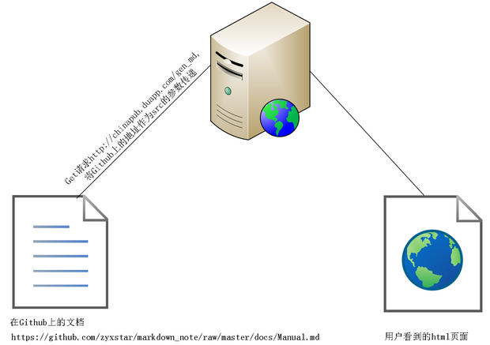
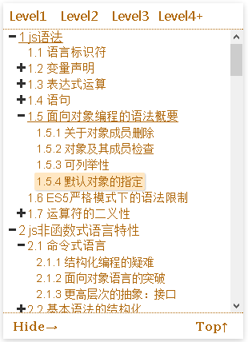
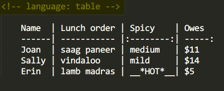
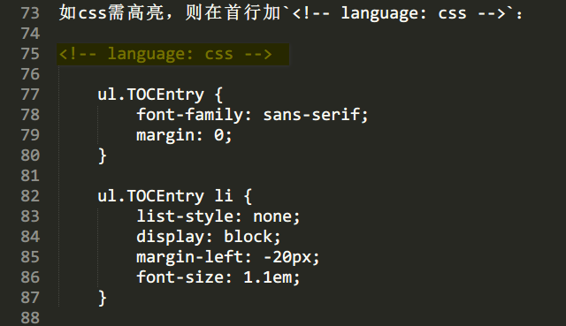

> 2014-01-08

为什么有它
==========

- 你是否有过，到处散落的小随笔而没有归档，想找到以前记录的东西，需要查找一个个文件
- 当你做读书笔记的时候，太深入细节，没的提纲，想看看整体脉络时，却千头万绪？
- 记录里的东西被删除了，但某天突然想起某个重要信息在上面，只怪当时手太痒
- 如果你是程序员，记录的东西里面也可能有一些代码，想看看运行效果怎么办？毕竟所见即所得的效果还是不错的

嗯，是的，本工具能帮助到你，它使用纯文本格式（Markdown）作笔记，非常适合做 __*版本管理*__，不用担心内容会丢失；同时能根据文档中的标题自动生成 __*目录结构*__，方便理清层次关系，帮助归纳推演；如果文档中包含代码小片断，还能在文档中 __*直接运行代码*__ ，不需要IDE，不需要CtrlC + CtrlV，直接在页面中就能得到反馈。

用它来做什么
==============

本文档也是用该工具展示的，在Github的[地址](https://raw2.github.com/zyxstar/md_note/master/docs/Manual.md)

- 读书时的整理
    - [编程范式与OOP思想(郑晖).md](http://chinapub.duapp.com/gen_md?src=https%3A%2F%2Fraw2.github.com%2Fzyxstar%2Fmd_note%2Fmaster%2Fdocs%2FLanguage%2FProgrammingParadigm%2F%25E7%25BC%2596%25E7%25A8%258B%25E8%258C%2583%25E5%25BC%258F%25E4%25B8%258EOOP%25E6%2580%259D%25E6%2583%25B3%2528%25E9%2583%2591%25E6%2599%2596%2529.md)
    - [JavaScript语言精髓与编程实践.md](http://chinapub.duapp.com/gen_md?src=https%3A%2F%2Fraw2.github.com%2Fzyxstar%2Fmd_note%2Fmaster%2Fdocs%2FLanguage%2FJavaScript%2FJavaScript%25E8%25AF%25AD%25E8%25A8%2580%25E7%25B2%25BE%25E9%25AB%2593%25E4%25B8%258E%25E7%25BC%2596%25E7%25A8%258B%25E5%25AE%259E%25E8%25B7%25B5.md)
    - [RubyPlatform.md](http://chinapub.duapp.com/gen_md?src=https%3A%2F%2Fraw2.github.com%2Fzyxstar%2Fmd_note%2Fmaster%2Fdocs%2FLanguage%2FRuby%2FRubyPlatform.md)

- 培训时的笔记
    - [需求分析训练营(徐锋).md](http://chinapub.duapp.com/gen_md?src=https%3A%2F%2Fraw2.github.com%2Fzyxstar%2Fmd_note%2Fmaster%2Fdocs%2FAnalysis%2526Design%2F%25E9%259C%2580%25E6%25B1%2582%25E5%2588%2586%25E6%259E%2590%25E8%25AE%25AD%25E7%25BB%2583%25E8%2590%25A5%2528%25E5%25BE%2590%25E9%2594%258B%2529.md)

- 课堂的记录
    - [编程范式(stanford_cs107).md](http://chinapub.duapp.com/gen_md?src=https%3A%2F%2Fraw2.github.com%2Fzyxstar%2Fmd_note%2Fmaster%2Fdocs%2FLanguage%2FProgrammingParadigm%2F%25E7%25BC%2596%25E7%25A8%258B%25E8%258C%2583%25E5%25BC%258F%2528stanford_cs107%2529.md)

- 框架学习与示例
    - [Backbone_intro.md](http://chinapub.duapp.com/gen_md?src=https%3A%2F%2Fraw2.github.com%2Fzyxstar%2Fmd_note%2Fmaster%2Fdocs%2FFramework%2FBackbone_intro.md)
    - [Backbone_todo.md](http://chinapub.duapp.com/gen_md?src=https%3A%2F%2Fraw2.github.com%2Fzyxstar%2Fmd_note%2Fmaster%2Fdocs%2FFramework%2FBackbone_todo.md)

- [更多...](http://chinapub.duapp.com/gen_md?src=https%3A%2F%2Fgithub.com%2Fzyxstar%2Fmd_note%2Fraw%2Fmaster%2FREADME.md)

快速使用(只需2步)
=================

## 第1步：创建文档
在网络上一个可访问的地址空间，如在[github](https://github.com/)上创建文档，使用[Markdown](http://zh.wikipedia.org/wiki/Markdown)来编写

> 版本控制其实由gibhub来支持

## 第2步：查看文档
取得第1步的url地址，将其urlencode编码，作为"http://chinapub.duapp.com/gen_md"的"src"参数，进行GET请求

如[我就是一个查看文档的链接](http://chinapub.duapp.com/gen_md?src=https%3A%2F%2Fraw2.github.com%2Fzyxstar%2Fmd_note%2Fmaster%2Fdocs%2FManual.md)

> 不知道什么是urlencode? [看这里](http://tool.chinaz.com/Tools/URLEncode.aspx)；还需要更详细的参数说明，请[移步这里](http://chinapub.duapp.com/usage)

## 测试一下

<form  method='get' action='http://chinapub.duapp.com/gen_md' target='_blank'>
<label for='txt_src'>填入一个网络地址，比如Python-Markdown在Github上的说明</label> 
<input type='text' name='src' id='txt_src' style="width:80%" value='https://github.com/trentm/python-markdown2/raw/master/README.md'/>
<input type='submit' value="生成"/>
</form>

看看它有什么特性
================
## 可缩放的层级目录
生成的html文件，会自动根据Markdown中标题(h1~h6)生成层级目录，并支持目录的展开与收缩

## 支持table编写

原生的Markdown需要描述table时，只能使用html来编写，十分不便，于是遵循
[Adam Pritchard的Markdown-Cheatsheet](https://github.com/adam-p/markdown-here/wiki/Markdown-Cheatsheet#wiki-tables)中的table规则：

- 支持列的对齐方式
- table中支持内联的Markdown语法

并在编写时，在首行(不缩进)写上`<!-- language: table -->`，接着空一行，并需要将整个table缩进4个字符

编写规则如下：

生成效果如下(你见到的效果就是生成出来的)：

<!-- language: table -->

    |              | 类型        | 直接量声明       | 包装对象 |
    |-------------:|-------------|:-----------------|:--------:|
    | **基本类型** | *undefined* | `v=undefined`    | ~~无~~   |
    | **基本类型** | *string*    | `v='..';v=".."`  | String   |
    | **基本类型** | _number_    | `v=1234 `        | Number   |
    | **基本类型** | _boolean_   | `v=true;v=false` | Boolean  |
    | **基本类型** | _function_  | `v=function(){}` | Function |
    | __对象__     | _object_    | `v={..};v=null`  | Object   |
    | __对象__     | _regex_     | `v=/.../..`      | RegExp   |
    | __对象__     | _array_     | `v=[...]`        | [__Array__](https://developer.mozilla.org/en-US/docs/Web/JavaScript/Reference/Global_Objects/Array)    |

## 代码语法高亮
依赖[syntaxhighlighter](http://alexgorbatchev.com/SyntaxHighlighter/)，支持绝大多数的语法高亮，使用时，首行(不缩进)加`<!-- language: «brush» -->`，其中`«brush»`为[syntaxhighlighter brush](http://alexgorbatchev.com/SyntaxHighlighter/manual/brushes/)中所定义的brushes，接着空一行，再编写代码，所有代码缩进4个字符。

> ps: `<!-- language: «brush» -->`的想法[参考](http://stackoverflow.com/editing-help#syntax-highlighting)，通过html的comment来标识语法，对于Markdown的解析无侵入性。 
已知的BUG，在代码注释中，不要使用`'`与`"`，否则容易将注释中引号与代码中的引号相匹配；不要在注释中使用html标签，否则生成的高亮代码块中会产生该标签，影响代码阅读

如css需高亮，则在首行加`<!-- language: css -->`：

生成效果如下(你见到的效果就是生成出来的)：

<!-- language: css -->

    ul.TOCEntry {
        font-family: sans-serif;
        margin: 0;
    }

    ul.TOCEntry li {
        list-style: none;
        display: block;
        margin-left: -20px;
        font-size: 1.1em;
    }

## 代码即时运行
使用时，与代码高亮一样，只是首行为`<!-- language: !«language» -->`，其中的`!`代表是可执行的，«language»等义于前面的«brush»。目前支持以下几种语言，你看到的效果都是生成出来的：

### JavaScript
首行加`<!-- language: !js -->`或`<!-- language: !javascript -->`，

<!-- language: !js -->

    function MyClass(name) {
        this.name = name;
        this.say = function() {
            return "hello, " + name;
        };
    }
    var m = new MyClass("javascript");
    alert(m.say());

使用js库，在代码的首部使用`//import «lib.version»`的方式引入，如`//import jquery.1.9.0`

<!-- language: !js -->

    //import jquery.1.9.0
    $(function(){
        alert(typeof jQuery);
    });

### Web页面
首行加`<!-- language: web -->`，并且在每部分(html,css,js)代码起始前加相应的`comment`，如图：

<!-- language: web -->

    <!-- language: html -->
    

        <input id='txt_say' type='text'/>
        <input type='button' value='Say'/>
    

    <!-- language: css -->
    @import url(/static/css/normalize.css);
    body{
        padding:20px;
    }
    input[type='button']{
        padding:3px 5px;
        font-size:14px;
        font-weight:bold;
        background-color:black;
        color:white;
    }

    <!-- language: js -->
    //import jquery.1.9.0
    $(function(){
        $("#txt_say").val("hello, web")
        $("input[type='button']").click(function(){
            alert($("#txt_say").val())
        });
    })

### Python
首行加`<!-- language: !py -->`或`<!-- language: !python -->`

<!-- language: !py -->

    #coding:utf-8
    class MyClass(object):
        def __init__(self, name):
            self.name = name

        def say(self):
            return "hello, %s" % self.name

    m = MyClass("python")
    print m.say()

> 细心的你可能发现，有一个"►applet"的按钮，这是通过java编写的applet来调用本地的语言解析器，并将运行结果返回至applet，再显示到页面上。所以，如果你需要看到编写的代码运行在本机上的效果时，可以点此按钮。使用它之前有几点特殊要求（当然，你可以忽略它，直接使用"►online"）：

> - 安装java，并在浏览器上启用java，如chrome，在地址栏输入`chrome://plugins/`，查看`Java(TM)`是否启动
> - 打开 控制面板 - Java (32bit) - Security，设置为Medium
> - 在Java\jre7\lib\security\java.policy文件(请确定该java版本是浏览器使用的版本)里最后加上`permission java.security.AllPermission;`，修改该文件时，修改者首先需要具备可修改的权限(以上权限的修改，由可能引起安全隐患，使用者可在运行完文档后，酌情还原)
> - 语言的编译器(解析器)工具需要在环境变量中配置，如python.exe、ruby.exe、java.exe、javac.exe、csc.exe（目前只支持这几种语言） __所在的目录__ 需要添加到环境变量PATH中

### Ruby
首行加`<!-- language: !rb -->`或`<!-- language: !ruby -->`

<!-- language: !rb -->

    #coding:utf-8
    class MyClass
        def initialize(name)
            @name = name
        end

        def say
            return "hello, #{@name}"
        end
    end

    m = MyClass.new "ruby"
    puts m.say

### C语言
首行加`<!-- language: !c -->`

<!-- language: !c -->

    #include <stdio.h>

    typedef struct MyStruct {
        char* name;
        char* (*pSay)(struct MyStruct*);
    } MyStruct;

    char* Say(MyStruct* ins) {
        return ins->name;
    }

    int main(){
        MyStruct myIns;

        myIns.name = "c language";
        myIns.pSay = Say;

        printf("hello, %s", myIns.pSay(&myIns));
        return 0;
    }

### C++
首行加`<!-- language: !cpp -->`

<!-- language: !cpp -->

    #include <iostream>
    #include <string>

    using namespace std;

    class MyClass{
        public:
            MyClass(string name){
                _name = name;
            }
            string say(){
                return string("hello, ") + _name;
            }
        private:
            string _name;
    };

    int main(){
        cout << MyClass("cpp").say() << endl;
        return 0;
    }

### CSharp
首行加`<!-- language: !c# -->`或`<!-- language: !csharp -->`

<!-- language: !csharp -->

    using System;

    class Program
    {
        static void Main(string[] args)
        {
            Console.Write(new MyClass("csharp").say());
        }

        public class MyClass
        {
            private string name;
            public MyClass(string name)
            {
                this.name = name;
            }
            public string say()
            {
                return string.Format("hello, {0}", name);
            }
        }
    }

### Java
首行加`<!-- language: !java -->`

<!-- language: !java -->

    import java.io.*;
    import java.text.*;
    public class Program {
        public static void main(String[] args) {
            try {
                System.out.print(new Program().new MyClass("java").say());
            } catch (Exception e) {
                e.printStackTrace();
            }
        }

        public class MyClass {
            private String name;
            public MyClass(String name){
                this.name=name;
            }
            public String say(){
                return MessageFormat.format("hello, {0}", name);
            }
        }
    }

浏览器支持
==========

- Chrome
- Firefox
- IE9+
- Safari

未完待续
========

- Github上的markdown语法支持
- chrome插件
- blog插件
- 自定义样式
- LaTeX公式
- web运行支持coffeescript,sass,less

感谢
====
- [SyntaxHighlighter](http://alexgorbatchev.com/SyntaxHighlighter)
- [CodeMirror](http://codemirror.net/)
- [JsFiddle](http://jsfiddle.net/)
- [CompileOnline](http://compileonline.com)

给我反馈
========
zyxstar2013 at 163.com

<!--
    ┌─┬─┬─┬─┐
    ├─┼─┼─┼─┤
    │ │ │ │ │
    ├─┼─┼─┼─┤
    │ │ │ │ │
    └─┴─┴─┴─┘
-->
