> 2015-02-08

文件IO
===========
本章所说的函数经常被称为 __不带缓冲的IO__，指每个`read`和`write`都调用内核中的一个 __系统调用__，其实还存在一个内核的缓冲区高速缓存，`read`和`write`的数据都要被内核缓冲，此处的不带缓冲，指的是在用户的进程中对这两个函数不会自动缓冲

## 文件描述符
在依从POSIX的应用程序中，幻数0,1,2应当替换成符号常量`STDIN_FILENO`,`STDOUT_FILENO`,`STDERR_FILENO`(被定义在`<unistd.h>`中)，虽然它们是不同的文件描述符，但却指向同一个文件－终端

文件描述符的变化范围为0~`OPEN_MAX`

## open函数
```c
#include <fcntl.h>
int open(const char *path, int oflag, ... /* mode_t mode*/ );
int openat(int fd, const char *path, int oflag, ... /* mode_t mode*/ );
//Both return: file descriptor if OK, −1 on error
```

- `O_CREAT` 若文件不存在，则创建它，需要第三个参数`mode`，用于指定该新文件的访问权限位
- `O_CLOEXEC` 设置文件描述符为`FD_CLOEXEC`
- `O_DIRECTORY` 如果`path`引用的不是目录，则出错
- `O_EXCL` 如果同时指定了`O_CREAT`，而文件存在，则会出错，可以测试一个文件是否存在，如果不存在则创建，测试和创建是一个 __原子__ 操作
- `O_NOFOLLOW` 如果`path`引用的是一个符号链接，则出错
- `O_NONBLOCK` 如果`path`引用的是一个FIFO、一个块特殊文件或一个字符特殊文件，则此选项为文件的本次打开操作和后续IO操作设置为 __非阻塞__ 方式
- `O_DSYNC` 使每次`write`等待物理IO操作完成，但是如果写操作并不影响读取刚写入的数据，则不等待文件属性被更新
- `O_SYNC` 使每次`write`等待物理IO操作完成，包括由`write`操作引起的文件属性更新所需的IO
- `O_RSYNC` 进行`read`操作等待，直至所有对文件同一部分挂起的写操作都完成

关于`openat`:

- `path`参数指定的是绝对路径，这种情况下`fd`参数被忽略，`openat`相当于`open`
- `path`参数指定的是相对路径，`fd`参数指出了相对路径名在文件系统中的开始地址，`fd`参数是通过打开相对路径名所在的目录来获取（即通过以前`open`过的目录所得到的`fd`）
- `path`参数指定的是相对路径，`fd`参数具有特殊值`AT_FDCWD`，路径名在当前工作目录中获取

引入它，为了解决：

- 让线程可以使用相对路径名打开目录中的文件，而不再只能打开当前工作目录
- 避免time-of-check-to-time-of-use(TOCTTOU)错误

使用`O_APPEND`打开一个文件以便读写，无论`lseek`到任意位置，`write`都从文件末尾开始写。不用该标志打开文件，就可`lseek`到任意位置，然后`write`，但会覆盖之前内容

## creat函数
```c
#include <fcntl.h>
int creat(const char *path, mode_tmode);
//Returns: file descriptor opened for write-only if OK, −1 on error
```

此函数等效于

```c
open(path, O_WRONLY | O_CREAT | O_TRUNC, mode);
```

`creat`不足之外它以 __只写__ 方式打开所创建的文件，如果需要创建一个临时文件，并先写，然后再读，推荐以下方式

```c
open(path, O_RDWR | O_CREAT | O_TRUNC, mode);
```

## close函数
```c
#include <unistd.h>
int close(int fd );
//Returns: 0 if OK,−1 on error
```

关闭一个文件时还会释放该进程加在该文件上的所有记录锁。当一个进程终止时，内核自动关闭它所有打开的文件。

## lseek函数
```c
#include <unistd.h>
off_t lseek(intfd, off_t offset,int whence );
Returns: new file offset if OK,−1 on error
```

当打开一个文件时，除非指定`O_APPEND`选项，否则该偏移量被设置为0

若`lseek`成功，则返回新的文件偏移量，为此可以用以下方式确定打开文件的当前偏移量(相当于标准库中的`ftell`?)

```c
off_t currpos;
currpos = lseek(fd, 0, SEEK_CUR);
```

这种方法也可用来确定所涉及的文件是否可以设置偏移量，如果文件描述符引用的是一个管道、FIFO、网络套接字，则`lseek`返回-1，并将`error`设置为`ESPIPE`

```c
#include "apue.h"
int main(void){
    if (lseek(STDIN_FILENO, 0, SEEK_CUR) == -1)
        printf("cannot seek\n");
    else
        printf("seek OK\n");
    exit(0);
}
```

```shell
$ ./a.out < /etc/passwd
seek OK
$ cat < /etc/passwd | ./a.out
cannot seek
$ ./a.out < /var/spool/cron/FIFO
cannot seek
```

`lseek`仅将当前的文件偏移量记录在内核中，并不引起任何IO操作

文件偏移量可以大于文件的当前长度，在这种情况下，对该文件的下一次写将加长该文件，并在文件中构成一个 __空洞__，位于文件中但没有写过的字节都被读为0

> 文件中的空洞并不要求在磁盘上占用存储区，具体处理方式与文件系统的实现有关，当定位超出文件尾端之后写时，对新写的数据需要分配磁盘块，但于对于原文件尾端和新开始写位置之间发则不需要分配磁盘块

```c
#include "apue.h"
#include <fcntl.h>
char  buf1[] ="abcdefghij";
char  buf2[] ="ABCDEFGHIJ";
int main(void){
    int  fd;
    if ((fd = creat("file.hole", FILE_MODE)) < 0)
        err_sys("creat error");
    if (write(fd, buf1, 10) != 10)
        err_sys("buf1 write error");
    /* offset now = 10 */
    if (lseek(fd, 16384, SEEK_SET) == -1)
        err_sys("lseek error");
    /* offset now = 16384 */
    if (write(fd, buf2, 10) != 10)
        err_sys("buf2 write error");
    /* offset now = 16394 */
    exit(0);
}
```

```shell
$ ./a.out
$ ls -l file.hole         #check its size
-rw-r--r--  1 sar  16394 Nov 25 01:01 file.hole
$ od -c file.hole         #let’sl ook at the actual contents
0000000  a bcdefghij\0 \0 \0 \0 \0 \0
0000020  \0 \0 \0 \0 \0 \0 \0 \0 \0 \0 \0 \0 \0 \0 \0 \0
*
0040000  A BCDEFGHIJ
0040012
```

如果比较无空洞但同样长度的文件，后者占用的磁盘块会大

```shell
$ ls -ls file.hole file.nohole      #compar esizes
8  -rw-r--r--  1 sar  16394 Nov 25 01:01 file.hole
20 -rw-r--r--  1 sar  16394 Nov 25 01:03 file.nohole
```

## read函数
```c
#include <unistd.h>
ssize_t read(int fd, void *buf,size_tnbytes );
//Returns: number of bytes read, 0 if end of file,−1 on error
```

有多种情况可使读到的字节数少于要求读的字节数：

- 读普通文件时，在读到要求字节数之前已到达了文件尾端。且下次调用`read`时，它将返回0
- 当从终端设备读时，通常一次最多读一行
- 当从网络读时，网络中的缓冲机构可能造成返回值小于所要求读的字节数
- 当从管道或FIFO读时，如若管道包含的字节少于所需的数量，那么`read`将只返回实际可用的字节数
- 当从某些面向记录的设备(如磁带)，一次最多返回一个记录
- 当某一信号造成中断，而已经读了部分数据量时

### 有关错误处理
- `EAGAIN` 提示没有数据可读，可以重试，也许下次能成功
- `EBADF`,`EISDIR` 等属于程序错误，不应做错误处理（测试就能发现）
- `EFAULT`,`EIO`　等错误，无法处理，只能出错返回
- `EINTR` 信号中断，需要重试

```c
while (1) {
    retr = read(fdr, buf, BUFSIZE);
    if (retr == -1) {
        if (errno == EINTR) {
            continue;
        }
        perror("read()");
        goto read_err;
    }
    if (retr == 0) {
        break;
    }

    retw = 0;
    while (retw < retr) {
        ret = write(fdw, buf + retw, retr - retw);
        if (ret == -1) {
            if (errno == EINTR) {
                continue;
            }
            perror("write()");
            goto write_err;
        }
        retw += ret;
    }
}
```

所以上述的代码除了检查`errno == EINTR`，其它出错均不必或无法处理

## write函数
```c
#include <unistd.h>
ssize_t write(int fd, const void *buf,size_tnbytes );
Returns: number of bytes written if OK, −1 on error
```

`write`出错的常见原因是：磁盘已写满，或者超过了一个给定进程的文件长度限制

## IO效率
磁盘块长度为4096字节(由`st_blksize`表示)，当缓存区大小设置为该大小时，系统CPU时间最小

文件系统为改善性能都会采用某种 __预读__ 技术，当检测到正在进行顺序读取时，系统就试图读入比应用所要求的更多数据，所以当缓存区即使设置为32时与设置较大缓存区，最后的墙上时间几乎一样

程序执行时，设置`fd`的文件状态标志为`O_SYNC`时（使用`fcntl`），每次`write`都要等待，会增加系统时间和时钟时间（墙上时间）

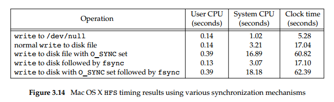

同步写入文件之后，`fsync`的调用并不明显


## 文件共享
即支持在 __不同进程间共享__ 打开的文件

内核使用三种数据结构表示打开的文件，它们之间的关系决定了在文件共享方面一个进程对另一个进行可能产生的影响

- 每个进程在 __进程表中都有一个记录项__(process table entry)，记录项中包含有一张 __打开文件描述符表__，可将其视为一个矢量，每个描述符占用一项，与之相关联的是
    + __文件描述符标志__(fd flags)
    + 指向一个 __文件表项的指针__(file pointer)
- 内核为所有打开文件维持一张文件表(file table entry)，每个文件表包含
    + __文件状态标志__(file status flags，读、写、添写、同步和非阻塞等)
    + 当前文件 __偏移量__(current file offset)
    + 指向该文件 __v节点表项的指针__(v-node pointer)
- 每个打开文件(或设备)都有一个 __v节点__(v-node)结构，包含了 __文件类型__ 和对此文件进行各种 __操作的函数的指针__。对于大多数文件，v节点还包含了该文件的 __i节点__(i-node,索引节点)，这些信息是在打开文件时从磁盘上读入内存的，包含文件所有者、文件长度、文件所在的设备、指向文件实际数据块在磁盘上所在位置的指针等

> linux没用使用v节点，而使用了通用i节点结构

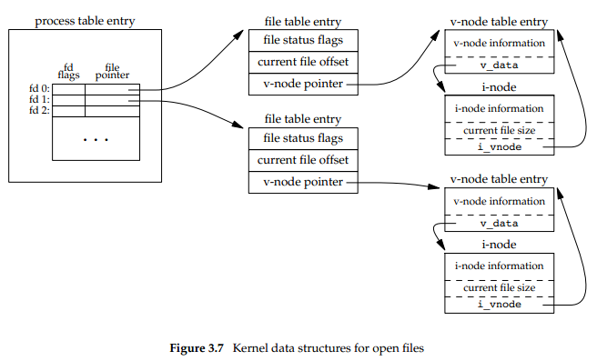

可能有多个文件描述符项指向 __同一文件表项__，如下面讨论的`dup`函数。在`fork`后也会发生同样的情况，此时父、子进程对于每一个打开文件描述符 __共享同一个文件表项__

## 原子操作
### 添写至一个文件
`open`时使用`O_APPEND`选项

### pread和pwrite函数
```c
#include <unistd.h>
ssize_t pread(int fd, void *buf,size_tnbytes, off_t offset);
//Returns: number of bytes read, 0 if end of file,−1 on error
ssize_t pwrite(int fd, const void *buf,size_tnbytes, off_t offset);
Returns: number of bytes written if OK, −1 on error
```

相当于顺序调用`lseek`和`read`/`write`，但它是 __原子操作，且不更新文件偏移量__

### 创建一个文件
对`open`函数同时使用`O_CREAT`和`O_EXCL`，否则如果先`open`再`creat`间，另一个进程创建了该文件，就会引起问题

## dup和dup2函数
```c
#include <unistd.h>
int dup(int fd );
int dup2(int fd, int fd2);
//Both return: new file descriptor if OK, −1 on error
```

- 由`dup`返回的新文件描述符一定是当前可用文件描述符中的最小数值，
- 用`dup2`则可以用参数`fd2`指定新描述符的数值，
    + 如果`fd2`已打开，则先将其关闭
    + 如果`fd`等于`fd2`，则返回`fd2`，而不关闭它
    + 否则，`fd2`的`FD_CLOEXEC`文件描述标志就清除，这样`fd2`在进程调用`exec`时是打开的

> `FD_CLOEXEC` close on exec, not on-fork, 意为如果对描述符设置了FD_CLOEXEC，使用execl执行的程序里，此描述符被关闭，不能再使用它，但是在使用fork调用的子进程中，此描述符并不关闭，仍可使用


当两个描述符指向 __同一文件表项__，它们 __共享__ 同一文件状态标志(file status flags)，以及同一当前文件偏移量(current file offset)，__但__ 却有自己的一套文件描述符标志(fd flags)，新描述符的执行时关闭(`close-on-exec`)标志总是由`dup`函数清除

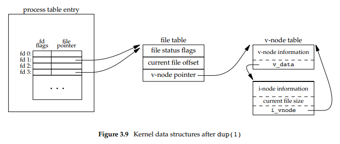

复制一个描述符的另一种方法是使用`fcntl`

```c
dup(fd);
// is equivalent to
fcntl(fd, F_DUPFD, 0);

dup2(fd, fd2);
// is equivalent to
close(fd2);
fcntl(fd, F_DUPFD, fd2);
```

在后一种情况，`dup2`是一个原子操作，且两者有某些不同的`errno`

说明下面命令区别

```shell
./a.out > outfile 2>&1
./a.out 2>&1 > outfile
```

第一条，设置标准输出到outfile，然后执行`dup`将 __标准输出复制到描述符2上__，其结果是将标准输出和标准错误设置为同一个文件

第二条，首先执行`dup`，描述符2成为终端（标准输入？），而标准输出重定向到outfile


## sync/fsync/fdatasync函数
```c
#include <unistd.h>
int fsync(int fd );
int fdatasync(int fd );
//Returns: 0 if OK,−1 on error
void sync(void);
```

`sync`函数将所有修改过的缓冲区排入写队列，然后就返回，所以它　__并不等于__ 实际写硬盘操作结束

通常称为update的系统守护进程会周期性的调用`sync`，保证了定期冲洗内核的块缓冲区

`fsync`只对由文件描述符指定的单一文件起作用，并且 __等待写磁盘操作结束__，然后返回，可用于数据库这样的应用程序

`fdatasync`类似于`fsync`，但它只影响文件的数据部分，而`fsync`还会同步更新文件的属性

## fcntl函数
```c
#include <fcntl.h>
int fcntl(int fd, int cmd, ... /* int arg */ );
Returns: depends on cmd if OK (see following), −1 on error
```

如果出错，返回-1，如果成功则返回某个其他值

该函数有5种功能

- 复制一个现有的描述符(cmd = `F_DUPFD`　or `F_DUPFD_CLOEXEC`)
    + `F_DUPFD`，复制文件描述符，新文件描述符作为函数值返回，它是尚未打开的各描述符中，大于或等于第3个参数中各值的最小值（对照`dup`），新描述符与`fd`共享同一文件表项，但其文件描述符中`FD_CLOEXEC`标志被清除
    + `F_DUPFD_CLOEXEC`，复制文件描述符，设置与新描述符关联的`FD_CLOEXEC`文件描述符标志的值，返回新文件描述符
- 获得、设置文件描述符标记(cmd = `F_GETFD`　or `F_SETFD`)
    + `F_GETFD`，对应于`fd`的文件描述符标志作为函数值返回（目前只有一个文件文件描述符标志`FD_CLOEXEC`）
    + `F_SETFD`，设置对于`fd`的文件描述符标志，一般不用常量`FD_CLOEXEC`，而使用0，`exec`时不关闭，1时关闭
- 获得、设置文件状态标志(cmd = `F_GETFL`　or `F_SETFL`)
    + `F_GETFL`，对应于`fd`的文件状态标志作为函数值返回
        * `O_RDONLY` open for reading only
        * `O_WRONLY` open for writing only
        * `O_RDWR` open for reading and writing
        * `O_EXEC` open for execute only
        * `O_SEARCH` open directory for searching only
        * `O_APPEND` append on each write
        * `O_NONBLOCK` nonblocking mode
        * `O_SYNC` wait for writes to complete (data and attributes)
        * `O_DSYNC` wait for writes to complete (data only)
        * `O_RSYNC` synchronize reads and writes
        * `O_FSYNC` wait for writes to complete (FreeBSD and Mac OS X only)
        * `O_ASYNC` asynchronous I/O (FreeBSD and Mac OS X only)
        * 前五个访问标志`O_RDONLY`、`O_WRONLY`、`O_RDWR`、`O_EXEC`、`O_SEARCH`，并不各占一位，它们互斥，只能取其一，需用屏蔽字`O_ACCMODE`取得访问方式位，然后将结果与这五个值一一比较(见下代码)
    + `F_SETFL`，可以更改的值为`O_APPEND`、`O_NONBLOCK`、`O_SYNC`、`O_DSYNC`、`O_RSYNC`、`O_FSYNC`、`O_ASYNC`
- 获得、设置异步IO所有权(cmd = `F_GETOWN` or `F_SETOWN`)
    + `F_GETOWN`，获取当前接收`SIGIO`和`SIGURG`信号的进程ID或进程组ID
    + `F_SETOWN`，设置，正的`arg`指定一个进程ID，负的`arg`表示等于`arg`绝对值的一个进程组ID
- 获得、设置记录锁(cmd = `F_GETLK`, `F_SETLK`,　or `F_SETLKW`)

### 取得文件描述符

```c
#include "apue.h"
#include <fcntl.h>

int
main(int argc, char *argv[])
{
    int     val;

    if (argc != 2)
        err_quit("usage: a.out <descriptor#>");

    if ((val = fcntl(atoi(argv[1]), F_GETFL, 0)) < 0)
        err_sys("fcntl error for fd %d", atoi(argv[1]));

    switch (val & O_ACCMODE) {
    case O_RDONLY:
        printf("read only");
        break;

    case O_WRONLY:
        printf("write only");
        break;

    case O_RDWR:
        printf("read write");
        break;

    default:
        err_dump("unknown access mode");
    }

    if (val & O_APPEND)
        printf(", append");
    if (val & O_NONBLOCK)
        printf(", nonblocking");
    if (val & O_SYNC)
        printf(", synchronous writes");

#if !defined(_POSIX_C_SOURCE) && defined(O_FSYNC) && (O_FSYNC != O_SYNC)
    if (val & O_FSYNC)
        printf(", synchronous writes");
#endif

    putchar('\n');
    exit(0);
}
```

```shell
$./a.out 0 < /dev/tty
read only
$./a.out 1 > temp.foo
$cat temp.foo
write only
$./a.out 2 2>>temp.foo
write only, append
$./a.out 5 5<>temp.foo
read write
```

程序在一个描述符上进行操作，但根本不知道由shell打开的相应文件的名称，因为这是shell打开的，不能打开时设置，就只能使用`fcntl`了

`5<>temp.foo`表示在文件描述符5上打开文件temp.foo以供读写

### 设置/取消状态标志
```c
#include "apue.h"
#include <fcntl.h>

void
set_fl(int fd, int flags) /* flags are file status flags to turn on */
{
    int     val;

    if ((val = fcntl(fd, F_GETFL, 0)) < 0)
        err_sys("fcntl F_GETFL error");

    val |= flags;       /* turn on flags */

    if (fcntl(fd, F_SETFL, val) < 0)
        err_sys("fcntl F_SETFL error");
}

void
clr_fl(int fd, int flags) /* flags are file status flags to turn off */
{
    int     val;

    if ((val = fcntl(fd, F_GETFL, 0)) < 0)
        err_sys("fcntl F_GETFL error");

    val &= ~flags;       /* turn flags off */

    if (fcntl(fd, F_SETFL, val) < 0)
        err_sys("fcntl F_SETFL error");
}
```

先要获得现有标志值，然后按照期望修改它，最后修改设置新标志值，不能只执行`F_SETFL`(或`F_SETFD`)，这样会关闭以前设置的标志位

## ioctl函数
```c
#include <unistd.h> /* System V */
#include <sys/ioctl.h> /* BSD and Linux */
int ioctl(int fd, int request, ...);
//Returns: −1 on error,s omething else if OK
```

## /dev/fd
系统提供的`/dev/fd`目录下，有名为0、1、2等的文件，打开它们相当于复制描述符

```c
fd = open("/dev/fd/0", mode);
// equals
fd = dup(0);
```

但描述符之前打开时是只读的，那么也只能对`fd`进行读操作，下面的调用即使成功，也不能写操作

```c
fd = open("/dev/fd/0", O_RDWR);
```

> linux的实现是个例外，它把文件描述符映射成指向底层物理文件的符号链接，因此返回的新文件描述符的模式与`/dev/fd`文件描述符其实并不相关

也可使用`/dev/fd`作为路径名参数调用`creat`

> 但linux上，因为指向实际文件的符号链接，在`/dev/fd`上使用`creat`会导致底层文件被截断

系统提供的`/dev/stdin`, `/dev/stdout`, `/dev/stderr`等效于`/dev/fd/0`, `/dev/fd/1`, `/dev/fd/2`

`/dev/fd`主要由shell使用，它允许使用路径名称为调用参数的程序，__能用处理其他路径名的相同方式处理标准输入和标准输出__

```shell
filter file2 | cat file1 /dev/fd/0 file3 | lpr
```

文件和目录
=================
## stat/fstat/fstatat/lstat函数
```c
#include <sys/stat.h>
int stat(const char *restrict pathname, struct stat *restrict buf );
int fstat(int fd, struct stat *buf );
int lstat(const char *restrict pathname, struct stat *restrict buf );
int fstatat(int fd, const char *restrict pathname, struct stat *restrict buf, int flag);
//All four return: 0 if OK,−1 on error
```

`fstatat`为相对于当前打开目录（`fd`指定）的路径名返回文件统计信息，`flag`决定是否跟随一个符号链接，默认是跟随。如果`fd`值为`AT_FDCWD`，且`pathname`是相对路径，则计算具体的路径，如果`pathname`是绝对路径，`fd`被忽略

`stat`返回与此命名文件有关的信息结构，`fstat`获取已在描述符`fd`上打开文件的有关信息，当命名文件是一个符号连接时，`lstat`返回该符号链接的有关信息，而不是由该符号链接引用文件的信息，除此之外，同于`stat`

第二个参数`buf`是指针，指向一个结构体，这些函数填写该结构体，该结构在不同实现中有所不同，但基本形式为：

```c
struct stat {
    mode_t st_mode; /* file type & mode (permissions) */
    ino_t st_ino; /* i-node number (serial number) */
    dev_t st_dev; /* device number (file system) */
    dev_t st_rdev; /* device number for special files */
    nlink_t st_nlink; /* number of links */
    uid_t st_uid; /* user ID of owner */
    gid_t st_gid; /* group ID of owner */
    off_t st_size; /* size in bytes, for regular files */
    struct timespec st_atim; /* time of last access */
    struct timespec st_mtim; /* time of last modification */
    struct timespec st_ctim; /* time of last file status change */
    blksize_t st_blksize; /* best I/O block size */
    blkcnt_t st_blocks; /* number of disk blocks allocated */
};

struct timespec {
    time_t tv_sec;
    long tv_nsec;
};

```

> 2008版本以前，时间字段为`st_atime/st_mtime/st_ctime`，都是`time_t`类型的（以秒来表示），`timespec`提供了更高精度的时间戳，为了保持兼容，旧的名字可以定义成`tv_sec`成员，如`st_atime`定义为`st_atim.tv_sec`

> 有关设备文件，`st_rdev`的值需要在不同平台下，测试出如何得到`ls(1)`相同结果，`st_dev`不怎么用了

> `ls(1)`中不同颜色的设置在环境变量`LS_COLORS`

## 文件类型
- __普通文件__，至于是文本还是二进制，对内核无区别，对普通文件内容的解释由应用程序进行
> 一个例外是二进制可执行文件，为了执行它，内核必须理解其格式，所有二进制可执行文件都遵循一种格式，这种格式能使内核确定程序文件和数据的加载位置

- __目录文件__，包含了其他文件的名字以及指向这些文件有信息的指针，具有读权限的任一进程可以读该目录内容，但只有内核可以直接写目录
- __块特殊文件__，提供对设备（如磁盘）带缓冲的访问，每次访问以固定长度为单位进行
- __字符特殊文件__，提供对设备不带缓冲的访问，每次访问长度可变，系统中 __所有设备__ 要么是字符特殊文件，要么是块特殊文件
- __FIFO__，用于进程间通信，有时也称为命名管道
- __套接字__，用于进程间的网络网络通信，也可用于一台宿主上进程之间的非网络通信
- __符号链接__，这种文件类型指向另一个文件

可用下面的宏来确定文件类型，宏的参数即`stat`结构的`st_mode`成员

```c
S_ISREG()      // regular file
S_ISDIR()      // directory file
S_ISCHR()      // character special file
S_ISBLK()      // block special file
S_ISFIFO()     // pipe or FIFO
S_ISLNK()      // symbolic link
S_ISSOCK()     // socket
```

```shell
$ ./a.out /etc/passwd /etc /dev/log /dev/tty \
> /var/lib/oprofile/opd_pipe /dev/sr0 /dev/cdrom
/etc/passwd: regular
/etc: directory
/dev/log: socket
/dev/tty: character special
/var/lib/oprofile/opd_pipe: fifo
/dev/sr0: block special
/dev/cdrom: symbolic link
```

在linux上编译该程序，必须定义`_GNU_SOURCE`，这样就能包括`S_ISSOCK`宏定义

> 早期版本并不提供宏，需要与屏蔽字`S_IFMT`进行逻辑与运算，然后与`S_IFxxx`常量进行比较

```
#define S_ISDIR(mode) (((mode) & S_IFMT) == S_IFDIR)
```

__宏与常量各有优势，前者方便确定某一类型，后者方便`switch`的处理__


## 设置用户ID和组ID
与一个进程相关的ID：

- 我们实际上谁，这两个字段在登录时取自口令文件中的登录项，通常一个登录会话间这些值并不改变，但是超级用户进程有方法改变它们
    - 实际用户ID(real user ID)
    - 实际组ID(real group ID)
- 用于文件访问权限检查
    - 有效用户ID(effective user ID)
    - 有效组ID(effective group ID)
    - 附加组ID(supplementary group IDs)
- 由exec函数保存(开始时等于effective，主要用于切换ID，在real与effective之间切换)
    - 保存的设置用户ID(saved set-user-ID)
    - 保存的设置组ID(saved set-group-ID)

当执行一个程序文件时，进程的有效用户ID等于实际用户ID，有效组ID等于实际组ID，但是可以在文件模式字`st_mode`中设置一个特殊标志，其含义是，当执行此文件时，将进程的有效用户ID设置为`st_uid`，(shell中为`chmod u+s xxx`)，同理，文件模式中可以设置另一位，将执行此文件的进程的有效组ID为文件的组所有者ID`st_gid`

若文件所有者`st_uid`是超级用户，并且设置了`st_mode`中的`set-user-ID`bit，然后该程序由另一进程执行时，则该进程具有超级用户特权，不管执行此文件的进程的实际用户ID是什么，如`/usr/bin/passwd`，允许任一用户改变口令

`set-user-ID`和`set-group-ID`bit包含在`st_mode`中，通过宏`S_ISUID`和`S_ISGID`测试

## 文件访问权限
`st_mode`值也包含了针对文件的访问权限位

```table

st_mode mask | Meaning
---------|--------------
S_IRUSR  |  user-read
S_IWUSR  |  user-write
S_IXUSR  |  user-execute
S_IRGRP  |  group-read
S_IWGRP  |  group-write
S_IXGRP  |  group-execute
S_IROTH  |  other-read
S_IWOTH  |  other-write
S_IXOTH  |  other-execute

```

```c
assert((buf.st_mode & S_IXUSR) == S_IXUSR);
```

- 用名字打开任一类型的文件时，对该名字中的 __包含每一个目录，以及当前工作目录__，都应具有 __执行权限__（执行权限位常被称为搜索位）

> 对于目录的读权限和执行权限的意义是 __不同__ 的，读权限允许我们读目录，获得在该目录中所有文件名的列表。当一个目录是要访问文件的路径名的一个组成部分时，对该目录的执行权限可使我们通过该目录

> 如果`PATH`环境变量指定了一个我们不具有执行权限的目录，那么shell决不会在该目录下找到可执行文件

- 对于一个读权限决定了我们是否能够打开该文件进行读操作，与`open`的`O_RDONLY`和`O_RDWR`标志相关
- 对于一个写权限决定了我们是否能够打开该文件进行写操作，与`open`的`O_WRONLY`和`O_RDWR`标志相关
- 为了在`open`中对一个文件指定`O_TRUNC`标志，必须对该文件具有写权限
- 为了在一个目录创建一个新文件，必须对该目录具有写权限和执行权限
- 为了删除一个现有文件，必须对包含该文件的目录具有写权限和执行权限。对该文件本身则不需要有读、写权限
- 如果用`exec`族函数中任何一个执行某个文件，都必须对该文件具有执行权限，该文件还必须是一个普通文件

进程每次打开、创建或删除一个文件时，内核就进行文件访问权限测试，而这种测试可能涉及文件的所有者（`st_uid`或`st_gid`）、进程的有效ID（有效用户ID和有效组ID）以及进程的附加组ID。__两个所有者ID是 *文件的性质*，而两个有效ID和附加组ID则是 *进程的性质*__

- 若进程的有效用户ID是0（超级用户），则允许访问
- 若进程的有效用户ID等于文件的所有者ID（也就是该进程拥有此文件），那么，若所有者适当的访问权限被设置，则允许访问，否则拒绝访问
- 若进程的有效组ID或进程的附加组ID之一等于文件的组ID，那么，若组适当的访问限位被设置，则允许访问，否则拒绝访问
- 若其他用户适当的访问权限位被设置，则允许访问，否则拒绝访问


## 新文件和目录的所有权
新文件的用户ID设置为进程的 __有效用户ID__，新文件的组ID可以是进程的有效组ID，也可以是它所在目录的组ID

> As we mentioned earlier, this option for group ownership is the default for FreeBSD 8.0 and Mac OS X 10.6.8, but an option for Linux and Solaris. Under Solaris 10, and by default under Linux 3.2.0, we have to enable the set-group-ID bit, and the mkdir function has to propagate a directory’s set-group-ID bit automatically for this to work.

## access/faccessat函数
```c
#include <unistd.h>
int access(const char *pathname, int mode);
int faccessat(int fd, const char *pathname, int mode, int flag);
//Both return: 0 if OK, −1 on error
```

其中`mode`为

```table
mode | Description
-----|--------------
R_OK | test for read permission
W_OK | test for write permission
X_OK | test for execute permission
```

## umask函数
```c
#include <sys/stat.h>
mode_t umask(mode_t cmask);
//Returns: previous file mode creation mask
```

> mask不管网络中，还是内核中，表示这个值，会被取反，再与上将来给定的值
>
> 如创建的文件模式是777，但mask为002，相当于 ~002 & 777 得到 775

为进程设置文件模式创建屏蔽字，并返回以前的值，这是少数几个没有出错返回的，其中`cmask`是9个常量`S_IRUSR，S_IWUSR，S_IXUSR，S_IRGRP，S_IWGRP，S_IXGRP，S_IROTH，S_IWOTH，S_IXOTH`中的若干个按位 或 构成的，对于任何在文件模式创建屏蔽字中为1的位，在文件`mode`中的相应位则一定被关闭

unix系统大多数用户从不处理他们的`umask`值，通常在登录时，由shell启动文件设置一次，然后从不改娈。尽管如此，当编写创建新文件的程序时，还是确保`umask(0);`，否则，当我们进程运行时，有效的`umask`值有可能关闭该权限位

更改进程的文件模式创建屏蔽字，不会影响父进程的屏蔽字

常用的几种`umask`值为002,022,027，`umask -S`打印符号形式

```table
Mask bit | Meaning
---------|-----------
0400     | user-read
0200     | user-write
0100     | user-execute
0040     | group-read
0020     | group-write
0010     | group-execute
0004     | other-read
0002     | other-write
0001     | other-execute
```

## chmod/fchmod/fchmodat函数
```c
#include <sys/stat.h>
int chmod(const char *pathname, mode_t mode);
int fchmod(int fd, mode_t mode);
int fchmodat(int fd, const char *pathname, mode_t mode, int flag);
//All three return: 0 if OK, −1 on error
```

```table
mode       |  Description
-----------|-------------------------
S_ISUID    |  set-user-ID on execution
S_ISGID    |  set-group-ID on execution
S_ISVTX    |  saved-text (sticky bit)
S_IRWXU    |  read, write, and execute by user (owner)
   S_IRUSR |  read by user (owner)
   S_IWUSR |  write by user (owner)
   S_IXUSR |  execute by user (owner)
S_IRWXG    |  read, write, and execute by group
   S_IRGRP |  read by group
   S_IWGRP |  write by group
   S_IXGRP |  execute by group
S_IRWXO    |  read, write, and execute by other (world)
   S_IROTH |  read by other (world)
   S_IWOTH |  write by other (world)
   S_IXOTH |  execute by other (world)
```

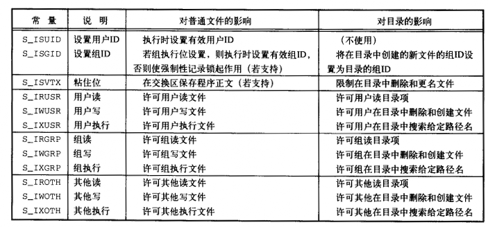

除了以前的9个文件访问权限位，另外加了6项，两个设置id常量（`S_ISUID/S_ISGID`），保存正文常量（`S_ISVTX`），以及三个组合常量（`S_IRWXU/S_IRWXG/S_IRWXO`）

`chmod`函数更新的只是i节点最近一次被更改的时间，而`ls`命令列出的是最后修改文件内容的时间

## 粘住位
`S_ISVTX`位被称为粘住位

目录`/tmp`为`drwxrwxrwt`，任何用户都可以在这目录中创建文件，任一用户对这目录都是读、写和执行，但用户不能删除或更名属于其他人的文件

> linux中粘住位对普通文件无意义


## chown/fchown/fchownat/lchown函数
```c
#include <unistd.h>
int chown(const char *pathname, uid_t owner, gid_t group);
int fchown(int fd, uid_t owner, gid_t group);
int fchownat(int fd, const char *pathname, uid_t owner, gid_t group, int flag);
int lchown(const char *pathname, uid_t owner, gid_t group);
//All four return: 0 if OK,−1 on error
```

在符号链接的情况下，`lchown`更改符号链接本身的所有者，而不是该符号所指向的文件

若两个参数`owner`或`group`中任意一个是-1，则对应ID不变

## 文件长度
`stat`结构成员`st_size`表示以字节为单位的文件长度，只对普通文件、目录文件和符号链接有意义

对于目录，文件长度通常是一个数（16或256)的倍数，对于符号链接，文件长度是 文件名 中的实际字节数

```
lrwxrwxrwx  1 root            7 Sep 25 07:14 lib -> usr/lib
```

其中，文件长度7就是路径名`usr/lib`的长度

`stat`结构成员`st_blksize`是对文件IO较合适的块长度，当将它用于读操作时，读一个文件所需的时间最少；`st_blocks`是所分配的实际512字节块数量


### 文件中的空洞
`ls -l`得到文件长度，但`ls -ls`(`st_size`的反映)或`du -s`(`st_blksize`的反映)可以得到实际占磁盘多少个字节块(512大小的)

`wc -c`得到文件中字符（字节）数，包括没写过的字节位置（空洞），使用`cat`再重定向输出，则把所有空洞填满


## 文件截短
```c
#include <unistd.h>
int truncate(const char *pathname, off_t length);
int ftruncate(int fd, off_t length);
//Both return: 0 if OK, −1 on error
```

当`length`大于以前文件长度，遵循XSI的系统将增加文件长度，即创建一个空洞

## 文件系统

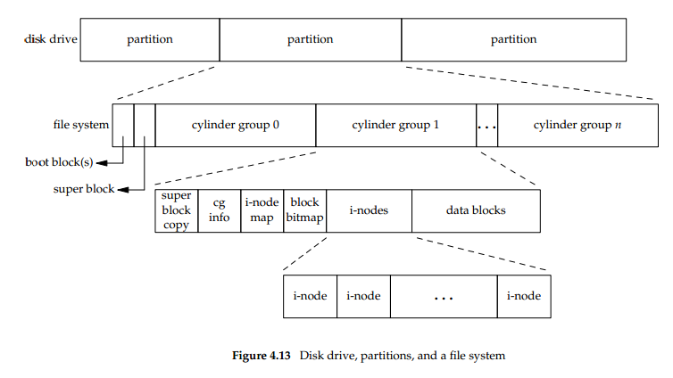

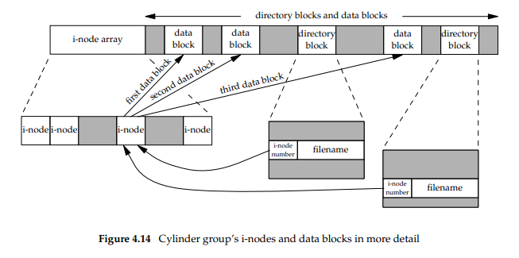

- 图中有两上目录项指向同一个i节点，每一个i节点都有一个链接计数，其值指向该i节点的目录项数，只有当链接计数减少至0时，才可以删除该文件（释放该文件占用的数据块），所以，删除一个目录项称为`unlink`而不是`delete`的原因
- 在`stat`结构中，链接计数包含在`st_nlink`成员中，这种链接称为硬链接
- 另一种链接称为符号链接，该文件的实际内容（在数据块中）包含了该符号所指向的文件的名字，该i节点中的文件类型是`S_IFLNK`
- i节点包含了大多数与文件有关的信息：文件类型、文件访问权限位、文件长度、指向该文件所占用的数据块的指针等，`stat`结构中大多数信息都取自i节点，只有文件名和i节点编号（类型是`ino_t`）取自目录项
- 每个文件系统各自对它们的i节点进行编号，目录项中的i节点编号数指向同一文件系统中的相应i节点，不能使一个目录项指向另一个文件系统的i节点，这也是为什么`ln`命令不能跨越文件系统的原因
- 当不更换文件系统情况下为一个文件更名时，该文件的实际内容并未移动，只需构造一个指向现有i节点的新目录项，并解除与旧目录项的链接


对于目录文件的链接计数字段又如何？

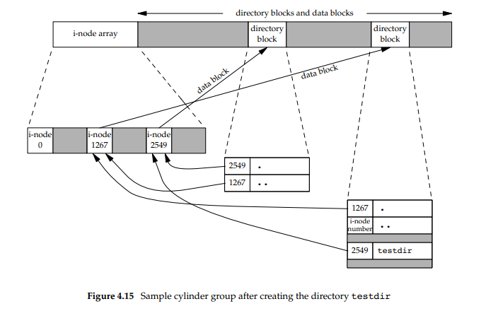

任何一个叶目录（不包含任何其他目录的目录）的链接计数总是2，一个是命名该目录的目录项，另一个是该目录项中`.`项，如果包含子目录，则链接计数至少为3，多一个子目录，子目录中的`..`项，使父目录的链接计数增1

## link/linkat/unlink/unlinkat/remove/rename函数

```c
#include <unistd.h>
int link(const char *existingpath, const char *newpath);
int linkat(int efd,const char *existingpath, int nfd, const char *newpath, int flag);
//Both return: 0 if OK, −1 on error
```

```c
#include <unistd.h>
int unlink(const char * pathname );
int unlinkat(int fd, const char *pathname, int flag);
//Both return: 0 if OK, −1 on error
```

```c
#include <stdio.h>
int remove(const char * pathname );
//Returns: 0 if OK,−1 on error
```

- 创建目录项以及增加链接计数应当是个原子操作，大多数系统不允许对目录的硬链接
- 为了解除对文件的链接，必须对包含该目录项的目录具有写和执行权限，如果对该目录设置了粘住位，则对该目录必须具有写权限
- 当链接计数达到0时，该文件的内容才可被删除，另一个阻止删除文件夹的内容是，如果进程打开了该文件。
- 进程用`open/creat`创建一个文件，然后立即调用`unlink`，因为文件是打开的，所以不会将其内容删除，只有当进程关闭该文件或终止时，该文件内容才会被删除，这种性质经常被程序用来确保即使在该程序崩溃时，它所创建的临时文件也 __不会遗留__ 下来(但如果此时突然断电，其实文件还是没有被删除，但又不存在路径，开机检查程序就是解决这类问题的)
> 但如果断电了，还是会存在没有path的文件，这时，开机文件检查就是解决类似问题的
- 如果是符号链接，那么`unlink`删除该符号链接，而不会删除由该链接所引用的文件，在给出符号链接名情况下，没有一个函数能直接删除由该链接所引用的文件
- `remove`函数，对于文件与`unlink`相同，对于目录与`rmdir`相同


## rename/renameat函数
```c
#include <stdio.h>
int rename(const char * oldname, const char *newname );
int renameat(int oldfd, const char *oldname, int newfd, const char *newname );
//Both return: 0 if OK, −1 on error
```

- 如果`oldname`指的是一个文件而不是目录，那么为该文件或符号链接更名，如果`newname`已存在（不能引用一个目录），先将该目录项删除，然后将`oldname`更名为`newname`，对于包含新旧文件的目录，调用进程必须具有写权限
- 如果`oldname`指的是目录，那么为该目录更名，如果`newname`已存在，必须引用一个目录，且目录为空目录，先将其删除，然后将`oldname`更名为`newname`，另，当为一个目录更名时，`newname`不能包含`oldname`作为其路径前缀
- 如果引用符号链接，则处理符号链接本身，而不是它所引用的文件


## 符号链接
硬链接指向文件i节点，而符号链接指向一个文件的间接指针，它避开了硬链接的一些限制：

- 硬链接通常要求链接和文件位于同一文件系统中
- 只有超级用户才能创建指向目录的硬链接

当使用以名字引用文件的函数时，需要了解该函数是否处理符号链接，也就是函数是否跟随符号链接到达它所链接的文件

```table
Function |Does not follow symbolic link |Follows symbolic link
---------|------------------------------|---------------------
access   |                              | •
chdir    |                              | •
chmod    |                              | •
chown    |                              | •
creat    |                              | •
exec     |                              | •
lchown   | •                            |
link     |                              | •
lstat    | •                            |
open     |                              | •
opendir  |                              | •
pathconf |                              | •
readlink | •                            |
remove   | •                            |
rename   | •                            |
stat     |                              | •
truncate |                              | •
unlink   | •                            |
```

`mkdir/mkinfo/mknod/rmdir`当路径名是符号链接时，都出错返回，`chown`是否跟随符号链接取决于实现（目前都跟随）

同时`O_CREAT`和`O_EXCL`调用`open`时，若路径名引用符号链接，将出错返回，并将`errno`设置为`EEXIST`

```shell
$ ln -s /no/such/file myfile
$ ls myfile
myfile
$ cat myfile
cat: myfile: No such file or directory
$ ls -l myfile
lrwxrwxrwx 1 sar 13 Jan 22 00:26 myfile -> /no/such/file
```

## symlink/readlink函数
创建一个符号链接，并不要求实际路径已经存在，也不要求位于同一文件系统中

```c
#include <unistd.h>
int symlink(const char *actualpath, const char *sympath);
int symlinkat(const char *actualpath, int fd, const char *sympath);
//Both return: 0 if OK, −1 on error
```

```c
#include <unistd.h>
ssize_t readlink(const char* restrict pathname, char *restrict buf, size_t bufsize);
ssize_t readlinkat(int fd, const char* restrict pathname, char *restrict buf, size_t bufsize);
//Both return: number of bytes read if OK, −1 on error
```

此函数组合了`open`,`read`,`close`的所有操作，如果执行成功，返回读入`buf`字节数，`buf`中内容 __不以`null`终止__(没有尾0)

## 文件的时间
```table
Field   |Description                         |Example      |ls(1) option
--------|------------------------------------|-------------|---------------
st_atim |last-access time of file data       |read         | -u
st_mtim |last-modification time of file data |write        | default
st_ctim |last-change time of i-node status   |chmod, chown | -c
```

修改时间`st_mtim`是文件内容最后一次被修改的时间，更改状态时间`st_ctim`是该文件的i节点（更改文件的访问权限、用户ID、链接数等）最后一次被修改的时间

系统并不保存一个i节点的最后一次访问时间，所以`access/stat`函数并不更改这三个时间中的任一个

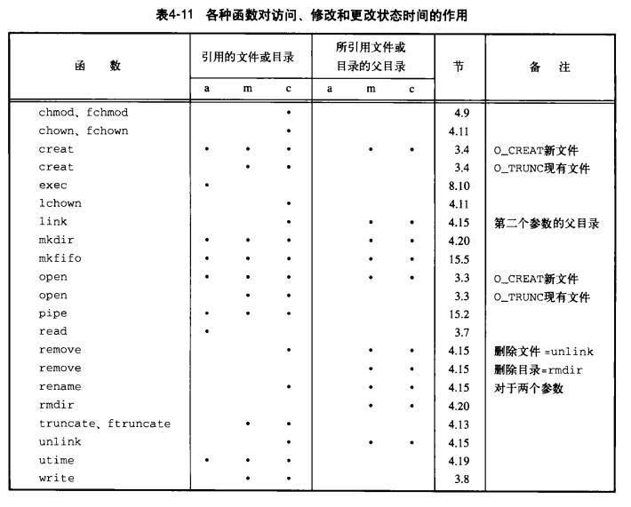

## futimens/utimensat/utimes函数
一个文件的访问和修改时间可用该函数，下面函数可以指定纳秒级精度的时间戳

```c
#include <sys/stat.h>
int futimens(int fd, const struct timespec times[2]);
int utimensat(int fd, const char *path, const struct timespec times[2], int flag);
//Both return: 0 if OK, −1 on error
```

`times`数组第一个元素包含访问时间，第二包包含修改时间

- 如果`times`参数是一个空指针，则访问时间和修改时间两者设置为当前时间
- 如果`times`参数某一元素中的`tv_nsec`字段的值为`UTIME_NOW`，相应的时间戳为当前时间，忽略`tv_sec`
- 如果`times`参数某一元素中的`tv_nsec`字段的值为`UTIME_OMIT`，相应的时间戳不变，忽略`tv_sec`
- 除维持时间戳不变，即`times`的两个元素中的`tv_nsec`字段的值均为`UTIME_OMIT`，否则，要么为超级用户进程，要么进程的有效用户ID等于该文件的所有者ID，则该进程对该文件必须具有写权限


```c
#include <sys/time.h>
int utimes(const char *pathname, const struct timeval times[2]);
//Returns: 0 if OK,−1 on error
```

我们不能对更改状态时间`st_ctim`指定一个值，当调用`utime`函数时，此字段将被自动更新

> `touch(1)`会修改`st_atim`和`st_mtim`，不会修改`st_ctim`

## mkdir/mkdirat/rmdir函数
```c
#include <sys/stat.h>
int mkdir(const char *pathname, mode_t mode);
int mkdirat(int fd, const char *pathname, mode_t mode);
//Both return: 0 if OK, −1 on error
```

所指定的文件访问权限mode，由进程的文件模式mask修改

```c
#include <unistd.h>
int rmdir(const char *pathname);
//Returns: 0 if OK,−1 on error
```

如果调用此函数使目录的链接计数成0，并且也没有其它进程打开此目录，则释放占用的空间。为了执行成功，目录必须是空的

## 读目录
为了防止文件系统产生混乱，只有内核才能写目录。一个目录的写权限位和执行权限位，并不代表能否写目录本身

```c
#include <dirent.h>
DIR *opendir(const char *pathname );
DIR *fdopendir(int fd );
//Both return: pointer if OK, NULL on error
struct dirent *readdir(DIR * dp);
//Returns: pointer if OK,NULL at end of directory or error
void rewinddir(DIR *dp);
int closedir(DIR * dp);
//Returns: 0 if OK,−1 on error
long telldir(DIR * dp);
//Returns: current location in directory associated with dp
void seekdir(DIR * dp,long loc);
```

## chdir/fchdir/getcwd函数
```c
#include <unistd.h>
int chdir(const char *pathname );
int fchdir(int fd );
//Both return: 0 if OK, −1 on error
```

当前工作目录是进程的一个属性，它只影响调用`chdir`的进程本身，而不影响其他进程

如果`open`或`creat`创建已经存在的文件，则该文件的访问权限位不变

```c
#include <unistd.h>
char *getcwd(char *buf,size_tsize);
//Returns:bufif OK,NULLon error
```

取得当前工作目录的绝对路径

标准IO库
========
> 不要混用标准IO与底层IO，确保风格一致
## 流和FILE对象
流的定向决定了所读、写的字符是单字还是多字节的，当一个流最初被创建时，并没有定向，在其流上使用一个多字节IO函数（`wchar.h`），则将该流的定向设置为 __宽定向__ 的，如使用一个单字节IO函数，则将该流的定向设置为 __字节定向__ 的。`freopen()`清除一个流的定向，`fwide()`设置流的定向

```c
#include <stdio.h>
#include <wchar.h>
int fwide(FILE *fp, int mode);
//Returns: positive if stream is wide oriented,
//negative if stream is byte oriented,
//or 0 if stream has no orientation
```

- `mode`为负，试图使指定的流是字节定向的
- `mode`为正，试图使指定的流是宽定向的
- `mode`为0，不试图设置流的定向，但返回该流定向的值

`fwide`并不改变 __已__ 定向流的定向，而且它无出错返回，唯一可靠是，调用它前，清除了`errno`，执行后，检查`errno`

## 缓冲
- 全缓冲，在填满标准IO缓冲区后才进行实际IO操作，对于驻留在磁盘上的文件通常是由标准IO实施全缓冲的，缓冲区可由标准IO例程自动冲洗，或者调用`fflush`冲洗一个流
- 行缓冲，在这种情况下，在输入和输出中遇到换行符时，标准IO库执行IO操作，允许我们一次输出一个字符（`fputc`），但只有在写了一行之后才进行实际IO操作。__当流涉及一个终端时（标准输入和标准输出），通常使用行缓冲__，或者认为行缓冲，只对终端有效
> 行缓冲有两个限制，第一，因为标准IO库用来收集每一行的缓冲区的长度是固定的，只要填满了缓冲区，即使还没有写一个换行符，也进行IO操作；第二，任何时候只要通过标准IO库要求从一个不带缓冲的流，或一个行缓冲的流且要求从内核得到输入数据，那么会造成冲洗所有行缓冲输出流
- 不带缓冲，如标准IO中`fputs`写15个字符到不带缓冲的流中。标准出错流`stderr`通常是不带缓冲的

ISO C缓冲特征：

- 当且仅当标准输入和标准输出并不涉及交互式设备时，它们才是会缓冲的
- 标准出错不带缓冲的
- 若涉及终端设备的其他流，则它们是行缓冲的，否则是全缓冲的

```c
#include <stdio.h>
void setbuf(FILE *restrict fp, char *restrict buf );
int setvbuf(FILE *restrict fp, char *restrict buf, int mode, size_t size);
//Returns: 0 if OK, nonzero on error
```

mode参数：

- `_IOFBF`全缓冲
- `_IOLBF`行缓冲
- `_IONBF`不带缓冲

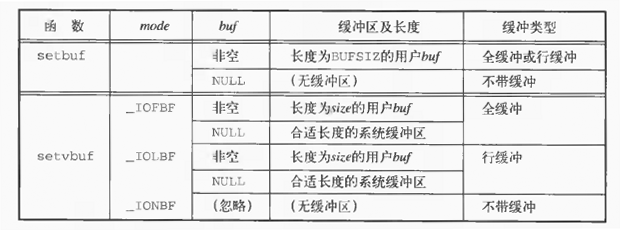

一般而言，应由系统选择缓冲区的长度，并自动分配缓冲区，在此情况下关闭此流时，标准IO库将自动释放缓冲区

```c
#include <stdio.h>
int fflush(FILE *fp);
//Returns: 0 if OK,EOF on error
```

此函数使该流所有未写的数据都被传送至内核，如果`fp`是`NULL`，则此函数将导致所有输出流被冲洗

## 打开流
```c
#include <stdio.h>
FILE *fopen(const char *restrict pathname, const char *restrict type);
FILE *freopen(const char *restrict pathname, const char *restrict type, FILE *restrict fp);
FILE *fdopen(int fd, const char *type);
//All three return: file pointer if OK,NULL on error
```

- `fopen`打开一个指定的文件
- `freopen`在一个指定的流上打开一个指定的文件，如流已打开，则先关闭该流，如流已定向，则清除该定向。此函数一般用于将一个指定的文件打开为一个预定义的流：标准输入、标准输出或标准出错
- `fdopen`获取一个现有的文件描述符(`open/dup/fntl/pipe/socket...`)，并使一个标准的IO流与该描述符相结合。常用于由创建管道和网络通信通道函数返回的描述符，因为这些特殊文件不能用标准的`fopen`打开

```table
type              |open(2) Flags                 |Description
------------------|------------------------------|---------------
r or rb           |`O_RDONLY`                    |open for reading
w or wb           |`O_WRONLY｜O_CREAT｜O_TRUNC ` |truncate to 0 length or create for writing
a or ab           |`O_WRONLY｜O_CREAT｜O_APPEND` |append; open for writing at end of file, or create for writing
r+ or r+b or rb+  |`O_RDWR`                      |open for reading and writing
w+ or w+b or wb+  |`O_RDWR｜O_CREAT｜O_TRUNC`    |truncate to 0 length or create for reading and writing
a+ or a+b or ab+  |`O_RDWR｜O_CREAT｜O_APPEND`   |open or create for reading and writing at end of file
```

对于`fdopen`为`tyep="wb"`而打开，并不截短该文件，`type="a"`也不会创建文件

当添写类型打开一文件后，则每次都将数据写到文件的当前尾端处，多个进程打开了同一文件，每个进程的数据都将正确的写到文件中

当 __读和写__ 打开一个文件时，即`type`中有`+`时:

- 如果中间没有`fflush/fseek/fsetpos/rewind`，则在输出的后面不能直接跟随输入
- 如果中间没有`fseek/fsetpos/rewind`，或者一个输入操作没有到达文件尾端，则在输入之后不能直接跟参输出

```table
Restriction                          |r  |w  |a   |r+  |w+  |a+
-------------------------------------|---|---|----|----|----|-----
file must already exist              |•  |   |    |•   |    |
previous contents of file discarded  |   |•  |    |    |•   |
stream can be read                   |•  |   |    |•   |•   |•
stream can be written                |   |•  |•   |•   |•   |•
stream can be written only at end    |   |   |•   |    |    |•
```

在指定`w/a`类型创建一个新文件时，无法说明该文件的访问权限位（`open/creat`则能做到）

若流引用终端设备，则流是行缓冲的，否则按系统默认的情况，流被打开时是全缓冲的，有需要，可通过`setbuf/setvbuf`改变缓冲的类型

```c
#include <stdio.h>
int fclose(FILE *fp );
//Returns: 0 if OK,EOF on error
```

在该文件被关闭之前，冲洗缓冲区的输出数据，丢弃缓冲区的任何输入数据，如果标准IO为流`malloc`了一人缓冲区，则释放此缓冲区

当一个进程正常终止时（调用`exit`或从`main`返回），则所有带未写缓冲数据的标准IO流都会被冲洗，所有打开的标准IO流都会被关闭

## 读和写流

- 每次一个字符的IO，如果流是带缓冲的，则标准IO会处理所有缓冲
- 每次一行的IO，使用`gfets/fputs`，当调用`fgets`，应能说明处理的最大行长
- 直接IO，`fread/fwrite`

### 输入函数
```c
#include <stdio.h>
int getc(FILE *fp );
int fgetc(FILE *fp );
int getchar(void);
//All three return: next character if OK,EOF on end of file or error
```

`getchar`等价于`getc(stdin)`，`getc`可被实现为宏，而`fgetc`则是函数，后者可以作为参数传参

不管是出错还是到达文件尾端，这三个函数都返回同样的值`EOF`，为了区分这两种不同情况，必须调用`ferror/feof` 

```c
#include <stdio.h>
int ferror(FILE *fp);
int feof(FILE *fp);
//Both return: nonzer o(true) if condition is true, 0 (false) otherwise
void clearerr(FILE *fp);
```

```c
#include <stdio.h>
int ungetc(int c, FILE *fp);
//Returns: c if OK, EOF on error
```

回送的字符不必是上一次读到的字符，不能回送`EOF`，已到达文件尾端时，仍可以回送一字符，下次读将返回该字符，再次读则返回`EOF`

> `ungetc`并没将字符写到文件中设备中，只写回标准IO的流缓冲区中

### 输出函数
```c
#include <stdio.h>
int putc(int c, FILE *fp);
int fputc(int c, FILE *fp);
int putchar(int c);
//All three return:c if OK, EOF on error
```

同理，`putchar(c)`等价于`putc(c, stdout)`，`putc`可实现为宏，而`fputc`则为函数

## 每次一行IO
```c
#include <stdio.h>
char *fgets(char *restrict buf, int n, FILE *restrict fp);
char *gets(char *buf);
//Both return:buf if OK, NULL on end of file or error
```

对于`fgets`，必须指定缓冲区的长度`n`，一直读到下一个换行符为止，但不超过`n-1`个字符，缓冲区以`null`字符结尾，若该行（包括换行符）的字符数超过`n-1`，则返回一个不完整的行，下次调用继续读该行

`gets` __不推荐__ 使用，容易造成缓冲区溢出，与`fgets`另一个区别是，它不将换行符存入缓冲区中

```c
#include <stdio.h>
int fputs(const char *restrict str, FILE *restrict fp);
int puts(const char *str);
//Both return: non-negative value if OK, EOF on error
```

`fputs`将一个`null`符终止的字符串写到指定的流，尾端`null`不写出，通常`null`之前是一个换行符

`puts`会自动将换行符写到标准输出，也 __不推荐__ 使用，推荐总是使用`fgets/fputs`，手工处理换行符(`fgets`会得到换行符[超出缓冲区时，不会有换行符]，而`fputs`将原样输出到文件，换行时，需要手工加上)

## 标准IO的效率

如果`fgets/fputs`是用`getc/putc`实现的，那么，可以预期`fgets`版本的时间会和`getc`相接近，但`fgets`是用`memccpy`（使用汇编）实现的，会有较高的速度


## 二进制IO
```c
#include <stdio.h>
size_t fread(void *restrict ptr, size_t size, size_t nobj, FILE *restrict fp);
size_t fwrite(const void *restrict ptr, size_t size, size_t nobj, FILE *restrict fp);
//Both return: number of objects read or written
```

> 注意，返回的是number of objects，而不同于`read/write`返回的是字节数

在一个系统上写的数据，要在另一个系统上进行处理，可能不能正常工作：

- 在一个结构中，同一成员的偏移量可能因编译器和系统而异：如紧密包装、内存对齐
- 用来存储多字节整数和浮点值的二进制格式在不同机器体系结构间也可能不同

## 定位流
- `ftell/fseek`，假定文件的位置可以存放在一个长整型中
- `ftello/fseeko`，使用`off_t`数据类型代替了长整型
- `fgetpos/fsetpos`，使用一个抽象数据类型`fpos_t`记录文件的位置，移植到非UNIX系统上应当使用它

```c
#include <stdio.h>
long ftell(FILE *fp );
//Returns: current file position indicator if OK, −1L on error
int fseek(FILE *fp, long offset,int whence );
//Returns: 0 if OK,−1 on error
void rewind(FILE * fp );
```

> `fseek`只会返回是否成功，而`lseek`还会告诉当前位置

```c
#include <stdio.h>
off_t ftello(FILE *fp );
//Returns: current file position indicator if OK, (off_t)−1 on error
int fseeko(FILE *fp, off_t offset,int whence );
//Returns: 0 if OK,−1 on error
```

```c
#include <stdio.h>
int fgetpos(FILE *restrict fp, fpos_t *restrictpos);
int fsetpos(FILE * fp, const fpos_t * pos);
//Both return: 0 if OK, nonzero on error
```

## 格式化IO
### 格式化输出

```c
#include <stdio.h>
int printf(const char *restrict format, ...);
int fprintf(FILE *restrict fp, const char *restrict format, ...);
int dprintf(intfd, const char *restrict format, ...);
//All three return: number of characters output if OK, negative value if output error
int sprintf(char *restrict buf,const char *restrict format, ...);
//Returns: number of characters stored in array if OK, negative value if encoding error
int snprintf(char *restrict buf,size_tn, const char *restrictformat, ...);
//Returns: number of characters that would have been stored in array
//if buffer was large enough, negative value if encoding error
```

`sprintf`在数组的尾端自动加一个`null`字节，但该字节不包括在返回值中。该函数有可能造成`buf`指向的缓冲区的溢出，调用者有责任确保该缓冲区足够大

`snprintf`解决缓冲区溢出问题，缓冲区长度是一个显式参数，超过的任何字符都会被丢弃，返回的是写入缓冲区的字符数，同上，不包括`null`字节，若发生错误，则返回负值

`%[flags][fldwidth][precision][lenmodifier]convtype`

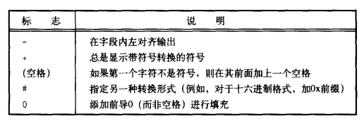

- `fldwidth`说明转换的最小字段宽度，字符少时用空格填充它，是一个非负十进制数，或一个星号(`*`，占位符，具体值由后续的参数给出)
- `precision`说明整型转换后最小输出数字位数、浮点数转换后小数点后的最少位数、字符转换后的最大字符数。精度是一个句点(`.`)，后接一个可选的非负十进制整数或一个星号(`*`)
- 宽度和精度字段两者皆可为`*`，此时，一个整型参数指定宽度或精度的值。该整型参数正好位于被转换的参数之前
- `lenmodifier`说明参数长度

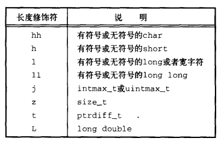

- `convtype`是必选的，它控制如何解释参数

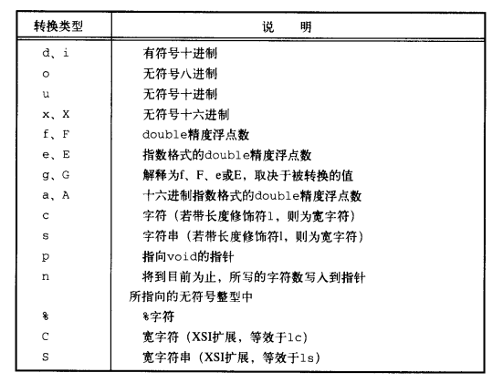

下面是变体，可变参数代换成了`arg`

```c
#include <stdarg.h>
#include <stdio.h>
int vprintf(const char *restrict format, va_list arg);
int vfprintf(FILE *restrict fp, const char *restrict format, va_list arg);
int vdprintf(int fd, const char *restrict format, va_list arg);
//All three return: number of characters output if OK, negative value if output error
int vsprintf(char *restrict buf,const char *restrict format, va_list arg);
//Returns: number of characters stored in array if OK, negative value if encoding error
int vsnprintf(char *restrict buf,size_tn, const char *restrictformat, va_list arg);
//Returns: number of characters that would have been stored in array
//if buffer was large enough, negative value if encoding error
```

### 格式化输入

```c
#include <stdio.h>
int scanf(const char *restrict format ,...);
int fscanf(FILE *restrict fp ,const char *restrict format ,...);
int sscanf(const char *restrict buf,const char *restrict format ,...);
//All three return: number of input items assigned,
//EOF if input error or end of file beforeany conversion
```

除转换说明和空白字符外，格式字符串中的其他字符必须与输入匹配，若有一个字符不匹配，则停止后续处理，不再读入输入的其余部分

> 应该使用`fgets`和`sscanf`来代替`scanf`，后者有缓冲区溢出风险

`%[*][fldwidth][lenmodifier]convtype`

- `*`用于抑制转换，按照转换说明的其余部分对输入进行转换，但转换结果并不存放在参数中
- `fldwidth`说明最大宽度
- `lenmodifier`说明要用转换结果初始化的参数大小，同输出函数的长度修饰符
- `convtype`类似输出函数，但还有些差别，如存储在无符号类型中的结果可输入时带上符号，如-1可被转换成4294967295赋予无符号整型变量

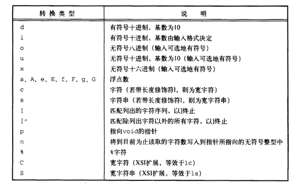

支持的可变参数

```c
#include <stdarg.h>
#include <stdio.h>
int vscanf(const char *restrict format ,va_list arg);
int vfscanf(FILE *restrict fp ,const char *restrict format ,va_list arg);
int vsscanf(const char *restrict buf,const char *restrict format ,va_list arg);
//All three return: number of input items assigned,
//EOF if input error or end of file beforeany conversion
```

## 实现细节
对一个流调用`fileno()`得到其描述符

```c
#include <stdio.h>
int fileno(FILE *fp);
//Returns: the file descriptor associated with the stream
```

在打印缓冲状态信息之前，需要对每个流执行IO操作，第一个IO操作通常就造成为该流分配缓冲。结构体成员`_IO_file_flags/_IO_buf_base/_IO_buf_end/_IO_UNBUFFERED/_IO_LINE_BUFFERED`由GUN标准IO库定义的

当标准输入、输出连至终端时，它们是行缓冲的，长度是1024，当重定向到普通文件时，则变成全缓冲的，长度是`stat.st_blksize`(4096)

## 临时文件

```c
#include <stdio.h>
char *tmpnam(char *ptr);
//Returns: pointer to unique pathname
FILE *tmpfile(void);
//Returns: file pointer if OK, NULL on error
```

`tmpnam`不是原子操作，不建议使用

若`ptr`是`NULL`，则所产生的路径名存放在一个静态区，并将指向该静态区的指针返回，下一次调用时，会 __重写__ 该静态区（想保存路径名，则应保存路径名的副本），若不是`NULL`，则认为它指向长度至少是`L_tmpnam`个字符的数组，所产生的路径名存放在该数组中，`ptr`也作为函数值返回。

`tmpfile`创建一个临时二进制文件（类型`wb+`），在关闭该文件或程序结束将自动删除这种文件

```c
#include <stdlib.h>
char *mkdtemp(char *template );
//Returns: pointer to directory name if OK,NULL on error
int mkstemp(char * template );
//Returns: file descriptor if OK,−1 on error
```

与`tempfile`不同，它们所创建的临时文件不会自动删除(需要手工`unlink`)，`tmpnam/tempnam`不足之处是，在返回唯一路径名和应用程序用该路径创建文件之间有一个时间窗口，不同进程可能创建同名文件，而`mkstemp`不会产生此问题

## 内存流
目前只有linux 3.2.0支持内存流

```c
#include <stdio.h>
FILE *fmemopen(void *restrict buf,size_t size, const char *restrict type);
//Returns: stream pointer if OK,NULLon error
```

如果`buf`为空，则函数分配`size`字节的缓冲区，当流关闭时，缓冲区被释放

```table
type             | Description
-----------------|------------
r or rb          | open for reading
w or wb          | open for writing
a or ab          | append; open for writing at first null byte
r+ or r+b or rb+ | open for reading and writing
w+ or w+b or wb+ | truncate to 0 length and open for reading and writing
a+ or a+b or ab+ | append; open for reading and writing at first null byte
```

`type`参数取值与标准IO类似，但有微小差别：

- 无论何时以追加写方式打开内存流时，当前文件位置为缓冲区中的第一个null字节，如果不存在null字节，则当前位置就设为缓冲区结尾的后一个字节
> 内存流不适合存储二进制数据（适合字符串），二进制数据在数据尾端之前就可以包含多个null字节
- 当流并不是以追加写方式打开时，当前位置为缓冲区的开始位置
- 如果`buf`参数是一个null指针，打开流进行读或写没有任何意义，无法找到缓冲区地址，只写打开流，意味着无法再读了，只读方式打开意味着只能读取那些无意义的数据
- 任何时候需要增加流缓冲区的数据量，以及调用`fclose/fflush/fseek/fseeko/fsetpos`时，都会在当前位置写入一个null字节

用于创建内存流的另外两个函数，一个是面向字节的，另一个是面向宽字节的

```c
#include <stdio.h>
FILE *open_memstream(char **bufp,size_t *sizep);
#include <wchar.h>
FILE *open_wmemstream(wchar_t **bufp,size_t *sizep);
//Both return: stream pointer if OK,NULLon error
```

- 创建的流只能写打开
- 不能指定自己的缓冲区，但可通过`bufp`和`sizep`参数访问缓冲区地址和大小
- 关闭流后需要自行释放缓冲区
- 对流添加字节会增加缓冲区大小
- 缓冲区地址和长度只有在调用`fclose/fflush`后才有效，这些值只有在下一次流写入或调用`fclose`前才有效（因为缓冲区可以增长，可能需要重新分配）


系统数据文件和信息
===============
## 口令文件
`<pwd.h>`中定义的`passwd`结构

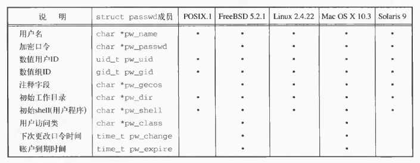

> 初始shell或登录shell，只是通用叫法，真实的叫法，应该是登录后第一个程序

为了阻止一个特定用户登录系统:

- 使用`/dev/null`作为登录shell，如`squid`用户，它是一个设备（很多服务对帮助它们得以实现的不同守护进程使用不同的用户ID，`squid`项为实现squid代理缓冲服务而设置的），阻止任何人以该用户名义登录到系统
- 将`/bin/false`用作登录shell，将以不成功（非0）状态终止，该shell将此种终止状态判断为假
- 将`/bin/true`禁止一个账户，将以成功（0）状态终止
- 某此系统提供`nologin`命令，打印可自定义的出错信息，然后以非0状态终止

`nobody`用户名的目的是，使任何人都可登录至系统，但其用户和组不提供任何特权

POSIX.1定义了两个获取口令文件项的函数，在给出用户登录名或数值用户ID后，这两个函数就能查询相关项

```c
#include <pwd.h>
struct passwd *getpwuid(uid_t uid);
struct passwd *getpwnam(const char *name);
//Both return: pointer if OK, NULL on error
```

`getpwuid`由`ls(1)`使用，它将i节点中的数值用户ID映射为用户登录名；`getpwnam`由`login(1)`使用

__如果返回的是指针类型，并且不需要手工释放的（可能存在静态区），请不要保留该指针，再次调用时，有可能改变上次指针所指内容（ *被覆盖* ）。如`tmpnam`，`getpwent`，`getpwuid`等，甚至是`gmtime/localtime`等，需要保持原因指针内容时，需要用到`memcpy`。__

<!-- run -->

```c
#include <sys/types.h>
#include <pwd.h>

#include <stdio.h>

int main(void){
    struct passwd *pwd;
    struct passwd *pwd2;

    pwd = getpwuid(0);
    pwd2 = getpwuid(1);

    printf("%p %p\n", pwd, pwd2); // same
    return 0;
}
```

如果需要查看整个口令文件，下面函数用于此目的

```c
#include <pwd.h>
struct passwd *getpwent(void);
//Returns: pointer if OK,NULL on error or end of file
void setpwent(void);
void endpwent(void);
```

`getpwent`返回口令文件中的下一个记录项，返回一个由它填写好的结构的指针，每次调用都重写该结构。在第一次调用它时，它打开所使用的各个文件。

`setpwent`rewind它所使用的文件（定位到文件开始处），`endpwent`则关闭这些文件

一个`getpwnam`实现

```c
#include <pwd.h>
#include <stddef.h>
#include <string.h>

struct passwd *
getpwnam(const char *name){
    struct passwd *ptr;
    setpwent();
    while ((ptr = getpwent()) != NULL)
        if (strcmp(name, ptr->pw_name) == 0)
            break;  /* found a match */
    endpwent();
    return(ptr);  /* ptr is NULL if no match found */
}
```

`getpwnam/getpwuid`调用完成后不应使有关文件仍处于打开状态，所以应调用`endpwent`关闭它们


## 阴影口令
`etc/shadow`文件中的字段

```table
Description                             | struct spwd member
----------------------------------------|------------------
user login name                         | char *sp_namp
encrypted password                      | char *sp_pwdp
days since Epoch of last password change| int  sp_lstchg
days until change allowed               | int  sp_min
days before change required             | int  sp_max
days warning for expiration             | int  sp_warn
days befor eaccount inactive            | int  sp_inact
days since Epoch when account expires   | int  sp_expire
reserved                                | unsigned int sp_flag
```

用于访问阴影口令文件的函数

```c
#include <shadow.h>
struct spwd *getspnam(const char *name);
struct spwd *getspent(void);
//Both return: pointer if OK, NULL on error
void setspent(void);
void endspent(void);
```

## 组文件
`/etc/group`中字段

```table
Description       |struct group member|POSIX.1|FreeBSD 8.0|Linux 3.2.0|Mac OS X 10.6.8|Solaris 10
------------------|-------------------|-------|----------|----------|--------------|---------
group name        | char  *gr_name    |•      |•         |•         |•             |•
encrypted password| char  *gr_passwd  |       |•         |•         |•             |•
numerical group ID| int  gr_gid       |•      |•         |•         |•             |•
array of pointers to individual user names| char **gr_mem |•|•|•    |•             |•
```

下面的函数来查看属于组名或数值组ID

```c
#include <grp.h>
struct group *getgrgid(gid_t gid);
struct group *getgrnam(const char *name);
//Both return: pointer if OK, NULL on error
```

如需搜索整个组文件，则需要另外几个函数

```c
#include <grp.h>
struct group *getgrent(void);
//Returns: pointer if OK,NULL on error or end of file
void setgrent(void);
void endgrent(void);
```

## 附加组ID
执行`newgrp(1)`，将组ID更改为新的组ID，不带参数则返回原来的组，创建的文件的gid则为切换后的

不仅可以属于口令文件记录项中组ID所对应的组，也可属于多达16个另外的组，文件访问权限也为：不仅将进程的有效组ID与文件的组ID相比较，而且也将所有附加组ID与文件的组ID进行比较

使用附加组则不必显式的经常更改组

```c
#include <unistd.h>
int getgroups(int gidsetsize ,gid_t grouplist []);
//Returns: number of supplementary group IDs if OK,−1 on error
#include <grp.h> /* on Linux */
#include <unistd.h> /* on FreeBSD, Mac OS X, and Solaris */
int setgroups(int ngroups,const gid_tgrouplist []);
#include <grp.h> /* on Linux and Solaris */
#include <unistd.h> /* on FreeBSD and Mac OS X */
int initgroups(const char *username ,gid_t basegid );
//Both return: 0 if OK, −1 on error
```

作为一个特例，若`gidsetsize`为0，则函数只返回附加组数，而对数组`grouplist`不作修改，使调用者可以确定`grouplist`的长度

后两个是特权操作，只有超级用户才能调用，`login(1)`在用户登录时调用该函数


## 实现的区别
```table
Information           | FreeBSD 8.0        | Linux 3.2.0 | Mac OS X 10.6.8   | Solaris 10
----------------------|--------------------|-------------|-------------------|------------
account information   | /etc/passwd        |/etc/passwd  |Directory Services |/etc/passwd
encrypted passwords   | /etc/master.passwd |/etc/shadow  |Directory Services |/etc/shadow
hashed passwordfiles? | yes                |no           |no                 |no
group information     | /etc/group         |/etc/group   |Directory Services |/etc/group
```

## 其他数据文件
```table
Description |Data file      |Header     |Structure |Additional keyed lookup functions
------------|---------------|-----------|----------|----------------------------------
passwords   |/etc/passwd    | pwd.h     |passwd    |getpwnam, getpwuid
groups      |/etc/group     | grp.h     |group     |getgrnam, getgrgid
shadow      |/etc/shadow    | shadow.h  |spwd      |getspnam
hosts       |/etc/hosts     | netdb.h   |hostent   |getnameinfo,  getaddrinfo
networks    |/etc/networks  | netdb.h   |netent    |getnetbyname, getnetbyaddr
protocols   |/etc/protocols | netdb.h   |protoent  |getprotobyname, getprotobynumber
services    |/etc/services  | netdb.h   |servent   |getservbyname, getservbyport
```

## 登录账户记录
`utmp`文件，记录当前登录进系统的各个用户；`wtmp`跟踪各个登录和注销事件

```c
struct utmp {
    char  ut_line[8]; /* tty line: "ttyh0", "ttyd0", "ttyp0", ... */
    char  ut_name[8]; /* login name */
    long  ut_time; /* seconds since Epoch */
};
```

登录时，`login`程序填写`utmp`结构，然后写入到`/var/run/utmp`文件中，同时也将其添写到`var/log/wtmp`文件中，注销时，`init`进程将`utmp`文件中相应的记录擦除（每个字节都填0），并将一个新记录添写到`wtmp`文件中，在`wtmp`文件注销记录中，将`ut_name`字段清0。

在系统重新启动时，以及更改系统时间和日期的前后，都在`wtmp`文件中添写特殊的记录项。

`who(1)`读`utmp`文件，并以可读格式打印其内容，`last(1)`，读`wtmp`文件并打印所选择的记录

## 系统标识
`uname`函数，返回与当前主机和操作系统有关的信息

```c
#include <sys/utsname.h>
int uname(struct utsname *name);
//Returns: non-negative value if OK,−1 on error

struct utsname {
    char  sysname[]; /* name of the operating system */
    char  nodename[]; /* name of this node */
    char  release[]; /* current release of operating system */
    char  version[]; /* current version of this release */
    char  machine[]; /* name of hardware type */
};
```

`utsname`结构中的信息，通常可用`uname(1)`打印

`gethostname`函数，返回主机名，通常是TCP/IP网络上主机的名字

```c
#include <unistd.h>
int gethostname(char *name,int namelen);
//Returns: 0 if OK,−1 on error
```

如果将主机连接到TCP/IP网络中，主机名通常是该主机的完全限定域名。

`hostname(1)`可以获取和设置主机名。主机名通常在系统自举时设置，由`/etc/rc`或`init`取自一个启动文件


## 时间和日期例程
UNIX内核提供的基本时间服务是计算国际标准时间公元19700101T00:00:00以来经过的秒数，以数据类型`time_t`表示

- 以国际标准时间而非本地时间计时
- 可自动进行转换，如变换到夏时制
- 将时间和日期作为一个量值保存

```c
#include <time.h>
time_t time(time_t *calptr);
//Returns: value of time if OK, −1 on error
```

时间值总是作为函数值，如果参数不为空，也存放在指针指向的单元内

POSXI.1扩展增加了对多个系统时钟的支持，时钟通过`clockid_t`类型进行标识：

```table
Identifier                 | Option                    | Description
---------------------------|---------------------------|-------------------
`CLOCK_REALTIME`           |                           | real system time
`CLOCK_MONOTONIC`          | `_POSIX_MONOTONIC_CLOCK`  | real system time with no negative jumps
`CLOCK_PROCESS_CPUTIME_ID` | `_POSIX_CPUTIME`          | CPU time for calling process
`CLOCK_THREAD_CPUTIME_ID`  | `_POSIX_THREAD_CPUTIME`   | CPU time for calling thread
```

`clock_gettime`用取获得指定时钟的时间，当`clock_id`为`CLOCK_REALTIME`时，与`time`函数功能相似，但精度更高

```c
#include <sys/time.h>
int clock_gettime(clockid_t clock_id,struct timespec *tsp);
//Returns: 0 if OK,−1 on error
```

`clock_getres`把参数`tsp`指向的结构初始化为与`clock_id`参数对应的时钟精度。

```c
#include <sys/time.h>
int clock_getres(clockid_t clock_id,struct timespec *tsp);
//Returns: 0 if OK,−1 on error
```

对特定时钟设置时间，需要适当的特权来更改时钟值，并且有些时钟是不能修改的

```c
#include <sys/time.h>
int clock_settime(clockid_t clock_id,const struct timespec *tsp);
//Returns: 0 if OK,−1 on error
```

与`time`相比，`gettimeofday`提供了微秒级，这对某些应用很重要，SUSv4中已弃用

```c
#include <sys/time.h>
int gettimeofday(struct timeval *restrict tp ,void *restrict tzp);
//Returns: 0 always
```

一旦取得这种以秒计的整型时间值后，通常要调用另一个时间函数将其转换为人可读的时间和日期

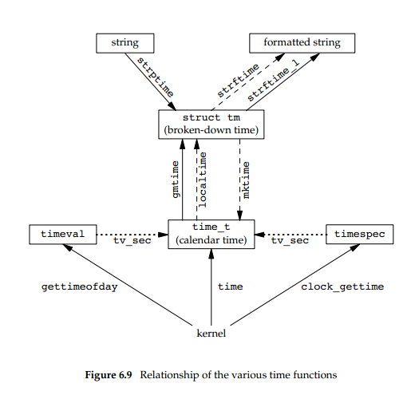

虚线表示的函数`localtime/mktime/strftime`等受到环境变量`TZ`影响

```c
#include <time.h>
struct tm *gmtime(const time_t *calptr);
struct tm *localtime(const time_t *calptr);
//Both return: pointer to broken-down time, NULL on error
```

`localtime`和`gmtime`将日历时间转换成以下结构，两者区别是，前者转换成本地时间并考虑夏时制，后者为国际标准时间

> 秒可以超过59表示润秒

```c
struct tm { /* a broken-down time */
    int  tm_sec; /* seconds after the minute: [0 - 60] */
    int  tm_min; /* minutes after the hour: [0 - 59] */
    int  tm_hour;  /* hours after midnight: [0 - 23] */
    int  tm_mday;  /* day of the month: [1 - 31] */
    int  tm_mon; /* months since January: [0 - 11] */
    int  tm_year;  /* years since 1900 */
    int  tm_wday;  /* days since Sunday: [0 - 6] */
    int  tm_yday;  /* days since January 1: [0 - 365] */
    int  tm_isdst; /* daylight saving time flag: <0, 0, >0 */
};
```

`mktime`以 __本地时间__ 的年月日作参数，转换成`time_t`值

```c
#include <time.h>
time_t mktime(struct tm *tmptr);
//Returns: calendar time if OK, −1 on error
```

下面函数用于定制产生字符串（`asctime/ctime`已弃用，易受缓冲区溢出问题而影响）

```c
#include <time.h>
size_t strftime(char *restrict buf, size_t maxsize,
                const char *restrict format ,
                const struct tm *restrict tmptr);
size_t strftime_l(char *restrict buf, size_t maxsize,
                  const char *restrict format,
                  const struct tm *restrict tmptr, locale_t locale);
//Both return: number of characters stored in array if room, 0 otherwise
```

`strftime_l`允许指定区域

格式化的结果放在一个长度为`maxsize`个字符的`buf`数组中，`format`是格式

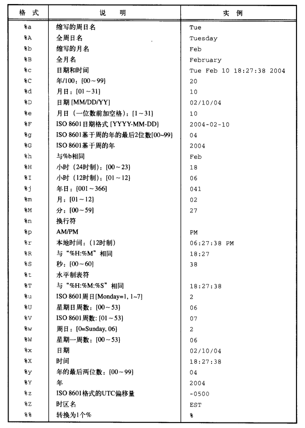

`strptime`则反过来，将字符串转换成时间

```c
#include <time.h>
char *strptime(const char *restrict buf,const char *restrict format, struct tm *restrict tmptr);
//Returns: pointer to one character past last character parsed,NULLotherwise
```

```table
Format  |Description
--------|------------
%a      |abbreviated or full weekday name
%A      |same as%a
%b      |abbreviated or full month name
%B      |same as%b
%c      |date and time
%C      |all but the last two digits of the year
%d      |day of the month: [01–31]
%D      |date[MM/DD/YY]
%e      |same as%d
%h      |same as%b
%H      |hour of the day (24-hour format): [00–23]
%I      |hour of the day (12-hour format): [01–12]
%j      |day of the year: [001–366]
%m      |month: [01–12]
%M      |minute: [00–59]
%n      |any white space
%p      |AM/PM
%r      |locale’s time (12-hour format, AM/PM notation)
%R      |time as%H:%M
%S      |second: [00–60]
%t      |any white space
%T      |time as%H:%M:%S
%U      |Sunday week number: [00–53]
%w      |weekday: [0 = Sunday,0–6]
%W      |Monday week number: [00–53]
%x      |locale’s date
%X      |locale’s time
%y      |last two digits of year: [00–99]
%Y      |year
%%      |translates to a percent sign
```

进程环境
=============

## main函数
当内核执行C程序时，使用一个`exec`函数，在调用`main`前先调用一个特殊的启动例程，可执行程序文件将此启动例程指定为程序的起始地址（由链接器设置的，而链接器则由C编译器调用）。启动例程从内核取得命令行参数和环境变量值，然后为调用`main`做好安排

## 进程终止
有8种方式使进程终止，前5种为正常终止

- 从`main`返回
- 调用`exit`
- 调用`_exit`或`_Exit`
- 最后一个线程从其启动例程返回
- 最后一个线程调用`pthread_exit`
- 调用`abort`
- 接到一个信号并终止
- 最后一个线程对取消请求做出响应

如果将启动例程以C代码表示（实际上为汇编），形式如下

```c
exit(main(argc, argv));
```

### 退出函数
`_exit`和`_Exit`立即进入内核，`exit`则先执行一些清理处理（包括调用执行各终止处理程序，关闭所有标准IO流等），然后进入内核

> 不要依赖`exit`的清理工作，应自己做好

> 关闭所有标准IO流，但并不会关闭文件描述符`STDOUT_FILENO`等

```c
#include <stdlib.h>
void exit(int status );
void _Exit(int status );
#include <unistd.h>
void _exit(int status );
```

前两者是ISO C说明的，后一个是POSIX.1说明的

调用这些函数时不带终止状态；`main`执行了一个无返回值的`return`；`main`没声明返回类型为整型，则该进程的终止状态是未定义的。但若`main`返回类型为整型，并且`main`执行到最后一条语句时返回，则认为终止状态为0

### atexit函数
```c
#include <stdlib.h>
int atexit(void (*func)(void));
//Returns: 0 if OK, nonzero on error
```

`exit`调用这些注册函数（终止处理程序）的顺序与它们登记时顺序相反，同一函数若登记多次，就执行多次

> `exit`或main的返回，会调用它，但`_exit/_Exit`是不会调用这些注册函数的

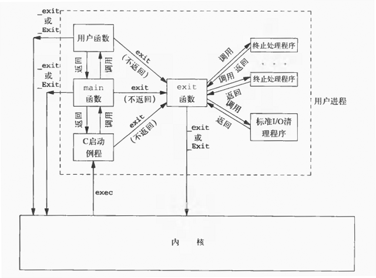

## 命令行参数
ISO C和POSIX.1均要求`argv[argc]`是一个空指针，可将参数处理循环写成：

```c
for (i = 0; argv[i] != NULL; i++)
```

> 命令行第一个参数，也是有用的，表明运行该程序时的名字，比如对该程序做了软链接，真实的程序在运行时，可以得到该软链接名，如busybox的应用


## 环境表
全局变量`environ`

```c
extern char **environ;
```

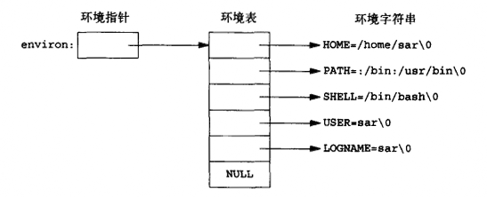

通常使用`getenv/putenv`来访问特定的环境变量，而不是用`environ`(除非遍历整个环境变量)

## C程序的存储空间布局
- Text segment，CPU执行的机器指指令部分，可共享，通常为只读
- Initialized data segment，也称数据段，程序中任何函数之外，需明确赋初值的变量
- Uninitialized data segment，也称bss段，函数外的变量声明，内核将此段中数据初始化为0或空指针
- Stack，自动变量以及每次函数调用时所需保存的信息
- Heap，通常在堆中进行动态存储分配，它位于bss和stack之间

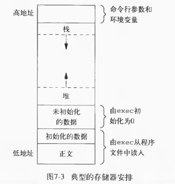

> 32位intel x86处理器上的linux，正文段从0x08048000单元开始，栈底则在0xC0000000之下开始

未初始化段内容并不存放在磁盘程序文件中，因为内核需要在程序开始运行前将它们都设置为0，需要存放在磁盘程序文件中的段只有正文段和初始化数据段

`size(1)`报告正文段、数据段和bss段的长度（以字节为单位）

## 共享库
动态链接，减少了执行文件的长度，但增加了一些运行时开销，这种开销发生在该程序第一次被执行，或每个共享库函数第一次被调用时。

共享库另一个优点是可以用库函数的新版本代替老版本，而无需对使用该库的程序重新链接编译

```shell
$gcc -static hello1.c    #prevent gcc from using shared libraries
$ls -l a.out
-rwxr-xr-x  1 sar  879443 Sep 2 10:39 a.out
$size a.out
text    data  bss    dec    hex    filename
787775  6128  11272  805175 c4937  a.out
```

```shell
$gcc hello1.c gcc       #defaults to use shared libraries
$ls -l a.out
-rwxr-xr-x  1 sar  8378 Sep 2 10:39 a.out
$size a.out
text  data  bss dec   hex  filename
1176  504   16  1696  6a0  a.out
```

### 静态库
```shell
ar -cr libxxx.a some.o
# ar r向库里添加模块，同名则覆盖replace
# ar x从库里提取模块，产生.o文件
# ar t察看库里的模块
# ar d删除模块

runlib libxxx.a

cp libxxx.a ~/lib

gcc main.c ~/lib/libxxx.a
gcc main.c -L~/lib -lxxx
```

### 动态库
```shell
#生成库
gcc -o libxxx.so -fpic -shared some.c
cp some.h /usr/local/include
cp libxxx.so /usr/local/lib
echo "/usr/local/lib">>/etc/ld.so.conf
/sbin/ldconfig

#如果是非root用户
cp libxxx.so ~/lib
export LD_LIBRARY_PATH=~/lib

#调用
gcc main.c -lxxx
ldd  #print shared library dependencies
```


## 存储空间分配
```c
#include <stdlib.h>
void *malloc(size_tsize);
void *calloc(size_tnobj,size_tsize);
void *realloc(void *ptr,size_tnewsize);
//All three return: non-null pointer if OK,NULL on error
void free(void *ptr);
```

这三个分配函数所返回的指针一定是适当对齐的，使其可用于任何数据对象，某些特定系统上，double必须8倍数地址单元处开始，那么这此函数返回的指针都应这样对齐

> 这些分配通常用`sbrk(2)`系统调用来实现
>
> 标准的`malloc`算法是最佳适配或首次适配，现在许多分配程序基于快速适配`auick-fit`
>
> `alloca`在当前函数的栈上分配存储空间，而不是堆中，当函数返回时，自动释放，缺点是增加了栈的长度

## 环境变量
```c
#include <stdlib.h>
char *getenv(const char *name);
//Returns: pointer to value associated with name,NULL if not found
```

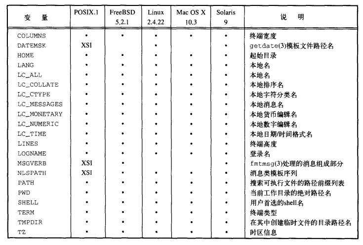

有时需要设置环境变量，虽然能影响的只是当前进程以及后生成和调用的任何子进程，不能影响父进程，但仍然很有用

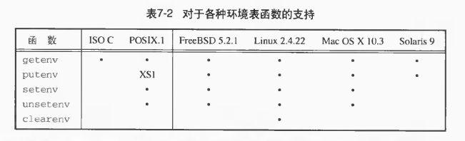

```c
#include <stdlib.h>
int putenv(char *str);
//Returns: 0 if OK, nonzero on error
int setenv(const char *name,const char *value,int rewrite);
int unsetenv(const char *name);
//Both return: 0 if OK,−1 on error
```

- `putenv`取形式`name=value`的字符串
- `setenv`会分配存储空间，但`putenv`自由的将传递给它的参数字符串直接放到环境中，因此 __将栈中字符串传递给它会出错__

## setjmp/longjmp函数
> 不推荐使用，优先使用返回值来判断是否异常

`setjmp/longjmp`对处理发生在很深层嵌套函数调用中的出错情况非常有用，在栈上跳过若干调用帧，返回到当前函数 __调用路径__ 上的某一个函数中

在希望返回到的位置调用`setjmp`，`longjmp`用于发生错误时调用，参数`val`为非零值，方便在`setjmp`时判断是谁发生了错误

当通过`longjmp`返回到的函数中，原先的变量是否恢复，大多数标准称它们的值为不确定。如果有一个自动变量，而 __不想使其回滚__，可定义为`volatile`（将不被优化而放到寄存器中），另外，声明为全局变量或静态变量的值，或使用`alloca`分配在当前栈中，在执行`longjmp`时保持不变

```c
#include <setjmp.h>
int setjmp(jmp_buf env);
//Returns: 0 if called directly,nonzero if returning from a call to longjmp
void longjmp(jmp_buf env,int val);
```

## getrlimit/setrlimit函数
查询和更改进程的资源限制

```c
#include <sys/resource.h>
int getrlimit(int resource,struct rlimit *rlptr);
int setrlimit(int resource,const struct rlimit *rlptr);
//Both return: 0 if OK,−1 on error
```

每一次调用都指定一个资源以及一个指向下列结构的指针

```c
struct rlimit {
  rlim_t  rlim_cur;  /* soft limit: current limit */
  rlim_t  rlim_max;  /* hard limit: maximum value for rlim_cur */
};
```

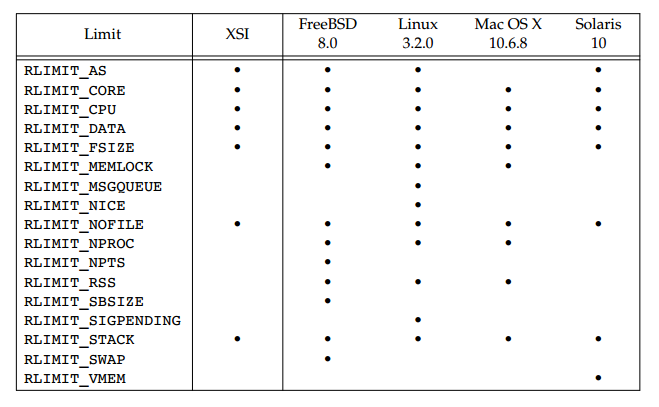

- `RLIMIT_AS` The maximum size in bytes of a process’s total available memory. This affects the `sbrk` function and the `mmap` function
- `RLIMIT_CORE` The maximum size in bytes of a corefile. A limit of 0 prevents the creation of a corefile.
- `RLIMIT_CPU` The maximum amount of CPU time in seconds. When the soft limit is exceeded, the `SIGXCPU` signal is sent to the process.
- `RLIMIT_DATA` The maximum size in bytes of the data segment: the sum of the initialized data, uninitialized data, and heap
- `RLIMIT_FSIZE` The maximum size in bytes of a file that may be created. When the soft limit is exceeded, the process is sent the `SIGXFSZ` signal.
- `RLIMIT_MEMLOCK` The maximum amount of memory in bytes that a process can lock into memory using `mlock(2)`.
- `RLIMIT_MSGQUEUE` The maximum amount of memory in bytes that a process can allocate for POSIX message queues.
- `RLIMIT_NICE` The limit to which a process’s nice value can be raised to affect its scheduling priority.
- `RLIMIT_NOFILE` The maximum number of open files per process. Changing this limit affects the value returned by the `sysconf` function for its `_SC_OPEN_MAX` argument
- `RLIMIT_NPROC` The maximum number of child processes per real user ID. Changing this limit affects the value returned for `_SC_CHILD_MAX` by the `sysconf` function
- `RLIMIT_NPTS` The maximum number of pseudo terminals that a user can have open at one time.
- `RLIMIT_RSS` Maximum resident set size(RSS) in bytes. If available physical memory is low, the kernel takes memory from processes that exceed their RSS.
- `RLIMIT_SBSIZE` The maximum size in bytes of socket buffers that a user can consume at any given time.
- `RLIMIT_SIGPENDING` The maximum number of signals that can be queued for a
process. This limit is enforced by the `sigqueue` function.
- `RLIMIT_STACK` The maximum size in bytes of the stack.
- `RLIMIT_SWAP` The maximum amount of swap space in bytes that a user can consume.
- `RLIMIT_VMEM` This is a synonym for `RLIMIT_AS`.

资源限制影响到调用进程并由其子进程继承。为了影响一个用户所有后续进程，需将资源限制在设置构造在shell之中


进程控制
===========
## 基础知识
linux进程的结构体位于`/usr/src/linux-headers-3.2.0-61-generic-pae/include/linux/sched.h`

`struct task_struct`中

- `state`进程状态，runnable包含运行中与就绪
- `stack`(32位机上)3G以下空间为进程独立，3G以上的1G空间为内核共享，整个4G空间均为虚拟内存空间

> 虚拟地址通过页表(Page Table)映射到物理内存，页表由操作系统维护并被处理器引用。内核空间在页表中拥有较高特权级，因此用户态程序试图访问这些页时会导致一个页错误(page fault)。在Linux中，内核空间是持续存在的，并且在所有进程中都映射到同样的物理内存。内核代码和数据总是可寻址，随时准备处理中断和系统调用。与此相反，用户模式地址空间的映射随进程切换的发生而不断变化。

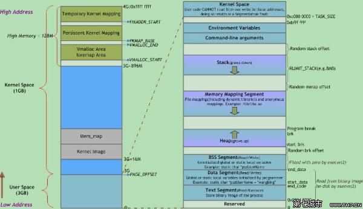

- `on_cpu`在哪个CPU上运行
- `tasks`用内核链表表示，所有进程均在上面
- `mm/active_mm`的结构体是`struct mm_struct`，用于页表相关
- `parent/children/sibling`通过二叉树表示的进程树

当进程启动时，每个进程相当于自己独占一台机器（俗称虚拟机），相应的机制有：

- 处理器调度：调度是 __中断__，时钟周期一到，就发送一个中断到CPU，这时引发一个进程（俗称调度进程），去调度其它进程。
> 中断打断运行中的进程，而信号打断休眠状态的进程（如`sleep`未到指定的时间，提前被唤醒），而进程又分可被某信号打断与不可被某信号打断
- 虚拟内存：进程启动时，页表先建好，进程访问的地址空间，通过MMU查找页表，映射到真实的物理地址


## 进程标识
- pid为0通常是调度进程，称为交换进程
- pid为1通常是`init`进程，在自举过程结束时 __由内核调用__。该进程决不会终止，它是普通进程（交换进程为内核进程），但以超级用户特权执行，是所有孤儿进程的父进程
> MacOSX 10.4中`init`被`launchd`进程所代替
- 某些unix的虚拟存储器实现中，pid为2的是页守护进程，负责支持虚拟存储器系统的分页操作

```c
#include <unistd.h>
pid_t getpid(void);
//Returns: process ID of calling process
pid_t getppid(void);
//Returns: parent process ID of calling process
uid_t getuid(void);
//Returns: real user ID of calling process
uid_t geteuid(void);
//Returns: effective user ID of calling process
gid_t getgid(void);
//Returns: real group ID of calling process
gid_t getegid(void);
//Returns: effective group ID of calling process
```

## fork函数
`fork`复制缓冲区，如果子进程不需要缓冲区内容，在`fork`前，先`fflush`

`fork`创建子进程的行为，在`fork`函数 __内部已完成__，所以通过返回值，可以知道当前进程

使用多进程的场景：提高性能、拆分逻辑

```c
#include <unistd.h>
pid_t fork(void);
//Returns: 0 in child, process ID of child in parent,−1 on error
```

子进程和父进程继续执行`fork`调用之后的指令，子进程是父进程的副本，__获得父进程的数据空间、堆和栈的副本（包括缓冲区数据）__，但父子进程 __并不共享这些存储空间__，子进程对变量做的改变不会影响父进程。父子进程共享正文段（Text Segment）

由于在`fork`之后经常跟随`exec`，现在许多实现并不执行一个父进程的数据段、栈和堆的完全副本，而使用 __写时复制__（COW）技术，这些区域由父子进程共享，并且内核将它们的访问权限改变为只读，如试图修改这些区域，则内核只为修改区域的那块内存制作一个副本，通常是虚拟存储系统中的一“页”

> linux 3.2提供了`clone(2)`系统调用，一种`fork`推广形式，允许调用者控制哪些部分由父进程和子进程共享

### 文件共享
在重定向父进程的标准输出时，子进程的标准输出也被重定向，`fork`的一个特性就是，父进程的所有打开文件描述符都被复制到子进程中，对于每个描述符，好像执行了`dup`

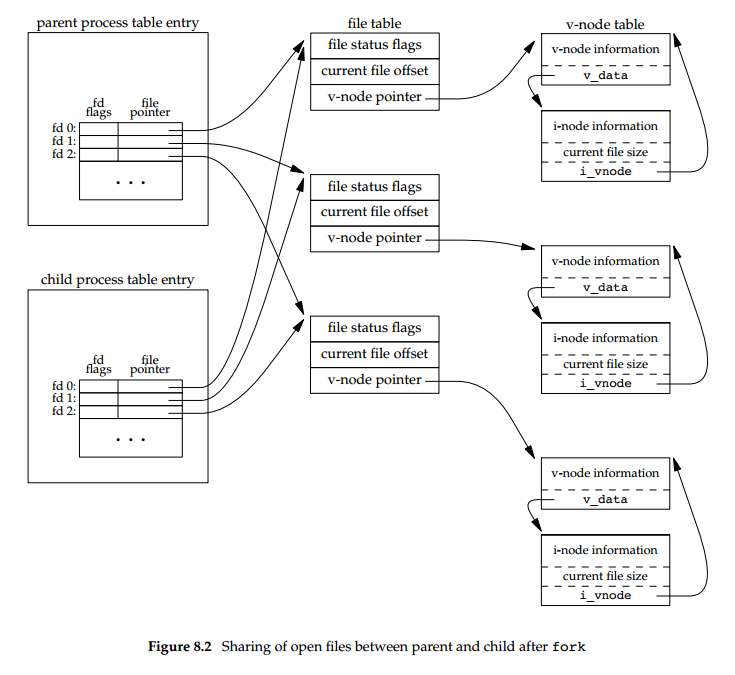

父子进程共享同一个文件偏移量，子进程写到文件时，将更新与父进程共享的该文件的偏移量，如果两者都写到标准输出时，后写者将追加输出

父子进程写同一描述符指向的文件，如果不做同步，那么它们的输出就会相互混合

`fork`之后处理文件描述符：

- 父进程等待子进程完成，父进程无需对其描述符做任何处理，当子进程终止后，它曾进行过读、写操作的任一共享描述符的文件偏移量已做了相应更新
- 父进程和子进程各自执行不同的程序段，各自关闭它们不需使用的文件描述符，这是网络服务进程经常使用的

子进程继承的其它属性：

- Real user ID, real group ID, effective user ID, and effective group ID
- Supplementary group IDs
- Process group ID
- Session ID
- Controlling terminal
- The set-user-ID and set-group-ID flags
- Current working directory
- Root directory
- File mode creation mask
- Signal mask and dispositions
- The close-on-exec flag for any open file descriptors
- Environment
- Attached shared memory segments
- Memory mappings
- Resource limits

父进程和子进程之间的区别：

- The return values from fork are different.
- The process IDs are different.
- The two processes have different parent process IDs: the parent process ID of the child is the parent; the parent process ID of the parent doesn’t change.
- The child’s `tms_utime`, `tms_stime`, `tms_cutime`,and `tms_cstime` values are set to 0
- File locks set by the parent are not inherited by the child.
- Pending alarms are cleared for the child.
- The set of pending signals for the child is set to the empty set.

## vfork函数
> 可移植的应用程序不应该使用它，并且现在`fork`时使用写时拷贝，它的优势已不存在

`vfork`也用于创建新进程，而该新进程的目的是`exec`一个新程序，但它并不将父进程地址空间完全复制到子进程，因为子进程会立即调用`exec`(或`exit`)，不过在子进程调用`exec/exit`之前，它在父进程的空间中运行，如果子进程修改数据（除用于存放`vfork`返回值的变量）、进行函数调用、或没有调用`exec/exit`，可能会带来未知结果

`vfork`保证 __子进程先运行__，在它调用`exec/exit`后父进程才可能被调度运行，如果在调用这两个函数之前子进程依赖于父进程的进一步动作，则导致死锁


## exit函数
任意终止情形，终止进程通知其父进程是如何终止的。对于3个终止函数（`exit/_exit/_Exit`）将其 __退出状态(exit status)__ 作为参数传送给函数。异常终止时，内核（不是进程本身）产生一个指示其异常终止原因的 __终止状态(termination status)__，父进程能用`wait/waitpid`取得其终止状态

如果父进程在子进程之前终止，则子进程的父进程都改变为`init`进程，保证了每个进程都有父进程

一个已经终止、但父进程未对其处理（获取终止子进程的有关信息、释放它占用的资源）的进程称为 __僵尸进程__，`ps(1)`时的状态为`Z`

被`init`收养的进程终止时，并不会成为僵尸进程，只要一个子进程终止，`init`就会调用一个`wait`函数取得其终止状态

> 僵尸进程是有存在意义的，它表示它的返回状态还未被父进程获取

## wait/waitpid函数
当一个进程正常或异常终止时，内核就向其父进程发送`SIGCHLD`信号（一个异步通知），父进程可以忽略它，或提供一个信号处理程序

```c
#include <sys/wait.h>
pid_t wait(int *statloc);
pid_t waitpid(pid_t pid, int *statloc, int options);
//Both return: process ID if OK, 0 (see later), or −1 on error
```

调用`wait/waitpid`的进程：

- 如果其所有子进程都还在运行，则阻塞
- 如果一个子进程已终止，正等待父进程获取其终止状态，则取得该子进程的终止状态立即返回
- 如果调用者阻塞而且它有多个子进程，则在其某一子进程终止时，`wait`就立即返回
- 如果它没有任何子进程，则立即出错返回
- `waitpid`有一选项，可使调用者不阻塞（有时希望获取一个子进程状态，但不想阻塞）
- `waitpid`可以控制它所等待的进程
- `waitpid`通过`WUNTRACED/WCONTINUED`选项支持作业控制

检查`statloc`参数的宏

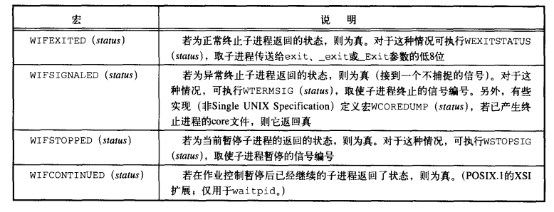

```c
#include <sys/wait.h>
void pr_exit(int status){
    if (WIFEXITED(status))
        printf("normal termination, exit status = %d\n",
            WEXITSTATUS(status));
    else if (WIFSIGNALED(status))
        printf("abnormal termination, signal number = %d%s\n",
            WTERMSIG(status),
#ifdef  WCOREDUMP
            WCOREDUMP(status) ? " (core file generated)" : "");
#else
            "");
#endif
    else if (WIFSTOPPED(status))
        printf("child stopped, signal number = %d\n",
            WSTOPSIG(status));
}
```

`waitpid`的`pid`参数

- -1，等待任一子进程，此时同`wait`
- >0，等待的进程ID与pid相等的子进程
- 0，等待组ID等于调用进程组ID的任一子进程
- <-1，等待组ID等于pid绝对值的任一子进程

`waitpid`的`options`参数

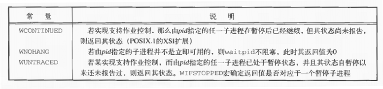

如果一个进程`fork`一个子进程，不等待子进程终止，也不希望子进程处于僵死状态，诀窍是调用`fork`两次

```c
int
main(void)
{
    pid_t   pid;

    if ((pid = fork()) < 0) {
        err_sys("fork error");
    } else if (pid == 0) {      /* first child */
        if ((pid = fork()) < 0)
            err_sys("fork error");
        else if (pid > 0)
            exit(0);    /* parent from second fork == first child */

        /*
         * We're the second child; our parent becomes init as soon
         * as our real parent calls exit() in the statement above.
         * Here's where we'd continue executing, knowing that when
         * we're done, init will reap our status.
         */
        sleep(2);
        printf("second child, parent pid = %ld\n", (long)getppid());
        exit(0);
    }

    if (waitpid(pid, NULL, 0) != pid)   /* wait for first child */
        err_sys("waitpid error");

    /*
     * We're the parent (the original process); we continue executing,
     * knowing that we're not the parent of the second child.
     */
    exit(0);
}
```

## waitid函数
```c
#include <sys/wait.h>
int waitid(idtype_t idtype, id_t id, siginfo_t *infop, int options);
//Returns: 0 if OK,−1 on error
```

与`waitpid`相似，它允许一个进程指定要等待的子进程，但使用两个单独的参数表示要等待的子进程所属的类型，而不是将此进程的ID或进程组ID组合成一个参数

`idtype`值

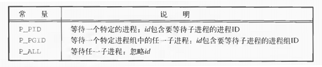

`options`参数，使用按位或运算

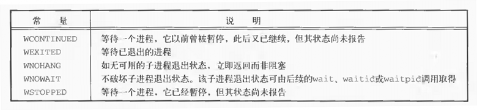

## wait3/wait4函数
```c
#include <sys/types.h>
#include <sys/wait.h>
#include <sys/time.h>
#include <sys/resource.h>
pid_t wait3(int *statloc, int options, struct rusage *rusage);
pid_t wait4(pid_t pid, int *statloc, int options, struct rusage *rusage);
//Both return: process ID if OK, 0, or−1 on error
```

允许内核返回由终止进程及其所有子进程使用的资源情况（用户CPU时间总量、系统CPU时间总量、缺页次数、接收到信号的次数等，细节查`getrusage(2)`）

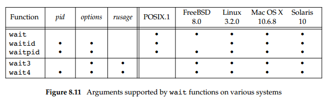

## 竞争条件
如果一个进程要等待其父进程终止，可使用

```c
while (getppid() != 1)
    sleep(1);
```

但浪费了CPU时间，为了避免竞争条件和轮询，多个进程间需要某种信号机制

### TELL/WAIT实现1
一个`TELL/WAIT`可能被使用的地方(可用信号实现，也可用管道实现)

```c
#include  "apue.h"
TELL_WAIT();  /* set things up for TELL_xxx & WAIT_xxx */

if ((pid = fork()) < 0) {
    err_sys("fork error");
} else if (pid == 0) { /* child */
    /* child does whatever is necessary ... */
    TELL_PARENT(getppid());  /* tell parent we’re done */
    WAIT_PARENT();  /* and wait for parent */
    /* and the child continues on its way ... */
    exit(0);
}
/* parent does whatever is necessary ... */
TELL_CHILD(pid);  /* tell child we’re done */
WAIT_CHILD();  /* and wait for child */
/* and the parent continues on its way ... */
exit(0);
```

一个确保父进程先输出的例子

```c
int
main(void)
{
    pid_t   pid;

    TELL_WAIT();

    if ((pid = fork()) < 0) {
        err_sys("fork error");
    } else if (pid == 0) {
        WAIT_PARENT();      /* parent goes first */
        charatatime("output from child\n");
    } else {
        charatatime("output from parent\n");
        TELL_CHILD(pid);
    }
    exit(0);
}

static void
charatatime(char *str)
{
    char    *ptr;
    int     c;

    setbuf(stdout, NULL);           /* set unbuffered */
    for (ptr = str; (c = *ptr++) != 0; )
        putc(c, stdout);
}
```

## exec函数
- `l`代表参数以list平坦开
- `v`代表参数以vector向量表示
- `p`代表会查找`PATH`环境变量
- `e`代表使用新的环境变量，而不是当前进程的

```c
#include <unistd.h>
int execl(const char *pathname,const char *arg0,...
         /* (char *)0 */ );
int execv(const char *pathname,char *constargv[]);
int execle(const char *pathname,const char *arg0,...
         /* (char *)0, char *constenvp[] */ );
int execve(const char *pathname,char *constargv[], char *constenvp[]);
int execlp(const char *filename,const char *arg0,...
         /* (char *)0 */ );
int execvp(const char *filename,char *constargv[]);
int fexecve(intfd,char *constargv[], char *constenvp[]);
//All seven return:−1 on error, no return on success
```

当进程调用一种`exec`时，该进程执行的程序完全替换为新程序，而新程序则从其main函数开始执行，因为调用`exec`并不创建新进程（创建新进程是`fork`），所以前后的进程ID并未改变，`exec`是用硬盘上的一个新程序替换了当前进程的正文段、数据段、堆段、栈段

前4个函数取路径名作参数，后两个取文件名作参数，最后一个取文件描述符做参数

当指定`filename`作参数时

- 如果`filename`中包含`/`，则将其视为路径名
- 否则按`PATH`环境变量，搜寻可执行文件

> 经常看到`execlp("ls", "ls", "-l", NULL);`存在相同的`ls`，第二个是作为`main`函数中`argv[0]`使用的


`execlp/execvp`找到的文件不是机器可执行文件，就认为是一个shell脚本，会调用`/bin/sh`，并以该`filename`作为shell输入

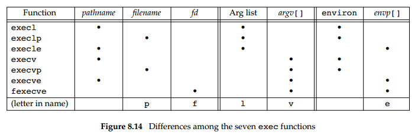

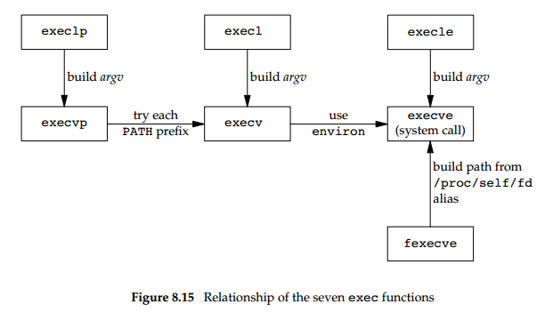

新程序从调用进程继承了：

- 进程ID和父进程ID
- 实际用户ID和实际组ID
- 附属组ID
- 进程组ID
- 会话ID
- 控制终端
- 闹钟尚余留的时间
- 当前工作目录
- 根目录
- 文件模式创建屏蔽字
- 文件锁
- 进程信号屏蔽
- 未处理信号
- 资源限制
- nice值
- tms_utime,tms_stime,tms_cutime,tms_cstime

`FD_CLOEXEC`标志，若设置了，则在执行`exec`时关闭该描述符，否则仍打开，默认是未设置，需`fcntl`设置

POSIX.1明确要求有`exec`时关闭打开的目录流

`exec`后有效ID是否改变，则取决于所执行的程序是否`set-user-ID/set-group-ID`

## 更改用户ID和组ID
一般而言，在设计应用程序时，总试图使用最小特权`least privilege`模型

```c
#include <unistd.h>
int setuid(uid_t uid);
int setgid(gid_t gid);
//Both return: 0 if OK, −1 on error
```

- 若进程具有root用户特权，则`setuid`函数将real ID、effective ID，以及saved ID设置为uid
- 若进程没特级，但uid等于real ID或saved ID，则`setuid`只将effective ID(则要求是`u+s`的)设置为uid，不改变另外两个（开始时，saved==effective，所以此功能用于real与effetive切换）
- 如果均不满足，则`errno`为`EPERM`

注意点：

- 只有root可以更改real ID，用户登录时，由`login(1)`设置的，而且永远不会改变它
- 仅当程序文件权限位`S_ISUID`为真，`exec`才设置effective ID
- saved ID由`exec`复制effective ID得来，是一个副本

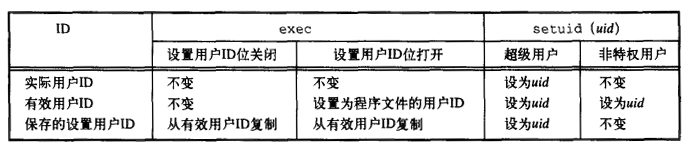

在进程运行间，通过`setuid(getuid())`切回real ID，以确保大部分时间只有普通权限

### setreuid/setregid函数
```c
#include <unistd.h>
int setreuid(uid_t ruid ,uid_t euid );
int setregid(gid_t rg id ,gid_t egid );
//Both return: 0 if OK, −1 on error
```

交换real与effective(不需要借助saved)

### seteuid/setegid函数
```c
#include <unistd.h>
int seteuid(uid_t uid);
int setegid(gid_t gid);
//Both return: 0 if OK, −1 on error
```

更改effective，最好不用，忘记改回会有风险

各函数图示

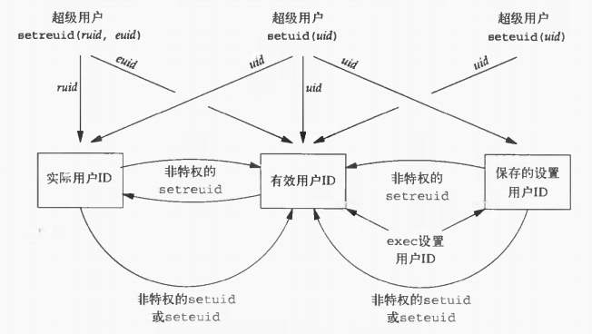

## 解释器文件
`#! pathname  [ optional-argument ]`

shell存在内部命令与外部命令，像`ls`为外部命令，是另开一个进程执行的，而`cd/export`是内部命令，在当前进程中执行的

如果存在以下情况

- `cmdline`按序输出所有命令行的参数
- `cmdline.sh`为`#!./cmdline 123 456`
- 存在一个解释器程序，它执行`execl("./cmdline.sh", "aaa", "bbb", "ccc", NULL);`

则最后输出为

```
./cmdline
123 456
./cmdline.sh
bbb
ccc
```

"aaa"被"./cmdline.sh"替代了，"123 456"被作为一个参数


## system函数
相当于`fork`后直接`execlp`，并且父进程`wait`

```c
#include <stdlib.h>
int system(const char * cmdstring);
```

如果传入空指针，并且返回0，说明`system`是被支持的。它内部调用了`fork/exec/waitpid`，因此有三种返回值

- 如果`fork`失败或者`waitpid`返回除`EINTR`之外的错，则返回-1，而且设置`errno`
- 如果`exec`失败，则如果shell执行了`exit(127)`
- 如果三个函数都执行成功，并且返回值是shell的终止状态，其格式同`waitpid`中的`statloc`

一种未处理信号的实现

```c
#include <sys/wait.h>
#include <errno.h>
#include <unistd.h>

int system(const char *cmdstring){   /* version without signal handling */
    pid_t   pid;
    int     status;

    if (cmdstring == NULL)
        return (1);             /* always a command processor with UNIX */
    if ((pid = fork()) < 0)
        status = -1;            /* probably out of processes */
    else if (pid == 0) {                         /* child */
        execl("/bin/sh", "sh", "-c", cmdstring, (char *)0);
        _exit(127);             /* execl error */
    }
    else {                      /* parent */
        while (waitpid(pid, &status, 0) < 0){
            if (errno != EINTR){
                status = -1;    /* error other than EINTR from waitpid() */
                break;
            }
        }
    }
    return (status);
}
```

shell中`-c`代表`cmdstring`作为命令输入，可以包含任一有效的shell命令，甚至可以重定向。如果不使用此，而试图自己执行它，那将相当困难，必须使用`execlp`而不是`execl`，像shell那样使用PATH变量，并要拆分命令行参数，也不能使用一个shell元字符

使用`_exit`而不是`exit`为了防止任一标准IO缓冲区在子进程中被flush

使用`system`优点是，它进行了各种出错处理以及信号处理

### 设置用户ID程序
如果一个设置用户ID(`u+s`)程序中调用`system`，将是一个 __安全性方面的漏洞__，即设置了用户ID或组ID的程序，决不能调用`system`函数

> rehl6 不存在此问题

## 会计进程
```shell
accton /var/account/pacct  #以root来启用它
#运行某程序
accton                     #以root停止它
#打开文件,使用struct acct来读取
```

## 用户标识
```c
#include <unistd.h>
char *getlogin(void);
//Returns: pointer to string giving login name if OK,NULL on error
```

如果调用此函数的进程没的连接到用户登录时所用的终端（daemon），本函数无效，给出了登录名，就可用`getpwnam()`查找用户相应记录

## 进程优先级
```c
#include <unistd.h>
int nice(int incr );
//Returns: new nice value − NZERO if OK, −1 on error

#include <sys/resource.h>
int getpriority(int which,id_t who);
//Returns: nice value between −NZERO and NZERO−1 if OK, −1 on error

int setpriority(int which,id_t who,int value);
//Returns: 0 if OK,−1 on error
```

示例(含运行时间的控制)

```c
#include "apue.h"
#include <errno.h>
#include <sys/time.h>

#if defined(MACOS)
#include <sys/syslimits.h>
#elif defined(SOLARIS)
#include <limits.h>
#elif defined(BSD)
#include <sys/param.h>
#endif

unsigned long long count;
struct timeval end;

void
checktime(char *str){
    struct timeval  tv;

    gettimeofday(&tv, NULL);
    if (tv.tv_sec >= end.tv_sec && tv.tv_usec >= end.tv_usec) {
        printf("%s count = %lld\n", str, count);
        exit(0);
    }
}

int main(int argc, char *argv[]){
    pid_t   pid;
    char    *s;
    int     nzero, ret;
    int     adj = 0;

    setbuf(stdout, NULL);
#if defined(NZERO)
    nzero = NZERO;
#elif defined(_SC_NZERO)
    nzero = sysconf(_SC_NZERO);
#else
#error NZERO undefined
#endif
    printf("NZERO = %d\n", nzero);
    if (argc == 2)
        adj = strtol(argv[1], NULL, 10);
    gettimeofday(&end, NULL);
    end.tv_sec += 10;   /* run for 10 seconds */

    if ((pid = fork()) < 0) {
        err_sys("fork failed");
    } else if (pid == 0) {  /* child */
        s = "child";
        printf("current nice value in child is %d, adjusting by %d\n",
          nice(0)+nzero, adj);
        errno = 0;
        if ((ret = nice(adj)) == -1 && errno != 0)
            err_sys("child set scheduling priority");
        printf("now child nice value is %d\n", ret+nzero);
    } else {        /* parent */
        s = "parent";
        printf("current nice value in parent is %d\n", nice(0)+nzero);
    }
    for(;;) {
        if (++count == 0)
            err_quit("%s counter wrap", s);
        checktime(s);
    }
}
```

## 进程时间
```c
#include <sys/times.h>
clock_t times(struct tms *buf );
//Returns: elapsed wall clock time in clock ticks if OK,−1 on error

struct tms {
    clock_t  tms_utime;  /* user CPU time */
    clock_t  tms_stime;  /* system CPU time */
    clock_t  tms_cutime; /* user CPU time, terminated children */
    clock_t  tms_cstime; /* system CPU time, terminated children */
};
```

`clock_t`为多少个时钟周期，称嘀嗒，一个时钟周期为`sysconf(_SC_CLK_TCK)`，计算时间时使用`(double)tms.tms_cutime / sysconf(_SC_CLK_TCK)`

任何一进程都可以调用以获得自己以及终止子进程的时间，该结构没有墙上时钟，所以其返回值是墙上时钟，多进程运行某段逻辑时，墙上时钟会少，但user时间不会少（甚至更多）。

调用`times`保存其返回值，在以后某个时间再次调用`times`，从新的返回值中减去以前的返回值，此差就是墙上时钟时间（一个长期运行的进程可能会墙上时钟时间溢出）

结构体中针对子进程的字段包含了此进程用`wait/waitid/waitpid`等待到各个子进程的值，如果没`wait`则不包括子进程时间

`clock_t`值都用`_SC_CLK_TCK`(由`sysconf`函数返回的每秒时钟滴答数)变换成秒数

> `getrusage(2)`返回CPU时间，以及指示资源使用情况的另外14个值

进程关系
=========
## 终端登录

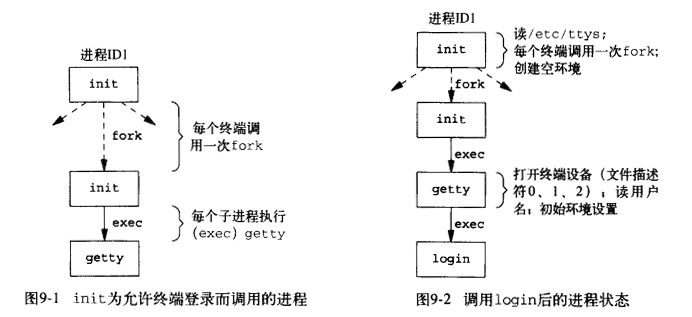

最初的`init`进程具有超级用户特权，后一张图所有进程都有超级用户特权，并且底部三个进程的进程ID相同，因为进程ID不会因执行`exec`而改变，除了最初的`init`进程，所有进程的父进程ID均为1

如果登录正确，`login`进行如下工作：

- 将当前工作目录更改为该用户的起始目录
- 调用`chown`改变该终端的所有权，使登录用户成为它的所有者
- 将对该终端设备的访问权限改变成用户读和写
- 调用`setgid`及`initgroups`设置进程的组ID
- 用`login`所有到的所有信息初始化环境：HOME,shell,user/logname,path
- `login`进程改变为登录用户的用户ID(`setuid`)并调用该用户的登录shell，如下

```c
execl("/bin/sh", "-sh", (char *)0);
```

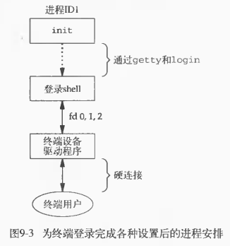

当登录shell终止时，`init`会得到`SIGCHLD`信号，会对终端重复全部上述过程

## 网络登录
BSD中有一个`inetd`进程（linux下是`xinetd`），等待大多数网络连接。

`init`调用一个shell，执行`/etc/rc`，由此脚本启动一个守护进程`inetd`，一旦shell终止，`inetd`的父进程就是`init`了，`inetd`等待TCPIP连接请求到主机，到请求到达时，它执行一次`fork`，然后生成子进程执行适当程序

假设使用`telnet`，则主机上启动一个`telnetd`服务进程，它打开一个伪终端，并用`fork`分成两个进程，父进程处理网络连接通信，子进程执行`login`程序。父子进程通过伪终端相连接，在调用`exec`之前，子进程使其文件描述符0,1,2与伪终端相连

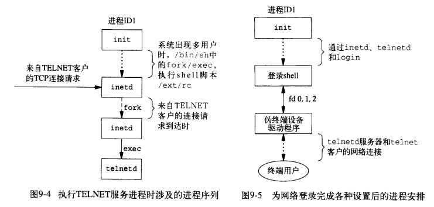

## 进程组
进程组是一个或多个进程的集合（与用户组ID是完全不同的概念），可以接收来自同一终端的各种信号。每个进程组有唯一一个进程组ID

```c
#include <unistd.h>
pid_t getpgrp(void);
//Returns: process group ID of calling process

#include <unistd.h>
pid_t getpgid(pid_t pid);
//Returns: process group ID if OK, −1 on error
```

当`pid`为0，则返回调用进程的进程组ID

每个进程组都有一个组长进程，它的进程ID，即为该进程组ID

`setpgid`来加入一个现有的组或创建一个新进程组

```c
#include <unistd.h>
int setpgid(pid_t pid, pid_t pgid );
//Returns: 0 if OK,−1 on error
```

- 如果两个参数相等，则由`pid`指定的进程变成进程组组长
- 如果`pid`为0，则使用调用者的进程ID
- 如果`pgid`为0，则`pid`指定的进程ID作为进程组ID

一个进程只能为它自己或它的子进程设置进程组ID，在它的子进程调用了`exec`函数之一后，它就不再能改变子进程的进程组ID

大多数作业控制shell中，在`fork`后调用此函数，使父进程设置其子进程的进程组ID，并且使其子进程设置自己的进程组ID，有一个是冗余的，为了保证子进程已进入进程组

## 会话
进程调用`setsid`函数建立一个新会话

```c
#include <unistd.h>
pid_t setsid(void);
//Returns: process group ID if OK, −1 on error
```

如果调用此函数的进程不是组长，则此函数会创建一个新会话：

- 该进程变成新会话首进程（session leader），也是新会话中唯一的进程
- 该进程成为新进程组的组长
- 该进程没有控制终端，如果在调用`setsid`之前该进程有一个控制终端，那么这种联系也会被中断

如果是组长，则函数出错，为了保证不出错，通常先`fork`，然后使其父进程终止，子进程继续

```c
#include <unistd.h>
pid_t getsid(pid_t pid);
//Returns: session leader’s process group ID if OK, −1 on error
```

如`pid`为0，则返回调用进程的会话首进程的进程组ID，如果`pid`并不属于调用者所在的会话，那么调用者就不能得到该会话首进程的进程组ID


## 控制终端
- 一个会话可以有一个控制终端，通常是登录到其上的终端设备，或伪终端设备
- 建立与控制终端连接的会话首进程为控制进程
- 一个会话中的几个进程组可被分成一个前台进程组以及一个或几个后台进程组
- 无论何时键入终端的中断键（DELETE或CTRL+C），就会将中断信号`SIGINT`发送给前台进程组的所有进程
- 无何何时键入终端的退出键（CTRL+\）,就会将退出信号`SIGQUIT`发送给前台进程组的所有进程
- 如果终端接口检测到网络已断开连接，或CTRL+Z，则将挂断信号`SIGTSTP`发送给控制进程（会话首进程）

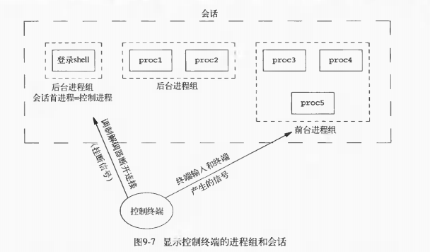

有时不管标准输入、标准输出是否重定向，程序都需要与控制终端交互，此时需要打开文件`/dev/tty`

## tcgetpgrp/tcsetpgrp/tcgetsid函数
```c
#include <unistd.h>
pid_t tcgetpgrp(int fd );
//Returns: process group ID of foreground process group if OK,−1 on error
int tcsetpgrp(int fd ,pid_t pgrpid );
//Returns: 0 if OK,−1 on error
```

需要一种方法来通知内核哪一个进程组是前台进程组，终端设备驱动程序就能了解将终端输入和终端产生的信号送到何处

`tcgetpgrp`返回前台进程组的进程组ID，该前台进程组与在filedes上打开的终端相关联

如果进程有一个控制终端，则该进程可以调用`tcsetpgrp`将前台进程组ID设置为`pgrpid`，该值应当为同一会话中的某一个进程组的ID

大多数应用程序并不直接调用这两个函数

`tcgetsid`给出控制tty的文件描述符，得到会话首进程的进程组ID

```c
#include <termios.h>
pid_t tcgetsid(int fd );
//Returns: session leader’s process group ID if OK, −1 on error
```

## 作业控制
只有前台作业接收终端输入，如果后台作业试图读终端，那么这并不是一个错误，终端驱动程序会检测到这种情况，并且向后台作业发送一个`SIGTTIN`，挂起后台作业，shell向有关用户发出通知，用户可将此作业转为前台作业(调用`tcsetpgrp`)，并将继续信号`SIGCONT`送给该进程组，于是它就可以读终端了

```shell
$ cat > temp.foo &
[1]  1681
$                        #we press RETURN
[1] + Stopped (SIGTTIN)  cat > temp.foo
$ fg %1
cat > temp.foo           #tells us which job is now in the foreground
hello, world enter one line
ˆD                       #type the end-of-file character
$ cat temp.foo           #check that the one line was put into the file
hello, world
````

> 当如果不是作业控制时，而且该进程自己没有重定向标准输入，则shell自动将后台进程标准输入重定向到`/dev/null`，产生一个文件结束，`cat`立即读到文件尾，并正常结束

如果后台作业输出到控制终端时

```shell
$ cat temp.foo &
[1]  1719
$hello, world
                         #we press RETURN
[1] + Done  cat temp.foo &
$ stty tostop
$ cat temp.foo &
[1]  1721
$                        #we press RETURN and find the job is stopped
[1] + Stopped(SIGTTOU) cat temp.foo &
$ fg %1
cat temp.foo             #tells us which job is now in the foreground
hello, world
```

终端驱动程序将写操作标识为来自于后台进程，于于向该作业发送`SIGTTOU`信号

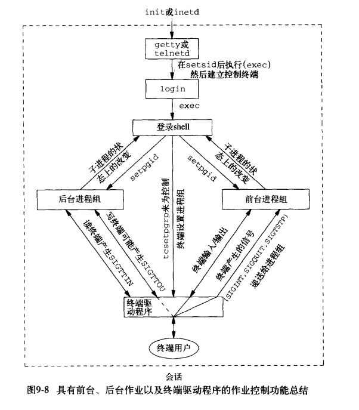

## shell执行程序
```shell
ps -o pid,ppid,pgid,sid,comm
  PID  PPID  PGID   SID COMMAND
 4390  2082  4390  4390 bash
 4851  4390  4851  4390 ps
```

`ps`命令的父进程是shell，它们位于同一会话，在linux中，但它具有自己的进程组

```shell
 ps  -o pid,ppid,pgid,sid,comm | cat
  PID  PPID  PGID   SID COMMAND
 4390  2082  4390  4390 bash
 4912  4390  4912  4390 ps
 4913  4390  4912  4390 cat
```

`ps`和`cat`还位于同一进程组，并且`cat`的父进程是`ps`（或者相反？？？？）

> 管道线中最后一个进程是shell的子进程，而管道线中第一个进程(或其它进程)是最后一个进程的子进程，shell`fork`一个自身副本，然后此副本再为管道线中每条命令各`fork`一个进程

`ps -o pid,ppid,pgid,sid,tpgid,comm`linux下通过`tpgid`查看当前前台进程组

## 孤儿进程组
整个进程组也可成为“孤儿”


信号
=========
## 信号概念
信号处理与信息相关动作：

- 忽略此信号，但`SIGKILL`和`SIGSTOP`不能被忽略
- 捕捉信号，如捕捉到`SIGCHLD`表示一个子进程已终止，在捕捉函数里可以调用`waitpid`以取得子进程的终止状态；如果进程创建了临时文件，可能要为`SIGTERM`编写一个信号捕捉函数，以清除临时文件。同样，`SIGKILL`和`SIGSTOP`不能被捕捉
- 执行系统默认动作，如下图

> 进程当前工作目录的`core`文件复制该进程的存储映像，调试程序使用它来检查进程终止的状态
>
> 设置`ulimit -c unlimited`，将会在当前目录下产生`core`文件


## signal函数
不推荐使用，请使用`sigaction`

`exec`后的进程会忽略响应信号，将原先设置为要捕捉的信号都更改为默认动作，一个进程原先要捕捉的信号，当执行一个新程序后，就不能再捕捉了，捕捉函数地址已无意义

`fork`时，子进程继承父进程的信号处理方式，捕捉函数地址是有意义的

```c
#define SIG_ERR (void (*)())-1
#define SIG_DFL (void (*)())0
#define SIG_IGN (void (*)())1

#include <signal.h>
void (*signal(intsigno,void (*func)(int)))(int);
//Returns: previous disposition of signal (see following) if OK,SIG_ERR on error
```

`signal`的返回值是以前的信号处理回调函数，保存下来，可以恢复用

早期版本的`signal`关联就一次，需要在回调中再次绑定

## 不可靠的信号
早期UNIX版本中，信号是不可靠的

- 信号可能丢失，一个信号发生了，但进程却可能一直不知道这一点，即使`sigaction`也存在这个问题
- 进程对信号的控制能力也差，也不具备阻塞信号的能力。`signal`不可以阻塞，但`sigaction`就能阻塞
- 在进程每次接到信号对其进行处理时，随即将该信号动作重置为默认值，代码不得不如下，但信号处理程序调用`signal`有一个时间窗口，在此期间，又发生了另一次中断，此时只执行默认动作（很可能是终止进程）：

```c
    int  sig_int(); /* my signal handling function */
    .
    signal(SIGINT, sig_int); /* establish handler */
    .

sig_int(){
    signal(SIGINT, sig_int); /* reestablish handler for next time */
    .
    ./*process the signal ... */
    .
}
```

- 进程不希望某种信号发生时，不能关闭该信号，能做的只是忽略它

```c
int  sig_int(); /* my signal handling function */
int  sig_int_flag; /* set nonzero when signal occurs */
main(){
    signal(SIGINT, sig_int); /* establish handler */
    .
    while (sig_int_flag == 0)
        pause();  /* go to sleep, waiting for signal */
    .
}
int sig_int(){
    signal(SIGINT, sig_int); /* reestablish handler for next time */
    sig_int_flag = 1; /* set flag for main loop to examine */
}
```

如果在时间窗口，`while (sig_int_flag == 0)`与`pause()`之间，发生信号，则此进程在调用`pause`可能永久休眠（假定该信号不会再发生），这次发生的信号也丢失了

> `pause`只有执行了一个信号处理程序并从其返回时，它才返回

- 不提供一个原子操作中恢复信号屏蔽字，见`sigsuspend`章节
- `signal`不支持重启，而`sigaction`则支持

## 中断的系统调用
早期UNIX，如果进程在执行一个 __低速系统调用__ (不会是函数)而阻塞期间捕捉到一个信号，则系统调用就被中断不再执行执行，系统调用返回出错，`errno`设置为`EINTR`(如`read()/write()`)。

系统调用分为两类：低速系统调用和其他系统调用，低速调用是可能使进程永远阻塞的一类系统调用

- 在读某些类型的文件（管道、终端设备、网络设备），如数据并不存在，可能会使调用者永远阻塞
- 在写这些类型文件时，如果不能立即接受这些数据，则也可能使调用者永远阻塞
- 打开某些类型文件，在某种条件发生之前也可以会使调用者阻塞（如等待所连接的调制解调器应答了电话）
- `pause()`，使调用进程休眠直至捕捉到一个信号，和`wait()`
- 某些`ioctl`操作
- 某些进程间通信函数

例外是与磁盘IO有关的系统调用，虽然读写一个磁盘文件可能暂时阻塞调用者，但除非发生硬件错误，IO操作总很快返回，并使调用者不再处于阻塞状态

可用中断系统调用这种方法来处理的一个例子是，一个进程启动了读终端操作，但使用该终端设备的用户却离开了，此时进程可能一直处于阻塞状态

```c
again:
  if ((n = read(fd, buf, BUFFSIZE)) < 0) {
    if (errno == EINTR)
      goto again; /* just an interrupted system call */
      /* handle other errors */
  }
```

为了帮助应用程序使其不必处理被中断的系统调用，4.2BSD引入中断系统调用自动重启(POSIX.1要求`act.sa_flags = SA_RESTART`时,并且使用`sigaction`)，如`ioctl, read, readv, write, writev, wait, waitpid`，前5个函数只对低速设备进行操作时才会被信号中断，而后两个在捕捉到信号时总时被中断。这种自动重启，可基于信号禁用此功能

## 可重入函数
内核函数分为可重入与不可重入函数，可重入函数是自包含的函数，不使用静态、全局等外部资源，重入运行，不会发生错误

进程捕捉到信号并对其处理时，可能还会被信号打断，从而引发一些问题，这些函数是不可重入的。加锁也是没有用的，反而有可能引起死锁

> 假设A是某信号的响应函数，在A执行过程中，又系统又捕捉了了该信号，必然还执行A函数，如果A函数开始部分加锁，结束部分解锁，看似解决竞争问题，实际上，重入的A函数，会先要求加锁，就等待，无法返回，导致先行的A函数无法被执行到，也无法解锁，形成死锁

```plain
    A            A
    ｜        -> |
    lock     /   wait lock
    ｜      /    |
    signal /     |
    ｜      \    |
    unlock   \   |
    ｜         <-|
```

下面的函数是可重入的，并称为 __异步信号安全__，除了可重入以外，在信号处理操作期间，它会阻塞任何会引起不一致的信号发送

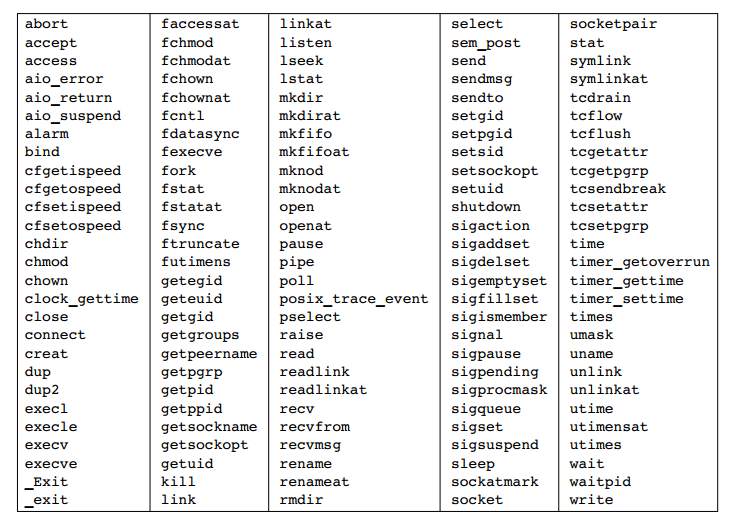

`rand`如果作为随机数，不可重入问题不大，但作为加密使用时，就有问题。`rand_r`是可重入版本（一般后面`_r`的为可重入版本[或称线程安全]）（另，如果要随机种子，使用进程号反而优于时间）

即使使用这些可重入函数，但由于 __每个线程只有一个`errno`__，所以信号处理程序可能会修改其原先值，作为一个通用规则，在调用上述函数时，在调用前保存`errno`，在调用后恢复`errno`

而大多数函数是不可重入的：

- 使用了静态数据结构
- 调用了`malloc/free`
- 是标准IO函数，如`printf`

> 书中的例子的`signal`是被重写的，不能反映作者意图（被阻塞了），需调用原生`signal`时，会出现段错误（作者真实意图）


## SIGCLD/SIGCHLD语义
子进程状态改变后产生此信号，父进程需要调用一个`wait`函数以检测发生了什么

- 如果调用`signal`或`sigset`将`SIGCHLD`的配置设置为忽略`SIG_IGN`，则决不会产生僵死进程，也可使用`sigaction`中配置`SA_NOCLDWAIT`以避免僵死进程
- 如果设置为捕捉，则内核立即检查是否有子进程准备好等待，如果是这样，则调用处理程序

> 所以不能在处理函数中，再次设置捕捉（除非已`wait`返回了），这也是绑定一次处理函数的不可靠性（`sigaction`中不必再设置处理函数）


## 可靠信号术语和语义
当造成信号的事件发生时，为进程产生一个信号，事件可以是硬件异常、软件条件、终端产生信号或调用`kill`，当信号产生时，内核通常在进程表中以某种形式设置一个标志

当对信号采取了这种动作时，我们说向进程递送了一个信号，在信号产生(generation)和递送(delivery)之间的时间间隔内，称信号是未决的(pending)

进程可以选用阻塞信号递送，如果为进程产生了一个阻塞的信号，而且对该信号的动作是捕捉该信号（或系统默认），则为该进程将此信号保持为未决状态，直到该进程对此信号解除了阻塞（或改为忽略）

内核在递送一个原来被阻塞的信号给进程时（而不是产生该信号时），才决定对它的处理方式，于是进程在信号给它之前仍可以改变对该信号的动作

信号 __从内核态到用户态，才会响应__。阻塞一定是在内核态发生，即使`kill -9`也不会响应，但进程一旦从内核态返回到用户态，就会马上响应

信号会打断阻塞（休眠）的系统调用，如`sleep()`有时会不准确，盖因休眠被唤醒了

如果在进程解除对某个信号的阻塞之前，这种信号发生了多次，POSIX.1允许递送该信号一次或多次，实时信号就为多次，对信号进行了排队，但大多数信号只递送一次

如果多个信号要递送给一个进程，POSIX.1并未规定递送顺序，但建议先递送与进程当前状态有关的信号，如`SIDGEGV`

接下来的`sigprocmask`来检测和更改当前信号屏蔽字，而`sigset_t`及它相关的函数，用来存放信号屏蔽字


## 信号集
主要是给`sigprocmask`中使用这种数据类型

```c
#include <signal.h>
int sigemptyset(sigset_t *set);
int sigfillset(sigset_t *set);
int sigaddset(sigset_t *set,int signo);
int sigdelset(sigset_t *set,int signo);
//All four return: 0 if OK,−1 on error
int sigismember(const sigset_t *set,int signo);
//Returns: 1 if true, 0 if false,−1 on error
```

它的实现

```c
#define sigemptyset(ptr) (*(ptr) = 0)
#define sigfillset(ptr) (*(ptr) = ˜(sigset_t)0, 0)

#define SIGBAD(signo) ((signo) <= 0 || (signo) >= NSIG)

int sigaddset(sigset_t *set, int signo) {
  if (SIGBAD(signo)) {
    errno = EINVAL;
    return(-1);
  }
  *set |= 1 << (signo - 1); /* turn bit on */
  return(0);
}

int sigdelset(sigset_t *set, int signo) {
  if (SIGBAD(signo)) {
    errno = EINVAL;
    return(-1);
  }
  *set &= ˜(1 << (signo - 1)); /* turn bit off */
  return(0);
}

int sigismember(const sigset_t *set, int signo){
  if (SIGBAD(signo)) {
    errno = EINVAL;
    return(-1);
  }
  return((*set & (1 << (signo - 1))) != 0);
}
```

宏`sigfillset`后面的0，用于返回值

## sigprocmask函数
它是为单线程进程定义，处理多线程进程中的信号，使用另一函数`pthread_sigmask`

如果一段代码，有可能信号会调用，也可能UI交互时会调用（如俄罗斯方块中的下行动作），为了防止竞争，此时不能使用线程中`mutex`，可能会导致死锁（见可重入函数中的图示），而应该在代码前阻塞信号，代码尾非阻塞信号

```c
#include <signal.h>
int sigprocmask(int how,const sigset_t *restrict set, sigset_t *restrict oset);
//Returns: 0 if OK,−1 on error
```

`how`指示了如何修改当前信号屏蔽字，注意，不能阻塞`SIGKILL/SIGSTOP`

- `SIG_BLOCK`是`set`包含的信号与当前信号屏蔽字做并集
- `SIG_UNBLOCK`当前信号屏蔽字减去`set`包含的信号
- `SIG_SETMASK`进程新的信号屏蔽字为`set`包含的信号

`oset`用于保存之前的设置

`sigprocmask`当用来解除阻塞时，是 __立即发生__ 的，然后函数才返回，所以如果在信号响应函数中解除阻塞，有可能还是会导致函数重入

## sigpending函数
该函数返回一个信号集，对于调用进程而言，其中的信号是阻塞不能递送的，因而也一定是当前未决的，即`sigpending`来过的信号，但还未响应的，而且是阻塞中的信号

```c
#include <signal.h>
int sigpending(sigset_t *set);
//Returns: 0 if OK,−1 on error
```

如果同一信号未决多次，当解除阻塞时，只向进程传送一次，没有队列


## sigaction函数
`sigaction`除了丢失，基本上认为是可靠信号

```c
#include <signal.h>
int sigaction(int signo,const struct sigaction *restrict act, struct sigaction *restrict oact);
//Returns: 0 if OK,−1 on error

struct sigaction {
  void       (*sa_handler)(int);
  void       (*sa_sigaction)(int, siginfo_t *, void *);
  sigset_t   sa_mask;
  int        sa_flags;
  void       (*sa_restorer)(void);
};
```

`struct sigaction`结构体中，前两个函数指针，只能使用其一，它们有可能实现为共用体

`sa_mask`在调用该信号捕捉函数之前，这一信号集要加到进程的信号屏蔽字中，仅当从信号捕捉函数返回时再将进程屏蔽字恢复为原先值（下面一条是阻塞自己，这一条是还可以阻塞别的信号）

默认在调用信号处理程序时，就能阻塞某些信号，保证在处理一个给定的信号时，如果这种信号再次发生，__它会被阻塞到对前一个信号的处理结束为止__(除非设置了`sa_flags`为`SA_NODEFER`)

若同一信号多次发生，通常并不加入队列，解除阻塞后，其信号处理函数只会被调用一次

除非显示改变设置处理函数，否则设置一直有效，不是一次注册

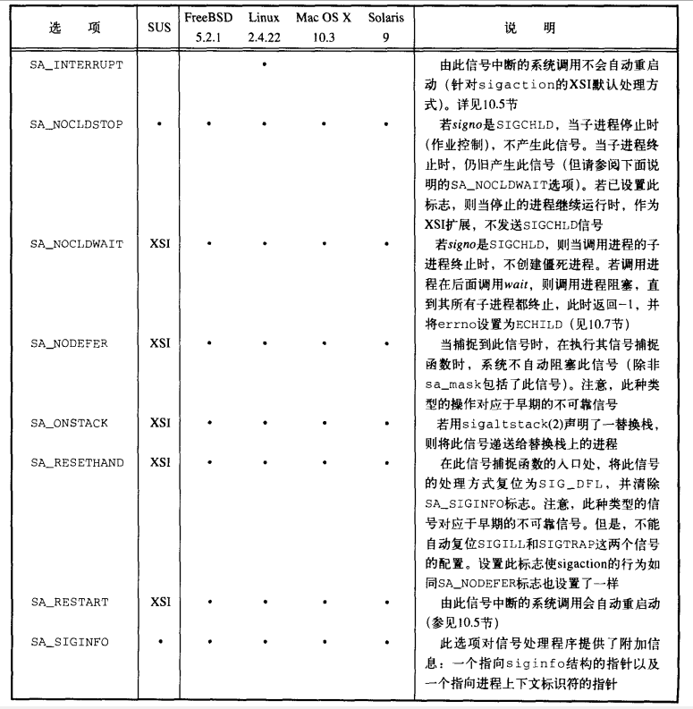

> `act.sa_flags |= SA_RESTART`表示自动重启，如示例，但有些函数是不能自动重启的，如`semop`
> `act.sa_flags |= SA_RESETHAND`相当于就关联一次，不常用
> `act.sa_flags |= SA_SIGINFO`包含额外信息，配合`sigqueue()`使用，响应函数使用`sa_sigaction`而不是`sa_handler`，需注意，`sa_sigaction`中参数`info`是指针类型，除非下次产生信号，否则它的值不变，如果一个响应函数对应多个信号时，容易误导，以为是传递过来的值

使用`sigaction`实现`signal`

```c
Sigfunc *signal(int signo, Sigfunc *func){
    struct sigaction    act, oact;

    act.sa_handler = func;
    sigemptyset(&act.sa_mask);
    act.sa_flags = 0;
    if (signo == SIGALRM) {
#ifdef  SA_INTERRUPT
        act.sa_flags |= SA_INTERRUPT;
#endif
    } else {
        act.sa_flags |= SA_RESTART;
    }
    if (sigaction(signo, &act, &oact) < 0)
        return(SIG_ERR);
    return(oact.sa_handler);
}
```

- 使用`sigemptyset(&act.sa_mask)`，不能确保`act.sa_mask = 0`会一样


## kill/raise函数
`kill`将信号发给进程或进程组，`raise`则允许向自身发送信号

```c
#include <signal.h>
int kill(pid_t pid,int signo);
int raise(int signo);
//Both return: 0 if OK,−1 on error
```

`raise(signo) == kill(getpid(), signo)`

其中:

- pid>0，发送给进程ID为pid的进程
- pid==0，发送给与发送进程属于同一组的所有进程
- pid<0，发送给其进程组ID等于pid的绝对值的所有进程
- pid==-1，发送给有权发送的所有进程

以上均不包括系统进程集中的进程，如内核进程和init

对于非超级用户，基本规则是发送者的real ID或effective ID必须等于接收者的real ID或effective ID。POSIX.1要求检查接收者的save ID（而不是effective ID）

> 一个特例，如果发送`SIGCONT`，则进程可以将它发送给属于同一会话的任一其他进程

如果信号编号是0，则`kill`执行错误检查，但不发送信号，用来 __确定特定进程是否存在__

> 不存在时，返回-1，`errno`为`ESRCH`，但由于是非原子操作，实际意义不大

## sigqueue函数
```c
#include <signal.h>
int sigqueue(pid_t pid,int signo,const union sigval value)
//Returns: 0 if OK,−1 on error
```

POSIX.1的实时扩展中，开始增加对信号排队的支持(普通信号不排列)，该函数只能把信号发给单个进程，除此以外，`sigqueue`相当于`kill`，但可带上多余信息，当然，需要`act.sa_flags |= SA_SIGINFO;`，响应函数使用`sa_sigaction`而不是`sa_handler`

## alarm/pause函数
`alarm`当定时器超时时，产生`SIGALRM`，如果忽略或不捕捉此信号，__默认动作是终止调用该函数的进程__

```c
#include <unistd.h>
unsigned int alarm(unsigned intseconds);
//Returns: 0 or number of seconds until previously set alarm
```

每个进程只能有一个闹钟时间，如果在调用`alarm`时，之前注册的闹钟时间还没超过，则该闹钟时间的余值作为本次函数返回值，进程中闹钟时间以本次为准

如果有以前注册的尚未超时，再调用`sleep(0)`时，则取消以前的闹钟时间（不再设置处理函数），余留值返回

> `alarm`在项目中是禁止使用的，应使用`setitimer`，而且确保只有一个人（架构师）在使用。如果多线程中，更不建议使用，不得已时，应集中一个线程使用，其他线程需要定时任务时，交由它定时发送信号

```c
int setitimer(int which, const struct itimerval *new_value, struct itimerval *old_value);
```

`which`可以指定是墙上时钟，还是用户态时间，还是用户+内核时间，并且`struct itimerval`精度也会高许多，精确到微秒级（但少于时间片的精度是无意义的，一般少于10毫秒认为已比较精准了）

`pause`使调用进程挂起直到捕捉到一个信号

```c
#include <unistd.h>
int pause(void);
//Returns:−1 with errno set to EINTR
```

只有执行了一个信号处理程序并从其返回时，`pause`才返回，在这种情况下，返回-1，`errno`为`EINTR`，否则挂起状态

## 实现sleep
`sleep`使函数被挂起直到满足其中之一：

- 已经过了所定的墙上时钟
- 调用进程捕捉到一个信号并从信号处理程序返回，同`pause`

### 版本1
```c
static void sig_alrm(int signo) {
    /* nothing to do, just return to wake up the pause */
}
unsigned int sleep1(unsigned int seconds){
    if (signal(SIGALRM, sig_alrm) == SIG_ERR)
        return(seconds);
    alarm(seconds);  /* start the timer */
    pause();  /* next caught signal wakes us up */
    return(alarm(0));  /* turn off timer, return unslept time */
}
```

- 如果在`sleep1`之前，调用者已设置了闹钟，则它被`sleep1`中第一次的`alarm`调用覆盖了。可更正：检查第一次`alarm`返回值，如小于本次调用的参数值且非零，则只应等到已有闹钟超时；如果返回值大于本次设置时间，则在`sleep1`返回之前，重置此闹钟，使其再次发生
- 该函数对`SIGALRM`做了配置，应保存原配置，在函数返回前再恢复原配置
- 在第一次`alarm`和`pause`之间有一个竞争条件，未到`pause`时，响应函数已处理完毕，在调用`pause`时就永远被挂起

### 版本2
```c
static jmp_buf env_alrm;
static void sig_alrm(int signo){
    longjmp(env_alrm, 1);
}
unsigned int sleep2(unsigned int seconds){
    if (signal(SIGALRM, sig_alrm) == SIG_ERR)
        return(seconds);
    if (setjmp(env_alrm) == 0) {
        alarm(seconds);  /* start the timer */
        pause();  /* next caught signal wakes us up */
    }
    return(alarm(0));  /* turn off timer, return unslept time */
}
```

- 如果`SIGALRM`中断了某个其他信号处理程序，则调用`longjmp`会提早终止该信号处理程序


## 实现timeout
### 版本1
利用超时处理函数去打断`read`，让它马上返回

```c
static void sig_alrm(int);
int main(void){
    int  n;
    char  line[MAXLINE];
    if (signal(SIGALRM, sig_alrm) == SIG_ERR)
        err_sys("signal(SIGALRM) error");

    alarm(10);
    if ((n = read(STDIN_FILENO, line, MAXLINE)) < 0)
        err_sys("read error");
    alarm(0);

    write(STDOUT_FILENO, line, n);
    exit(0);
}
static void sig_alrm(int signo){
    /* nothing to do, just return to interrupt the read */
}
```

- 在第一次`alarm`和`read`之间有一个竞争条件，如果`alarm`的处理函数在`read`调用之前，已完成了，则`read`有可能永远阻塞
- 如果系统是自动重启动的，则当从`SIGALRM`信号处理程序返回时，`read`并不被中断，在这种情况下，设置时间限制不起作用

### 版本2
再次利用`longjmp`

```c
static void sig_alrm(int);
static jmp_buf env_alrm;
int main(void) {
    int  n;
    char  line[MAXLINE];
    if (signal(SIGALRM, sig_alrm) == SIG_ERR)
        err_sys("signal(SIGALRM) error");
    if (setjmp(env_alrm) != 0)
        err_quit("read timeout");

    alarm(10);
    if ((n = read(STDIN_FILENO, line, MAXLINE)) < 0)
        err_sys("read error");
    alarm(0);

    write(STDOUT_FILENO, line, n);
    exit(0);
}
static void sig_alrm(int signo){
    longjmp(env_alrm, 1);
}
```

存在与`sleep2`版本相同的问题

## sigsuspend函数
更改进程的信号屏蔽字可以阻塞所选择的信号，或解除对它们的阻塞，使用这种技术可以保护不希望由信号中断的代码临界区

如果希望一个信号解除阻塞，然后`pause`以等待以前被阻塞的信号发生，假定信号是`SIGINT`

```c
sigset_t  newmask, oldmask;
sigemptyset(&newmask);
sigaddset(&newmask, SIGINT);

/* block SIGINT and save current signal mask */
if (sigprocmask(SIG_BLOCK, &newmask, &oldmask) < 0)
    err_sys("SIG_BLOCK error");

/* critical region of code */

/* restore signal mask, which unblocks SIGINT */
if (sigprocmask(SIG_SETMASK, &oldmask, NULL) < 0)
    err_sys("SIG_SETMASK error");

/* window is open */
pause();  /* wait for signal to occur */
/* continue processing */
```

如果信号阻塞时将其发送给进程，那么该信号的传递被推迟直到对它解决了阻塞，该信号好像在解除对`SIGINT`的阻塞和`pause`之间，那么就产生了问题，在此时间发生的信号丢失了，使得`pause`永远阻塞，这也是 __不可靠机制__ 的另一个问题

需要在一个原子操作中先恢复信号屏蔽字，然后使进程休眠，由`sigsuspend`提供

```c
#include <signal.h>
int sigsuspend(const sigset_t *sigmask);
//Returns: −1 with errno set to EINTR
```

将进程信号屏蔽字设置为`sigmask`，在捕捉到一个信号或发生了一个会终止该进程的信号之前，该进程被挂起，如果捕捉到一个信号而且从该信号处理程序返回，则`sigsuspend`返回，并且将该进程的信号屏蔽字设置为调用`sigsuspend`之前的值

如果它返回到调用者，总是返回-1，并且`errno = ENITR`

```c
int main(void){
    sigset_t    newmask, oldmask, waitmask;

    pr_mask("program start: ");

    if (signal(SIGINT, sig_int) == SIG_ERR)
        err_sys("signal(SIGINT) error");
    sigemptyset(&waitmask);
    sigaddset(&waitmask, SIGUSR1);
    sigemptyset(&newmask);
    sigaddset(&newmask, SIGINT);

    /*
     * Block SIGINT and save current signal mask.
     */
    if (sigprocmask(SIG_BLOCK, &newmask, &oldmask) < 0)
        err_sys("SIG_BLOCK error");

    /*
     * Critical region of code.
     */
    pr_mask("in critical region: ");

    /*
     * Pause, allowing all signals except SIGUSR1.
     */
    if (sigsuspend(&waitmask) != -1)
        err_sys("sigsuspend error");

    pr_mask("after return from sigsuspend: ");

    /*
     * Reset signal mask which unblocks SIGINT.
     */
    if (sigprocmask(SIG_SETMASK, &oldmask, NULL) < 0)
        err_sys("SIG_SETMASK error");

    /*
     * And continue processing ...
     */
    pr_mask("program exit: ");

    exit(0);
}

static void sig_int(int signo){
    pr_mask("\nin sig_int: ");
}
```

其中`sigsuspend(&waitmask)`为挂起，用`wait`信号集替换`new`信号集。即：过来`SIGUSR1`信号，阻塞掉，程序继续挂起；过来其他信号，例如`SIGINT`，则会唤醒程序(`sigaddset(&waitmask, SIGUSR1)`如没有，则此处不会阻塞任何信号，过来任何信号均唤醒程序)


```plain
$ ./a.out
program start:
in critical region: SIGINT
ˆC                             #type the interrupt character
in sig_int: SIGINT SIGUSR1
after return from sigsuspend: SIGINT
program exit:
```

`sigsuspend`是一个原子操作

- 设置新的mask阻塞当前进程；
- 收到信号，恢复原先mask；
- 调用该进程设置的信号处理函数；
- 待信号处理函数返回后，sigsuspend返回。

```c
void handler(int unuse)
{
    printf("Catch SIGINT\n");
}

int main(void)
{
    sigset_t set, save, tmp, unblock;

    signal(SIGINT, handler);

    sigemptyset(&set);
    sigaddset(&set, SIGINT);

    sigprocmask(SIG_UNBLOCK, &set, &save); //设置SIGINT为非阻塞（其它信号不变），并保存老设置
    sigprocmask(SIG_BLOCK, &set, &unblock); //将SIGINT为非阻塞的信号集（其它信号不变）保存到unblock中，并设置SIGINT为阻塞信号（其它信号不变）集

    while (1) {
#if 0
        sigprocmask(SIG_SETMASK, &unblock, &tmp);//设置非阻塞信号集
        pause();//期待SIGINT的发生
        sigprocmask(SIG_SETMASK, &tmp, NULL);//还原
#else
        sigsuspend(&unblock);
#endif
        printf("pause() return\n");
        sleep(3);
        printf("sleep() return\n");
    }
    sigprocmask(SIG_SETMASK, &save, NULL);

    return 0;
}
```

代码中，被注释掉的意思，就是`sigsuspend(&unblock)`的功能，只不过，后者更具有原子操作

另一个应用是等待一个信号处理程序设置一个全局变量，下面用于捕捉中断信号和退出信号，仅当退出信号时，才唤醒主例程

```c
volatile sig_atomic_t   quitflag;   /* set nonzero by signal handler */

static void sig_int(int signo){  /* one signal handler for SIGINT and SIGQUIT */
    if (signo == SIGINT)
        printf("\ninterrupt\n");
    else if (signo == SIGQUIT)
        quitflag = 1;   /* set flag for main loop */
}

int main(void){
    sigset_t    newmask, oldmask, zeromask;

    if (signal(SIGINT, sig_int) == SIG_ERR)
        err_sys("signal(SIGINT) error");
    if (signal(SIGQUIT, sig_int) == SIG_ERR)
        err_sys("signal(SIGQUIT) error");

    sigemptyset(&zeromask);
    sigemptyset(&newmask);
    sigaddset(&newmask, SIGQUIT);

    /*
     * Block SIGQUIT and save current signal mask.
     */
    if (sigprocmask(SIG_BLOCK, &newmask, &oldmask) < 0)
        err_sys("SIG_BLOCK error");

    while (quitflag == 0)
        sigsuspend(&zeromask);

    /*
     * SIGQUIT has been caught and is now blocked; do whatever.
     */
    quitflag = 0;

    /*
     * Reset signal mask which unblocks SIGQUIT.
     */
    if (sigprocmask(SIG_SETMASK, &oldmask, NULL) < 0)
        err_sys("SIG_SETMASK error");

    exit(0);
}
```

## 父子进程同步
```c
static volatile sig_atomic_t sigflag; /* set nonzero by sig handler */
static sigset_t newmask, oldmask, zeromask;

static void
sig_usr(int signo)  /* one signal handler for SIGUSR1 and SIGUSR2 */
{
    sigflag = 1;
}

void
TELL_WAIT(void)
{
    if (signal(SIGUSR1, sig_usr) == SIG_ERR)
        err_sys("signal(SIGUSR1) error");
    if (signal(SIGUSR2, sig_usr) == SIG_ERR)
        err_sys("signal(SIGUSR2) error");
    sigemptyset(&zeromask);
    sigemptyset(&newmask);
    sigaddset(&newmask, SIGUSR1);
    sigaddset(&newmask, SIGUSR2);

    /* Block SIGUSR1 and SIGUSR2, and save current signal mask */
    if (sigprocmask(SIG_BLOCK, &newmask, &oldmask) < 0)
        err_sys("SIG_BLOCK error");
}

void
TELL_PARENT(pid_t pid)
{
    kill(pid, SIGUSR2);     /* tell parent we're done */
}

void
WAIT_PARENT(void)
{
    while (sigflag == 0)
        sigsuspend(&zeromask);  /* and wait for parent */
    sigflag = 0;

    /* Reset signal mask to original value */
    if (sigprocmask(SIG_SETMASK, &oldmask, NULL) < 0)
        err_sys("SIG_SETMASK error");
}

void
TELL_CHILD(pid_t pid)
{
    kill(pid, SIGUSR1);         /* tell child we're done */
}

void
WAIT_CHILD(void)
{
    while (sigflag == 0)
        sigsuspend(&zeromask);  /* and wait for child */
    sigflag = 0;

    /* Reset signal mask to original value */
    if (sigprocmask(SIG_SETMASK, &oldmask, NULL) < 0)
        err_sys("SIG_SETMASK error");
}
```

使用两个用户定义的信号，`SIGUSR1`由父进程发送给子进程，`SIGUSR2`由子进程发送给父进程

如果在等待信号发生时希望去休眠，则使用`sigsuspend`是非常适当的，但在等待期间希望调用其他系统函数，在单线程环境下没有好办法

## 防止僵进程
```c
void handler(int unuse)
{
    pid_t pid;

    while (1) {
        pid = waitpid(-1, NULL, WNOHANG);
        if (pid == 0 || pid == -1) {
            break;
        }
    }
}

int main(void)
{
    int i;
    pid_t pid;

    signal(SIGCHLD, handler);

    for (i = 0; i < 6; i++) {
        pid = fork();
        /* if error */
        if (pid == 0) {
            return 0;
        }
    }

    while (1) {
        sleep(2);
        printf("xxx\n");
    }

    return 0;
}
```

`handler`中每次响应，都检查所有`waitpid`，这是一种可靠模式(不仅仅适用于此)，如果信号丢失了，也不会有问题，在处理过程中，来信号了，会阻塞，也不会有问题

```c
int main(void)
{
    int i;
    pid_t pid;
    struct sigaction act;

    act.sa_handler = SIG_IGN;
    sigemptyset(&act.sa_mask);
    act.sa_flags = SA_NOCLDWAIT;
    sigaction(SIGCHLD, &act, NULL);

    for (i = 0; i < 6; i++) {
        pid = fork();
        /* if error */
        if (pid == 0) {
            return 0;
        }
    }

    while (1) {
        pause();
    }

    return 0;
}
```

设置特殊的`sa_flags`

## abort函数
> 项目中禁止使用

```c
#include <stdlib.h>
void abort(void);
//This function never returns
```

将`SIGABRT`信号发送给调用进程（进程不应忽略此信号），POSIX.1说明`abort`不理会进程对此信号的阻塞和忽略

让进程捕捉`SIGABRT`的意图是，在进程终止前由其执行所需的清理操作，如果进程不在信号处理程序中终止自己，当信号返回时，`abort`终止该进程

POSIX.1要求如果`abort`调用终止进程，则它对所有打开标准IO流的效果应当与进程终止前对每个流调用`fclose`相同

```c
void
abort(void)         /* POSIX-style abort() function */
{
    sigset_t            mask;
    struct sigaction    action;

    /* Caller can't ignore SIGABRT, if so reset to default */
    sigaction(SIGABRT, NULL, &action);
    if (action.sa_handler == SIG_IGN) {
        action.sa_handler = SIG_DFL;
        sigaction(SIGABRT, &action, NULL);
    }
    if (action.sa_handler == SIG_DFL)
        fflush(NULL);           /* flush all open stdio streams */

    /* Caller can't block SIGABRT; make sure it's unblocked */
    sigfillset(&mask);
    sigdelset(&mask, SIGABRT);  /* mask has only SIGABRT turned off */
    sigprocmask(SIG_SETMASK, &mask, NULL);
    kill(getpid(), SIGABRT);    /* send the signal */

    /* If we're here, process caught SIGABRT and returned */
    fflush(NULL);               /* flush all open stdio streams */
    action.sa_handler = SIG_DFL;
    sigaction(SIGABRT, &action, NULL);  /* reset to default */
    sigprocmask(SIG_SETMASK, &mask, NULL);  /* just in case ... */
    kill(getpid(), SIGABRT);                /* and one more time */
    exit(1);    /* this should never be executed ... */
}
```

## system函数
POSIX.1要求`system`忽略`SIGINT`和`SIGOUIT`，阻塞`SIGCHLD`

```c
int
system(const char *cmdstring)   /* with appropriate signal handling */
{
    pid_t               pid;
    int                 status;
    struct sigaction    ignore, saveintr, savequit;
    sigset_t            chldmask, savemask;

    if (cmdstring == NULL)
        return(1);      /* always a command processor with UNIX */

    ignore.sa_handler = SIG_IGN;    /* ignore SIGINT and SIGQUIT */
    sigemptyset(&ignore.sa_mask);
    ignore.sa_flags = 0;
    if (sigaction(SIGINT, &ignore, &saveintr) < 0)
        return(-1);
    if (sigaction(SIGQUIT, &ignore, &savequit) < 0)
        return(-1);
    sigemptyset(&chldmask);         /* now block SIGCHLD */
    sigaddset(&chldmask, SIGCHLD);
    if (sigprocmask(SIG_BLOCK, &chldmask, &savemask) < 0)
        return(-1);

    if ((pid = fork()) < 0) {
        status = -1;    /* probably out of processes */
    } else if (pid == 0) {          /* child */
        /* restore previous signal actions & reset signal mask */
        sigaction(SIGINT, &saveintr, NULL);
        sigaction(SIGQUIT, &savequit, NULL);
        sigprocmask(SIG_SETMASK, &savemask, NULL);

        execl("/bin/sh", "sh", "-c", cmdstring, (char *)0);
        _exit(127);     /* exec error */
    } else {                        /* parent */
        while (waitpid(pid, &status, 0) < 0)
            if (errno != EINTR) {
                status = -1; /* error other than EINTR from waitpid() */
                break;
            }
    }

    /* restore previous signal actions & reset signal mask */
    if (sigaction(SIGINT, &saveintr, NULL) < 0)
        return(-1);
    if (sigaction(SIGQUIT, &savequit, NULL) < 0)
        return(-1);
    if (sigprocmask(SIG_SETMASK, &savemask, NULL) < 0)
        return(-1);

    return(status);
}
```

## sleep函数
> 项目中禁止使用

```c
#include <unistd.h>
unsigned int sleep(unsigned int seconds);
//Returns: 0 or number of unslept seconds
```

此函数使调用进程被挂起直到满足下面两个条件之一

- 已经过了`seconds`所指定的墙上时钟时间
- 调用进程捕捉到一个信号并从信号处理程序返回

第一种情况返回0，第二种情况返回未休眠完的秒数

一种可靠实现，使用`alarm`实现，但这并不是必须的(linux下未使用`alarm`实现)，两个函数可能相互影响

```c
static void
sig_alrm(int signo)
{
    /* nothing to do, just returning wakes up sigsuspend() */
}

unsigned int
sleep(unsigned int seconds)
{
    struct sigaction    newact, oldact;
    sigset_t            newmask, oldmask, suspmask;
    unsigned int        unslept;

    /* set our handler, save previous information */
    newact.sa_handler = sig_alrm;
    sigemptyset(&newact.sa_mask);
    newact.sa_flags = 0;
    sigaction(SIGALRM, &newact, &oldact);

    /* block SIGALRM and save current signal mask */
    sigemptyset(&newmask);
    sigaddset(&newmask, SIGALRM);
    sigprocmask(SIG_BLOCK, &newmask, &oldmask);

    alarm(seconds);
    suspmask = oldmask;

    /* make sure SIGALRM isn't blocked */
    sigdelset(&suspmask, SIGALRM);

    /* wait for any signal to be caught */
    sigsuspend(&suspmask);

    /* some signal has been caught, SIGALRM is now blocked */

    unslept = alarm(0);

    /* reset previous action */
    sigaction(SIGALRM, &oldact, NULL);

    /* reset signal mask, which unblocks SIGALRM */
    sigprocmask(SIG_SETMASK, &oldmask, NULL);
    return(unslept);
}
```

`nonosleep`与`sleep`相似，但提供了纳秒级精度

```c
#include <time.h>
int nanosleep(const struct timespec *reqtp,struct timespec *remtp);
//Returns: 0 if slept for requested time or −1 on error
```

`clock_nanosleep`使用相对于特定时钟的延迟时间来挂起调用线程

```c
#include <time.h>
int clock_nanosleep(clockid_tclock_id,intflags,const struct timespec *reqtp,struct timespec *remtp);
//Returns: 0 if slept for requested time or error number on failure
```

## 信号名和编号
```c
#include <signal.h>
void psignal(intsigno,const char *msg);
void psiginfo(const siginfo_t *info,const char *msg);
char *strsignal(intsigno);
int sig2str(intsigno,char *str);
int str2sig(const char *str,int *signop);
```

线程
=======
原则上，能用进程时，不使用线程

- 使用线程，共享同一进程中数据，有太多竞争，而使用互斥与同步，会增加开发成本，导致性能下降
- 线程中，如果存在内存泄漏，即使线程终止，内存并未回收，而进程出现这种情况时，将其进程终止，所有资源得到回收
- Intel提倡使用线程，因为线程不用切换页表，在多核CPU中，共享cache，能提高性能

> “同步”术语在不同语境下的解释：
>
> - 同步与异步，后者多指不可预测的行为执行，如信号、多进程、多线程，而前者表示确定的代码行为
> - 线程同步机制，指加锁（主要是建议锁[互斥量、读写锁]，非强制锁）、条件变量(cond)、信号量(semaphore))等机制，按确定次序访问资源

## 线程标识
`pthread_t`数据类型，在linux上基本是一个指针

```c
#include <pthread.h>
int pthread_equal(pthread_t tid1 ,pthread_t tid2 );
//Returns: nonzero if equal, 0 otherwise

pthread_t pthread_self(void);
//Returns: the thread ID of the calling thread
```

## 线程的创建
```c
#include <pthread.h>
int pthread_create(pthread_t *restrict tidp ,
                   const pthread_attr_t *restrict attr ,
                   void *(* start_rtn )(void *), void *restrict arg);
//Returns: 0 if OK, error number on failure
```

`attr`除是设置分离状态时需要使用，一般情况下为`NULL`

这里传递指针类型的`arg`需要讲究

<!-- run -->

```c
#include <pthread.h>
#include <stdio.h>
#define THREAD_NUM 9

void *jobs(void *ind){
    printf("in jobs(), ind = %d\n", (int)ind);
    return NULL;
}

int main(void){
    pthread_t tid[THREAD_NUM];
    int i;

    for (i = 0; i < THREAD_NUM; i++) {
        pthread_create(tid + i, NULL, jobs, (void *)i);
    }

    printf("in main()\n");
    pthread_exit(NULL);
}
```

- 如果不使用`(void *)i`将数据传递过去，而使用`(void *)&i`，则可以子线程真正得到数据时，地址`i`中的值已发生变化，但直接将整形值放到指针类型中传递则不会有问题，但如果参数不是整型等可以放在指针类型中的数据时，只能妥协使用`malloc`，但`free`可能就在子线程中了，破坏了谁分配谁释放的原则
- `main`线程使用`pthread_exit(NULL)`退出时，整个进程并不会退出（`main`中使用`return 0`则整个进程退出），直到所有线程均退出时，进程才退出
- 线程创建并不保证哪个线程先运行，新创建线程继承调用线程的浮点环境和信号屏蔽字，但该线程的未决信号集被清除

## 线程终止
任一线程调用了`exit/_Exit/_exit`，整个进程就会终止，类似的，如果信号的默认动作是终止进程，那么，把信号发送到线程会终止整个进程

```c
#include <pthread.h>
void pthread_exit(void *rval_ptr);
int pthread_join(pthread_t thread ,void **rval_ptr);
//Returns: 0 if OK, error number on failure
```

如果线程被取消，则`rval_ptr`指定的内存单元为`PTHREAD_CANCELED`。通过`pthread_join`将等待指定线程终止，并获取终止状态

> 线程返回的指针所指向的内存，必须是调用方可以访问得到的

```c
#include <pthread.h>
int pthread_cancel(pthread_t tid);
//Returns: 0 if OK, error number on failure
```

不建议使用`pthread_cancel`

```c
#include <pthread.h>
void pthread_cleanup_push(void (* rtn)(void *), void *arg);
void pthread_cleanup_pop(int execute );
```

与进程的`atexit`类似，用于注册线程清理处理程序，执行顺序与注册时顺序相反。执行时机为：

- 调用`pthread_exit`时，特别注意在线程中使用`return`是不会执行清理程序的
- 响应取消请求时
- 用非零`execute`参数调用`pthread_cleanup_pop`时

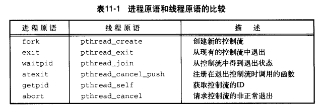

```c
#include <pthread.h>
int pthread_detach(pthread_t tid);
//Returns: 0 if OK, error number on failure
```

设置线程的分离状态，以后线程自己完成后将不必`join`，也不能`join`，最好是在创建它的线程与被创建线程都运行一下`pthread_detach`，确保不管谁先运行，均能保证被分离了（最好使用这种方式，而不是在创建线程时使用`pthread_attr_t`）

## 线程同步
### 互斥量
使用互斥量（mutex）接口保护数据，操作系统只是锁住互斥量，而并不是真正的对数据访问做串行化，如果允许某个线程在没有得到锁的情况下（或通过其它手段），也访问共享资源，还是会出现数据不一致

> 当一个线程对普通互斥量加锁，另一个线程去解锁（不占用时解锁），并且互斥量类型为递归和检查错误时，会产生错误，可考虑使用信号量来实现一个可自己加锁，另一线程解锁的机制

```c
#include <pthread.h>
int pthread_mutex_init(pthread_mutex_t *restrict mutex, const pthread_mutexattr_t *restrict attr );
int pthread_mutex_destroy(pthread_mutex_t * mutex);
//Both return: 0 if OK, error number on failure
```

创建时可使用宏，`pthread_mutex_t mutex = PTHREAD_MUTEX_INITIALIZER`来初始化一个互斥量，但结束时也需要`pthread_mutex_destroy`

```c
#include <pthread.h>
int pthread_mutex_lock(pthread_mutex_t *mutex);
int pthread_mutex_trylock(pthread_mutex_t * mutex);
int pthread_mutex_unlock(pthread_mutex_t *mutex);
//All return: 0 if OK, error number on failure
```

上面三个函数是不会被信号打断的，失败也不会设置`errno`

```c
#include <pthread.h>
#include <time.h>
int pthread_mutex_timedlock(pthread_mutex_t *restrictmutex,const struct timespec *restricttsptr);
//Returns: 0 if OK, error number on failure
```

带超时设计的互斥量

### 避免死锁
- 自死锁，A加锁，A引用B，在A未解锁之前，B还加锁，导致自死锁
> - 解决办法是，强调设计规范：
> - 比如内核设计，设计出三类函数：用户态函数，接口函数，内核函数；
> - 用户态可访问接口，接口可直接访问资源，也可通过内核访问资源
> - 接口不能访问接口，内核不能访问接口
> - 将 __互斥量设计在接口__ 上
> - 比如栈的实现，必备的接口是入栈与出栈，如果设计一个是否栈空的接口，则不能让出栈接口直接调用它，而应设计一个是否栈空的普通函数，出栈接口调用这个普通函数，而否栈空的接口也使用它

- ABBA死锁，多个线程同时访问多个资源，一个锁住了A资源，试图加锁B资源，而另一个线程此时已加锁了B资源，并试图加锁A资源，两个线程进入死锁状态
> - 解决办法是，强调对资源的访问顺序，但如果资源是环型的，典型的如 __哲学家就餐__ 问题
> - 学院派做法是，尝试一次加两把锁，加不上的话，就放弃两把锁，并尝试休眠随机时间，再次尝试
> - 实践派做法是，牺牲性能，增加锁的粒度，一次把所有资源加上锁，如内核大锁

### 读写锁
建议不使用读写锁（又叫共享-独占锁），写锁容易饿死(好像已解决，当读写锁处于读模式锁住状态时，如果有另外线程试图以写模式加锁，读写锁通常会阻塞随后的读模式锁请求)

读写锁非常适合对数据结构读的次数远大于写的情况

```c
#include <pthread.h>
int pthread_rwlock_init(pthread_rwlock_t *restrict rwlock ,const pthread_rwlockattr_t *restrict attr );
int pthread_rwlock_destroy(pthread_rwlock_t *rwlock );
//Both return: 0 if OK, error number on failure

int pthread_rwlock_rdlock(pthread_rwlock_t *rwlock );
int pthread_rwlock_wrlock(pthread_rwlock_t *rwlock );
int pthread_rwlock_unlock(pthread_rwlock_t *rwlock );
//All return: 0 if OK, error number on failure

int pthread_rwlock_tryrdlock(pthread_rwlock_t *rwlock );
int pthread_rwlock_trywrlock(pthread_rwlock_t *rwlock );
//Both return: 0 if OK, error number on failure
```

### 条件变量
条件变量是线程可用的另一种同步机制，典型的模式是 __生产者消费者__

> 其实有时候，使用队列，生产数据入队列，消费数据出队列，队列满或空时，则阻塞，并且对出入队列进行加锁，也可以满足一些场景

```c
#include <pthread.h>
int pthread_cond_init(pthread_cond_t *restrict cond, const pthread_condattr_t *restrict attr);
int pthread_cond_destroy(pthread_cond_t *cond);
//Both return: 0 if OK, error number on failure

int pthread_cond_wait(pthread_cond_t *restrict cond, pthread_mutex_t *restrict mutex);
int pthread_cond_timedwait(pthread_cond_t *restrict cond,
                           pthread_mutex_t *restrict mutex,
                           const struct timespec *restrict tsptr);
//Both return: 0 if OK, error number on failure

int pthread_cond_signal(pthread_cond_t *cond);
int pthread_cond_broadcast(pthread_cond_t *cond);
//Both return: 0 if OK, error number on failure
```

`wait`信号时，依赖一个`mutex`，但`wait`意味着有可能休眠，而在`wait`之前，又需要先`lock`住这个`mutex`，持锁休眠是会导致死锁的，所以`wait`并不是真正的持锁休眠，下面的代码，在语义上是等价的，后者没有时间窗，是原子操作

```c
    while (1) {
        pthread_mutex_lock(&mutex);
#if 0
        while (data == 0) {
            unlock(&mutex);
            wait(&cond_j);
            lock(&mutex);
        }
#else
        while (data == 0) {
            pthread_cond_wait(&cond_j, &mutex);
        }
#endif
        //...
    }
```

另外，为什么使用`while (data == 0)`，而不是`if (data == 0)`，是因为会产生 __惊群现象__，到时候会N个线程得到唤醒，但最终却只有一个线程可以拿到数据，所以需要`while`再次确认是否需要`wait`

当然，完全可以使用`mutex`来保持双方同步，但有可能违反谁加锁就谁解锁的规范，并有可能导致程序不能正常退出。而`wait/signal`更像是 __通知机制__，不像互斥量需要成对出现

### 自旋锁
自旋锁不会引起调用者睡眠，如果自旋锁已经被别的执行单元持有，调用者就一直循环在那里看是否该自旋锁的持有者已经释放了锁，"自旋"一词就是因此而得名。自旋锁适用于锁使用者保持锁时间比较短的情况，使用自旋锁需要注意有可能造成的死锁情况

```c
#include <pthread.h>
int pthread_spin_init(pthread_spinlock_t *lock ,int pshared);
int pthread_spin_destroy(pthread_spinlock_t *lock );
//Both return: 0 if OK, error number on failure

int pthread_spin_lock(pthread_spinlock_t *lock );
int pthread_spin_trylock(pthread_spinlock_t *lock );
int pthread_spin_unlock(pthread_spinlock_t *lock );
//All return: 0 if OK, error number on failure
```

### 屏障
屏障barrier是用户协调多个线程并行工作的同步机制，屏障允许每个线程等待，直到所有的合作线程都到达某一点，然后从该点继续执行（`join`就是一种屏障）

```c
#include <pthread.h>
int pthread_barrier_init(pthread_barrier_t *restrict barrier,
                         const pthread_barrierattr_t *restric tattr,
                         unsigned int count);
int pthread_barrier_destroy(pthread_barrier_t *barrier);
//Both return: 0 if OK, error number on failure

int pthread_barrier_wait(pthread_barrier_t *barrier);
//Returns: 0 or PTHREAD_BARRIER_SERIAL_THREAD if OK, error number on failure
```

初始化时，`count`指定必须到达屏障线程数目，`wait`表示，线程已完成工作，准备等所有其他线程赶来

线程控制
========
## 线程限制
通过`sysconf(_SC_THREAD_THREADS_MAX)`可得到单个进程可以创建的最大线程数

## 线程属性
```c
#include <pthread.h>
int pthread_attr_init(pthread_attr_t * attr );
int pthread_attr_destroy(pthread_attr_t *attr );
//Both return: 0 if OK, error number on failure

int pthread_attr_getdetachstate(const pthread_attr_t *restrict attr , int *detachstate);
int pthread_attr_setdetachstate(pthread_attr_t * attr ,int detachstate);
//Both return: 0 if OK, error number on failure
```

基本上可以设置的就是`detachstate`，并且还有替代方案，其它的属性，缓冲区、栈等的设置，最好不用

```c
int makethread(void *(*fn)(void *), void *arg){
    int  err;
    pthread_t  tid;
    pthread_attr_t  attr;
    err = pthread_attr_init(&attr);
    if (err != 0)
        return(err);
    err = pthread_attr_setdetachstate(&attr, PTHREAD_CREATE_DETACHED);
    if (err == 0)
        err = pthread_create(&tid, &attr, fn, arg);
    pthread_attr_destroy(&attr);
    return(err);
}
```

### 线程并发度
并发度的设置，在linux上是无效的，内核线程与用户级线程是一对一的

```c
#include <pthread.h>
int pthread_setconcurrency(int new_level);
int pthread_getconcurrency(void);
```

## 同步属性
### 互斥量属性
```c
#include <pthread.h>
int pthread_mutexattr_init(pthread_mutexattr_t * attr );
int pthread_mutexattr_destroy(pthread_mutexattr_t *attr );
//Both return: 0 if OK, error number on failure

int pthread_mutexattr_getpshared(const pthread_mutexattr_t *restrict attr ,int *restrict pshared);
int pthread_mutexattr_setpshared(pthread_mutexattr_t *attr ,int pshared);
//Both return: 0 if OK, error number on failure

int pthread_mutexattr_gettype(const pthread_mutexattr_t *restrict attr ,int *restrict type );
int pthread_mutexattr_settype(pthread_mutexattr_t *attr ,int type );
//Both return: 0 if OK, error number on failure
```

`pthread_mutexattr_setpshared`修改 __进程共享__ 属性，`pshared`为`PTHREAD_PROCESS_PRIVATE`时允许线程库提供更有效互斥量实现，`PTHREAD_PROCESS_SHARED`时多个进程共享的内存区域中分配的互斥量就可以用于这些进程的同步

```c
#include <pthread.h>
int pthread_mutexattr_gettype(const pthread_mutexattr_t *restrict attr, int *restrict type);
int pthread_mutexattr_settype(pthread_mutexattr_t *attr, int type);
//Both return: 0 if OK, error number on failure
```

类型互斥量属性：

- `PTHREAD_MUTEX_NORMAL`linux上一般为此，标准的互斥量类型，不做任何特殊的错误检查或死锁检测
- `PTHREAD_MUTEX_ERRORCHECK`提供错误检查
- `PTHREAD_MUTEX_RECURSIVE`递归锁，允许同一线程在互斥量解锁之前对该互斥量进行多次加锁，它维护一个计数，在解锁次数和加锁次数不相同的情况下不会释放锁（递归锁不得已才使用）
- `PTHREAD_MUTEX_DEFAULT`

互斥量类型行为

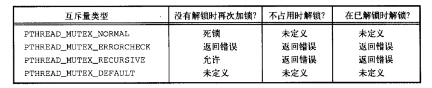

- 一个避免递归锁的做法（通过接口设计改善）

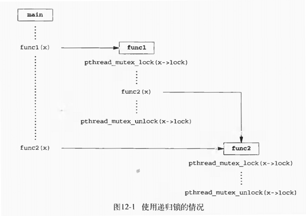

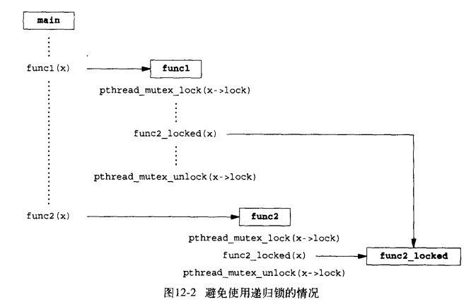


## 重入
如果一个函数在相同的时间点可以被多个线程安全的调用，称该函数是线程安全的

很多函数并不是线程安全的，因为它们返回的数据存放在静态的内存缓冲区，但操作系统可能提供了线程安全的版本，在名字最后加了`_r`

- `getgrgid_r`
- `localtime_r`
- `getgrnam_r`
- `readdir_r`
- `getlogin_r`
- `strerror_r`
- `getpwnam_r`
- `strtok_r`
- `getpwuid_r`
- `ttyname_r`
- `gmtime_r`

如果一个函数对多个线程来说是可重入的，就是 __线程安全__ 的，但不能说明对信号处理程序来说也是可重入的。(如果异步信号处理程序的重入是安全的，则说函数是 __异步信号安全__ 的)

## 线程特定数据
为兼容设计，如`errno`在线程出现以前定义为进程上下文中全局可访问的整数，但在`#include <pthread.h>`后，则重新定义为线程私有数据。

全新项目不建议使用，新线程需要私有数据时，完全可以使用`malloc`

> 如果需要线程全局的数据，用来保持类似闭包的数据，还是有必要的

```c
#include <limits.h>
#include <string.h>
#include <pthread.h>
#include <stdlib.h>

#define MAXSTRINGSZ 4096

static pthread_key_t key;
static pthread_once_t init_done = PTHREAD_ONCE_INIT;
pthread_mutex_t env_mutex = PTHREAD_MUTEX_INITIALIZER;

extern char **environ;

static void
thread_init(void)
{
    pthread_key_create(&key, free);
}

char *
getenv(const char *name)
{
    int     i, len;
    char    *envbuf;

    pthread_once(&init_done, thread_init);
    pthread_mutex_lock(&env_mutex);
    envbuf = (char *)pthread_getspecific(key);
    if (envbuf == NULL) {
        envbuf = malloc(MAXSTRINGSZ);
        if (envbuf == NULL) {
            pthread_mutex_unlock(&env_mutex);
            return(NULL);
        }
        pthread_setspecific(key, envbuf);
    }
    len = strlen(name);
    for (i = 0; environ[i] != NULL; i++) {
        if ((strncmp(name, environ[i], len) == 0) &&
          (environ[i][len] == '=')) {
            strncpy(envbuf, &environ[i][len+1], MAXSTRINGSZ-1);
            pthread_mutex_unlock(&env_mutex);
            return(envbuf);
        }
    }
    pthread_mutex_unlock(&env_mutex);
    return(NULL);
}
```

## 取消选项
可取消状态和可取消类型，影响着线程在响应`pthread_cancel`函数调用时所呈现的行为

> `pthread_cancel`建议不使用

```c
#include <pthread.h>
int pthread_setcancelstate(intstate,int *oldstate);
//Returns: 0 if OK, error number on failure
```

`pthread_cancel`调用并不等待线程终止，只是请求发出，线程还是继续运行，直到线程到达某个取消点

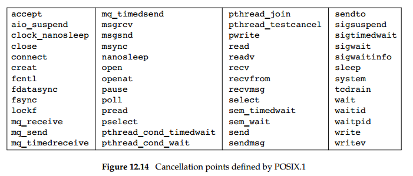

## 线程和信号
进程中的信号是传递给单个线程的，如果一个信号与硬件故障相关，该信号一般发送到该事件的线程中去，而其他信号则被发送到任意一个线程

可使用`ptherd_sigmask`来屏蔽线程的信号响应

```c
#include <signal.h>
int pthread_sigmask(inthow,const sigset_t *restrict set,sigset_t *restrict oset);
//Returns: 0 if OK, error number on failure
int sigwait(const sigset_t *restrict set,int *restrict signop);
//Returns: 0 if OK, error number on failure
```

`sigwait`将从进程中移除处于挂起等待状态的信号，其它的还排除，等待下次调用

可以让所有线程都阻塞信号，只让一个线程处理这些信号

```c
sigset_t set;
int signo;

sigemptyset(&set);
sigaddset(&set, SIGINT);

while (1) {
    sigwait(&set, &signo);
    if (signo == SIGINT) {
        printf("Catch SIGINT\n");
    }
}
```

或者在子线程中再次去掉屏蔽

```c
sigset_t set;
signal(SIGINT, handler);

sigemptyset(&set);
sigaddset(&set, SIGINT);
pthread_sigmask(SIG_UNBLOCK, &set, NULL);
```

发送信号给线程

```c
#include <signal.h>
int pthread_kill(pthread_t thread,int signo);
//Returns: 0 if OK, error number on failure
```

## 线程与进程
如果既需要多进程，也需要多线程时，应该先`fork`进程，再创建线程


## 线程和IO
为了原子操作，使用`pread/pwrite`


进程间通信
==========
与其网络间通信说是机器间通信，不如说是进程间通信

如果需要大内存，并且用完直接释放（直接设置`sbrk`，而不是`free`），可使用`mmap`。其实也可`fork`一个进程，去`malloc`一个大内存，父子间进行进程间通信，用完后`free`，再终止该进程

如果需要进程间通信，__优先__ 使用管道，其次为FIFO，再次为套接字，不得以，且需要大数据通信时，才考虑共享内存（sysV IPC的消息队列基本不用考虑，信号量谨慎使用）

## 管道
- 历史上它是半双工的，现在某些系统提供双工，但为了移植性，认为它是半双工的(需要双向通信时，打开两个管道)
- 只能在具有公共祖先的进程之间使用，通常管道由一个进程创建，然后该进程调用`fork`，此后父子进程可应用该管道
> 当你在管道线中键入一个由shell执行的命令序列时，shell为每一条命令单独创建一进程，然后将前一条命令进程的标准输出用管道与后一条命令的标准输入相连接

```c
#include <unistd.h>
int pipe(int fd[2] );
//Returns: 0 if OK,−1 on error
```

`fstat`函数对管道每一端返回一个`FIFO`类型的文件描述符，可用`S_ISFIFO`宏来测试管道

`fd[0]`为读而打开，`fd[1]`为写而打开，后者的输出是前者的输入

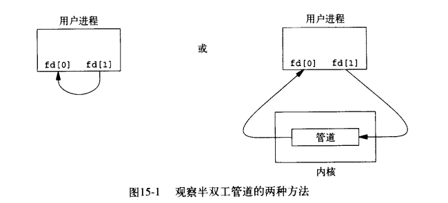

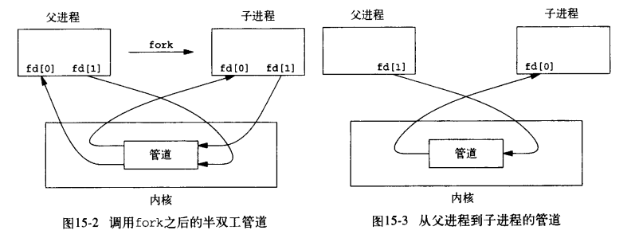

```c
#define BUFSIZE 64
int main(void){
    pid_t pid;
    int fd[2];
    int ret;
    char buf[BUFSIZE];

    pipe(fd);

    pid = fork();
    /* if error */
    if (pid == 0) {
        close(fd[0]);
        write(fd[1], "hello pipe\n", 11);
        close(fd[1]);

        return 0;
    }

    close(fd[1]);
    ret = read(fd[0], buf, BUFSIZE);
    write(1, buf, ret);
    close(fd[0]);

    return 0;
}
```

如果写关闭，则读端最后读到0，指示达到了文件结束处；如果读关闭，写端还继续写，则产生`SIGPIPE`信号，如果忽略该信号或捕捉该信号并从其处理程序返回，则返回-1，`errno`为`EPIPE`

上面例子是直接对管道描述符调用`read/write`，更好的方法是将描述符复制为 __标准输入和标准输出__

```c
dup2(fd[0], STDIN_FILENO);//把fd[0]复制到标准输入
```

### TELL/WAIT实现2
```c
static int  pfd1[2], pfd2[2];

void
TELL_WAIT(void)
{
    if (pipe(pfd1) < 0 || pipe(pfd2) < 0)
        err_sys("pipe error");
}

void
TELL_PARENT(pid_t pid)
{
    if (write(pfd2[1], "c", 1) != 1)
        err_sys("write error");
}

void
WAIT_PARENT(void)
{
    char    c;

    if (read(pfd1[0], &c, 1) != 1)
        err_sys("read error");

    if (c != 'p')
        err_quit("WAIT_PARENT: incorrect data");
}

void
TELL_CHILD(pid_t pid)
{
    if (write(pfd1[1], "p", 1) != 1)
        err_sys("write error");
}

void
WAIT_CHILD(void)
{
    char    c;

    if (read(pfd2[0], &c, 1) != 1)
        err_sys("read error");

    if (c != 'c')
        err_quit("WAIT_CHILD: incorrect data");
}
```

## popen/pclose函数
```c
#include <stdio.h>
FILE *popen(const char *cmdstring,const char *type );
//Returns: file pointer if OK, NULL on error
int pclose(FILE *fp );
//Returns: termination status ofcmdstring,or −1 on error
```

上节使用`dup2()`来复制标准输入或输出，可以利用现有命令来组成程序，它的模式一般为，`fork`子进程，`dup2`到标准IO，`execlp`shell命令

<!-- run -->

```c
#include <unistd.h>
#include <stdio.h>
/* cat /etc/passwd | grep ftp */
int main(void){
    pid_t pid;
    int fd[2];

    pipe(fd);

    /* cat */
    pid = fork();
    /* if error */
    if (pid == 0) {
        if (fd[1] != 1) {
            dup2(fd[1], 1);
            close(fd[1]);
        }
        close(fd[0]);
        execlp("cat", "cat", "/etc/passwd", NULL);
        perror("cat: /etc/passwd");
        return 1;
    }

    /* grep */
    pid = fork();
    if (pid == 0) {
        if (fd[0] != 0) {
            dup2(fd[0], 0);
            close(fd[0]);
        }
        close(fd[1]);
        execlp("grep", "grep", "ftp", NULL);
        perror("grep: ftp");
        return 1;
    }

    close(fd[0]);
    close(fd[1]);

    wait(NULL);
    wait(NULL);

    return 0;
}
```

其中`if (fd[1] != 1)`为了确保不是标准输出时才复制到标准输出，同时能够关闭原始的文件描述符。

注意这里不能使用两个进程（即只`fork`一次），将会导致孤儿进程组（`SIGHUP`），或切入后台进程组（`SIGTTOU`），导致非预想状态，写程序时，必须要 __确保父进程不能随便退出__，除非这就是想要的（如守护进程）

为了方便这种常见的操作，提供了`popen()`

<!-- run -->

```c
#include <stdio.h>
#define BUFSIZE 128

int main(void){
    FILE *fp;
    char buf[BUFSIZE];

    fp = popen("cat /etc/passwd | grep ftp", "r");
    /* if error */

    fgets(buf, BUFSIZE, fp);
    printf("\033[31m%s\033[0m\n", buf);

    pclose(fp);

    return 0;
}
```

`pclose()`关闭标准IO流，等待命令执行结束，然后返回shell的终止状态，如果shell不能被执行，则`pclose`返回的终止状态与shell已执行`exit`一样

## 协同进程
过滤程序从标准输入读取数据，对其进行适当处理后写到标准输出。几个过滤程序通常在shell管道命令行中线性的连接。当一个程序产生某个过滤程序的输入，同时又读取该过滤程序的输出时，则该过滤程序成为协同进程

协同进程通常在shell后台运行，其标准输入和标准输出通过管理连接到另一个程序

当使用标准IO时，请及时使用`fflush`，以防缓冲区问题导致死锁

> 协同进程只是一种术语，一般使用`fork/exec`，并使用`pipe`通信

## FIFO
命名管道，只有`pipe`不能使用时，才考虑使用，可以`mkfifo(1)`创建，也可使用下面函数

```c
#include <sys/stat.h>
int mkfifo(const char * path ,mode_tmode);
int mkfifoat(int fd ,const char *path ,mode_tmode);
//Both return: 0 if OK, −1 on error
```

读写双方，都需要`open`了管道，才可以进行读写操作，否则先`open`的一方则阻塞(除非`open`时使用了`O_RDONLY|O_NONBLOCK`)，直到另一方也`open`了，所以，如果双方建立了两个管道，但`open`的次序不同，就会发生 __死锁__ 现象

> 阻塞时，标准输入还是可以使用的，只不时此时放在缓冲区中，并未真正的被读到
>
> 如果使用了`O_NONBLOCK`，并且打开方式是`O_WRONLY or O_RDWR`时，将得到-1，`errno`为`EISDIR`

使用FIFO和`tee`将一个流发送到两个不同的进程

```shell
mkfifo fifo1
prog3 < fifo1 & prog1 < infile | tee fifo1 | prog2
```

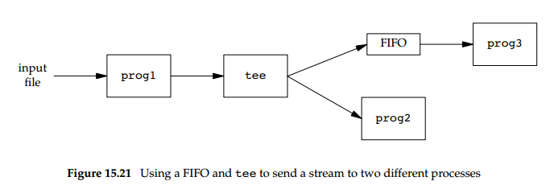

## XSI IPC (SysV IPC)
> 有其他选择时，不考虑该类IPC

有三种IPC，消息队列、信号量、共享内存，可通过`ipcs(1)/ipcrm(1)`查看/编辑当前ipc的情况

### 标识符和键
每个内核中的IPC结构，都用一个非负整数的标识符加以引用，如为了对一个消息队列发送或取消息，只需要知道其队列标识符(identifier)。当一个IPC结构被创建，以后又被删除时，与这种结构相关的标识符连续加1，直至达到一个整型数的最大正值，然后回转到0

标识符是IPC对象的 __内部名__，为了使多个合作进程能够在同一个IPC对象上会合，需要提供一个 __外部名__ 方案，为此使用键(key)

无论何时创建IPC结构，都应指定一个键，类型是`key_t`，通常定义在`<sys/types.h>`，为长整型，键由内核变换成标识符

> 如果引用头文件`<sys/types.h>`，请将它放在引用头文件的首部

- `IPC_PRIVATE`键可用于父子/兄弟进程间通信
- 在一个公用头文件中定义一个客户进程和服务器进程都认可的键，然后服务器进程指定此键创建一个新的IPC结构(确保不跟已有冲突)
- 客户进程和服务器进程认同一个路径名和项目ID（`unsigned char`），使用`ftok`产生一个键

```c
#include <sys/ipc.h>
key_t ftok(const char * path ,int id );
//Returns: key if OK, (key_t)−1 on error
```

`path`必须引用一个现存的文件(并且是可访问到，但不一定是可读写)，当产生键时，只使用`id`参数的低8位

三个`get`(`msgget`,`semget`,`shmget`)都有两个类似的参数，一个`key`和一个整型`flag`，如果`key`为`IPC_PRIVATE`或`flag`指定了`IPC_CREAT`位，则创建一个新的IPC结构

为了确保不是引用现行的一个IPC结构，必须在`flag`中同时指定`IPC_CREAT`和`IPC_EXCL`，如果已存在，会出错，返回`EEXIST`

### 权限结构
每一个IPC结构设置了一个`ipc_perm`结构（`<sys/ipc.h>`），该结构规定了权限和所有者

```c
struct ipc_perm {
    uid_t  uid;  /* owner’s effective user ID */
    gid_t  gid;  /* owner’s effective group ID */
    uid_t  cuid; /* creator’s effective user ID */
    gid_t  cgid; /* creator’s effective group ID */
    mode_t mode; /* access modes */
    ...
};
```

在创建时，所有字段都是赋初值，可调用`msgctl/semctl/shmctl`修改这些值，但调用进程必须是IPC的创建者或超级用户，`mode`除了不存在执行权限，其它同文件权限

### 优缺点
进程创建了一个消息队列，在该队列中放入消息，然后终止，但该消息队列及其内容并不会被删除（如遇进程异常终止，则存在清理问题），与此相比，当最后访问管道的进程终止时，管道就完全的删除了（对于FIFP也如此，留在FIFP中数据此时全部被删除，只是名字仍保存在文件系统中）

IPC另一个问题是，它在文件系统中没有名字，不存在文件描述符，不能使用`select/poll`，使得难以使用多个IPC结构，以及在文件或设备IO中使用IO函数(即不能使一个服务器进程等待将要放在两个消息队列任一个中的消息)

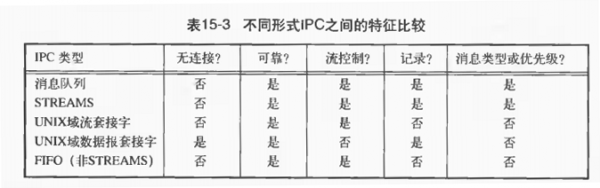

## 消息队列
`msgget`用于创建一个新队列或打开一个现存有队列，`msgsnd`将新消息添加到队列尾端，`msgrcv`用于从队列中取消息，我们并不一定要以先进先出的次序取消息，也可按消息类型字段取消息

```c
#include <sys/msg.h>
int msgget(key_t key,int flag);
//Returns: message queue ID if OK, −1 on error

int msgctl(int msqid, int cmd ,struct msqid_ds *buf );
//Returns: 0 if OK,−1 on error
```

`msgctl`对队列执行多种操作(垃圾桶函数)，以下三条`cmd`适用于信号量与共享内存

- `IPC_STAT`取得队列状态，放在`buf`中
- `IPC_SET`按`buf`中值，设置队列相关状态
- `IPC_RMID`删除该消息队列以及仍在该队列中的所有数据，这种删除 __立即生效__

执行`msgget`,`semget`,`shmget`时，`flag`是按位与的，创建标识与权限标识均由它表示，如`msgid = msgget(key, IPC_CREAT | 0666)`

```c
#include <sys/msg.h>
int msgsnd(int msqid,const void *ptr,size_t nbytes ,int flag);
//Returns: 0 if OK,−1 on error
```

`ptr`指向一个 __变长结构体__，可定义为（接受端也使用相同的结构体）

```c
struct msgbuf {
   long mtype;       /* message type, must be > 0 */
   char mtext[1];    /* message data */
};
```

`nbytes`说明数据缓冲区的长度，是上述结构体中除去`mtype`后的字节长度

`flag`值可以指定为`IPC_NOWAIT`，设置非阻塞标志，若消息队列已满，则使得`msgsnd`立即出错返回`EAGAIN`，否则则进程阻塞，直到有空间可以容纳发送的信息（或系统删除了此队列，或捕捉到一个信号`EINTR`）

`msgsnd`成功返回，与消息队列相关的`msqid_ds`结构得到更新，以标明发出该调用的进程ID`msg_lspid`、进行该调用的时间`msg_stime`，并指示队列中增加了一条`msg-qnum`

```c
#include <sys/msg.h>
ssize_t msgrcv(int msqid,void *ptr,size_t nbytes ,long type ,int flag);
//Returns: size of data portion of message if OK, −1 on error
```

此处的`ptr`指向的结构体同`msgsnd`，`nbytes`说明数据缓冲区的长度，`type`是指定想要哪一种消息

- ==0，返回队列中第一个消息
- >0，返回队列中消息类型为type的第一个消息，即发送方定义的变长结构体的`mtype`成员的值
- <0，返回队列中消息类型值小于或等于type绝对值的消息，如果有若干个，则取最小的消息，常见的设计是，保留一个值以内的消息类型，比如1000以内为系统内容管理类消息，目前只有一个接受端来处理，则时`type==-1000`即可，将来，各种管理消息多了，可分别设置不同的接受端来处理，从而增加了系统弹性

`flag`可设置`MSG_NOERROR`，当返回的消息大于`nbytes`，则该消息被截断，如果不设置，而消息又太长，则出错返回`E2BIG`（消息仍在队列中）；可设置`IPC_NOWAIT`，使操作不阻塞

`msgrcv`成功执行时，内核也更新`msqid_ds`结构

## semaphore信号量
主要应用场景：

- 加锁，并且可以用于进程间同步（也可用于线程间），并且是基于整数计数的，可以先解锁再加锁。但此场景，可使用文件记录锁来代替
- 提交任务，如PV操作，典型的场景是 __生产者消费者__ 模式，（但该模式的最好方案却是使用队列[非消息队列，可用管道来实现]）
- 做流控，给每个客户端限速，在指定时间间隔里，对每个客户端发放一定token（每个token可指定流量大小），并且规划好单位时间内，共放发的token（防止单一客户端累积大量token，然后在某个时间内全部用完，导致其他客户端无流量可用）
- 通过对信号量数组的操作，方便实现 __栅栏同步__ 模式，可使用 线程同步中的屏障 来实现

缺点是：

- 信号的创建`semget`是独立于它的初始化`semctl`(该函数同时也可以设置获取状态，删除等功能)，不能原子的创建一个信号量集合，并且对该集合中各个信号量赋初值
- 当程序意外终止时，并不会释放已经分配给它的信号量，一可以导致清理问题，二可以导致其它进程的死锁

```c
#include <sys/sem.h>
int semget(key_t key,int nsems,int flag);
//Returns: semaphore ID if OK,−1 on error
```

`nsems`是创建数量，如果是客户进程，可引用现有集合，将`nsems`指定为0

```c
#include <sys/sem.h>
int semctl(int semid, int semnum, int cmd,... /* union semun arg */ );
//Returns: (see following)

union semun {
    int  val; /* for SETVAL */
    struct semid_ds *buf;  /* for IPC_STAT and IPC_SET */
    unsigned short *array; /* for GETALL and SETALL */
};
```

这也是一个垃圾筒函数，`cmd`可以为

- `IPC_STAT/IPC_SET`，使用`arg.buf`来设置或获取
- `IPC_RMID`删除信号量集合，这种删除是立即发生的，仍使用此信号量集合的进程，试图对信号量集合操作时，将出错返回`EIDRM`，当删除时，无需指定`semnum`，一般 __习惯上__ 传入`-1`表示不会被使用到
- `GETVAL/SETVAL`，由`arg.val`指定
- `GETALL/SETALL`，由`arg.array`指定，设置信号数组

```c
#include <sys/sem.h>
int semop(int semid,struct sembuf semoparray[], size_t nops);
//Returns: 0 if OK,−1 on error

struct sembuf {
    unsigned short sem_num;  /* member # in set (0, 1, ..., nsems-1) */
    short  sem_op; /* operation (negative, 0, or positive) */
    short  sem_flg; /* IPC_NOWAIT, SEM_UNDO */
};
```

`semoparray`是一个指向一个由`sembuf`结构表示的信号量操作数组，`sembuf.sem_num`指向信号集合的下标，`sembuf.sem_op`可为正负数，分别表示释放或获取资源

如果在进程终止时，它占用了经由信号量分配的资源，只要为信号量操作指定了`SEM_UNDO`标志，然后分配资源（如op -1），内核将记录，分配给调用进程多少资源，当进程终止时，内核将检验该进程是否还有尚未处理的信号调整值，如有，按调整值对相应信号量值进行处理（但如果是任务提交类的需求，不适合使用undo设置）

实现的一个栅栏同步的例子：

<!-- run -->

```c
#include <sys/types.h>
#include <sys/ipc.h>
#include <sys/sem.h>
#include <unistd.h>

#include <stdio.h>

#define PROC_NUM   6

static int dec(int semid, int ind){
    struct sembuf buf;

    buf.sem_num = ind;
    buf.sem_op = -1;
    buf.sem_flg = 0;

    return semop(semid, &buf, 1);
}

static int inc(int semid, int ind){
    struct sembuf buf;

    buf.sem_num = ind;
    buf.sem_op = 1;
    buf.sem_flg = 0;

    return semop(semid, &buf, 1);
}

static void jobs(int semid, int ind){
    int i;

    srand(getpid());

    for (i = 0; i < 10; i++) {
        dec(semid, ind);
        sleep((unsigned)rand() % 5 + 1);
        printf("%d ", ind);
        fflush(stdout);
        inc(semid, PROC_NUM);
    }
}

static int wait_all(int semid){
    struct sembuf buf;

    buf.sem_num = PROC_NUM;
    buf.sem_op = -PROC_NUM;
    buf.sem_flg = 0;

    return semop(semid, &buf, 1);
}

int main(void){
    pid_t pid;
    int i;
    int semid;
    unsigned short init_arr[PROC_NUM + 1];
    struct sembuf buf[PROC_NUM];

    semid = semget(IPC_PRIVATE, PROC_NUM + 1, 0600);
    /* if error */

    for (i = 0; i < PROC_NUM; i++) {
        init_arr[i] = 1;
    }
    init_arr[i] = 0;
    semctl(semid, -1, SETALL, init_arr);

    for (i = 0; i < PROC_NUM; i++) {
        pid = fork();
        /* if error */
        if (pid == 0) {
            jobs(semid, i);
            return 0;
        }
    }

    /* init op_arr */
    for (i = 0; i < PROC_NUM; i++) {
        buf[i].sem_num = i;
        buf[i].sem_op = 1;
        buf[i].sem_flg = 0;
    }

    for (i = 0; i < 10; i++) {
        wait_all(semid);
        printf("\n");
        semop(semid, buf, PROC_NUM);
    }

    for (i = 0; i < PROC_NUM; i++) {
        wait(NULL);
    }

    return 0;
}
```

## 共享内存
它需要额外的一些同步技术（如信号量）来确保不会发生资源竞争

```c
#include <sys/shm.h>
int shmget(key_t key,size_t size,int flag);
//Returns: shared memory ID if OK,−1 on error
```

`size`以字节为单位，一般取为系统页长的整倍数，如4096

```c
#include <sys/shm.h>
int shmctl(int shmid,int cmd,struct shmid_ds *buf);
//Returns: 0 if OK,−1 on error
```

`cmd`为`IPC_RMID`时，删除共享存储段，但不同于前面两个，此时只是标记删除，等最后一个进程终止时（或与段分离），才真正删除

```c
#include <sys/shm.h>
void *shmat(int shmid,const void *addr,int flag);
//Returns: pointer to shared memory segment if OK,−1 on error
```

一般不指定`addr`的地址，直接使用`NULL`，由系统选择地址，`flag`可指定`SHM_RDONLY`是否为只读

```c
#include <sys/shm.h>
int shmdt(const void *addr);
//Returns: 0 if OK,−1 on error
```

`adrr`为`shmat`返回的地址

共享内存所在位置

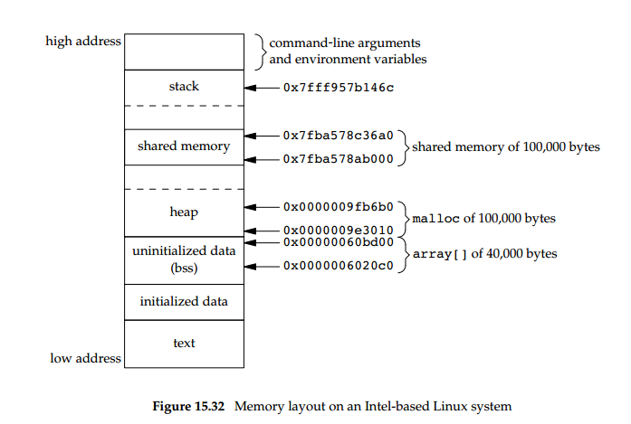


## POSIX信号量
POSIX信号量有命名和未命名的，差异在于创建和销毁的形式上，未命名信号量只存在于内存中，并要求能使用信号量的进程必须可以访问内存，意味着只能用于同一进程的不同线程，或不同进程中已映射相同内存内容到它们地址空间中的线程；命名信号量可通过名字访问，可在不同进程间使用


```c
#include <semaphore.h>
sem_t *sem_open(const char * name,int oflag ,... /* mode_t mode,
unsigned int value */ );
//Returns: Pointer to semaphore if OK,SEM_FAILED on error

int sem_close(sem_t *sem );
//Returns: 0 if OK,−1 on error

int sem_unlink(const char *name);
//Returns: 0 if OK,−1 on error
```

如果进程没有调用`sem_close`而退出，那么内核将自动关闭任何打开的信号量，但不会影响信号量的状态，类似的，如果调用了，信号量的值也不受影响，没有XSI中UNDO机制

`sem_unlink`是删除信号量名字，如果有打开的引用，将延迟到最后一个打的引用关闭

```c
#include <semaphore.h>
int sem_trywait(sem_t * sem );
int sem_wait(sem_t *sem );
//Both return: 0 if OK, −1 on error

#include <time.h>
int sem_timedwait(sem_t *restrict sem ,const struct timespec *restrict tsptr );
//Returns: 0 if OK,−1 on error

int sem_post(sem_t *sem );
//Returns: 0 if OK,−1 on error
```

它是通过`sem_wait/sem_post`来实现减1和加1的操作，没有XSI中可以实现加减N的做法


```c
#include <semaphore.h>
int sem_init(sem_t *sem ,int pshared,unsigned int value);
//Returns: 0 if OK,−1 on error

int sem_destroy(sem_t * sem );
//Returns: 0 if OK,−1 on error
```

上面两个函数实现未名的信号量的创建与销毁

```c
#include <semaphore.h>
int sem_getvalue(sem_t *restrict sem ,int *restrict valp );
//Returns: 0 if OK,−1 on error
```

除非有额外的同步机制，否则`sem_getvalue`得到的值，可以已经被改变了，只适用于调试

用POSIX信号量实现的栅栏同步

```c
#include <sys/types.h>
#include <fcntl.h>
#include <sys/stat.h>
#include <semaphore.h>
#include <unistd.h>

#include <stdio.h>
#include <errno.h>

#define PROC_NUM   6

static void jobs(int ind){
    int i;
    sem_t *self, *parent;
    char name_self[16];
    char name_parent[16];

    snprintf(name_self, 16, "mysem%d", ind);
    self = sem_open(name_self, 0);
    /* if error */

    snprintf(name_parent, 16, "mysem%d", PROC_NUM);
    parent = sem_open(name_parent, 0);
    /* if error */

    srand(getpid());

    for (i = 0; i < 10; i++) {
        sem_wait(self);
        sleep((unsigned)rand() % 5 + 1);
        printf("%d ", ind);
        fflush(stdout);
        sem_post(parent);
    }
}

static int wait_all(sem_t *sem){
    int i = 0;
    int ret;

    while (i < PROC_NUM) {
        ret = sem_wait(sem);
        if (ret == -1) {
            if (errno == EINTR) {
                continue;
            }
            return -1;
        }

        i++;
    }
    return 0;
}

int main(void){
    pid_t pid;
    int i, j;
    sem_t *sem[PROC_NUM + 1];
    char name[PROC_NUM + 1][16];

    for (i = 0; i < PROC_NUM; i++) {
        snprintf(name[i], 16, "mysem%d", i);
        sem[i] = sem_open(name[i], O_CREAT, 0600, 1);
        /* if error */
    }
    snprintf(name[i], 16, "mysem%d", i);
    sem[i] = sem_open(name[i], O_CREAT, 0600, 0);
    /* if error */

    for (i = 0; i < PROC_NUM; i++) {
        pid = fork();
        /* if error */
        if (pid == 0) {
            jobs(i);
            return 0;
        }
    }

    for (i = 0; i < 10; i++) {
        wait_all(sem[PROC_NUM]);
        printf("\n");
        for (j = 0; j < PROC_NUM; j++) {
            sem_post(sem[j]);
        }
    }

    for (i = 0; i < PROC_NUM; i++) {
        wait(NULL);
    }

    for (i = 0; i < PROC_NUM + 1; i++) {
        sem_close(sem[i]);
    }

    return 0;
}
```


高级IO
=======

## 非阻塞IO
__低速系统调用__ 是可以会使进程 __永远阻塞__ 的一类系统调用：

- 如果某些文件类型（如管道、终端设备和网络设备）的数据并不存在，则读操作可能会使调用者永远阻塞
- 如果数据不能立即被上述同样类型的文件接受（由于在管道中无空间、网络流控制等），则写操作也会使调用者永远阻塞
- 在某种条件发生之前，打开某些类型的文件会被阻塞（如打开一个终端设备可能需等到与之连接的调制解调器应答，如又在没有其他进程已用读模式打开该FIFO时若以只写模式打开FIFO，也要等待）
- 对已加上强制性记录锁的文件进行读、写

> 虽然读写磁盘文件会使调用者在短暂时间内阻塞，并不能将与磁盘IO有关的系统调用视为低速

__非阻塞IO__ 可使我们调用`open/read/write`这样的IO操作，并使这些操作不会永远阻塞，如果操作不能完成，则调用立即出错返回。它比较占内存

__优先使用多线程__，非阻塞作为最后手段

> 裸机一般使用轮询+非阻塞，虽然占CPU资源，但这是必须的

给定的描述符有两种方法对其指定非阻塞IO

- 如果调用`open`，可指定`O_NONBLOCK`标志
- 对已打开的描述符，调用`fcntl`，使用`O_NONBLOCK`标志 (注意先获取再设置)

```c
flags = fcntl(fdr, F_GETFL);
flags |= O_NONBLOCK;
fcntl(fdr, F_SETFL, flags);
```

> 如果以非阻塞写到终端，将可以出现许多个`EAGAIN`

## 记录锁
当一个进程正在读或修改文件的某个部分时，可以阻止其他进程修改同一文件区，其实并不存在真正的记录，只是一个 与 __进程__ 相关的 __字节范围锁__

- 它只是建议锁，文件还是可以直接被操作的
- 它是一个区域锁，只锁部分字节
- 它支持读写锁
- 同一进程对同一文件（是真正的文件，不是描述符）的不同范围进行加锁，重叠部分的新锁代替旧锁，不同进程对同一文件已加锁部分再加锁（`F_SETLKW`）需要等待，(`F_SETLK`直接返回，`errno`为`EACCES/EAGAIN`)
- 一个进程可以对一个文件的多个区域锁
- 进程终止时（包括意外退出），或该进程对文件`close`时，锁释放

```c
fd1 = open(pathname, ...);
read_lock(fd1, ...);
fd2 = dup(fd1);
close(fd2);
```

> `close(fd2)`后，在`fd1`上设置的锁也被释放，将`dup`换成`open`，效果一样，如下

```c
fd1 = open(pathname, ...);
read_lock(fd1, ...);
fd2 = open(pathname, ...)
close(fd2);
```

- `fork`时，子进程 __不继承__ 这个锁 （因为不是同一进程）
- `exec`时，__继承__ 这个锁（还在同一进程内），需注意发生死锁的情况（如果先`fork`再`exec`就不用担心死锁），如果对一个文件描述符设置了`close-on-exec`标志，则相应文件所有锁被释放
- 当内核检测到死锁时，会选择一个进程收到出错返回

它也是通过`fcntl`来进行操作，`cmd`为`F_GETLK/F_SETLK/F_SETLKW`（`W`为等待），第三个参数是指向`flock`结构的指针

```c
struct flock {
   ...
   short l_type;    /* Type of lock: F_RDLCK,
                       F_WRLCK, F_UNLCK */
   short l_whence;  /* How to interpret l_start:
                       SEEK_SET, SEEK_CUR, SEEK_END */
   off_t l_start;   /* Starting offset for lock */
   off_t l_len;     /* Number of bytes to lock */
   pid_t l_pid;     /* PID of process blocking our lock
                       (F_GETLK only) */
   ...
};
```

锁区域由`l_start`和`l_len`指定，以下表示锁全文件

```c
struct flock lock;
lock.l_type = F_WRLCK;
lock.l_whence = SEEK_SET;
lock.l_start = 0;
lock.l_len = 0;
fcntl(fd, F_SETLKW, &lock);
```

`F_GETLK`不会报告调用进程自己持有的锁

## STREAMS
是SysV提供的，不建议使用，完全可以用套接字代替

## IO多路转接
它是多任务与轮询（非阻塞）之间的一个折衷

### select/pselect函数
```c
#include <sys/select.h>
int select(int maxfdp1, fd_set *restrict readfds,
           fd_set *restrict writefds, fd_set *restrict exceptfds ,
           struct timeval *restrict tvptr);
//Returns: count of ready descriptors, 0 on timeout, −1 on error
```

- `tvptr`为NULL时，则阻塞等待，除非指定的描述符中的一个已准备好或捕捉到一个信号`EINTR`
- `tvptr->tv_sec == 0 && tvptr->tv_usec == 0`立即返回
- 其它的则指定等待的超时时间，在等待中可被捕捉的信号中断

参数`readfds/writefds/exceptfds`是指向描述符的指针，说明关心的可读、可写或异常条件的各个描述符，存放在`fd_set`类型中，有关的操作如下：

```c
#include <sys/select.h>
int FD_ISSET(int fd ,fd_set *fdset );
//Returns: nonzeroif fd is in set, 0 otherwise
void FD_CLR(intfd ,fd_set *fdset );
void FD_SET(intfd ,fd_set *fdset );
void FD_ZERO(fd_set *fdset );
```

当`select`返回时，用`FD_ISSET`来测试该集中给定位是否仍旧值，存在表示该描述符可以被操作

`select`中间三个参数，任意一个或全部都可是空指针，表示对相应状态并不关心，如全部为空可可实现`sleep`的功能，不是基于信号的，而且可以精确到微秒，所以比较推荐(__网络超时也可使用这种方式__，而不是使用`alarm`)

```c
int sec;
struct timeval tv;

tv.tv_sec = sec;
tv.tv_usec = 0;
select(0, NULL, NULL, NULL, &tv);
```

第一个参数`maxfdp1`表示 __最大描述符加1__，在三个描述符集中找出最大描述符编号值，然后加1

`select`有三个可能返回值：

- -1表示出错，所指定的描述符都没有准备好时捕捉到一个信号，在此情况下，不修改其中任何描述符集
- 0表示没有描述符准备好，而且指定的时间已超时，此时所有描述符集被清0
- 正返回值表示已准备好的描述符数，是三个描述符集中准备好的描述符数之和，同一描述符如同时读写都准备好了，计数为2

__准备好__ 的意思是：

- 对读集中的一个描述符的`read`操作将不会阻塞，则描述符是准备好的。如果在一个描述符上碰到了文件结尾处，则`select`认为该描述符是可读的(准备好)，然后调用`read`时将返回0。（文件结束不是异常状态）
- 对写集中的一个描述符的`write`操作将不会阻塞，则描述符是准备好的
- 异常状态集中的一个描述符有一个未决异常状态（在网络连接上到达的带外数据，或处于数据包模式的伪终端上发生了某些状态），则描述符是准备好的
- 对于读、写和异常状态，普通文件描述符总是返回准备好

POSIX定义了`pselect`

```c
#include <sys/select.h>
int pselect(int maxfdp1, fd_set *restrict readfds,
            fd_set *restrict writefds, fd_set *restrict exceptfds ,
            const struct timespec *restrict tsptr ,
            const sigset_t *restrict sigmask);
//Returns: count of ready descriptors, 0 on timeout, −1 on error
```

`tsptr`使用了`struct timespec`，可以表示纳秒级别的精准度（还需要硬件要求）；可使用信号屏蔽字，如果为空，则与`select`相同，否则，在调用`pselect`时，以原子操作方式屏蔽相关信号，在返回时恢复以前信号

### poll函数
它起源于SysV，与STREAMS相关，但可用于任何类型的文件描述符

```c
#include <poll.h>
int poll(struct pollfd fdarray [], nfds_t nfds ,int timeout);
//Returns: count of ready descriptors, 0 on timeout, −1 on error

struct pollfd {
    int  fd; /* file descriptor to check, or <0 to ignore */
    short  events; /* events of interest on fd */
    short  revents;  /* events that occurred on fd */
};
```

它不是为每个状态（可读、可写和异常）构造一个描述符，而是构造一个`pollfd`结构数组，每个数组元素指定一个描述符编号以及对其所关心的状态

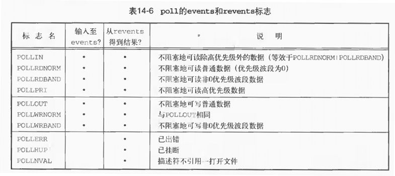

前面四行是有关读，接着是有关写，最后是测试异常状态，最后三行是由内核在返回时设置的，无须`events`中指定

当一个描述符被挂断`POLLHUP`后，就不能写向该描述符，但仍可能从中读到数据

`timeout`说明愿意等待多少时间

- -1永远阻塞，当所指定的描述符中的一个已准备好，或捕捉到一个信号时则返回（如捕捉到一个信号，则返回-1，`errno`为`EINTR`
- 0不等待，立即返回，得到多个描述符的状态而不阻塞`poll`函数的轮询方法
- >0等待`timeout`毫秒

文件结束与挂断之间区别，如果正从终端输入数据，并键入文件结束字符，`POLLIN`被打开，于是就可读文件结束指示(`read`返回0)，`POLLHUP`在`revents`中没有打开。如果正读调制解调器，并且电话线已挂断，则在`revents`中将接到`POLLHUP`

`select`和`poll`的可中断性，在SYR4下，如果指定了`SA_RESTART`，那么则是自动再启动的，但本书的各平台是不重启动的

### epoll
```c
#include <sys/epoll.h>
int epoll_create(int size);
int epoll_ctl(int epfd, int op, int fd, struct epoll_event *event);
int epoll_wait(int epfd, struct epoll_event * events, int maxevents, int timeout);
```
## 异步IO
### 信号驱动的IO
这种信号对每个进程而言只有1个，那么在接到此信号时进程无法判断哪一个描述符已准备好可以进行IO，为了确定是哪一个，仍需将多个描述符都设置为非阻塞的，并顺序执行IO

- 调用`sigaction`为`SIGIO`信号建立信号处理程序
- 以命令`F_SETOWN`调用`fcntl`来设置进程ID和进程组ID，它们将接收对于该描述符的信号
- 以命令`F_SETFL`调用`fcntl`来设置`O_ASYNC`文件状态标志，使在该描述符上可以进行信号驱动的IO (不建议直接`open`时指定`O_ASYNC`)

```c
signal(SIGIO, handler);
fdr = open("f1", O_RDONLY);

fcntl(fdr, F_SETOWN, getpid());

flags = fcntl(fdr, F_GETFL);
flags |= O_ASYNC;
fcntl(fdr, F_SETFL, flags);
```

- 如果需要自定义信号，则需要使用`F_SETSIG`

```c
signal(SIGUSR1, handler);
fdr = open("f1", O_RDONLY);

fcntl(fdr, F_SETOWN, getpid());
fcntl(fdr, F_SETSIG, SIGUSR1);

flags = fcntl(fdr, F_GETFL);
flags |= O_ASYNC;
fcntl(fdr, F_SETFL, flags);
```

### POSIX异步IO
```c
#include <aio.h>
int aio_read(struct aiocb *aiocb);
int aio_write(struct aiocb *aiocb);
//Both return: 0 if OK,−1 on error

struct aiocb {
    int  aio_fildes; /* file descriptor */
    off_t  aio_offset; /* file offset for I/O */
    volatile void *aio_buf;  /* buffer for I/O */
    size_t  aio_nbytes; /* number of bytes to transfer */
    int  aio_reqprio; /* priority */
    struct sigevent aio_sigevent; /* signal information */
    int  aio_lio_opcode; /* operation for list I/O */
};

struct sigevent {
    int  sigev_notify; /* notify type */
    int  sigev_signo; /* signal number */
    union sigval sigev_value;  /* notify argument */
    void (*sigev_notify_function)(union sigval); /* notify function */
    pthread_attr_t *sigev_notify_attributes; /* notify attrs */
};
```

异步IO操作必须显式的指定偏移量，它并不影响由操作系统维护的文件偏移量，只要不在同一进程里把异步IO和传统IO混用在同一个文件上，就不会导致问题。如果使用异步IO向一个追加模式打开的文件中写入数据，`aio_offset`会被忽略

应用程序使用`aio_reqprio`为异步IO请求顺序（只是建议，非强制）

`aio_sigevent`中`sigev_notify`是控制通知类型

- `SIGEV_NONE`异步IO请求完成后，不通知进程
- `SIGEV_SIGNAL`完成后，产生由`sigev_signo`指定的信号，如果应用程序已选择捕捉信号，且在信号处理程序（`sigaction`）的时候指定了`SA_SIGINFO`标志，那么该信号将被入队，信号处理程序会传送`siginfo`结构，该结构的`si_value`字段被设置为`sigev_value`
- `SIGEV_THREAD`完成时，由`sigev_notify_function`指定的函数被调用，`sigev_value`是参数，除非`sigev_notify_attributes`字段被设定为pthread属性结构的地址，且该结构指定了一个另外的线程属性，否则该函数将在 __分离状态__ 下的一个单独的线程中执行

IO操作在等待时，必须确保AIO控制块和数据缓冲区保持稳定，它们对应的内存必须始终是合法的，除非IO操作完成，否则不能被复用

```c
#include <aio.h>
int aio_fsync(intop,struct aiocb *aiocb);
//Returns: 0 if OK,−1 on error
```

`op`参数为`O_DSYNC`操作执行起来像`fdatasync`一样，为`O_SYNC`则像`fsync`一样

为了获知一个异步读、写、同步操作的完成状态，需要调用`aio_error`

```c
#include <aio.h>
int aio_error(const struct aiocb *aiocb);
//Returns: (see following)
```

- `0`异步操作成功完成，需要调用`aio_return`获取操作返回值
- `-1`调用失败，由`errno`说明原因
- `EINPROGRESS`操作仍在等待

```c
#include <aio.h>
ssize_t aio_return(const struct aiocb *aiocb);
//Returns: (see following)
```

直到异步完成前，需要小心调用`aio_return`，操作完成之前的结果是未定义的，还需要小心对每个异步操作只调用一次，一旦调用后，就释放了包含IO操作返回值的记录

如果调用本身失败，则返回-1，并设置`errno`，其它情况下，返回`read/write/fsync`被成功调用时可能返回的结果

如果完成了所有事务时，还有异步操作未完成时，可调用`aio_suspend`来阻塞进程，进到操作完成

```c
#include <aio.h>
int aio_suspend(const struct aiocb *const list[], intnent, const struct timespec *timeout);
//Returns: 0 if OK,−1 on error
```

- 如果被信号打断，返回-1，`errno`为`EINTR`
- 超时返回-1，`errno`为`EAGAIN`，不想设置超时，传空指针为`timeout`
- 有任何`list`中的IO操作完成将返回0

```c
#include <aio.h>
int aio_cancel(int fd,struct aiocb *aiocb);
//Returns: (see following)
```

在指定的文件描述符上取消未完成的异步IO，如果`aiocb`为NULL，则尝试所有该文件上的异步IO操作，返回为

- `AIO_ALLDONE`所有操作在尝试取消它们之前已完成
- `AIO_CANCELED`所有要求的操作被取消
- `AIO_NOTCANCELED`至少有一个要求的操作没被取消
- `-1`调用失败，设置`errno`

如果操作不能被取消，相应AIO控制不会因为它的调用而被修改

```c
#include <aio.h>
int lio_listio(int mode, struct aiocb *restrict const list[restrict],
               int nent, struct sigevent *restrict sigev);
//Returns: 0 if OK,−1 on error
```

`mode`为`LIO_WAIT`为同步，此时`sigev`忽略；为`LIO_NOWAIT`时，将IO请求入队后，立即返回，IO操作完成后，按`sigev`指定，被异步地通知（或者在AIO块中设置通知），`sigev`的通知是在 __所有__ IO操作完成后发送的

`aiocb`中的`aio_lio_opcode`在此处有了作用，`LIO_READ/LIO_WRITE/LIO_NOP`将对不同的AIO传给`aio_read/aio_write`来处理


## readv/writev函数
> 用户态很少用，驱动或裸机可能会用

用于在一次函数调用中读、写多个非连续缓冲区，有时也将这两个函数称为 __散布读__ 和 __聚集写__

```c
#include <sys/uio.h>
ssize_t readv(int fd ,const struct iovec *iov,int iovcnt );
ssize_t writev(int fd ,const struct iovec *iov,int iovcnt );
//Both return: number of bytes read or written, −1 on error

struct iovec {
    void  *iov_base; /* starting address of buffer */
    size_t  iov_len; /* size of buffer */
};
```

## readn/writen函数
> 非标准库方法

管道、FIFO以及某些设备，终端、网络和STREAMS设备有下列性质：

- 一次`read`操作所返回的数据可能少于所要求的数据，即使还没达到文件尾端也可能是这样，这不是一个错误，应当继续读该设备
- 一次`write`操作的返回值也可能少于指定输出的字节数（如流量控制），这也不是错误，应当继续写余下的数据至该设备（通常，只有对非阻塞描述符，或捕捉到一个信号时，才发生这种中途返回）

> 在读写磁盘文件时不会出现这种情况，除非文件系统用完了空间，或者接近了配额限制，而不能将要求写的数据全部写出

这两个函数功能是读写指定的N字节数据，并处理返回值小于要求值的情况，它们按需多次调用`read/write`直至读写了N字节数据

```c
ssize_t readn(int fd ,void *buf,size_tnbytes );
ssize_t writen(int fd ,void *buf,size_tnbytes );
//Both return: number of bytes read or written, −1 on error
```

具体实现

```c
ssize_t             /* Read "n" bytes from a descriptor  */
readn(int fd, void *ptr, size_t n)
{
    size_t      nleft;
    ssize_t     nread;

    nleft = n;
    while (nleft > 0) {
        if ((nread = read(fd, ptr, nleft)) < 0) {
            if (nleft == n)
                return(-1); /* error, return -1 */
            else
                break;      /* error, return amount read so far */
        } else if (nread == 0) {
            break;          /* EOF */
        }
        nleft -= nread;
        ptr   += nread;
    }
    return(n - nleft);      /* return >= 0 */
}

ssize_t             /* Write "n" bytes to a descriptor  */
writen(int fd, const void *ptr, size_t n)
{
    size_t      nleft;
    ssize_t     nwritten;

    nleft = n;
    while (nleft > 0) {
        if ((nwritten = write(fd, ptr, nleft)) < 0) {
            if (nleft == n)
                return(-1); /* error, return -1 */
            else
                break;      /* error, return amount written so far */
        } else if (nwritten == 0) {
            break;
        }
        nleft -= nwritten;
        ptr   += nwritten;
    }
    return(n - nleft);      /* return >= 0 */
}
```

若已读写了一些数据后出错，则这两个函数返回已传输的数据量，而非出错返回，与此类似，在读时如达到文件尾，而且在此之前已成功地读了一些数据，但尚未满足所要求的量，则`readn`返回已复制到调用者缓冲区中的字节数

## 存储映射IO
> 用户态也很少使用，主要用于驱动、或制作加载器（编写插件）

> 它可以用来申请大容量的内存，并在使用后直接归还给系统（不增加`sbrk`）

> 父子间进程通信时，可以将文件映射为`/dev/zero`，得到的内存相当于 __共享内存__（shm），或使用匿名存储映射`if ((area = mmap(0, SIZE, PROT_READ | PROT_WRITE, MAP_ANON | MAP_SHARED, -1, 0)) == MAP_FAILED)`


使一个磁盘文件与存储空间中的一个缓冲区相映射，于是当从缓冲区中取数据，就相当于读文件中的相应字节，将数据存入缓冲区，则相应字节自动地写入文件，这样可以在不使用`read/write`的情况下执行IO

```c
#include <sys/mman.h>
void *mmap(void *addr ,size_t len,int prot ,int flag,int fd ,off_t off);
//Returns: starting address of mapped region if OK, MAP_FAILED on error
```

`addr`用于指定映射存储区的起始地址，通常将其设置为0，表示由系统选择映射区的起始地址，此函数返回地址是该映射的起始地址

`fd`指要被映射文件的描述符，先要打开该文件，`len`是映射的字节数，`off`是映射字节在文件中的起始偏移量，通常应当是系统虚存页长度的倍数（通常指定0）。

`port`说明对映射存储区的保护要求，可任意组合的按位或，但不能超过文件`open`模式的访问权限，如文件是只读打开的，不能指定为`PORT_WRITE`

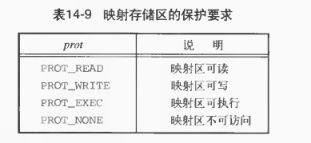

映射存储区位于堆和栈之间，但各种实现可能不尽相同

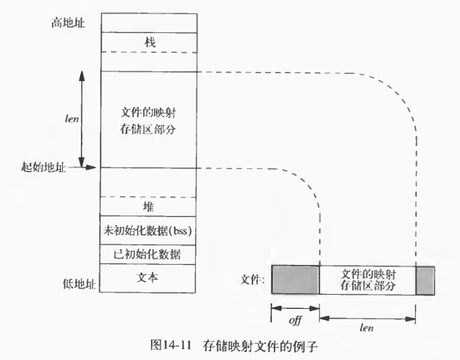

上图中的`起始地址`，是`mmap`的返回值

`flag`参数说明：

- `MAP_FIXED`返回值必须等于`addr`，这不利于可移植性，不鼓励使用，如果未指定定此标志，而且`addr`不为0，则内核认为是一种建议，不保证会使用所要求的地址
- `MAP_SHARED`本进程对映射区所进行的存储操作的配置，存储操作修改映射文件
- `MAP_PRIVATE`对映射区的存储操作导致创建该映射文件的一个私有副本，所以后来对该映射区的引用都是引用该副本，而不是原始文件（可用于调试程序）

假定文件长12字节，而系统页长512字节，则系统通常提供512字节的映射区，其后500字节设置为0，可以修改它，但任何变动都 __不会__ 在文件中反映出来

如果企图存数据到`mmap`指定为只读的映射区时，产生`SIGSEGV`信号，如果访问映射区的某个部分，而在访问时这一部分实际上已不存在，则产生`SIGBUG`信号

调用`fork`后，子进程继承存储映射区，但`exec`则不继承

> `mmap`后，在对内存的写不能超过文件本身的长度(多余部分在文件中是体现不出来的)，如需要修改文件的长度（映射区长度），需使用`truncate()`


`mprotect`更改一个现存映射区的权限

```c
#include <sys/mman.h>
int mprotect(void *addr ,size_t len, int prot );
//Returns: 0 if OK,−1 on error
```

`msync`将该页冲洗到被映射的文件中，如果映射是私有的，则不修改被映射的文件

```c
#include <sys/mman.h>
int msync(void *addr ,size_t len, int flags );
//Returns: 0 if OK,−1 on error
```

`flags`为`MS_ASYNC`或`MS_SYNC`中一个，表示是否阻塞冲洗

进程终止或调用了`munmap`之后，存储映射区就自动解除映射，关闭文件描述符则 __不解除__ 映射区，调用它，并 __不会__ 使映射区内容写到磁盘文件上，对于`MAP_SHARED`区磁盘文件的更新，在写到存储映射区时按内核虚存算法自动进行，在解除了映射后，对于`MAP_PRIVATE`存储区的修改被丢弃

```c
#include <sys/mman.h>
int munmap(void *addr ,size_tlen);
//Returns: 0 if OK,−1 on error
```

### 编写加载器
假设`add.plugin`是编译好的动态库，内有一个方法签名是`int func(int, int)`，并且通过`objdump -D`得知该方法的地址偏移是`0x3e0`

```c
int fd;
char *ptr;
int (*funcp)(int, int);

fd = open("add.plugin", O_RDONLY);
if (fd == -1) {
    perror("add.plugin");
    return 1;
}

ptr = mmap(NULL, 4096, PROT_EXEC | PROT_READ, MAP_PRIVATE, fd, 0);
/* if error */

/* cal offset by yourself */
funcp = (void *)(ptr + 0x3e0);
printf("%d\n", funcp(33, 66));

munmap(ptr, 4096);

close(fd);
```

将动态库加载到`mmap`分配的内存，并设置可读与可执行权限，再将函数指针指向该分配地址加上通过`objdump`看到的地址偏移量（也可通过解析elf格式的符号表）

更好的办法是使用`dlopen/dlsym`

### 编写插件
系统提供的动态加载，原理也是通过`mmap`映射

```c
#include <dlfcn.h>
void *dlopen(const char *filename, int flag);
char *dlerror(void);
void *dlsym(void *handle, const char *symbol);
int dlclose(void *handle);
```

如果插件间有依赖，可将`flag`设置为`RTLD_GLOBAL`，将符号映射到全局空间

```c
/* (2 [] 2) [] 9 = 13 */
int main(void)
{
    DIR *dir;
    struct dirent *entry;
    char **name;
    void **handle;
    int (**func)(int, int);
    int (**sym)(void);
    int plugin_nr;
    int i, j;
    char path[PATH_LEN];

    dir = opendir("./plugin");

    plugin_nr = 0;
    while (1) {
        entry = readdir(dir);
        if (entry == NULL) {
            break;
        }
        if (isplugin(entry->d_name)) {
            plugin_nr++;
        }
    }

    name = malloc(sizeof(*name) * plugin_nr);
    /* if error */
    handle = malloc(sizeof(*handle) * plugin_nr);
    /* if error */
    func = malloc(sizeof(*func) * plugin_nr);
    /* if error */
    sym = malloc(sizeof(*sym) * plugin_nr);
    /* if error */

    seekdir(dir, 0);
    i = 0;
    while (1) {
        entry = readdir(dir);
        if (entry == NULL) {
            break;
        }
        if (isplugin(entry->d_name)) {
            name[i++] = strdup(entry->d_name);
        }
    }

    closedir(dir);

    for (i = 0; i < plugin_nr; i++) {
        snprintf(path, PATH_LEN, "./plugin/%s", name[i]);
        handle[i] = dlopen(path, RTLD_LAZY);
        /* if error */
        func[i] = dlsym(handle[i], "op");
        sym[i] = dlsym(handle[i], "symbol");
    }

    for (i = 0; i < plugin_nr; i++) {
        for (j = 0; j < plugin_nr; j++) {
            if (func[j](func[i](2, 2), 9) == 13) {
                printf("(2 %c 2) %c 9 = 13\n", sym[i](), sym[j]());
            }
        }
    }

    for (i = 0; i < plugin_nr; i++) {
        dlclose(handle[i]);
    }

    return 0;
}
```

> 注意没有`free`，如果不想插件影响主程序时，可考虑插件以子进程方式运行


守护进程
===========
所有用户层守护进程都是进程组的组长进程，以及会话的首进程，而且是这些进程组和会话中的唯一进程，大多数守护进程的父进程是init进程

## 编程规则
- 首先调用`umask`将文件模式创建屏蔽字设置为0，由继承得来的文件模式创建屏蔽字可能会拒绝某些权限
- 调用`fork`，然后使父进程退出，第一，如果以shell启动该守护进程，shell认为该命令已执行完毕，第二，子进程继承了父进程的进程组ID，但具有一个新的进程ID，保证了子进程不是一个进程组的组长进程，方便`setsid`调用
- 调用`setsid`以创建一个新会话，成为新会话的首进程，成为新进程组的组长进程，没有控制终端
- 将当前工作目录更改为根目录（如果守护进程的当前工作目录在一个装配文件系统中，方便该文件系统的拆缷）
- 关闭不再需要的文件描述符
- 某些守护进程打开/dev/null使其具有文件描述符0/1/2，任何试图读写标准IO都不会产生任何效果

```c
void daemonize(const char *cmd){
    int                 i, fd0, fd1, fd2;
    pid_t               pid;
    struct rlimit       rl;
    struct sigaction    sa;

    /*
     * Clear file creation mask.
     */
    umask(0);

    /*
     * Get maximum number of file descriptors.
     */
    if (getrlimit(RLIMIT_NOFILE, &rl) < 0)
        err_quit("%s: can't get file limit", cmd);

    /*
     * Become a session leader to lose controlling TTY.
     */
    if ((pid = fork()) < 0)
        err_quit("%s: can't fork", cmd);
    else if (pid != 0) /* parent */
        exit(0);
    setsid();

    /*
     * Ensure future opens won't allocate controlling TTYs.
     */
    sa.sa_handler = SIG_IGN;
    sigemptyset(&sa.sa_mask);
    sa.sa_flags = 0;
    if (sigaction(SIGHUP, &sa, NULL) < 0)
        err_quit("%s: can't ignore SIGHUP", cmd);
    if ((pid = fork()) < 0)
        err_quit("%s: can't fork", cmd);
    else if (pid != 0) /* parent */
        exit(0);

    /*
     * Change the current working directory to the root so
     * we won't prevent file systems from being unmounted.
     */
    if (chdir("/") < 0)
        err_quit("%s: can't change directory to /", cmd);

    /*
     * Close all open file descriptors.
     */
    if (rl.rlim_max == RLIM_INFINITY)
        rl.rlim_max = 1024;
    for (i = 0; i < rl.rlim_max; i++)
        close(i);

    /*
     * Attach file descriptors 0, 1, and 2 to /dev/null.
     */
    fd0 = open("/dev/null", O_RDWR);
    fd1 = dup(0);
    fd2 = dup(0);

    /*
     * Initialize the log file.
     */
    openlog(cmd, LOG_CONS, LOG_DAEMON);
    if (fd0 != 0 || fd1 != 1 || fd2 != 2) {
        syslog(LOG_ERR, "unexpected file descriptors %d %d %d",
          fd0, fd1, fd2);
        exit(1);
    }
}
```

## 出错记录
- 内核例程可以调用`log`函数，任何一个用户进程通过打开`/dev/klog`设备就可读到这些信息
- 大多数用户进程（守护进程）调用`syslog(3)`函数以产生日志消息，这使消息发送至UNIX域数据报套接字`/dev/log`
- 通过TCP/IP网络连接此主机的用户进程将日志发向UDP端口514

`syslogd`守护进程读取三种格式的日志消息，此守护进程在启动时读一个配置文件`/etc/syslog.conf`，决定了不同种类的消息应送向何处

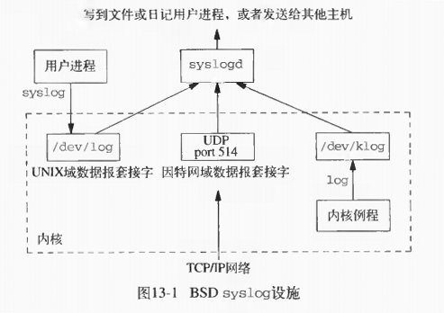

```c
#include <syslog.h>
void openlog(const char *ident, int option, int facility);
void syslog(int priority, const char *format, ...);
void closelog(void);
int setlogmask(int maskpri);
//Returns: previous log priority mask value
```

其中`openlog/closelog`都是可选的，如果不调用`openlog`，则在第一次调用`syslog`时，自动调用它，`closelog`只关闭曾被用于与`syslogd`守护进程通信的描述符

`ident`它将加至每则日志消息中，一般为程序名，`option`参数是指定许多选项的位屏蔽

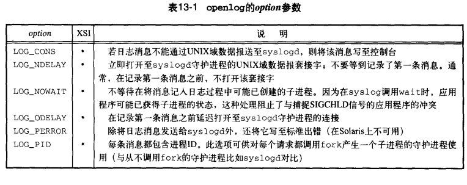

`facility`让配置文件说明，来自不同设施的消息将以不同的方式进行处理，如果不调用`openlog`，或`facility`为0时，那么在调用`syslog`时，将作为`priority`参数使用

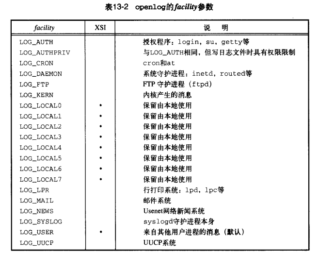

`syslog`产生一个日志消息，其`priority`是`facility`和`level`的组合


`format`以及参数传到`vsprintf`函数以便进行格式化，每个`%m`被代换成`strerror`

`setlogmask`用于设置进程的记录优先级屏蔽字，它返回之前的屏蔽字，除非消息的优先级已在记录优先级屏蔽字中设置，否则消息不被记录，通过宏`LOG_MASK/LOG_UPTO`来设置屏蔽字

除了`syslog`，许多平台提供一种变体处理可变参数列表

```c
#include <syslog.h>
#include <stdarg.h>
void vsyslog(int priority,const char *format ,va_list arg);
```

## 单实例守护进程
如果守护进程需要访问一设备，而该设备驱动程序将阻止多次打开在`/dev`目录下的相应设备节点，那么这就达到了任何时候只运行守护进程一个副本的要求

文件锁和记录锁机制是一种方法的基础，如果每一个守护进程创建一个文件，并且在整个文件上加一把锁，那就只允许创建一把这样的写锁，所以在此之后试图再创建一把这样的写锁将失败，以此向后续守护进程副本指明已有一个副本正在运行

## 守护进程的惯例
- 如果守护进程使用锁文件，那么该文件通常存放在`/var/run`目录中，锁文件的名字通常是`<name>.pid`
- 如果支持配置选项，那么配置文件通常存放在`/etc`目录中，配置文件的名字通常是`<name>.conf`
- 守护进程可以用命令行启动，但通常由系统初始化脚本（`/etc/rc*`或`/etc/init.d/*`）启动的，如果守护进程终止时，应当 __自动地重新启动__ 它，可在`/etc/inittab`中为该守护进程包括`respawn`记录项，这样，`init`将重启动该守护进程
- 配置文件只在守护进程启动时才读它，如果更改了配置文件，需要重启守护进程

网络IPC 套接字
=============
网络编程三大注意事项

- 本地字节序（一般是小端）与网络序（大端）之间转换，通过`htons/htonl`和`ntohl/ntohs`来转换（ascii字符是单字节的，不存在大小端问题；或者类似http均以字符串表示数据，就不存在转换）
- 数据类型，使用`uint32_t/uint16_t`等，而不是直接使用`int`
- 结构体填充问题，使用紧凑模式，防止内存对齐，需要编译器支持(缺点是移植性差)，gcc中（`info gcc`），使用`__attribute__ ((__packed__))`

> 常用手册`man 7 ip/socket/unix/tcp/udp`

## 套接字描述符

```c
#include <sys/socket.h>
int socket(int domain,int type,int protocol);
//Returns: file (socket) descriptor if OK,−1 on error
```

`domain`以`AF_`开头，代表地址族，常见的有

- `AF_INET` ipv4因特网域
- `AF_INET6` ipv6因特网域
- `AF_UNIX/AF_LOCAL` UNIX域
- `AF_IPX` NetWare协议族
- `AF_UNSPEC` 未指定

`type`指套接字类型

- `SOCK_STREAM` 流式套接字，典型的是TCP，有序的、可靠的（可靠的意思是，接收到的肯定是正确的，之前的也是正确的，但并非表示一定送达）、面向连接的字节流（流的概念即不存在固定大小，可能发送端发送N次，而接受端对应的是M次）
- `SOCK_DGRAM` 报式套接字，典型的是UDP，固定长度、无连接、不可靠的报文传递
- `SOCK_SEQPACKET` 流控制传输协议（SCTP)介于流式与报式之间的，固定长度、有序、可靠、面向连接的报文传递
- `SOCK_RAW` IP协议的数据报接口，提供一个数据报接口用于直接访问下面的网络层，使用这个接口时，应用程序负责构造自己的协议首部，因为TCP/UPD等被绕过了(创建它时,需要超级用户权限,防止恶意程序绕过安全机制创建报文)
- `SOCK_PACKET` 最原始的链路层套接字，比如wireshark等工具所使用的

`protocol` __通常是0__，表示选择默认协议，如`SOCK_STREAM`是TCP，`SOCK_DGRAM`是UDP，常见协议

- `IPPROTO_IP` IPv4 Internet Protocol
- `IPPROTO_IPV6` IPv6 Internet Protocol (optional in POSIX.1)
- `IPPROTO_ICMP` Internet Control Message Protocol
- `IPPROTO_RAW` Raw IP packets protocol (optional in POSIX.1)
- `IPPROTO_TCP` Transmission Control Protocol
- `IPPROTO_UDP` User Datagram Protocol

使用文件描述符函数处理套接字时行为

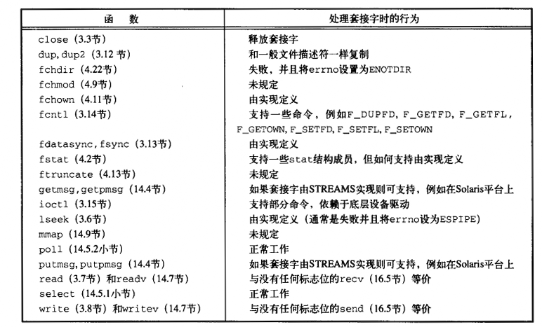

```c
#include <sys/socket.h>
int shutdown(int sockfd,int how);
//Returns: 0 if OK,−1 on error
```

禁止套接字上的输入/输出，`how`可标识只关闭读写某一端:

- `SHUT_RD`关闭读端
- `SHUT_WR`关闭写端
- `SHUT_RDWR`关闭读写端

`close`只在最后一个活动引用被关闭时才释放网络端点，如`dup`了，套接字直到关闭了最后一个引用它的文件描述符才会被释放，而`shutdown`允许一个套接字处于不活动状态，无论引用它的文件描述符的数目是多少

## 寻址
### 字节序
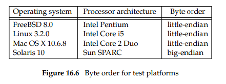

网络协议指定了字节序，因此异构计算机能够交换协议信息而不会混淆字节序，TCP/IP协议栈采用 __大端字节序__，地址用网络字节序表示，所以应用程序需要在处理器的字节序与网络字节序之间的转换

```c
#include <arpa/inet.h>
uint32_t htonl(uint32_t hostint32 );
//Returns: 32-bit integer in network byte order
uint16_t htons(uint16_t hostint16 );
//Returns: 16-bit integer in network byte order
uint32_t ntohl(uint32_t netint32);
//Returns: 32-bit integer in host byte order
uint16_t ntohs(uint16_t netint16);
//Returns: 16-bit integer in host byte order
```

### 地址格式
地址标识了特定通信域中的套接字端点，为了使不同格式的地址能够被传入到套接字函数，地址被强制转换成通用地址结构`struct sockaddr`。

它是一个抽象类型，在使用不同地址族时，类型不一样，如在`AF_INET`使用`struct sockaddr_in`类型，而在`AF_UNIX`则使用`struct sockaddr_un`类型，但它们都有第一个字段类型为`sa_family_t`的，并在`bind()`中`socklen_t len`来确定类型长度，用于标识具体的协议地址类型

```c
struct sockaddr {
    sa_family_t   sa_family;    /* address family */
    char          sa_data[14]; /* variable-length address */
    ...
};

struct sockaddr_in {
    sa_family_t    sin_family; /* address family: AF_INET */
    in_port_t      sin_port;   /* port in network byte order */
    struct in_addr sin_addr;   /* internet address */
};

struct sockaddr_un {
    sa_family_t  sun_family;               /* AF_UNIX */
    char         sun_path[UNIX_PATH_MAX];  /* pathname */
};
```

需要打印人能理解的地址格式，下面用于二进制地址格式与点分十进制字符串之间的相互转换（仅用于IPv4）

```c
in_addr_t inet_addr(const char *cp);
char *inet_ntoa(struct in_addr in);
```

但功能相似的下面函数，支持IPv4与IPv6

```c
#include <arpa/inet.h>
const char *inet_ntop(int domain,const void *restrict addr ,
                      char *restrict str,socklen_t size );
//Returns: pointer to address string on success, NULL on error
int inet_pton(int domain,const char *restrict str,
              void *restrict addr );
//Returns: 1 on success, 0 if the format is invalid, or −1 on error
```

`inet_ntop`将网络字节序的二进制转换成文本字符串格式，`inet_pton`将字符串格式转换成字节序的二进制地址，`domain`可选`AF_INET/AF_INET6`，`size`有两个常数，`INET_ADDRSTRLEN/INET6_ADDRSTRLEN`定义了足够大空间存放文本字符串

### 地址查询
这些函数返回的网络配置信息可以存在许多地方，如`/etc/hosts`或`/etc/services`等，或通过DNS或NIS，无论这些信息放在何处，这些函数同样能够访问它们

```c
#include <netdb.h>
struct hostent *gethostent(void);
//Returns: pointer if OK,NULL on error
void sethostent(int stayopen );
void endhostent(void);
```


### 将套接字与地址关联
```c
#include <sys/socket.h>
int bind(int sockfd,const struct sockaddr *addr, socklen_t len);
//Returns: 0 if OK,−1 on error
```


```c
int sd;
int ret;
struct sockaddr_in myend;

sd = socket(AF_INET, SOCK_STREAM, 0);
myend.sin_family = AF_INET;
myend.sin_port = SERVER_PORT;
inet_pton(AF_INET, SERVER_IP, &myend.sin_addr);
ret = bind(sd, (struct sockaddr *)&myend, sizeof(myend));
```


## 建立连接
```c
#include <sys/socket.h>
int listen(int sockfd,int backlog);
//Returns: 0 if OK,−1 on error
```

`backlog`一般使用5~100之间，通常使用20，它为系统该进程所要入队的未完成连接请求数量（即对方已`connect`返回了，而本方还未`accept`返回的），该值只是建议值，具体是系统决定

```c
#include <sys/socket.h>
int accept(int sockfd,struct sockaddr *restrict addr, socklen_t *restrict len);
//Returns: file (socket) descriptor if OK,−1 on error
```

其中`len`必须初始化，它即是输入又是输出

如果没有连接请求在等待，则它会 __阻塞__ 直到一个请求到来


## 数据传输
除了`read/write`还有更细控制的数据传输

```c
#include <sys/socket.h>
ssize_t send(int sockfd,const void *buf,size_t nbytes,int flags);
//Returns: number of bytes sent if OK,−1 on error
ssize_t sendto(int sockfd,const void *buf,size_t nbytes,int flags,
               const struct sockaddr *destaddr,socklen_t destlen);
//Returns: number of bytes sent if OK,−1 on error
```


```c
#include <sys/socket.h>
ssize_t recv(int sockfd,void *buf,size_t nbytes,int flags);
//Returns: length of message in bytes, 0 if no messages areavailable and peer has done an orderly shutdown,or −1 on error

ssize_t recvfrom(int sockfd,void *restrict buf,size_t len,int flags,
                 struct sockaddr *restrict addr,socklen_t *restrict addrlen);
//Returns: length of message in bytes,0 if no messages areavailable and peer has done an orderly shutdown,or −1 on error
```

`flags`，常见如下：

- `MSG_OOB`支持带外数据（不常用）
- `MSG_PEEK`返回数据包内容而不真正取走数据包，偷看数据用于确定数据报大小，用于报式传输（不常用）
- `MSG_WAITALL`等待所有数据都可用才返回，用于流式传输（可用）
- `MSG_DONTWAIT`启动非阻塞（可用）


## 进程池实现
- 维护一个进程做任务的次数，超过阀值则退出，利于减少内在泄漏
- 双方通过通信来决定是否回收或新增进程，而不是父进程轮询子进程状态，父子间通信最好使用本地套接字（不得已时考虑管道，但此处需要父子双方维护具名FIFO，子进程意外退出时，反而不利清理，而考虑使用消息队列，只使用一个队列，并且利用了它的消息分拣）

```c
#include <sys/types.h>
#include <sys/socket.h>
#include <sys/ipc.h>
#include <sys/msg.h>
#include <netinet/in.h>
#include <netinet/ip.h>
#include <arpa/inet.h>
#include <time.h>
#include <signal.h>
#include <unistd.h>

#include <stdio.h>
#include <stdlib.h>
#include <errno.h>

#include "comm.h"
#include "debug.h"

#define BUFSIZE  64

#ifdef DEBUG
#define PROC_NR_MAX        6
#define PROC_FREE_NR_MIN   2
#define PROC_FREE_NR_MAX   5
#define PROC_NR_PER_FORK   3
#define TIMES_MAX          2
#else
#define PROC_NR_MAX        100
#define PROC_FREE_NR_MIN   10
#define PROC_FREE_NR_MAX   60
#define PROC_NR_PER_FORK   20
#define TIMES_MAX          100
#endif

enum child_status {ST_QUIT, ST_FREE, ST_BUSY};

struct msgbuf_st {
    long dest;
    long src;
    enum child_status status;
};

static int min(int a, int b)
{
    return a < b ? a : b;
}

static void jobs(int sd, int msgid)
{
    int newsd;
    struct sockaddr_in hisend;
    socklen_t hislen;
    char buf[BUFSIZE];
    time_t cur;
    struct tm *cur_tm;
    int ret;
    struct msgbuf_st msgbuf;
    int times = 0;

    while (1) {
        hislen = sizeof(hisend); /* must init */
        newsd = accept(sd, (struct sockaddr *)&hisend, &hislen);
        /* if error */
        times++;
        debug("%d busy, times = %d\n", getpid(), times);

        msgbuf.dest = 1;
        msgbuf.src = getpid();
        msgbuf.status = ST_BUSY;
        msgsnd(msgid, &msgbuf, sizeof(long) + sizeof(enum child_status), 0);
        /* if error */

        while (1) {
            ret = read(newsd, buf, BUFSIZE);
            if (ret == -1) {
                if (errno == EINTR) {
                    continue;
                }
                perror("read(newsd)");
                break;
            }
            if (ret == 0) {
                break;
            }

            write(1, buf, ret);

            cur = time(NULL);
            cur_tm = localtime(&cur);
            ret = strftime(buf, BUFSIZE, "%F %T\n", cur_tm);
            write(newsd, buf, ret);
        }

        close(newsd);

        if (times >= TIMES_MAX) {
            debug("%d quit, times = %d\n", getpid(), times);
            msgbuf.dest = 1;
            msgbuf.src = getpid();
            msgbuf.status = ST_QUIT;
            msgsnd(msgid, &msgbuf, sizeof(long) + sizeof(enum child_status), 0);
            /* if error */
            break;
        }

        debug("%d free, times = %d\n", getpid(), times);
        msgbuf.dest = 1;
        msgbuf.src = getpid();
        msgbuf.status = ST_FREE;
        msgsnd(msgid, &msgbuf, sizeof(long) + sizeof(enum child_status), 0);
        /* if error */
        debug("%d recv free, times = %d\n", getpid(), times);

        msgrcv(msgid, &msgbuf, sizeof(long) + sizeof(enum child_status), getpid(), 0);
        if (msgbuf.status == ST_QUIT) {
            debug("%d recv quit, times = %d\n", getpid(), times);
            break;
        }
    }
}

static int proc_remain(int sd, int msgid, int *proc_nr, int *proc_free_nr)
{
    int num;
    int i;
    pid_t pid;

    debug("call proc_remain, proc_nr = %d, proc_free_nr = %d\n", *proc_nr, *proc_free_nr);

    if (*proc_free_nr >= PROC_FREE_NR_MIN) {
        debug("proc_remain return, proc_nr = %d, proc_free_nr = %d\n", *proc_nr, *proc_free_nr);
        return 0;
    }

    num = min(PROC_NR_PER_FORK, PROC_NR_MAX - *proc_nr);
    for (i = 0; i < num; i++) {
        pid = fork();
        if (pid == -1) {
            break;
        }
        if (pid == 0) {
            jobs(sd, msgid);
            exit(0);
        }
    }

    *proc_nr += i;
    *proc_free_nr += i;
    debug("proc_remain return, proc_nr = %d, proc_free_nr = %d\n", *proc_nr, *proc_free_nr);
    return i;
}

int main(void)
{
    int sd;
    int msgid;
    int ret;
    struct sockaddr_in myend;
    struct sigaction act;
    int proc_nr, proc_free_nr;
    struct msgbuf_st msgbuf;

    act.sa_handler = SIG_IGN;
    sigemptyset(&act.sa_mask);
    act.sa_flags = SA_NOCLDWAIT;
    sigaction(SIGCHLD, &act, NULL);

    msgid = msgget(IPC_PRIVATE, 0600);
    /* if error */

    sd = socket(AF_INET, SOCK_STREAM, 0);
    /* if error */

    myend.sin_family = AF_INET;
    myend.sin_port = SERVER_PORT;
    inet_pton(AF_INET, SERVER_IP, &myend.sin_addr);
    ret = bind(sd, (struct sockaddr *)&myend, sizeof(myend));
    if (ret == -1) {
        perror("bind()");
        close(sd);
        return 1;
    }

    listen(sd, 20);

    //jobs(sd, msgid);
    proc_nr = 0, proc_free_nr = 0;
    proc_remain(sd, msgid, &proc_nr, &proc_free_nr);

    while (1) {
        debug("main: proc_nr = %d, proc_free_nr = %d\n", proc_nr, proc_free_nr);
        msgrcv(msgid, &msgbuf, sizeof(long) + sizeof(enum child_status), 1, 0);
        /* if error */
        switch (msgbuf.status) {
        case ST_QUIT:
            debug("main: %d quit\n", msgbuf.src);
            proc_nr--;
            proc_remain(sd, msgid, &proc_nr, &proc_free_nr);
            break;
        case ST_FREE:
            debug("main: %d free\n", msgbuf.src);
            msgbuf.dest = msgbuf.src;
            msgbuf.src = 1;
            if (proc_free_nr >= PROC_FREE_NR_MAX) {
                msgbuf.status = ST_QUIT;
                debug("main: send quit to %d\n", msgbuf.dest);
                proc_nr--;
            } else {
                msgbuf.status = ST_FREE;
                debug("main: send free to %d\n", msgbuf.dest);
                proc_free_nr++;
            }
            msgsnd(msgid, &msgbuf, sizeof(long) + sizeof(enum child_status), 0);
            break;
        case ST_BUSY:
            debug("main: %d busy\n", msgbuf.src);
            proc_free_nr--;
            proc_remain(sd, msgid, &proc_nr, &proc_free_nr);
            break;
        }
    }

    /* destroy msgid */

    close(sd);

    return 0;
}
```

> 改成线程池时，就不需要任务计数了，反正线程退出也资源回收意义不大

## 函数
```c

```


<!--


socket称为半层
upd比ip没多多少东西
停等模式写UDP

listen设置侦听模式，帮助三次握手？
connect会阻塞吗？会
stream时，read write会阻塞吗？  write不会阻塞（底层会不会发不知道，但方法会直接返回），write时len参数大于字节长度时，除非write多次写够，否则read方阻塞； 如果write的len等于发送字节长度时，read可选择一次读完，还是多次读完
如果手工write不大于1500字节，窗口滑动还有意义吗？write不会阻塞 所有有意义
汉字为什么不要转换网络序？

不同网段间通信使用IP地址，同网址内通信使用MAC地址，当需要向不同网段主机发消息时，通过ARP将到到IP地址对应的MAC，此时应该是路由器，它接收包后，再ARP时，得到另一个MAC（可能是另一个路由），这样经过N次ARP，而每次IP地址相同，但MAC不相同的转换，最终到达真实的IP地址（即ARP查询并转发后，原始的MAC是看不到的）

CFLAGS=-wall

ssh -qTfnN -D 7070@...  [socket v5]

gcc -I../include/ ../lib/error.c ../lib/prexit.c times1.c -lpthread
gcc -ansi -I../include -Wall -DLINUX -D_GNU_SOURCE  pipe2.c -o pipe2  -L../lib -lapue

../lib/error.c

休闲食品
联合办宴
时时秒杀
意见奖励


/usr/local/bin/ld: unrecognized option '--hash-style=gnu'
/usr/local/bin/ld: use the --help option for usage information


sig_promask设置了block sigint
当在sigint响应函数中重新了unblock 会立即响应吗?


Mutex是一把钥匙，一个人拿了就可进入一个房间，出来的时候把钥匙交给队列的第一个。一般的用法是用于串行化对critical section代码的访问，保证这段代码不会被并行的运行。

Semaphore是一件可以容纳N人的房间，如果人不满就可以进去，如果人满了，就要等待有人出来。对于N=1的情况，称为binary semaphore。一般的用法是，用于限制对于某一资源的同时访问。

在有的系统中Binary semaphore与Mutex是没有差异的。在有的系统上，主要的差异是mutex一定要由获得锁的进程来释放。而semaphore可以由其它进程释放（这时的semaphore实际就是个原子的变量，大家可以加或减），因此semaphore可以用于进程间同步。Semaphore的同步功能是所有 系统都支持的，而Mutex能否由其他进程释放则未定，因此建议mutex只用于保护critical section。而semaphore则用于保护某变量，或者同步。

mutex就是一个binary semaphore （值就是0或者1）。但是他们的区别又在哪里呢？主要有两个方面：

* 初始状态不一样：mutex的初始值是1（表示锁available），而semaphore的初始值是0（表示unsignaled的状态）。随后的操 作基本一样。mutex_lock和sem_post都把值从0变成1，mutex_unlock和sem_wait都把值从1变成0（如果值是零就等 待）。初始值决定了：虽然mutex_lock和sem_wait都是执行V操作，但是sem_wait将立刻将当前线程block住，直到有其他线程 post；mutex_lock在初始状态下是可以进入的。
* 用法不一样（对称 vs. 非对称）：这里说的是“用法”。Semaphore实现了signal，但是mutex也有signal（当一个线程lock后另外一个线程 unlock，lock住的线程将收到这个signal继续运行）。在mutex的使用中，模型是对称的。unlock的线程也要先lock。而 semaphore则是非对称的模型，对于一个semaphore，只有一方post，另外一方只wait。就拿上面的厕所理论来说，mutex是一个钥 匙不断重复的使用，传递在各个线程之间，而semaphore择是一方不断的制造钥匙，而供另外一方使用（另外一方不用归还）。

前面的实验证明，mutex确实能够做到post和wait的功能，只是大家不用而已，因为它是“mutex”不是semaphore。

要 让一个thread在背景不断的执行，最简单的方式就是在该thread执行无穷回圈，如while(1) {}，这种写法虽可行，却会让CPU飙高到100%，因为CPU一直死死的等，其实比较好的方法是，背景平时在Sleep状态，当前景呼叫背景时，背景马 上被唤醒，执行该做的事，做完马上Sleep，等待前景呼叫。当背景sem_wait()时，就是马上处于Sleep状态，当前景sem_post() 时，会马上换起背景执行，如此就可避免CPU 100%的情形了。


树莓派


1. crontab实现
2. timer线程通知实现
3. timeout
3. malloc bug重现
4. write pipe多大
5. 斯坦福多线程实现


策略与机制

自底向上设计 确保每个功能是完备的
上层负责协调各个功能 去完成更大的功能

文件接口 更是语义,却没有语法支持

不过多考虑调用者的方便，如select中的maxfdp1
也存在垃圾筒函数，一个函数完成多个职责，如fcntl


多任务
多进程 多线程

IO
IO多路转接 信号驱动IO 多线程 非阻塞IO

进程间通信
管道 FIFO 套接字 共享内存（消息队列不考虑）

进程间加锁
文件记录锁 semaphore

posix sem是否存在
屏障

 -->


