> 2015-05-09

ARM版本
=======

```
内核版本   Soc版本号           芯片型号
  V4      arm7                S3C44B0
  V4T     arm920T             S3C2410/2440/2416
  V5      arm10
  V6      arm1176             S3C6410
          arm1136
          arm1156
  V6K     arm11MP

  V7      arm-cortex-a
              a8              S5PV210              平板2核
                              S5PC100              手机2核
              a9              Exynos4418           平板4核
                              Exynos4412           手机4核
                              Imax6Q               4核
                              OMAP4460             2核
              a7              Exynos5410(a7+a15)   低性能低功耗
                              全志A10/A20/A31
              a15             Exynos5410(a7+a15)   高性能高功耗
                              Exynos5250/5450
              a53/57          高能骁龙815/410       64位
                              iphone5S             64位
          arm-cortex-m
              m3              STM32f10x
              m0/m0+                               低功耗
              m4              STM32F40x            增加了浮点运算dsp
              m7              STM32F7xx            物联网 低功耗
          arm-cortex-r
              r4/r6
```

启动和Emmc启动
===============
## 查看sd卡
```shell
fdisk -l
```

将会出现下面的描述，表示位于/dev/sdb

```
Disk /dev/sdb: 7948 MB, 7948206080 bytes
```

## 对sd卡进行分区
exynos4412的bootloader必须在该sd卡起始偏移512字节

```
 /dev/sdb #整个sd卡是个线性空间
 [512bytes-bootloader---|-----分区-rom----------|-]
                        /dev/sdb1 #此部分才是可以挂载的
```

```shell
fdisk /dev/sdb
```

```
Command (m for help): d
Selected partition 1

Command (m for help): d
No partition is defined yet!

Command (m for help): p

Disk /dev/sdb: 7948 MB, 7948206080 bytes
81 heads, 10 sectors/track, 19165 cylinders
Units = cylinders of 810 * 512 = 414720 bytes
Sector size (logical/physical): 512 bytes / 512 bytes
I/O size (minimum/optimal): 512 bytes / 512 bytes
Disk identifier: 0x00000000

   Device Boot      Start         End      Blocks   Id  System

Command (m for help): n
Command action
   e   extended
   p   primary partition (1-4)
p
Partition number (1-4): 1
First cylinder (1-19165, default 1): 3
Last cylinder, +cylinders or +size{K,M,G} (3-19165, default 19165):
Using default value 19165

Command (m for help): p

Disk /dev/sdb: 7948 MB, 7948206080 bytes
81 heads, 10 sectors/track, 19165 cylinders
Units = cylinders of 810 * 512 = 414720 bytes
Sector size (logical/physical): 512 bytes / 512 bytes
I/O size (minimum/optimal): 512 bytes / 512 bytes
Disk identifier: 0x00000000

   Device Boot      Start         End      Blocks   Id  System
/dev/sdb1               3       19165     7761015   83  Linux

Command (m for help): t
Selected partition 1
Hex code (type L to list codes): b
Changed system type of partition 1 to b (W95 FAT32)

Command (m for help): w
The partition table has been altered!

Calling ioctl() to re-read partition table.

WARNING: Re-reading the partition table failed with error 16: 设备或资源忙.
The kernel still uses the old table. The new table will be used at
the next reboot or after you run partprobe(8) or kpartx(8)

WARNING: If you have created or modified any DOS 6.x
partitions, please see the fdisk manual page for additional
information.
Syncing disks.
```

- `d`是删除分区，`p`是打印信息，`n`是创建分区；
- First cylinder是表示分区起始柱面（一柱面大约8M），此处填3，前面部分用于存放bootloader（此处有可能是起始扇区，一扇区大约512字节，计算时需要注意）
- 此时默认文件格式是linux的，通过`t`，再输入`b`，得到fat32格式
- 输入`w`退出

接下来格式化该sd卡的sdb1分区

```shell
mkfs.vfat -F 32 /dev/sdb1
```

## 烧写sd卡
拷贝光盘B中images文件夹到sdb1

```
cp -rf images /media/F4C9-ED1D/
```

解压`tools.tar.bz2`，得到可执行文件`write4412boot`，执行它，本质是将boot烧写到指定位置

```
./write4412boot /media/F4C9-ED1D/images/Superboot4412.bin /dev/sdb
```

## 配置FriendlyARM.ini
配置FriendlyARM.ini，用于指定刷何种操作系统。然后将sd卡放入开发板，切换为非Emmc启动，重新启动，刷机完成后，切换回Emmc即可


Uboot烧制与调试
================
> Uboot中使用16进，即使不加0x，也是16进制

## 交叉编译器
得到`arm-linux-gcc.tar.tgz`文件，进行解压

配置环境变量，将其下的`bin`的绝对地址加入到`PATH`中

```shell
vim ~/.bashrc
    PATH=/path/to/arm-linux-gcc/4.5.1/bin:$PATH

source ~/.bashrc #或 . ~/.bashrc 以确保当前终端就可用
```

取得当前版本

```shell
arm-linux-gcc -v
```

> 缺库`ld-linux.so.2`时，进行`yum install ld-linux.so.2`

> 如果ubuntu系统出现`/bin/bash` 命令找不到错误，`sudo apt-get install ia32-libs`

## 配置minicom
板子开发需要用到串口调试，原理是开发板与PC通过串口连接，双方通过`/dev/ttyS0`(PC上真实串口)或`/dev/ttyUSB0`(PC机上使用USB转串口时)文件进行读写。使用`minicom`能方便这一过程

```shell
minicom -s
```

- 选择`Serial port setup`
- 在弹出窗口中，选择`A`，输入`/dev/ttyS0`或`/dev/ttyUSB0`
- 选择`E`，确保为`115200 8N1`
- 选择`F/G`，关闭硬件/软件控制
- 回车，退出弹窗，然后选择`Save setup as dfl`
- 最后，选择`Exit from Minicom`

## Uboot流程
得到`uboot201210.tar.tgz`文件，进行解压

- `./arch`是所支持的架构，如x86,arm等
- `./arch/arm/cpu/armv7/exynos/`本开发板的cpu
- `./board/samsung/tiny4412/`本开发板的board BSP

uboot的第一阶段执行流程：

1. `./arch/arm/cpu/Start.S` #它与具体cpu型号无关
2. `./board/samsung/tiny4412/lowlevel_init.S` #开发中对板子的修改，需要编写它
3. `./board/samsung/tiny4412/clock_init_tiny4412.S`
4. `./board/samsung/tiny4412/mem_init_tiny4412.S`
5. `./board/samsung/tiny4412/tiny4412.c`

第二阶段则执行`./arch/arm/cpu/armv7/exynos/`下的相关代码，如`clock.c,nand.c`等

## Make相关
在解压的当前目录

```shell
vim Makefile
    160 CROSS_COMPILE ?=arm-linux-
```

会在`config.mk`中被使用到

```shell
vim config.mk
    104 AS      = $(CROSS_COMPILE)as
    105 LD      = $(CROSS_COMPILE)ld
    106 CC      = $(CROSS_COMPILE)gcc
    107 CPP     = $(CC) -E
    108 AR      = $(CROSS_COMPILE)ar
    109 NM      = $(CROSS_COMPILE)nm
    110 LDR     = $(CROSS_COMPILE)ldr
    111 STRIP   = $(CROSS_COMPILE)strip
    112 OBJCOPY = $(CROSS_COMPILE)objcopy
    113 OBJDUMP = $(CROSS_COMPILE)objdump
    114 RANLIB  = $(CROSS_COMPILE)RANLIB
```

执行make配置，`vim boards.cfg`查看开发板型号、cpu、board之间的一些对应表

```shell
make tiny4412_config
```

关闭MMU功能，并修改提示符

```shell
vim include/configs/tiny4412.h
    311 //#define CONFIG_ENABLE_MMU
    312 #undef CONFIG_ENABLE_MMU
    255 #define CONFIG_SYS_PROMPT  "[zyx@Uboot]# "
```

修改链接地址，本开发板中DDR地址位于`0x40000000`-`0x80000000`，默认情况下是开启MMU的，所以链接地址是`0xc3e00000`

```shell
vim board/samsung/tiny4412/config.mk
    CONFIG_SYS_TEXT_BASE = 0x43e00000
```

接下来make文件，使用4个任务同时进行

```shell
make -j4
```

> 缺库`libz.so.1`时，`yum install zlib.i686`

## 烧制Uboot
上述make完成后，会产生`u-boot`一个可执行文件

```shell
file u-boot
```

```
u-boot: ELF 32-bit LSB shared object, ARM, version 1 (SYSV), statically linked, not stripped
```

可以看到是ARM架构的ELF文件，它的组成示意如下

```
u-boot=[ELF head][u-boot.bin]
```

`[ELF head]`用于记录它的依赖包等情况，后面`[u-boot.bin]`，而烧制uboot时，还没有操作系统，无法认识`[ELF head]`，只能使用`[u-boot.bin]`部分，其实刚才make后，就生成了一个无`[ELF head]`的一个文件`u-boot.bin`

> 可以使用`hexdump -C`去看一下，两者确实只差一个`[ELF head]`

开发板不能直接使用刚才的`u-boot.bin`，必须在它之前加上三星的安全与签名等模块，切换到`./sd_fuse/tiny4412`，执行`sd_fusing.sh`将自动加上（该脚本需要分析一下，大量使用了`dd`）

```shell
cd ./sd_fuse/tiny4412
./sd_fusing.sh /dev/sdb
sync
```

> 如果提示`Block device size ??? is too large`，去修改`sd_fusing.sh`第二段，将`if [ ${BDEV_SIZE} -gt 32000000 ]; then`数字部分调大点

## 调试Uboot
1. 把sd卡插入开发板
2. 开发板切换为sd卡启动
3. 用串口把开发板和pc链接
4. 检查`minicom`的配置
5. 给开发板上电，在`minicom`中观察启动信息

```shell
minicom
```

- `ctrl+a`进入菜单项，`w`切换是否自动换行，`q`退出

常用命令如下

```
?       - alias for 'help'
base    - print or set address offset
bdinfo  - print Board Info structure
boot    - boot default, i.e., run 'bootcmd'
bootd   - boot default, i.e., run 'bootcmd'
bootelf - Boot from an ELF image in memory
bootm   - boot application image from memory
bootp   - boot image via network using BOOTP/TFTP protocol
bootvx  - Boot vxWorks from an ELF image
chpart  - change active partition
cmp     - memory compare
coninfo - print console devices and information
cp      - memory copy
crc32   - checksum calculation
dcache  - enable or disable data cache
dnw     - dnw     - initialize USB device and ready to receive for Windows serv)

echo    - echo args to console
editenv - edit environment variable
emmc    - Open/Close eMMC boot Partition
env     - environment handling commands
exit    - exit script
ext2format- ext2format - disk format by ext2

ext2load- load binary file from a Ext2 filesystem
ext2ls  - list files in a directory (default /)
ext3format- ext3format - disk format by ext3

false   - do nothing, unsuccessfully
fastboot- fastboot- use USB Fastboot protocol

fatformat- fatformat - disk format by FAT32

fatinfo - fatinfo - print information about filesystem
fatload - fatload - load binary file from a dos filesystem

fatls   - list files in a directory (default /)
fdisk   - fdisk for sd/mmc.

go      - start application at address 'addr'
help    - print command description/usage
icache  - enable or disable instruction cache
iminfo  - print header information for application image
imxtract- extract a part of a multi-image
itest   - return true/false on integer compare
loadb   - load binary file over serial line (kermit mode)
loads   - load S-Record file over serial line
loady   - load binary file over serial line (ymodem mode)
loop    - infinite loop on address range
md      - memory display
mm      - memory modify (auto-incrementing address)
mmc     - MMC sub system
mmcinfo - mmcinfo <dev num>-- display MMC info
movi    - movi  - sd/mmc r/w sub system for SMDK board
mtdparts- define flash/nand partitions
mtest   - simple RAM read/write test
mw      - memory write (fill)
nfs     - boot image via network using NFS protocol
nm      - memory modify (constant address)
ping    - send ICMP ECHO_REQUEST to network host
printenv- print environment variables
reginfo - print register information
reset   - Perform RESET of the CPU
run     - run commands in an environment variable
saveenv - save environment variables to persistent storage
setenv  - set environment variables
showvar - print local hushshell variables
sleep   - delay execution for some time
source  - run script from memory
test    - minimal test like /bin/sh
tftpboot- boot image via network using TFTP protocol
true    - do nothing, successfully
usb     - USB sub-system
version - print monitor version
```

- `md`查看内存，`.b`以8位查看(char,2个16进制)，`.w`以16位查看(short,4个16进制)，`.l`以32位查看(int,8个16进制)
- `fdisk`针对sd卡与Emmc查看创建分，`-p`查看，`-c`创建，<device_num>通过启动画面可看到sd与Emmc对应的设备号，如`MMC Device 0: 30608 MB`
- >创建分区是为Android定制的，它有四个分区，`system:data:cache:storage`，前三个是linux文件格式是ext2的(0x83)，而`storage`是fat32的(0x0c)，`kernel/bootloader/ramdisk`存在于 __未划__ 的分区中(分区是会按柱面对齐)
- 格式化不同文件格式的分区，需要不同的`format`，如`fatformat mmc 1:1`或`ext3format mmc 1:4`
- 不同的linux提供的VFS，在这里，针对不同的文件格式分区，需要不同的`ls`，如`fatls mmc 0 /images`或`ext2ls mmc 1:2 /`
- `fatload/ext2load`将rom中的文件load指定的内存地址，方便被`bootm`引导执行
> `fatload mmc 0 0x50000000 /images/linux/zimage`，`bootm 0x50000000`

- `bdinfo`显示板子参数

```
arch_number = 0x00001200    开发板id，bootloader中内核id必须与此一致
boot_params = 0x40000100    开发板启动参数的地址，bootloader传给内核的，(/proc/cmdline 是x86的启动参数)
DRAM bank   = 0x00000000    内存开始地址与大小
-> start    = 0x40000000
-> size     = 0x10000000
DRAM bank   = 0x00000001
-> start    = 0x50000000
-> size     = 0x10000000
DRAM bank   = 0x00000002
-> start    = 0x60000000
-> size     = 0x10000000
DRAM bank   = 0x00000003
-> start    = 0x70000000
-> size     = 0x0FF00000
ethaddr     = 00:40:5c:26:0a:5b
ip_addr     = 192.168.0.20
baudrate    = 0 bps
TLB addr    = 0x3FFF0000
relocaddr   = 0x43E00000    uboot的链接地址，也是uboot的运行地址
reloc off   = 0x00000000
irq_sp      = 0x43CFBF58
sp start    = 0x43CFBF50
FB base     = 0x00000000
```

## 下载文件到开发板
- uart 串口方式
- fatload

```
[zyx@Uboot] # fatload mmc 0:1 0x50000000 /doc/arm.bin
Partition1: Start Address(0x7d82), Size(0x3bbc57b)
reading /doc/arm.bin

688 bytes read
[zyx@Uboot] # go 50000000
## Starting application at 0x50000000 ...
## Application terminated, rc = 0x1
```

- tftp 网络方式
    + pc端安装tftp服务，并存在arm.bin裸机程序
    + 开发板执行`tftp 0x50000000 arm.bin`写入指定地址0x50000000
    + 开发板需要`setenv serverip 192.168.4.254`,`setenv ipaddr 192.168.4.20`,`saveenv`
- dnw  USB方式
    + pc端安装dnw发送端（切换到`tools/dnw-linux`下进行`make`，出现警告要修复，`vim src/driver/secbulk.c`,`to_write = min((int)len, BULKOUT_BUFFER_SIZE);`，再运行`make install`）
    + 如果想卸载:.....[看一下Makefile]
    + pc与开发板通过usb连接
    + 开发板`dnw 0x50000000`，pc执行`dnw arm.bin`，开发板`go 50000000`

```
[zyx@Uboot] # dnw 50000000
Insert a OTG cable into the connector!
OTG cable Connected!
Now, Waiting for DNW to transmit data
Download Done!! Download Address: 0x50000000, Download Filesize:0x2b0
Checksum is being calculated.
Checksum O.K.
```

```
[root@localhost class]# dnw arm.bin
load address: 0x57E00000
Writing data...
100%  0x000002BA bytes (0 K)
speed: 0.004160M/S
```

```
[zyx@Uboot] # go 50000000
## Starting application at 0x50000000 ...
## Application terminated, rc = 0x1
```

## Uboot环境变量
```shell
printenv           #简写pr
echo $bootdelay
```

```
baudrate=115200
bootcmd=movi read kernel 0 40008000;movi read rootfs 0 41000000 100000;bootm 400
bootdelay=3
ethaddr=00:40:5c:26:0a:5b
gatewayip=192.168.0.1
ipaddr=192.168.0.20
netmask=255.255.255.0
serverip=192.168.0.10
```

```shell
setenv bootdelay 10   #临时有效
setenv bootdelay      #删除
saveenv               #保存在sd卡中
```

- `bootargs`内核参数 uboot值将放到`bdinfo`的`boot_params = 0x40000100`地址中，供内核使用，包含 文件系统位置，驱动选择参...
- `bootcmd`自动操作(倒计时结束后执行的操作)，如`set bootcmd "echo $bootdelay;fatls mmc 0:1;fdisk -p 1;" `

## shell脚本
pc上编写脚本test.sh，需要额外加一个头，方便uboot识别

```shell
uboot_tiny4412/tools/mkimage -A arm -O linux -T script -C none -n "uboot_script" -d test.sh test.img
```

下载到开发板

```shell
dnw 50000000
source 50000000
```

编译内核
========
## 给x86下的换内核

```shell
[root@pc]xz -d linux-3.10.5.tar.xz
[root@pc]tar -xvf linux-3.10.5.tar
[root@pc]cd linux-3.10.5
[root@pc]make menuconfig
[root@pc]vim .config
  124 CONFIG_SYSFS_DEPRECATED_V2=y
[root@pc]make dep
[root@pc]make clean
[root@pc]make bzImage
[root@pc]make modules
[root@pc]make modules_install
[root@pc]make install
[root@pc]reboot
```

## 编译内核
```shell
tar -xvf linux3.5.tar.bz2
cd linux-3.5_for_qt4
cp exynos4412_config .config
make -j4
#编译完成的内核在<linux_src>/arch/arm/boot/zImage
```

由于ddr位于`0x40000000`-`0x80000000`，内核必须下载至少`0x40008000`位置

```
zImage
---------------              至少0x40008000
16k translation table
16k bootargs 位于0x40000100
---------------              内存起始0x40000000
```

```shell
[zyx@Uboot]# dnw 40008000
[root@pc]#dnw <linux_src>/arch/arm/boot/zImage
[zyx@Uboot]# bootm 40008000
```

会运行内核，但由于找不到根目录，将会异常

busybox
==========
## 编译busybox
使用busybox来制作文件系统，挂载根目录

> android使用toolbox

```shell
[root@pc]tar -xvf busybox-1.21.1.tar.bz2
[root@pc]cd busybox-1.21.1
[root@pc]make defconfig
[root@pc]make menuconfig
#如果出现ncurse相关错误  yum install ncurse*
```

具体配置如下，需将busybox编译成静态库，并设置好arm编译器前缀，并勾选必要的内核使用的命令

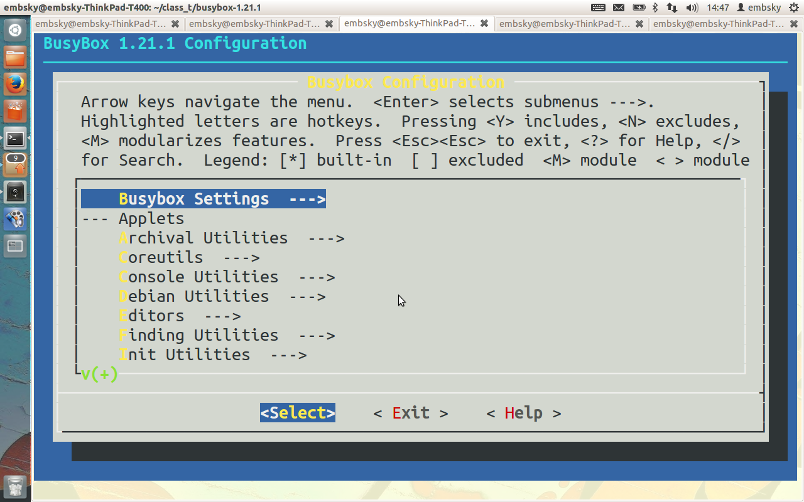

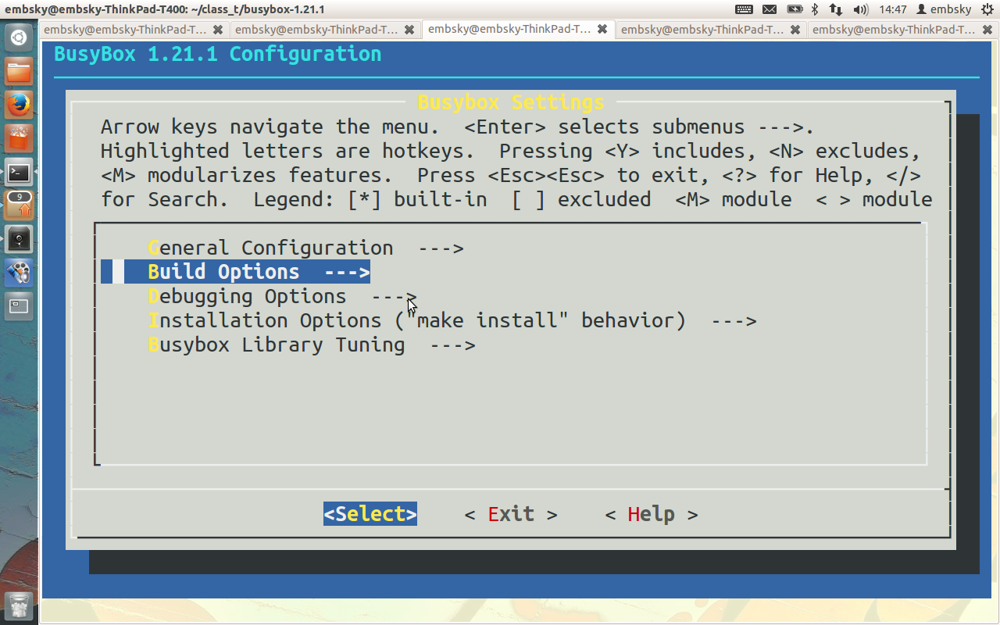

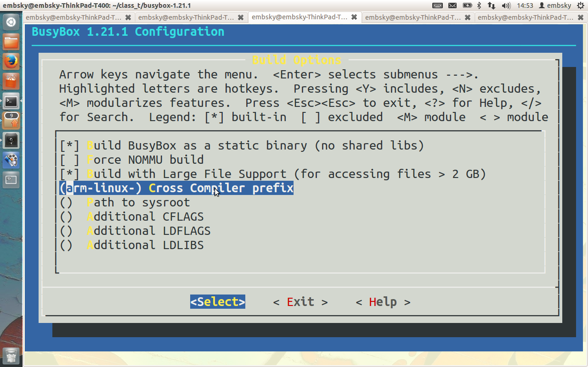

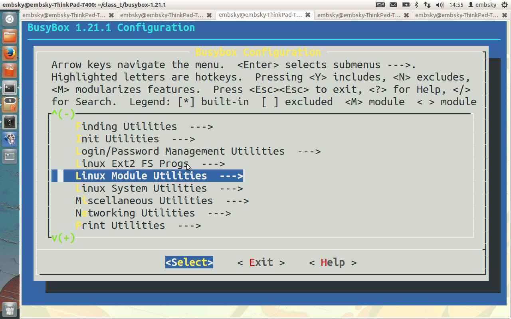

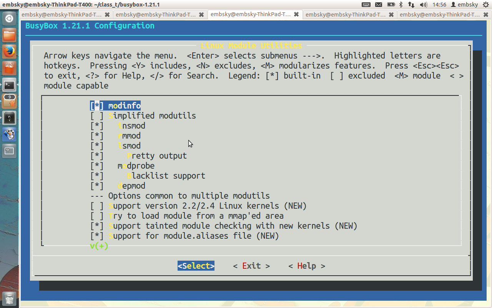

```shell
[root@pc]make -j4
[root@pc]make install
[root@pc]cd _install/
[root@pc]mkdir home root var mnt tmp sys dev proc #创建必要目录
[root@pc]cp ../examples/bootfloppy/etc/ . -rf     #复制etc
[root@pc]cp ~/class_t/4.5.1/arm-none-linux-gnueabi/lib/ . -rf  #复制lib
```

分析`busybox-1.21.1/init/`目录下文件，这是`init`进程的源代码

嵌入式系统由`linuxrc`启动，调用`init.d/rcS`

## 搭建nfs服务
将busybox中的`_install`目录下文件复制到nfs的指定目录

```shell
[root@pc _install]mkdir /tomcat_root
[root@pc _install]chmod 777 /tomcat_root
[root@pc _install]cp * /tomcat_root -rf
[root@pc _install]cd /tomcat_root
[root@pc]vim etc/profile #登录用户时执行
    echo "#######################"
    echo "#######################"
    echo "#######################"
    echo "#######################"
    echo "Welcom To My FileSystem"
    echo "#######################"
    echo "#######################"
    echo "#######################"
    echo "#######################"
    #在/dev/下创建设备节点
    mdev -s
    #export是确保子进程也能使用
    export PATH=/bin:/sbin:/usr/bin:/usr/sbin
    #\W会被替换为当前工作路径
    export PS1="[root@uplooking \W]# "
    export HOME=/root
[root@pc]vim etc/init.d/rcS     #由init进程执行，不修改
[root@pc]vim etc/fstab          #mount -a时使用，在etc/init.d/rcS中
    proc   /proc proc   defaults  0 0
    sysfs  /sys  sysfs  defaults  0 0
    tmpfs  /tmp  tmpfs  defaults  0 0
```

配置nfs服务器

```shell
[root@pc]vim /etc/exports
    #no_root_squash表示root用户进入后，还是root权限，sync表示每次创建更新就会同步
    /tomcat_root *(rw,no_root_squash,sync)
```

关闭防火墙，启动服务

```shell
[root@pc]service iptables stop
[root@pc]setup #永久关闭
   --->防火墙设置
    [ ]开启防火墙
[root@pc]setenforce 0 #关闭selinux
[root@pc]vim /etc/selinux/config #永久关闭
    SELINUX=disabled
[root@pc]service nfs restart
```

## 网络文件系统作根
本着先使用网络系统，再使用本地系统的原则进行

```shell
[zyx@Uboot]set bootargs root=/dev/nfs nfsroot=192.168.4.118:/tomcat_root ip=192.168.4.119 console=ttySAC0 lcd=S70
[zyx@Uboot]save
```

> uboot中相关的网络也配置好（gatewayip,serverip,ipaddr等）

用网线把开发板和pc链接，并配置pc与开发板处于同一网段（pc如果是虚拟机时，需要使用桥接模式）

```
[zyx@Uboot]dnw 40008000
[root@pc]dnw <linux_src>/arch/arm/boot/zImage

[zyx@Uboot]dnw 41000000
[root@pc]dnw ramdisk-u.img

[zyx@Uboot]bootm 40008000 41000000

#如果成功minicom会出现如下shell，可运行busybox命令
[root@uplooking \]#
```

## 制作本地根
- 内核：zImage
- 根：rootfs.img

需要把 根目录 变成 镜像

```shell
./tools/linux_tools/make_ext4fs -s -l 512M -L linux rootfs.img /tomcat_root/

#  -s 按实际大小来算
#  -l 镜像最大大小 分区是512M
#  -L linux linux系统
#  -a root  android系统
```

产生的`rootfs.img`大约30M

将`linux_images.tar.bz2`解压到sd卡的`images\`中

把`zImage`和`rootfs.img`复制到sd卡`images\Linux\`中

```shell
cp linux-3.5_for_qt4/arch/arm/boot/zImage /media/88DE-4A63/images/Linux/
cp /rootfs.img /media/88DE-4A63/images/Linux/
```

修改刷机配置文件`FriendlyARM.ini`

```shell
vim FriendlyARM.ini
Linux-BootLoader = Superboot4412.bin
Linux-Kernel = Linux/zImage
Linux-CommandLine = root=/dev/mmcblk0p1 rootfstype=ext4 console=ttySAC0,115200 init=/linuxrc  ctp=2 skipcali=y lcd=S70
Linux-RamDisk = Linux/ramdisk-u.img
Linux-RootFs-InstallImage = Linux/rootfs.img

#Linux-CommandLine 就是 bootargs
#Linux-RootFs-InstallImage = Linux/rootfs.img 将根解压到 root=/dev/mmcblk0p1中
#加一个lcd=S70 | HD70   普通|高清屏
#Linux-RamDisk是一个临时根，是uboot作的
```

烧制sd卡

```shell
tools/write4412boot /media/88DE-4A63/images/Superboot4412.bin /dev/sdb
```

刷完切换为emmc启动

> 由于负载不大，所以启动时，内核会关闭CPU3,CPU2,CPU1，只保留CPU0

## 挂载nfs目录
开发板中

```shell
ifconfig eth0 192.168.4.119
mount -t nfs -o nolock,rw 192.168.4.118:/tomcat_root /mnt
chroot /mnt/
#切换mnt下目录为根
#缺任何命令时，ln /bin/busybox /bin/chroot -s
exit #退出刚才切入的根
```


存储器
=========
- ROM：read only memory 只读存储器
- RAM：ramdom access memory 随机访问存储器
- IROM：internal rom 内部ROM，指的是集成到SoC内部的ROM
- IRAM：internal ram 内部RAM，指的是集成到SoC内部的RAM
- DRAM：dynamic ram 动态RAM
- SRAM：static ram 静态RAM
- SROM：static rom？ sram and rom？
- ONENAND/NAND:
- SFR：special function register

## 内存
内存需要直接地址访问，所以是通过地址总线&数据总线的总线式访问方式连接的（好处是直接访问，随机访问；坏处是占用CPU的地址空间，大小受限）

内部存储器 用来运行程序的 RAM （DRAM SRAM DDR）

- SRAM  静态内存  特点就是容量小、价格高，优点是不需要软件初始化直接上电就能用
- DRAM  动态内存  特点就是容量大、价格低，缺点就是上电后不能直接使用，需要软件初始化后才可以使用。

单片机中：内存需求量小，而且希望开发尽量简单，适合全部用SRAM

嵌入式系统：内存需求量大，而且没有NorFlash等可启动介质

PC机：    内存需求量大，而且软件复杂，不在乎DRAM的初始化开销，适合全部用DRAM

## 外存
外存是通过CPU的外存接口来连接的（好处是不占用CPU的地址空间，坏处是访问速度没有总线式快，访问时序较复杂）

外部存储器 用来存储东西的 ROM （硬盘 Flash（Nand iNand···· U盘、SSD） 光盘）

- NorFlash: 特点是容量小，价格高，优点是可以和CPU直接总线式相连，接到SROM bank，CPU上电后可以直接读取，所以一般用作启动介质。
- NandFlash: 分为SLC和MLC，跟硬盘一样，特点是容量大，价格低，缺点是不能总线式访问，也就是说不能上电CPU直接读取，需要CPU先运行一些初始化软件，然后通过时序接口读写。
- eMMC/iNand/moviNand: eMMC（embeded MMC）iNand是SanDisk公司出产的eMMC，moviNand是三星公司出产的eMMC
- oneNAND: 三星公司出的一种Nand
- SD卡/TF卡/MMC卡
- eSSD: embeded SSD
- SATA硬盘: 机械式访问、磁存储原理、SATA是接口

单片机：   很小容量的NorFlash + 很小容量的SRAM

嵌入式系统：因为NorFlash很贵，随意现在很多嵌入式系统倾向于不用NorFlash，而直接用：外接的大容量Nand + 外接大容量DRAM + SoC内置SRAM

PC机：很小容量的BIOS（NorFlash）+ 很大容量的硬盘（类似于NandFlash）+ 大容量的DRAM

S5PV210启动过程
=================
## S5PV210地址映射
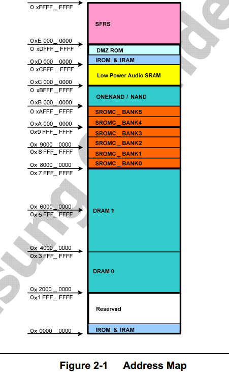

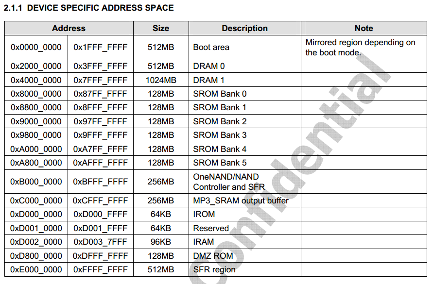

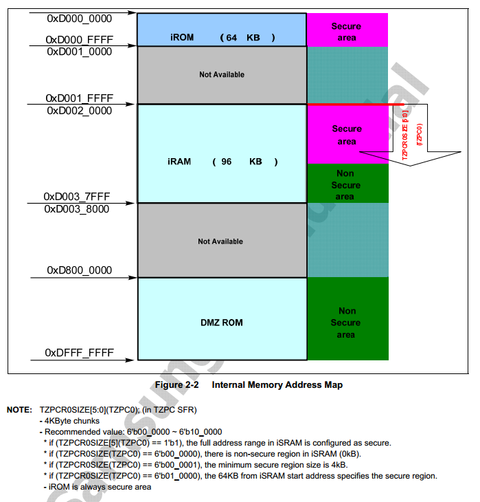

## S5PV210启动过程
S5PV210使用的存储方案是：外接的大容量Nand + 外接大容量DRAM + SoC内置SRAM

210内置了一块96KB大小的SRAM（叫iRAM），同时还有一块内置的64KB大小的NorFlash（叫iROM）。210的启动过程大致是：

- 第一步：CPU上电后先从内部IROM中读取预先设置的代码（BL0），执行。这一段IROM代码首先做了一些基本的初始化（CPU时钟、关看门狗···）（这一段IROM代码是三星出厂前设置的，三星也不知道我们板子上将来接的是什么样的DRAM，因此这一段IROM是不能负责初始化外接的DRAM的，因此这一段代码只能初始化SoC内部的东西）；然后这一段代码会判断我们选择的启动模式（我们通过硬件跳线可以更改板子的启动模式），然后从相应的外部存储器去读取第一部分启动代码（BL1，大小为16KB）到内部SRAM。
> - BL0做了什么
>     + 关看门狗
>     + 初始化指令cache
>     + 初始化栈
>     + 初始化堆
>     + 初始化块设备复制函数device copy function
>     + 设置SoC时钟系统
>     + 复制BL1到内部IRAM（16KB）
>     + 检查BL1的校验和
>     + 跳转到BL1去执行

- 第二步：从IRAM去运行刚上一步读取来的BL1（16KB），然后执行。BL1负责初始化NandFlash，然后将BL2读取到IRAM（剩余的80KB）然后运行
- 第三步：从IRAM运行BL2，BL2初始化DRAM，然后将OS读取到DRAM中，然后启动OS，启动过程结束。


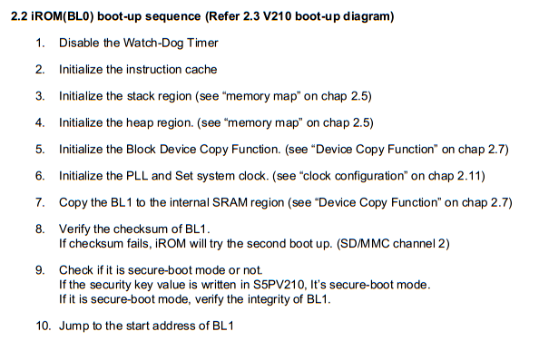

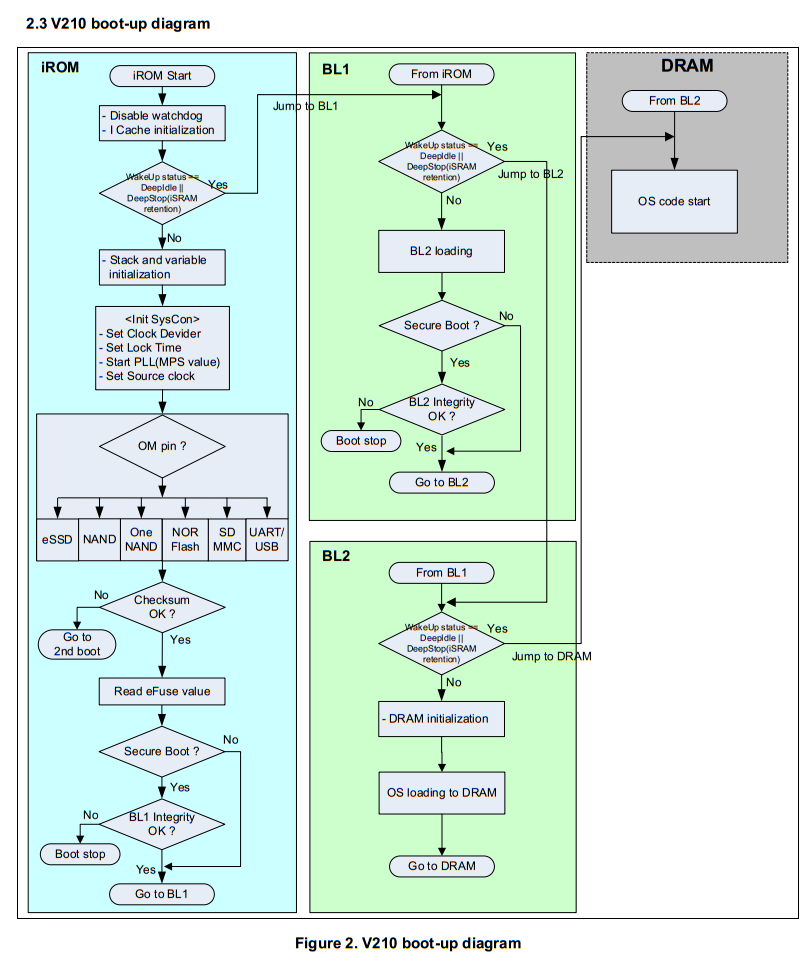

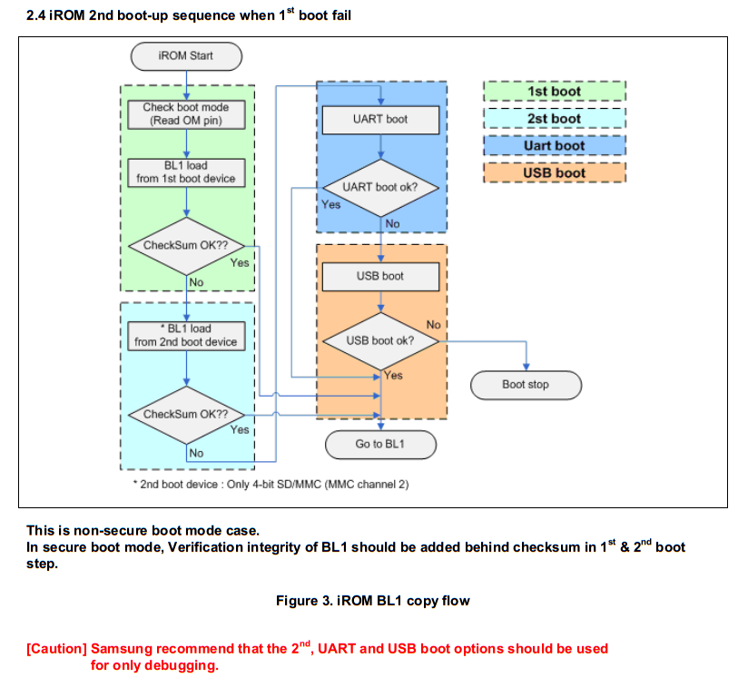

- 210内部有iROM和iRAM，因此启动时分两个阶段：内部启动阶段和外部启动阶段。对于内部启动阶段各种S5PV210的开发板都是相同的，对于外部启动阶段，不同开发板会有不同。
- S5PV210出厂时内置了64KB iROM和96KB iRAM。iROM中预先内置烧录了一些代码（称为iROM代码），iRAM属于SRAM（不需软件初始化，上电即可使用）。210启动时首先在内部运行iROM代码，然后由iROM代码开启外部启动流程。设计成iROM和iRAM是为了支持多种外部设备启动。
- 使用iROM启动的好处：降低BOM成本。因为iROM可以使SOC从各种外设启动，因此可以省下一块boot rom（专门用来启动的rom，一般是norflash）；支持各种校验类型的nand；可以在不使用编程器的情况下使用一种外部存储器运行程序来给另一种外部存储器编程烧录。这样生产时就不用额外购买专用编程器了，降低了量产成本

## OMpin识别外部启动介质


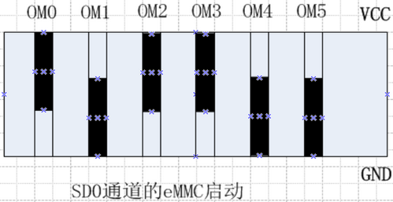


> 拨码开关设置我们只需动OM5即可，其他几个根本不需要碰。需要SD启动时OM5打到GND，需要USB启动时OM5打到VCC


ARM架构
=========
> 参照[ARM_Architecture_Reference_Manual.pdf](../../data/ARM_Architecture_Reference_Manual.pdf) p39

arm约定

- `Byte` 8 bits
- `Halfword` 16 bits
- `Word` 32 bits

大部分arm core提供

- ARM 指令集（32-bit）32位机是指数据总线，寄存器大小，与地址总线无关
- Thumb 指令集（16-bit ）
- Thumb2指令集（16 & 32bit）

## 处理器工作模式
a8共有7种模式(a9还有一个安全模式)

- `User` : 非特权模式，大部分任务执行在这种模式

- `FIQ` :   当一个高优先级（fast) 中断产生时将会进入这种模式(linux内核并未使用)
- `IRQ` :   当一个低优先级（normal) 中断产生时将会进入这种模式
- `Supervisor` :当复位或软中断指令执行时将会进入这种模式
- `Abort` : 当存取异常时将会进入这种模式
- `Undef` : 当执行未定义指令时会进入这种模式

- `System` : 使用和User模式相同寄存器集的特权模式(linux内核并未使用)

> 除User（用户模式）是Normal（普通模式）外，其他6种都是Privilege（特权模式）
>
> Privilege中除Sys模式外，其余5种为异常模式。
>
> 各种模式的切换，可以是程序员通过代码主动切换（通过写CPSR寄存器）；也可以是CPU在某些情况下自动切换。
>
> 各种模式下权限和可以访问的寄存器不同。

操作系统中一般用软中断指令实现系统调用

```plain
软件：用户态------------------------------->内核态--------->用户态
     open---->syscall---->swi/svc--------->sys_open------>open
硬件：user模式----------------------------->svc模式------->user模式
```


## 寄存器
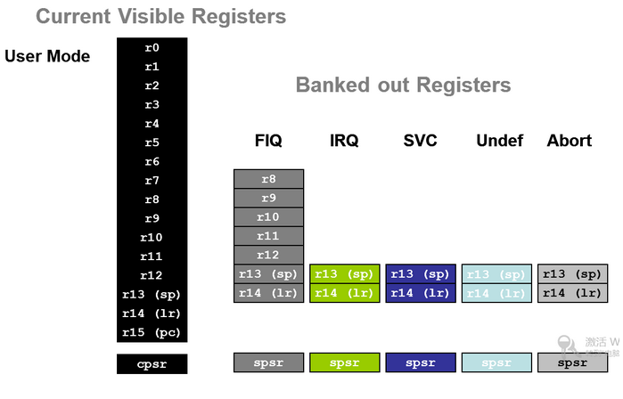

ARM总共有37个寄存器，但是每种模式下最多只能看到18个寄存器，其他寄存器虽然名字相同但是在当前模式不可见。

对r13这个名字来说，在ARM中共有6个名叫r13（又叫sp）的寄存器，但是在每种特定处理器模式下，只有一个r13是当前可见的，其他的r13必须切换到他的对应模式下才能看到。这种设计叫影子寄存器（banked register）

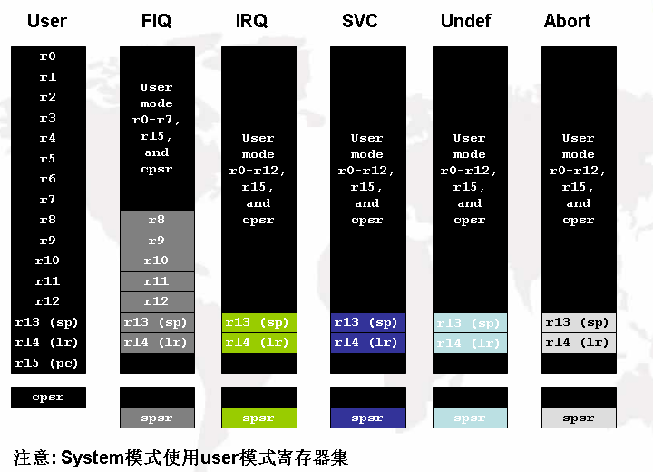

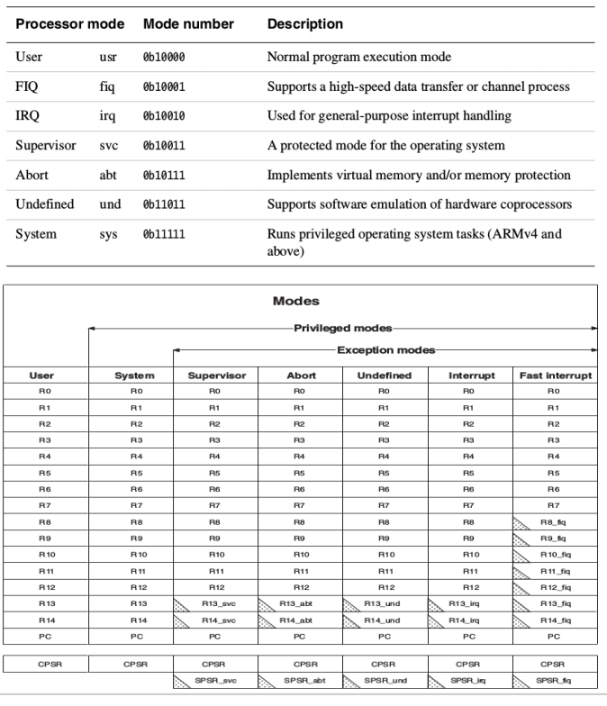

### 寄存器别名

```table
Reg#|  APCS|  意义
----|------|------
r0  |a1    | 工作寄存器
r1  |a2    | "
r2  |a3    | "
r3  |a4    | "
r4  |v1    | 必须保护
r5  |v2    | "
r6  |v3    | "
r7  |v4    | "
r8  |v5    | "
r9  |v6    | "
r10 |sl    | 栈限制
r11 |fp    | 桢指针
r12 |ip    | 内部过程调用寄存器
r13 |sp    | 栈指针
r14 |lr    | 连接寄存器
r15 |pc    | 程序计数器
```

### r13(sp)
stack pointer 栈指针寄存器

内存的布局，sp指向当前正在运行的进程的栈地址，意味着进程切换时，也需要cpu去修改sp指向

```plain
4G--------
   kernel
3G--------

        <-------sp 当前正在运行的进程的栈地址（进程切换时，也会修改sp）
        ----4   sp-1
        ----4   sp-1
        <-------sp

  -------heap
  -------xxx.so
  -------rodata
  -------data
  -------text
   application
0G--------
```

### r14(lr)/r15(pc)
link register 链接寄存器，用于程序返回

process counter，程序指针，PC指向哪里，CPU就会执行哪条指令（所以程序跳转时就是把目标地址代码放到PC中）。整个CPU中只有一个PC

> 在流水线中，PC指向下被取指的指令，而非正在执行的指令

```plain
a(){
  ------------    进入a函数时，将LR的值保存在[SP]中（保证嵌套时，LR不会被覆盖）
  ------------
  ------------    函数结束时，把LR值恢复，PC=LR的值，则执行函数返回后的代码
}

b(){
  ------------
  ------------
  a();            先将下一条指令放在LR中，然后改变PC，使PC=a，则执行a函数
  ------------
```

> - arm在函数传参、返回值、保存返回地址，均使用寄存器，只有局部变量使用栈
> - 而x86中上述的值均使用栈来保存

### cpsr
程序状态寄存器 整个CPU中只有一个

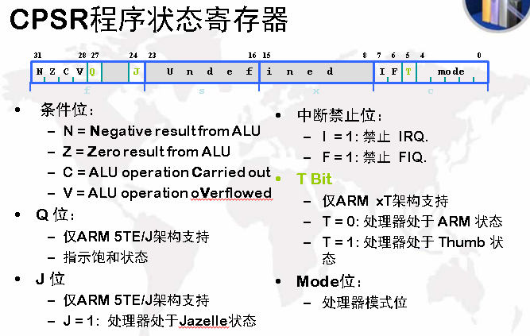

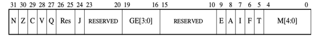

- `N` 当程序出现了负操作会Set N，否则Clear N
- `Z` 当程序出现了0操作会Set Z，否则Clear Z
- `C` 如果是加法产生了进位会Set C，否则Clear C; 如果是减法产生了借位会Clear C，否则Set C
- `V` 如果出现溢出会Set V，否则Clear V
- `Q` 如果运算发生了饱和会Set Q，否则Clear Q
- `J` 如果Arm执行的是java指令，则J==1
- `E` 如果E==1,说明当前运行模式是大端，否则是小端
- `A` 终止禁止位，如果A==1就不会发生终止
- `I` 中断禁止位，如果I==1处理器就不会响应中断
- `F` 快速中断禁止位，如果F==1处理器就不会响应快速中断
- `T` 如果T==1,说明处理器正在执行thumb指令，否则就是arm指令
- `M[4:0]` 表示当前处理器的运行模式

> 用户模式只能修改cpsr的NZCVQ

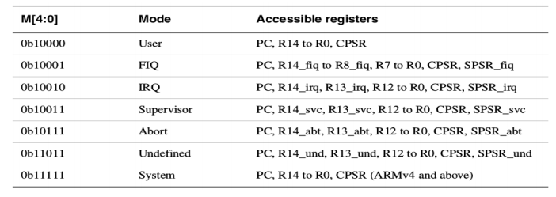

### spsr
整个CPU中有5个，分别在5种异常模式下，作用是当从普通模式进入异常模式时，用来保存之前普通模式下的cpsr的，以在返回普通模式时恢复原来的cpsr。

## 流水线
- arm9   5级流水线
- arm11  8级流水线
- a8     13级流水线
- a9     12级流水线

流水线多了，最怕指令跳转导致的流水线重新构建，arm对此增加了预取指判断

## 指令集
- arm指令集     32位
- thumb指令集   16位     armV7 m系列
- thumb2指令集  32/16位
- java字节码

## 哈佛与冯诺依曼
程序和数据都放在内存中，且不彼此分离的结构称为冯诺依曼结构。譬如Intel的CPU均采用冯诺依曼结构。程序和数据分开独立放在不同的内存块中，彼此完全分离的结构称为哈佛结构。譬如大部分的单片机（MCS51、ARM9等）均采用哈佛结构。

冯诺依曼结构中程序和数据不区分的放在一起，因此安全和稳定性是个问题，好处是处理起来简单。哈佛结构中程序（一般放在ROM、flash中）和数据（一般放在RAM中）独立分开存放，因此好处是安全和稳定性高，缺点是软件处理复杂一些（需要统一规划链接地址等）

- 哈佛（安全性高，性能高）

```
  cpu_core  --->  I-cache(一级 指令cache)
                                      ------> cache(二级统一cache)----->  ddr
            --->  D-cache(一级 数据cache)
```

- 冯诺依曼

```
  cpu_core  --->  cache(一级统一cache) ------> cache(二级统一cache)----->  ddr
```

- a8单核 自带二级cache

```
   a8_core-->D-cache         |
                 ---->cache--|->ddr
          -->I-cache         |
```

- a9多核 不带二级cache，方便多个核共享一个二级cache

```
   a9_core-->D-cache |
          -->I-cache |
   a9_core-->D-cache |
          -->I-cache |
                 ----|->cache---->ddr
   a9_core-->D-cache |
          -->I-cache |
   a9_core-->D-cache |
          -->I-cache |
```

- cpu = cpu_core + mmu + 协处理器 + cache + tcm...
    + cache 通过行，组等方式访问
    + tcm 紧耦合性内存 通过地址访问（指针） 与访问寄存器一样快
    + 协处理器: cp11(浮点VFP) cp10(图形NEON) cp14(DEBUG) cp15(控制CTRL)....
    + 协处理器和MMU、cache、TLB等处理有关，功能上和操作系统的虚拟地址映射、cache管理等有关。


## 异常
正常工作之外的流程都叫异常；异常会打断正在执行的工作，并且一般我们希望异常处理完成后继续回来执行原来的工作；中断是异常的一种

所有的CPU都有 __异常向量表__，这是CPU设计时就设定好的，是硬件决定的。当异常发生时，CPU会自动动作（PC跳转到异常向量处处理异常，有时伴有一些辅助动作）

- 当异常产生时, ARM core:
    + 拷贝 `cpsr` 到 `spsr_<mode>`
    + 设置适当的 `cpsr` 位：
        * 改变处理器状态进入 arm 态
        * 改变处理器模式进入相应的异常模式
        * 设置中断禁止位禁止相应中断 (如果需要)
    + 保存返回地址到 `lr_<mode>`
    + 设置 `pc` 为相应的异常向量
- 返回时, 异常处理需要:
    + 从 `spsr_<mode`>恢复`cpsr`
    + 从`lr_<mode>`恢复`pc`
    + Note:这些操作只能在 ARM 态执行.

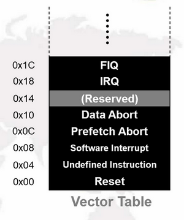

> 以上说的是CPU设计时提供的异常向量表，一般成为一级向量表。有些CPU为了支持多个中断，还会提供二级中断向量表，处理思路类似于一级中断向量表

ARM汇编指令
============
- [ARM指令集详解](http://blog.csdn.net/velanjun/article/details/8719090)
- [ARM指令集.pdf](../../data/ARM指令集.pdf)

> 内嵌汇编编译器：armcc(keil内部集成)， gcc

编译过程

1. `gcc   x.c  x.s`  优化在此发生，为了防止优化，请使用`volatile`
1. `as    x.s  x.o`
1. `ld    x.o  x`

## 指令格式
`<opcode>{<cond>}{S} <Rd>,<Rn>{,<opcode2>}`

> 其中，`<>`内的项是必须的，`{}`内的项是可选的

- `opcode`  指令助记符，如ldr，str 等
- `cond`  执行条件，如eq，ne 等
- `S`  是否影响cpsr 寄存器的值，书写时影响cpsr，否则不影响
- `Rd`  目标寄存器
- `Rn`  第一个操作数的寄存器
- `operand2`  第二个操作数


## 寻址方式
- 寄存器寻址 `mov r1, r2` @`r1 = r2;`
- 立即寻址 `mov r0, #0xFF00` @`r0 = #0xFF00;`
- 寄存器移位寻址 `mov r0, r1, lsl #3` @`r1 = r1 * 8; r0 = r1`
- 寄存器间接寻址 `ldr r1, [r2]` @`r1 = *r2;`
- 基址变址寻址 `ldr r1, [r2, #4]` @`r1 = *(r2 + 4);`
- 多寄存器寻址 `ldmia r1!, {r2-r7, r12}` @`r2 = *r1; r1 += 4; r3 = *r1;...`
- 堆栈寻址 `stmfd sp!, {r2-r7, lr}` @`*sp = r2; sp -= 4; *sp = r3;...`
- 相对寻址 `beq <label>` @`if (cpsr_Z) label();`


## 指令后缀

### 操作数长度
- `b`（byte）功能不变，操作长度变为8位
- `h`（half word）功能不变，长度变为16位

### 操作数有符号
- `s`（signed）功能不变，操作数变为有符号，如 `ldr ldrb ldrh ldrsb ldrsh`

### 影响cpsr标志位
- `s`（s标志）功能不变，影响cpsr标志位，如 `movs adds adcs`

### 条件执行
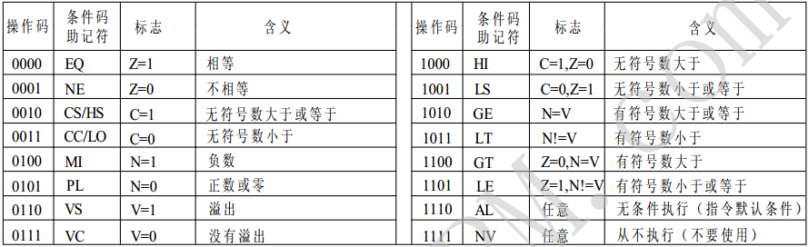

常用的是`eq ne ge gt le lt`

### 索引后缀
> i icrement; a after; b before; d decrement

- `ia` 事后递增，先传输，再地址+4，比较常用，如`stmia/ldmia`
- `ib` 事前递增，先地址+4，再传输
- `da` 事后递减，先传输，再地址-4
- `db` 事前递减，先地址-4，再传输

`ldmia r6，{r0，r4，r7} @*r6 = r0; *(r6+4) = r4; (*r6+8) = r7`

### 栈后缀
地址基址必须使用`sp`（r13），它只是索引后缀的另一种描述

> f full; d descending; e empty; a ascending

- 满栈（full stack）栈指针指向栈顶元素（即最后一个入栈的数据元素），每次存入时需要先移动栈指针再存入，取出时可以直接取出，然后再移动栈指针
- 空栈（empty stack）栈指地指向空位，每次存入时可以直接存入然后栈指针移动，而取出时需要先移动
- 增栈（ascending stack）栈指针移动时向地址增加的方向移动
- 减栈（descending stack）栈指针移动时向地址减小的方向移动

- `fd` 满递减栈，入栈时先地址-4，再传输，出栈时先输出，再地址+4，比较常用，如`stmfd/ldmfd`
- `fa` 满递增栈，入栈时先地址+4，再传输
- `ed` 空递减栈，入栈时先传输，再地址-4
- `ea` 空递增栈，入栈时先传输，再地址+4

`stmfd sp!，{r0-r5，lr}`把`r0-r5`和`lr`保存到栈中

`ldmfd sp!，{r0-r5，pc}`把数据出栈到`r0-r5`和`pc`中

### `!`后缀
指令地址表达式中含`!`后缀，则基址寄存器中的地址会发生变化

`基址寄存器中的值（指令执行后）= 指令执行前的值 + 地址偏移量`

> `!`后缀必须紧跟在地址表达式后面，而地址表达式要有明确的地址偏移量。

> `!`后缀不能用于r15(pc)的后面

### `^`后缀
`ldmfd sp!，{r0-r6，pc}^`，在目标寄存器中有`pc`时，同时把spsr拷贝到cpsr中，并强制处理器回到用户模式（一般用于异常模式返回）

## 数据传输指令
- `mov` 给一个寄存器赋值

```assembly
mov r0, #10  @r0 = 10
mov r0, r1   @r0 = r1
```

- `movt` 给一个寄存器的高16位赋值，把一个16位的op2 放到r0的[31-16]，r0的[15-0]不变，注意：op2 不能大于16位，但可以不符合立即数规则，如op2 可以是0x1234，op1 必须是可读可写的

```assembly
movt r0, #10
movt r0, r1
```

- `mvn` 把一个数值按位取反后赋值给一个寄存器

```assembly
mvn r0，#0xff  @r0 = ~0xff
mvn r0， r1    @r0 = ~r1
```

## 算术指令
- `add` 计算两个数值的加法

```assembly
add r0，r0，#10  @r0 = r0 + 10
add r0，r0，r1   @r0 = r0 + r1
```

- `adc` 带进位的加法

```assembly
adc r0，r0，#10  @r0 = r0 + 10 + c
adc r0，r0，r1   @r0 = r0 + r1 + c
```

- `sub` 计算两个数值的减法

```assembly
sub r0，r0, #10   @r0 = r0 – 10
sub r0, r0, r1    @r0 = r0 - r1
```

- `sbc` 带借位的减法

```assembly
sbc r0, r0, #10   @r0 = r0 – 10 - !c
sbc r0, r0, r1    @r0 = r0 – r1 - !c
```

- `rsb` 反转减法

```assembly
rsb r0, r0, r1    @r0 = r1 – r0
rsb r0, r0, #10   @r0 = 10 - r0
```

- `rsc` 带借位的反转减法

```assembly
rsc r0, r0, r1    @r0 = r1 – r0 - !c
rsc r0, r0, #10   @r0 = 10 – r0 - !c
```

## 乘法指令
- `mul` 乘法

```assembly
mul r0, r1, r2  @r0 = r1 * r2
```

- `mla` 乘加

```assembly
mul r0, r1, r2, r3  @r0 = r1 * r2 + r3
```

- `mls` 乘减

```assembly
mls r0, r1, r2, r3  @r0 = r3 – r1 * r2
```

- `umull`
- `umlal`
- `smull`
- `smlal`

## 位操作指令
- `orr` 按位或

```assembly
orr r0, r0, r1   @r0 = r0 | r1
orr r0, r0, #10  @r0 = r0 | 10
```

- `eor` 按位异或

```assembly
eor r0, r0, #10   @r0 = r0 ^ 10
eor r0, r0, r1    @r0 = r0 ^ r1
```

- `and` 按位与

```assembly
and r0, r0, r1    @r0 = r0 & r1
and r0, r0, #10   @r0 = r0  & 10
```

- `bic` 位取反/位清除

```assembly
bic r0, r0, r1    @r0 = r0 & (~r1)
bic r0, r0, #10   @r0 = r0 & (~10)
```

- `lsr` 逻辑右移

```assembly
r0, lsr r1    @r0 >>> r1
r0, lsr #10   @r0 >>> 1
```

- `lsl` 逻辑左移

```assembly
r0, lsl r1   @r0 <<< r1
r0, lsl #1   @r0 <<< 1
```

- `asr` 算术右移

```assembly
r0, asr r1  @r0 >> r1
r0, asr #1  @r0 >> 1
```

- `ror` 循环右移

```assembly
r0, ror r1   @(r0 >>> r1) | (r0 <<< (32 – r1))
r0, ror #1   @(r0 >>> 1) | (r0 <<< (32 – 1))
```

- `rev` 大小端转换

```assembly
rev r0, r1   @把r1进行大小端转换，结果放到r0
```

- `rev16` 16位大小端转换

```assembly
rev16 r0, r1  @把r1的每个16位进行大小端转换，结果放到r0
```

- `revsh` 16位大小端转换并有符号扩展

```assembly
revsh r0, r1  @把r1的低16位进行大小端转换，并扩展为一个32位的有符号数
```

- `rbit` 位反转

```assembly
rbit r0, r1  @把r1进行位顺序翻转，结果放到r0
```

- `uxtb16` 无符号8 位扩展16位

```assembly
uxtb16 r0，r1  @把r1中的两个8 位数无符号扩展为两个16位数，结果放到r0
```

- `uxtb` 无符号8 位扩展32位

```assembly
uxtb8 r0，r1  @把r1中的8 位数无符号扩展为一个32位数，结果放到r0
```

- `uxth` 无符号16位扩展32位

```assembly
uxth r0，r1  @把r1中的16位数无符号扩展为一个32位数，结果放到r0
```

- `sxtb16` 有符号8 位扩展16位

```assembly
sxtb16 r0，r1  @把r1中的两个8 位数有符号扩展为两个16位数，结果放到r0
```

- `sxtb` 有符号8 位扩展32位

```assembly
sxtb8 r0，r1  @把r1中的8 位数有符号扩展为一个32位数，结果放到r0
```

- `sxth` 有符号16位扩展32位

```assembly
sxth r0，r1  @把r1中的16位数有符号扩展为一个32位数，结果放到r0
```

## 比较指令

- `cmp` 比较

```assembly
cmp r0, r1   @r0 – r1 影响cpsr标志位
cmp r0, #10  @r0 – 10 影响cpsr标志位
```

- `cmn` 负数比较指令，指令使用寄存器rn 与值加上operand2 的值，根据操作的结果更新cpsr中的相应条件标志位，以便后面的指令根据相应的条件标志来判断是否执行

- `teq` 比较（按位异或）

```assembly
teq r0, r1   @r0 ^ r1 影响cpsr标志位
teq r0, #10  @r0 ^ 10 影响cpsr标志位
```

- `tst` 比较（按位与）

```assembly
tst r0, r1   @r0 & r1 影响cpsr标志位
tst r0, #10  @r0 & 10 影响cpsr标志位
```

## cpsr访问指令
- `mrs` 读cpsr
- `msr` 写cpsr

## 软中断指令
- `swi` 软中断 `swi 10`  产生软中断异常 软中断指令用来实现操作系统中系统调用
- `svc` 等同于swi  `svc 10`  产生软中断异常

## 访存指令
- `ldr` 把数据从内存加载的寄存器(单个字/半字/字节访问)

```assembly
ldr r0, addr            @r0 = *addr
ldr r0, =addr           @r0 = addr
ldr r1, [r0]            @r1 = *r0
ldr r1, [r0, #4]        @r1 = *(r0 + 4)
ldr r1, [r0, #4]!       @r1 = *(r0 + 4); r0 += 4
ldr r1, [r0], #4        @r1 = *r0; r0 += 4
```

- `str` 把数据从寄存器保存的内存(单个字/半字/字节访问)

```assembly
str r0, addr            @*addr = r0
str r1, [r0]            @*r0 = r1
str r1, [r0, #4]        @*(r0 + 4) = r1
str r1, [r0, #4]!       @*(r0 + 4) = r1; r0 += 4
str r1, [r0], #4        @*r0 = r1; r0 += 4
```

- `ldm` 把数据从内存加载的寄存器(多字批量访问)

```assembly
ldmfd sp!, {r0-r12, lr}  @从满递减栈中把值取到寄存器
```

- `stm` 把数据从寄存器保存的内存(多字批量访问)

```assembly
stmfd sp!, {r0-r12, lr}  @把寄存器的值放到满递减栈中
stmia sp, {r0-r12}       @事后递增方式把13个寄存器值放到sp指向内存中
```

- `swp{cond}{B} Rd,Rm,[Rn]` 寄存器和存储器交换，用于将一个内存单元（该单元地址放在寄存器Rn中）的内容读取到一个寄存器Rd中，同时将另一个寄存器Rm 的内容写入到该内存单元中。使用swp 可实现信号量操作

```assembly
swp r1,r2,[r0]  @r1 = [r0]; [r0] = r2;
swp r1,r1,[r0]  @temp = r1; r1 = [r0]; r[0] = temp;将r1的内容与r0指向的存储单元的内容进行交换
```

- `push` 压栈

```assembly
push {r0-r12, lr}  @把寄存器的值放到满递减栈中
```

- `pop` 出栈

```assembly
pop {r0-r12, lr}  @从满递减栈中把值取到寄存器
```

## 跳转指令
- `b` 跳转

```assembly
b lable  @跳到lable 处执行
```

- `bl` 跳转并保存返回地址

```assembly
bl lable  @保存下一条指令的地址到lr，并跳转到lable 处执行
```

- `bx` 跳转（可切换状态）

```assembly
bx r0  @跳转到r0所指的位置执行
```

## 前导零计
- `clz` 计算一个数值高位零的个数

```assembly
clz r0, r1  @计算r1中开头的零的个数，把计算结果放到r0
```

## 饱和
- `qadd` 饱和加法

```assembly
qadd r0, r0, r1  @运算结果的饱和到[0x80000000,0x7fffffff]
```

- `qadd8` 饱和8位加法，每一个操作数都是寄存器，不影响q 位

```assembly
qadd8 r0, r0, r1  @r1和r2的每一个字节分别相加，饱和到[-2^7, 2^7-1]
```

- `qadd16` 饱和16位加法，每一个操作数都是寄存器，不影响q 位

```assembly
qadd16 r0, r0, r1  @r1和r2的每一个16位相加，饱和到[-2^15, 2^15-1]
```

- `qsub` 饱和减法

```assembly
qsub r0, r0, r1  @运算的结果饱和到[0x80000000,0x7fffffff]
```

- `qsub16` 饱和16位减法，每一个操作数都是寄存器，不影响q 位

```assembly
qsub16 r0, r0, r1  @r1和r2的每一个16位分别相减，饱和到[-2^15, 2^15-1]
```

- `qsub8` 饱和8 位减法，每一个操作数都是寄存器，不影响q 位

```assembly
qsub8 r0, r0, r1  @r1和r2的每一个字节分别相减，饱和到[-2^7, 2^7-1]
```

- `ssat` 有符号饱和

```assembly
ssat r0, #sat, r1  @1<=sat<=32
@把r1饱和到[-2^(sat-1), 2^(sat-1)-1]，结果放到r0，如果饱和会置位q
@注意：把r1饱和到sat 个位，饱和后符号不变
```

- `ssat16` 有符号16位饱和

```assembly
ssat16 r0, #sat, r1  @1<=sat<=16
@把r1中的每一个16位饱和到[-2^(sat-1), 2^(sat-1)-1]，结果放到r0，如果饱和会置位q
@注意：把r1中的每一个16位饱和到sat 个位，饱和后符号不变
```

- `usat` 无符号饱和

```assembly
usat r0, #sat, r1  @0<=sat<=31
@把r1饱和到[0, 2^sat-1]，结果放到r0，如果饱和会置位q
@注意：负数饱和到0
```

- `usat16` 无符号16位饱和

```assembly
usat16 r0, #sat, r1  @0<=sat<=31
@把r1中的两个16位分别饱和到[0, 2^sat-1]，结果放到r0，如果饱和会置位q
@注意：负数饱和到0
```

## 协处理器cp15操作
- `mrc/mcr`

语法`mcr{<cond>}   p15, <opcode_1>, <Rd>, <Crn>, <Crm>, {<opcode_2>}`

```assembly
mrc p15, 0, r0, c1, c0, 0
orr r0, r0, #1
mcr p15, 0, r0, c1, c0, 0
```

> [ARM CP15协处理器](http://www.cnblogs.com/gaomaolin_88/archive/2010/07/16/1779183.html)

## 伪指令
伪指令经过编译后不会生成机器码，它的意义在于指导编译过程。它与具体的编译器相关。

- 常见gun伪指令

```assembly
.global _start                     @ 给_start外部链接属性(别的文件可以访问)

.section .text                     @ 指定当前段为代码段

.ascii .byte .short .long .word .quad .float .string
                                   @ 数据类型，定义变量时使用
IRQ_STACK_START:
  .word 0x0badc0de                 @ 等价于unsigned int IRQ_STACK_START = 0x0badc0de;

.align 4                           @ 以2**4，即16字节对齐 (不填充)

.balignl 16 0xdeadbeef             @ b表示位填充 align表示对齐 l表示以4字节为单位填充
                                   @ 16表示16字节对齐 填充内容是0xdeadbeef

.equ                               @ 类似于C中宏定义，可使用#define来代替
```

- 偶尔用到伪指令

```assembly
.end                               @ 标识文件结束

.include                           @ 头文件包含

.arm                               @ 声明以下为arm指令
.code32     

.thumb                             @ 声明以下为thubm指令
.code16
```

- 重要的伪指令

```assembly
ldr                                @ 大范围的地址加载指令

adr                                @ 小范围的地址加载指令

adrl                               @ 中等范围的地址加载指令

nop                                @ 空操作，用于消耗时钟周期
```

- ARM中有一个`ldr`指令，立即数前面是`#`，还有一个`ldr`伪指令，立即数前面是`=`（或者op2直接是一个符号），伪指令不用考虑非法立即数（涉及arm文字池）。__一般情况下都使用伪指令__
- `adr`编译时会被1条`sub`或`add`指令替代，而`ldr`编译时会被一条`mov`指令替代或者文字池方式处理
- `adr`总是以`pc/r15`为基准来表示地址，因此指令本身和运行地址有关(相对地址)，可以用来检测程序当前的运行地址在哪里，即加载的地址在 __运行时__ 确定
- `ldr`加载的地址和链接时给定的地址有关，由链接脚本决定，即加载的地址在 __链接时__ 确定
- 我们可以通过`adr`和`ldr`加载的地址比较来判断当前程序是否在链接时指定的地址运行


ARM汇编示例
===========
##　绑定寄存器
- 立即数，被编译到指令当中的数据:
    + 本身小于等于255 (一条指令32位，所以指令中的数据就最大可以存8位)
    + 经过循环右移偶数位之后小于等于255
    + 按位取反之后符合上面
    + 0x000000ff 0x00ff0000 0xf000000f 均是合法的，而0x000001ff非法

```c
#include <stdio.h>

int main(void){
  register unsigned int a asm("r0");
  asm volatile(
    "mov r0, #4\n"
    :
    :
    :"r0"
  );
  printf("r0 = %x\n", a);
  return 0;
}
```

## 输入输出变量
- 输出变量，对于汇编而言的，汇编对这个变量只能写不能读
- 输入变量，对于汇编而言的，汇编对这个变量只能读不能写
- 输入变量，输出变量，输入输出变量的具体寄存器名由编译时指定，可通过`arm-linux-gcc -S`来生成汇编查看
- `=`:代表输出变量
- `+`:代表输入输出变量
- `r`:操作方式是寄存器
- `m`:操作方式是内存
- `&`:代表输出变量和输入变量　__不共用__ 寄存器
- 三个冒号，第一行用于声明　`输出`　或　`输入输出`　变量；第二行用于声明　`输入`　变量；第三行用于　__保护__ 上面代码块中显示使用过的寄存器，使用内存的需要标识`memory`

- 声明输入输出变量，使用 `下标` 来访问

```c
#include <stdio.h>

int main(void){
  int in = 40;
  int out = 23;

  asm volatile(
    "mov %0, %1\n"
    :"=&r"(out) //声明输出变量
    :"r"(in) //声明输入变量
    :
  );
  printf("in = %d\n", in);
  printf("out = %d\n", out);
  return 0;
}
```

对应汇编如下，将下标转换为寄存器

```assembly
#APP
@ 7 "03in_out.c" 1
  mov r4, r3

@ 0 "" 2
  str r4, [fp, #-20]
```

- 声明输入输出变量，使用 `名称` 来访问

```c
#include <stdio.h>

int main(void){
  int a = 5;
  int b = 6;
  int c; //temp

  asm volatile(
    "mov %[c], %[a]\n"
    "mov %[a], %[b]\n"
    "mov %[b], %[c]\n"

    :[a]"+r"(a),[b]"+r"(b),[c]"+r"(c)
    :
    :
  );
  printf("a = %d\n", a);
  printf("b = %d\n", b);
  return 0;
}
```

## 64位加法
- 除了`比较指令`和直接操作`cpsr`的指令，其他指令要影响`cpsr`标志位就必须加`s`
- 利用`adds`和`adc`，`adds`后有进位，`cpsr_C`的标志位就为1
- 如果要实现更大位的相加，`adc`也可以使用`s`后缀

```c
#include <stdio.h>

int main(void){
  int a, b;

  //0x0000000400000005
  //0x00000008ffffffff
  //0x0000000d00000004
  asm volatile(
    "mov r0, #5\n"
    "mvn r1, #0\n"       //r1=~0;
    "adds %0, r0, r1\n"  //cpsr_C=1
    "mov r0, #4\n"
    "mov r1, #8\n"
    "adc %1, r0, r1\n"   //%1=r0+r1+C
    :"=&r"(a), "=&r"(b)
    :
    :"r0", "r1"
  );

  printf("%#010x%08x\n", b, a);
  return 0;
}
```

## 64位减法
- arm本身没有减法，减法是通过加法和补码（取反+1）配合得到的
- 利用`subs`和`sbc`，`subs`有借位后，`cpsr_C`的标志位就为0

```c
#include <stdio.h>

int main(void){
  int a, b;

  //0x0000000900000004
  //0x0000000400000005
  //0x00000004ffffffff

  __asm__ __volatile__(
    "mov r0, #4\n"
    "mov r1, #5\n"
    "subs %0, r0, r1\n"   //clear C
    "mov r0, #9\n"
    "mov r1, #4\n"
    "sbc %1, r0, r1\n"    //%1=r0-r1-!C
    :"=&r"(a), "=&r"(b)
    :
    :"r0", "r1"
  );

  printf("%#010x%08x\n", b, a);
  return 0;
}
```

## 乘加/乘减
- 方便数学上的西格玛计算

```c
#include <stdio.h>

int main(void){
#if 0
       i = 0;
  c =  ∑    i * i
       i<100

  i = 0;
  while(i < 100)｛
  　　　mla r2, r0, r0, r2
  　　　i++;
  ｝
#endif
  int a;

  asm volatile(
    "mov r0, #3\n"
    "mov r1, #4\n"
    "mov r2, #5\n"
    //"mla %0, r0, r1, r2\n"  //%0=r2+r0*r1
    "mls %0, r0, r1, r2\n"    //%0=r2-r0*r1
    :"=&r"(a)
    :
    :"r0", "r1", "r2"
  );

  printf("a = %d\n", a);
  return 0;
}
```

## 位操作
- 清零操作`bic`

比如有个控制LED的寄存器，第`n`位为`1`则该位对应的灯亮

```
LENCON |= 1 << n;              #c语言
orr LENCON, LENCON, 1 << n     #汇编
```

如果想第`n`与`n+1`位为零，即相邻两位要清零，相邻两位表达为`bin11`，即十进制的`3`

```
LEDCON &= ~(3 << n);          #c语言

mvn r0, 3 << n                #汇编1
and LEDCON, LEDCON, r0

bic LEDCON, LEDCON, 3 << n    #汇编2
```

- bit反转`rbit`

```c
int main(void){
  int bic, rbit = 0x12345678;

  asm volatile(
    "mov r0, #0xff\n"
    "mov r1, #(3 << 2)\n"  //1100  3 << 2
    "bic %0, r0, r1\n"     //%3=r0&(~r1)
    "rbit %1, %1\n"
    :"=r"(bic), "+r"(rbit)
    :
    :"r0", "r1"
  );

  printf("bic = %x\n", bic);
  printf("rbit = %x\n", rbit);

  return 0;
}
```

- 左移右移
    + `lsl` 逻辑左移
    + `lsr` 逻辑右移
    + `asr` 算术右移，空出位以符号位补充，不存在算术左移，`asl`将翻译成`lsl`
    + `ror` 循环右移


## 大小端转换
```c
#include <stdio.h>

int main(void){
  int a = 0x12345678;

  //htonl  ntohl
  asm volatile(
    "rev %0, %0\n"     //32位
    :"+r"(a)
  );

  printf("a = %x\n", a);

  a = 0x1234;
  //htons ntohs
  asm volatile(
    "rev16 %0, %0\n"   //16位
    :"+r"(a)
  );

  printf("a = %x\n", a);
  return 0;
}

```

## 读写cpsr
- `mrs`读`cpsr`
- `msr`写`cpsr`，user模式只能修改`NZCVQ`位

```c
#include <stdio.h>

int main(void){
  int c;
  asm volatile(
    "mrs %0, cpsr\n"  //%0=cpsr
    :"=&r"(c)
  );

  printf("c = %x\n", c);

  //N=0 Z=0 C=0 V=0 Q
  asm volatile(
    "mov r0, #3\n"
    "adds r0, r0, #0\n"
    :::"r0"
  );

  asm volatile(
    "mrs %0, cpsr\n"  //%0=cpsr
    :"=&r"(c)
  );

  printf("c = %x\n", c);

  asm volatile(
    "mrs r0, cpsr\n"
    "mvn r1, #0\n"
    "orr r0, r0, r1\n"
    "msr cpsr, r0\n"  //cpsr=r0
    :::"r0", "r1"
  );

  asm volatile(
    "msr cpsr, #0xff\n"
  );

  asm volatile(
    "mrs %0, cpsr\n"  //%0=cpsr
    :"=&r"(c)
  );

  printf("c = %x\n", c);
  return 0;
}
```

## 内存操作
### 普通变量
- `m`:操作方式是内存，`"m"(a)`表示`a`的地址作为输入变量
- 第三行冒号，使用内存的需要标识`memory`

```c
  int a = 4;
  asm volatile(
    "ldr r0, %0\n"   //r0=*addr  %0是a的地址
    "add r0, r0, #1\n"
    "str r0, %0\n"   //*addr=r0
    :
    :"m"(a)
    :"r0", "memory"
  );
  printf("a = %d\n", a);
```

### 数组操作1
```c
  int b[3] = {0, 1, 2};

  asm volatile(
    "add %0, %0, #1\n"
    "add %1, %1, #1\n"
    "add %2, %2, #1\n"
    :"+r"(b[0]), "+r"(b[1]), "+r"(b[2])
    :
    :
  );

  int i;
  for(i = 0; i < 3; i++)
    printf("b[%d] = %d\n", i, b[i]);
```

### 数组操作2
```c
  int b[3] = {0, 1, 2};

  asm volatile(
    "mov r0, %0\n"
    "ldr r1, [r0]\n"   //r1=*r0
    "add r1, r1, #4\n"
    "str r1, [r0]\n"   //*r0=r1

    "add r0, r0, #4\n" //地址移4位
    "ldr r1, [r0]\n"
    "add r1, r1, #4\n"
    "str r1, [r0]\n"

    "add r0, r0, #4\n"
    "ldr r1, [r0]\n"
    "add r1, r1, #4\n"
    "str r1, [r0]\n"
    :
    :"r"(b)
    :"r0", "r1"
  );

  int i;
  for(i = 0; i < 3; i++)
    printf("b[%d] = %d\n", i, b[i]);
```

### 数组操作3
```c
  int b[3] = {0, 1, 2};

  asm volatile(
    "mov r0, %0\n"

    "ldr r1, [r0]\n"     //r1=*r0
    "add r1, r1, #3\n"
    "str r1, [r0], #4\n" //*r0=r1 r0+=4 修改值后 直接地址移动　上面两条指令合并成一条

    "ldr r1, [r0]\n"     //r1=*r0
    "add r1, r1, #3\n"
    "str r1, [r0], #4\n" //*r0=r1 r0+=4

    "ldr r1, [r0]\n"     //r1=*r0
    "add r1, r1, #3\n"
    "str r1, [r0], #4\n" //*r0=r1 r0+=4
    :
    :"r"(b)
    :"r0", "r1"
  );

  int i;
  for(i = 0; i < 3; i++)
    printf("b[%d] = %d\n", i, b[i]);
```

### 数组操作4
```c
  int b[3] = {0, 1, 2};

  asm volatile(
    "mov r0, %0\n"
    "ldr r1, [r0]\n"
    "add r1, r1, #2\n"
    "str r1, [r0]\n"

    "ldr r1, [r0, #4]\n"   //r1=*(r0+4) 不改变数据基地址,通过位移来访问
    "add r1, r1, #2\n"
    "str r1, [r0, #4]\n"

    "ldr r1, [r0, #8]\n"   //r1=*(r0+8)
    "add r1, r1, #2\n"
    "str r1, [r0, #8]\n"
    :
    :"r"(b)
    :"r0", "r1"
  );

  int i;
  for(i = 0; i < 3; i++)
    printf("b[%d] = %d\n", i, b[i]);
```

### 数组操作5
```c
  int b[3] = {0, 1, 2};

  asm volatile(
    "mov r0, %0\n"
    "ldr r1, [r0]\n"
    "add r1, r1, #5\n"
    "str r1, [r0]\n"

    "ldr r1, [r0, #4]!\n"    //r0+=4 r1=*r0 直接地址移动　再取值　也是两条指令合并成一条
    "add r1, r1, #5\n"
    "str r1, [r0]\n"

    "ldr r1, [r0, #4]!\n"    //r0+=4 r1=*r0
    "add r1, r1, #5\n"
    "str r1, [r0]\n"
    :
    :"r"(b)
    :"r0", "r1"
  );

  int i;
  for(i = 0; i < 3; i++)
    printf("b[%d] = %d\n", i, b[i]);
```

## 栈操作
- c语言中入栈采用FD(满递减模式)，即`[sp]`的指向是有效空间，当需要入栈时，先`sp=sp-1`，然后再把值放到`[sp]`中；而出栈，则先出栈，后`sp=sp+1`

### 内存方式读写栈
- 因为`[sp]`指向的内容是有效空间，这种方式容易造成程序错误

```c
  int a;

  asm volatile(
    "ldr %0, [sp]\n"
    "mov r0, #10\n"
    "str r0, [sp]\n"
    :"=&r"(a)
    :
    :"r0"
  );

  printf("a = %x\n", a);
```

### push/pop操作栈
- 入栈和出栈时寄存器需要保持从小到大的次序（否则会有警告），__低地址__ 空间的值对应 __小号__ 的寄存器（低地址空间的先出栈）

```c
  int a, b, c;

  asm volatile(
    "mov r0, #1\n"
    "mov r1, #2\n"
    "mov r2, #3\n"
    "push {r0-r2}\n"
    "pop {r3-r4, r5}\n"
    "mov %0, r3\n"
    "mov %1, r4\n"
    "mov %2, r5\n"
    :"=&r"(a), "=&r"(b), "=&r"(c)
    :
    :"r0", "r1", "r2", "r3", "r4", "r5"
  );

  printf("a = %x\n", a);
  printf("b = %x\n", b);
  printf("c = %x\n", c);
```

### stmfd/ldmfd操作栈
明确指出使用满递减的方式操作栈

- stmfd (ST: Store, M: Multiple, F: FULL, D: Descending)
- ldmfd (LD: Load, M: Multiple, F: FULL, D: Descending)

```c
  int a, b, c;

  asm volatile(
    "mov r0, #1\n"
    "mov r1, #2\n"
    "mov r2, #3\n"
    "stmfd sp!, {r0-r2}\n"
    "ldmfd sp!, {r3-r4, r5}\n"
    "mov %0, r3\n"
    "mov %1, r4\n"
    "mov %2, r5\n"
    :"=&r"(a), "=&r"(b), "=&r"(c)
    :
    :"r0", "r1", "r2", "r3", "r4", "r5"
  );

  printf("a = %x\n", a);
  printf("b = %x\n", b);
  printf("c = %x\n", c);
```

## 原子操作
- c语言中类型修饰符为`atomic_t`
- 汇编中使用`ldrex`和`strex`，并依据`cmp`来判断是否修改成功，不成功则重新执行
- 内核调度的是线程（不是进程），类似锁、互斥量都是由汇编中原子操作来支持

```c
atomic_t a;

atomic_add(a, 1);

int atomic_add(int a, int b){
  asm volatile(
    "again:\n"
    "ldrex r0, %0\n"
    "add r0, r0, %1\n"
    "strex r1, r0, %0\n"
    "cmp r1, #0\n"
    "bne again\n"
    :
    :"m"(a), "r"(b)
    :
  );
}
```

## 比较指令与条件执行
- 比较指令是不需要加`s`就能影响`cpsr`位的指令
- 比较指令完成后，一般就需要条件执行
- `cmp`做减法去影响cpsr位；`cmn`做加法去影响cpsr位；
- 一般语句都可加条件执行的后缀`[ne|eq|lt|gt|le|ge]`，如`mov`可以为`movne`

```c
if(a > b)     //cmp a, b       @转化为 a - b,将修改cpsr 中的 NZ 位
  c = 7       //movgt c, #7    @N==0 Z==0
else if(a == b)
  c = 9       //moveq c, #9    @Z==1
else
  c = 10      //movlt c, #10   @N==1
```

```c
  int a = 5, b = 6, c;

  asm volatile(
    "mov r0, #1\n"
    "mov r1, #2\n"
    "cmp r0, r1\n"
    "movgt %0, #7\n"
    "moveq %0, #9\n"
    "movlt %0, #10\n"
    :"=&r"(c)
    :"r"(a), "r"(b)
    :"r0", "r1"
  );

  printf("c = %d\n", c);
```

## 跳转指令
```c
  int a;
  asm volatile(
    "mov %0, #3\n"
    "b end\n"
    "mov %0, #4\n"  //不会被执行到
    "end:\n"
    :"=&r"(a)
  );
```

- 跳转到指定label
- `b/bl/bx`最多只能跳转的范围[-32M, +32M-4]

```c
int main(void){
  int a;
  asm volatile(
    "mov r0, #1\n"
    "mov r1, #2\n"
    "bl nihao\n"         //先把下一条指令的地址保存在lr中,然后再跳转
    "mov %0, r0\n"
    :"=&r"(a)::"r0", "r1"
  );

  printf("a = %d\n", a);
  return 0;
}

asm (                   //可以位于函数外部,此处不需要加volatile
  "nihao:\n"
  "add r0, r0, r1\n"
  //"mov pc, lr\n"      //把lr的值放入pc,实现了跳转
  "bx lr\n"             //等价于上面的语句
);
```

## 汇编中调用C函数
- 利用上面的跳转指令来实现函数调用
- 根据APCS（arm过程调用标准），用来约束汇编和C/C++相互调用
    + 传参数：`r0`, `r1`, `r2`, `r3` 如果参数个数大于4个，那么超过4个的参数放到栈（越靠后的参数越先入栈）
    + 要求必须用满递减栈
    + 返回值：如果返回值是32位则放到`r0`；如果64位则高32位放到`r1`，低32位放到`r0`

```c
#include <stdio.h>
int main(void){
  int a;
  asm volatile(
    "mov r0, #5\n"
    "mov r1, #6\n"
    "push {r0, r1}\n"    //超过4个参数的,做入栈处理
    "mov r0, #1\n"       //该句以及下面三句,即将参数放在相应寄存器上
    "mov r1, #2\n"
    "mov r2, #3\n"
    "mov r3, #4\n"
    "bl nihao\n"         //先把下一条指令的地址保存在lr中,然后在跳转
    //pop {r0, r1}       //函数执行完成后,需清理参数,做出栈处理,此处有bug,会覆盖寄存器值
    "add sp, sp, #8\n"   //正确做法是,将sp+8
    "mov %0, r0\n"
    :"=&r"(a)::"r0", "r1"
  );

  printf("a = %d\n", a);
  return 0;
}

int nihao(int a, int b, int c, int d, int e, int f){
  printf("a = %d\n", a);
  printf("b = %d\n", b);
  printf("c = %d\n", c);
  printf("d = %d\n", d);
  printf("e = %d\n", e);
  printf("f = %d\n", f);
  return a + b + c + d + e + f;
}
```

## 未定义指令
将产生一条`SIGILL        4       Core    Illegal Instruction`信号

```c
#include <stdio.h>

int main(void){
  //内嵌的指令是处在代码段
  asm volatile(
    ".word 0x77777777\n"
  );

  return 0;
}
```

## 选择排序

<!-- run -->

```c
#include <stdio.h>

void sort(int *, int);
int main(){
    int i;
    int arr[] = {3,5,7,4,2,1,9,6};
    int len = sizeof(arr) / sizeof(int);
    sort(arr, len);
    for(i = 0; i < len; i++){
        printf("%d ", arr[i]);
    }
    printf("\n");
    return 0;
}

void sort(int *arr, int len){
    int idx, i, j, temp;
    for(i = 0; i < len - 1; i++){
        idx = i;
        for(j = i + 1; j < len; j++){
            if(arr[j] < arr[idx])
                idx = j;
        }
        if(i != idx){
            temp = arr[i];
            arr[i] = arr[idx];
            arr[idx] = temp;
        }
    }
}
```

将其中算法部分改成汇编如下：

```c

```


<script>

(function(){
    if(typeof expand_toc !== 'function') setTimeout(arguments.callee,500);
    else expand_toc('md_toc',1);
})();

</script>


<!--
ifconfig eth0 192.168.4.119
mount -t nfs -o nolock,rw 192.168.4.118:/tomcat_root /mnt
-->
