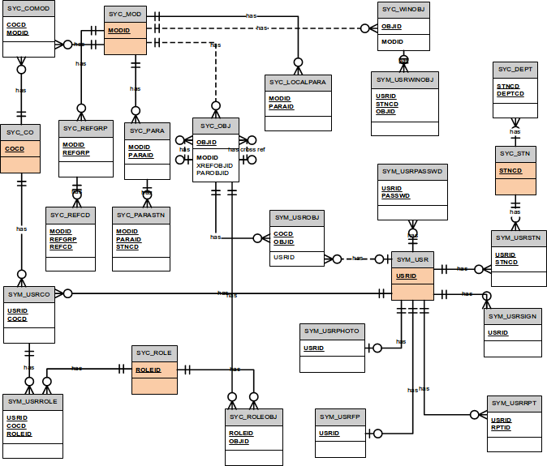
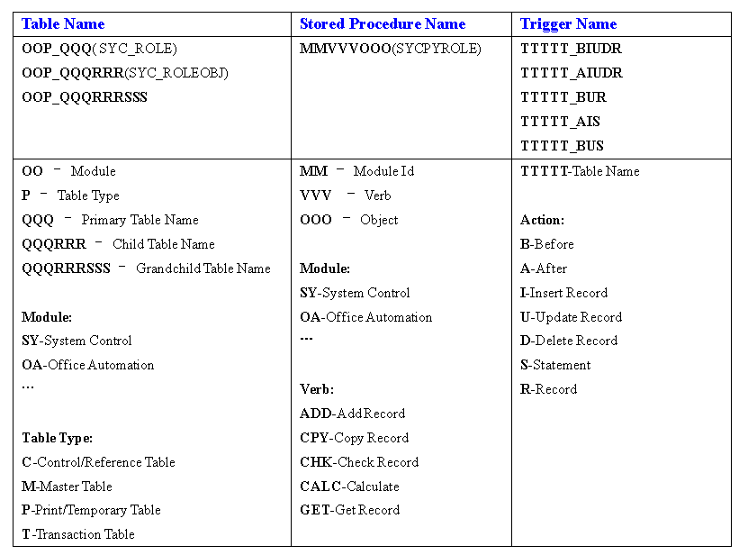

> 2009-10-25

区分DB与OO对系统的作用
========================

- 在开发企业应用时，有一种现象是什么都映射到实体关系模型中，基于数据库向上进行开发，导致一说到功能时，马上就想到需要什么表（结构），需要什么样的SQL语句（操作）。

- 问题是有时候我们分析业务流程或逻辑时，很难一下子映射到ER中，这就需要面向对象思想来 __帮助我们进行分析与设计__，延迟对数据库的考虑，我们可以基于UML达到更多的分析制品（用例/活动图/领域类图/序列图…）更利于我们分析我们所要解决的问题，到时候考虑什么领域对象是需要持久化的，这时就考虑DB的设计与实现了。

- 但是不要以为OO了，DB就不重要了，认为DB只是负责持久化而已(导致一个领域对象就一张表，DB设计毫无章法)，那就错了：
    - UML中的领域类图，与DB中的概念模型相似度很高
    - 毕竟关系模型是基于数学上的谓词演算，所以DB利于做基于集合运算的功能（分组/统计/排序/复杂查询/报表等）
    - 另外有时候关于系统整合，一般发生在系统上线之后，这部分需求是原先分析不到的，但如果DB在设计时不做全局考虑，到整合时就会难以扩展
    - 数据的生命周期往往大于系统的生命周期，需要考虑可维护性与可扩展性
    - ...

> Peter Coad的《Object Models: Strategies, Patterns, and Applications》及在其后的《Java Modeling in Color with UML》（亦称四色建模）中建立领域模型对形成ER图很有帮助

区分逻辑设计与物理设计
==========================

- 数据库设计分为逻辑设计与物理设计，逻辑设计侧重对问题领域进行实体关系化，即形成ER图，逻辑模型尽可能的符合范式，减少冗余，它与具体数据库产品关系不大。
- 而物理设计侧重满足一定范式前提下又能够满足性能，同时又依赖于所选择的数据库产品，请区分 __联机操作/联机分析__，区分 __读频繁/插入频繁/修改频繁__ 的表，区分 __受众类型/使用频率__，...
- 逻辑设计更多的与业务相关，也可能依赖于面向对象分析的结果，毕竟许多领域对象是需要持久化的，也依赖于我们更多业务领域知识的积累，以下更多是物理设计的一些建议。

区分基础模块与业务模块
=======================
- 在开发企业应用时，总有一些在各个项目中使用的一些表，比如有关权限控制/引用代码/区域代码/参数设置等，我们把它们独立出来，形成可以对各个项目进行支持的基础模块，如下图：

- 而另外一些模块由于各个业务流程不一样，导致很难重用（主要指数据表的重用），则为业务模块。

- 关于业务模块的区分，以互不依赖为准则（利用切割扩展及分别部署）进行定义，同时注意它的粒度是比较大的，不要将一个功能就定义为一个模块。

区分数据表的类型
===================

其实表是有类型之分的：

1. __Reference__：所有其他表中引用字段存在于此类型表（项目中常用的有 __引用代码表__ 和 __参数配置表__），利于有效的压缩表的数量，在数据列中存储的都是各种Code。此外，还能在UI层作为选项的数据源。与Master的区别，它只含 __键值对__ 等主要字段，如下表，而Master表需要更多的业务相关字段。

<!--language: table-->

    |REFGRP        |REFCD |CDESC      |EDESC  |
    |--------------|------|-----------|-------|
    |GENDERTYP     |M     |男         |Male   |
    |GENDERTYP     |F     |女         |Female |

1. __Control__：模块，对象，角色，权限，假期，汇率，区域等基础模块中使用的表。

1. __Master__：存的主要是业务模板数据，多数作为选择，业务操作时不会对它修改（读频繁）,如果Master还有主从关系时，需要将结构关系合并到统一的基础模块Tree表中，从而有效的压缩表的数量。上述三个类型的表中的数据只可以增加，__不能删除__，可以通过RECSTS标识是否有效状态来达到逻辑删除。

1. __Transaction__：对业务数据进行操作的记录存在于此，比如每天发生的销售记录，及各种日志（__写频繁__）。它对应四色建模中的过程数据(moment)

1. __Print/Temporary__：主要是为了提高性能及缓存而建立的临时表。

由于以上类型的区分，可以使数据表的数量达到有效压缩，一方面在程序开发时，由于只需对统一的少数表进行操作，相比操作一大堆表的出错几率会下降，另一方面，由于压缩的表，多数为读频繁且修改不频繁，在程序中可以进行缓存，减少数据库访问压力。

建立规范与标准
===============

必须有一套建立规范的机制，达到命名/调用/测试时有一套适合项目的标准，一方面使我们开发与管理流程相对容易些，另一方面也使我们工作更有效率，以下是一些建议：

## 命名规范

- 如果关联表，根据业务，核心表在前，从属表在后进行命名
- 如果是主从表，且主表是多个从表的主表，必须确保在按表名排序时在一起
- 如果存在主-明细，则加后缀DTL，它是特殊的从表，但往往与记录相关，如：OAT_HISDTL

> 如果采用类似Rails之类的框架，它本身对数据表的命名有要求，可酌情考虑

## 主从表的键

- 从表的主键必须含主表的主键，不能将主表键仅当外键。

> 如果采用ORM的框架，可能只能使用自增或GUID，对组合主键支持不好，也应酌情考虑

## 保留字段

- 所有数据表必须含以下字段INSBY，INSDT，UPDBY，UPDDT，[RECSTS，ORDSEQ]，所有在INSBY之上的字段就是主键。

## 引用代码

- 与控制相关的：有关业务的流程中标识状态/进度的；能控制流程切换的字段；
- 与标准相关的：国家或行业标准中使用的代码；诸如原因/类别/途径/值区间等代码；
- 需要设计为键值对，并存到统一的引用代码表中，此表的记录不能删除，但可标识记录的有效性。别的表在存数据时，只需记录键值对的Key。

## 数据约束
- 必要约束是需要的，避免垃圾进垃圾出及后期数据处理出现不一致情况，约束的操作手法有：定义表时添加的约束（唯一/非空/检查），触发器，统一的Procedure来完成业务操作等。

## 是否原子性
- 在业务记录表中，某些时候如果要满足原子性（不可再分割），必须扩展出一个从表出来，如果多个字段不原子，则扩展多个从表出来，一下就表膨胀了，我们需要考虑这个从表仅仅是满足原子性吗，有其他要求吗，比如对从表的统计？

- 例如有个表，记录用户对模块的个性化配置信息，这些配置信息根本没必要进行即时统计出来，这些信息对主记录的依赖更大，ORACLE中内嵌表的意义在也此，而XML流行的今天，我们完全可以将这个字段定义成XML类型，存储一个XML序列化后的配置对象（如果要对这个字段进行约束，可以考虑使用XSD，目前主流数据库都支持），一方面能有效减少表膨胀，另一方面即使日后有统计要求，因为频率与实时性都较低，到时进行数据转换就可以了。

- 考虑使用NoSQL来记录

## 组合/聚合
- 确定对于主表记录的删除，从表相关记录是否一起删除，从而区别到底应该定义为主从表（组合）还只是主表类型引用（聚合）。

## 时间问题
- 我们数据表并不是一层不变的，有些数据是依赖时时间的，比如商品价格，我们不能一下子将这个商品Master表的价格修改了，这会导致经前订单记录Transaction表统计价格时不断变化，也无法跟踪价格变化。
- 一种减少冗余做法是商品Master表不含价格，但它有个 __依据时间段的价格从表__，任何订单记录Transaction表还需要记录这个价格从表的Key；另一种做法是固化订单记录Transaction中的价格，但存在冗余。

## 代码生成
- 一些表需要建立存储过程，一些表在更新与删除时需要触发器来日志，这些通用的需求都应该有代码生成工具生成。

## 脚本化
- 由于开发/测试/生产的环境各不一样，数据库的结构也是迭代的演进的，我们必须对数据库当前结构进行描述，不要使用工具将结构与数据导来导去，应使用脚本来进行这一项工作，明确的记录各数据库的 __版本号__，低版本升级时通过运行一段脚本达到高版本。

## 版本控制
- 版本控制依赖是 __脚本+版本号__ 来完成，新版本数据库不能引起老版本的程序出现错误，这就要求：
    1. 对数据表 __只能增不能减__，字段只能增不能减，字段类型 __不能变__；
    1. 程序中使用SQL语句时，`select`时不建议使用`*`，而应指定列名，`insert`时需要指定插入的列名。

> 参考Rails对数据库版本所做管理。[migrations](http://guides.ruby.tw/rails3/migrations.html)

## 单元测试

- 所写的Function，Procedure，Package等，都需要进行单元测试，测试原则与程序开发(C#/JAVA)时的单元测试原则差不多

有关权限的思考
==============
## RBAC的方式

- DB存储
    -  `资源`的注册，可与层级`模块`关联，以方便菜单的制作
    -  `角色`与`资源`针对`操作`关联，默认可选操作是 `CRUD`（C:new,create;R:index,show;U:edit,update;D:destory），可结合业务需要增加`操作`，该关联即 __授权行为__ 的产生
    -  `用户`与`角色`关联，两者是多对多关系

- 程序行为
    - `用户`主界面的菜单生成：由`用户`关联其所有`角色`，合并`角色`所有`资源`的`index`，再对照层级`模块`，生成菜单
    - 某`资源`index界面呈现：
        - 根据当前`用户`的属性对`数据`进行`where`的筛选（如用户所处的组织机构），
        - 每项`数据`能否进行的`操作`的显示，如`can edit this data, then render editlink`（该部分的验证依据的数据应做缓存）
    - 某项`资源/数据`具体`操作`验证：根据当前`用户`，或其所有`角色`中，是否存在能对本`资源/数据`进行`操作`。分两种情况：
        - `资源`，如某`角色`能否`create` `新闻`，定位到`资源`即可（相对容易描述，可以数据库配置）
        - `数据`，如某`用户`能否`update`自己三天前创建的且未发布的`新闻`，需定位到具体`数据`(比较难描述，即使能入配置，程序也不方便解析)

## 变体1
- `角色`与`资源`的关联，但不存在`操作`，把所谓的`资源`进行`操作`的拆分，类似形成`资源浏览`、`资源创建`、`资源编辑`等项，而每一项针对一个界面。在验证时，只需确认当前`用户`的`角色`中是否与当前界面有关联即可。缺点是index界面中每项数据的可操作显示的控制比较麻烦，存在硬编码。

## 变体2
- 根据用户的属性对数据进行过滤，存在硬编码，最好的方式是将此规则放到数据库配置中，如`res.createby in user.groups`，但要求对该配置进行语义分析，最好是支持元编程的语言比较合适。

- 退而求其次，一般情况下，`数据`的过滤，基本上与其产生来源有关，每项`数据`需要标识其创造者，过滤时，依据`用户`与创建者关系来决定是否可访问，即产生新的一个实体:`访问组`，`用户`与`访问组`存在双重关系（不是`角色`与`访问组`）：
    - 一个`用户`对应多个`访问组`，通过该表，可以控制`用户`可访问的`数据`
    - 一个`用户`对应一个固定特殊`访问组`，称为`创建组`，用来标识`数据`的产生来源

- `访问组`本身可以有层次关系（与组织机构有重合的部分，但不完全是）；也可以虚拟出`访问组`，以符合特殊的过滤要求

> 参考Rails中[cancan](https://github.com/ryanb/cancan‎)，再结合Ruby的元编程的方便性，配置起来会比较方便

