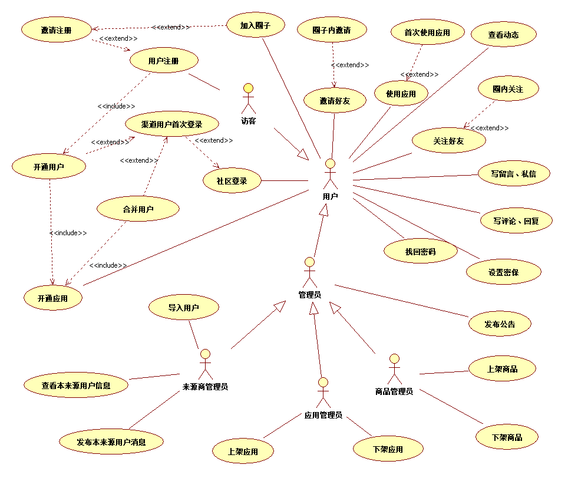
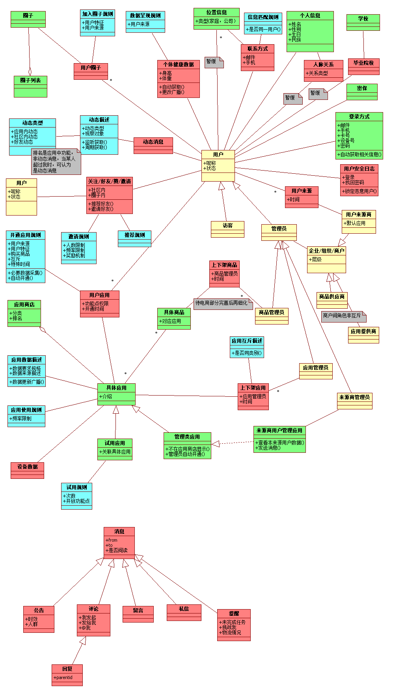

> 2014-09-20

项目说明
========
人人健康社区的基础部分相关系统分析，因为是一个互联网社区类项目，不存在业务方面的建模（即涉众、组织与流程方面的分析，商城部分将会有），故从以下几个方面来进行相关分析与设计（目前不包括商城部分与具体应用的部分）

## 参考资料
- [社区页面原型](http://www.susns.net/renjk/)
- [UBI项目原型(IOS)](http://jkb.yyywb.com/app.html)
- [现有健行社区](http://sport.renjk.com/)
- [uml文档](../../data/ren_health.uml)（由staruml绘制）

场景概述
=========
这部分主要根据上述的几个GUI原型，推导出来的几个主要场景，随着需求的变更、原型的改进，有可能加入新的应用场景
> 由于大家都有一些开发经验，一些场景的描述将不会特别详细，或一些场景只在用例图体现，却没有描述。
>
> 此时交互流程并未确定下来，日前只是站在用户视角描述的应用场景，如何从用户视角切换到系统视角，就是我们要做的

## 主要场景

### 用户注册
__流程__

1. 用户输入必要的信息（？）进行注册
2. 系统根据信息进行验证，通过后保存该用户信息
    - 验证不通过，提示用户核实信息后再提交，回到 （流程1）
3. [扩展]如果用户是被邀请注册的（url或填写邀请码），执行 《邀请注册》 的用例
4. 执行 《开通用户》 的用例，提示用户注册完成

__规则__

- 用户信息的验证规则：呢称格式，邮箱格式，密码强度要求，邮箱未被注册，手机未被注册

### 邀请注册
__流程__

1. 系统验证邀请注册的有效性，如有效，系统记录该次邀请，并更新邀请人所关注的动态
    - 如无效，不影响被邀请人的注册
2. [扩展]如果邀请人是在圈子内邀请注册的，被邀请人将执行《加入圈子》用例

__规则__

- 邀请注册的有效性：邀请人所拥有邀请名额的限制（社区内邀请名额、圈子内邀请名额）

### 导入用户(来源商)
__流程__

1. 来源商管理员依据系统的要求，单一或批量导入用户数据至系统中
2. 系统检查是否符合相关格式要求，记录这些用户数据，并标识这些用户的来源
    - 不符合时，返回（流程1）

__规则__

- 用户数据格式要求：姓名，性别，手机号... 会员级别
- 同来源商导入的用户必须是唯一的

### 社区登录
__流程__

1. 用户根据登录方式要求，输入必要信息，进行登录
2. 系统验证信息的有效性，成功后，进入个人主页
    - 无效登录信息时，记录失败次数，返回（流程1）
        - 超过N次后，必须等待M时间，系统再做响应
3. [扩展]系统判断，如果用户是渠道用户，并且是首次登录，则进入 《渠道用户首次登录》 用例

__规则__

- 登录方式要求
- N，M的设置

### 渠道用户首次登录
__流程__

1. 系统对该用户的相关信息，与系统中现有用户的信息进行比对
    - 如果信息比对不匹配，直接进入《开通用户》 用例，执行完成后，进入个人主页
    - 如果存在匹配手机号或邮箱，系统向匹配的手机或邮箱发送验证码，并提示用户进行验证
        - 用户验证成功后，系统提示，在系统内找到另一用户，将合并成一个用户，执行《合并用户》用例
        - 验证不成功（以后也没有机会再合并用户[后台支持合并？]），直接进入《开通用户》 用例，执行完成后，进入个人主页

__规则__

- 同人比对规则：姓名、手机、邮箱？对比几项？

### 开通用户
__流程__

1. 系统将用户状态置为开通，根据相关规则，为用户开通相应的应用，进入 《开通应用》 的用例
2. 根据相关规则，为用户加入相关的圈子，执行《加入圈子》用例

__规则__

- 可开通应用的依据：来源商对应用的分配设置
- 可加入圈子的依据：渠道用户
- 开通权限由管理员来分配（？）

### 合并用户
__流程__

1. 系统找到被合并的用户，将新用户（渠道用户）的来源，新增一条到被合并的用户来源，将新用户状态置为跳转状态，refid指向被合并用户，将新用户可开通的相应应用，开通给被合并的用户，执行《开通应用》 的用例

__规则__

- 可开通应用配置依据：渠道用户

__讨论__

- 用户已具有该默认应用，且存在有效期限？
    - 建议不使用有效期，当需要时，做个各个应用中，而不是基础机制中
- 新默认应用与用户已拥有应用互斥时？

### 开通应用
__流程__

1. 系统判断用户是否具有开通本应用资格，并根据配置说明，给用户分配该应用的相关权限，记录开通时间，广播消息
    - 违反资格时，系统记录，考虑补偿流程？

__规则__

- 应用开通资格：开通时间、用户特征、应用互斥...
- 应用权限配置

### 使用应用
__流程__

1. 用户打开某个应用，验证当前是否可以使用，能使用时，进入应用
    - 不能使用时，提示用户原因
2. [扩展]如果是首次使用该应用，根据应用要求的数据采集，提示用户输入必要数据，直到成功收集到，进入应用
3. 使用应用后，广播消息

__规则__

- 应用使用限制：时间、频率
- 应用要收集的数据描述

### 邀请好友
__流程__

1. 用户邀请好友注册，系统生成带有邀请人标识的链接，或邀请码，供用户通过分享、短信等方式传播
2. [扩展]如果用户是在某圈子邀请的，则还将圈子的标识给加上

__规则__

- 邀请的人数限制

### 加入圈子
__流程__

1. 系统为验证圈子对用户的限制，如通过，记录用户加入时间，并作为消息广播
    - 不成功，提示用户原因

__规则__

- 限制：时间、用户来源、用户特征

### 其它场景

## 需要验证的
- UBI项目是否能适用
    - 互联网社区直接使用本社区

- 瑞斯坦、眼健康等项目是否适用
- 365现有用户能否正确迁移
- 补给站用户能否正确迁移
- 补给站商户转化为用户来源商（登录者为本来源商管理员）
- 用户具有多来源时（同时是两个或以上渠道发展的用户）
- 访客这个角色可以执行的用例是什么？

领域类图
=========
使用四色来标识不同的类图，红色为过程化数据，跟时间维度相关，蓝色代表规则与配置，黄色代表角色，绿色代表具体的人、地点、物等

本图只概念设计的一部分，更多的关注的是类型之间的关系，而不是具体类的属性与行为

关键设计
========
## 广播监听机制
适用于好友动态(关注、开通应用、领取任务、发表话题)、应用动态、消息发布、私信

设计要求：

- 广播消息的格式定义：事件发生源、事件参数
- 事件的注册与管理（比如健康数据更新事件）
- 激发事件的动作设计为非主动激发
- 监听程序的注册与管理（程序可单独编写，放到指定文件夹下即可）
- 监听程序执行情况反馈，监听程序出错不影响消息的传播
- 避免消息传播死循环

> 除监听程序必须放到指定文件夹下，其他部分，应做成数据表的配置

## 权限设计
### RBAC的方式

- DB存储
    -  `资源`的注册，可与层级`模块`关联，以方便菜单的制作
    -  `角色`与`资源`针对`操作`关联，默认可选操作是 `CRUD`（C:new,create;R:index,show;U:edit,update;D:destory），可结合业务需要增加`操作`（比如禁用掉update，分解成各种业务操作，以防止update权力过大，可以做其他操作能做的事，而绕过权限管理），该关联即 __授权行为__ 的产生
    -  `用户`与`角色`关联，两者是多对多关系

- 程序行为
    - `用户`主界面的菜单生成：由`用户`关联其所有`角色`，合并`角色`所有`资源`的`index`，再对照层级`模块`，生成菜单
    - 某`资源`index界面呈现：
        - 根据当前`用户`的属性对`数据`进行`where`的筛选（如用户所处的组织机构），
        - 每项`数据`能否进行的`操作`的显示，如`can edit this data, then render editlink`（该部分的验证依据的数据应做缓存）
    - 某项`资源/数据`具体`操作`验证：根据当前`用户`，或其所有`角色`中，是否存在能对本`资源/数据`进行`操作`。分两种情况：
        - `资源`，如某`角色`能否`create` `新闻`，定位到`资源`即可（相对容易描述，可以数据库配置）
        - `数据`，如某`用户`能否`update`自己三天前创建的且未发布的`新闻`，需定位到具体`数据`(比较难描述，即使能入配置，程序也不方便解析)

### 变体1
- `角色`与`资源`的关联，但不存在`操作`，把所谓的`资源`进行`操作`的拆分，类似形成`资源浏览`、`资源创建`、`资源编辑`等项，而每一项针对一个界面。在验证时，只需确认当前`用户`的`角色`中是否与当前界面有关联即可。缺点是index界面中每项数据的可操作显示的控制比较麻烦，存在硬编码。

### 变体2
- 根据用户的属性对数据进行过滤，存在硬编码，最好的方式是将此规则放到数据库配置中，如`res.createby in user.groups`，但要求对该配置进行语义分析，最好是支持元编程的语言比较合适。

- 退而求其次，一般情况下，`数据`的过滤，基本上与其产生来源有关，每项`数据`需要标识其创造者，过滤时，依据`用户`与创建者关系来决定是否可访问，即产生新的一个实体:`访问组`，`用户`与`访问组`存在双重关系（不是`角色`与`访问组`）：
    - 一个`用户`对应多个`访问组`，通过该表，可以控制`用户`可访问的`数据`
    - 一个`用户`对应一个固定特殊`访问组`，称为`创建组`，用来标识`数据`的产生来源

- `访问组`本身可以有层次关系（与组织机构有重合的部分，但不完全是）；也可以虚拟出`访问组`，以符合特殊的过滤要求

> 参考Rails中[cancan](https://github.com/ryanb/cancan‎)，再结合Ruby的元编程的方便性，配置起来会比较方便

## 规则描述
领域类中具有许多规则描述的类，必须被单独标识，而不是作为某个类中的某个方法的片断

设计要求：

- 规则描述是单独表示的
- 规则是可增加与修改的
- 规则基本上描述的是谓词演算
- 规则具有优先级
- 规则可以组合使用

### 应用开通规则
### 应用互斥规则

## 计划任务
适用于：

- 业务功能可以被定时的调用
- 长时间或影响性能的任务，但实时性要求不强的

设计要求：

- 可视化的计划任务管理
- 任务执行情况的反馈，必要时的补偿流程

## 缓存设计
- 缓存的API设计
- 缓存的更新策略
- 缓存命中率统计
- 可视化缓存中数据管理

## 外部接口
- 第三方登录OAuth2.0
- 使用第三方服务
    - 做好访问日志，记录访问时间，参数，返回值
    - 设计好服务接口，使第三方服务方便被替换

实现层建议
=========

## mongodb的使用
### 缓存要求
依据mongodb来实现述缓存设计

### 过程化数据
- 设备数据采集
- 评论\动态\消息
- 日志部分

## 标准化
- url设计
- @的机制
- 标准表情

## 其它
常用数据表 省份、民族 移植

    - 保险购买流程？
    - 商品信息来源、维护？
    - 商品订单流程的执行？

