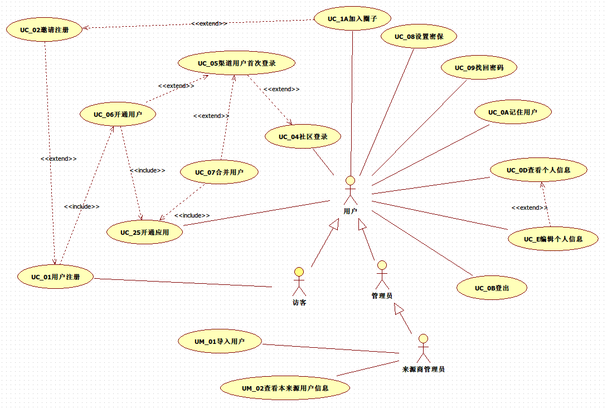
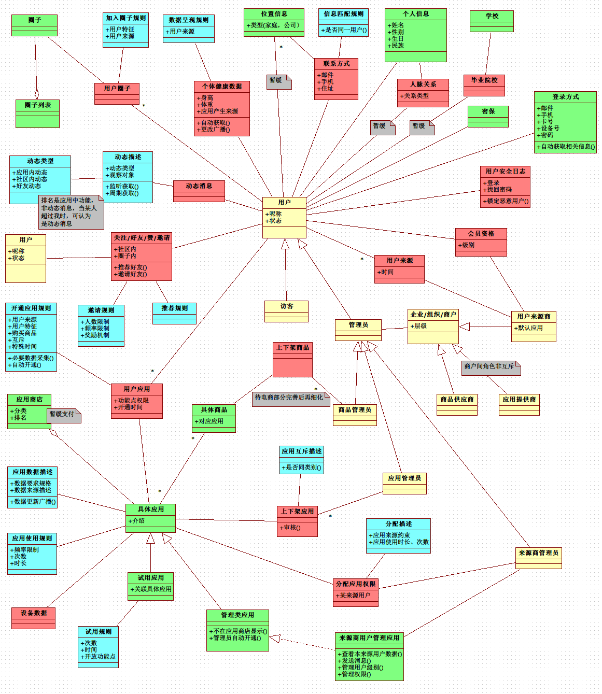
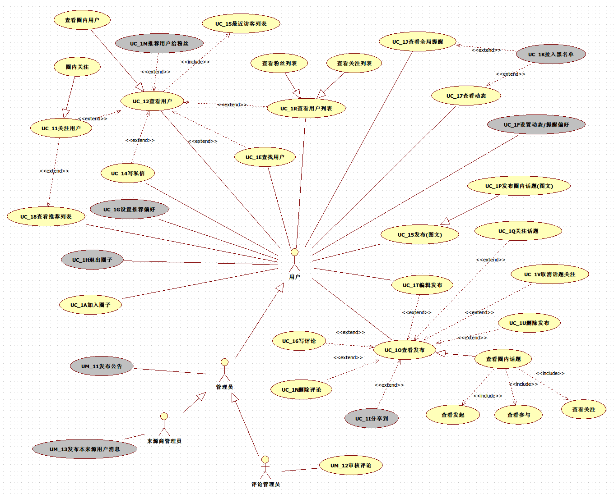
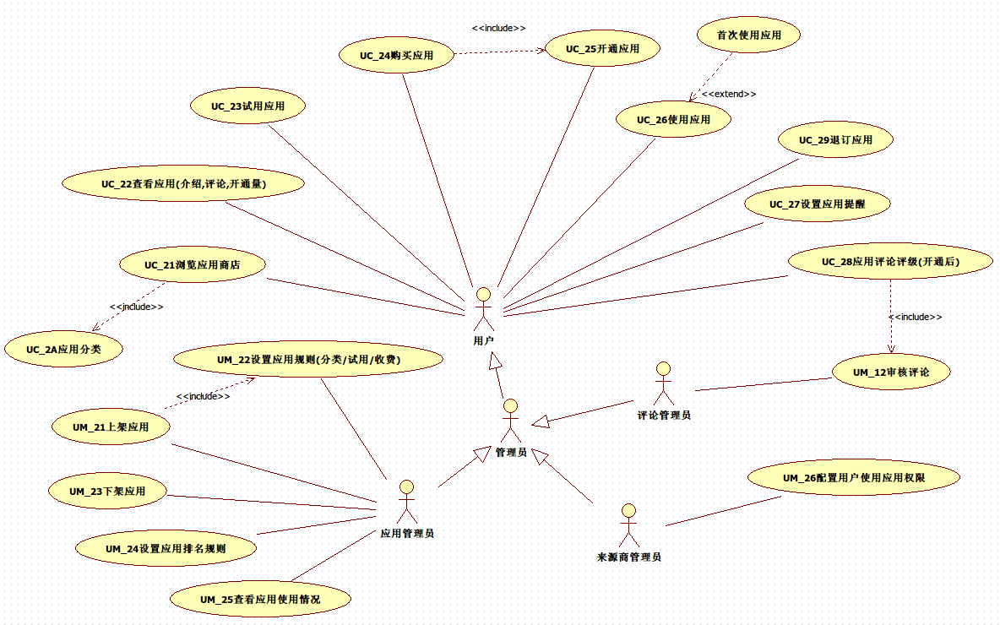
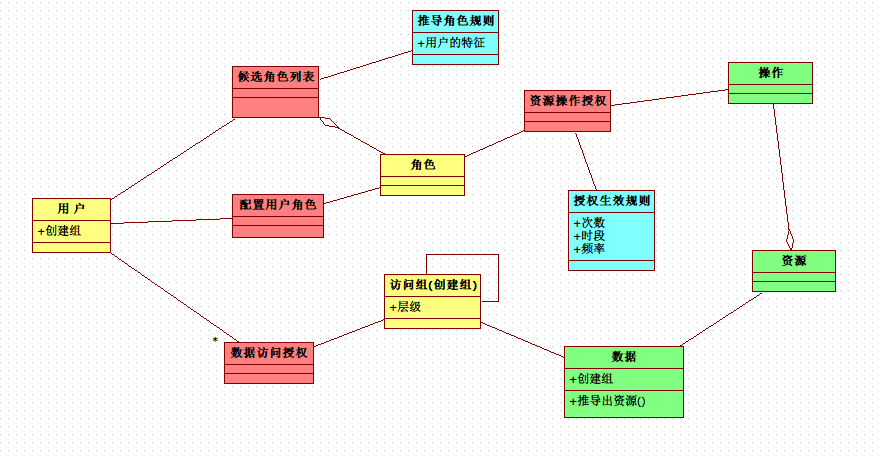

> 2014-09-20

项目说明
========
人人健康社区的基础部分相关系统分析，因为是一个互联网社区类项目，不存在复杂的业务方面的建模（即涉众、组织与流程方面的分析，商城部分将会有），故从以下几个方面来进行相关分析与设计

项目范围(第一阶段)
==================
社区本阶段开发包含的子系统有：

- __用户相关__（注册、登录）；
- __社交__（圈子、评论）；
- __应用商店__（上架、开通、配置）；
- __典型应用__（？）

包括的系统级机制有：

- __全局的提醒机制__（支持提醒中操作）
- __权限管理机制__

目前 __不__ 包括商城部分与其它具体应用的部分

## 参考资料
- [社区页面原型](http://www.susns.net/renjk/)
- [UBI项目原型(IOS)](http://jkb.yyywb.com/app.html)
- [现有健行社区](http://sport.renjk.com/)
- [uml文档](../../data/ren_health.uml)（由staruml绘制）

## 全局用例图

## 全局领域模型

## 需要验证的
- UBI项目是否能适用
    - 互联网社区直接使用本社区
    - 保险购买流程？
    - 商品信息来源、维护？
    - 商品订单流程的执行？
- 瑞斯坦、眼健康等项目是否适用
- 365现有用户能否正确迁移
- 补给站用户能否正确迁移
- 补给站商户转化为用户来源商（登录者为本来源商管理员）
- 用户具有多来源时（同时是两个或以上渠道发展的用户）
- 访客这个角色可以执行的用例是什么？

子系统：用户相关
===============
## 场景概述
描述站在用户视角描述的应用场景，如何从用户视角切换到系统视角，就是我们要做的

### UC_01用户注册
__流程__

1. 用户输入必要的信息（？）进行注册
2. 系统根据信息进行验证，通过后保存该用户信息，设置用户为新注册未激活状态
    - 验证不通过，提示用户核实信息后再提交，回到 （流程1）
3. 系统给用户发送激活码（手机或邮件），用户提交相应激活码，系统进行验证有效与时效，通过后设置用户状态为激活状态
    - 验证无效，如果当前session存在，可重发激活码
        - session不存在，提示激活失败，不予处理
4. [扩展]如果用户是被邀请注册的（url或填写邀请码），执行 《邀请注册》 的用例
5. 执行 《开通用户》 的用例，提示用户注册完成

__规则__

- 用户信息的验证规则：呢称格式（唯一，不支持空格），邮箱格式，密码强度要求，邮箱未被有效用户注册，手机未被有效用户注册
- 系统保留部分呢称不被注册

__页面流转__

### UC_0H邀请好友

__流程__

1. 用户邀请好友注册，系统生成带有邀请人标识的链接，或邀请码，供用户通过分享、短信等方式传播
2. [特化]如果用户是在某圈子邀请的，则还将圈子的标识给加上

__规则__

- 邀请的人数限制

### UC_02邀请注册
__流程__

1. 系统验证邀请注册的有效性，如有效，系统记录该次邀请，并更新邀请人所关注的动态
    - 如无效，不影响被邀请人的注册
2. [特化]如果邀请人是在圈子内邀请注册的，被邀请人将执行《加入圈子》用例

__规则__

- 邀请注册的有效性：邀请人所拥有邀请名额的限制（社区内邀请名额、圈子内邀请名额）

### UM_01导入用户(来源商)
__流程__

1. 来源商管理员依据系统的要求，单一或批量导入用户数据至系统中
2. 系统检查是否符合相关格式要求，记录这些用户数据，并标识这些用户的来源
    - 不符合时，返回（流程1）

__规则__

- 用户数据格式要求：姓名，性别，手机号... 会员级别
- 先行同来源商导入的用户必须是唯一的

### UC_04社区登录
__流程__

1. 用户根据登录方式要求，输入必要信息，进行登录
2. 系统验证信息的有效性，成功后，进入个人主页
    - 无效登录信息时，记录失败次数，返回（流程1）
        - 超过N次后，必须等待M时间，系统再做响应
3. [扩展]系统判断，如果用户是渠道用户，并且是首次登录，则进入 《渠道用户首次登录》 用例

__规则__

- 登录方式要求
- N，M的设置

### UC_05渠道用户首次登录
__流程__

1. 系统对该用户的相关信息，与系统中现有用户的信息进行比对
    - 如果信息比对不匹配，直接进入《开通用户》 用例，执行完成后，进入个人主页
    - 如果存在匹配手机号或邮箱，系统向匹配的手机或邮箱发送验证码，并提示用户进行验证
        - 用户验证成功后，系统提示，在系统内找到另一用户，将合并成一个用户，执行《合并用户》用例
        - 验证不成功（以后也没有机会再合并用户[后台支持合并？]），直接进入《开通用户》 用例，执行完成后，进入个人主页

__规则__

- 同人比对规则：姓名、手机、邮箱？对比几项？

### UC_06开通用户
__流程__

1. 系统将用户状态置为开通，根据相关规则，为用户开通相应的应用，进入 《开通应用》 的用例
2. 根据相关规则，为用户加入相关的圈子，执行《加入圈子》用例

__规则__

- 可开通应用的依据：来源商对应用的分配设置
- 可加入圈子的依据：渠道用户
- 开通权限由管理员来分配（？）

### UC_07合并用户
__流程__

1. 系统找到被合并的用户，将新用户（渠道用户）的来源，新增一条到被合并的用户来源，将新用户状态置为跳转状态，refid指向被合并用户，将新用户可开通的相应应用，开通给被合并的用户，执行《开通应用》 的用例

__规则__

- 可开通应用配置依据：渠道用户

__讨论__

- 用户已具有该默认应用，且存在有效期限？
    - 建议不使用有效期，当需要时，做个各个应用中，而不是基础机制中
- 新默认应用与用户已拥有应用互斥时？

### UC_0D查看个人信息

### UC_0E编辑个人信息
### UC_08设置密保
### UC_0F修改密码
### UC_09找回密码

### UC_0A记住用户

### UC_0B登出
### UC_0G站内搜索(全局)

### UM_01查看本来源用户信息(来源商)

<!-- 0H -->
## 领域模型
使用四色来标识不同的类图，红色为过程化数据，跟时间维度相关，可用于踊跃，蓝色代表规则与配置，黄色代表角色（一个人可在不同角色间切换），绿色代表具体的人、地点、物等

本图只概念设计的一部分，更多的关注的是类型之间的关系，而不是具体类的属性与行为

子系统：社交
===============
## 场景概述
灰色部分表示优先级低

### UC_1E查找用户
__用户价值__

方便快捷查找自己感兴趣的用户

__流程__

1. 用户在指定页面（区域），输入关键字，进行用户查找，系统根据关键字，对系统中未屏蔽搜索的用户的呢称\姓名\性别\地区\年龄\兴趣等进行搜索，并返回用户搜索结果（指定条数）
2. [扩展]用户可直接选择某项结果，执行《查看用户》或加《关注用户》动作

__规则__

- 屏蔽规则同《关注用户》
- 搜索项的确定
- 搜索结果的呈现（头像+呢称??）

### UC_12查看用户
__用户价值__

增加对用户的详细了解

__流程__

1. 进入该页面，系统显示该用户的[关注/粉丝]数量，并显示该用户公开的个人资料，最近的动态（发布的图文，评论等），最近的访客
    - 该用户为恶意用户（非法用户），系统予以提示
    - 该用户与查看用户为已关注时，系统显示可取消关注的操作
        - 否则，系统显示可关注的操作
2. 系统记录该访客的到访行为
3. [扩展]见图

__规则__

- 用户公开的个人资料设置

### UC_11关注用户
__用户价值__

动态（被动）得到自己的感兴趣的用户的动态(言行)

__流程__

1. 用户A关注了用户B，系统记录用户间的关注关系，并通知用户B（提醒）：你被用户A关注了
    - 用户B设置了屏蔽，不能被关注，用户A得到系统的提醒
2. [特化]圈内关注

__规则__

- 屏蔽规则(包含黑名单)
- 社区内关注应包含圈内关注
- 关注行为可在许多场景被使用

### UC_1R查看用户列表
__用户价值__

查看我关注的，和我的粉丝，找到存在感

__流程__

1. 系统显示用户的相关信息(呢称、头像)，如该用户有动态发生，应明显呈现
2. [特化]查看粉丝列表
3. [特化]查看关注列表

### UC_1K拉入黑名单
__用户价值__

防止恶意的用户的骚扰

__流程__

1. 系统将恶意用户存储到该用户的黑名单中

### UC_14写私信
__用户价值__

方便私底下的沟通

__流程__

1. 用户在私信页面输入内容，系统审核字数，存入系统，并提醒被私信者
    - 发私信用户在被私信者的黑名单内，私信不予发送
    - 超过发送私信次数，私信不予发送

__规则__

- 私信字数限制
- 每天私信次数设置

### UC_15发布图文
__用户价值__

宣传某种事与物、找到存在感、满足分享欲

__流程__

1. 用户在发布页面写图文（文字、图片、视频）并选择发布的可见范围，系统存储该图文
2. [包含]系统执行《审核评论》通过后，更新动态
    - 用户在发布后，不管通过与否，系统都显示给当前用户
3. [特化]圈内发布话题(图文)

__规则__

- 发布的可见范围（仅自己可见、粉丝可见、大家可见）
- 圈内发布只圈内可见，并不能分享
- 支持图片、视频、链接、#话题# （存储成纯文本，参考tower编辑器）

### UC_1O查看发布
__用户价值__

浏览感兴趣的发布，尝试去编辑自己的发布，查看有意思的评论，删除不合适的评论

__流程__

1. 用户浏览首页所有相关的发布（所有关注者的或由自己发起的、自己关注的），系统显示该发布的缩略图，概要，时间，发布人，评论数等，
2. 用户选择进入具体的文章，系统呈现具体的图文信息，并附加所有评论
    - [扩展]如果图文是自己发布的，显示可编辑按钮，用户选择后，进入《编辑发布》
    - [扩展]如果图文是自己发布的，显示可删除按钮，用户选择后，进入《删除发布》
    - [扩展]如果评论是自己发布的，显示可删除按钮，用户选择后，进入《删除评论》
3. [扩展]用户可针对该发布进行评论，点击评论，执行《写评论》
4. [扩展]用户可针对某些评论再进行评论，点击评论，执行《写评论》
5. [特化]查看圈内话题
    - [扩展]如果用户未关注，可执行《关注话题》，系统记录关注行为
    - [扩展]如果已关注，可执行《取消关注话题》，系统记录取消关注行为

__规则__

- 显示发布/评论的手机型号、地点
- 友好的时间显示[1分钟前]
- 评论层级只有一层，@呢称，代表对他的评论的回复
- 评论从上往下，不存在分页，超过某长度时，显示加载更多

### UC_1I分享到
__用户价值__

满足分享欲

__规则__

- 直接使用第三方分享组件

### UC_1Q关注话题

__用户价值__

保持对某话题的持续关注，不要错过最新的评论

__流程__

1. 用户点击关注，如果符合关注条件，则系统记录用户对话题关注的行为

__规则__

- 过份久远的话题，不予以关注

### UC_1V取消关注话题

### UC_16写评论

__流程__

1. [分支]用户针对发布的图文进行评论，在评论栏内输入评论内容并提交，系统存储该评论
2. [分支]用户针对某条评论进行再评论时，选择@评论人，在评论栏内输入评论内容并提交，系统存储该评论
3. [包含]系统执行《审核评论》通过后，更新动态
    - 用户在发布后，不管通过与否，系统都显示给当前用户

__规则__

- 评论泛指针对图文、话题进行的评论或回复
- 支持 @呢称 标准表情

### UC_1T编辑发布

__流程__

1. 用户在编辑页面修改图文，并选择发布的可见范围，系统存储该图文
2. [包含]系统执行《审核评论》通过后，更新动态
    - 用户在修改提交后，不管通过与否，系统都显示给当前用户
3. [特化]圈内话题编辑

### UC_1U删除发布
__规则__

- 逻辑删除

### UC_1N删除评论
__规则__

- 逻辑删除

### UC_17查看动态
__用户价值__

保持对关注者的持续关注，不要错过有趣的事情

__流程__

1. 用户进入动态（页面、区域），系统显示用户被关注者的最新的一些未被屏蔽的行为

__规则__

- 被关注者的什么行为被动态显示？（发布图文、评论、做应用）
- 被关注者屏蔽设置

### UC_1F设置动态/提醒偏好
__用户价值__

聚焦自己所关注的人事物

__规则__

- 过虑查看动态的条件

### UC_18查看推荐列表
__用户价值__

帮助用户找到有可能感兴趣的用户

__规则__

- 根据用户的特征匹配
- 根据用户查找其他用户时的搜索条件
- 根据用户已有关注者的情况
- 根据用户对文章的、对应用的兴趣

### UC_1G设置推荐偏好
__用户价值__

用户自己设置一些偏好，方便系统推荐时予以考虑

__规则__

- 偏好的类型定义

### UC_1J查看全局提醒
__用户价值__

帮助用户去完成某些需要他主动参与的事情

__流程__

1. 系统如果有新的提醒，增加提醒的计数，在社区的上方，以醒目的方式给用户显示
2. 用户点击提醒按钮，进入提醒的列表
3. 提醒列表根据提醒的类型不同，会有不同的操作方式
4. 用户对提醒进行了操作，提醒计数减1

__规则__

- 提醒有:被关注、被私信、邀请成功、任务、挑战、被@
- 不同提醒类型对应的操作方式的确定[程序可扩展性设计]

### UC_1A加入圈子
__流程__

1. 系统为验证圈子对用户的限制，如通过，记录用户加入时间，并更新动态，更新提醒
    - 不成功，提示用户原因

__规则__

- 限制：时间、用户来源、用户特征

### UC_1H退出圈子

__规则__

- 限制：某些圈子不能退出
- 退出后，关注处理？话题处理？

### UC_1M推荐用户给粉丝

### UM_11发布公告(管理员)
### UM_12审核评论(评论管理员)
### UM_13发布本来源用户消息(来源商)

子系统：应用商店
================
## 场景概述

### UC_21浏览应用商店
### UC_2A应用分类

### UC_22查看应用
### UC_23试用应用
### UC_24购买应用

### UC_25开通应用
__流程__

1. 系统判断用户是否具有开通本应用资格，并根据配置说明，给用户分配该应用的相关权限，记录开通时间，广播消息
    - 违反资格时，系统记录，考虑补偿流程？

__规则__

- 应用开通资格：开通时间、用户特征、应用互斥...
- 应用权限配置

### UC_26使用应用
__流程__

1. 用户打开某个应用，验证当前是否可以使用，能使用时，进入应用
    - 不能使用时，提示用户原因
2. [扩展]如果是首次使用该应用，根据应用要求的数据采集，提示用户输入必要数据，直到成功收集到，进入应用
3. 使用应用后，广播消息

__规则__

- 应用使用限制：时间、频率
- 应用要收集的数据描述

### UC_27设置应用提醒
### UC_28应用评论评级
### UC_29退订应用

### UM_21上架应用

### UM_22设置应用规则
### UM_23下架应用
### UM_24设置排名规则
### UM_25查看应用使用情况
### UM_26配置用户应用权限

<!-- 2A -->

系统机制
========
## 全局提醒机制
适用于任务、@我、私信、留言、挑战、物流等场景

- 全局配置
- 个人设置

## 动态广播机制
适用于好友动态(关注、开通应用、领取任务、发表话题)、应用动态

<!--
设计要求：

- 广播消息的格式定义：事件发生源、事件参数
- 事件的注册与管理（比如健康数据更新事件）
- 激发事件的动作设计为非主动激发
- 监听程序的注册与管理（程序可单独编写，放到指定文件夹下即可）
- 监听程序执行情况反馈，监听程序出错不影响消息的传播
- 避免消息传播死循环

> 除监听程序必须放到指定文件夹下，其他部分，应做成数据表的配置 -->

## 权限设计
### RBAC的方式

[参考](http://chinapub.duapp.com/gen_md?src=https%3A%2F%2Fraw.github.com%2Fzyxstar%2Fmd_note%2Fmaster%2Fdocs%2FSkill%2FDataBase.md#TOC6)

## 规则描述
领域类中具有许多规则描述的类，必须被单独标识，而不是作为某个类中的某个方法的片断

<!-- 设计要求：

- 规则描述是单独表示的
- 规则是可增加与修改的
- 规则基本上描述的是谓词演算
- 规则具有优先级
- 规则可以组合使用 -->

### 应用开通规则
### 应用互斥规则

## 计划任务
适用于：

- 业务功能可以被定时的调用
- 长时间或影响性能的任务，但实时性要求不强的

设计要求：

- 可视化的计划任务管理
- 任务执行情况的反馈，必要时的补偿流程

## 缓存设计
- 缓存的API设计
- 缓存的更新策略
- 缓存命中率统计
- 可视化缓存中数据管理

tower学习

## 外部接口
- 第三方登录OAuth2.0
- 使用第三方服务
    - 做好访问日志，记录访问时间，参数，返回值
    - 设计好服务接口，使第三方服务方便被替换

实现层建议
=========

## mongodb的使用
### 缓存要求
依据mongodb来实现述缓存设计

### 过程化数据
- 设备数据采集
- 评论\动态\消息
- 日志部分

## 标准化
- @用户、#话题 相关设计
- 标准表情

## 其它
常用数据表 省份、民族 移植

<!--
需求方面明确
    用例文档
    页面流转
    可构建类与方法？
    与UI设计人员同步？？

开发方面估算要素
    数据表设计
    页面开发
    单元测试
    BUG修复

难点、可行性分析
    单独作为任务，完成时间为一天，然后给出建议

不进入估算
    环境搭建
    项目构建

任务描述
    以用户视角来描述的功能点，可单独交付

看板
    未分解，总todos，个人todos，进行中，完成

规则
    刺激反应 STT
    契约式
    结构关联
http://114.242.131.210/

 -->
