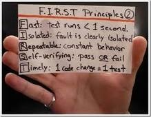

> 2010-07-26

定义
=======

- 针对程序员的，由程序员完成，也由程序员受益
- 编写程序时，更多的 __单元测试__，意味着将来不会为莫明其妙的BUG进行 __调试__
- 单元测试是开发者编写一小段代码，用于检测被测代码的一个很小的、很明确的功能是否正确， 即一个单元测试用于判断某个特定条件下某个特定函数的行为

## 我们需要做什么

- 它的行为和我的期望一致吗
- 它的行为在 __特殊情况下__ 和我的期望一致吗
    - 参数可疑
    - 硬盘没有剩余空间
    - 网络掉线
    - __用于决定异常的抛出__

- 根测试驱动开发相结合，如果测试不支持某个用例，说明功能并不完备，所以它是一份好的执行文档

## 如何进行单元测试
- 程序员编写方法签名
- 测试员编写方法的测试用例，估计可能的异常，准备正常数据与异常数据
- 程序员完成方法的编码
- 测试员进行测试
- 测试员与程序员沟通

测试框架
==========

- 各种断言
- `[Suite]`返回TestFixture集合,用于构建无人的自动化
- `[Category]`
- 每个方法 `[SetUp][TearDown]`
- 每个类 `[TestFixtureSetUp][TestFixtureDown]`
- `[ExpectedException(typeof(...)]`希望该被测试方法能够引发异常
- 暂时忽略，将来不忽略`[Ignore("...")]`

测试内容
==========

## 结果是否正确
- 使用测试的数据文件，同时包含预期结果

## 边界条件是否正确
来自于职业的敏感，如：

- 完全仿造或者不一致的输入数据
- 格式错误的数据
- 空值或不完整的值
- 超出合理范围的值，类似数据库条件约束
- 顺序的影响

### CORRECT原则

- __Conformance__ 是否符合预期格式
- __Ordering__ 一组值是有序的还是无序的
- __Range__ 合理的最大值与最小值之间
    - 开始索引和结束索引
    - 索引值是负的
    - 索引值大于允许值
    - Count不能匹配确切的索引个数
- __Reference__ 代码是否引用了不受代码本身直接控制的外部因素
    - 前条件：
        - 系统必须处于什么状态下，该方法才能运行
        - 前提不能满足时，程序的行为仍然是正确的（如没的权限不能阅读的行为发生，特定情况下是忽略请求）
    - 后条件：执行后相关方法，会保证哪些状态发生
- __Existence__　非null，非0，存在于某个集合中
- __Cardinality__ 是否恰好有足够的值 0-1-N
- __Time__ 所有事情是否都按顺序发生，是否在正确的时间，是否及时
    - 相对时间
    - 绝对时间
    - 并发问题

## 查一下反向关联
- 例如插入数据库一条记录，使用查找来验证是否真的插入了
- 同时最好反向关联的原理是不一样的，确保不会被同时出现的错误所掩盖

## 用其他手段交叉检查一下结果
- 一种算法可能因为性能原因被采用，测试它时可用 __性能不佳但正确的算法__ 来验证新算法

##  强制错误条件发生
- Mock对象强制产生
- 内存耗光
- 磁盘用满
- 时钟出问题
- 网络不可用
- 系统过载
- 受限的调色板
- 分辨率过高或过低

##  是否满足性能要求
- `Assert.IsTure(timer.ElapsedTime<3.0)`

Mock对象
=========
利用断言可以 __*验证对象的状态*__，而 __*感知对象的行为*__ 需要Mock来预期

## 应用场景
- 真实对象具有不可确定的行为，股票行情
- 真实对象难以被创建
- 真实对象的某些行为很难被触发，网络错误
- 真实对象令程序运行很慢
- 真实对象有用户界面
- 测试需要询问真实对象如何被调用的，如回调函数
- 真实对象实际上并不存在

## 创建步骤
- __接口__来描述这个对象(提出依赖要求，针对接口编程)
- 产品代码实现个接口
- 以测试为目的，在mock对象中实现这个接口

评价测试
=========
- 自动化
    - 调用测试自动化
    - 检查结果自动化
- 彻底的
    - 代码覆盖率
- 可重复
- 独立的
- 专业的
    - 开发上的框架
    - 管理上的流程，如不能进入下轮流程的代码：
        - 不完整的代码，对其他文件的依赖
        - 不能编译的代码
        - 没有相应单元测试的代码
        - 不能通过单元测试的代码
        - 通过了自己的测试，但引起其他测试失败

测试的频率
===========
- 编写新的函数
- 修正BUG后
- 每次成功编译后
- 每次对版本控制的签入
- 定期的构建NAnt

对编程能力的提高
================

## 设计
- 面向测试的设计，更好的分离关注点
- 为了更好的测试，进行重构
- 测试类的不变性
    - 结构化
    - 数学不变性
    - 数据一致性
- 测试驱动设计，改善接口的设计
- 无效参数的测试，得看是谁负责检查输入数据的有效性，不可信任域与可信任域

## 经验
- 测试耗费的时间太多了，意味着将运行时间长的测试分离出来
- 测试总是失败？意味着程序的耦合度过深
- 单测能提供代码的快速反馈，小步前进，马上知道程序运行效果
- 接口测试的脚本可作为安全网，当接口实现修改时，能确保对接口以前客户代码没有影响
- dubug的行为无法记录，但测试的脚本确能重放
- 对于动态语言，没有静态类型的编译，所以没有类型、签名等检查，当需要语义检查（断言，契约）时，单测保证语义正确，而且脚本就相关于文档

敏捷测试培训中有关单测
======================

- 单元测试需要验证的两个方面：状态，行为。当测试一个对象的方法时，需要验证方法的执行是否影响自己的 __状态__，是否会调用依赖对象的 __行为__

- 单元测试的控制点与检查点：
    - __控制点__ 包括直接输入（参数），间接输入（控制被调用函数的返回值）；
    - __检查点__ 包括直接输出（返回值，状态），间接输出（行为）

- 测试替身分类：
    - Dummy Object：主要用于类的构造或方法的调用需要一个符合类型的对象，但对该对象的状态或行为并不关心时；
    - Test Stub：测试对象利用它返回值，让测试对象期望的行为发生；
    - Test Spies：接收测试对象方法的调用，用于行为检查；
    - Mock Objects：即可充当stub，也可充当spy；
    - Fake Objects：生成一个专用的测试类，应用于测试对象依赖类还未实现或过于复杂时

- 在TDD中有一个FIRST原则(同样适用于单元测试的编写)

为什么要求测试运行时间少于1秒？主要为了使对象尽可能的无依赖。

- 通过 __重构__ 的技术来提高可测性，如接口提取，依赖注入

- 提高可测性：
    - __感知__：感知某种方法调用产生的效果或影响（采用mock）；
    - __分离__：与应用的其他部份分离开来单独运行（解耦）

