IP相关
==========
## IP包头
每一行占用32bits

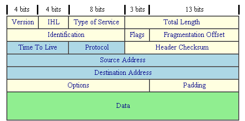

- Version(版本)宣告这个 IP 封包的版本，例如目前惯用的还是 IPv4 这个版本就在这里宣告。
- IHL(Internet Header Length, IP表头的长度)告知这个 IP 封包的表头长度，使用的单位应该是字 (word) ，一个字为 4bytes 大小。
- Type of Service(服务类型)这个项目的内容为『PPPDTRUU』，表示这个 IP 封包的服务类型，主要分为：
    + PPP：表示此 IP 封包的优先度，目前很少使用；
    + D：若为 0 表示一般延迟(delay)，若为 1 表示为低延迟；
    + T：若为 0 表示为一般传输量 (throughput)，若为 1 表示为高传输量；
    + R：若为 0 表示为一般可靠度(reliability)，若为 1 表示高可靠度。
    + UU：保留尚未被使用。
- Total Length(总长度)指这个 IP 封包的总容量，包括表头与内容 (Data) 部分。最大可达 65535 bytes。
- Identification(辨别码)如果 IP 袋子太大的话，就得先要将 IP 再重组成较小的袋子然后再放到 MAC 当中。而当 IP 被重组时，每个来自同一个 IP 的小袋子就得要有个标识符以告知接收端这些小袋子其实是来自同一个 IP 封包才行
- Flags(特殊旗标)这个地方的内容为『0DM』，其意义为：
    + D：若为 0 表示可以分段，若为 1 表示不可分段
    + M：若为 0 表示此 IP 为最后分段，若为 1 表示非最后分段。
- Fragment Offset(分段偏移)表示目前这个 IP 分段在原始的 IP 封包中所占的位置。就有点像是序号啦，有这个序号才能将所有的小 IP 分段组合成为原本的 IP 封包大小嘛！透过 Total Length, Identification, Flags 以及这个 Fragment Offset 就能够将小 IP 分段在收受端组合起来
- Time To Live(TTL, 存活时间)表示这个 IP 封包的存活时间，范围为 0-255。当这个 IP 封包通过一个路由器时， TTL 就会减一，当 TTL 为 0 时，这个封包将会被直接丢弃。
- Protocol Number(协定代码)来自传输层与网络层本身的其他数据都是放置在 IP 封包当中的，我们可以在 IP 表头记载这个 IP 封包内的资料是啥， 在这个字段就是记载每种数据封包的内容
    + 1 ICMP (Internet Control Message Protocol)
    + 2 IGMP (Internet Group Management Protocol)
    + 3 GGP (Gateway-to-Gateway Protocol)
    + 4 IP (IP in IP encapsulation)
    + 6 TCP (Transmission Control Protocol)
    + 8 EGP (Exterior Gateway Protocol)
    + 17 UDP (User Datagram Protocol)
- Header Checksum(表头检查码)用来检查这个 IP 表头的错误检验之用。
- Source Address来源的 IP 地址，IP 是 32 位
- Destination Address目标的 IP 地址
- Options (其他参数)这个是额外的功能，提供包括安全处理机制、路由纪录、时间戳、严格与宽松之来源路由等。
- Padding(补齐项目)由于 Options 的内容不一定有多大，但是我们知道 IP 每个数据都必须要是 32 bits，所以，若 Options 的数据不足 32 bits 时，则由 padding 主动补齐。

## IP地址组成
在同一个网段内，`Net_ID` 是不变的，而 `Host_ID` 则是不可重复，`Host_ID` 在二进制的表示法当中，不可同时为 0 也不可同时为 1 ，因为全为 0 表示整个网段的地址 (Network IP)，而全为 1 则表示为广播的地址 (Broadcast IP）

对于192.168.0.0/8这个网段，192.168.0.0 (`Host_ID` 全部为 0)以及 192.168.0.255 (`Host_ID` 全部为 1) 不可用来作为网段内主机的 IP 设定，也就是说，这个网段内可用来设定主机的 IP 是由 192.168.0.1 到 192.168.0.254

## IP地址分级
```
Class A : 0xxxxxxx.xxxxxxxx.xxxxxxxx.xxxxxxxx  ==> NetI_D 的开头是 0
          |--net--|---------host------------|
Class B : 10xxxxxx.xxxxxxxx.xxxxxxxx.xxxxxxxx  ==> NetI_D 的开头是 10
          |------net-------|------host------|
Class C : 110xxxxx.xxxxxxxx.xxxxxxxx.xxxxxxxx  ==> NetI_D 的开头是 110
          |-----------net-----------|-host--|
Class D : 1110xxxx.xxxxxxxx.xxxxxxxx.xxxxxxxx  ==> NetI_D 的开头是 1110
Class E : 1111xxxx.xxxxxxxx.xxxxxxxx.xxxxxxxx  ==> NetI_D 的开头是 1111

五种分级在十进制的表示：
Class A :   0.xx.xx.xx ~ 127.xx.xx.xx
Class B : 128.xx.xx.xx ~ 191.xx.xx.xx
Class C : 192.xx.xx.xx ~ 223.xx.xx.xx
Class D : 224.xx.xx.xx ~ 239.xx.xx.xx
Class E : 240.xx.xx.xx ~ 255.xx.xx.xx
```

## IP地址种类
- Public IP : 公共 IP ，经由 INTERNIC 所统一规划的 IP，有这种 IP 才可以连上 Internet ；
- Private IP : 私有 IP 或保留 IP，不能直接连上 Internet 的 IP ， 主要用于局域网络内的主机联机规划。

私有 IP 也分别在 A, B, C 三个 Class 当中各保留一段作为私有 IP 网段

```
Class A：10.0.0.0    - 10.255.255.255
Class B：172.16.0.0  - 172.31.255.255
Class C：192.168.0.0 - 192.168.255.255
```

这三段 Class 的 IP 是预留使用的，所以并不能直接作为 Internet 上面的连接之用

- 私有 IP 的路由信息不能对外散播 (只能存在内部网络)；
- 使用私有 IP 作为来源或目的地址的封包，不能透过 Internet 来转送 (不然网络会混乱)；
- 关于私有 IP 的参考纪录(如 DNS)，只能限于内部网络使用 (一样的原理啦)

## Netmask
```
192.168.0.0~192.168.0.255 这个 C Class 的 Netmask 说明
第一个 IP： 11000000.10101000.00000000.00000000
最后一个 ： 11000000.10101000.00000000.11111111
            |----------Net_ID---------|-host--|
Netmask  ： 11111111.11111111.11111111.00000000  <== Netmask 二进制
         ：   255   .  255   .  255   .   0      <== Netmask 十进制
特别注意喔，netmask 也是 32 位，在数值上，位于 Net_ID 的为 1 而 Host_ID 为 0

Class A, B, C 三个等级的 Netmask 表示方式：
Class A : 11111111.00000000.00000000.00000000 ==> 255.  0.  0.  0
Class B : 11111111.11111111.00000000.00000000 ==> 255.255.  0.  0
Class C : 11111111.11111111.11111111.00000000 ==> 255.255.255.  0
```

Class C 的网域号码占了 24 位，而其实我们还可以将这样的网域切的更细，就是让第一个 `Host_ID` 被拿来作为 `Net_ID` ，所以，整个 `Net_ID` 就有 25 bits ，至于 `Host_ID` 则减少为 7 bits 。在这样的情况下，原来的一个 Class C 的网域就可以被切分为两个子域，而每个子域就有『 256/2 - 2 = 126 』个可用的 IP 了！这样一来，就能够将原本的一个网域切为两个较细小的网域，方便分门别类的设计

```
原本的 C Class 的 Net_ID 与 Host_ID 的分别
11000000.10101000.00000000.00000000      Network:   192.168.0.0
11000000.10101000.00000000.11111111      Broadcast: 192.168.0.255
|----------Net_ID---------|-host--|

切成两个子网之后的 Net_ID 与 Host_ID 为何？
11000000.10101000.00000000.0 0000000  多了一个 Net_ID 了, 为 0 (第一个子网)
11000000.10101000.00000000.1 0000000  多了一个 Net_ID 了, 为 1 (第二个子网)
|----------Net_ID-----------|-host--|

第一个子网
Network:   11000000.10101000.00000000.0 0000000   192.168.0.0
Broadcast: 11000000.10101000.00000000.0 1111111   192.168.0.127
           |----------Net_ID-----------|-host-|
Netmask:   11111111.11111111.11111111.1 0000000   255.255.255.128
Network/Netmask
192.168.0.0/255.255.255.128
192.168.0.0/25

第二个子网
Network:   11000000.10101000.00000000.1 0000000   192.168.0.128
Broadcast: 11000000.10101000.00000000.1 1111111   192.168.0.255
           |----------Net_ID-----------|-host-|
Netmask:   11111111.11111111.11111111.1 0000000   255.255.255.128
Network/Netmask
192.168.0.128/255.255.255.128
192.168.0.128/25
```

知道了 Network 以及 Netmask 之后，就可以定义出该网域的所有 IP 了

事实上，由于网络细分的情况太严重，为了担心路由信息过于庞大导致网络效能不佳，因此，某些特殊情况下， 我们反而是将 `Net_ID` 借用来作为 `Host_ID `的情况！这样就能够将多个网域写成一个啦！举例来说，我们将 256 个 Class C 的私有 IP (192.168.0.0~192.168.255.255) 写成一个路由信息的话，那么这个网段的写法就会变成： 192.168.0.0/16，反而将 192 开头的 Class C 变成 class B 的样子了！ 这种 __打破__ 原本 IP 代表等级的方式 (透过 Netmask 的规范) 就被称为无等级网域间路由 (CIDR)

无须理会啥是无等级网域间路由啦！只要知道，那个 Network/Netmask 的写法，通常就是 CIDR 的写法

```shell
route -n
Destination     Gateway         Genmask         Flags Metric Ref  Use Iface
192.168.0.0     0.0.0.0         255.255.255.0   U     0      0      0 eth0
127.0.0.0       0.0.0.0         255.0.0.0       U     0      0      0 lo
0.0.0.0         192.168.0.254   0.0.0.0         UG    0      0      0 eth0

# Destination ：其实就是 Network 的意思；
# Gateway     ：就是该接口的 Gateway 那个 IP 啦！若为 0.0.0.0 表示不需要额外的 IP；
# Genmask     ：就是 Netmask 啦！与 Destination 组合成为一部主机或网域；
# Flags       ：共有多个旗标可以来表示该网域或主机代表的意义：
#               U：代表该路由可用；
#               G：代表该网域需要经由 Gateway 来帮忙转递；
#               H：代表该行路由为一部主机，而非一整个网域；
# Iface       ：就是 Interface (接口) 的意思。
```

Destination 0.0.0.0 表示其它的IP地址需要走网关192.168.0.254

## ARP/RARP
我们的主机会对整个区网发送出 ARP 封包， 对方收到 ARP 封包后就会回传他的 MAC 给我们，我们的主机就会知道对方所在的网卡，那接下来就能够开始传递数据啰。 如果每次要传送都得要重新来一遍这个 ARP 协定那不是很烦？因此，当使用 ARP 协议取得目标 IP 与他网卡卡号后， 就会将该笔记录写入我们主机的 ARP table 中 (内存内的数据) 记录 20 分钟

```shell
arp -n
Address            HWtype  HWaddress           Flags Mask    Iface
192.168.1.100      ether   00:01:03:01:02:03      C          eth0
192.168.1.240      ether   00:01:03:01:DE:0A      C          eth0
192.168.1.254      ether   00:01:03:55:74:AB      C          eth0

arp -[nd] hostname
#-n ：将主机名以 IP 的型态显示
#-d ：将 hostname 的 hardware_address 由 ARP table 当中删除掉
arp -s 192.168.1.100  01:00:2D:23:A1:0E
#-s ：设定某个 IP 或 hostname 的 MAC 到 ARP table 当中(定义静态)
```

## ICMP
ICMP 的全名是『 Internet Control Message Protocol, 因特网讯息控制协议 』。 基本上，ICMP 是一个错误侦测与回报的机制，最大的功能就是可以确保我们网络的联机状态与联机的正确性！ ICMP 也是网络层的重要封包之一，不过，这个封包并非独立存在，而是纳入到 IP 的封包中！也就是说， ICMP 同样是透过 IP 封包来进行数据传送的啦！因为在 Internet 上面有传输能力的就是 IP 封包啊！ ICMP 有相当多的类别可以侦测与回报，底下是比较常见的几个 ICMP 的类别 (Type)：

- 0 Echo Reply (代表一个响应信息)
- 3 Destination Unreachable (表示目的地不可到达)
- 4 Source Quench (当 router 的负载过高时，此类别码可用来让发送端停止发送讯息)
- 5 Redirect (用来重新导向路由路径的信息)
- 8 Echo Request (请求响应消息)
- 11  Time Exceeded for a Datagram (当数据封包在某些路由传送的现象中造成逾时状态，此类别码可告知来源该封包已被忽略的讯息)
- 12  Parameter Problem on a Datagram (当一个 ICMP 封包重复之前的错误时，会回复来源主机关于参数错误的讯息)
- 13  Timestamp Request (要求对方送出时间讯息，用以计算路由时间的差异，以满足同步性协议的要求)
- 14  Timestamp Reply (此讯息纯粹是响应 Timestamp Request 用的)
- 15  Information Request (在 RARP 协议应用之前，此讯息是用来在开机时取得网络信息)
- 16  Information Reply (用以响应 Infromation Request 讯息)
- 17  Address Mask Request (这讯息是用来查询子网 mask 设定信息)
- 18  Address Mask Reply (响应子网 mask 查询讯息的)


简单的指令就是 `ping` 与 `traceroute` 了， 这两个指令可以透过 ICMP 封包的辅助来确认与回报网络主机的状态

TCP相关
=======
## TCP包头

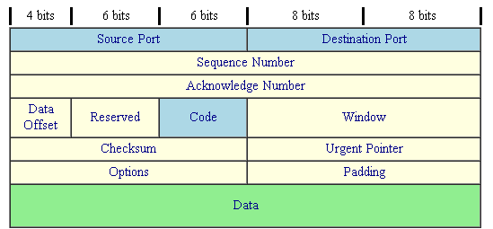

- Source Port & Destination Port (来源埠口 & 目标端口)
- Sequence Number (封包序号)由于 TCP 封包必须要带入 IP 封包当中，所以如果 TCP 数据太大时(大于 IP 封包的容许程度)， 就得要进行分段。这个 Sequence Number 就是记录每个封包的序号，可以让收受端重新将 TCP 的数据组合起来。
- Acknowledge Number (回应序号)为了确认主机端确实有收到我们 client 端所送出的封包数据，我们 client 端当然希望能够收到主机方面的响应，那就是这个 Acknowledge Number 的用途了。 当 client 端收到这个确认码时，就能够确定之前传递的封包已经被正确的收下了。
- Data Offset (资料补偿) 倒数第二行有个 Options 字段对吧！那个 Options 的字段长度是非固定的，而为了要确认整个 TCP 封包的大小，就需要这个标志来说明整个封包区段的起始位置。
- Reserved (保留)
- Code (Control Flag, 控制标志码)当我们在进行网络联机的时候，必须要说明这个联机的状态，好让接收端了解这个封包的主要动作。 这可是一个非常重要的句柄喔！这个字段共有 6 个 bits ，分别代表 6 个句柄，若为 1 则为启动。分别说明如下：
    - URG(Urgent)：若为 1 则代表该封包为紧急封包， 接收端应该要紧急处理，且图中的 Urgent Pointer 字段也会被启用。
    - ACK(Acknowledge)：若为 1 代表这个封包为响应封包， 则与上面提到的 Acknowledge Number 有关。
    - PSH(Push function)：若为 1 时，代表要求对方立即传送缓冲区内的其他对应封包，而无须等待缓冲区满了才送。
    - RST(Reset)：如果 RST 为 1 的时候，表示联机会被马上结束，而无需等待终止确认手续。这也就是说， 这是个强制结束的联机，且发送端已断线。
    - SYN(Synchronous)：若为 1，表示发送端希望双方建立同步处理， 也就是要求建立联机。通常带有 SYN 标志的封包表示『主动』要连接到对方的意思。
    - FIN(Finish)：若为 1 ，表示传送结束，所以通知对方数据传毕， 是否同意断线，只是发送者还在等待对方的响应而已。
- Window (滑动窗口)主要是用来控制封包的流量的，可以告知对方目前本身有的缓冲器容量(Receive Buffer) 还可以接收封包。当 Window=0 时，代表缓冲器已经额满，所以应该要暂停传输数据。 Window 的单位是 byte。
- Checksum(确认检查码)当数据要由发送端送出前，会进行一个检验的动作，并将该动作的检验值标注在这个字段上； 而接收者收到这个封包之后，会再次的对封包进行验证，并且比对原发送的 Checksum 值是否相符，如果相符就接受，若不符就会假设该封包已经损毁，进而要求对方重新发送此封包！
- Urgent Pointer(紧急资料)这个字段是在 Code 字段内的 URG = 1 时才会产生作用。可以告知紧急数据所在的位置。
- Options(任意资料)目前此字段仅应用于表示接收端可以接收的最大数据区段容量，若此字段不使用， 表示可以使用任意资料区段的大小。这个字段较少使用。
- Padding(补足字段)如同 IP 封包需要有固定的 32bits 表头一样， Options 由于字段为非固定， 所以也需要 Padding 字段来加以补齐才行。同样也是 32 bits 的整数。

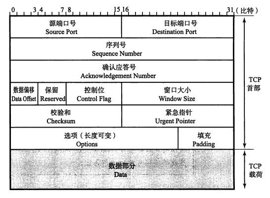

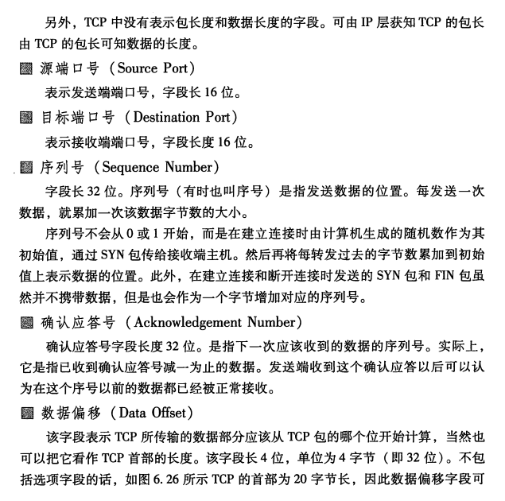

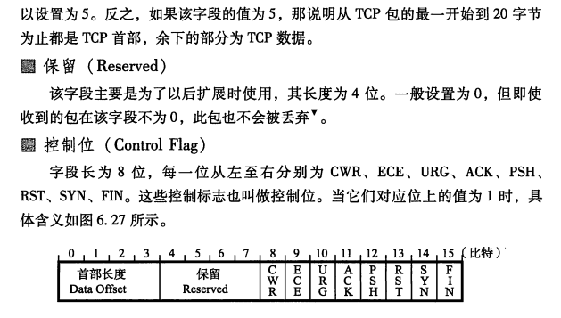

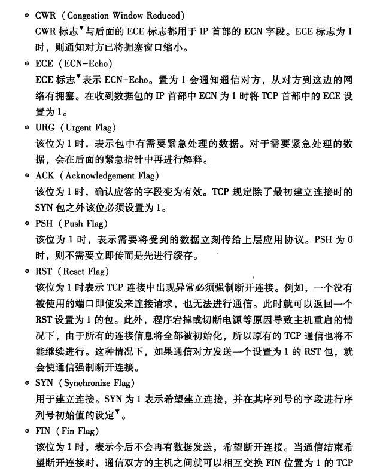


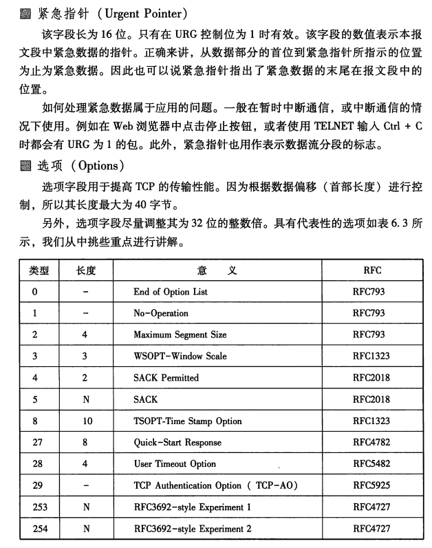


## TCP的三向交握

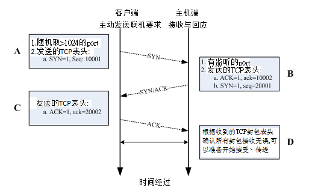

- A:封包发起
> 当客户端想要对服务器端联机时，就必须要送出一个要求联机的封包，此时客户端必须随机取用一个大于 1024 以上的端口来做为程序沟通的接口。然后在 TCP 的表头当中，必须要带有 SYN 的主动联机(SYN=1)，并且记下发送出联机封包给服务器端的序号 (Sequence number = 10001) 。

- B:封包接收与确认封包传送
> 当服务器接到这个封包，并且确定要接收这个封包后，就会开始制作一个同时带有 SYN=1, ACK=1 的封包， 其中那个 acknowledge 的号码是要给 client 端确认用的，所以该数字会比(A 步骤)里面的 Sequence 号码多一号 (ack = 10001+1 = 10002)， 那我们服务器也必须要确认客户端确实可以接收我们的封包才行，所以也会发送出一个 Sequence (seq=20001) 给客户端，并且开始等待客户端给我们服务器端的回应喔！


<!-- 网络传输不会传\0 -->

## UDP协议


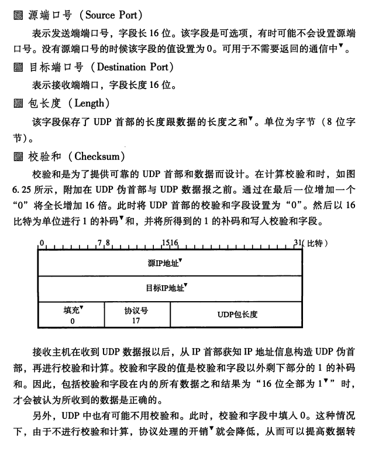

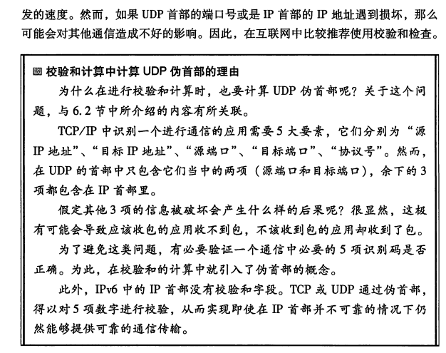


## 路由算法
### 距离向量算法
路由器之间可以互换目标网络的方向及其距离的相关信息,并以这些信息为基础制作路由控制表,距离向量算法中每个路由器掌握的信息都不相同,通往每个网络所耗的距离也根据路由器的不同而不同,缺点是不太容易判断每个路由上的信息是否正确

### 链路状态算法
在了解网络整体连接状态的基础上生成路由控制表的一种方法,所有路由器持有相同的信息,对于任何一台路由器与其他路由器保持同样的路由控制信息.只要每个路由器尽快地与其他路由器由步路由信息

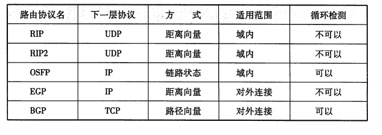


